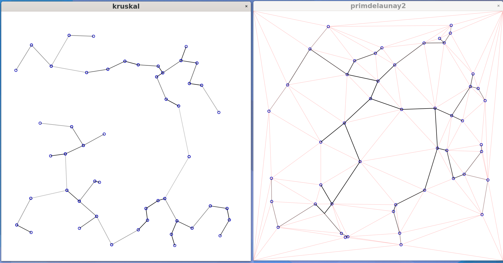

= Computer Programming with the Nim Programming Language
A gentle Introduction (C) Dr. Stefan Salewski 2020, 2021, 2022, 2023
//v0.1, 2023-APR-23
:doctype: book
:toc: left
:icons: font
//:experimental:
:imagesdir: https://ssalewski.de/tmp
//:imagesdir: http://ssalewski.de/gtkimages
//:source-highlighter: pygments
//:pygments-style: monokai
:source-highlighter: rouge
//:rouge-style: monokai
//:rouge-style: magritte
:rouge-style: molokai
//:stylesheet: nimbook.css

// all terms in lower case letters!
:wirth: Prof. Niklaus Wirth
:macos: macOS
:uc: microcontroller
:us: micro-second
:oop: Object-Oriented-Programming
:os: operating system
:proc: proc
:procs: procs
:profus: procedures and functions
:curnim: Nim v2.0
:twocom: two's complement
:cpp: C++
//:plus: +
// asterisk
:hashtag: #
:dhashtag: ##
:pp: ++
:behav: behavior
:cdefine: #define

////

asciidoctor -a stylesheet=asciidoctor.css nimprogramming.adoc
asciidoctor -a stylesheet=adoc.css nimprogramming.adoc

We are using these custom roles for clean semantic markup:
(Seems that we have to define these styles at the end of asciidoctor.css, as nimbook.css seems to be ignored?)

[.new]##
[.term] terminal text
[.user] user input
[.ndef] new unknown entity like stack
[.code] inline source code segment
[.imp] important
[.key] Nim keyword
[.op] Nim operator
[.var] Variable
[.lit] Literal
[.func] Function
[.type] Data Type

We use

<<section title>> for cross references
[[anchor]] for anchors
{nbsp}
+->+ disable replacements

NOTE: We should say a bit more about operators somewhere -- why i++ is not supported and about the new
unicode operators.

sed -E 's/ä([a-zA-Z]+) /\[\.\]\#\1\# /g' nimprogramming.adoc > hhh.adoc
~/.local/bin/pylanguagetool h.txt
~/.local/bin/pylanguagetool --pwl PWL h.txt

Intern references:
* https://docs.asciidoctor.org/asciidoctor/latest/html-backend/default-stylesheet/

////

[quote]
____
When you are not able to explain it with words, you may have to add pictures.
And when you even do not manage it with pictures, you can still make a video.
____

[.normal]

== About this book

In the year 1970, {wirth} invented the [.ndef]#Pascal# programming language to teach
his students the fundamentals of computer programming. While the initial core Pascal
language was designed for teaching purposes only, it was soon expanded by commercial
vendors and gained some popularity. Later, Wirth presented the language [.ndef]#Modula-2#
with improved syntax and support for modules for larger projects, and the
[.ndef]#Oberon# language family with additional support for [.ndef]#Object-Oriented
Programming#.

The [.ndef]#Nim# programming language can be seen in this tradition, as it is
basically an easy language suited for beginners with no prior programming experience,
but at the same time is not restricted in any way. Nim offers all the concepts of
modern and powerful programming languages in combination with high performance and
some sort of universality -- Nim can be used to create programs for tiny {uc}s as well
as large desktop apps and web applications.

Most books about programming languages concentrate on the language itself and assume
that the reader is familiar with the foundations of computer hardware and
already has some programming experience. This is generally a valid approach, as today
most people are taught this fundamental knowledge, sometimes called [.ndef]#Computer
Science# (CS) in school. But still, there are people who missed this introduction in
school for various reasons and decide later that they need some programming skills,
maybe for a technical job. And there may exist some children that are not satisfied
with the introduction to computer science taught at school. So we have decided to
start this book with a short introduction to fundamental concepts -- most people may
skip that part, but you should be really sure that you know these foundations.
This book is divided into six parts. It is possible to read the parts independently in arbitrary
order, but for Nim beginners, it is recommended to read them mostly in ascending order,
maybe while looking already early at some interesting sections in the second half of the book.
In part II, we explain the basics of computer programming step by step
in a way that should enable even children to learn independently. In this part, we may repeat
some of the stuff which we already mentioned in part I. We do that by intent, as some
people may skip part I, and because it is generally not a bad idea to support the learning
process of the reader with some repetitions.
Part III will give
you an overview of Nim's standard library, which contains many useful functions and data types,
that we can use in our programs to solve common tasks like input and output operations, using the file
system, or sorting of data.
In part IV, we will apply what we have learned
by solving some common programming tasks, like sorting, searching, or converting numbers from
the internal computer format to displayable text.
Part V will introduce some useful
external packages, which can be easily installed with one of Nim's package managers.
Nim has already a few thousand external packages -- some of them may support or replace
the standard library, and others offer special or advanced functionalities.
Part VI of the book
will finally introduce advanced concepts like [.ndef]#asynchronous
operations#, [.ndef]#threading# and [.ndef]#parallel processing#, [.ndef]#macros#
and [.ndef]#meta-programming#, and last but not least, Nim's concept implementation.
Some sections, that do not integrate well into the other six parts, or that are boring or useful only for a minority of
Nim users, have been moved to the Appendix and may not be part of a printed copy of the book.
This includes currently a short introduction to Nim's standard package manager, Nimble.

This book is basically a traditional textbook, a very simple one with detailed
explanations, so that kids from 14 years upwards can read and understand it
on their own, with no, or only minimal help from adults. The English language
may still be a problem for many kids not born in a country with a good
English language tradition, unfortunately. But luckily automatic
translations are already supported for some languages, and perhaps we
will be able to offer some translated editions later, possibly a Chinese
and a German translation?

In the last decades in the area of computer programming,
traditional textbooks have partly been replaced by videos and "Crash course" and "Learning
by doing" books. Well, maybe a good video may indeed help you start with a new
language, and a video may enable people with problems reading printed texts or with
difficulties concentrating on a topic for a few minutes to learn a programming language.
Unfortunately, the quality of most videos is very bad; some are made by kids just having
learned the first steps of computer programming themselves. And of course,
watching videos does not improve the reading and concentration issues that people have.
"Crash course" and "Learning by doing"
books may give you a good start, but for that, we already have a lot of textual tutorials.
The concern with these kinds of books is, that they may help you with solving some common tasks, but they do not
really support a deeper understanding. The idea of a "Crash course" and "Learning by doing" may not be that bad in general. But in computer
science, starting with a larger example application may be an overwhelming process, as you have to learn
a lot of stuff in parallel. It may work for you, but there is the danger that you forget all the details very quickly again.
And these kinds of books are not very helpful when you have to look up something.
The other concern with "Learning by doing" in computer science is, that learning materials
may have only examples which you may not really be interested in: Of course, we can create
a simple chat application, a simple Twitter clone, and do some basic web scraping using
async/await. Or create a basic game or a simple GUI with one of the dozen available toolkits.
But what when you are not interested in chatting and twittering, and that single selected toolkit?
We think that for such a case, reading the detailed examples can be very frustrating. So we
would recommend that after reading the first tutorial, and maybe a few pages of this book, you just start
coding with stuff you are interested in. Perhaps together with some friends? Whenever you should
need some concrete help, you should find it on the Internet, using search engines, Wikipedia, or
a discussion platform of your choice.
And if you have really no idea whatsoever of a project with which you can start,
then potentially computer programming is just not the right profession for you.

While Nim has a JavaScript backend and so supports web-related development well, this
book concentrates on native code generation using the C and {cpp} backends. We will
discuss some peculiarities of the JavaScript backend in the second half of the book,
and we may give some examples of the use of the JavaScript backend in the
Appendix. If you are strongly interested in web development and the
JavaScript backend, then you may also consult the book [.ndef]#Nim in Action# by
Dominik Picheta, which gives some detailed examples for the development of web-based
software with the Nim programming language, including a simple chat application and
the skeleton of a microblogging and social networking service. And you may consult
the tutorials and manuals of Nim web packages like [.ndef]#Karax#,
[.ndef]#Jester#, or [.ndef]#Basolato#.

This book will not try to explain things that are already explained well elsewhere, or
that should have been explained well elsewhere -- at least not in this first edition, where
we still have so much other essential stuff. So what we will leaf out, for now, is the installation
of the compiler, installing and using text editors or IDEs with special Nim support, using
Nim package managers like Nimble, Nimph, or others, using the foreign function interface (FFI)
to create bindings to C libraries, and internal compiler details like the various
memory management options, all the pragmas and similar. Also, we do not intend to
fill the book up with redundant stuff, like tables listing all the Nim keywords or Nim's
primitive data types and such, as you can find all that in the compiler manual easily.

While creating graphical user interfaces (GUIs) is an important topic, we can not
give many details for that due to various reasons: Nim has not yet the one and only
accepted GUI library, but more than 20 attempts -- from pure Nim ones like NimX or Fidget, over
wrapped libraries like GTK or QML, or GUIs that try to provide a native look for various {os}s like XWidgets or NiGui,
to web-based GUIs. And for each of these, at least for the more
serious ones, we could write a separate GUI book. So we will give only a few minimal examples
for some of them in parts IV or V of the book.

Also, we will not explain game programming, as game programming is
a broad area, and there are already a lot of tutorials available. Maybe in later editions of the
book, we will add some of these topics, e.g. game programming, as so many people like it.
But we will always have to ensure that a possible printed book version will not get
more than 500 pages, so we may then leave out some stuff in the printed version.

Generally, when learning a new programming language, people start with some short
tutorials before really learning the language following a book. This way is indeed a good start.
So we recommend you to read the short official tutorials, parts 1 and 2, and perhaps also
some other tutorials freely available online. Tutorials generally only scratch the topics, so you may not be able to understand them all
really well, but this way you get already a feeling for the language.
There exist also
some video tutorials,  in case you have problems reading, but in that case,
this book will not be of much use to you at all.
When you know already some computer science and have already experience
with other languages like {cpp}, Haskell, or Rust, then the tutorials and the Nim compiler manual
may be fully sufficient for you, and you may not need this book at all. Or you may prefer the
recently published book of Mr. Rumpf, called "Mastering Nim: A complete guide to the programming language"
available at Amazon.com.

This book is based on the Nim reference implementation of the team around
Mr. A. Rumpf.
While the first pages of this book were written already in the spring of 2020, it should be mostly up-to-date
with the latest stable version 1.6 of the Nim 1.x series. Most explanations and examples should
be valid also for other implementations like the  https://github.com/nim-works/nimskull variant.
Mr. Rumpf has announced the Nim 2.0 release for early 2023. The v2.0 release brings a lot of improvements
but has no serious breaking changes that would invalidate old code -- only a few small modifications may be
needed for old code to make it compile and run again. In this book, we may use and discuss a few Nim 2.0
features, but all code should be compilable with the 1.x series of the compiler or with nimskull (cyo) with no
or only tiny changes. The most important change for Nim 2.0 is that ORC memory management is now the default,
indicating that it is considered ready for use in production. ORC gives us GC-like, fully deterministic memory management
with minimal overhead compared to fully manual memory handling. It reduces the maximal memory consumption of apps,
avoids GC-generated delays, and may increase the performance of our programs. Additionally, ARC and ORC memory management
should bring serious advantages for the creation and performance of threaded and parallel code.
We have summarized the most important new features of Nim 2.0 in the appendix: <<Changes for Nim 2.0>>

Note, that incremental compilation (IC) or CPS task scheduling (Continuation-passing style) is still in development and not fully supported
by Nim v2.0 yet. And for parallel and threaded code execution, it may be useful to consider high-quality external
libraries rather than the ones in Nim's standard library.footnote:[https://forum.nim-lang.org/t/9768#64336]. The same may apply to
modules for asynchronous code execution and a few other libraries.footnote:[https://github.com/status-im/nim-chronos]

****
For a short overview of the Nim programming language, you may also consult the page
https://nimprogramming.com/.

For the latest news about the language, installation instructions, and much more useful information, visit
the official homepage at
https://nim-lang.org/

An alternative Nim implementation, which may later develop into another language, is available at
https://github.com/nim-works/nimskull

The source code for the book is hosted at https://github.com/StefanSalewski/NimProgrammingBook.
You may use the GitHub issue tracker to point us to mistakes or unclear explanations; we will try to
fix that. Please note that we are more interested in comments on the content of the book currently, not that much
in typos or grammar issues. Before the book will be officially published or a printed
version will be created, we will run it through some correction software or hire a professional
proofreader.

//[.new]#New sections and serious content changes are now (end of 2021) marked with a yellow background#, [.recent]#and
//not that new stuff is still marked with a light yellow.# For details, you may see the change log in the appendix.
****

.About the Author
****
Dr. S. Salewski studied Physics, Mathematics, and Computer Science at Hamburg
University (Germany), where he got his Ph.D. in 2005 in the area of laser physics. He has worked
in the field of fiber laser physics, electronics, and software development, using languages like
Pascal, Modula-2, Oberon, C, Ruby, and Nim.
Some of his software projects, including the
Nim GTK GUI bindings and Nim implementations of an N-dimensional RTree and a fully
dynamic, constrained Delaunay triangulation, are freely available as open-source
projects at https://github.com/StefanSalewski.
****

.ChatGPT
****
You may have already heard about ChatGPT, an AI (artificial intelligence) chatbot developed by OpenAI.
ChatGPT was launched as a prototype on November 30, 2022, and quickly garnered attention for its detailed
responses and articulate answers across many domains of knowledge.footnote:[https://en.wikipedia.org/wiki/ChatGPT]
While this book was still written by a real human, parts of it could have been created
by ChatGPT, perhaps with a more fluent sound and fewer spelling errors
and grammar issues. So this book, or at least parts of it, may be considered
obsolete now :-(. While ChatGPT has some serious issues still (better not ask it about
the author of this book, the creator of the Nim language, or other Nim core devs) it
can provide very valuable information about some topics. We were really surprised at how much it
already knows about the Nim language, despite the fact that Nim is tiny compared to the current mainstream
languages. To use ChatGPT, you would have to register with your real name and phone number.
We think that is OK to prevent misuse. The basic service is still free. A professional
version with a monthly payment may appear soon, but the free basic version still works.
When you log in to the OpenAI homepage ( https://chat.openai.com/auth/login?next=/chat) you can
ask the bot questions, ask it to create a simple Nim program for you, fix errors in your program, or
add comments. The bot may even be able to convert source code from other languages to Nim.
Or it can rephrase text, so you may provide it with a section of this book and then ask it
to rewrite with better grammar or maybe extend the content. Some possible tasks you can ask
ChatGPT to do:

* Do you know the Nim programming language?
* What does the Nim statement 'echo 1 + 2' print to the screen?
* And can you guess what the Nim statement 'echo 1, 2' would print?
* Are you sure that the two arguments provided to the echo statement are
separated with a space?
* I just tested it. I run the Nim program 'echo 1, 2' called t.nim with the
command 'nim r t.nim' and it prints "12", so there is no space involved!
* Please create a Nim program, that prints the numbers
one to 10 each on its own line.
* I will insert a small Nim program with issues in the prompt; please fix it.
* [insert code here]
* Can you please add some comments to the source code?

Of course, you should not really trust the advice of ChatGPT. Currently (early 2023)
it thinks that the echo command automatically adds spaces between the printed values.
Of course, that is wrong, and we can convince ChatGPT of that. But ChatGPT
can currently not remember what it has learned in a user dialog, so next time
it makes the same errors again. Note that ChatGPT was trained with data only up to 2021,
so it may not know about Nim 2.0 and other recent changes.

Below is a complete dialog with ChatGPT from early 2023:
****

----
One more question about the Nim programming language. The following code to convert a string to an integer number does not compile. Can you fix it?
`var s: string = "123"; var i: int = int(s)`

Yes, the code you provided is not valid Nim syntax. In order to convert a string to an integer in Nim, you can use the parseInt procedure from the strutils module.

Here's an example of how to use it:
----

[source, nim]
----
import strutils

var s: string = "123"
var i: int = parseInt(s)
echo i  # Output: 123
----

----
In this example, we import the strutils module, which provides the parseInt procedure for parsing integers from strings. Then, we define a string s 
with the value "123", and use parseInt to convert it to an integer, which we store in the variable i. Finally, we use echo to print the value of i.
----

Since spring 2023, GPT-4 has been available for paying subscribers and provides more helpful information and less nonsense.

= Part I: Introduction

[quote]
____
Give me a video, I get a headache from reading.footnote:[https://irclogs.nim-lang.org/19-03-2023.html#00:04:26]
____

[.normal]

For using computers and writing computer programs, you initially do not have to know
many details. It is basically like driving a car: Although a car is a powerful and
complicated tool, kids generally can drive it after a 3-minute introduction. Still,
good racing drivers typically need a much broader insight into the inner working of
all the technical components, and finally, a lot of practice.

== What is a Computer?

A computer is primarily a device that can run computer programs, by following
instructions about how to manipulate data.

Nearly all the
computers currently in use, from the tiny ones integrated into electronic gadgets, the
well-known desktop computers (PCs), to large and powerful supercomputers filling out
entire rooms, work internally with digital data only.footnote:[In the past, some forms
of analog computers existed, some worked mechanically, and some used analog voltages or
currents as input and output signals. Indeed, one important device, which is still very
common in analog electronics, is the summing amplifier, which can sum up multiple
electric voltages.] Digital data are basically integer (whole) numbers encoded in
binary form, which are represented by sequences of the symbols [.ndef]#0# and [.ndef]#1#. We
will discuss the term digital in the next section in more detail.

The most important part of a digital computer is the [.ndef]#CPU#, the
[.ndef]#Central Processing Unit#. That tiny device is built of digital electronic
circuits and can perform very basic mathematical and logical operations on numbers,
like adding two numbers or deciding if a number is larger or smaller than another
number. Most computer CPUs can only store very few numbers internally, and forget
the numbers when the power is switched off. So the CPU is typically electrically
connected to a [.ndef]#RAM# module, a [.ndef]#Random Access Memory#, which can store
many more numbers and allow fast access to these numbers, and to a [.ndef]#Hard disk#
or [.ndef]#SSD# device, which can permanently store the numbers but does not allow
such fast access. The stored numbers are most often called just [.ndef]#data# --
basically, that data is nothing more than numbers, but it can be interpreted in many
ways, such as pictures, sounds, and much more.

The traditional hard disk drives (HDD), which store data electromechanical on rotating magnetic disks, as
well as the more modern variants, the solid-state-devices (SDD), which store data using modern semiconductor
technologies, can store data persistently for longer time periods, even when no electric power
supply is available. Both, SSDs and HDDs, can be optionally split into multiple partitions, e.g. one or multiple OS partitions
for executable programs or pure data partitions for passive data like text files or pictures.
Before use, each partition is generally formatted and a file system (FS) is created. These two steps
create an internal structure on the storage device, which allows us to store and retrieve individual data
blocks like programs, text files, or pictures.

Nearly all of today's desktop computers, and even most notebooks and cellphones
contain not only a single CPU, but multiple CPUs, also called "Cores", so they can
run different programs in parallel, or a single program can run parts of it on
different CPUs, to increase performance or reduce total execution time. The so-called
supercomputers can contain thousands of CPUs. Besides CPUs, most computers have also
at least one [.ndef]#GPU#, a [.ndef]#Graphic Processing Unit#, that can be used to
display data on a screen or monitor, maybe for doing animations in games or for
playing video. The distinction between CPU and GPU is not really sharp; usually, a
CPU can also display data on screens and monitors, and GPUs can do also some data
processing that CPUs can do. But GPUs are optimized for the data display task.

More visible to the ordinary computer user are the peripheral devices like a keyboard,
mouse, screen, and perhaps a printer. These enable human interaction with the computer,
but are in no way a core component of it; the computer can run well without them. In
notebooks or laptop computers or in cell phones, the peripheral devices are closely
integrated with the core components. All the physical parts of a computer are also
called [.ndef]#hardware#, while the programs running on that hardware are called
[.ndef]#software#.

A less visible but also very important class of computers are [.ndef]#{uc}s# and
so-called [.ndef]#embedded devices#, tiny pieces with typically a hull of black plastic
with some electrical contacts. The devices can contain all necessary elements,
that is the CPU, some RAM, and persistent storage that can store programs and data when no
electric power supply is available. These devices may be restricted in computing
power and the amount of data that they can store and process, but they are contained
in many consumer devices. They control your washing machine, refrigerator, television,
radio, and much more. Some devices in your home may even contain multiple {uc}s and
often the {uc}s can already communicate with each other by RF (Radio-Frequency), or
access by WLAN the internet, which is sometimes called the [.ndef]#Internet of Things#
(IoT).

Another class of large and very powerful digital computers is called
[.ndef]#mainframe computers# or [.ndef]#supercomputers#, which are optimized to
process large amounts of data very fast. The key to their gigantic computing power is
that many fast CPUs work in parallel -- the problem or task is split into many small
parts that are solved by one CPU each, and the final result is then the combination
of all the solved sub-tasks. Unfortunately, it is not always possible to split large
problems into smaller sub-tasks.

Digital computers are usually driven by a clock signal that pulses at a certain
frequency. The CPU can do simple operations like the addition of two integers at
each pulse of the clock signal. For more complicated operations like a multiplication
or a division, it may need more clock pulses.

//Digital computers are generally driven by a rectangular shaped binary clock signal, that is
//an electrical voltage that jumps continuously from maybe a level of 0 Volt to a level
//of 1 Volt and back. The CPU can do simple operations like the addition of two
//integers for each (upwards) transition of the clock signal, for more complicated
//operations like a multiplication or a division it may need more clock periods.

So a rough measure for the performance of a computer is the clock rate, that is the
number of clock pulses per second, divided by the number of pulses that the CPU needs
to perform a basic operation, multiplied by the number of CPUs or Cores that the
computer can use.

A totally different kind of computers are [.ndef]#Quantum Computers#, large,
expensive high-tech devices, which use the rules of [.ndef]#quantum mechanics# to
calculate many computations in parallel. Today only a few of them exist, for research
at universities and some large commercial institutes. Quantum computers may at some
time in the future fundamentally change computing and our whole world, but they are
not the topic of this book.

== Analog and Digital

Whenever we measure a quantity based on some tiny base unit, then we work in the
digital area, and we measure with some granularity. Our ordinary money is digital in some
way, as the cent is the smallest base unit; you will never pay a fraction of a cent
for something. Time can be seen as a digital quantity as long as we accept the
second as the smallest unit. Even on so-called analogue watches, the second hand will
generally jump forwards in steps of a second, so you can not measure fractions of a
second with that watch.

An obvious analogue property is the thermodynamic temperature and its classic
measurement device is the well-known capillary thermometer consisting of a glass
capillary filled with alcohol or liquid mercury. When temperature increases, the
liquid in a reservoir expands more than the surrounding glass and partly fills the
capillary. That filling rate is an analogue measure for the temperature.

While the hourglass works digitally (you can count the tiny sand grains), the sundial
does not.

Most of the quantities in our real world seem analog, and digital quantities seem to
be some sort of arbitrary approximation.

//All the quantities in our real world seems to be not digital or granular,
//so digital quantities seems to be some sort of arbitrary approximation.

But [.ndef]#quantum mechanics# has taught us that many quantities in our world really
have a granularity. Physically, quantities like energy or momentum are indeed
multiple of the tiny [.ndef]#Planck constant#. Or consider electric charge, which
is always a multiple of the [.ndef]#elementary charge unit# of one electron. Whenever
an electrical current is flowing through an electrically conducting wire, an ionized
gas, or an electrolyte like saltwater, there are flowing multiple of the elementary
charge only, never fractions of it. And of course, light and electromagnetic radiation
also have some form of granularity, which the photoelectric effect, as well as Compton
scattering, proves.

An important and useful property of digital signals, and digital data, is that they map
directly to integral numbers.

The simplest form of digital data is binary data, which can have only two distinct
values. When you use a mechanical switch to turn the light bulb in your house on, or
of, you change the binary state of the bulb. And your neighbor, when watching your
house, receives binary signals.footnote:[Well, when we watch very carefully, we will
notice that the signal is not really digital -- when we switch on, the filament may
take a few milliseconds to heat up, and when we switch off, the filament takes again
a few milliseconds to cool down.]

Digital computers are generally using binary electric states internally -- voltage or
current [.term]#on# or [.term]#off#. Such an on/off state is called a bit. We will
learn more about bits and binary logic later. One bit can store obviously only two
states, which we may map to the numbers [.term]#0# and [.term]#1#. Larger integer
numbers can be represented by a sequence of multiple bits.

The [.ndef]#Morse code# was an early application to transmit messages encoded in
binary form.

A very important property of digitally encoded numbers (data) is that they can be
copied and transmitted exactly without loss of precision. The reason for this is that digital numbers have a
well-defined clean state, there is no noise that overlays the data and may
accumulate when the data is copied multiple times. Well, that statement is not really
true -- under bad conditions, the noise can become so large that it changes the binary
state of signals. Imagine we try to transfer some whole numbers encoded in binary
form, maybe by binary states encoded as voltage level [.term]#0 Volt# and [.term]#5
Volts#, over an electric wire and a long distance. It is clear that the long wire can
pick up some electromagnetic noise that can change the true [.lit]#0# Volt data to a voltage
that is closer to [.lit]#5# Volts than to the true [.lit]#0# Volt level, so it is received
incorrectly. To catch such types of transmission errors, [.ndef]#checksums# are added
to the actual data. A checksum is derived by a special mathematical formula from the
original data and transferred with it. The receiver applies the same formula to the
received data and compares the result with the received checksum. If it does not
match, then it is clear that the data transmission is corrupted, and a resend is
requested.

// I think you should leave the following statement out, or omit the whole paragraph. -Jim
//But the field of data transmission and its error detection is not the topic of this book.

The opposite of digital is generally called analogue, a term that is used for data
that have or seems to have no granularity. For example, we speak of an analogue
voltage when the voltage can have each value in a given range and when the voltage
does not "jump" but change continuously.footnote:[Of course, even digital electric
signals can not really "jump" from one digital state to another, but the transition
time is much shorter than the time duration of the steady state, so the signal has a
rectangular shape when we watch it on an oscilloscope, it looks like +__--__--__+.]
For observing analogue voltages or currents, one can use a moving coil meter, a device
where the current flows through a coil in a magnetic field and the magnetic force
moves the hand/pointer.

We said in the previous section that nearly all of our current computers work with
digital data only. Basically, that is that they work internally with integer numbers,
stored in sequences of binary bits. All input for computers must have the form of
integer numbers and all output has the form of integer numbers. Whenever we want to
feed computers with some sort of analogue data, like an analogue voltage, we have to
convert it into a digital approximation. For that task, special devices called
[.ndef]#analog to digital converters# (ADC) exist. And in some cases, we have to
convert the digital output data of computers to analogue signals, like when a
computer plays music: The computer output in form of digital data is then converted
by a device called [.ndef]#digital to analog converter# (DAC) into an analogue
voltage, that generates an analogue current through a coil in the speakers of our
soundbox, and that electric current in the coil generates a magnetic field which
exercises mechanical forces and moves the membrane of the speaker, resulting in
oscillating motions, which generates air pressure variations that our ear can detect
and that we finally hear as sound.

== What is an Operating System?

Most computers, from cellphones to large supercomputers, use an [.ndef]#{os}# (OS).
A well-known OS is the GNU/Linux kernel. Operating systems can be seen as the initial
program, that is loaded and started when we switch the computer on and that works as
some kind of supervisor:footnote:[Well, before the OS is loaded and starts execution,
often another tiny program called a [.ndef]#Boot Manager# is launched. Boot managers
are used to select different {os}s to boot, maybe Linux or Windows, or to pass
parameters as the hard disk boot partition number to the OS.] it can load other
programs, and it distributes resources like CPU cores or RAM between multiple running
programs. It also controls user input by keyboard and mouse, displays output data on
the screen -- as text or graphics, controls how data is loaded and stored to
nonvolatile storage media like hard disk or SSD, manages all the network traffic, and
many more tasks. An important task of the OS is to allow user programs to access all
the various hardware components from different vendors in a uniform, high-level
manner. An OS can be seen as an intermediate layer between user programs, like a text
processor or a game, and the hardware of the computer. The OS allows user programs to
work on a higher level of abstraction, so they do not need to know much about the
low-level hardware details.

An important ability of most modern {os}s is to run multiple system and user
programs concurrent or parallel. Concurrent execution of programs means, that
the execution switches very fast between all the active programs. That way the user
does not notice when programs do pause for a short time interval, and all of them
seem to be running all the time, but not at full speed.
True parallel execution of programs indicates, that all of them can
permanently run at full speed -- this is only possible when the computer
has multiple CPUs or a CPU with multiple physical cores.

Computer operating systems have generally a close relation to software libraries, which
are collections of data types and functions working with that data types. Libraries can
be a part of the OS or can be more or less independent of the OS. Libraries are software
components that provide data types and functions with a well-defined interface
(API, Application Programming Interface) and {behav}.

Libraries can be used as shared libraries, which are single binary files stored on the file system of a computer,
often with the file extension [.term]#.so# or [.term]#.dll#, which can be accessed from different computer programs simultaneously,
or as static libraries, which are part of single programs. Shared libraries have some advantages: we need only one
instance on the file system of the computer, and the library is loaded only once into the computer memory (RAM), even when
it is used by different apps simultaneously. This saves space, and when the library has serious errors, it is in principle possible to
replace the library with a corrected version, which is then used by all the software on the computer. Shared libraries often come in
numbered versions, where a higher number denotes a newer, improved, or extended library version. Sometimes some of the
programs we use may need still an older library version, while other software needs already a newer one. In that case,
our file system has to provide multiple versions of a shared library, which can be used independently.
On the other hand, statically linked libraries are directly glued with a single computer program.
That makes the distribution of the program easier, as it can be shipped as a single entity,
and we do not have to ensure that all the needed dynamic libraries are available on the destination computer.
But if a statically linked library has serious errors, then we have to replace all the programs that are linked
statically with that corrupted library.

//Current Linux kernel version 5.15 has 32 million lines of source code!

Small {uc}s and embedded devices often do not need to use an {os}, as they generally
run only one single-user program and because they usually do not have a large variety
of hardware components to support.

== What is a User Interface

To interact with the OS and with application programs running on the
computer, we need some form of a user interface. Traditional user interfaces
are text-centric and often provided directly by the OS as one single text screen
filling the whole display: The user has to enter textual commands and the computer
reacts with textual messages.
For entering commands and data, a keyboard is used, which layout was heavily
inspired by the classical mechanical typewriter.
For desktop computers, the textual user interfaces
have been mostly replaced or at least supported by graphical user interfaces (GUIs)
for about a half-century now, and even cellphones and other electronic
gadgets now use some form of a GUI for user interaction. For large mainframe
computers, the textual user interface is still common. Graphical user interfaces
present the user with a set of icons or widgets, often arranged in rectangular graphical
boxes called windows. These windows can be moved around, resized, and can partly or fully overlap
other windows. A special type of window is called a terminal-, shell- or console-window,
which behaves like the traditional full-screen textual user interfaces. 
Graphical user interfaces allow it to interact with the computer
by simple actions like clicking on buttons or by drag or wipe gestures, performed
directly on a touch-sensitive display or with a device called a mouse, which mirrors
its mechanical movement on the table to a graphical cursor on the computer display, and provides
a set of pushbuttons that are used to initiate a click action when the mouse pointer hovers
over an icon or widget. The main advantage of graphical user interfaces is, that the user does not have to
remember and type in long command sequences.
A set of on-screen buttons labeled with single letters can even simulate a traditional keyboard,
but when the input of longer textual data is required, the physical keyboard is still used. 
Graphical user interfaces are sometimes even supported by speech recognition
systems, which are used to enter commands or textual messages vocally.
Graphical user interfaces may be very strongly coupled with the OS but are
basically still system programs executed by the OS. For the Microsoft Windows
OS or the {macos}, this distinction is not that obvious, as the same GUI
is running permanently. For other {os}s like Linux, it is more obvious, as
these {os}s are sometimes used without a GUI, and because various
GUI tool kits like Gnome, KDE, and many more are available. 

== What is Computer Programming?

Computer programming includes the creation, testing, and optimization of computer
programs.

== What is a Computer Program?

A computer program is basically a sequence of numbers, which make some sense to a
computer CPU, in such a way that the CPU recognizes the numbers as so-called
[.ndef]#instructions# or [.ndef]#numeric machine code#, maybe the instruction to add
two numbers.

The first computers, built in the 1950s, were indeed programmed by feeding sequences
of plain numbers to the device. The numbers were stored on so-called [.ndef]#punch
cards#, consisting of strong paper, where the numbers were encoded by holes in the
cards. The holes could be recognized by electrical contacts to feed the numbers into
the CPU. As plain numbers do not match well with human thinking, soon more abstract codes
were used. A very direct code, which matches numerical instructions to symbols, is
the [.ndef]#assembly language#. In that language, for example, the character sequence
"add A0, $8" may map directly to a sequence of numbers which instructs the CPU to add
the constant integer number 8 to CPU register A0, where A0 is a storage area in the
CPU where numbers can be stored. As there exist many different types of CPUs, all
with their own instruction sets, there exist many different assembly instruction
sets, with similar, but not identical instructions. The rules that describe how these
basic instructions have to look are called the [.ndef]#syntax# of the assembly
language.

The numerical machine code, or the corresponding assembly language, is the most basic
instruction set for a CPU. Every instruction that a CPU can execute maps to a
well-defined assembly instruction. So, each operation that a computer may be able to
perform can be expressed in a sequence of assembly instructions. But complicated
tasks may require millions of assembly instructions, which would take humans very
long to write, and even much longer to modify, proof, and debug.footnote:[The search
for the reason why a program does not do exactly what was hoped for by its creators
is called debugging. That term is still a legacy from the very first computers in the
50s, where logical circuits were built by mechanical relays, for example, a logical
[.term]#and# operation was built by two relays in a series connection. To let the
current flow, both of them would have to be in the conducting state. And it was told
that sometimes insects walked onto the electric contacts of the relays and blocked
them. Today, mis{behav} of computer programs is rarely due to hardware faults, but
the term "bugs" for errors and "debugging" for finding and fixing the errors, was
kept.]

Just a few years after the invention of the first computers, people recognized that
they would need even more abstract instruction sets, like repeated execution,
composed conditionals, or other data types than plain numbers as operands. So higher-level
programming languages like Algol, Fortran, C, Pascal, or Basic were created.

//Simple C program here, with its assembly code from godbolt.org.

== What is an Algorithm?

An [.ndef]#algorithm# is a detailed sequence of more or less abstract instructions to
solve a specific task or to reach a goal. Cooking recipe books and car repair
instructions are examples of algorithms.

//They are a generalized, only symbolically
//representative pattern of all the necessary steps required to perform a certain task.

The basic math operations kids learn in
school -- to add, multiply or divide two numbers with paper and pencil -- are algorithms
too. Even starting a car follows an algorithm -- when the temperature is below zero,
and snow covers the vehicle, then you first have to clean the windows and lights. And
when you first drive again after a long break, you would have to check the tires
before you start the engine. The algorithm can be carried out by strictly following the
instructions -- it is not necessary to really understand how and why it works.

So an algorithm is a perfect fit for a computer, as computers are excellent at
following instructions without really understanding what they are trying to
accomplish.

A math algorithm to sum up the first 100 natural numbers may look like this:

[source]
----
use two integer variables called i and sum
assign the value 0 to both variables

while i is less than 100 do:
  increase i by one
  add value of i to sum

optionally print the final value of sum
----

== What is a Programming Language?

Most traditional programming languages were created to map algorithms to elementary
CPU instructions. Algorithms typically contain nested conditionals, repetition, math
operations, recovery from errors, and maybe plausibility checks. A more complicated algorithm
generally can be split into various separate logical parts, which may include reading in data at one point,
multiple processing steps at another, and storing, or displaying data as plain text, graphics, or
animation at yet another point. This splitting into parts is mapped to programming languages by grouping
tasks into subroutines, functions, or procedures which accept a set of input
parameters and can return a result.

// Propose of
//This splitting of the various distinct types of
//data manipulating structures into parts, an overarching problem into small, single-purposed sequence
//of actions, ordered according to the nature of the data manipulation operations that they process for
//the larger program between each-other, is mapped onto programming languages, by grouping tasks
//into their own subroutines, functions or procedures, which accept a set of input parameters and can
//return a result.

As algorithms often work not only with numbers
but also with text, it makes sense to have a form of textual data type in a
programming language too. And all the data types can be grouped in various ways, for
example, as sequences of multiple data of the same type, like lists of numbers or
names. Or as collections of different types, like name, age, and profession of a
citizen in an income tax database. For all these use cases, programming languages
provide some sort of support.

== Compilers and Interpreters

We already learned that the CPU in the computer can execute only simple instructions,
which we call numeric machine code or assembly instructions.

To run a program written in a high-level language with many abstractions, we need some
sort of converter to transform that program into the basic instructions that the CPU can
execute. For the conversion process, we have basically two options: We can convert the
entire program into machine code, store it on disk, and then run it on the CPU. Or we
can convert it into small portions, maybe line by line, and run each portion whenever
we have converted it. Tools that convert the whole program first are called
compilers. [.ndef]#Compilers# process the program that we have written, include other
source code like needed library modules, check the code for obvious errors, and then
generate and store the machine code that we then can run.

Tools that process the
source code in small portions, like single statements, are called
[.ndef]#interpreters#. They read a line of source code, investigate it to check if
it is a valid statement, and then feed the CPU with corresponding instructions to
execute it. It is similar to picking strawberries: you can pick one and eat it at
once, or you can put them all into a basket and eat them later. Both interpreters and
compilers have advantages and disadvantages for special use cases. Compilers can
already detect errors before the program is run, and compiled programs generally run
fast, as all the instructions are already available when the programs run. The
compiling step takes some time, of course, at least a few seconds, but for some
languages and large programs, it may take much longer. That can make the software
development process slow because as you add or change code, you have to compile it
before you can execute and test your program. That may be inconvenient for unskilled
programmers, as they may have to do much testing. Some use a programming style that
is: change a tiny bit of the source code, then run it and see what it does. But
more common practice is that you think about the problem first and then write the
code, which then in most cases does nearly that of what you intended. For this style of
programming, you do not have to compile and execute your code that often. Compilers
have one important benefit: they can detect many bugs, mostly typing errors, already
in the compile phase, and they give you a detailed error message. Interpreters have
the advantage that you can modify your code and immediately execute it without delay.
That is nice for learning a new language and for some fast tests, but even simple
typing errors can only be detected when they are encountered while running the
program. If your test does not try to run a faulty statement, there will be no error,
but it may occur later. Generally, interpreted program execution is much slower than
running compiled executables, as the interpreter has to continually process the
source code in real-time as it's being run, while the compiler does it only once before the program is run. At the
end of this section, a few additional notes:

Compilers are sometimes supported by
so-called linkers. In that case, the compiler converts the source code, which can be
stored in multiple text files, each in a sequence of machine code instructions, and
finally, the linker joins all these machine code files to the final executable. Some
compilers do not need the linking step or call the linker automatically. And some
interpreters convert the textual source code in one very fast, initial pre-processing
step ("on the fly") to a so-called [.ndef]#byte code#, that can then be interpreted faster. The
languages Ruby and Python do that. Some languages, like Java, can compile and optimize
the source code while the program is running. For that process, a so-called [.ndef]#virtual
machine# is used, which builds an intermediate layer between the hardware and the user
program.

== Types of Programming Languages

There are many different styles that software can be written. A programming paradigm
is a fundamental style of writing software, and each programming language supports
a different set of paradigms. You’re probably already familiar with one, or more
of them, and at the very least, you know what [.ndef]#object-oriented programming# (OOP) is
because it’s taught as part of many introductory computer science courses.

We already mentioned the assembly languages, which provide only the basic operations
that the CPU can perform. Assembly languages provide no abstractions, so maybe we
should not even call them programming languages at all. Then there are low-level
languages like Fortran or C, with some basic abstractions, which still work close to
the hardware and which are mostly designed for high performance and low resource
consumption (RAM), but not to detect and prevent programming errors or to make life
easy for programmers. These languages already support some higher-order data types,
like floating-point numbers or text (strings), homogeneous, fixed-size containers
(called [.type]#arrays# in C), or heterogeneous fixed-size containers (called structs in C).

A different approach is taken by languages like Python or Ruby, which try to make
writing code easier by offering many high-level abstractions and which have better
protection against errors but are not as efficient. These languages also support
dynamic containers, which can grow and shrink, or advanced data structures like hash
tables (maps) or support textual pattern matching by regular expressions (regex).

Another way to differentiate programming languages is if they are statically or
dynamically typed. Ruby, Python, and JavaScript are all examples of dynamically typed languages,
that is, they use variables that can store any data type, so the variable's type
of data that it accepts can therefore dynamically change during program execution. That seems comfortable for the user, and
sometimes it is, especially for short programs, which may be written for one-time use
only and are sometimes called scripts. But dynamic typing makes the discovery of logical
errors harder -- an illegal addition of a number to a letter may be detected only at
run-time. And dynamically typed languages generally waste a lot of memory and their
performance is not that great.
It is as if we would own a set of large, equally-sized moving boxes, and we
would store all of our goods in it, each piece in one box.

For statically typed languages, each variable has a well-defined data type like
integer number, real number, a single letter, a text element, and many more. The data
type is either assigned by the author of the program with a type declaration, or is detected
by the compiler itself when processing the program source code, called [.ndef]#type inference#, and
the variable's type does never change. In this way, the compiler can check for logical
errors early in the compile process, and the compiler can reserve memory blocks
exactly customized to the variables that we want to store, so total memory
consumption and performance can be optimized. Referring again to our boxes example,
statically typing is like using customized boxes for all your goods.

All these types of programming languages are often called [.ndef]#imperative programming
languages#, as the program describes detailed what to do. There are other types of
programming languages too, for example, languages like Prolog, which try to give only
a set of rules and then let the computer try to solve a problem with these rules. And
of course, there are the new concepts of [.ndef]#artificial intelligence# (AI) and
[.ndef]#machine learning# (ML), which are less based on algorithms and more on neural
nets, which are trained with a lot of data until they can provide the desired results. Nim,
the computer language this book is about, is an imperative language, so we will focus
on the imperative programming style in this book. But of course, Nim can be used to
create AI applications.

Further still, we can differentiate between languages like C, {cpp}, Rust, Nim, and many more
that compile to native executables and can run directly on the hardware of the
computer, contrasted with languages like Java, Scala, Julia, and some more, that use a large
[.ndef]#Virtual Machine# (VM) as an intermediate layer between the program and the
hardware, and interpreted languages like Ruby and Python. Languages using a virtual
machine generally need some startup time when a program is invoked, as the VM must be
loaded and initialized, and interpreted languages are generally not very
fast.footnote:[Exactly speaking, Ruby and Python do not really interpret the source
code but compile it on the fly to byte-code, which is then interpreted. And there
exist some variants of Ruby and Python that compile with some success to native
machine code. Crystal is a variant of Ruby, with some significant differences, that
compiles to fast native machine code.] The distinction between languages that compile
to native executables, and those that are executed on a virtual machine, is not really sharp.
For example, Kotlin and Julia were executed on a virtual machine initially but now
can compile the source code to native executables.

An important class of programming languages is the group of so-called [.ndef]#{oop}# (OOP)
languages, which use inheritance and dynamic dispatch and become popular in the
1990s. For some time, it was assumed that {oop} was the ultimate solution to manage
and structure really large programs. Java was the most prominent example of the OOP
languages. Java forces the programmer to use OOP design, and languages like {cpp},
Python, or Ruby strongly push the programmer to use the OOP design. The practice has shown that
OOP design is not the ultimate solution for all computing problems, and OOP design
may prevent optimal performance. So newer languages, like Go, Rust, and Nim, support
some form of OOP programming but use it only as one paradigm among many others.

Another popular and important class of programming languages is JavaScript and its
more modern cousins like TypeScript, Kotlin or Dart, and others. JavaScript was
designed to run in web browsers to support interactive web pages and programs and
games running in the browser. In this way, the program became nearly independent of
the native operating system of the computer. Note that unlike the name may indicate,
JavaScript is not closely related to the Java language. Nim can compile to a
JavaScript backend, so it supports web development well.

////
[cols=6*,options="header"]
|===
|Language
|Type System
|Execution
|Memory Management
|Generics
|Macros/Metaprogramming
|Modules
|Syntax
////

.Overview of popular programming languages:footnote:[Here we list only languages similar to Nim, and ignore languages with dynamic
typing like Python, Ruby, JavaScript, and also Java with its rigid OOP design.]
[cols=9*,options="header"]
|===
|Language
|Paradigm
|Typing discipline
|Syntax
|Execution
|Memory Management
|Generics
|Macros, Meta-programming
|Modules

|C
|Imperative, procedural, structured
|Static, weak
|Braces, semicolons
|Native
|Manual
|No
|Text preprocessor
|No

|{cpp}
|Imperative, procedural, structured,  object-oriented
|Static, weak
|Braces, semicolons
|Native
|Destructors, RAII, manual, optional GC
|Yes, Templates
|Text preprocessor
|{cpp}20

|Nim
|Imperative, procedural, structured, functional, object-oriented
|Static, strong, inferred
|Python-like (off-side rule)
|Native, web browser (JavaScript)
|GC, refcount, destructors
|Yes
|AST based, hygenic
|Yes

|Rust
|Imperative, procedural, structured, functional, object-oriented
|Static, strong, inferred
|Braces, semicolons
|Native
|Destructors, borrow-checker
|Yes
|AST based, hygenic
|Yes

|D
|Imperative, procedural, structured, functional, object-oriented
|Static, strong, inferred, generic
|Braces, semicolons
|Native
|GC, destructors, manual
|Yes
|Yes
|Yes

|Go
|Imperative, procedural, structured, functional, composition
|Static, strong, inferred
|Braces, semicolons
|Native
|GC
|No
|No
|Yes

|Zig
|Imperative, procedural, structured, functional, (object-oriented)
|Static, strong, inferred, generic
|Braces, semicolons
|Native
|Manual, option types
|(Yes)
|No
|Yes

|===

****
Sometimes source code written in one programming language is converted into another
one. A prominent target for such conversions is JavaScript, as JavaScript enables the
execution of programs in web browsers. Another important target language is C or
{cpp}. Creating intermediate C code, which is then compiled by a C compiler to native
executables, has some advantages compared to direct compilation to native executables:
C compilers exist for nearly all computer systems including {uc}s and embedded
systems, so the use of a language is not restricted to systems for which a native
compiler backend is provided. And C as intermediate code simplifies the use of
system libraries, which typically provide a C-compatible interface. Due to decades of
development, C compilers generally can do better code optimizations than young
languages may manage to do. Some people fear that intermediate C code carries the
problems of the C language, like verbosity, confusing and error-prone code, or
undefined {behav}, to the source languages. But these well-known concerns of C occur
only when humans write C code directly, in the same way as when humans write assembly
code directly. Automatic conversions are well-defined and well-tested, which means
they are free of errors to the same degree as direct machine code generation would
be. But indeed there are some small drawbacks when C or {cpp} is used as a backend of a
programming language: C does not always allow direct access to all CPU instructions,
which may make it difficult to generate optimal code for some special constructs like
exceptions. And C uses wrap-around arithmetic for unsigned integer types, which may
not be what modern languages desire. The current Nim implementation provides a
JavaScript and a C and {cpp} backend. While the JavaScript backend is a design
decision to enable web development, the C and {cpp} backends are a more pragmatic
decision and may be later replaced or at least supported by direct native code
generation or use of the popular LLVM backend. footnote:[Indeed, an experimental LLVM
backend is already available by third-party contributors.] When computer languages
are converted from one language to another, then sometimes the term
[.ndef]#transpiler# is used to differentiate the translation process from a direct
compilation to a binary executable. When program code is converted between very
similar languages with nearly the same level of abstraction, then the term
transpiler may be justified. But Nim is very different from C and has a higher
abstraction level, and the Nim compiler performs many advanced optimizations. So it
should be not called a transpiler, even when compiling to JavaScript or to the {cpp}
backend.
****

== Why Nim?

NOTE: In this section, we are using a lot of new Computer Science (CS) expressions but
do not explain them. That is intentional -- when you already know them, you may get a
better feeling of what Nim is, and when you do not know them, you will at least learn
that we can describe Nim with fancy-sounding terms.

//When a group of words are used together as 1 adjective to describe a noun, the
//group of words is hyphenated because together they are 1 adjective for 1 noun.
//Or you could put them in quotes, like "close to the hardware" language. -J

Three well-known traditional programming languages are C, Java, and Python. C is
basically a simple, close-to-the-hardware language created in 1972, for which
compilers can generate fast, highly optimized native machine code, but it has cryptic
syntax, some strange semantics, and is missing higher concepts of modern languages.
Java, created in 1995, forces you strongly to the object-orientated style of
programming (OOP) and runs on a virtual machine, which makes it unsuitable for
embedded systems and {uc}s. Python, created in 1991, is generally interpreted instead
of compiled, which makes program execution not very fast, and it does not really
allow writing low-level code which operates close to the hardware. As many libraries
of the Python language are written in highly optimized C, Python can appear really fast
if a standard task, like sorting data, processing CSV or JSON files, or website crawling
is performed. So Python is not a bad solution when we use it mostly for calling library
functions, but it reveals its low performance when we have to write some actual Python
code in order to solve a problem.
Of course, there
are many more programming languages, each with its own advantages and disadvantages --
with some optimized for special use cases.

//state-of-the-art is usually hyphenated, because of the rule I mentioned above.
//the same with Python-like syntax. -J

Nim is a state-of-the-art programming language well-suited for systems and
application programming. Its clean Python-like syntax makes programming easy and fun
for beginners, without applying any restrictions to experienced systems programmers.
Nim combines successful concepts from mature languages like Python, Ada, and Modula
with a few established features of the latest research. It offers high performance
with type and memory safety while keeping the source code short and readable. The
compiler itself and the generated executables support all major platforms including
Windows, Linux, BSD, and Mac OS X. Cross-compiling to Android and other mobile and embedded devices and {uc}s is possible, and
the JavaScript backend allows the creation of web apps and to run programs in web browsers.
The custom package managers, Nimble or Nimph, makes
use and redistribution of programs and libraries easy and secure. Nim supports
various "backends" to generate the final code. The C, {cpp} and LLVM-based backends
allow easy OS library calls without additional glue code, while the JavaScript
backend generates high-quality code for web applications. The integrated
"Read/Eval/Print Loop" (REPL), "Hot code reloading", an incremental compilation (expected for version 1.8), and
support of various development environments including debugging and language server
protocols make working with Nim productive and enjoyable.

=== Some Facts About Nim

* Nim is a multi-paradigm programming language. Unlike some popular programming
languages, Nim doesn’t focus on the OOP paradigm. It’s mainly an imperative and procedural
programming language, with varying support for OOP, data-orientated, functional, declarative, concurrent,
and other programming styles. Nim supports common OOP features, including inheritance,
polymorphism, and dynamic dispatch.

* The generated executables are dependence free and small: a simple
chess program with a plain GTK-based graphical user interface is only 100 kB in size,
and the size of the Nim compiler executable itself is about 6.5 MB. It is possible to
shrink the executable size of "Hello World" programs to about 10 kB for use on tiny
{uc}s.

* Nim is fast. Generally, performance is very close to other
high-performance languages such as C or {cpp}. There are some exceptions still: other
languages may have libraries or applications that have been tuned for performance for
many years, while similar Nim applications are so far less tuned for performance, or
maybe are more written with a priority of short and clean code or run-time safety.

* Clean Python-like syntax with significant white space, no need for block delimiters like
[.term]#{}# or [.term]#begin/end# keywords, and no need for statement delimiters like
[.term]#;#

* Safety: Nim programs are type- and memory-safe -- memory corruption is prevented by
the compiler as long as unsafe low-level constructs like casts, pointers, and the address operator
or the {.union.} pragma are not used.

* Fast compiler. The Nim compiler can compile itself and other medium-size packages
in less than 10 seconds, and the upcoming incremental compilation will increase that
speed further.

* Nim is statically typed: each [.obj]#object# and each variable has a well-defined type,
which catches most programming errors already at compile-time, prevents run-time
errors, and ensures the highest performance. At the same time, the static typing
makes it easier to understand and maintain larger codebases.

* Nim supports various memory management strategies, including manual
allocations for critical low-level tasks as well as various garbage collectors
including a destructor-based, fully deterministic memory manager.

* Nim produces native, highly optimized executables and can also generate
JavaScript output for web applications.

* Nim has a clean module concept, which helps to structure large projects.

* Nim has a well-designed standard library that supports many basic programming tasks.
The full source code of the library is included and can be viewed easily from within
the HTML-based API documentation.

* Library modules like the [.mod]#os# module provide OS-independent abstractions, which allow
for the compilation and running of the same program on different {os}s without modifications.

* The Nim standard library is supported by more than 1000 external packages for a broad range
of use cases. External packages can be installed easily with Nim's package managers.

* Asynchronous operation, threading, and parallel processing are supported.

* Nim supports all popular operating systems including Linux, Windows, macOS, and Android.

* Usage of external libraries written in C is easy and occurs directly
without any glue code, and Nim can even work together with code written in other
languages, for example, there are some Nim +<->+ Python interfaces available.

* Many popular editors have support for Nim syntax highlighting and other
IDE functionality like on-the-fly checking for errors and displaying detailed
information about imported functions and data types.

* In the last few years, Nim has reached some important milestones: Version 1.0
with some stability promises has been released, and with the ARC and ORC
memory management strategies and full destructor support fully deterministic
memory management comparable to memory management in {cpp} or Rust
is available. So problems of conventional garbage collectors like delayed memory
deallocation or longer pausing of programs due to the GC process are gone. And some
larger companies have started using Nim in production, the most influential
may be currently the Status Corp. with their Ethereum client development.

=== Nim supports many programming styles

We mentioned already that
Nim is a multi-paradigm programming language, that supports
various programming styles. While we may regard Nim in the
first line as an imperative, procedural programming language, it supports the popular functional
and object-orientated programming styles well.

In classical OOP programming languages, we have the concept of [.ndef]#classes# with [.ndef]#attributes# and methods that are very closely bound to
the classes, as in Python:

[source, python]
----
class User:
  def say(self):
    print("It does not work!")

user = User()
user.say()
----

In this Python snippet, we declare a class User, with a custom method named [.func]#say()# bound
to this class. Then we create an instance variable of this class and call
its say() method.

This tight binding of methods to classes is not very flexible, e.g. extending the set
of methods of a class may be difficult or impossible. Another problem with such a class concept
is, that it is not always clear to which class a method belongs when more than just one single
class is involved: Imagine that we need a method that appends a single character to a text [.str]#string#.
Is that method a member of the character class, or a member of the text [.str]#string# class?

Nim avoids such a strict class concept, while its generalized [.ndef]#method call syntax# allows us
to use a class-like syntax for all of our data types: e.g. to get the length of a [.str]#string# variable, we can
write [.func]#len(myString)# in classical procedural notation, or we can use the method call syntax [.func]#myString.len()#
or just [.func]#myString.len#. The compiler regards all these notations as equivalent, so we have
the method syntax available without the restrictions of the class concept. The method call syntax
can be used in Nim for all data types, even for plain numbers -- so the notation [.func]#abs(myNum)#
is fully equivalent with [.func]#myNum.abs#.

The Python code from
above may look in Nim like

[source, nim]
----
type User = object

proc say(self: User) =
  echo ("It does not work!")

let user = User()
user.say()
----

Instead of classes, we use [.key]#object# types in Nim, and we define procedures and methods
that can work on [.key]#objects# or other data types.

As an example of the functional programming style in Nim, we may
look at a code fragment from a real-world app that has to generate
a [.str]#string# from four numbers, separated by commas. Using the [.func]#mapIt()#
procedure imported from the [.mod]#sequtils# module and
the [.func]#fmt()# [.key]#macro# from the [.mod]#strformat# module, we may write
that in functional programming style in this way:

[source, nim]
----
from strutils import join
from sequtils import mapIt
from strformat import fmt
const DefaultWorldRange = [0.0, 0, 800, 600]
let str = DefaultWorldRange.mapIt(fmt("{it:g}")).join(", ")
echo str # "0, 0, 800, 600"
----

In the imperative, procedural style, we would write it like

[source, nim]
----
var str: string
for i, x in pairs(DefaultWorldRange):
  str.add(fmt("{x:g}"))
  if i < DefaultWorldRange.high:
    str.add(", ")
----

=== Nim is Efficient

Nim is a compiled and statically-typed language. While for interpreted,
dynamically-typed languages like Python we have to run every statement to check even
for trivial errors, the Nim compiler checks for most errors during the compile
process. The static typing together with the well-designed Nim type system allows the
compiler to catch most errors already in the compile phase, like the undefined
addition of a number and a letter, and to report the errors in the terminal window or
directly in the editor or IDE. When no errors are found or all errors have been
fixed, then the compiler generates highly optimized dependency-free executables. And
this compilation process is generally really fast, for example, the compiler compiles
itself in maybe 10 to 30 seconds on a typical modern PC.footnote:[Indeed, the Nim
compiler compiles itself three times in this time period to ensure a stable result.
Incremental compilation may further reduce recompile times soon.]

Modern concepts like zero-overhead [.key]#iterators#, compile-time evaluation of user-defined
functions, and cross-module inlining in combination with the preference for
value-based, stack-located data types lead to extremely efficient code.
Multi-threading, asynchronous input/output operations (async IO), parallel processing,
and SIMD instructions including GPU execution are supported. Various memory
management strategies exist: selectable and tuneable high-performance
[.ndef]#Garbage Collectors# (GC), including a new fully deterministic destructor-based
GC, are supported for automatic memory management. These can be disabled for
manual memory management. This makes Nim a good choice for application development
and close-to-the-hardware system programming at the same time. The unrestricted
hardware access, small executables, and optional GC will make Nim a perfect solution
for embedded systems, hardware drivers, and {os} development.

=== Nim is Expressive and Elegant

Nim offers a modern type system with [.key]#templates#, generics, and type inference. Built-in
advanced data types like dynamic containers, sets, and [.str]#strings# with full UTF support
are completed by a large collection of library types like hash tables and regular
expressions. While the traditional {oop} programming style with inheritance and
dynamic dispatch is supported, Nim does not enforce this programming paradigm and
offers modern concepts, like procedural and functional programming.
The optional method call syntax allows to use all data types and functions in
an OOP-like fashion, e.g. instead of len(myStr) we can also use the OOP style myStr.len.footnote:[This
syntax is well-known in the D programming language, where it was called Uniform Function Call Syntax (UFCS).]
The powerful
AST-based hygienic [.mac]#macro# system offers nearly unlimited possibilities for the
advanced programmer. This [.mac]#macro# and meta-programming system allows compiler-guided
code generation at compile-time, so the Nim core language can be kept small and
compact, while many advanced features are enabled by user-defined [.mac]#macros#. For example,
the support of asynchronous IO operations has been created with these forms of
meta-programming, as well as many Domain Specific Language (DSL) extensions.

=== Nim is Open and Free

The Nim compiler and all modules of the standard library are implemented in Nim. All source
code is available under the less restricted MIT license.

// === Nim has a friendly and helpful growing community

=== Nim has a community

The Nim forum is hosted at:

https://forum.nim-lang.org/

and the software running the forum is coded in Nim.

Real-time chat is supported by IRC, Gitter, Discord, Telegram, and others.

Nim is also supported by Reddit.com and Stackoverflow.com:

* https://www.reddit.com/r/nim/

* https://stackoverflow.com/questions/tagged/nim-lang

// === Nim has a encouraging future

=== Nim is evolving

Started more than 15 years ago as a small community project of some bright CS
students led by [.ndef]#Mr. A. Rumpf#, it is now considered one of the most
interesting and promising programming languages, supported by countless individuals
and leading companies in the computer industry, for instance, it's actively used in the areas of application, game, web,
and cryptocurrency development. Nim has made a large amount of progress in the last few years:
it reached version {curnim} with some stability guarantees and a new deterministic memory
management system was introduced, which will improve support of parallel processing
and the use of Nim in the area of embedded systems development.

=== Nim is not a virus

As Nim is a powerful but simple systems programming language, in the last years a few
people wrote some malware in it, and now a bunch of Nim programs, including the compiler and other official tools, often get falsely flagged as viruses
on Windows OS. This is a serious issue for inexperienced people who want to try out Nim, and
unfortunately, there is no easy solution. Nim developers have already reported this issue to Microsoft and
other related companies, but they seem not to care that much about it. Experienced Windows users
can switch off virus tests and maybe firewall protection manually, but of course that can be considered dangerous
in case there ever should exist a real Nim-related virus.

References:

* https://www.reddit.com/r/nim/comments/11cteg6/is_nims_site_hacked/
* https://forum.nim-lang.org/t/9850
* https://github.com/nim-lang/Nim/issues/17820

=== Why is Nim not a popular mainstream language yet?

Nim was created by Mr. A. Rumpf in 2008, supported by a few volunteers. Finally, in
2018 Nim got some significant monetary support from [.ndef]#Status Corp.# and in 2019
the stable Nim version 1.0 was released. But still, Nim is developed by a small core team
and some volunteers, while some other languages like Java, C{hashtag}, Go, or Rust are
supported by large companies, or like C and {cpp} have a very long history and
well-trained users. And finally, there are many competing languages, some with a
longer history, and some possibly better suited for special purposes, like JavaScript,
Dart or Kotlin for web development, Julia or R for numeric applications, or Zig, C and
Assembly for the tiny 8-bit {uc}s with a small amount of RAM.

We said that Nim can be used universally, from tiny {uc}s to large desktop and web applications.
But we have to admit that the use of Nim for mobile devices with Android or IOS operating
systems may be not that easy and well supported (documented). But this applies to many other languages including popular
ones like Python, Go, and Rust as well. The reason is just, that Android and IOS devices are not really open systems,
e.g. Android is strongly coupled to Java or its new variant Kotlin.
But using Nim on Android and IOS devices is possible, Games and Apps have been already created for these devices, see
https://github.com/treeform/glfm as an example.

Some people just prefer languages with full OOP support and true classes. While Nim does support
OPP design with heap-allocated reference objects, inheritance, and methods with dynamic runtime dispatch,
it does not strongly enforce its use. People educated in the 1990s of the last century may still suffer
from all the OOP Java hype and argue that classes make structuring larger programs easier.

Other people just hate all forms of automatic memory management and may think that Rust's borrow checker
or Zig's C-like memory management is sufficient for them. Actually, Nim may not always fully reach Rust's performance,
and as Zig is basically an improved C, it provides really no overhead to C libraries and may generate executables that 
are even smaller than the ones of Nim, which are already small. 

For some "professional" programmers, Nim's use of significant white space instead
of curly brackets for identifying blocks and scopes may be a reason to avoid Nim.
The use of significant white space, also called the Off-side rule,footnote:[https://en.wikipedia.org/wiki/Off-side_rule]
has some tradition in computer textbooks and is used in some other languages, like
Python, Haskell, and Scala 3. With Python being the most popular programming language these
days, it is hard to believe that programmers really prefer the use of curly brackets.
But actually, most professionals started their education with languages like C, {cpp}, or
Java, and just feel more professional when they have their curly brackets.
Scala introduced significant white space in version 3 of the language, and its
designer Martin Odersky said that this improves productivity overall by 10%.footnote:[https://en.wikipedia.org/wiki/Off-side_rule#Productivity]

Nim programmers usually import symbols from other modules unqualified ("import strutils" instead of "from strutils import ...").
Fully qualified symbol import is possible (from strutils import nil), but as Nim uses no classes, that
may make it hard to use imported operators, and Nim's method call syntax may then not work properly (strutils.toUpperAscii(myStr) vs myStr.toUpperAscii).
People coming from dynamically typed languages like Python may be scared about namespace pollution and symbol conflicts
due to unqualified imports. The practice has proven that unqualified import is no actual problem in Nim, as
proc overload resolution typically works reliably when the proc parameter types are not all identical.
Only for constants or enumeration data types name conflicts may occur in rare situations. These are reported by the compiler
and can easily be resolved by the use of module name prefixes when necessary. But still, some people worry
and argue that fully qualified names make it easier to see the origin of symbols.footnote:[Of course,
this is not really an issue in real life, as most editors and IDEs can give hints about symbols and
support tooling like "goto definition".]

A similar
point is the style-insensitivity of Nim: With the exception of the first letter of a symbol,
Nim does not distinguish between lower- and upper-case letters and ignores underscores.
This has some pros and cons and is not that bad in practice. We will discuss it later
in this book in more detail.

Not directly related to the Nim language itself, but to the user experience, is the programming environment
or tooling: editors, IDEs, REPL (read–eval–print loop), package managers, and debugging and profiling support. All this may not be as perfect as
for other popular major languages yet. Nim's language server support (based on nimsuggest) works indeed
not very reliable and is slow.
The language server support depends on compile times, as nimsuggest is some form of a Nim compiler variant.
So this may improve when Nim may finally get incremental compilation support (IC) in Nim 2.0 or later.
Providing good language server support is generally hard for languages with templates, generics, macros, and type inference --
the Crystal language has similar issues.footnote:[See https://github.com/elbywan/crystalline, "Due to Crystal having
a wide type inference system (which is incredibly convenient and practical), compilation times can,
unfortunately, be relatively long for big projects and depending on the hardware.
This means that the LSP will be stuck waiting for the compiler to finish before being able to provide a response."
Also, see https://dev.to/asterite/incremental-compilation-for-crystal-part-1-414k]

But all this tooling is more an implementation detail and not
a direct issue of the language. And as Nim is a high-level language with very clear syntax, tooling should
be not that important. Successfully compiled programs generally just work, so there shouldn't be that much demand for
good debugger support. And actually, Nim has all this tooling already; it just doesn't work as well as it could.
footnote:[Actually, source code debuggers are not as useful as one may think: They can be used as a toy tool
for people who prefer a form of coding without thinking first, just to see what the program actually does. And they can
be used to find obvious bugs, which can be found easily with some print statements temporarily included in the source code as well. But
for really hard bugs -- random crashes, or misbehavior of really complicated, deeply recursive, or threaded code, debuggers are often
not that helpful and cannot replace carefully thinking about the problem to solve and the applied algorithm.]

Nim is already supported by more than 1000 external packages which cover many
application areas, but that number is still small compared to really popular
languages like Python, Java, or JavaScript. And some Nim packages can currently not
really compare with the libraries of other languages, which have been optimized for
years by hundreds or thousands of full-time developers.

Indeed, the future of Nim is not really secure. Core developers may vanish, financial
support may stop, or maybe a better language may appear. But even if the development
of Nim should stop someday, you will still be able to use it, and many concepts that
you may have learned with Nim can be used with other modern languages too.

=== Is Nim a good choice as the first language for a Beginner?

When you use C as your first language, you may learn well how computers
really work, but the learning experience is not that nice, progress is slow and
C lacks many concepts of modern programming languages. {cpp}, Rust, or
Haskell are really too difficult for beginners. So currently many start with Python.
While you can learn high-level concepts well with Python, and you get useful results fast,
you do learn not much about the internal working of computers. So you may never
understand why your code is slow and consumes so many resources, and you
will have no idea how to improve the program or how you could run
it successfully on restricted hardware.
It's like learning
to drive a car, without any knowledge about how a combustion engine, the
transmission, or the brakes really work. Nim has none of these restrictions, as
we have high-level concepts available like in Python, but we have access to
low-level stuff too, so we can really understand the internal workings if we want.
Learning resources for Nim are still not as good as for mainstream languages,
but there exist some nice tutorials already, and hopefully, this book will help beginners also a bit.

=== Is Nim really a good teaching language?

Generally yes, in the same way as Pascal was in the 1980s, and Modula/Oberon was
at the end of the last century. But Nim still has the same problems
as the Wirthian languages: They do not really help with finding a job. When we teach
the kids some JavaScript or C, they may find at least a simple employment when they
have to leave the intended education path early for some reason. With niche languages
this is unfortunately not the case, so teachers should know about their responsibility.
And of course, teaching against the interests of the kids makes not much sense. When
they want to learn some JavaScript to make some visual effects or whatever easily, then it
is hard to teach another language that may not be immediately available on the PC at home or
their smartphone.

=== So is Nim really the best start for me?

Maybe not. When you intend to learn a programming language today
and make a great video game tomorrow, then definitely not. This
is just not possible. While there are nice libs for making games
with Nim already available, there exist easier solutions
in other languages. With some luck, you may find some source code
for that language so that you can patch a few [.str]#strings#
and perhaps modify some colors and the background music and call it your game.

=== After learning Nim, will I still have to learn other programming languages?

Nim is a quite universal language, so it is a good candidate for
someone who intends to learn only one single language. But of course, it
is always a good idea to learn a few other languages later. Generally, we can not
really avoid learning C, as so much C code exists worldwide. Most algorithms that have
ever been invented are available as a C implementation somewhere, and most
libraries are written in C or have at least a C API, which you can use from other languages including
Nim. As C is a small language without difficult language constructs, some minimal C
knowledge is typically sufficient to convert a C program to another language. Often that
conversion process is supported by tools, like the Nim c2nim tool. So learning some C later
is really a good idea, and when you have some basic understanding of Nim and CS in general,
learning some C is an easy task. Learning C before Nim would be an option still, as for
C more learning resources exists. So, years ago, some people recommended learning C or Python
before Nim. But Nim has enough learning resources now, so we recommend indeed starting with
Nim directly.

=== Why should I not use Nim?

Perhaps it is just not the ideal solution for you. A racing bicycle or a mountain bike are
both great devices, but for cycling a few hundred meters to the baker's shop both may
be not the perfect solution. A plain old bicycle would do better. Even thought Nim
seems to join the benefits of a racing bicycle and a mountain bike well -- high performance and
robust design -- and is not expensive, it is just not the optimal solution for everybody.
People who write only tiny scripts and have not to care about performance can continue
using Python. People who are only interested in special applications, maybe only
in web development or only in tiny 8-bit {uc}s, may not really need Nim. Nim can
do this and much more well, but for special use cases, better-suited languages may still
exist. And someone who has managed to learn {cpp} really well over a period of
many years may decide to continue with {cpp} also. Currently, another possible reason for not using Nim
can be missing libraries. When you require some important libraries for your project, and
these are currently not available for Nim, this can be of course a big problem in the case that you do
have not the skills or the time to write them from scratch or at least create high-level bindings
to a C library.

== Our first Nim Program

To keep our motivation, we will present the first tiny Nim program now. Actually, we
should have delayed this section until we have installed the Nim compiler on our
computer, but we can already run and test the program by just copying it into one of
the available Nim online playgrounds like

https://play.nim-lang.org/

In the section <<What is an Algorithm?>> we described an algorithm to sum up the
first 100 natural numbers. Converting that algorithm into a Nim program is
straightforward and results in the text file below. You can copy it into the
playground and run it now if you want. The program is built using some elementary Nim
instructions, for which we will give only a very short description here. Everything is
explained in much more detail in the next part of this book.

[source,nim]
----
var sum: int
var i: int
sum = 0
i = 0
while i < 100:
  inc(i, 1)
  inc(sum, i)
echo sum
----

We write Nim programs with an editor tool in the form of plain text files, and you will learn how to
create them soon. We call these text files the [.ndef]#source code# of the program.
The source code is the input for the compiler. The compiler processes the source
code, checks it for obvious errors, and then generates an executable file, which
contains the final CPU instructions and can be run. Executable files are sometimes
called executables or binary files. The term binary is misleading, as all files on
computers are indeed stored as binary data, but the expression "binary" is used to
differentiate the executable program from text files like the Nim source code which
we can read, print, and edit in an editor. Don't try to load the executable files
generated by the Nim compiler into a text editor, as the content is not plain text,
but numeric machine code that may confuse the editor. On the Windows OS, executable
files typically get a special name extension [.term]#.exe#, but on Linux, no special
name extensions are used.

Nim source code files are processed by the Nim compiler from the top to the bottom, and
for the generated executable the program execution also starts in principle at the top.
But for the program execution there exist some exceptions, e.g. program code enclosed in functions
is not immediately executed where it appears in the program source code file, but later
when the function is called. And the program execution is not a linear process -- we can use
conditional expressions to skip parts of the program, or various loop constructs to repeat
the execution of some program segments. Actually, the program execution in Nim is more
similar to languages like Python or Ruby than to the C language: A C program always
needs a main() function with exactly this name, and the execution of a C program
always starts with a compiler-generated call of this function.

Elementary entities of computer programs are [.ndef]#variables#, which are basically named
storage areas in the computer. As Nim is a compiled and statically-typed language, we
have to declare each variable before we can use it. We do that by choosing a
meaningful name for the variable and specifying its data type. To tell the compiler
about our intention to declare a variable, we start the line with the [.key]#var#
keyword, followed by the chosen name, a colon, and the data type of our variable.
We have to put at least one space character between the [.key]#var# keyword and
the name of the variable, to allow the compiler to recognize the two separate entities.
Usually, we also put a space after the colon, that separates the variable name from its data type.
But this is only a convention to improve the readability of the source code, for the compiler the colon already separates
the variable name from the data type.
The
first line of our program declares a new variable named [.var]#sum# of data type [.type]#int#. [.type]#Int# is
short for integer and indicates, that our variable should be able to store negative or
positive integer numbers. The [.key]#var# at the start of the line is a
[.ndef]#keyword#. Keywords are reserved symbols that have a special meaning for the
compiler. Var indicates that we want to introduce a new variable. The compiler will
recognize that and will reserve a memory location in the RAM of the computer which
can store the actual value of the variable.

The second line is nearly identical to the first line: we declare another variable,
again with [.type]#int# type and plain name [.var]#i#. Variable names like i, j, and k are typically used when
we have no idea of a meaningful name and when we intend to use that variable as a
counter in a loop.

In lines 3 and 4 of our program, we initialize the variables, that is, we give
them a well-defined initial value. To do that, we use the [.op]#=# operator to
assign a value to the variable. Operators are special symbols like [.op]#{plus}#, [.op]#-#,
[.op]#{asterisk}#, or [.op]#/# to indicate our desire to do an addition, a subtraction, a
multiplication, or a division. Note that the [.op]#=# operator is used in Nim like
in many other programming languages for assignment, and not like in traditional
mathematics as an equality test. The reason for that is, that in computer programming,
assignments occur more frequently than equality tests. Some early languages like Pascal
used the compound [.op]#:=# operator for assignment, which may be closer to
mathematics use, but is more difficult to type on a keyboard and looks not too nice
for most people. An expression like [.code]#x = y# assigns the content of variable y
to x, that is, x gets the value of y, the former value of x is overwritten and lost,
and the content of y remains unchanged. After that assignment, x and y contain the
same value. In the above example, we do not assign the content of a variable to the
destination, but instead, use a literal numeric constant with the value [.lit]#0#. When the
computer has executed lines 3 and 4 the variables sum and i each contain the start
value [.lit]#0#. When we use the [.op]#=# operator for an assignment, we usually
put a space character on both sides of the operator, but this is only a convention to improve
the readability of the source code, and not really necessary. Actually, the convention
is to put a space on both sides of most Nim infix operators whenever we use them, this
includes the arithmetic operators, the assignment operator, or relational operators
like [.op]#<# or [.op]#>#. And when we use a colon or a semicolon to separate two
entities from each other, we usually put also a space after the punctuation character,
in the same way as we would do it in ordinary text files.

Line 5 of our code example is much more interesting: it contains a [.key]#while# condition. The line
starts with the term [.key]#while#, which is again a reserved keyword, followed by
the logical expression [.code]#i < 100# and a colon. An expression in Nim is
something that has a result, as a math expression as [.code]#2 {plus} 2# which has the numeric
result [.lit]#4# of type integer. A logical expression has no numerical result, but a logical (boolean)
one, which can be [.lit]#true# or [.lit]#false#. The logical expression [.code]#i <
100# depends on the actual content of variable [.var]#i#. The two lines following
the line with the [.key]#while# keyword are each indented by two spaces, meaning
that these lines start with two spaces more than the line before. This form of
indentation is used in Nim (and Python) to indicate blocks. Blocks are grouped statements. The
complete while loop consists of the line containing the [.key]#while# keyword followed by a
block of statements. The block after the [.key]#while# condition is executed as long as the
[.key]#while# condition evaluates to the logical value [.lit]#true#. For the first loop iteration [.var]#i# has the
initial value [.lit]#0#, the condition [.code]#i < 100# evaluates to the boolean value [.lit]#true#,
and the block after the [.key]#while# condition is executed for the first time. In
this block, we have the [.func]#inc()# instruction. [.func]#Inc# is short
for increment. [.func]#Inc(a, b)# increases the value of variable [.var]#a# by [.var]#b#, [.var]#b# remains unchanged. So
in the above block, [.var]#i# is increased by one, and after that, [.var]#sum# is
increased by the current value of [.var]#i#. So when that block has been executed for the
first time, [.var]#i# has the value [.lit]#1# and [.var]#sum# also has the value
[.lit]#1#. At the end of that block, execution starts again at the line with the
[.key]#while# condition, now testing the expression [.code]#i < 100# with [.var]#i#
containing the value [.lit]#1#. Again it evaluates to [.lit]#true#, the block is
executed again, [.var]#i# gets the new value [.lit]#2#, and [.var]#sum# gets the
value [.lit]#3#. This process continues until [.var]#i# has the value [.lit]#100#,
so the condition [.code]#i < 100# evaluates to [.lit]#false#, and execution proceeds
with the first instruction after the [.key]#while# block. That instruction is an
[.func]#echo# statement, which is used in Nim to write values to the terminal or
screen of the computer. Some other languages use the term [.func]#print# or
[.func]#put# instead of [.func]#echo#. You may still wonder about the colon that terminates
line five with the while condition. That colon is (only) a marker to indicate the end
of a conditional statement. 

Don't worry if you have not understood much of this short explanation, we will
explain all that in much more detail later.

****
If you should decide to try the above program, maybe on a playground
Internet page or already on your local computer, then it is best to copy the source code verbatim
instead to type it in from scratch, as for beginners tiny typos can generate a lot of trouble.
In the case that you should decide to type it in with your keyboard, you should try to
type it exactly as displayed above. All the program code should start directly at
the first column, but the two lines after the [.key]#while# keyword should start
with two spaces. This strict indentation is used in Nim and some other programming languages
like Python or Haskell to structure the program code and to mark the extent of code blocks.
Some other programming languages like C do a similar alignment of the source code for readability,
but that alignment is ignored by the C compiler -- instead, blocks have to be enclosed in curly braces [.term]#{}#.
Note that you have to do the indentation really with spaces, as Nim does not accept tabulator characters in
its source files.
Also, note that the Nim compiler does distinguish between words starting with a lower or an upper case letter.
Nim keywords are written always in lowercase, and when we define a variable as [.var]#sum# then we
should always refer to it in exactly this notion.footnote:[Actually, Nim relaxes this strict notation a bit, which is called
"style insensitivity" and is explained later in the book in more detail.]
Also note that spaces in the Nim source code are important and can change the semantics: While
in C spaces are mostly only used to separate distinct symbols, in Nim spaces have some more functionality.
For instance, in mathematical expressions, [.code]#a - b# or [.code]#a-b# is both a valid subtraction in
the case when [.var]#a# and [.var]#b# both have a numeric type for which an infix subtraction operator is defined, but
the code segment [.code]#a -b# may give us an error message from the compiler. The reason is, that in this case,
the [.op]#-# sign is directly attached to [.var]#b# but separated from [.var]#a# by at least one space. In this
case, the Nim compiler would interpret the [.op]#-# sign as a unary operator attached to [.var]#b#.
Even in the case that such a unary [.op]#-# may have been defined before, then the operands
[.var]#a# and [.var]#b# would be not separated by an infix operator, which is an invalid syntax in Nim.
An expression like [.code]#a - -b# would be a valid syntax instead -- unary minus attached to [.var]#b#, and
[.var]#a# and [.var]#(-b)# separated by an infix [.op]#-# operator. In this example, we have learned already that the same symbol
can have a different meaning in the Nim language, depending on the context. For operators or
functions, this is called overloading, which most modern programming languages use.
This sensitivity to the asymmetric use of spaces applies also to the [.term]#less than# operator that we used in the above example:
[.code]#a < b# or [.code]#a<b# is the infix notation that we generally intend for a comparison operation, while [.code]#a <b# would be mostly invalid code.
For infix operators, we typically put a space on each side, as this improves readability, but it is not really needed
and so some people do not insert these spaces. Unary operators, like the unary [.op]#-# sign, should always precede
a variable or a literal without a space.

All this may sound a bit complicated, and for beginners, the compiler error messages about these formatting
rules may not be always fully clear. But finally, it is just how we would write the code with
paper and pencil, and after the initial learning phase, you just will do it right without thinking about it.

Note that you can easily verify the result of our tiny program: Instead of summing up the first 100
natural numbers, we can just sum up 50 pairs, built from the first and last summand, from the second and
the one before the last, and so on. The sum of each pair is always 101, so for the sum of fifty pairs, we
get [.term]#50 * 101 = 5050#. This trick is attributed to the famous German mathematician
Johann Carl Friedrich Gauss (1777 – 1855), who
should have used it as a young schoolboy to solve this
task given by a teacher.footnote:[https://en.wikipedia.org/wiki/Carl_Friedrich_Gauss#Anecdotes]
****

== Binary Numbers

When we write numbers in ordinary life we typically use the decimal system with base
10 and the 10 available digits 0, 1, ... 9. To get the value of a decimal number, we
multiply each digit with powers of 10 depending on the position of the digit and sum
the individual terms. The rightmost digit is multiplied by 10^0, the next digit
by 10^1, and so on. A literal decimal number like 7382 has then the numerical
value [.term]#2 {asterisk} 10^0 {plus} 8 {asterisk} 10^1 {plus} 3 {asterisk} 10^2 {plus} 7 {asterisk} 10^3#. We have used here the
exponential operator [.term]#^# -- with [.term]#10^3 = 10 {asterisk} 10 {asterisk} 10#. Current
computers use binary representation internally for numbers. Generally, we do not care
much about that fact, but it is good to know some facts about binary numbers. Binary
numbers work nearly identically to decimal numbers. The distinction is that we have
only two available digits, which we write as [.term]#0# and [.term]#1#. A number in
binary representation is a sequence of these two digits. Like in the decimal system,
the numerical value results from the individual digits and their position: The binary
number [.term]#1011# has the numerical value [.term]#1 {asterisk} 2^0 {plus} 1 {asterisk} 2^1 {plus} 0 {asterisk} 2^2 {plus} 1
{asterisk} 2^3#, which is 11 in decimal notation. For binary numbers, the base is 2, so we
multiply the binary digits by powers of two. Formally, the addition of two binary numbers
works as we know it from the decimal systems: we add the matching digits and take
carry into account: [.term]#1001 {plus} 1101 = 10110# because we start by adding the two
least significant digits of each number, which are both 1. That addition 1{plus}1 results
in a carry and the result 0. The next two digits are both zero, but we have to take the
carry from the former operation into account, so the result is 1. For the next position,
we have to add 0 and 1, which is just 1 without a carry. And finally, we have 1 {plus} 1,
which results in 0 with a carry. The carry generates one more digit, and we are done.
In the decimal system with base 10, a multiplication with 10 is easily calculated by
just shifting all digits by one place to the left and writing a 0 at the now empty
rightmost position. For binary numbers it is very similar: a multiplication by the
base, which is two in the binary system, is just a shift left, with the rightmost
position getting digit 0.footnote:[If you still wonder why this works that way in the
decimal and binary system: Remember how we determine the value of a literal number.
We sum the digits multiplied by the powers of the base. And if we multiply an arbitrary
number with the base, each of these powers increases obviously by one. Write it on a
piece of paper when it is not yet clear to you.]

In the binary system, we call the digits typically [.ndef]#bits#, and we number the bits
from right to left, starting with 0 for the rightmost bit -- we say that the binary
number 10010101 is an 8-bit number because writing that number in binary
representation needs 8 digits. Often we imagine the individual bits as small bulbs, a
1 bit is imagined as a lit bulb, and a 0 bit is imagined as a dark bulb. For lit
bulbs we say also that the bit is set, meaning that in the binary number 10010101,
bits 0, 2, 4, and 7 are set, and the other bits are unset or cleared.

Groups of 8 bits are called a [.ndef]#byte#, and sometimes 4 bits are called a
[.ndef]#nibble#.

One, two, four, or 8 bytes are sometimes called a [.ndef]#word#, where a word is an
entity that the computer can process in one single instruction. When we have a CPU
with an 8-byte word size, this means that the computer can, for example, add two variables,
each 8-byte in size, in one single instruction.

Let us investigate some basic properties of binary numbers. Let us assume that we
have an 8-bit word (a byte). An 8-bit word can have 2^8 different states, as each bit
can be set or unset independently of the other bits. That corresponds to the numbers 0
up to 255 -- we assume that we work with positive numbers only for now, we will come
to negative numbers soon. An important property of binary numbers in computers is the
wrapping around, which is a consequence of the fact that we have only a limited set
of bits available to store the number. So when we continuously add 1 to a number, at
some point all bits are set, which corresponds to the largest number that can be
stored with that number of bits. When we then add again 1, we get an overflow. The
run-time system may catch that overflow, so we get an overflow error, or the number
is just reset to zero, as it may happen in our car when we manage to drive one
million miles, or when the ordinary clock jumps from 23:59 to 00:00 of the next day.
A useful property of binary numbers is the fact that we can easily invert all bits,
that is, replace set bits with unset ones and vice versa. Let us use the prefix
[.term]#!# to indicate the operation of bit inversion, then [.term]#!01001100# is
[.term]#10110011#. It is an obvious and useful fact that for each number x, we get a
number with all bits set when we add x and !x. That is [.term]#x {plus} !x = 11111111#
when we consider an 8-bit word. And when we ignore overflow, then it follows that
[.term]#x {plus} !x {plus} 1 = 0# for each number x. That is a useful property, which we can
use when we consider negative numbers.

Now, let us investigate how we can encode negative numbers in binary form. In the
binary representation, we have only two states available, 0 or 1, a set bit or an
unset bit. But we have no unitary minus sign. We could encode the sign of a number in
the topmost bit of a word -- when the topmost bit is set, that indicates that the
number is regarded as negative. Generally, a modified version of this encoding is used,
called [.ndef]#{twocom}#: a negative number is constructed by first inverting all the
bits -- a 0 bit is transferred into a 1 bit and vice versa -- and finally the number
1 is added. That encoding simplifies the CPU construction, as subtraction can be
replaced by addition in this way:

Consider the case that we want to do a subtraction of two binary encoded numbers. The
operation has the symbolic notation A - B for arbitrary numbers A and B. The
subtraction is by definition the inverse operation of the addition, that is A {plus} B - B
= A for each number A and B, or in other words, B - B = 0 for each number B.

Assume we have a CPU that can do additions and that can invert all the bits of a
number. Can we do subtraction with that CPU? Indeed, we can. Remember the fact that
for each number X [.term]#X {plus} !X {plus} 1 = 0# as long as we ignore overflow. If that
relation is true for each number, then it is obviously true for each B in the
expression A - B, and we can write A - B = A {plus} (B {plus} !B {plus} 1) - B = A {plus} (!B {plus} 1) when
we use the fact that in mathematics addition and subtraction is associative, that is
we can group the terms as we want. But the term in the parenthesis is just the
{twocom}, which we get when we invert all bits of B and add 1. So to do a subtraction
we have to invert the bits of B, and then add A and !B and 1 ignoring overflow. That
may sound complicated, but a bit inversion is a very cheap operation in a CPU, which is
always available, and adding 1 is also a very simple operation. The advantage is that
we do not need separate hardware for the subtraction operation. Typically,
subtraction in this way is not slower than addition because the bit inversion and the
addition of 1 can be performed at the same time in the CPU as an ordinary addition.

From the equation above, indicating A - B = A {plus} (!B {plus} 1) it is obvious that we
consider the {twocom} (!B {plus} 1) as the negative of B. Note that the {twocom} of zero
is again zero, and {twocom} of 00000001 is 11111111. All negative numbers in this
system have a bit set to 1 at the leftmost position. This restricts all positive
numbers to all the bit combinations where the leftmost bit is unset. For an 8-bit
word, this means that positive numbers are restricted to the bits 00000000 to
01111111, which is the range 0 to 127 in decimal notation. The {twocom} of decimal
127 is 10000001. Seems to be fine so far, but note that there exists also the bit pattern
10000000, which is -128 in decimal. For that bit pattern, there exists no positive
value. If we try to build the {twocom} of that bit pattern, we would get the same
pattern again. This is an asymmetry of {twocom} representation, which can not be
avoided. It generally is no problem, with one exception. We can never invert the sign
of the smallest available integer; that operation would result in a run-time
error.footnote:[If you have a piece of paper and a pencil at hand, you may test some
properties of signed binary numbers represented in {twocom}: take binary 0, apply the
{twocom} operation to get the negative of it. Note, we ignore overflow here when we
add the 1! That was easy. Can we verify that all negative numbers in {twocom} can
really be identified by its set topmost bit? Maybe that fact is not really obvious,
as we not only invert all bits of the positive number but also add 1. OK, let us
consider the non-negative numbers 0 .. 127 for an 8-bit word. All those bit patterns
have the topmost bit cleared and all bit combinations are used in the other 7 bits.
Inverting these patterns gives us a pattern with the leftmost bit set, and again all
bit combinations used in the other 7 bits. Fine, so far, the topmost bit is set, but
we still have to add 1 to complete our {twocom} operation. But the only case where
adding 1 changes the topmost bit is when the 7 other bits are all set, and that is
only the case when the initial value before bit inversion was zero. So the leftmost
bit remains set for all numbers except the initial zero, and zero maps to zero again!]

Summary: When we work only with positive numbers, we can store in an 8-bit word,
which is called a byte, numbers from 0 up to 255. In a 16-bit word, we could
store values from 0 up to 2^16 - 1, which is 65535. When we need numbers that can be
also negative, we have for 8-bit words the range from -128 to 127 available, which is
-2^7 up to 2^7 - 1. For a signed 16-bit word, the range would be -2^15 up to 2^15 - 1.

While we can work with 8 or 16-bit words, for PC programming the CPU usually supports
32 or 64-bit words, so we have a much larger number range available. But when we
program {uc}s or embedded devices we may indeed have only 8 or 16-bit words
available, or we may use such small words size intentionally on a PC to fit all of
our data into a smaller memory area.

One important note at the end of this section: whenever we have a word with a
specific bit pattern stored in the memory of our computer, then we can not decide
from the bit pattern directly what type of data it is. It can be a positive or a
negative number, but maybe it is not a number at all but a letter or maybe something
totally different. As an example, consider this 8-bit word: 10000001. It could be 129
if we have stored intentionally positive numbers in that storage location or could
be -127 if we intentionally stored a negative value. Or it could be not a number at
all. Is that a problem? No, it is not as long as we use a programming language like
Nim which uses static typing. Whenever we are using variables, we declare their type
first, and so the compiler can do bookkeeping about the type of each variable stored
in the computer memory. The benefit is, that we can use all the available bits to
encode our actual data, and we do not have to reserve a few bits to encode the actual
data type of variables. For languages without static typing, that is not the case. In
languages like Python or Ruby, we can use variables without a static type, so we can
assign whatever we want to them. That seems to be comfortable at first but can be
confusing when we write larger programs and the Python or Ruby interpreter has to do
all the bookkeeping at run-time, which is slow and wastes memory for the bookkeeping.

To say it again in other words: for deciding if an operation is valid, it is
generally sufficient to know the data type of the operands only. We do not have to
know the actual content. The only exception is if we invert the sign of the most
negative integer number or if we do an operation with causes an overflow, as there
are not enough bits available to store the result -- we may get a run-time error for
that case.footnote:[For the current Nim implementation, signed overflow generates an
overflow exception, while unsigned types just wrap around. For C it is similar -- for
C99 it is defined that unsigned [.type]#int# types wrap around, while the {behav} for signed
ints is undefined and depends on the actual implementation of the C compiler.] In a
statically-typed language, each variable has a well-defined type, and the compiler can
ensure at compile time that all operations on that variable are valid. If an
operation is not valid, then the compiler will give an error message. Then when these
operations are executed at run-time they are always valid operations, and the actual
content, like the actual numeric value, does not matter.

== Hexadecimal Numbers

This number type with base 16 is by far not as important as the binary numbers,
and it has not really a technical justification to exist, but you may get in touch
with these numbers from time to time. Hexadecimal numbers are mostly a legacy from the
early days of computers, where computer programming was done not in real programming
languages but with numeric codes. To represent the 16 hexadecimal digits, the 10
decimal digits are supported by the characters 'A' .. 'F'. The most significant
property of a hexadecimal digit is that it can represent four bits, a unit half of a
byte, which is called sometimes a nibble. In old times, when it was necessary to type
in binary numbers, it was sometimes easier to encode a nibble with a hexadecimal
digit:

[cols=3*,options="header"]
|===
|Decimal
|Binary
|Hexadecimal

|0
|0000
|00

|1
|0001
|01

|2
|0010
|02

|3
|0011
|03

|4
|0100
|04

|5
|0101
|05

|6
|0110
|06

|7
|0111
|07

|8
|1000
|08

|9
|1001
|09

|10
|1010
|0A

|11
|1011
|0B

|12
|1100
|0C

|13
|1101
|0D

|14
|1110
|0E

|15
|1111
|0F

|===

The only location where we hear about hexadecimal characters again in this book
should be when we introduce the character and [.str]#string# data types -- there, control
characters like a newline character are sometimes specified in hexadecimal form like
"\x0A" for a newline character.

== Installation of the Compiler

We will not describe in too much detail how you can install the Nim compiler, because
that strongly depends on your operating system, and because the installation instructions
may change in the future. We assume that you have a computer with an installed
operating system and internet access, and you are able to do at least very basic
operations with your computer, such as switching it on, logging in, and opening a web
browser or a terminal window. If that is not the case, then you really should ask
someone for help with this basic step, and maybe for some more help with other basic
tasks.

Detailed installation instructions are available on the Nim internet homepage at
https://nim-lang.org/install.html. footnote:[To visit and read that page, you have to
enter this [.str]#string# in the address input field of your internet browser.] Try to follow
those instructions, and when they are not sufficient, then please ask the Nim
forum for help: https://forum.nim-lang.org/

If you are using a Linux operating system, then your system usually provides a
package manager, which should make the installation very easy.

For example, for a Gentoo Linux system, you would open a root terminal and simply type
[.term]#emerge -av nim#. That command would install Nim, including all necessary dependencies,
for you. It may take a few minutes as Gentoo compiles all packages fresh from the source
code, but then you are done. Similar commands exist for most other Linux
distributions. This installation by a package manager installs Nim system-wide, so
all users of the computer can now use Nim.

Another solution, which is preferable when you want to ensure that you get the most
recent Nim compiler, is compiling directly from the latest git sources. That process
is also easy and is described here: https://github.com/nim-lang/Nim. But before you
can follow those instructions, you have to ensure that the git software and a working
C compiler are available on your computer.

== Creation of Source Code Files

Nim source code, as most source code of other programming languages, is based on text
files. Text files are documents saved on your computer that contain only ordinary
letters, which you can type on your keyboard. No images or videos, no HTML content
with fancy CSS styling. Generally, source code should contain only ordinary ASCII
text, that is, no umlauts or Unicode characters.

To create source code, we typically use a [.ndef]#text editor#, which is a tool designed for
creating and modifying plain text files. If you do not have a text editor yet, you
may also use a word processor for writing some source code, but then you have to
ensure that the file is finally saved as plain ASCII text. Editors typically support
[.ndef]#syntax highlighting#, that is keywords, numbers, and such are displayed with a unique
color or style to make it easier to recognize the content. Some editors support
advanced features like checking for errors while you type the program source code.

A list of recommended editors is available at https://nim-lang.org/faq.html

If you do not want to use a special editor now, then for Linux [.term]#Gedit# or at least
[.term]#Nano# should be available. For Windows, maybe something like [.ndef]#Notepad#.

Typically, we store our Nim source code files in their own directory, which is a separate
section of your hard disk. If you work on Linux in a terminal window, then you can
type

----
cd
mkdir mynimfiles
cd mynimfiles
gedit test.nim
----

You type these commands in the terminal window and press the [.term]#return# key
after each of the above lines -- that is, you type [.term]#cd# on your keyboard and
then press the [.term]#return# key to execute that command. The same for the next
three commands. What you have done is this: you went to your default working area
(home directory), then created a subarea named [.term]#mynimfiles#, then you went into that
subarea, and finally, you launched the [.term]#gedit# editor -- the argument [.term]#test.nim# tells [.term]#gedit#
that you want to create a new file called [.term]#test.nim#. If [.term]#gedit# is not available, or if
you work on a computer without a graphical user interface, then you may replace the
[.term]#gedit# command with [.term]#nano#. While [.term]#gedit# opens a new window with a graphical interface,
[.term]#nano# opens only a very simple interface in the current terminal. An interesting
editor without a GUI is [.ndef]#Vim# or [.ndef]#NeoVim#. That is a very powerful editor, but it is
difficult to learn, and it is a bit strange as you have a [.ndef]#command mode# and an ordinary
[.ndef]#text input mode# available. For NeoVim there is very good Nim support available.

If you do not want to work from a terminal, or if you are using Windows or macOS,
then you should have a graphical user interface that enables you also to create a
directory and launch an editor.

When the editor is opened, you can type in the Nim source code from our previous
example and save it to a file named [.term]#test.nim#. Then you can terminate the editor.

Note that the [.term]#return# key behaves differently in editors than in the terminal
window: In the terminal window, you type in a command and finally press the return key
to "launch" or execute the command. In an editor, the return key is not that special:
if you press ordinary keys in your editor, then that key is inserted and the cursor
moves one position to the right. And when you press the return key, then an invisible
newline character is inserted and the cursor moves to the start of the next line.

== Launching the compiler and running the program

If you are working from a Linux terminal, then you can type

----
ls -lt
cat test.nim
----

That is, you first show the content of your directory with the [.term]#ls# command, and then
display the content of the Nim source code file that you just have typed in with the
[.term]#cat# command.

Now type

----
nim c test.nim
----

That invokes the Nim compiler and instructs it to compile your source code. The "c"
letter is called an option or a sub-command, it tells the Nim compiler to compile your program and to
use the C backend to generate an executable.

The compiler should display nearly immediately a success message. If it displays some
error messages instead, then you launch Gedit or Nano again, fix your typing error,
save the modified file and call the compiler again.

Finally, when the source text is successfully compiled, you can run your program by
typing

----
./test
----

In your terminal window, you see a number now, which is the sum of the numbers 1 to
100.

****
You may wonder why you have to type the prefix [.term]#./# in front of the name of
your generated executable program, as you can launch most other executables on your
computer without such a prefix. The prefix is generally needed to protect you and
your computer from erroneously launching a program in the current directory while
you intended to launch a system command. Imagine you downloaded a zip file from the
internet, extract it, [.term]#cd# into the extracted directory, and type [.term]#ls# to see the
directory content. Imagine now that the directory contains an executable named [.italic]#ls#,
which is executed instead of system [.term]#ls#. That foreign ls command may damage
your system. So to execute non-system commands, you generally have to use the prefix
[.term]#./# where the period refers to the current directory. Of course, you can
install your own programs in a way that you don't need such a prefix anymore -- just
ask your Mom or Grandma if you don't know yourself already.
****

If you have not managed to open a terminal where you can invoke the compiler -- well,
maybe then you should install some advanced editors like VS-Code. They should
be able to launch the compiler and run the program from within the editor directly.

The command

----
nim c test.nim
----

is the most basic compiler invocation. The extension [.ndef]#.nim# is optional, the compiler
can infer that file extension. This command compiles our program in default [.ndef]#debug mode#, it
uses the C compiler back end and generates a native executable. Debug mode means
that the generated executable contains a lot of checks, like [.type]#array# index checks,
range checks, [.lit]#nil# dereference checks, and many more. The generated executable will run
not very fast, and it will be large, but when your program has bugs, then the program
will give you a meaningful error message in most cases. Only after you have tested
your program carefully, you may consider compiling it without debug mode. You may do
that with

----
nim c -d:release test.nim

nim c -d:danger test.nim
----

The compiler option [.term]#-d:release# removes most checks and debugging code and enables the
backend optimization by passing the option "-O3" to the C compiler backend, giving a
very fast and small executable file. The option [.term]#-d:danger# removes all checks, it
includes [.term]#-d:release#. You should be aware that compiling with [.term]#-d:danger# means that
your program may crash without any useful information, or even worse, may run, but
contain uncatched errors like overflows and so may give you wrong results. Generally,
you should compile your program with plain [.term]#nim c# first. When you have tested
it well, and you may need the additional performance, you may switch to [.term]#-d:release#
option. For games, benchmarks, or other uncritical stuff, you may try [.term]#-d:danger#.

There exist many more compiler options, you can find them explained in the Nim
manual, or you may use the command [.term]#nim --help# and [.term]#nim --fullhelp# to get them
displayed. One important new option is [.term]#--gc:arc# to enable the new deterministic
memory management. You may combine [.term]#--gc:arc# with [.term]#-d:useMalloc# to disable Nim's own
memory allocator, this reduces the executable size and enables the use of [.ndef]#Valgrind# to
detect memory leaks. Similar to [.term]#--gc:arc# is the option [.term]#--gc:orc#, which can deal with
cyclic data structures. Finally, a very powerful option is [.term]#--passC:-flto#. This option
is for the C compiler backend and enables [.ndef]#link time optimization# (LTO). LTO enables
inlining for all procedure calls and can significantly reduce the final program size.
For a recent Nim compiler version, instead of [.term]#--passC:-flto# also [.term]#-d:lto# can be used.
We should mention that you can also try the {cpp} compiler backend with the [.term]#cpp# sub-command
instead of the plain [.term]#c# command, and that you may compile with the [.ndef]#CLang# backend instead of the
default GCC backend with the [.term]#--cc:clang# option. You can additionally specify the option
[.term]#-r# to immediately run the program after a successful build. For testing small scripts,
the compiler invocation in the form [.term]#nim r myfile.nim# can be used to compile and run
a program without the generation of a permanent executable file. Here is an example of how
we use all these options:

----
nim c -d:release --gc:arc -d:useMalloc --passC:-flto --passC:-march=native board.nim
----

In this example, we additionally pass [.term]#-march=native# to the C compiler backend to enable the
use of the most efficient CPU instructions of our computer, which may result in an
executable that will not run on older hardware. Of course, we can save all these
parameters in configuration files, so that we don't have to actually type them for each
compiler invocation. You may find more explanations for all the compiler options in
the Nim manual, or in later sections of this book, this includes the options for the
JavaScript backend.

= Part II: The Basics

In this part of the book, we will introduce the most essential constructs of the Nim programming
language, like statements and expressions, conditional and repeated code execution,
functions and procedures, [.key]#iterators#, [.key]#templates#, exceptions, and we will discuss
various basic data types including the container types [.type]#array#, sequence, and
[.str]#string#.

== Declarations

We can declare constants, variables, procedures, or our custom data types.
Declarations are used to give information to the compiler, for example, about the name and data type
of a variable that we intend to use.

We will explain the type and procedure declarations in later sections. Currently, only
constant and variable declarations are important.

A constant declaration in its simplest form maps a symbolic name to a value, like

[source, nim]
----
const Pi = 3.1415
----

We use the reserved word [.key]#const# to tell the compiler that we want to declare a
constant which we have named Pi, and we assign it the numeric decimal value [.lit]#3.1415#.
Nim has a small set of reserved words like [.key]#var#, [.key]#const#, [.key]#proc#, [.key]#while#, and
others, to tell the compiler that we want to declare a variable, a constant, a
procedure, or that we want to use a [.key]#while# loop for some repeated code execution.
Reserved words in Nim are special symbols that have a special meaning for the compiler, and we should
avoid using these symbols as names for other entities like variables, constants, or functions, as that
would confuse the compiler.
The
[.op]#=# is the assignment operator in Nim, it assigns the value or expression on the
right side of it to the symbol on the left. You have to understand that it is
different from the equal sign we may use in mathematics to express an equality relation. Some languages like Pascal
initially used the compound operator [.op]#:=# for assignments, but that is not
easy to type on the keyboard and looks a bit angry for sensible people. And source
code usually contains a lot of assignments, so the use of [.op]#=# makes some sense.
For the actual equality test of two entities, which is not used that often, we
use the compound [.op]#==# operator in Nim, as in most other programming languages including C and Python.
We
call [.op]#=# an operator. Operators are symbols that perform some basic operation,
like [.op]#{plus}# for the addition of two numbers, or [.op]#=# for the assignment of a
value to a symbol.
Most operators are used as infix operators in between two arguments, as
in the expression [.code]#2 {asterisk} Pi# to denote the multiplication of the constant [.var]#Pi# with
the literal number [.lit]#2#, resulting in the floating-point value [.lit]#6.29#.
But operators can also be used as unitary operators, like in
[.code]#-Pi# to invert the sign of a numeric value.
When we declare named constants, we must always assign a value immediately.
That value can never change, but of course, we can use the named constant in
expressions to create different values as in

[source, nim]
----
const Pi = 3.14
const TwoPi = 2 * Pi
const MinusPi = -Pi
----

We mentioned in part I of the book already, that we usually put a space on both sides
of an operator when we use it in an infix notation between two operands, but this is
only a convention to improve the readability of the source code. We also mentioned
that in Nim spaces can in some cases change the interpretation of expression: Nim
follows the traditional notations of handwritten text, e.g [.code]#a + -b# is very different from [.code]#a+-b#.
We will discuss these notations in later sections of the book in more detail.   

With the above constant declaration, we can use the symbol
[.var]#Pi# in our program's source code and don't have to remember or retype the
exact sequence of digits. Using named constants like our [.var]#Pi# above makes it easy to
modify the value -- if we notice that we need more precision, we can look up the
exact value of [.italic]#Pi# and change the constant declaration at one place in our source code, we don't
have to search for the digit sequence [.lit]#3.14# in all our source code files.

For numeric constants like our [.var]#Pi# value, the compiler will do a substitution in the
source code when the program is compiled, so where we write the symbol [.var]#Pi#
the actual numeric value is used.

For constant declarations, it must be possible to determine its value at compile time.
Expressions assigned to constants can contain simple operations like basic math, but
some function calls may not be allowed.

Variable declarations are more complicated, as we ask the compiler to reserve a named
storage location for us:

[source, nim]
----
var velocity: int
----

Here we put the reserved keyword [.key]#var# at the beginning of the line to tell the
compiler that we want to declare a variable, then we give our chosen name for that
variable followed by a colon and the data type of the variable. The [.type]#int# type is a
predefined numeric data type indicating a signed integer. The storage capacity of an
integer variable depends on the operating system of your computer. On 32-bit systems,
32 bits are used, and on 64-bit systems, 64 bits are used to store one single integer
variable. That is enough for even large signed integer numbers: the range is [.lit]#-2^31#
up to [.lit]#2^31 - 1# for 32-bit systems and [.lit]#-2^63# up to [.lit]#2^63 - 1# for 64-bit systems.

For variables, we generally use lower-case names, but the names of constants may start
with an upper case letter.

Variables declared by use of the [.key]#var# keyword are some form of a simple container, they store a value,
which we can access or change later. We can assign to the variable immediately an initial value
when we declare it, in a similar way as we have to do it for constants, or we assign the value later.
As long as we do not assign an actual value, the variable has the default value, which is zero
for numeric variables:

[source, nim]
----
var start: int
var stop: int
var delta: int = 3
stop = 10 * start + 1
----

In lines one and two, we declare two variables called [.var]#start# and [.var]#stop#, which initially have the default integer value of zero.
In line three, we declare a different integer variable called [.var]#delta#, to which we assign an initial value [.lit]#3#.
And finally, in line four, we assign to the variable [.var]#stop# an integer expression. For variable declarations Nim
offers some more variants, which we will discuss soon: We can use type inference when we immediately assign an
initial value, we can use [.key]#var# sections to introduce multiple variables without the need to type the [.key]#var#
keyword multiple times, we can list multiple names of the same data type in front of the colon, separated by commas, or we may
use the [.key]#let# keyword to declare immutable variables.

****
In some Nim documentation and in this book, the terms [.ndef]#declaration# and [.ndef]#definition# may be
used alternately, which is not fully correct. Precisely, a declaration is a statement announcing that something exists, while
a definition is a more detailed description. In the C programming language, we differentiate between a
function declaration, which describes only the name of the function and the number and data types of its parameters, and
a function definition, which also has to specify the names of the function parameters as well
as the source code of the function body. In Nim, function declarations are not used that often, as
they are only really needed when two functions call each other. For that case, we declare the first function, so
that we can already use it in the definition of the other function before we finally also define the first function.
For other entities like constants, variables, data types, or modules, a distinction between the terms
declaration and definition makes not that much sense, which is why we may use both terms alternately.
****

== Statements

Statements, or instructions, are a core component of Nim programs: they tell the
computer what it shall do. Often statements are procedure calls, like the call of the
[.func]#echo()# or [.func]#inc()# procedure, which we have already seen in part I of
the book. We will learn what procedures exactly are in later sections. For now, we
just regard procedures as entities that perform a well-defined task for us when we
call (or invoke) them. We call them by just writing their name in our source code file, followed
by a list of parameters, also called arguments. When we write [.code]#echo 7# then
echo is the procedure that we call, and 7 is the argument, an integer literal in
this case. When the parameter list has more than one argument, then we separate
the arguments with a comma each, and generally, we put an optional space after that comma.
The effect of our procedure call is that the decimal number 7 is written
to the terminal when we run the program after compilation. While in languages like
C the parameter list has to be always enclosed in brackets, in Nim we can frequently leave the
brackets out, which is called command invocation syntax.

[source, nim]
----
const SquareOfFive = 5 * 5
echo(5 * 5, SquareOfFive) # ordinary procedure call
echo 5 * 5, SquareOfFive # command invocation syntax
----

The command invocation syntax is often used with the [.func]#echo()# procedure,
or when a procedure has only one single argument. For multiple
arguments, or when the argument is a complicated expression, the use
of brackets may be preferable. Some coding styles of other programming
languages, like C, sometimes put a space between the procedure name and
the opening bracket. For Nim, we should not do that, the reason will become clear
when we later explain the [.tup]#tuple# data type. A few procedures have no parameters at all.
When we call these functions, we have to use always the syntax [.func]#myProc()# with an empty
pair of brackets, to make it for the compiler clear that we want to call that function.
[.code]#res = myProc()# assigns the result of the [.proc]#{proc}# call to [.var]#res#, while
[.code]#res = myProc# would assign the [.proc]#{proc}# itself to [.var]#res#, which is very different.

A special form of
procedures are functions, which are procedures that perform operations to return a value or a result. In
mathematics, [.func]#sin()# or [.func]#cos()# would be functions -- we pass an angle as an argument and
get the sine, or cosine as a result.

Let's look at this minimal Nim program:

[source, nim]
----
var a: int
a = 2 + 3
echo a
echo(cos(0) + 2)
----

The Nim program above consists of a variable declaration and three statements: in the
first line, we declare the variable we want to use. In the next line, we assign the
value [.lit]#2 {plus} 3# to it, and finally, in line 3 we use the procedure
[.func]#echo()# to display the content of our variable in the terminal window.
In the last line, we use again the [.func]#echo# procedure with an ordinary parameter list
enclosed in brackets. The parameter list has only one parameter, which is the
sum of a function call and the literal value [.lit]#2#. Here the compiler would first
call [.func]#cos(0)# and then add the literal value [.lit]#2# to that result before finally the sum
is passed to the [.func]#echo# [.proc]#{proc}# to print the value.footnote:[Actually, the code above would not compile,
as the cos() function has to be imported from the math module. A first line like
"from std/math import cos" would fix that, but we leave that out by intent for now.]

Nim programs are generally processed from top to bottom by the compiler, and when we
execute the program after successful compilation, then it also executes from top to
button. A consequence of this is that we have to write the lines of the above program
exactly in that order. If we moved the variable declaration down, then the compiler
would complain about an undeclared variable because the variable is used before it
has been declared. If we exchanged lines 2 and 3, then the compiler would be still
satisfied, and we would be able to compile and run the program. But we would get a
very different result because we would first try to display the value of the variable [.var]#a#,
and later assign a value to it.

When we have to declare multiple constants or variables, then we can use a block,
that is we write the keyword [.key]#var# or [.key]#const# on its own line, followed by the actual
declarations like in

[source, nim]
----
const
  Pi = 3.1415
  Year = 2020
var
  sum: int
  age: int
----

These blocks are also called sections, e.g. [.key]#const# section or [.key]#var# section, as known from the Wirthian languages.
Note the indentation -- the lines after [.key]#const# and [.key]#var# start with some space
characters, so they build a block that allows the compiler to detect where the
declaration ends. Typically, we use two spaces for each level of indentation. Other
numbers would work also, but the indentation scheme should be consistent. Two spaces
are the general recommendation, as it is clearly recognizable for humans in the source
code, and because it doesn't waste too much space, that is, it would not generate
long lines which may not fit onto the screen.

Also note, that in Nim we generally write each statement onto its own line. The line
break indicates to the compiler that the statement has ended. There are a few
exceptions -- long mathematical expressions can continue on the next line (see the
Nim manual for details). We can also put multiple statements on a single line when we
separate them by a semicolon:

[source, nim]
----
var a: int
echo a; inc(a) # <1>
a = 2 * a + # <2>
  a * a
----
<1> two statements separated by a semicolon on a single line
<2> a longer math expression split over multiple lines. An operator as the last character on a line indicates
that the expression continues on the next, indented line.

We can also declare multiple variables of the same type in one single declaration,
like

[source, nim]
----
var
  sum, age: int
----

or we can assign an initial start value to a variable like in

[source, nim]
----
var
  year: int = 1900
----

Currently, Nim allows also the initialization of multiple variables with the same value:

[source, nim]
----
var
  i, j: int = 1
----

Here, [.var]#i# and [.var]#j# would both get the initial value [.lit]#1#. Most people avoid this notation, as it is not that clear.

Finally, for variable declarations. we can use type inference when we assign an
initial start value, that is we can write

[source, nim]
----
var
  year = 1900
----

The compiler recognizes in this case that we assign an integer literal to that
variable, and so silently gives the variable the [.type]#int# type for us. Type inference can
be comfortable but may make it harder for readers to understand the code, or the
type inference may not always do exactly what we want. For example, in the above code,
[.var]#year# gets the data type [.type]#int#, which is a signed 4 or 8-byte number. But maybe we would
prefer an unsigned number or a number that occupies only two bytes in memory. So
use type inference with some caution.

Note: For integral data, we mostly use the [.type]#int# data type in Nim, which is a signed
type with a 4 or 8-byte size. It usually does not make sense to use many different
integral types -- signed, unsigned, and types of different byte sizes. Mixing them in
numerical expressions can be confusing and potentially even decrease performance, because
the computer may have to do type conversion before it can do the math operation. For
unsigned types, another problem is that math operations on unsigned operands could
have a negative result. Consider the following example, where we use a hypothetical
data type "unsigned int" to indicate unsigned integers:

[source, nim]
----
var a, b: unsigned int
a = 3
b = 7
a = a - b
----

The true result would be [.lit]#-4#, but [.var]#a# is of unsigned type and can never contain
negative content. So what should happen -- an incorrect result or a program
termination?

Related to variable declarations is the initial start value of variables. Nim clears
for us all the bits of our variables when we declare them, that is, numbers
always get the initial start value of zero if we do not assign a different value in the
variable declaration.

In this declaration

[source, nim]
----
var
  a: int = 0
  b: int
----

both variables get the initial value of zero.

There exists a variant for variable declarations which uses the [.key]#let# keyword
instead of the [.key]#var# keyword. [.key]#Let# is used when we need a variable that only once gets
a value assigned, while [.key]#var# is used when we want to change the content of the
variable during program execution. Let seems to be similar to [.key]#const#, but in [.key]#const#
declarations, we can use only values that are known at compile time. Let allows us to
assign to variables values that are only available at program run time, maybe because
the value is a result of a prior calculation. But [.key]#let# indicates, at the same time, that
the assignment occurs only once, the content does not change later, during the program's execution. We say that the
variable is [.ndef]#immutable#. The use of the [.key]#let# keyword may help the human reader of the
source code with understanding what is going on, and it may also help the compiler to do
optimizations to get faster, or more compact code. For now, we can just ignore [.key]#let#
declarations and use [.key]#var# instead -- later, we may use [.key]#let# where appropriate, and the
compiler will tell us when [.key]#let# will not work, and we have to use [.key]#var#.

****
The way how we declare constants, variables, types, and procedures in Nim is very
similar to what was done in the Wirthian languages Pascal, Modula, and Oberon. People
coming from languages like C sometimes argue that C uses a shorter and better
variable declaration of the form [.code]#int velocity;# instead of Nim's [.code]#var
velocity: int#. Indeed, that declaration is shorter in this case. And some people
like it better when the data type is written first, they consider the data type more
important than the name of the variable. That is a matter of taste, and the C
notation would not work well for var/let/const distinction and for type declarations.
****

With what we have learned in this section, we can rewrite our initial Nim example from
part I in this form:

[source,nim]
----
const
  Max = 100
var
  sum, i: int
while i < Max:
  inc(i)
  inc(sum, i)
echo sum
----

In the code above, we declare both variables of type [.type]#int# in a single line and take
advantage of the fact that the compiler will initialize them with [.lit]#0# for us. And we
use a named constant for the upper loop boundary. Another tiny fix is that we write
[.code]#inc(i)# instead of [.code]#inc(i, 1)#. We can do that because there exist
multiple procedures with the name [.func]#inc()# -- one which takes two arguments,
and one which takes only one argument and always increases that argument by one.
Procedures with the same name, but different parameter lists, are called overloaded procedures.
Instead of [.code]#inc(i)#, we could have written also [.code]#i = i {plus} 1#, and instead
of [.code]#inc(sum, i)# we could write [.code]#sum = sum {plus} i#. That would generate
identical code in the executable, so we can use whatever we like better.

== Input and Output

We have already used the [.func]#echo()# procedure for displaying textual output in the terminal
window. In the code examples of the previous sections, we always passed arguments of integer
type to the [.func]#echo()# [.proc]#{proc}#, and the [.func]#echo()# [.proc]#{proc}# automatically converted the integer numbers
to a textual sequence of decimal digits so that we could read it in the terminal. In the Nim programming language, text is a predefined, built-in
data type that is called [.ndef]#string#. We will learn all the details of the [.str]#string# data type in the next section,
for now, it is sufficient that it exists and that we can use the [.func]#echo()# [.proc]#proc# to print text [.str]#strings#.
The [.func]#echo()# [.proc]#{proc}# has the ability to convert other data types like numbers or the boolean data type (true/false)
automatically to human-readable text [.str]#strings#,
so that we can read the output in the terminal. Recall that most data types are stored internally in our computer
as bits and bytes, which have no true human-readable representation by default. Numbers, like most other data
types stored in the computer, are actual abstract entities. We have learned already that all data in the computer
is internally stored in binary form, that is, as a bit pattern of [.lit]#0# and [.lit]#1#. But even that bit pattern is still an abstraction, we would
require a procedure that prints a [.lit]#0# for each unset bit and a [.lit]#1# for each set bit to display the content of an internally stored
number in binary form in the terminal or elsewhere. In the same way, we require a procedure to print an internally stored number
as a human-readable sequence of decimal digits.
Even text [.str]#strings# are internally stored as abstract bit patterns, and we need
conversion [.proc]#{procs}# to print the content for us as ordinary text. All that can be done by the [.func]#echo()# [.proc]#{proc}#,
but we do not care for the actual details at this point of the book.

For our further experiments, we may also want to be able to enter some user data
in the terminal. As we do not know much about the various available data types and the
[.proc]#{procs}# that can be used to read them in, we will just present a procedure that can read in
a text [.str]#string# that the user has typed in the terminal window.
We use a function with the name
[.func]#readLine()# for this task.

[source,nim]
----
echo "Please enter some text"
var mytext = readLine(stdin)
echo "you entered: ", mytext
----

Note that you have to press the [.term]#return# key after you have entered your text.

The first line of our program shows how we can print a text literal [.str]#string#
with the [.func]#echo()# [.proc]#{proc}#. To mark text literals unambiguously and to separate them
from other literals like numeric literals or from variables, the [.str]#string# literals have to
be enclosed in quotation marks.
In
the second line of our example program, we use the [.func]#readLine()# function to read textual user input.
Note that we call [.func]#readLine()# a function, not a procedure, to emphasize that it returns a value.
The [.func]#readLine()# function needs one parameter to know from where it should read --
from the terminal window or from a file, for example. The [.var]#stdin# parameter
indicates that it should read from the current terminal window -- [.var]#stdin# is a global
variable of the [.mod]#system# ([.mod]#io#) module and indicates the standard input stream. Finally,
in line 3 we use again the [.func]#echo()# procedure to print some text. In this case,
we pass two arguments to [.func]#echo()#, a literal text enclosed in quotes, and then
separated by a comma, the [.var]#mytext# variable. The [.var]#mytext# variable has
the data type [.type]#string#. We used type inference in this example to declare that data
type: the [.func]#readLine()# procedure always returns a [.type]#string#, the
compiler knows that, so our [.var]#mytext# variable is automatically declared with
type [.type]#string#. We will learn more about the data type [.type]#string# and other
useful predefined data types in the next section.

****
Nim supports the [.ndef]#method call syntax#, which was earlier called
[.ndef]#Uniform Function Call Syntax# in the D programming language. With that syntax, we can
write procedure calls in the form [.code]#a.f# instead of [.code]#f(a)#. We will discuss that syntax in
more detail when we explain {profus}. For now, it is enough that you know about the
existence of that syntax, as we may use it in some places in the following sections.
For example, for the length of text [.str]#strings#, we generally write [.code]#myTextString.len#
instead of [.code]#len(myTextString)#. Both notations are fully equivalent.footnote:[
Here [.func]#len()# is a predefined function of the Nim standard library, len() is short for length,
and that function returns the actual length of a text [.str]#string# as an integer value.]
****

When you try the example code from above, you may want a variant of it that does read
in the textual input not on its own line, but directly after the prompt like "What is your name: Nimrod".
As the [.func]#echo# [.proc]#{proc}# always writes a newline character after the last argument has been written, we have
to use a different function to get the input prompt on the same line. We can use the [.func]#write()# [.proc]#{proc}#
from the [.mod]#system# module for this. As [.func]#write()# can not only write to the terminal but also to files,
it needs an additional parameter that specifies the destination. We can pass the variable [.var]#stdout#
from the [.mod]#system# module to indicate that [.func]#write()# should write to our terminal window. Another desire of beginners is, generally,
to have the ability to read single-character input without the need to press additional the return key.
For that, we can use the [.func]#getch()# function from the [.mod]#terminal# module -- that function waits (blocks) until
a key is pressed and returns the ASCII character of the pressed key:

[source,nim]
----
from std/terminal import getch

stdout.write("May you tell me your name: ")
var answer = readLine(stdin)
if answer != "no":
  echo "Nice to meet you, ", answer
echo "Press any key to continue"
let c = getch()
echo "OK, let us continue, you pressed key:", c
----

Don't get confused by the fact that the first [.func]#write()# call and the following [.func]#readline()#
call does not appear on the same line in our example. The actual format of our source code
does in this case not influence the program output. We could write both function-calls
on a single line, separated by a semicolon. But that would make no difference for the program
output. The significant difference between the code above is just, that [.func]#write()# prints the text, but does not move the
cursor in the terminal window to the next line, while [.func]#echo()# moves the cursor to the next line when all
arguments have been printed. We say that [.func]#echo()# prints automatically a '\n' character, which we call a newline
character, after all the arguments have been printed.

== Data types

Nim is a statically typed programming language, which indicates that all variables have a well-defined
data type and this data type does not change during program execution. Further, we say that
Nim is a strongly typed language, which means that Nim does nearly no automatic type
conversions when variables are assigned to each other or are used in expressions or as arguments in function calls.
Automatic type conversion may appear nice at first, but it can easily introduce errors or decrease
the performance of our programs.

The most fundamental data type -- in real life and in computer science -- are integer (whole) numbers.
All other numeric data types, like fractional, floating-point, or complex numbers,
and other fundamental types like the boolean type with its two values [.lit]#true# and [.lit]#false#, or character and
text [.str]#string# types, can be represented as integers. For that reason, the early computers built in the 1950s
as well as today's tiniest {uc}s work internally only with integer numbers.
The integer data type is not only very important for arithmetic operations but is also
used as an index to access elements in containers like [.type]#arrays#, and the integer
numbers are often interpreted as bit vectors to represent [.type]#set#-like data types.
As all CPUs are
able to do basic bit operations like setting or clearing individual bits, and as bit patterns
map well to mathematical sets, [.type]#set# data types are well-supported by all CPUs, and so
[.type]#set# operations are generally very efficient.
Advanced computers
built in the 1980s got support for the important class of floating-point numbers by special
floating-point processors for fast numerical computations. These floating-point units are
today typically integrated into the CPU, and GPUs can even process many floating-point operations in parallel,
where the precision is typically restricted to ranges needed for games and graphics animation, that is 32- or even 16-bit.
Modern CPUs have often also some form of support for vector data types to process multiple
values in one instruction (SIMD, single instruction, multiple data).

None numeric types like characters or text [.str]#strings# are internally represented by integer numbers --
in the C language the data type to present text [.str]#strings# is called char, but it is indeed only an 8-bit
integer type that supports all the mathematical operations defined for ordinary integer types. In Nim and
the Wirthian languages, most math operations are not directly allowed for the [.type]#char# data type,
which should prevent misuse and allows the catching of logical errors by the compiler.

Nim supports also
some built-in homogeneous container types like [.type]#arrays# and [.type]#sequences#, and many built-in derived types
like enumeration types, sub-ranges and slices, distinct types, and view types (experimental).
The built-in inhomogeneous container types [.key]#object# and [.tup]#tuple#, which allow
grouping other types, are supported by a [.type]#variant# type container, which allows
instances of that type to contain different child types at runtime. These inhomogeneous container types
are similar to the struct and union types from the C programming language.

Other basic and advanced data types like complex and fractional numbers, types with arbitrary-precision arithmetic as well as
hash sets and hash tables, dynamically linked lists, or tree structures are available through the Nim standard library
or external packages. And of course, we are able to define our own custom data types with our own operators, functions, and
procedures working on them.

Note that all the data types that are built into the language, like the primitive types [.type]#int#, [.type]#float#, or [.type]#char#, as well
as the built-in container types like [.tup]#tuple#, [.type]#object#, [.type]#seq#, and [.type]#string#, are written in lower case, while
data types that are defined by the Nim standard library or that we define our self, by convention, starts
with a capital letter like the [.type]#CountTables# type defined in the [.mod]#tables# module. Some people may regard this as an inconsistency,
others may say that in this way we can differentiate built-in types from types defined by libraries. At least we may agree
that using capital notation for common types such as Int, Float, or String would be more difficult to type and
would look not that nice.

=== Integer types

We have already used the [.type]#int# data type, which indicates a signed integer
type of [.lit]#4# or [.lit]#8#-byte size, depending on the {os}. The reason why the size of that type depends on the
word size of the OS will become clear later when we explain what references and
[.type]#pointers# are.

Besides the [.type]#int# data type, Nim has some more data types for signed and unsigned
integers: [.type]#int8#, [.type]#int16#, [.type]#int32#, and [.type]#int64# are signed
types with well-defined bit and byte size, and [.type]#uint8#, [.type]#uint16#,
[.type]#uint32#, and [.type]#uint64# are the unsigned equivalents. The number at the
end of the type name is the bit size; we get the byte size when we divide that value
by [.lit]#8#. Additionally, we have the type [.type]#uint#, which corresponds to [.type]#int#
and has the same size, but stores unsigned numbers only. footnote:[When we are using the
term "size" here, this means how much space an instance of that type occupies in the RAM of the
computer. A type of size 4 would occupy 4 bytes of the RAM of your computer.]
Generally, we should try to use the [.type]#int# type for all integral numbers, but sometimes it
can make sense to use the other types. For example, when you have to work with a
large collection of numbers, you know that each number is not very big, and your RAM
is not really that large, then you may decide, for example, to use [.type]#int16# for
all your numbers. Or when you know that your numbers will be huge and will not
fit in a 4-byte integer, then you may use the [.type]#int64# type to ensure that the
numbers fit in that type even when your program is compiled and executed on a
computer with a 32-bit OS.

For integer numbers, we have the predefined operators [.op]#{plus}#, [.op]#-#, and [.op]#{asterisk}#
available for addition, subtraction, and multiplication. Basically, these operations
work as we may expect, but we have to remember that we may get overflows. For signed
integers, we get compile- or run-time errors in that case, while unsigned integers just wrap
around, see the example at the end of this section. For the division of integers, we have the
operators [.op]#div#, [.op]#mod#, and [.op]#/# available. The [.op]#div# operator
does an integer division ignoring the remainder, [.op]#mod# is short for modulus and
gives us the remainder of the division, and [.op]#/# finally is currently only
predefined for the signed [.type]#int# type and gives us a fractional result of data type
[.type]#float#.  That type is introduced in the next section.

Remembering how [.op]#div# and [.op]#mod# behave when the divisor or dividend is
negative can be confusing, and it may differ for other programming languages. You may
find a detailed justified explanation for the concrete {behav} in the Nim manual and on Wikipedia.

.Integer division for positive and negative operants
----
Result of i div j
   -4 -3 -2 -1  0  1  2  3  4
-4  1  1  2  4    -4 -2 -1 -1
-3  0  1  1  3    -3 -1 -1  0
-2  0  0  1  2    -2 -1  0  0
-1  0  0  0  1    -1  0  0  0
 0  0  0  0  0     0  0  0  0
 1  0  0  0 -1     1  0  0  0
 2  0  0 -1 -2     2  1  0  0
 3  0 -1 -1 -3     3  1  1  0
 4 -1 -1 -2 -4     4  2  1  1

Result of i mod j
   -4 -3 -2 -1  0  1  2  3  4
-4  0 -1  0  0     0  0 -1  0
-3 -3  0 -1  0     0 -1  0 -3
-2 -2 -2  0  0     0  0 -2 -2
-1 -1 -1 -1  0     0 -1 -1 -1
 0  0  0  0  0     0  0  0  0
 1  1  1  1  0     0  1  1  1
 2  2  2  0  0     0  0  2  2
 3  3  0  1  0     0  1  0  3
 4  0  1  0  0     0  0  1  0
----

When performance matters, we generally should try to use the "CPU native" number type,
which for Nim is the [.type]#int# type. And we should try to avoid using math expressions with
different types, as the CPU may have to do type conversion in that case before the
math operation can be applied. Adding two [.type]#int8# types can on some CPUs be slower than
adding two [.type]#ints#, because the CPU may have to size extend the operands before the math
operation is performed. But this depends on the actual CPU, and there are important
exceptions: Multiplying two ints would result in an int128 result if the [.type]#int# size is 64
bit, which can be slow when the CPU does not support that operation well. Another
essential point to consider for maximum performance is cache usage. If you are
performing operations on a large set of data, then you may get a significant
performance gain when large fractions of your data fit in the caches of your
computer, as cache access is much faster than ordinary RAM access. So using smaller
data types, i.e. [.type]#int32# instead of Nim's default [.int]#int#, which is int64 on a 64-bit OS, may
increase performance in this special application.

When we use Nim on tiny {uc}s, maybe even on 8-bit controllers like the popular AVR
devices, it may be best to use only integers of well-defined size like [.type]#int8#.

When we write integer literal numbers, then we use generally our common decimal
notation, as in [.code]#var i = 100#.
To increase the readability for long number literals we can use the underscore character
as in [.lit]#1_000#, that underscore character is just ignored by the compiler.
We can also write integer literals in binary, octal, or
hexadecimal notation. For that, we prefix the literal value with [.lit]#0b#, [.lit]#0o#, or [.lit]#0x#. The leading
zero is necessary, and the next letter indicates a binary, octal, or hexadecimal encoding.
But such integer literal notation is very rarely used.

More important is the actual size of integer literals, in particular when we use type inference.
Ordinary integer literals have the [type]#int# type, but integer literals not fitting
in 32 bits have [.type]#int64# type. We can also specify the type of integer literals by appending
the literal with [.lit]#i8#, [.lit]#i16#, [.lit]#i32#, or [.lit]#i64# for signed types and with [.lit]#u#, [.lit]#u8#, [.lit]#u16#, [.lit]#u32#, or [.lit]#u64# for
unsigned types. We can separate the actual number and the suffix with a [.lit]#'# character,
but that is not necessary for the integer literals.

[source,nim]
----
var
  a = 100 # int literal in decimal notation
  b = 1234567890000 # int64
  c = 5'i8 # 8-bit integer
  d = 7u16 # unsigned integer with 2 byte size
  e = 0b1111 # ordinary integer in binary notation, value is 15 in decimal notation
  f = 0o77 # integer in octal notation, value is 7 * 8^0 + 7 * 8^1 in decimal notation
  g = 0xFF # integer in hexadecimal notation

echo g, typeof(g)
----

In arithmetic expressions, integer types of different sizes are generally compatible
when all the types are signed or unsigned, e.g.
in the example code from above we could write [.code]#echo a {plus} b {plus} c#, and
typeof(a {plus} b {plus} c) is int64, that is the expression is propagated to
the largest type of all the involved operands. But [.code]#echo a {plus} b {plus} c {plus} d#
would not compile, as for such a mix of signed and unsigned operands, it is
not clear if signed or unsigned arithmetic should be used.
Also, note that
even on a 64-bit OS, [.code]#echo typeof(a) is typeof(b)# would print [.lit]#false#.

An important property of the current Nim implementation of A. Rumpf, used with the C
backend, is the fact that unsigned integers do not generate overflow errors but
simple wrap around:

[source, nim]
----
var x: int8 = 0

while true:
  inc(x)
  echo x
----

The above code would print the numbers [.lit]#0# up to [.lit]#127# and then terminate program execution
due to an overflow error. But when we change the data type to [.type]#uint8#, we would get a
continuous sequence of the numbers [.lit]#0# up to [.lit]#255#. After the value [.lit]#255# is reached, the
value wraps around to [.lit]#0# again and the process continues. This {behav} can lead to
strange bugs and is one of the reasons why the Nim team generally recommends avoiding
unsigned integers.

For compatibility with external libraries, Nim has also the integer types [.type]#cint# and
[.type]#cuint#, which exactly match the C types [.type]#int# and [.type]#uint# when we compile for the C or
{cpp} backend. For the JavaScript backend, the LLVM backend, or other backends, these
types may be also available, for details you should consult the compiler
documentation. For most {os}s and C compilers, the [.type]#int# and [.type]#uint# types in C are 4 bytes
in size, but there can be exceptions, so we better should not write code that depends
on the actual byte size of the types. The Nim types [.type]#cint# and [.type]#cuint# are mainly only
used for parameter lists of (C) library functions. To match other C integer types like
[.type]#char#, [.type]#short#, [.type]#long#, [.type]#longlong# Nim supports these types when we put a c letter in
front of the name like clong. Again, you should consult the Nim compiler manual when
you need more details, i.e. when you create bindings to external libraries.

=== Floating-point types

Another important numeric data type is [.type]#float#, for floating-point numbers. [.type]#Floats# are
an approximation of real numbers. They can also store fractions and are most often
printed in the decimal system with a decimal point, or in scientific notation with an
exponent. Examples of the use of variables of the [.type]#float# data type are

[source, nim]
----
var
  mean = 3.0 / 7.9
  x: float = 12
  y = 1.2E3
----

The variable [.var]#mean# is assigned the result of the division of two
[.type]#float# literals -- the result has again the data type [.type]#float#,
and so the compiler can infer for the type of variable [.var]#mean# that same type.
If we printed the result of the division, there
would be a decimal point and some digits following it. For variable [.var]#x# we specify the
[.type]#float# type explicitly and assign the value [.lit]#12#. We could use type inference if we
assigned [.lit]#12.0# because the compiler can recognize by the decimal point that we want a
[.type]#float#, not an [.type]#int# variable. In line 3 we use scientific notation for the [.type]#float# literal that we
assign to [.var]#y#, and the assigned value is [.term]#1.2 {asterisk} 10^3 = 1200.0#. Literal values, like
[.lit]#2E3#, are also valid [.type]#float# literals -- the value would be [.lit]#2000.0#. But
literals with a decimal point and no digits before or after the point -- [.lit]#1.# or [.lit]#.2# --
are not valid in Nim.

In the current Nim implementation, [.type]#float# variables always occupy 64 bits. Nim has also the
data type [.type]#float64#, which is currently identical to plain [.type]#float#, and [.type]#float32# which can
store only smaller numbers and has less precision.footnote:[The fact that in the
current Nim implementation of A. Rumpf [.type]#float# is identical to [.type]#float64# should be seen
as an implementation detail. For other implementations, the [.type]#float# size may depend on
OS and CPU.] [.type]#Floats# can store values up to a magnitude of approximately
[.lit]#1E308# with a positive or negative sign and [.type]#floats# have a typical precision
of 16 digits. That is, when you do a division of two arbitrary [.type]#floats# and print the
result, you will get up to 16 valid digits.
If you tried to print more than 16 significant digits, then the additional decimal places
would be just some form of random garbage.
Note: The number of significant digits of a floating-point number is the
total number of digits before and after the decimal point, but possibly leading zero
digits would not be counted. The reason that leading zeros are not significant is
just that in the ordinary notation of numbers, we always assume that there is just nothing
before the first non-zero digit. For our car odometer,
[.term]#001234.5 km# is identical to [.term]#1234.5 km#. And if we give our body size as
[.lit]#1.80 m# or [.lit]#180 cm# makes no difference, both values have 3 significant digits.

Generally, we use [.type]#floats# whenever integers are not sufficient for some reason. For
example, when we have to do complicated mathematical operations which include
fractional operands like [.var]#Pi#, or when we have to do divisions and need the exact
fractional value.

The [.type]#float#, [.type]#float32#, and [.type]#float64# data types provide the [.op]#{plus}#, [.op]#-#, [.op]#{asterisk}#,
and [.op]#/# operators for addition, subtraction, multiplication, and division. Unlike
for the [.type]#int# types, for the [.type]#float# types, we never get overflow or underflow errors, and
also no error for a division by zero. But the result of an operation of two [.type]#float#
operands can be a special value, like [.mod]#system#.[.lit]#Inf#, system.NegInf or system.NaN. The
first two indicate an over- or underflow, and [.lit]#NaN# (Not a Number) indicates that the result of an
operation is not a valid number at all, for example, the result of a division by zero
or the result of calculating the square root of a negative number. This {behav} is
sometimes called saturated arithmetic. When a variable has one of these special
values, and we apply further math operations, then this value is kept. So we can
detect at the end of a longer mathematical calculation if something went wrong -- we
have not to check after every single operation.footnote:[ Well, to some degree -- Inf {plus}
1.0 is still Inf, but for Inf / Inf the result is not that obvious...]
An interesting property of floating-point numbers is, that
when we test two variables of [.type]#float# type for equality, and one has the value [.lit]#NaN#, then the test is always false.
That is, the test [.code]#a == NaN# is always false.
When we forget this fact, we may initialize a [.type]#float# variable to the value
[.lit]#NaN# and later test with [code]#if a == NaN:# to check if we have already assigned a value,
which is not what we really had in mind, as that test has always a negative result.
The actual test for the value [.lit]#NaN# is [.code]#a == a#, which is only false when [.var]#a# has the value [.lit]#NaN#,
or we may use math.isNaN().
More useful constants and functions for the [.type]#float# data types can be found in the
[.mod]#std/fenv# module, and functions working with  [.type]#floats# like the trigonometric ones
are available from the [.mod]#std/math# module.footnote:[We will learn all the details about modules later in the book.]

For [.type]#floats#, we have the operators [.op]#{plus}#, [.op]#-#, [.op]#{asterisk}#, and [.op]#/#
for addition, subtraction, multiplication, and division. For powers with integral
exponents, you can use the [.op]#^# operator, but you have to import it from the
[.mod]#std/math# module. The expression [.code]#x ^ 3# is the same as [.code]#x {asterisk} x
{asterisk} x#. The [.mod]#math# module contains many more functions like [.func]#sin()# or
[.func]#cos()#, [.func]#sqrt()# and [.func]#pow()#. The function name [.func]#sqrt()# is short for
square-root, and [.func]#pow()# stands for power, so [.func]#pow(x, y)# is [.var]#x# to the power of [.var]#y#
when both operands have type [.type]#float#. For performance-critical code you should always
keep in mind that [.func]#pow()# is an actual function call, maybe a call of a dynamic library that can not be inlined,
so a call of [.func]#pow(x, 2)# may be a lot
slower than a plain [.code]#x {asterisk} x#. And even when using the [.op]#^# operator as in [.code]#x ^ 3#
we should be a bit critical. But of course, we always hope that the compiler will
optimize all that for us.

The operators [.op]#{plus}#, [.op]#-#, [.op]#{asterisk}#, and [.op]#/# can be used also when
one operand is a [.type]#float# variable and the other operand is an integer literal.
In that case, the compiler knows that we really intend to do a [.type]#float# operation and
converts the integer literal automatically to the [.type]#float# type.
But when one
operand is a [.type]#float# variable and the other is an [.type]#int# variable, then an explicit type conversion
is necessary, like in [.code]#float(myIntVal) {asterisk} myFloatVal#.
For the type conversion, we use the desired type like a function, as in [.func]#float()#.
One explanation for why in this case the [.type]#int# value is not automatically converted to [.type]#float# is,
that this may mean a loss in precision, as large [.type]#int64# values can not be presented exactly as a [.type]#float#.
Well, for [.type]#int32# this reason does not really apply, but still there is no automatic conversion.
But indeed, as Nim is used as a systems programming language, it seems to be a good
decision to need explicit conversions in this case, as it makes it more clear what really is intended.
And generally, we should try to avoid using a lot of operations with mixed types, as
that may make type conversions necessary, which may cost performance.
If we really do not care, we may import the module
[.mod]#std/lenientOps#, which defines the arithmetic operations for mixed operands.

Floating-point literals have the [.type]#float# data type by default, but as for integer literals, we can also
explicitly specify the data type: The suffixes [.lit]#f# and [.lit]#f32# specify a 32-bit [.type]#float# type, and
[.lit]#d# and [.lit]#f64# specify a 64-bit type. We can separate the suffix from the actual number
with a [.lit]#'# character, but that is not required as long as there is no ambiguity. We can also
specify [.type]#float# literals in binary, octal, or hexadecimal notation when we append one of these
suffixes. In the case of hexadecimal notation, the [.lit]#'# is obviously needed to separate the suffix, as
[.lit]#f# and [.lit]#d# are valid hex digits.

As for integer variables, Nim supports also the compatible types [.type]#cfloat# and [.type]#cdouble#
which match the C types [.type]#float# and double when the C backend is enabled. For most C
compilers, C [.type]#float# matches Nim's [.type]#float32# and C double matches Nim's [.type]#float64#.

****
Some CPUs and C compilers also support other floating-point types besides the common
[.type]#float32# and [.type]#float64# types. Intel x86 compatible CPUs generally support float80 math
operations, and the GCC C compiler may support [.type]#float128#. But these types are not yet
supported by the Nim compiler of A. Rumpf. But there may exist external packages
which support these types by calling C functions when the C backend is used.
****

Two important properties of [.type]#floats# are that not all numbers can be represented
exactly and that math operations are not absolutely accurate.
Recall that in our decimal system, some fractions like [.lit]#1/2# can be represented exactly
as [.lit]#0.5# in decimal notation, while others like [.lit]#1/3# can be only approximated as [.lit]#0.3333...#
Like all data, [.type]#floats# are stored internally in binary form following the
[.ndef]#IEEE Standard for Floating-Point Arithmetic (IEEE 754)#.
In that format, some values, e.g. the value [.lit]#0.1#, can not be represented exactly.
As a result, some simple arithmetic operations, executed on the computer, will
give us not exactly the result that we may expect. As we should really remember this
important fact, we will investigate this {behav} with a small example program where we
divide a few small integer numbers after conversion to [.type]#float# by another to [.type]#float# converted integer [.var]#j#
and sum the result [.var]#j# times:footnote:[Here we use already the for loops, which will be introduced later in the book.]

[source, nim]
----
for i in 1 .. 10:
  echo "--"
  for j in 2 .. 9:
    let a = i.float / j.float
    var sum: float
    for k in 1 .. j:
      sum += a
    echo sum
----

which generates this output:

----
--
1.0
1.0
1.0
1.0
0.9999999999999999
0.9999999999999998
1.0
1.0
--
2.0 # for all iterations!
--
3.0 # for all iterations!
--
4.0
4.0
4.0
4.0
4.0
3.999999999999999
4.0
4.000000000000001
--
5.0
5.0
5.0
5.0
5.0
5.0
5.0
4.999999999999999
--
6.0
6.0
6.0
6.0
6.0
5.999999999999999
6.0
6.0
--
7.0
7.0
7.0
7.0
7.000000000000001
7.0
7.0
7.0
--
8.0
8.0
8.0
8.0
7.999999999999999
7.999999999999998
8.0
8.000000000000002
--
9.0 # for all iterations!
--
10.0
10.0
10.0
10.0
10.0
10.0
10.0
9.999999999999998
----

The [.func]#echo()# procedure prints up to 16 significant digits for a [.type]#float# value, and so the
accumulated tiny arithmetic errors become visible. After our remarks above, that
should be not surprising anymore, the general solution is to round results to
less than 16 decimal digits before printing. Various ways to do that will be shown
later in the book. A related issue of [.type]#float# arithmetic is caused by scaling and extinction.
When we add numbers with very different magnitudes, the result may be just
the value of the largest number, as in [.code]#echo 1.0 == 1.0 {plus} 1e-16#, which prints [.lit]#true#.
The tiny summand is just too small to actually change the result, that is as when you
switch on a torch on a sunny day, it will not really become brighter.
Maybe more surprising is, that calling [.func]#echo()# with some simple [.type]#float# literals
will print a different value, like [.code]#echo 66.04# which gives [.lit]#66.04000000000001#
for {curnim}, while with Python3 we get [.lit]#66.04# exactly. But indeed that is only
surprising for people who do not understand well what a statement like
[.code]#echo 66.04# really does: We know already, that the value [.lit]#66.04# is converted
by the compiler to an internal binary representation, and then converted
back to a decimal [.str]#string# when we run the program. So it is not that surprising that
in this process some tiny inaccuracies can accumulate. Actually, it may be possible to
get exact 16 digits precision when a very smart conversion routine like the
[.ndef]#Ryu# or [.ndef]#dragon box# algorithm is used. We may still wonder why Python
just seems to get it right -- well there are rumors that Python is cheating, maybe some
past-processing to guess the [.str]#string# that the user may like.  

From the discussions above, it should be clear that testing two [.type]#floats# for
equality is regularly problematic. Instead of just testing for equality, we may better
define a small []epsilon value like [.code]#eps = 1e-14# and then write [.code]#(a - b).abs < eps#.
Seems to be not bad, and can be seen frequently and often works, but not always.
Imagine you write a program that processes chemical elements, and you work
with atomic mass and radii. So maybe the result of the above test is that all the
atoms of the periodic table have equal mass and equal size, at least when
you should use the SI system with meter and kilogram as base units. So an equality test like

[source, nim]
----
const eps = 1e-16 # an arbitrary relative precision
if (a == 0 and b == 0) or (a - b).abs / (a.abs + b.abs) < eps: # avoid div by zero

if (a - b).abs / (a.abs + b.abs + 1e-32) < eps: # a similar check, avoiding also a div by zero
----

can be a better solution in the general case.
Whenever you need a general equality test, you should think about the problem
and do some tests -- the code above is just an untested possible example.

At the end of this section, some remarks about the performance of [.type]#float# data types
compared to plain [.type]#ints#: On modern hardware like the popular x86 systems
for the basic operations
performance of [.type]#floats# and [.type]#ints# is very similar, addition, subtraction, and even multiplication is basically done in
only one clock cycle, and division may be a bit slower. Even operations like [.func]#sqrt()# which have
been regarded as slow in the past, are now close to a plain addition on modern hardware.
As the CPU does its [.type]#float# arithmetic internally with 64 or even with 80 bits, [.type]#float32#
is not faster than [.type]#float64#, as long as the operations are not memory bound, that
is large data sets are processed so that it is an advantage when the data types are smaller so that more
of it fits into the cache. For tiny {uc}s and embedded devices, things are very different, as these devices
typically have no floating-point units. So the compiler has to emulate all the [.type]#float# arithmetic,
maybe by the use of libraries. This is very slow and produces large executables. So when
writing software for modern desktop PCs, there is no reason to try to avoid [.type]#float# math, when
solving the problem with [.type]#float# is easier. When the data extends a very wide range, e.g. from
nm to millions of km, or when operations like square root or trigonometric functions are needed,
then there is typically no way and reason to avoid [.type]#float#.
In the case that [.type]#floats# or [.type]#ints# may work both, it is generally a good strategy to try to use
[.type]#ints# on the first try. [.type]#Ints# may still provide better performance for SIMD, threading, and parallel processing,
as [.type]#ints# may avoid the expensive saving of floating-point CPU registers. For restricted hardware, we should better
try to avoid [.type]#float# math. But all this is a difficult topic, and this advice can give you only some
simple recommendations, which may be wrong for a concrete case. So finally you have to decide for yourself,
and as always it is a good idea to do some performance tests.

References:

* https://en.wikipedia.org/wiki/Floating-point_arithmetic
* https://stackoverflow.com/questions/2100490/floating-point-inaccuracy-examples
* https://forum.nim-lang.org/t/5983

=== Distinct types

Before we continue with subrange types, we should introduce the distinct types. In the
real world, we have a lot of quantities for which the set of meaningful math
operations is restricted and which should not be mixed with quantities of other
types. For example, we may have the quantities of time and distance measured in seconds
and meters and mapped to the [.type]#float# or [.int]#int# data type. While adding seconds and adding
meters is a valid operation, adding seconds to meters makes no sense and would be a
program bug if it should occur in the program code. But again, dividing a distance by
a time period resulting in the average speed would be a valid operation. Nim provides
the [.key]#distinct# keyword, which allows us to define new data types that are based on
existing types, but that are not compatible with them or with other [.key]#distinct# types.
And the newly defined [.key]#distinct# types have no predefined operations, we have to define
all desired operations ourselves.

[source, nim]
----
type
  Time = distinct float # in seconds
  Distance = distinct float # in meters

var t: time = 0.2 # not allowed
var t: Time = Time(0.2)
----

For distinct types, we have to define all the allowed operations ourselves. We can
convert [.key]#distinct# types to the base types and then use operations of the base type, or
we can borrow operations from the base type by use of the {.borrow.} pragma. Using
[.key]#distinct# types can be complicated when the new type should support many operations,
but it can make our code safer. For some data types with a very limited set of
operations, distinct types can be used easily. Distinct types are explained in detail
in the Nim manual, we may explain them in more detail in later sections. For now, it
is enough that we know about their existence.

=== Subrange types

Sometimes it makes sense to limit the range of numeric variables to only a sub-range.
For this, Nim uses the [.key]#range# keyword with this notation: [.code]#range[LowVal
.. HighVal]#. Values of this type can never be smaller than LowVal or larger than
HighVal. For {curnim} we can define range types also by leaving out the [.code]#range[]#, that is,
by just two constants separated by [.code]#..#.

[source, nim]
----
type
  Year = range[2020 .. 2023] # software update required at least for 2024!
  Month = range[1 .. 12]
  Day = 1 .. 31 # same as range[1 .. 31]

var a: int = 0
var d: Day = 1 # OK
d = 0 # compile-time error
d = a # run time test and error
echo d
----

For the above example, the base type of the defined ranges is [.type]#int#, so the ranges are
compatible with the predefined [.type]#int# type, we can assign values of [.type]#int# type to our
range types and vice versa. In our example, the size of the range types is the size of the [.type]#int# base type,
but of course, we could use other base types, like [.code]#type Weekday = 1.int8 .. 7.int8#.
If we try to assign to a range type a value that falls not into the allowed range,
then we get a compile-time or run-time range error. This can help us to prevent or to
discover errors in our programs.
Note that whenever we use range types, the compiler may have to add additional
checks to ensure that variables are always restricted to the specified range.
This check is active in debug mode and also when we compile with the option [.term]#-d:release#,
and is only ignored when we compile with [.term]#-d:danger# or explicitly disable range checks.
So using a lot of range types may increase code size and decrease performance. For the example
above, the line with the assignment [.code]#d = a# generates a runtime check. An important and often used
range type is the data type [.type]#Natural#, defined as [.code]#range[0 .. int.high]#. That type is compatible with the [.type]#int# type and
does not wrap around as [.type]#uint# would do. It is regularly used as the type for procedure parameters when
the arguments have to be not negative. In the [.proc]#{proc}# body we sometimes copy arguments of natural type
to an ordinary integer -- that way we can ensure a none negative start value and can avoid many
range checks in the procedure body.

We can also declare sub-range types with [.type]#float# base
types like [.term]#type Probability = range[0.0 .. 1.0]#.

Note that we can still mix different sub-range types:

[source, nim]
----
var d: Day = 13
var m: Month = 3
d = d + m
----

Such an operation is generally a bug, to prevent it we can put the distinct keyword
in front of our ranges. But then again we have to define the allowed operations ourselves
or borrow them from the base type.

=== Enumeration types

Enumeration types are shortened as [.key]#enum# in Nim.
While [.type]#enums# in C are nothing more than integers with some special syntax for
creation, Nim's [.type]#enums# are more complex.

In Nim, [.type]#enums# can be used whenever some form of symbols are needed like the colors
[.lit]#red#, [.lit]#yellow#, and [.lit]#green# of a traffic light, or the directions [.lit]#north#, [.lit]#south#, [.lit]#east#, and
[.lit]#west# for a map or a game.

Most of the time, we declare an [.type]#enum# type and the corresponding values by simple
listing them like

[source, nim]
----
type
  TrafficLight = enum
    red, yellow, green
----

We can use variables of type TrafficLight then like

[source, nim]
----
var tl: TrafficLight
tl = green
if tl == red:
  tl = ...
----

[.type]#Enums# support assignment, plain tests for (in)-equality and for smaller or greater.
Additionally, the functions [.func]#succ()# and [.func]#pred()# are defined for [.type]#enums# to get the successor
or predecessor of an enum, [.func]#ord()# or [.func]#int()# deliver the corresponding integer number
and the [.op]#$# operator can be used to get the name of an [.type]#enum#. We can also iterate over
[.type]#enums#, so we can print all the colors of our TrafficLight by

[source, nim]
----
for el in TrafficLight:
  echo el.ord, ' ', $el
----

Ordinary [.type]#enums# start at [.lit]#0# and use continuous numbers for the internal numeric value
so that [.type]#enums# can be used as [.type]#array# indices.footnote:[Arrays are homogenous, fixed-size containers, we
will learn the details later.]

[source, nim]
----
type
  A = array[TrafficLight, string]

var a: A
a[red] = "Rot"
echo a[red]
----

But we can also assign custom numbers like

[source, nim]
----
type
  TrafficLigth = enum
    red = -1, yellow = 3, green = 8
----

We should avoid that, as these "enums with holes" generate some problems for the
compiler and may later be deprecated. For example, [.type]#array# indexing or iterating is
obviously not possible for [.type]#enums# with holes.

It is also possible to set the [.str]#string# that the stringify operator [.op]#$# returns, like in

[source, nim]
----
type
  TrafficLigth = enum
    red = "Stop"
    yellow = (2, "Caution")
    green = ("Go")
----

Here the assigned numerical values should be 0, 2, and 3. Currently, the enum's numerical values
must always be specified in ascending order.

When we have many [.type]#enums# in a program, then name conflicts may occur, for example, we
may have an additional [.type]#enum# type named [.type]#BaseColor#, which also has [.lit]#red# and [.lit]#green#
members. For that case, the {.pure.} pragma exists:

[source, nim]
----
type
  BaseColor {.pure.} = enum
    red, green, blue
----

With the pure pragma applied, we can use the full qualified enum name when necessary,
like [.lit]#BaseColor.red#. But we can still use unqualified names like [.lit]#blue# when there is no
name conflict.

=== Boolean types

Boolean types are used to store the result of logical operations. The type is called
[.type]#bool# in Nim and can store only two values, [.lit]#false# and [.lit]#true#. Although we have only two
distinct states for a boolean variable and so one single bit would suffice to store a
[.type]#bool#, generally, a whole byte (8 bits) is used for storing a boolean variable. Most
other programming languages, including C, do the same. The reason is that most CPUs
can not access single bits in the RAM -- the smallest entity that can be directly
accessed in RAM is a byte. The default initial state of a boolean variable is [.lit]#false#,
corresponding to a byte with all bits cleared.

[source, nim]
----
var
  age = 17
  adult: bool = age > 17
  iLikeNim = true
  iLikeOtherLangaugeBetter = false.
----

In line three, we assign to the variable [.var]#adult# the result of a logical comparison. The
next two lines assign the boolean constants [.lit]#true# and [.lit]#false# to the
variables, with their type [.type]#bool# inferred.

Variables of type [.type]#bool# support the operators [.op]#not#, [.op]#and#,
[.op]#or# and [.op]#xor#. [.op]#Not# inverts the logical value, [.code]#a and b# is only
[.lit]#true# when both values are [.lit]#true#, and [.lit]#false# otherwise. And [.code]#a or b# is [.lit]#true# when
at least one of the values is [.lit]#true#, and only [.lit]#false# when both values are [.lit]#false#.
[.op]#Xor# is not used that often. It is called [.ndef]#exclusive or#, [.code]#a xor b# is
[.lit]#false# when both values have the same logical state, that is when both are [.lit]#true#, or both
are [.lit]#false#. When the values are not the same, then the result of the [.op]#xor# operator is
[.lit]#true#. The [.op]#xor# operator makes more sense for bit operations, which we will
learn later -- for the boolean type, [.code]#a xor b# is identical to [.code]#a != b#.

When using conditional execution, some people like to write expressions like
[.code]#if myBoolExp == false:#, which is identical to [.code]#if not myBoolExp:#.
Well, they may do, but please never write [.code]#if myBoolExp == true:#, that looks
really too stupid.

Sometimes it is useful to know that [.lit]#false# is mapped to the [.type]#int# value [.lit]#0#, and [.lit]#true#
to the [.type]#int# value [.lit]#1#. That is similar to the C language, but C has no real boolean type, instead,
the numerical value [.lit]#0# is interpreted as [.lit]#false# in conditional expressions, and all
none zero values are interpreted as true.

[source, nim]
----
var a: int = 0
if cond:
  a = 7

a = 7 * cond.int
----

The effect of the last line is identical to the [.key]#if# statement above. In very, very rare cases,
working with the actual [.type]#int# value of boolean variables may make sense, but generally, we should
avoid that. Later in the book, there is a section about [.ndef]#branchless code# where we will
present a [.proc]#{proc}# that actually may get faster by using such a trick.

=== Characters

The data type for single characters is called [.type]#char# in Nim. A variable of type [.type]#char#
has 8 bits and can store single characters. Indeed, it stores 8-bit integers which are
mapped to characters. The mapping is described by the ASCII table. For example, the
integer value [.lit]#65# in decimal is mapped to the character [.lit]#A#. When we use single
character literals, then we have to enclose the letter in single quotes. As only 8
bits are used to store characters, we only have 256 different values, including upper
and lower case letters, punctuation characters, and some characters with a special
meaning like a newline character to move the cursor in the terminal to the next line,
or a backspace character to move the cursor one position backward. Single characters
are not used that often, since we generally group them in sequences called [.type]#strings# to
build text.

The initial ASCII table contains only the characters with numbers 0 up to 127, here
is an overview generated with the small program listed in the appendix:

----
Visible ASCII Characters

      +0   +1   +2   +3   +4   +5   +6   +7   +8   +9  +10  +11  +12  +13  +14  +15
  0
 16
 32        !    "    #    $    %    &    '    (    )    *    +    ,    -    .    /
 48   0    1    2    3    4    5    6    7    8    9    :    ;    <    =    >    ?
 64   @    A    B    C    D    E    F    G    H    I    J    K    L    M    N    O
 80   P    Q    R    S    T    U    V    W    X    Y    Z    [    \    ]    ^    _
 96   `    a    b    c    d    e    f    g    h    i    j    k    l    m    n    o
112   p    q    r    s    t    u    v    w    x    y    z    {    |    }    ~
----

The position in the table is the sum of the number on the left and the number on the
top, i.e, character [.lit]#A# has position [.code]#64{plus}1=65#, which is the value that the Nim standard
function [.code]#ord('A')# or [.code]#int('A')# would return. The characters with a
decimal value less than 32 can not be printed and are called [.ndef]#control characters#, like
linefeed, carriage return, backspace, audible beep, and such. Character 127 is also
not printable and is called DEL. An important property of this table is the fact
that decimal digits and upper- and lower-case letters form contiguous blocks. So to
test, for example, if a character is an uppercase letter, we can use this simple
condition: [.code]#+c >= 'A' and c <= 'Z'+#.

Characters with [.code]#ord() > 127# are so-called umlauts, exotic characters of other
languages, and some special characters. But these characters may be different on
different computers, as the characters depend on the active [.ndef]#code page#, which maps
positions to the actual character, and there are multiple code pages. When we need more
than the plain ASCII characters, then we use [.type]#strings# in Nim, which display many more
glyphs by using UTF-8 encoding.

The control characters with a decimal value less than 32 can not be typed on the
keyboard directly, and for some characters with a decimal value greater than 126, it can
be difficult to enter them on some keyboards. For these characters, as well as for all
other characters, escape sequences can be used. Escape sequences start with the
backslash character, and the following characters are interpreted in a special way:
The backslash can follow a numeric value in decimal or hexadecimal encoding, or a
letter, which is interpreted in a special way. We mentioned already that the character
'A' is mapped to the decimal value 65, which is its position in the ASCII table. So
instead of 'A', we could use the escape sequence '\65' for this character. Or, as
decimal 65 is 41 in hexadecimal notation [.term]#(4 {asterisk} 16^1 {plus} 1 {asterisk} 16^0)# we can use
'\x41' where the x indicates that the following digits are hexadecimal. For common,
often-used control characters it is not easy to remember their numeric value, so
another notation with a letter following the backslash can be used. For the important
newline character, we can use the decimal numeric value '\10', the hexadecimal value
'\xA', or the symbolic form '\n'. Here, the letter n stands for newline.

We can regard the backslash character, which introduces escape sequences, as a special
hinting symbol for the compiler: [.italic]#Caution, the following characters must be interpreted in a special
way#.

It is important that you understand that all these escape sequences are only
a way to help the programmer to enter these invisible control characters -- the
compiler replaces the control sequences immediately with the correct 8-bit
value from the ASCII table, so in the final compiled executable '\65' or '\n'
are both only a plain 8-bit integer value:

[source, nim]
----
var a, b: char
a = 'A'
b = '\65'
echo a, ord(a), b, ord(b) # if you don't know the output, read again this section and run this code.
----

The following
table lists a few important control characters:

[cols=4*,options="header"]
[%autowidth]
|===
|Decimal
|Hexadecimal
|Symbolic
|Meaning

|10
|xA
|\n, \l
|newline or linefeed -- move the cursor one position down

|12
|xC
|\f
|formfeed

|9
|x9
|\t
|tabulator

|11
|xB
|\v
|vertical tabulator

|92
|x5C
|\\
|backslash

|39
|x27
|\'
|single-quote, apostrophe

|7
|x7
|\a
|alert, audible beep

|8
|x8
|\b
|backspace

|27
|x1B
|\e
|Escape, [ESC]

|13
|xD
|\r, \c
|return or carriage return -- move the cursor at the beginning of the line

|===

The hexadecimal numbers after the [.term]#\x# character can be in upper or lower case
and can have one or two hexadecimal digits. For symbolic control characters like '\a'
for alert, the upper case variant '\A' seems to be identical currently. The single
quote entered as [.lit]#'''# does give an error message, so you have to escape it as [.lit]#'\''#.
Unfortunately, by supporting this form of escaping it becomes impossible to enter a
backslash character directly, so we have to escape the backslash character as [.lit]#'\\'# to
print a single backslash.

For Nim, the most important control character is [.lit]#'\n'#, which is used to start the
output in a terminal window at the beginning of a new line. But [.lit]#'\n'# is generally not
used as a single character but embedded in [.type]#strings#, that is, sequences of characters.
We will learn more about [.str]#strings# soon. Note that the [.func]#echo()# function inserts a
newline character automatically after each printed line, but the [.func]#write()# function
does not:

[source, nim]
----
echo 'N', 'i', 'm'
stdout.write 'N', 'i', 'm', '\n'
----

What may be a bit confusing is the fact that we use the backslash character as an escape
symbol, and at the same time, the above table has an entry [.lit]#'\e'#, which is also called
[ESC]. These [.lit]#'\e'# control character with decimal value [.lit]#27# is fully unrelated to the
backslash character that we use to type in control characters. [ESC] is a different special
character to start control sequences, it was used in the past to send special
commands to printers or modems and can be used to control font style or colors in
terminal windows.

Nim's control characters should, with few exceptions, be identical to  the control
characters of the C language, so you may also consult C literature for more details.

=== Ordinal types

In Nim integers, enumerations, characters, and the boolean types are ordinal types.
Ordinal types are countable and ordered, and for each of these types, a lowest and
largest member exists. The integer ordinal types support the [.func]#inc()# and [.func]#dec()#
operations to get the next larger or next smaller value, and the other ordinal types
use [.func]#succ()# and [.func]#pred()# for this operation. These operations can produce overflow- or
underflow-like errors if applied to the largest or smallest value. The function [.func]#ord()# can
be used on ordinal types to get the corresponding integer value. Note that unsigned
integers are currently not called ordinal types in Nim and that these unsigned types
wrap around instead of generating overflow and underflow errors.

=== Sets

From mathematics, we know that sets are some form of unordered collection for which we
can test membership (x is included in mySet) and we can perform set
operations like building the union of multiple sets. In Nim, we can have sets of all the ordinal
types and the unsigned integer types, but due to memory restrictions, integer
types larger than two bytes can not be used as set base types.
All elements in a set must have the same base type. A set can be empty, or it
can contain one or multiple elements. A specific element can be contained in a
given set, or it can be not contained, but it can be never contained multiple times.
One very basic set operation is to test if an element is contained in a set or is
not contained in it. Sets are unordered data types, that is sets containing the same
elements are always equal, it does not matter in which sequence we added the
elements. Important set operations are building the union and building the
difference of two sets with the same base type: The union of [.type]#set# [.var]#a# and [.type]#set# [.var]#b# is a set that contains all the elements
that are contained in [.type]#set# [.var]#a# or in [.type]#set# [.var]#b# (or in both). The intersection of [.type]#set#
[.var]#a# and [.type]#set# [.var]#b#
is a [.type]#set# that contains only elements that are contained in [.type]#set# [.var]#a# and in [.type]#set# [.var]#b#.

The mathematical concept of [.type]#sets# maps well to words and bits of computers, as most
CPUs have instructions to set and clear single bits and to test if a bit is set or
unset. And CPUs can do [.op]#and#, [.op]#or# and [.op]#xor# operations which
correspond to the union and intersection operation in mathematical sets.

Nim supports sets with base type [.type]#bool#, [.type]#enum#, [.type]#char#, [.type]#int8#, [.type]#uint8#, [.type]#int16#, and [.type]#uint16#.
Note that we need a bit in the computer memory for each member of the base type. The
types [.type]#char#, [.type]#int8#, and [.type]#uint8# are 8-bit types and can have [.lit]#2^8 = 256# distinct values, so
we require 256 bits in the computer memory to represent such a set. That would be 32
bytes or four 64-bit words. To represent a set of the base type [.type]#uint16# or [.type]#int16#, we
need already 2^16 bits, that is 2^13 bytes or 2^10 words on a 64-bit CPU. So it
becomes clear that supporting base types with more than 16 bits makes not much sense.

While testing, if an element is included or is not included in a [.type]#set# with the [.op]#in# or
[.op]#notin# operators, is always a very fast operation, other
operations like building the intersection or union and set comparison operations
may not be  that fast when we use the [.type]#int16# or [.type]#uint16# base types, as for
these operations the whole set, that is 2^10 words on a 64-bit CPU, has
to be processed.

We will start our explanation with [.type]#sets# with character base type, as these [.type]#sets# are
very easy to understand and at the same time very useful. Let us assume that we have
a variable of character type, and we want to test if that variable is alphanumeric,
that is if it is a lower or upper case letter or a digit. A traditional test would be
[.code]#(x +>=+ a and x +<=+z) or (x +>=+ A and x +<=+ Z) or (x +>=+ 0 and x +<=+ 9)#. Using Nim's set
notation, we can write that in a simpler form:

[source, nim]
----
const
  AlphaNum: set[char] = {'a' .. 'z', 'A' .. 'Z', '0' .. '9'}

var x: char = 's'
echo x in AlphaNum
----

Here we defined a constant of [.type]#set[char]# type which contains lower and upper case
letters and the decimal digits. We used the range notation to save us a lot of typing
({'a', 'b', 'c', ...}). It works in this case only, as we know that all the lowercase
letters, the upper case letters, and the decimal digits built an uninterrupted range
in the ASCII table.

With that definition, we can use a simple test with the [.key]#in# keyword. This test
is equivalent to the procedure call AlphaNum.contains(x). In compiled languages (most) set
operations are generally very fast as they map well to CPU instructions.

Older languages like C do not have a dedicated set data type, but as sets are so useful
and efficient, C emulates these operations by using bit-wise [.op]#and# and [.op]#or#
operations in conjunction with bit shifts.

Two important operations for sets are building the union and the intersection:

[source, nim]
----
const
  AlphaNum: set[char] = {'a' .. 'z', 'A' .. 'Z', '0' .. '9'}
  MathOp = {'+', '-', '*', '/'} # set[char]

  ANMO = AlphaNum + MathOp # union
  Empty = AlphaNum * MathOp # intersection
----

The constant [.var]#ANMO# would now contain all the characters from [.var]#AlphaNum# and from [.var]#MathOp#,
that is letters, digits, and math operators. The constant [.var]#Empty# would get all the
characters that are at the same time contained in [.type]#set# [.var]#AlphaNum# and in [.type]#set# [.var]#MathOp#. As
there is not a single common character, the [.type]#set# [.var]#Empty# is indeed empty. Remembering
the two operators [.op]#{plus}# and [.op]#{asterisk}# for union and intersection is not easy. For
the intersection operator [.op]#{asterisk}# it may help when we imagine the set members as
bits, and we assume that we multiply the bits of both operands bitwise, that is we
multiply the set or unset bits at corresponding positions each. The resulting bit
pattern would get set bits only for positions where both arguments have set bits.

We can use the functions [.func]#incl()# and [.func]#excl()# to add or remove single set members:

[source, nim]
----
var s: set[char]
s = {} # empty set
s = {'a' .. 'd', '_'}
s.excl('d')
s.incl('?')
----

The result is a [.type]#set# with letters [.lit]#a#, [.lit]#b#, [.lit]#c# and the characters [.lit]#_# and [.lit]#?#. Note that
calling [.func]#incl()# has no effect when the value is already included in the [.type]#set#, and
calling [.func]#excl()# has no effect when the value is not contained in the [.type]#set# at all.

Another operation is the difference of two [.type]#sets# -- [.code]#a - b# is a [.type]#set# that
contains only the elements of [.var]#a# which are not contained in [.var]#b#. In Nim, there is
currently no operator for the complement or the symmetric difference of [.type]#sets#
available. We can produce a [.type]#set# complement by using a fully filled [.type]#set# and then
removing the elements of which we want the complement. For a character [.type]#set# that would
look like [.code]#{'\0'..'\255'} - s#, where [.var]#s# is the set to complement. And the symmetric
difference of [.type]#set# [.var]#a# and set [.var]#b# can be generated by the operation [.code]#(a{plus}b) -
(a{asterisk}b)# or by [.code]#(a-b) {plus} (b-a)#.

As the [.op]#not# operator binds more tightly than the [.op]#in# operator, we have to use brackets
for the inverted membership test like [.code]#not(x in a)# or we can use the [.op]#notin#
operator and write [.code]#x notin a#. We can test for equality of [.type]#sets# [.var]#a# and [.var]#b# like
[.code]#a == b# and for subset relation [.code]#a < b# or [.code]#a +<=+ b#. [.code]#a +<=+ b#
indicates that [.var]#b# contains at least all members of [.code]#a#, and [.code]#a < b# that [.var]#b#
contains all members of [.var]#a# and at least one more element.

Finally, we can use the function [.func]#card()# to get the cardinality of a [.type]#set# variable, that
is the number of contained members.

We should also mention that we can have character [.type]#sets# that are restricted to a
range of characters:

[source, nim]
----
type
  CharRange = set['a' .. 'f']

# var y: CharRange = {'x'} #invalid

var y: CharRange = {'b', 'd'}
echo 'c' in y
----

In the code above, the compiler detects the first assignment to the variable [.var]#y# as invalid.

[.type]#Sets# of numbers work in principle in the same way as [.type]#sets# of characters. One problem
is that in Nim integer numbers are generally 4 or 8 bytes large, but [.type]#sets# can contain
only numbers with 1 or 2-byte size. So we have to specify the type of [.type]#set# members
explicitly:

[source, nim]
----
type
  ChessPos = set[0'i8 .. 63'i8]

var baseLine: ChessPos = {0.int8 .. 7.int8}
var p: int8
echo p in baseLine
----

In the code above, we defined a [.type]#set# type that can contain [.type]#int8# numbers in the range [.lit]#0#
to [.lit]#63#.

We can use also another notation for numeric [.type]#sets# when we define an explicit range
type like in

[source, nim]
----
type
  ChessSquare = range[0 .. 63]
  ChessSquares = set[ChessSquare]

const baseLine = {0.ChessSquare .. 7.ChessSquare}
# or
const baseLineExplicit: ChessSquares = {0.ChessSquare .. 7.ChessSquare}
assert baseLine == baseLineExplicit
----

What may be a bit surprising is the fact that Nim's [.type]#sets# work also for negative
numbers:

[source, nim]
----
type
  XPos = set[-3'i8 .. +2'i8]

var xp: XPos = {-3.int8 .. 1.int8}
var pp: int8 = -1
----

[.type]#Enum# [.type]#sets# are also very useful and can be used to represent multiple boolean
properties in a single [.type]#set# variable instead of using multiple boolean variables for
this purpose:

[source, nim]
----
type
  CompLangFlags = enum
    compiled, interpreted, hasGC, isOpenSource, isSelfHosted
   CompLangProp = set[CompLangFlags]

const NimProp:  CompLangProp = {compiled, hasGC, isOpenSource, isSelfHosted}
----

[.type]#Enum# [.type]#sets# can be used to interact with functions of C libraries, where for flag
variables often or'ed [.type]#ints# are used. For example, for the gintro C bindings, there is
this definition:

[source, nim]
----
type
  DialogFlag* {.size: sizeof(cint), pure.} = enum
    modal = 0
    destroyWithParent = 1
    useHeaderBar = 2

  DialogFlags* {.size: sizeof(cint).} = set[DialogFlag]
----

Here, the {.size.} pragma is used to ensure that the byte size of that [.type]#set# type
matches the size of integers in C languages.

When we define a [.type]#set# of [.type]#enums# in this way to generate bindings to C libraries, then we
have to ensure that the [.type]#enum# values start with zero, otherwise, Nim's definition will
not match with the C definition. For example, in the gdk.nim module we have

[source, nim]
----
type
  AxisFlag* {.size: sizeof(cint), pure.} = enum
    ignoreThisDummyValue = 0
    x = 1
    y = 2
    pressure = 3
    xtilt = 4
    ytilt = 5
    wheel = 6
    distance = 7
    rotation = 8
    slider = 9

  AxisFlags* {.size: sizeof(cint).} = set[AxisFlag]
----

The first [.type]#enum# with ordinal value zero was automatically added by the bindings
generator script to ensure type matching. Nim's devs sometimes recommend using plain
(distinct) integer constants for C enums. That may be easier, but integer constants
provide no namespaces, so names may be aFlagWheel instead of AxisFlag.wheel or plain
wheel when there is no name conflict for pure [.type]#enums#. And with integer constants, we
have to combine flags by or operation like (aFlagWheel or aFlagSlider) instead of
clean {AxisFlag.wheel, slider}.

Can we print [.type]#sets# easily? As [.type]#sets# are an unordered type, it is not fully trivial, but
we can iterate over the full base type and check if the element is contained in our
[.type]#set# like

[source, nim]
----
var s: set[char] = {'d' .. 'f', '!'}

for c in 0.char .. 255.char:
  if c in s:
    stdout.write(c, ' ')
echo ' '
----

----
! d e f
----

We will learn how the for loop works soon. Note that the sequence in which the [.type]#set#
members are printed is determined by our query loop, not by the [.type]#set# content itself,
as [.type]#sets# are unordered types.

=== Strings

The [.type]#string# data type is a sequence of characters. It is used whenever a textual input
or output operation is performed. Usually, it is a sequence of ASCII-only characters,
but multiple characters in the [.type]#string# can be interpreted as so-called utf-8 Unicode
characters, that allow displaying nearly unlimited symbols as long as all the needed
fonts are installed on your computer, and you manage to enter them -- Unicode
characters may not be accessible by a simple keystroke. For now, we will only use
ASCII characters, as they are simpler and work everywhere. [.type]#String# literals must be
enclosed in double quotes. Nim's [.type]#strings# are similar to the Nim [.type]#seq# data types: both
are homogeneous variable-size containers. That means that a [.type]#string# or a [.type]#seq# expands
automatically when you append or insert characters or other [.type]#strings#.
Nim's [.type]#seq# data type is discussed later in the book in some detail.
Don't confuse
short [.type]#strings# with only one character with single characters: A [.type]#string# is a non-trivial
entity with an internal state like data buffer (the actually contained
characters), length, and storage capacity, while a variable of [.type]#char# type is nothing more than a
single byte interpreted in a special way. So a [.type]#string# like [.lit]#"x"# is fully different
from [.lit]#'x'#.

[source, nim]
----
var
  str: string = "Hello"
  name: string
echo "Please tell me your name"
name = readLine(stdin)
add(str, ' ')
echo str, name
----

In the above example code, we declare a variable called [.var]#str# and assign it the initial
literal value [.lit]#"Hello"#. We use the [.func]#echo()# procedure to ask the user
for his name and use the [.func]#readLine()# procedure to read the user input from
the terminal. To show how we can add characters to existing [.type]#string# variables, we call
the [.func]#add()# procedure to append a space character to our [.var]#str# variable, and
finally, call the [.func]#echo()# procedure to print the hello message and the name to
the screen. Note that the [.func]#echo()# procedure automatically terminates each
output operation with a jump to the next line. If you want an output operation
without a new line, you can use the similar [.func]#write()# procedure. But [.func]#write()#
needs an additional first parameter, for which we use the special variable
[.var]#stdout# when we want to write to the terminal window.

So we could substitute the last two lines of the above code by

[source, nim]
----
write(stdout, str)
write(stdout, ' ')
echo name
----

The Nim standard library provides a lot of functions for creating and modifying
[.type]#strings#, most of these functions are collected in the [.mod]#system# and in the [.mod]#strutils#
module. The most important procedures for [.type]#strings# are [.func]#len()# and [.func]#high()#. The [.func]#len()#
procedure returns the length of a [.type]#string#, that is, the number of ASCII characters or
bytes that the [.type]#string# currently contains. The empty [.type]#string# [.lit]#""# has length zero. Note
that the plain [.func]#len()# function returns the number of 8-bit characters, not the number
of Unicode glyphs when the [.type]#string# should be interpreted as Unicode text. To determine
the number of glyphs of Unicode [.type]#strings#, you should use some of the [.mod]#unicode# modules.
The [.func]#high()# function is very similar to the [.func]#len()# function, it returns the index of
the last character in the [.str]#string#. For each [.type]#string# [.var]#s# [.code]#high(s) == len(s) -1#,
so [.func]#high("")# is [.lit]#-1#.
Remember
that Nim supports the method call syntax, so we can also write [.code]#s.len# instead of [.code]#len(s)#.

The most important operators for [.type]#strings# are the subscript operator [.op]#[]# which
allows access to individual characters of [.type]#strings#, and the [.op]#..# slice operator,
which allows access to sub-strings. The first character in a [.str]#string# has always the
index zero. For concatenation of [.type]#string# literals or [.type]#string# variables, Nim uses the
[.op]#&# operator.

[source, nim]
----
var s = "We hate " & "Nim?"
s[3 .. 6] = "like"
s[s.high] = '!'
----

In the example above, we define the [.type]#string# variable [.var]#s# by the use of two literal [.type]#strings# to show the
use of the concatenation operator. In line two we use the slice operator to replace
the sub-string [.lit]#"hate"#, that is, the characters with index position 3 up to 6, with the [.str]#string# literal [.lit]#"like"#. In
this case, the replacement has exactly as many characters as the text to replace,
but that is not necessary: We can replace sub-strings with longer or shorter [.type]#strings#,
which includes the empty [.str]#string# [.lit]#""# to delete a text area. In the last line of the above
example, we use the subscript operator [.op]#[]# to replace the single character [.lit]#'?'#
at the end of our [.type]#string# with an exclamation mark. For subscript and slice operators,
Nim supports also a special notation that indicates indexing from the end of the
[.type]#string#. Python and Ruby use negative integers for this purpose, while Nim uses the
[.op]#^# character. So [.code]#[^1]# is the last character, [.code]#[^2]# the one before
the last. So we could have written [.code]#s[^1] = '!'# for the last line of our code
fragment above. The reason that Nim does not use negative integers for this purpose
is that Nim [.type]#arrays# don't have to start at index zero, but can start with an arbitrary
index including negative indices, so for negative indices, it may not always be clear
if a regular index or a position from the end of the [.str]#string# is desired. The term
[.code]#s[^x]# is equivalent to [.code]#s[s.len - x]#. We will learn some more
details about the slice operator in a later section when we have introduced [.type]#arrays#
and sequences.

Another important operator for [.type]#strings# is the "toString" or [.ndef]#stringify# operator
[.op]#$#. It can be applied to variables of nearly all data types
and returns its [.str]#string# representation,
which can then be printed. Some procedures like [.func]#echo()# apply this operator to its
arguments automatically. When we define our own data types, then it can make some
sense to define the [.op]#$# for them, in case we need a textual representation of
our data -- perhaps only for debugging purposes. Note that applying the [.op]#$#
operator on a [.type]#string# directly has no effect and is ignored, as the result would not
change.

[.type]#Strings# can contain all characters of the [.type]#char# data type, including the control
characters. The most essential control character for [.type]#strings# is the newline character
[.lit]#'\n'#, which is used at the end or sometimes also in the middle of [.type]#strings# to start a new line. For
[.type]#strings#, Nim also supports the virtual character [.lit]#"\p"# to encode an OS-dependent line
break. When compiled for Windows, [.lit]#"\p"# is automatically converted to [.lit]#"\r\n"#, and to
a plain [.lit]#'\n'# on Linux. Note that [.lit]#"\p"# can be used in [.type]#strings#, but not as a single
character, as it is two bytes on Windows. [.lit]#"\p"# is only needed to support very old
Windows versions or potentially another exotic {os}, as modern Windows recognizes plain [.lit]#'\n'#
well.

As [.type]#strings# support utf-8 Unicode, an escape sequence starting with [.lit]#"\u"# is supported
to insert Unicode code points. The [.lit]#"\u"# follows exactly 4 hexadecimal digits or an
arbitrary number of hex digits enclosed in curly braces {}.

As [.type]#string# literals are enclosed in quotation marks, it follows that [.type]#strings# can not
directly contain this character, we have to escape it as in [.code]#"\"Hello\", she
said"#.

Perhaps we should mention that Nim [.type]#strings# use copy semantics for assignment. As we
have not yet introduced references or [.type]#pointers#, copy semantics is what you should
expect -- [.type]#strings# behave just like all the other simple data types we used before
like integer or [.type]#float# numbers or [.type]#enums# and characters:

[source, nim]
----
var
  s1: string
  s2: string
s1 = "Nim"
s2 = s1
s1.add(" is easy!")
echo s1 & "\n" & "s2"
----

The output is

----
Nim is easy!
Nim
----

The assignment [.code]#s2 = s1# creates a copy of [.var]#s1#, so the subsequent [.func]#add()#
operation does only modify [.var]#s1#, but not [.var]#s2#. Probably not surprising for you, but other
programming languages may behave differently, i.e. the assignment may not copy the
textual content, but create only a reference to the first [.str]#string# so that modifying
one of them also affects the other. We will learn more about the concept of references
when we introduce the [.key]#object# data type.

==== Entering Unicode Characters

UTF-8 is a variable-width character encoding. To cite the introduction section from
https://en.wikipedia.org/wiki/UTF-8:

****
UTF-8 is capable of encoding all 1,112,064[nb 1] valid character code points in
Unicode using one to four one-byte (8-bit) code units. Code points with lower
numerical values, which tend to occur more frequently, are encoded using fewer bytes.
It was designed for backward compatibility with ASCII: the first 128 characters of
Unicode, which correspond one-to-one with ASCII, are encoded using a single byte with
the same binary value as ASCII, so that valid ASCII text is valid UTF-8-encoded
Unicode as well. Since ASCII bytes do not occur when encoding non-ASCII code points
into UTF-8, UTF-8 is safe to use within most programming and document languages that
interpret certain ASCII characters in a special way, such as "/" (slash) in
filenames, "\" (backslash) in escape sequences, and "%" in printf.
****

In Nim we have four ways to enter Unicode characters: As hexadecimal digits following
the "\x", as Unicode code point following the "\u" or we can type the Unicode sequence
directly on our keyboard, as one single keystroke when our keyboard layout supports
that, or as a special OS-dependent sequence of keystrokes:

[source, nim]
----
echo "\xe2\x99\x9A \xe2\x99\x94"
echo "\u265A \u2654"
echo "\u{265A} \u{2654}" # {} is only necessary for more than 4 hex digits
echo "♚ ♔"
----

The code above shows three ways to print the symbol for a black and a white king of a
chess game. In the first line, we typed the Unicode sequence directly as hexadecimal
digits, this method is rarely used today. In the second line, we used "\u" to enter
the code point directly, we get the code from
https://en.wikipedia.org/wiki/List_of_Unicode_characters. And finally, we entered the
glyph directly in an editor. For some Linux editors like Gedit we can hold down the shift
and control keys and then type u, release all keys, and type the Unicode digits like
265a and a space. See https://en.wikipedia.org/wiki/Unicode_input for details and
other {os}s.

==== The CString data type

In the C programming language, [.str]#strings# are just [.type]#pointers# to sequences of characters of fixed
length.footnote:[We will explain later in this book what [.type]#pointers# are, so if you have
no idea for what [.type]#pointers# are used in computer programming, then just ignore it for
now.] The end of such a C [.str]#string# is generally marked with the character [.lit]#'\x0'#
-- a null byte with all bits cleared.
C functions like [.func]#printf()# needs these [.lit]#"\x0"# characters to determine the end of the C
[.str]#string#. While Nim [.type]#strings# are complex entities that store their current size and other
properties and can grow dynamically, the character sequence of Nim [.type]#strings# has also
a hidden terminating [.lit]#'\x0'# character at the end to make them compatible with C
strings. Nim has also the data type [.type]#cstring#, called "compatible [.str]#string#" in modern
Nim, which matches the [.type]#strings# in C language if we compile as usual with the C backend.
[.type]#Cstrings# are used in bindings definitions for C libraries, but as [.type]#cstrings# can not
grow and do support only a few [.type]#string# operations, they are only used in rare cases in
ordinary Nim source code. The Nim compiler passes automatically the zero-terminated
data buffer of Nim [.type]#strings# to C libraries whenever we call a C library, so there is
no expensive type conversion involved. But the other way is much more expensive: When
you have an existing [.type]#cstring# and need a Nim [.type]#string# with the same content, then a simple
conversion is not possible as a Nim [.type]#string# is a different, more complex entity. So we
have to create a Nim [.type]#string# and copy the content, you can use the stringify operator
[.op]#$# for this like in [.code]#myNimStr = $myCString#. Generally, [.type]#string# creation
is an expensive operation compared to plain operations like adding two numbers, so
when performance matters one should try to avoid unnecessary [.type]#string# creation and also
unnecessary [.type]#string# operations. This is most important in loops, which are executed
often. We will explain more about the internals of [.type]#strings# and why [.type]#string# creation and
dynamically allocating memory is expensive in later sections of the book.

****
When we access text ranges with the slice operator or single characters with the
subscript operator, we should never access indices below the currently last index,
which is the index mystr.high or ^1. If we do that, we get an exception, as that
index would contain undefined data or would not exist at all. We said earlier that
Nim [.type]#strings# grow automatically if we insert or append data. But that does not mean
that we can use the subscript or slice operator to access characters after the
current end of the [.type]#string#. Such an operation would really make not much sense:
Imagine we have a [.type]#string# [.code]#var str = "Nim"# and now use the subscript operator and
assign a character at position 10 with [.code]#str[10] = '!'#. What should become the content
of characters 4 .. 9? Well, maybe spaces would make some sense, but in fact, such
access after the currently last valid character of the [.type]#string# is forbidden. You could
do [.code]#str.add("      !")# for this purpose.

Another operation you should avoid is inserting the [.lit]#'\x0'# null byte character
somewhere in an existing Nim [.type]#string#. Nim stores the actual length of [.type]#strings#
explicitly and additional terminates the end of the actual data with a [.lit]#'\x0'# to
make the [.code]#string# compatible with C [.str]#strings# and allow passing the data buffer
directly to the C library functions. A [.lit]#'\x0'# character somewhere in the middle of a
Nim [.type]#string# would generate an inconsistency, as C library functions like [.func]#printf()#
would regard [.lit]#'\x0'# as the [.type]#string# end marker, while pure Nim functions
may assume still a longer [.type]#string#. Intermediate [.lit]#'\x0'# bytes in [.type]#strings# can in very rare cases
be a problem when we get the actual byte sequence from C libraries. For the
same reason, a Nim [.type]#string# is not identical or fully compatible with s [.type]#seq[char]#,
as a [.type]#seq[char]# may contain multiple zero byte data, while Nim [.type]#strings# should not.
****

==== Escape Sequences in Strings

We learned about control characters already in the section about characters, and
earlier in this section, we mentioned that …[.type]#strings# can also contain control
characters. As the use of control characters may not be really easy to understand, we
will explain their use in [.type]#strings# in some more detail and give a concrete example.

The most important control character for [.type]#strings# is the newline character, which
moves the cursor in the terminal window to the beginning of the next line. The
[.func]#echo()# procedure prints that character automatically after each output
operation. Indeed, it can be important, to terminate each output operation with that
character, as the output can be buffered, and writing just a [.type]#string# without a
termination newline may not appear at once on the screen, but can be delayed. That is
bad when the user is asked something and should respond, but the message is still
buffered and not yet visible.

The problem with special characters like backspace or newline is that we can not
enter them directly with the keyboard.footnote:[Well we have a backspace key on our
keyboard, but generally it does not insert a backspace character but deletes the
character to the left of the cursor when we are editing text. And the return key,
well, it indeed inserts a newline character, but at the same time in our editor, the
cursor moves to the next line. Most of the time, we desire a character that generates
a new line when we run our program, but not when we enter our source code.] To solve
that problem, escape sequences were introduced for most programming languages. An
escape sequence is a special sequence of characters, that the compiler can discover
in [.str]#strings# and then replace with a single special character. Whenever we want a
newline in a [.str]#string# we type it as [.lit]#"\n"#, that is, the backslash character
followed by an ordinary letter [.lit]#n#, [.lit]#n# for newline.

[source, nim]
----
echo "\n"
echo "Hello\nHello\nHello"
----

The first line prints two empty lines -- two because the [.lit]#\n# generates a jump
to next the line, and because [.func]#echo()# always adds one more jump to the next line. The
second line prints three lines, which each contains the word [.lit]#Hello#, and the cursor is
moved below the last [.lit]#Hello#, because [.func]#echo()# automatically adds one more
newline character.

Older Windows versions used generally a sequence of two control characters to start a
new line, one [.lit]#'\r'# (carriage-return) to move to the start of the line, and one [.lit]#'\l'#
(linefeed) to move down. You may still find these two characters in old Windows text
files at the end of each line. Old printers used this combination too, so it was
possible to send that text files to old printers directly. Nim also has the special
escape sequence [.lit]#"\p"#, which is called platform-dependent newline and maps to [.lit]#"\c\l"# on
Windows. That is when we compile our program on Windows, then the compiler replaces
[.lit]#"\p"# in our [.type]#strings# with a carriage-return and a linefeed character, and when we
compile on Linux, then the compiler replaces [.lit]#"\p"# only with a newline character. But
modern Windows supports [.lit]#'\n'#, so we generally can use that.

==== Raw Strings and multi-line Strings

In rare situations, you may want to print exactly what you have typed, so you do not
want the compiler to replace a [.lit]#'\n'# with a newline character. You can do that in two
ways: You can [.italic]#escape# the escape character, that is, you put in front of the backslash
one more backslash. When you print the [.str]#string# [.lit]#"\\n"# you will get a backslash and the
[.lit]#n# character in your terminal. Or you can use so-called [.ndef]#raw strings#, that is, you put
the character [.lit]#r# immediately in front of your [.type]#string# like

[source, nim]
----
echo r"\n"
echo "\\n"
----

Multi-line [.type]#strings# are also raw [.type]#strings#, that is, contained escape sequences are not
interpreted by the compiler, and additional multi-line [.str]#strings#, as the name implies,
can extend over multiple lines of the source text. A multi-line text starts and ends
with three quotes like in

[source, nim]
----
echo """this is
three lines
of text"""

echo "this is\nthree lines\nof text"
----

Both echo() commands above generate exactly the same machine code!

=== Comments

Comments are not really a data type, but they are also important. Ordinary comments
start with the hashtag character [.lit]#{hashtag}# and extend to the end of the line. The [.lit]#{hashtag}#
character itself and all following characters up to the line end are ignored by the
compiler. You can also start the comment with [.lit]#{dhashtag}#, then it is a documentation comment.
It is also ignored by the compiler but can be processed when you use tools to
generate documentation for your code. Documentation comments are only allowed at
certain places, often they are inserted at the beginning of a procedure body to
explain its use. There are also multi-line comments, which start with the two
//characters +#[+ and end with +]#+. These forms of comments can extend over multiple
characters [.lit]#{hashtag}[# and end with [.lit]#]{hashtag}#. These forms of comments can extend over multiple
lines and can be nested, that is, multi-line comments can contain again plain or multi-line
comments.

[source, nim]
----
# this is comment
## important note for documentation
#[ a longer
but useless comment
#]
----

Multi-line documentation comments also exist and can also be nested.

[source, nim]
----
proc even(i: int): bool =
  ##[ This procedure
  returns true if the integer argument is
  even and false otherwise.
  ]##
  return i mod 2 == 0
----

You can also use the +#[+ comment +]#+ notation to insert comments everywhere in the
source code at places where a white-space character is allowed, but this form of
in-source comments are rarely used.

=== Other data types

There exist some more predefined types like the container types [.type]#array# and [.type]#seq#, which
can contain multiple elements of the same type, or the [.tup]#tuple# and the [.key]#object#  type which can contain data of
different types. Nim [.type]#tuples# and [.key]#objects# are
similar to C structs, they are not so verbose as Java classes. We will learn more
about all these types in later sections of the book.

== Nim Source Code

You have already seen a few examples of simple Nim source code. The code is basically
a plain text file consisting of ASCII characters, that is, the ordinary characters
that you can type on your keyboard. Generally, Nim source code can also contain
Unicode utf-8 characters, so instead of using names consisting of ASCII characters
for your symbol names, you could just use single Unicode characters or sequences of
Unicode characters. But typically that makes not much sense, entering Unicode is not
that easy with a keyboard, and it is displayed only correctly on the screen or in the
terminal when the editor or terminal supports Unicode properly and when all necessary
fonts are installed. That may be the case for your local computer, but what when
someone others may edit your source code?

Starting with Nim version 1.6, we got some support for Unicode operators, which may
be useful for some applications. For details, please see the Nim compiler manual.

Nim currently does not allow inserting tabular characters (tabs) in your source code,
so you have to do the indentation of blocks by spaces only. Typically, we use two
spaces for each indentation level. Other numbers work also, but you should stick to a
fixed value.

Names in Nim, as used for modules, variables, constants, procedures, user-defined
types, and other symbols, may contain lower and upper case letters, digits, Unicode
characters, and additional underscores. But the names are not allowed to start with
digits or to start or end with an underscore, and one underscore may not follow
directly after another underscore.

[source, nim]
----
var
  pos2: int # OK
  leftMargin: int # OK
  next_right_margin: int # OK
  _private: int # illegal
  custom_: int # illegal
  strange__error: int # illegal
----

Generally, we use camel-case like [.var]#leftMargin# for variable names, not snake-case like
[.var]#left_margin#.

Current Nim has the special property that names are case-insensitive and that
underscores are simply ignored by the compiler. The only exception is the first
letter of a name, that letter is case-sensitive. So the names [.var]#leftMargin#, [.var]#leftmargin#,
and [.var]#left_margin# are identical for the compiler. But [.var]#LeftMargin# is different from all
the others because it starts with a capital letter. This may sound a bit strange at
first but works well in practice. One advantage is, that a library author may use
[.var]#snake_case# in his library for names, but the users of the library can freely decide
if they prefer [.var]#camelCase#. But still, you may think that all this generates confusion.
In practice, it does not, it prevents confusion. Imagine a conventional programming
language, fully case-sensitive and not ignoring underscores: In a larger program, we
may then have names like [.var]#nextIteration# and [.var]#next_Iteration# or [.var]#keymap# and [.var]#keyMap#. What
when both names are visible in the current scope, and we type the wrong one? The compiler
may not detect it when types match, but the program may do strange things. Nim would
not allow that similar-looking names, as the compiler would regard them as identical
and would complain about a name redefinition.

You may ask why the first letter is case-sensitive. That is to allow for user-defined
types to use capital type names and then write something like [.code]#var window:
Window#. So we can declare a variable named [.var]#window# of a user-defined data type named
[.type]#Window#. That is a common practice.

The case insensitivity and the ignoring of underscores may not be the greatest
invention of Nim, but it does not really hurt. The only exception is when we make
bindings to C libraries, where leading or trailing underscores are used, which can
make some renaming necessary.

The only minor disadvantage of Nim's fuzzy names is when you use tools like grep or
your editor search functionality: You could not be sure if a search for "KdTree"
would give you all results, you would have to try "Kd_Tree" or "KDTree" and potentially
some more variants too. For that task, Nim provides a tool called nimgrep that does a
case- and style-insensitive search. And possibly your editor supports that type of
search also. You can also enforce a consistent naming scheme when you call the
compiler with the command line argument [.term]#--styleCheck:error# or
[.term]#--styleCheck:hint#.

****
Languages like C use curly braces to mark blocks, while other languages like Pascal
use begin/end keywords for this purpose. At the same time, blocks are generally
indented by tabs or spaces to make it easier for the programmer to recognize the
extent of the block. This is some redundancy, which is not always helpful -- block
marks and indentation ranges can contradict each other and can generate strange bugs.
Like Python or Haskell, Nim does not need additional block markers; the indent level
is enough to mark the block extents for the compiler and the human programmer. This
style looks clean and compact and was used in pseudocode of textbooks for decades
already. Some people still argue that this style is less "safe", as the {behav} of
the code depends on invisible whitespace. But this is a strange argumentation --
the whitespace is always visible due to the fact that there are visible characters
on the right. Of course, changing the indention of the last line of a block would
affect the {behav} of the code. But that change is well visible. And program code
contains many locations where changing one character breaks it. All numeric literals
would suffer from adding a digit or deleting a digit. Or the operators like {plus}{plus} or {plus}=
from C -- the code may compile well after deleting the leading {plus}, but it would be
wrong. Computer programming is working carefully! Indeed, the use of curly braces for
blocks has some advantages; e.g. many editors can highlight such blocks well, the editor
may support jumping back and forth between the braces, and for really large blocks it
may indeed be simpler to discover the whole block range. But the practice has shown that
marking blocks with indentation only works fine; most people who have used it for
some time just prefer it.

//For rare cases, like copy and past of long blocks,
//maybe from other peoples code, indentation may not work that well. But computer
//programming is different from writing a PhD thesis.
****

NOTE: Whenever you convert source code from other programming languages to Nim, you
should first ensure that the original code is fully correctly indented. Some editors can ensure
or fix this, or you may use external tools. If you do not care for this fact, and you convert maybe
from C to Nim and remove the braces of blocks, you may get it wrong when the initial indentation was wrong.

=== Blocks, Scopes, Visibility, Locality, and Shadowing

Like most other programming languages, Nim has the concept of [.ndef]#code blocks# or scopes.
The body of procedures, functions, [.key]#iterators#, and [.key]#templates#, as well as the body of various loop constructs
or code following conditional statements, builds an indented block and creates a new scope.
In this new scope, we can define variables, named constants, or types
with the [.key]#var#, [.key]#let#, [.key]#const# and [.key]#type# keywords that
are local to this block.
These symbols are only visible in this scope, and
local variables that need storage are actually created when the program
executes the block and destroyed when the block is left. Well, in principle, and at least for
ordinary stack-allocated value variables, for references and [.type]#pointer#
variables, things are a bit more complicated, we will discuss that in more
detail when we introduce references.
Here we have used the term code block, to clearly separate them from the [.key]#const#, [.key]#var#,
[.key]#type#, and [.key]#import# sections, which are different forms of indented blocks.
Remember that the compiler processes our program code from the top to the bottom, so
we have always to define symbols before we can actually use them.
When we define an entity
in a code block, and a symbol with that name was already declared before
outside this block, then that symbol is shadowed, that is, the prior
declaration gets temporarily invisible.

[source, nim]
----
proc doSomething =
  type NumType = int
  const Seven = 7
  var a: NumType = Seven
  var b: bool = true
  if b:
    echo a, ' ', b # variables of outer scope are visible
    var a, sum: float # now outer a is shadowed
    a = 2.0
    sum = a * a + 1
    echo a, ' ', sum # local data only visible in if block

  echo a # initial int variable with value 7 become visible again

doSomething()
----

While we have not officially introduced procedures as units
to structure our program code yet, we have put the above code
this time by intent into the body of a [.proc]#{proc}# called [.func]#doSomething()#.

This way, we can guarantee that the two variables [.var]#a# and [.var]#b# defined
in that [.proc]#{proc}# are really stack-allocated. Actually, in real-life programs,
nearly all the program code is embedded in [.proc]#{procs}#. We will discuss
the peculiarity of global code later. In the [.proc]#{proc}# body from above the
two variables [.var]#a# and [.var]#b# are local to the [.proc]#{proc}# [.func]#doSomething()# -- they are
created on the stack when the procedure is called, that is, when we ask
to start its execution by a statement like [.func]#doSomething()#. These two
variables are never visible in code outside this [.proc]#{proc}#, and the
storage for these two variables is automatically released when the execution
of that procedure ends, in this case when the last line of the [.proc]#{proc}# is reached.
In the body of the [.proc]#{proc}#, we define also a new custom type and a named constant --
just to show that it is possible. Both symbols are also local to this [.proc]#{proc}# and invisible outside.

The indented block following the [.code]#if b:# statement is sometimes called an [.ndef]#"if then"# block
or just [.key]#if# block -- in that block
we define
two other variables called [.var]#a# and [.var]#sum# of [.type]#float# type, which are also
stack-allocated.
If these two variables are already allocated when the
[.proc]#{proc}# starts its execution, or only when the [.ndef]#then# block following the [.key]#if# statements
is executed, is actually an implementation detail. As the variable [.var]#a# of [.type]#float# type in the
[.key]#if# then block has the same name as the outer variable of [.type]#int# type, that integer variable
is shadowed in the [.key]#if# block -- the outer value gets temporarily invisible
as soon as the new symbol is declared.
Other symbols of outer scopes remain visible.
In the [.ndef]#if then block# as well as in most other indented code blocks we could also define
named constants or custom types, these would be visible only in this block.
Indented code blocks can be nested -- in one block we can have more indented blocks, for which all
declared symbols are again local and invisible outside.
The last [.func]#echo()# statement in our code example from above is already below the [.ndef]#if then
block#, so the initial variable [.var]#a# of integer type becomes again visible.

=== Global code

In the introducing sections of the book, we have generally used program
code at a global level, not embedded in a [.proc]#{proc}# body.
We did that for simplicity and as we had not already introduced [.proc]#{procs}#.
Global code is sometimes used in small scripts or for
special purposes, like program initialization. But for larger
programs, most of the code is typically grouped into procedures.
For variables defined in global code, it is not that well-defined
where they are stored, it may depend on the actual Nim compiler implementation
and the compiler backend. The performance of global code can be
worse than code enclosed in [.proc]#{proc}# bodies, so when performance matters we should
put our code in [.proc]#{procs}#. One reason for the not optimal performance of global code is, that
global variables are not located on the stack, but in the global BSS segment of the program,
and that the backend can not optimize global code that well, e.g. global variables
may not be cached in CPU registers. Note that variables that have to exist and keep their value
for the whole runtime of the program, and not only for the duration of the execution of
a single [.proc]#{proc}#, have to be defined as global. The same holds obviously for global variables that
are used from code of different [.proc]#{procs}#, like the  [.var]#stdout# and [.var]#stdin# variables of the [.mod]#system# module.
An alternative to the use of global variables when a variable used in a [.proc]#{proc}# should keep its value
between different [.proc]#{proc}# calls is to attach the {.global.} pragma to a [.proc]#{proc}# local variable.
This way that variable is still only visible in that [.proc]#{proc}# where the variable is declared, but
the variable is stored in the BSS segment instead of on the stack and so its value is preserved
between [.proc]#{proc}# calls.

Note that structured named constants, e.g. constant [.type]#strings#, are stored also in the BSS
segment, even when they are only defined local to a [.proc]#{proc}#. So large structured constants
can increase the executable size, as the BSS segment is a part of the program executable.

=== Whitespace, punctuation, and operators

The space character with decimal ASCII value [.lit]#32# is used in Nim program code
to indent code blocks and to separate different symbols from each other. Nim's keywords
are always separated with leading and trailing whitespace from other symbols, while
other symbols are most often separated by punctuation and an additional optional space character.
Whenever the syntax allows a space, we can also insert multiple spaces or a comment
enclosed in +#[+ +]#+ in the source code. Tabulator characters are not allowed in the Nim source code, but we
can use them in comments and of course in [.type]#string# literals. We mentioned already,
that spaces can make a difference in how operators or function parameters are handled.
In expressions like [.code]#a{plus}b# or [.code]#a {plus} b# the [.op]#{plus}# operator is regarded as an infix operator, but
in [.code]#a {plus} -b# the minus sign is regarded as a unary operator bound to [.var]#b#.
This way asymmetric expressions like [.code]#a {plus}b# or [.code]#a <b# would be invalid,
as the operators are interpreted as unary ones attached to [.var]#b#, and then there
is no infix operator between the two variables.
A [.proc]#{proc}# call like
[.code]#echo(1, 2)# is interpreted as a call of [func]#echo()# with two integer literal arguments, while
a call like [.code]#echo (1, 2)# with a space after the [.proc]#{proc}# name is interpreted in command invocation syntax as a call with a
[.tup]#tuple# argument. While in C code it is not uncommon to always insert a space
between the function name and its parameter list, we should avoid that in Nim for the described reason.
We will learn more about [.proc]#{proc}# calls and the [.tup]#tuple# data type later.

=== Operators

Nim uses the following punctuation characters as operators:

----
=, +, -, *, /, <, >, @, $, ~, &, %, |, !, ?, ^, ., :, \
----

These symbols can be used as single entities or in combination, and we can
define our own operators or redefine existing operators.
All these symbols can be used as infix operators between two arguments,
or as unary prefix operators, but Nim does not support unary postfix
operators, so a notation like [.code]#i{plus}{plus}# as known from the C language is not possible in Nim.
There exist a few combinations
of these punctuation characters that have a special meaning, we will
learn more about that and how we can define our own operators later in the book.

In Nim, these keywords are also used as operators:

----
and, or, not, xor, shl, shr, div, mod, in, notin, is, isnot, of, as, from.
----

Operators have different priorities, e.g. [.op]#{asterisk}# and [.op]#/# have a higher
priority than [.op]#{plus}# and [.op]#-#. In most cases, the priority is just as we would
expect, maybe with a few exceptions. If we are unsure, we can group terms with
brackets, or consult the compiler manual for details.

Since version 1.6 Nim also allows to define and use of a few Unicode operators, but these
are still considered experimental. For details, you should consult the compiler manual.

=== Order of Execution

Global program code or code in [.proc]#{procs}# is generally executed from top to the
bottom and from left to the right, as long as control structures do not enforce a different order.
To demonstrate this, we use here a set of four different [.proc]#{procs}#, which contain an echo() statement each, and
return a numeric expression. Well, we have not yet formally introduced procedures, so if you should
feel too uncomfortable with the code below, just skip this section for now and come back when you have read the
section about [.proc]#{procs}#:

[source, nim]
----
proc a(i: int): int =
  echo "a"
  i * 2

proc b(i: int): int =
  echo "b"
  i * i

proc c(i: int): int =
  echo "c"
  i * i * i

proc d(i: int): int =
  echo "d"
  i + 1

echo a(1); echo b(1)
echo b(2) + d(c(3)) # (2 * 2) + ((3*3*3) + 1)
echo "--"
echo a(1) < 0 and b(1) > 0
echo a(1) > 0 or b(1) > 0
----

It should be no real surprise, that the first three echo() statements produce this output:

----
a
2
b
1
b
c
d
32
----

For the term [.code]#d(c(3))# it is obvious that the inner expression c(3) has
to be evaluated first before that result can be used to call [.proc]#{proc}# [.func]#d()#.

The last two lines demonstrate the so-called short-cut-evaluation for expressions
with the boolean [.op]#and# or [.op]#or# operators. As the expression [.code]#a() and b()# is always [.lit]#false#
when [.func]#a()# is [.lit]#false#, in this case, [.func]#b()# has not to be evaluated at all. In a similar way, as
the expression [.code]#a() or b()# is always [.lit]#true# when [.func]#a()# is [.lit]#true#, in that case, [.func]#b()# has not to be evaluated at all.
So in the last two lines of the above code, [.func]#b()# is never called at all, and the output is just

----
a
false
a
true
----

Note that in Nim as in most other programming languages, the assignment operator [.op]#=# behaves
differently compared to ordinary operators like [.op]#{plus}# or [.op]#{asterisk}#, as in assignments like [code]#let a = b {plus} c()#
obviously, the right side has to be evaluated before the result can be actually assigned to the variable [.var]#a#.

== Control Structures

Larger computer programs generally consist not only of code that is executed linearly but contain
code for conditional or repeated execution.

The most important control structures of Nim are the [.key]#if# statement for conditional
execution, the related [.key]#case# statement, and the [.key]#while# and [.key]#for# loops for repetitions.
All these statements control the actual program execution at program runtime. Syntactically very similar to the [.key]#if#
statement is Nim's [.key]#when# statement, which is already evaluated at compile-time, and can be
used to adapt our program code for various {os}s or to compile our code with special
options, e.g. for debugging or testing purposes.

All these control structures can be nested in arbitrary ways, so we can have in one [.key]#if# branch
other [.key]#if# conditions or [.key]#while# loops, and in [.key]#while# loops again other control structures
including other loops.

=== If Statement and If Expression

The [.key]#if# statement with multiple optional [.key]#elif# branches and an optional [.key]#else# branch evaluates a sequence of
boolean conditions at program runtime. As soon as one condition evaluates as [.lit]#true# the corresponding statement
block is executed, and after that, the program execution continues after the whole [.key]#if#
construct. That is, at most one branch is executed. If none of the conditions after
the [.key]#if# or [.key]#elif# keywords evaluates to [.lit]#true#, then the [.key]#else# branch is executed if it
exists. A complete [.key]#if# statement consists of one [.key]#if# condition, an arbitrary number of [.key]#elif#
conditions, and one optional [.key]#else# part:

[source, nim]
----
if condition1:
  statement1a
  statement1b
  ...
elif condition2:
  statement2a
  statement2b
  ...
elif condition3:
  statement3a
  statement3b
  ...
elif ...:
  ...
else:
  statementa
  statementb
  ...
----

The most simple form of an [.key]#if# statement is

[source, nim]
----
if condition:
  statement
----

[source, nim]
----
if age > 17:
  echo "you may drink and smoke, but better avoid it!"
----

Note that the branches are indented by spaces, we use two spaces generally, but
other numbers work as well. And note that it is [.key]#elif#, not elsif like in
Ruby and that there is a colon after the condition. Instead of a single statement, we
can use multiple in each branch, all on their own line and all indented in the same way.

****
No, the terminating colon is not really necessary for the compiler, the compiler
could determine the end of the condition without it, as the following statement is
indented. But it looks better with a colon, the colon makes it for humans easier to
understand the structure of the complete if statement. So the compiler expects the
colons and complains otherwise currently.
****

When there is no [.key]#elif# and no [.key]#else# part, then we can also write the conditional
code directly after the colon, like

[source, nim]
----
if age > 17: echo "You may drink and smoke, but better avoid it!"
----

With an [.key]#elif# and an [.key]#else# branch, the example from above may look like

[source, nim]
----
var age: int = 7
if age == 1:
  echo "you are really too young to drive"
elif age < 6:
  echo "you may drive a kids car"
elif age > 17 and age < 75:
  echo "you can drive a car"
else:
  echo "drive carefully"
----

Note that we perform the age tests in ascending order -- it would not make much sense
to first test for a condition [.code]#age < 6#, and later to test for [.code]#age < 4#, as the [.key]#if# statement
is evaluated from top to bottom, and as soon as one condition is evaluated as [.lit]#true#, that branch
is executed and then the program execution continues after the whole [.key]#if# construct.
So a later test [.code]#age < 4# would be useless when that condition is already covered by a prior test [.code]#age < 6#.

As the various conditions of the [.key]#if# statement are processed from top to bottom until one condition
evaluates to [.lit]#true#, it can be a good idea to put the most likely conditions first for optional performance, as
then the unlikely conditions have not to be evaluated in most cases. Another strategy for larger if/elif
constructs is to put the most simple and fast tests to the top when possible.

We can also have if/else expressions that return a value like in

[source, nim]
----
var speed: float = if time > 0: delta / time else: 0.0 # prevent div by zero error
----

In C for a similar construct, the ternary ? operator is used.

In languages like C or Ruby the assignment operator [.op]#=# is an expression that returns
the assigned value, so in C we can write code like

[source, c]
----
while (char c = getChar()) { process(c)}
----

In Nim, the assignment operator is not an expression with a result, but we can group
multiple statements in round brackets separated by semicolons, and when the last
statement in the bracket is an expression, then the whole bracket has the same value.
So we can use conditional terms like

[source, nim]
----
while (let c = getChar(); c != '\0'):
  process(c)
----

If we declare a variable in this way using the [.key]#var# or [.key]#let# keyword, then that variable
is only visible in the bracket expression itself and in the following indented block.

Note that if-expressions must always return a well-defined value, so they must
always contain an [.key]#else# branch. A plain [.key]#if#, without an [.key]#else#, or an if/elif without an [.key]#else# does not
work. And as Nim is a statically typed language and all variables have a strictly well-defined
type, the if-expression must return the same type for all branches!

[source, nim]
----
var a: int
var b: bool
a = if b: 1 elif a > 0: 7 else: 0 # OK
a = if b: 1 elif a > 0: 7 # invalid
a = if b: 1 # invalid
a = if b: 1 else: 0.0 # invalid, different types!
----

=== The When Statement

The [.key]#when# statement is syntactically very similar to the [.key]#if# statement,
but while all the boolean conditions are evaluated during the program run time for the
[.key]#if# statement, for the [.key]#when# construct all the when/elif/else conditions have to be
constant expressions, and are already evaluated at compile-time.
In ordinary program code, the [.key]#when# statement is not used that often, but it is
useful when we write bindings to C libraries and low-level code.
Common use cases for the [.key]#when# statement are the [.lit]#isMainModule# condition test and the
test for defined symbols, like [.code]#defined(windows)#:

[source, nim]
----
when not defined(gcDestructors):
  echo "You may try to compile your code with option --gc:arc"
when isMainModule:
  doAllTheTests()
----

The value [.lit]#isMainModule# is only true for a source code file when that file is compiled
directly as the main module, that is when it is not indirectly compiled because it is imported by other modules.
This way we can include easily test code in our library modules -- that test code is ignored when
the module is used as a library, but active when we compile the module direct for testing.

A [.code]#when defined()# construct can be used to test for predefined or our own custom options, e.g. we may
give the optional option [-term]#-d:gintroDebug# to the compiler and test in the code of that module
for this option, like [.code]#when defined(gintroDebug):#.

One difference between the [.key]#when# and the [.key]#if# statement is, that the "then" branches do not open a new scope, so
variables which we define there are still visible after the construct has been processed:

[source, nim]
----
when sizeof(int) == 2:
  var intSize = 2
  echo "running on a 16-bit system!"
elif sizeof(int) == 4:
  var intSize = 4
  echo "running on a 32-bit system!"
elif sizeof(int) == 8:
  var intSize = 8
  echo "running on a 64-bit system!"
else:
  echo "cannot happen!"

echo intSize # variable is visible here!
----

Another peculiarity of the [.key]#when# statement is, that it can be used inside [.key]#object# definitions -- we will
show an example of that in a later section of the book when we introduce the [.key]#object#  data type.
In the same way as the [.key]#if# construct, [.key]#when# can also be used as an expression.

=== The Case Statement

The case statement is not used that often, but it can be useful when we have many
similar conditions:

[source, nim]
----
case inputChar
of 'x': deleteWord()
of 'v': pastWord()
of 'q', 'e': quitProgram()
else: echo "unknown keycode"
----

To enable optimizations, the case construct has some restrictions compared to a more
flexible if/elif statement:

The variable after the [.term]#case# keyword must have a so-called ordinal type like
[.type]#int#, [.type]#char#, or [.type]#string#, while [.type]#float# would not work. And the values after each
[.term]#of# keyword must be constant, that is, a single constant value, multiple
constant values, or a constant range like [.term]#'a' .. 'd'# for the 4 first lower
case letters. Of course, these constants must have a type compatible with the type of
the variable after the [.key]#case# keyword. A [.key]#case# statement must cover all possible cases,
so most of the time an [.key]#else# branch is necessary.

For Nim version 1.6 the case statement can contain also optional [.key]#elif# branches
with arbitrary boolean conditions. This was not the case in the Wirthian languages
Pascal, Modula, and Oberon, and makes Nim's case construct now very similar
to the ordinary if/elif/else.

Unless the similar switch statement in C, the case statement needs no [.key]#break# after each
branch. If a condition after an [.term]#of# keyword is [.lit]#true#, then the corresponding
statement or statement sequence is executed, and after that, program execution
continues after the whole [.key]#case# construct.

The [.key]#case# construct can also be used as an expression like in

[source, nim]
----
var j: int
var i: int =
  case j
    of 0 .. 3: 1
    of 4, 5: 2
    of 9: 7
    else: 0
----

Here, an [.key]#else# is necessary to cover all cases. And as you see, we can also indent the
block after the [.key]#case# keyword if we want.

=== The While Loop

The [.op]#while# loop is used when we want to do conditional repetitions, that is
if we want to check a condition and want to execute a block of statements only as
long, as the condition is [lit]#true#. If the condition is [.lit]#false# in advance or becomes [.false]#false#
after some repetitions, then the program execution proceeds after the indented loop body block.

A basic [.key]#while# loop has this shape:

----
while condition:
  statement1
  statementN
firstStatementAfterTheWhileLoop
----

[source, nim]
----
var repetitions = 3
while repetitions > 0:
  echo "Nim is easy!"
  repetitions = repetitions - 1
----

That loop would print the message three times. Like the condition in the [.key]#if#-clause,
the condition is terminated with a colon. Note that the condition must change during the
execution of the loop, otherwise, when the condition is [.lit]#true# for the first iteration,
it would remain [.lit]#true# and the loop would never terminate. We decrease the loop counter
[.var]#repetitions# in the loop, so at some point, the condition will become [.lit]#false#, the
loop will terminate, and program execution will continue with the first statement
after the loop body. Note how we decrement the loop counter: The right side of the
assignment operator is evaluated, and after that is done, the new value is assigned to
the counter.

There exist two rarely used variants of a while loop: the loop body can contain a
[.key]#break# or a [.key]#continue# statement, which each consists only of this
single keyword. A [.key]#break# in the body stops the execution of the loop immediately and
continues execution after the loop body. And a [.key]#continue# statement in the body skips
the following statements in the body and starts at the top again, the [.key]#while# condition
is evaluated again.

[source, nim]
----
var input = ""
while input != "quit":
  input = readLine(stdin)
  if input == "":
    continue
  if input == "exit":
    break
----

The above code used the [.op]#==# and the [.op]#!=# operators. The [.op]#==# operator does a
test for equality, and [.op]#!=# test for inequality. Both operators work for most data types
like integers, [.type]#floats#, characters, and [.type]#strings#. The literal value of an empty [.type]#string# is
written [.lit]#""#. In line 2 we test if the variable named [.var]#input# has not the value [.lit]#"quit"#,
and in line 4 we test if that variable is empty, that is it contains no text at all.

The use of [.key]#break# and [.key]#continue# destroys the expected flow in loops, it can make
understanding loops harder. So we generally avoid their use, but sometimes [.key]#break# or
[.key]#continue# are really helpful. For example, when an unexpected error occurs, maybe by
invalid user input.

There is no repeat loop as in Pascal in Nim, which does the first check at the end of
the loop when it was executed already for the first time. Repeat loops are not used
that much in Pascal, and they are sort of dangerous because they check the
condition after the first execution of the body, so potentially the body is executed with
invalid data for the first iteration. Later, we will see how we can use Nim [.mac]#macros# to
extend Nim by a repeat loop that can be used as it would be part of Nim's core
functionality.

=== The Block Statement

The [.key]#block# statement can be used to create a new indented [.key]#block#, which
creates a new scope, in the same way as an [.code]#if true:# statement would do:

[source, nim]
----
block: # create a new scope
  var i = 7
echo i # would not compile, as the variable i is undefined
----

Blocks can be useful to structure large code segments, when there are no better ways, such as
splitting the code in multiple [.proc]#{procs}#, available. For testing purposes, blocks can be useful
too, to keep the symbols in a local scope. But actually, most useful are blocks, when the blocks
get attached names, and we use the [.key]#break# statement in a [.key]#while# or [.key]#for# loop to [.key]#break# out
of a nested loop:

[source, nim]
----
let names = ["Nim", "Julia", "?", "Rust"]
block check:
  for n in names:
    for c in n:
      if c notin {'a' .. 'z', 'A' .. 'Z' }:
        echo "invalid character in name"
        break check
echo "we continue"
----

The [.code]#break check# statement would immediately leave the nested loops and
continue with the first statement after the [.key]#block#, which is the last line
in the code segment above. Using [.key]#break# in such a way is not very nice, as
it may make it harder to understand the code structure, but sometimes
it can be very useful.

=== For Loops and Iterators

For loops can be used to easily iterate over containers, collections, ranges, and many more entities.
//These are very useful and important in Nim and other programming languages. [.op]#For# loops are most
//often used to iterate over containers or collections.
We have not discussed the
important [.type]#array# and [.type]#seq# containers yet, but we know already the [.type]#string# container.
//A [.type]#string# contains characters, the characters are numbered starting with [.lit]#0#, and we can
//access single characters of a [.type]#string# with the subscript operator [.op]#[]#, which
//gets the position of the desired character as argument. So we could print the single
//characters of a [.type]#string#, in this way:
The characters of an ASCII [.type]#string# are numbered starting at [.lit]#0#, and
we can access them by use of the subscript operator [.op]#[]#. 
So we could print the single
characters of a [.type]#string# in this way:

[source, nim]
----
var
  s = "Nim is not always that easy?"
  pos = 0
while s[pos] != '?':
  echo "-->", s[pos]
  inc(pos)
----

It is obvious that the [.var]#pos# variable is some sort of annoying here -- we want to
process all the characters in the [.type]#string# in sequence, so why would we have to use a
position variable to do that. And this way is susceptible to errors, maybe we forget
to increase the [.var]#pos# variable in the loop body. So most modern languages provide us
with [.key]#iterators# for this purpose:

[source, nim]
----
var
  s = "Nim is not always that easy?"
for ch in items(s):
  echo "-->", ch
----

That is obviously shorter. The [.key]#for# construct may appear a bit strange, and it is
indeed, but it is a common way to write iterations, it is used in Python too. Ruby
uses something like s.each{|ch| ...} instead.

[.key]#For# loops can be used to iterate over containers or collections, and pic each element in
sequence in this process. The variable after the [.key]#for# keyword is used to access or
reference the single elements. That variable has automatically the right type, which
is the type of the elements in the container and gets in each iteration the value of
the next element in the container, starting with the first element in the container and
stopping when there is no element left. [.func]#Items()# is here the actual [.key]#iterator#,
which allows us to access the individual characters in sequence. It exists the
convention in Nim, that an [.func]#items()# [.key]#iterator# is automatically called in a [.key]#for# loop
construct when no [.key]#iterator# name is explicitly given, so we could also write shorter
[.code]#for ch in s:# in this use case.

You may recognize that the output of the above [.key]#for# loop is not identical to the
output of the previous [.key]#while# loop. The [.key]#while# loop stops when the last character,
that is [.lit]#'?'#, is reached, while the [.key]#for# loop processes this last character still. That
is intended for the [.key]#for# loop, its general purpose is to process all the elements in
containers or collections.

The above [.key]#for# loop does a read access to the [.type]#string#, that is, we get basically a copy
of each character, and we can not modify the actual [.type]#string# in this way. When we want
to modify the [.type]#string#, there is a variant available.

[source, nim]
----
var
  s = "Nim is not always that easy?"
for ch in mitems(s):
  if ch == '?':
    ch = '!'
----

Here we use [.func]#mitems()# instead of the plain [.func]#items()#, the leading "m" stands for mutable.
In the loop body, we can assign different values to the
// actual content and so modify the [.str]#string#.
loop variable and in this way modify the container content.

We can not only iterate over containers but over many more entities, for example, over lines of a file or integer ranges.
We can use predefined [.key]#iterators# or create our own ones, and then use the [.key]#iterator# in for loops. [.key]#Iterators#
are similar to functions, but while functions return only once, [.key]#iterators# can [.key]#yield# results multiple times.
Actually, Nim currently provides two types of [.key]#iterators# -- inline [.key]#iterators#, which are currently the default type, and
closure [.key]#iterators#, which are similar to functions. Inline [.key]#iterators# create a hidden [.key]#while# loop whenever they are
called, this way they offer the highest performance, but have some restrictions, and increase the final code size
of the executable in the same way as an explicitly while loop would do. Closure [.key]#iterators#
are real entities like [.proc]#procs#, e.g. we can assign them to variables, but in the [.key]#for# loop, each call generates some minimal overhead.
//proc call, the call cost some performance, but closure [.key]#iterators# have less resti
We will learn how to create our own [.key]#iterators# later in the book after we have learned all the details about
procedures and functions. 

== Objects

We have worked with basic data types like numbers, characters, and [.str]#strings# already.
Often it makes sense to join some variables of these basic data types to more complex
entities. Assume you want to build an online store to sell computers, and you want to
build a database for them. The database should contain the most important data of
each device type, like the type of CPU, RAM and SSD size, power consumption,
manufacturer, quantity available, and actual selling price.

We can create a custom [.key]#object# data type with fields containing the desired data for
this purpose:

[source, nim]
----
type
  Computer = object
    manufacturer: string
    cpu: string
    powerConsumption: float
    ram: int # GB
    ssd: int # GB
    quantity: int
    price: float
----

In the first line, we use the [.key]#type# keyword to tell the compiler that we want to define
a new custom type. Writing the [.key]#type# keyword on its own line begins a [.key]#type# section
where we can declare one or more custom data types. All type declarations in a [.key]#type#
section must be indented. In the next line, we write our type name, an equal sign, and
the keyword [.key]#object#. That indicates that we want to declare a new [.key]#object# [.key]#type#
named Computer. Here Computer is a type name, in Nim, we use the convention that user-defined
type names start with a capital letter. In the following indented block we
specify the desired fields of this [.key]#object#, each line contains the name of a field and a colon
followed by the needed data type. That is similar to a plain variable declaration.

[.key]#Objects# in Nim are similar to structs in C. Unlike classes in Java, Nim [.key]#objects#
contain only the fields, sometimes also called member variables, but no procedures,
functions, or methods, and no initializers or destructors as in {cpp}. In Nim, we keep
the data [.key]#objects#, and the procedures, functions, methods, and also optional
initializers and destructors that work with that data [.key]#objects#, separated.

Now, that we have defined our own new [.key]#object# type, we can declare variables of that
type and store content in its fields.

[source, nim]
----
var
  computer: Computer

computer.manufacturer = "bananas"
computer.cpu = "x7"
computer.powerConsumption = 17
computer.ram = 32
computer.ssd = 1024
computer.quantity = 3
computer.price = 499.99
----

Of course, in real applications, we would fill the fields not in this way, but we would
maybe read the data from a file, from a terminal, or maybe from a graphical user
interface.

It may look a bit ugly that we have to write [.var]#computer.# before each field
when we access the fields. Indeed, in recent Nim versions, that is not necessary, you
may use the [.code]#with# construct now instead.

[source, nim]
----
import std/with
var
  computer: Computer
with computer:
  manufacturer = "bananas"
  cpu = "x7"
  powerConsumption = 17
  ram = 32
  ssd = 1024
  quantity = 3
  price = 499.99
----

We can use the fields like ordinary variables:

[source, nim]
----
computer.quantity = computer.quantity - 1 # we sold one piece
echo computer.quantity
----

As you already know, the right side of the assignment operator is evaluated first,
then the result is stored in the variable on the left side. But we can also just
write [.code]#computer.quantity -= 1# or [.code]#dec(computer.quantity)#.

[.key]#Objects#, like all other data types that we have already used, are value types,
which means that when an [.key]#object# is assigned to a new variable, all its components are copied as well.
In this way, [.key]#objects# behave like [.type]#strings# -- assignment copies the content, and the entities remain
independent of each other. We will learn about reference types soon, which behave differently.

To initialize [.key]#object# variables, we can use the [.key]#object# type names as a constructor with a syntax like
Foo(field: value, ...). Unspecified fields get the field type's default values:

[source, nim]
----
var
  computer1: Computer(price: 799.99; quantity: 2)
  comp2: Computer
  
comp2 = computer1
comp2.price = 999.00
----

To initialize the variable [.var]#computer1# we used the constructor syntax.
In line five, we use the assignment operator to copy the content
of variable [.var]#computer1# into variable [.var]#comp2#, and finally, we overwrite
the [.var]#price# field of [.var]#comp2#. As both variables are distinct instances,
the fields of variable [.var]#computer1# are not modified this way.

Typically, a computer store would offer many different types of computers, so it would
make sense to store all the different devices in a container like a sequence, called
short [.type]#seq# in Nim. In the next section, we will learn how we can do that.

== Arrays and Sequences

Sequences and [.type]#arrays# are homogeneous containers, they can contain multiple other
elements of the same data type, while a plain variable like a [.type]#float# or an [.type]#int# only
contains a single value. In some way, we could regard [.key]#objects# also as containers,
because [.key]#objects# contain multiple fields. The same holds for [.type]#tuples# -- [.type]#tuples# are a
very simple, restricted form of [.key]#objects# and also contain fields. But more typical
container data types are the built-in [.type]#arrays# and sequences, or for example, hash
tables, which are provided by the Nim standard library. [.type]#Arrays#, sequences, and hash
tables can contain multiple elements, but all elements must have the same data type,
which we call the base type.footnote:[The base types can be sum types, we will
discuss them later.] The data type of the base type is not restricted, it can be even
again [.type]#array# or sequence types, so we can build multidimensional matrices in this way.
[.type]#Arrays# have a fixed, predefined size, they can not grow or shrink during the runtime of
our program. Sequences and hash tables can grow and shrink.

[.type]#Arrays# and sequences appear very similar, a sequence appears even more powerful
because it can change its size, that is the number of elements that it contains, at
runtime, while an [.type]#array# has a fixed size. So why do we have [.type]#arrays# at all? The reason
is mostly efficiency and performance. An [.type]#array# is a plain block of memory in the RAM
of the computer, which can be accessed very fast and needs not much care by the
runtime system. Sequences take much more effort, especially when we add elements and
the sequence has to grow. When we create sequences, we can specify how many elements
should fit in it at least, and the runtime system reserves a block of RAM of the
appropriate size. But when our estimation was too small, and we want to append or
insert even more elements, then the runtime system may have to allocate a larger
block of memory first, copy the already existing elements to the new location, and
then release the old, now unnecessary memory block. And this is a relatively slow
operation. The reason why this process can be necessary is, that the initially
allocated memory block may not increase in size because the neighborhood in the RAM
is already occupied by other data. Now, let us see what we can do with [.type]#arrays# and
sequences:

[source, nim]
----
var
  a: array[8, int]
  v = 1
for el in mitems(a):
  el = v
  inc(v)
for el in mitems(a)
  el = el * el
for square in a:
  echo square
----

In the second line of the code above, we declare a variable named [.var]#a# of [.type]#array# type --
we want to use an [.type]#array# with exactly [.lit]#8# elements, and each element should have the
data type [.type]#int#. To declare a variable of [.type]#array# data type we use the [.key]#array# keyword
followed in square brackets by the number of the elements, and separated by a comma,
the data type of the elements. We can also specify the range of the indices
explicitly by specifying a range like [.type]#array[0 .. 7, int]# or [.type]#array[-4 .. 3, int]#. The
first specification is identical to the one in the above example program, and the second
one would allow us to access [.type]#array# elements with index positions from [.lit]#-4# up to
[.lit]#3#.footnote:[It can be difficult to remember if we have to write [8, int] or [int, 8].
It may help to remember that for plain variables the data type comes last also like
in var i: int.]

The first [.key]#for# loop of the above program fills our [.type]#array# -- that is, for each of the [.lit]#8#
storage places in the [.type]#array#, we fill in some well-defined data. We use the
[.func]#mitems()# [.key]#iterator# here because we want to modify the content of our [.type]#array#
-- we fill in numbers [.lit]#1 .. 8#. In the next [.key]#for# loop, we square each storage location,
and finally, we print the content. In the last [.key]#for# loop, we do not modify the content,
so a plain [.func]#items()# instead of [.func]#mitems()# would work, but we already learned that we
have not to write the plain [.func]#items()# at all in this case.

Sequences work very similar to [.type]#arrays#, but they can grow:

[source, nim]
----
var
  s: seq[int]
  v = 0
while v < 8:
  inc(v)
  add(s, v)
for el in mitems(s)
  el = el * el
for square in s:
  echo square
----

We start with an empty [.type]#seq# here and use the [.func]#add()# procedure to append
elements. After that, we can iterate over the [.type]#seq# as we did for the [.type]#array#.

In the same way, as we access single characters of a [.type]#string# with the subscript
operator [.op]#[]#, we can use that operator to access single elements of an [.type]#array# or a [.type]#seq#, like in a[myPos]. The
slice operator is available for [.type]#arrays# and sequences too and can be used to extract
sub-ranges or to replace multiple elements. As [.type]#arrays# have a fixed length, the slice
operator can only replace elements in [.type]#arrays#, but not remove or insert ranges. The
first element position is generally [.lit]#0# for [.type]#arrays# and sequences. [.type]#Arrays# can even be
defined in a way that the index position starts with an arbitrary value, but that is
not used that often. Whenever you use the subscript or slice operator, you have to
ensure that you access only valid positions, that is, positions that really exist.
[.var]#a[8]# or [.var]#s[8]# would be invalid in our above example -- the [.type]#array# has only places
numbered [.lit]#0 .. 7#, and for the [.type]#seq#, we have added [.lit]#8# values which now occupy positions [.lit]#0
.. 7# also, position [.lit]#8# in the [.key]#seq# is still undefined. We would get a runtime error if
we would try to access position [.lit]#8# or above, as well, when we would try to access negative
positions. You might think that an assignment for a [.type]#seq# like [.code]#s[s.length] = 9# is the
same as [.code]#s.add(9)#, but only the [.func]#add()# operation works in this case.

Note that in some languages like [.ndef]#Julia# [.type]#arrays# start at position [.lit]#1#.footnote:[
A start index of 1 may appear to be more natural, some textbooks use start indices of 1, and indeed
one advantage of start index 1 is, that in his case, the length and the highest position index of the
container are identical. But for systems programming languages like C, it is a common practice to start
at zero.]
Nim [.type]#arrays# can have
an arbitrary integral start position, including negative start positions, but the start
position as well as the highest subscript position are determined in the program source
code and can not change at runtime. We say that [.type]#arrays# have fixed compile-time
bounds. Sequences always start at position [.lit]#0#, we can specify an initial size, and we can
always add more elements at runtime.

[.type]#Arrays# and sequences allow fast access to its elements: All the elements are stored
in a contiguous memory block in RAM, and the start location of that memory block is
well-known. As all the elements have the same byte size, it is an easy operation to
find the memory location of each element. The compiler uses the start location of the
[.type]#array# or [.type]#seq#, and adds the product of subscript index and element byte size. The
result is the memory location of the desired element, which was selected by the index
used in the subscript operator. When the [.type]#array# should not start at position [.lit]#0#, then
the compiler would have to adjust the index, by subtraction of the well-known start
index. This operation takes not much time, but still [.type]#arrays# starting at position [.lit]#0#
may be a bit faster. We said that the compiler has to do a multiplication of index position and
element size -- that is an integer multiplication, which is very fast. When the
element size is a power of two, then the compiler can even optimize the
multiplication by using a simple shift operation, which may be even faster, depending
on your CPU.

It should be not surprising that the internal structure of sequences is a bit more
involved than [.type]#arrays#. [.type]#Arrays# are indeed nothing more than a block of memory,
generally allocated on the stack for local data or allocated in the BSS segment for
global data. Don't worry when you do have not yet an idea what the stack, the heap, and a
BSS segment is, we will learn that soon. The Nim [.type]#seq# data type has a variable size,
so it is clear that it needs not only a storage location for its elements, but also a
counter to store how many elements it currently contains, and another counter for how
many it could contain at most. The element counter must be updated when we add or
delete elements, and when the counter tells that there is currently no more space
available for more elements, then a new block of memory must be allocated, and the
existing elements must be copied from the old location into the newly allocated
memory region before the old memory region can be released.footnote:[Well with some
luck the RAM area after the currently used memory block is still unused. For this
case, the OS may offer functions like realloc() to just increase our memory block
size, so we can avoid the copying of the contained data.] Due to this additional
effort appending elements to a [.type]#seq# by using the [.func]#add()# procedure is not extremely
fast. You may wonder why we have not to save a size information for [.type]#arrays#. Well
[.type]#arrays# have fixed sizes, so it is obvious that we never have to adjust something like
a size counter, simply because the size would never change. But would we have to save the
desired initial size of the [.type]#array#? Well, in some way yes. But it is a constant value.
During the compile process, the compiler can catch some errors already for us -- when
we have an [.type]#array# as above with size 8, then the compiler would be able already at
compile time to recognize some invalid access to [.type]#array# elements -- a[9] would be a
compile-time error for sure. But at runtime, when we execute our program, access to
not existing index position may occur, for example, by constructs like [.code]#var i = 9; a[i]
= 1# when the [.type]#array# is declared as [.code]#var a: array[8, int]#. For catching that type of
error, the compiler has to store the fixed [.type]#array# size somewhere and check against
that value when an [.type]#array# access by using the subscript operator with a non-constant
argument occurs, as the [.var]#a[i]# above. One related remark: Accessing [.type]#array# elements is
as fast as ordinary variable access when we use a constant value as an index, that is a
constant literal or a named constant. The reason for this is, that when the index is
a constant, then the compiler just knows the exact position of that [.type]#array# element in
memory, just as it knows the address of plain variables, so there is no need for
address calculations at runtime. Actually, to access an [.type]#array# element with a given constant index
position, the compiler only has to add a constant value to the current stack [.type]#pointer#, as
[.type]#arrays# are stored on the stack. To access a constant position in a [.type]#seq#, the compiler would
have to add a constant to the base address of the memory block that contains the [.type]#seq# data.

We said that appending elements to sequences is not extremely fast -- indeed, it is a few
times slower than access to an [.type]#array# element by its index using the subscript
operator. So when we know that our [.type]#seq# will have to contain at least an initial
amount of elements, then it can be useful for maximum performance, that we allocate
the [.type]#seq# from the beginning for this size and then fill in the content by use of the
subscript operator instead that we append all the elements one by one. Here is one
example:

[source, nim]
----
var s: seq[int] = newSeq[int](8)
var i: int
while i < 8:
  s[i] = i * i
  inc(i)
----

We use the [.func]#newSeq()# procedure to initialize the sequence for us, the content of the square
brackets tells the [.func]#newSeq()# procedure that we want a sequence with base type [.type]#int#, and
the number [.lit]#8# as an argument tells it that the newly created sequence should have [.lit]#8# elements
with the default value (0). This procedure is a so-called generic procedure, it needs
additional information, which is the data type that the elements should have. Don't
confuse the square bracket in the [.func]#newSeq[int]()# call with the subscript operator [.var]#a[i]#
which we have used for [.type]#array# access, both are completely unrelated. Note that the
initialization of the [.type]#seq# above does not restrict its use in any way, we can still
use it like an uninitialized [.type]#seq#, that is we can use the [.func]#add()# operator to add more
elements, we can insert or delete elements, and all that.

Deleting elements from an [.type]#array# or from a sequence can be very slow.footnote:[
Actually, we can not really delete elements from an [.type]#array#, as it has a fixed size -- but
of course, we can just ignore elements at the end of the [.type]#array#.]
It is slow
when we use the naive approach and move all the elements located after the element that should be removed
one position forward. This would obtain the order in the container, so sometimes this
is the only solution, but of course, moving all the entries is expensive for large containers.
Nim's standard library provides the [.func]#delete()# function for this order maintaining delete
operation. A much faster way to delete an entry in a [.type]#seq# or [type]#array# is to remove the last entry
and replace the one that should be deleted with that last entry. This operation moves the last entry
to the front, so the order of elements is not maintained. Nim's standard library provides the [.func]#del()# function
for this faster, but order-changing delete operation. Of course, whenever the order is not important,
we should use [.func]#del()#. The [.func]#delete()# and [.func]#del()# functions are actually only available for sequences, as
[.type]#arrays# have a fixed size -- but in principle, we could do similar operations with [.type]#arrays# as well, we have just to store
the actual used size somewhere.
footnote:[In some special cases, it may be useful to just overwrite entries with special
marker values, instead of actually deleting them. That operation is fast, the order is maintained, and
for operations like data output, we can just ignore the marker entries. But this is really only
a good solution in special cases, maybe just using a different container type like a list or hash table
is a preferable solution.]

****
In the section about [.str]#strings#, we said that [.str]#strings# have value semantics, that is, that
an assignment like [.code]#str1 = str2# creates a copy of [.var]#str2# and that after that assignment
[.var]#str1# and [.var]#str2# are fully independent entities -- modifying one does not change the
content of the other one. [.type]#Array# and sequences behave in the same way, both have value
semantics too. Indeed, [.type]#arrays# are true value types in Nim, as they live on the stack in
the same way as plain variables like integers, [.type]#floats#, or characters. Sequences have
a dynamic data buffer, which is allocated on the heap, so it would be possible that an
assignment like [.code]#seq1 = seq2# would not copy the data buffer but reuse the old one. In
that case, both sequences would be not independent, [.var]#seq2# would be an alias for [.var]#seq1#.
This is called reference semantics, some languages like Ruby behave in this way. But
in Nim [.type]#arrays#, [.str]#strings# and sequences have value semantic, an assignment creates an
independent copy. We will learn more details about reference semantics and the use of
the stack or heap to store data soon when we discuss references to [.obj]#objects#.
****

=== Some details

Let us investigate at the end of this section some internal details about [.type]#arrays# and
sequences. Beginners not yet familiar with the concept of [.type]#pointers# should better skip
this subsection and maybe come back later. We could consult the Nim language manual
or the compiler source code to learn more details about [.type]#arrays# and sequences. Or we
can write some code to test properties and {behav}. Let us start investigating an
[.type]#array#:

[source, nim]
----
proc main =
  var a: array[4, uint64]
  echo sizeof(a)
  a[0] = 7
  echo a[0]
  echo cast[int](addr a)
  echo cast[int](addr a[0])

  var a2 = a
  a[0] = 3
  echo a2[0]

main()
----

When we run this program, we get this output:

----
32
7
140734216410384
140734216410384
7
----

The size of the whole [.type]#array# is 32, as we have 4 elements, each with 8 bytes in size. And the
address of the [.type]#array# itself as well as the address of its first element is identical.
Remember that the actual address values will be different for each run of our
program, and they may be totally different on different computers, as it is some
random choice of the OS which free memory area is used to run our program. This
result is expected as the [.type]#array# is a plain block of memory stored on the stack. And
indeed the [.type]#array# has copy semantics, when we create a copy called [.var]#a2# and later modify
[.var]#a#, then the content of [.var]#a2# is unchanged. That was not really surprising, so let us
investigate a sequence:

[source, nim]
----
proc main =
  var dummy: int
  var s: seq[int64]
  echo sizeof(seq)
  echo sizeof(s)
  s.add(7)
  echo s[0]
  echo cast[int](addr dummy)
  echo cast[int](addr s)
  echo cast[int](addr s[0])

  var s2 = s
  s[0] = 3
  echo s2[0]

main()
----

When we run the above code, we get:

----
8
8
7
140732171249104
140732171249112
140463681433696
7
----

The first two lines of the output may confuse us, as a size of only 8 bytes may
indicate a plain [.type]#pointer# value on a 64-bit system. Indeed, the sequence is not a large
[.obj]#object# that contains size and capacity fields, but only a tiny [.obj]#object# that contains a
single [.type]#pointer# to the data storage of that sequence. We know that it is not a plain
[.type]#pointer# or [.key]#ref# by the fact that we can not assign nil or test for nil for sequences.
(But an [.obj]#object# which contains only a [.type]#pointer# is basically identically to a plain
[.type]#pointer#, as Nim [.obj]#objects# have no overhead as long as we do not use inheritance and
when no padding to word size is needed for tiny fields like int8.) Capacity and
length are stored also in the memory block that is allocated for the elements, as long
as the sequence is not empty. So empty sequences don't waste much memory when we have
a lot of them, i.e. [.type]#arrays# or sequences of sequences (matrices). We use the dummy
int variable in the code above as we know that plain ints are stored on the stack,
and when we compare the addresses of our dummy variable and our sequence, then we see
that the addresses indicate close neighborhoods, so the [.type]#seq# [.obj]#object# is also stored on
the stack. But the address of [.var]#s[0]# is very different, indicating that the data buffer
is stored in a different memory region, which is the heap. If we would continuously
add elements to the [.type]#seq#, then the address [.var]#s[0]# would change at some point, while the
address of [.var]#s# would always remain unchanged. That is because the capacity of the data
buffer would become exhausted at some point and a new data buffer with a different
address would be used. Finally, we see again that the sequence has also copy semantic,
as the content of the copy [.var]#s2# remains unchanged when we modify the initial sequence
[.var]#s#. We could try to discover some more details of the internals of Nim's sequences,
i.e. we could try to detect where the capacity and size are stored. But that are
internal details that should not really interest us and which may change with new
compiler versions or different compilers.

But OK, you may still not believe what we said, so let us go one layer deeper. We
strongly assume that a [.type]#seq# needs a length and a capacity field. And we assume that
its data type should be [.type]#int#. We said that both fields should be adjacent to the
buffer of the seq elements, which means at the start or at the end. Obviously, we can
not access the end as long as we do not know the capacity, so the capacity field should
be at the start, and then the length field also. We may find out which one is which by
observing the content when the seq grows. So let us write some code:

[source, nim]
----
proc main =
  var
    s: seq[int64] = newSeqOfCap[int64](4)
    s2: seq[int64]
    p: ptr int

  var h = cast[ptr int](addr s2) # prove that an uninitialized seq is indeed a pointer with nil (0) value
  echo cast[int](h) # address on stack
  echo h[] # value (0)
  echo ""

  for i in 0 .. 8:
    s.add(i)
    echo cast[int](addr s[0])
    p = cast[ptr int](cast[int](addr s[0]) - 8) # capacity
    echo p[]
    p = cast[ptr int](cast[int](addr s[0]) - 16) # length
    echo p[]

main()

----

The output when we run the program is:

----
140725732630192
0

140251431497824
4
1
140251431497824
4
2
140251431497824
4
3
140251431497824
4
4
140251431506016
8
5
140251431506016
8
6
140251431506016
8
7
140251431506016
8
8
140251431510112
16
9
----

Don't worry when you do not understand the program and the output yet. You will
better understand it when you have read the sections about references, [.type]#pointers#, and
memory management. The first two output lines show us that an uninitialized [.type]#seq# is
just a [.type]#pointer# pointing to [.lit]#nil#. And the remaining output lines show us the address of
the first [.type]#seq# element, the capacity, and the length of the [.type]#seq# whenever we add an
element. We started with a [.type]#seq# with an initial capacity of [.lit]#4#, so address and capacity
are constant while we add the first 4 elements. Then the capacity of the allocated
buffer is exhausted. A new buffer with a different address and doubled capacity is
allocated, the already contained elements are silently copied to the start of the new
buffer, and so on.

=== Multidimensional arrays and sequences

Nim does not support multidimensional arrays and sequences, also called matrices or tensors, as a
default built-in data type. But of course we can create ordinary one-dimensional arrays and sequences,
and make each container element again an array or sequence. For a two-dimensional matrix, we would access
an element then with two indices like [.code]#m[i][j]#. To simplify the element access, we can define us a template
to just write [.code]#m[i, j]# instead. We can extend that to more than two dimensions.
When you really need matrices and tensors, you should also consider the use of external libraries,
like Arraymancer.  Arraymancer is optimized for performance and also supports parallel operations like
parallel matrix multiplication. In this section we will present a few simple use cases for the creation
of two dimensional matrices and access to its elements. That should be enough to get you started.

First, let's create a chess board:

[source, nim]
----
const
  Rows = 8
  Cols = 8

type
  Fig = int8
  Row = array[Cols, Fig]
  Board = array[Cols, Row]
  
var b: Board

const
  a = 0
  rook = 5 # whatever makes sense

b[a][0] = rook
echo b[a][0] # 5

# with user-defined templates we can simplify the index notation
template `[]`(b: Board; i, j: int): int8 =
  b[i][j]

template `[]=`(b: var Board; i, j: int; v: int8) =
  b[i][j] = v

b[a, 0] = rook
echo b[a, 0] # 5
----

Now let us investigate the case that one or both dimensions of the matrix
can grow during program runtime, so we make that dimension a [.type]#seq# instead of an [.type]#array#.

[source, nim]
----
type
  T1 = array[4, seq[int]]
  T2 = seq[array[2, int]]
  T3 = seq[seq[int]]

var t1: T1
t1[0] = @[1, 2, 3]
t1[1].add(7)
echo t1[0][0] # 1
echo t1[1][0] # 7

var t2: T2
t2.add([1, 2])
echo t2[0] # [1, 2]

var t2x = newSeq[array[2, int]](10) # pre-allocate 10 rows
t2x[7] = [5, 6]
echo t2x[7] # [5, 6]

var t3: T3
t3.add(@[1, 2, 3])
t3.add(newSeq[int](1))
t3[1][0] = 19
for row in t3:
  echo row # @[1, 2, 3], @[19]
----

If both dimensions are dynamic, you can also use the [.func]#newSeqWith()#
template from the [.mod]#sequtils# module. We will cite the example of that module:

[source, nim]
----
## Creates a seq containing 5 bool seqs, each of length of 3.
var seq2D = newSeqWith(5, newSeq[bool](3))
assert seq2D.len == 5
assert seq2D[0].len == 3
assert seq2D[4][2] == false

## Creates a seq with random numbers
import std/random
var seqRand = newSeqWith(20, rand(1.0))
assert seqRand[0] != seqRand[1]
----

Using seq/array types to create a matrix makes a lot of sense when the matrix is densely populated.
For sparse matrices, using a hash table instead may save memory.

When iterating over matrices, keep in mind that for memory accesses such as [.code]#m[i, j]#, [.code]#m[i, j + 1]#, the RAM
is accessed in sequential order with good cache support. Instead, when the first index changes,
then we access memory regions that are far apart, implying that cache support may be inadequate. We should
remember this fact, as it can have a strong impact on performance. Sometimes we can optimize
loops for matrix access by changing the way in which we iterate -- by rows or by columns.

== Slices

Nim [.plain]#slices# are [.key]#objects# of type [.type]#Slice# with two fields, a lower bound [.ndef]#a# and an
upper bound [.ndef]#b#. The [.mod]#system# module also defines the [.type]#HSlice# [.key]#object#, called
a heterogeneous slice, for which the lower and upper bound can have different data types:

[source, nim]
----
type
  HSlice*[T, U] = object   ## "Heterogeneous" slice type.
    a*: T                  ## The lower bound (inclusive).
    b*: U                  ## The upper bound (inclusive).
  Slice*[T] = HSlice[T, T] ## An alias for `HSlice[T, T]`.
----

As the [.type]#Slice# and [.type]#HSlice# [.key]#objects# are not built-in types, their names
start with capital letters. [.type]#Slices# are not used that often directly, but mostly indirectly with
the [.op]#..# range operator, e.g. to access sub-ranges of [.type]#strings# and other containers.

One example of its direct use from the
[.mod]#system# module is

[source, nim]
----
proc contains*[U, V, W](s: HSlice[U, V], value: W): bool {.noSideEffect, inline.} =
  result = s.a <= value and value <= s.b
----

[.type]#Slices# are used by functions of the standard library
or by user-defined functions to access sub-ranges of [.type]#strings#, [.type]#arrays#, and sequences.
Typically, we do not use an explicit [.type]#Slice# [.key]#object#, but we create the [.type]#Slice# by use of the
infix [.op]#..# operator, which takes two integers and returns a [.type]#Slice# with these bounds:

Applied to container data types, slices look syntactically like sub-ranges:

[source, nim]
----
var m = "Nim programming is difficult."
m[19 .. 28] = "not easy."
echo m
echo "Indeed " & m[0 .. 18] & "is much fun!"
var s = HSlice[int, int](a: 0, b: 18)
echo "Indeed " & m[s] & "is much fun!" # the same as line four
----

In line two we use the slice to replace the sub-string "is difficult.", which starts
at position 19, with another [.str]#string#. Note that the replacement can be a longer or a
shorter [.type]#string#, that is, the slice supports not only overwriting characters but also
inserting or deleting operations. In line two, the actual [.type]#Slice# [.key]#object# is constructed by
the [.op]#..# operator and the two integer bounds.
In line four, we use the slice to access a
sub-string and create a new [.type]#string# with it. As we learned earlier in the <<Strings>>
section already, we can use the [.op]#^# operator to access elements counted from the
end of the container, so we could have written line two also as [.code]#m[19 .. ^1]
= "not easy."#. The last two lines in the above example show that we could have used
a real [.type]#HSlice# [.key]#object# to access the sub-string instead.

[.type]#Slices# can be used in a similar way for [.type]#arrays#, [.str]#strings#, and sequences. But we have to
remember that [.type]#Slices# are only [.key]#objects# with a lower and an upper bound, so there must
be always a procedure that accepts the container and the [.type]#Slice# as arguments to do the
real work.

When we care for utmost performance, then we have to be a bit careful with [.type]#Slices#,
as the use of [.type]#Slices# can generate copies. Consider this example:

[source, nim]
----
type
  O = object
    i: int

proc main =
  var
    s = newSeq[O](1000000)
  for i in 0 .. (1000000 - 1):
    s[i] = O(i: i)

  var sum = 0
  for x in s[1 .. ^1]:
    sum += x.i
    
main()
----

Here, we use the slice construction operator [.op]#..# to exclude the first element from our summing
operation. Unfortunately,  when we use the slice operation in this way, the Nim compiler
may create a copy of our sequence, which increases the run-time and memory consumption.
At least for Nim versions up to 1.6, this was the case, never versions may use view types instead to avoid the copy.
We may try to use the new [.func]#toOpenArray()# expression and try a construct like

[source, nim]
----
  for x in items(s.toOpenArray(1, s.high)):
----

but that does currently not compile.

One option is currently that we create a custom [.key]#iterator# like

[source, nim]
----
iterator span*[T](a: openArray[T]; j, k: Natural): T {.inline.} =
  assert k < a.len
  var i: int = j
  while i <= k:
    yield a[i]
    inc(i)
----

and use

[source, nim]
----
for x in s.span(1, s.high):
----

Or we may do the summing in a procedure and pass that [.proc]#{proc}# an openArray created with
toOpenArray() like

[source, nim]
----
proc sum(x: openArray[O]): int =
  for el in x:
    inc(result, el.i)
----

[source, nim]
----
echo sum(s.toOpenArray(1, s.high))
----

But this is a work in progress, so the situation may improve, see

+ https://forum.nim-lang.org/t/4823

+ https://forum.nim-lang.org/t/4582#28715

== Value Objects and References

We have already used different types of variables -- integers, [.type]#floats#, characters, the custom
Computer [.obj]#object#, and some more. We said that variables are named memory regions,
where the content of our variables is stored. We call these types of variables also
value types.

Value types always imply copies when we do an assignment:

[source, nim]
----
var i, j: int
i = 7
j = i
i = 3
echo i, j
----

Here we have 3 assignments, first, we assign the integer literal [.lit]#7# to the variable [.var]#i#, then
we assign the content of variable [.var]#i# to the variable [.var]#j#, and finally, we overwrite the old
content of variable [.var]#i# with the new literal value [.lit]#3#. The output of the [.func]#echo()# statement
should be [.term]#3# and [.term]#7#, because in line 3 we copy the content of variable [.var]#i#, which is
currently the value [.lit]#7#, into variable [.var]#j#. The new assignment in line 4 in no way
touches the content of variable [.var]#j#.

In section <<Objects>> we saw that the fields of [.key]#object# types like our [.type]#Computer# data type
behave in the same way -- assignments copy the content. The [.tup]#tuple# data type, which has some
similarities to [.op]#objects#, and which we will introduce later in the book, behaves the same.
All these data types are stack-allocated, and we say that the data types have value or copy semantics.
Even [.str]#strings# and sequences, which use actually a heap-allocated data buffer, behave in the same way in Nim.

Whenever possible, we should use this simple form of variables, as they are fast and
easy to use.

Maybe that is not too surprising for you, but when we would have references instead of plain
variables, then the situation would be different, as we will see soon. Actually, some other
programming languages use reference semantics for entities like [.str]#strings# by default, for example
in Ruby, an assignment of a [.str]#string# variable to another variable does not copy the content, so
that both variables still use the same data buffer -- when we then modify one variable, the content of the other changes too.  

But there exist situations where we need some sort of indirection, and then
references and [.type]#pointers# come into play. For example, when the data entities depend in
some form on each other, the elements may build linked lists, trees, or other
structures. The entities may have some neighborhood relation, also called some one-to-many
relation.

Indeed, value [.obj]#objects# and references occur in real life also:

Imagine you have baked a cake for your family, and you know that your friendly
neighbor loves cakes too. As you have still a lot of all the necessary ingredients and
because the oven is still hot, you make one more identical cake to give it later to
your neighbor. We can think of the cake as a value type, and your second cake can be
considered a copy. When you give the copy to your neighbor, then you have still
your own, and when you or the neighbor eats the cake, then the other one still exists.

Now imagine that you know a good car repair shop. You can give the telephone number
or location of that car repair shop to your neighbor, so he can use that shop too. So
you gave him a reference to the shop, but you gave him not a copy. You can also give
some of your other friends a reference to that shop, which is nearly no effort
for you. While backing a cake for all of them would be some effort. But there is some
danger with references: When one of your friends gets angry and burns down the
car repair shop, then you and all your other friends have a serious problem.

You can regard the names of persons as some sort of reference too. Imagine you have a
list with the names of all the people you intend to invite to your birthday party
and another list with the names of people who owe you money. Some names may be on both
lists, this is it refers to the same person.

In computers, dynamic storage, called RAM, consists of consecutive, numbered
storage locations, called words. Each individual word has its address, which is a
number typically starting at zero and extending to a value, which is defined by the
amount of memory available on your computer. These addresses can be used to access
the storage locations, that is, to store a value at that address, or to read the
content again. Reading generally does not modify the content, you can read it many
times and will always get the same value. When you write another value to that
storage location, then reads will give you that new value.

Basically, for all the data that you use in your program you need in some form its
address in the RAM, without the address, you can not access it. But what is with all
the plain, value [.obj]#object# variables we have used before, we have never used addresses?
That is true -- we used only names to access our variables, and the compiler mapped
our chosen name to the actual address of the variables in memory whenever we accessed
the variable. For most simple cases, this is the best way to access variables. Now, let
us assume we have such value [.obj]#object# type of variable declared in our program, can we
access it without using its name? When we have declared it, it should reside
somewhere in the RAM when the program is executed. Well, when we do really not want
to access it by variable name, then there is still one chance: We can search in the
whole RAM for the desired content. In practice, we would never do that, as it is
stupid and would take very long, but we could do it. But how can we detect our variable?
How can we be sure that it is indeed ours? Generally, we can not. Even when we are
sure that the variable must reside somewhere in the RAM, typically the variable is
marked in no way, of course. Even when we would know the value, which is stored in that
variable, we would only know what bit pattern it should have, so for most words of
the RAM with a different bit pattern we could say for sure that it can not be our
variable, but whenever we find the expected bit pattern then it can be just a
coincidence, there can be many more words in RAM with that content. In some way, it is
as if you would search for a person, and you know that that person lives on a long road with
numbered houses. If you only know that the person wears brown shoes, but you do know not
the number of the house nor the name of the person and no other unique property of
that person, then you do have not much luck.

== References and Pointers

=== Introduction to Pointers

In Nim references are some form of smart or managed [.type]#pointers#, we will learn more
about references later. The plain [.type]#pointer# data type is nothing more than a memory
address, it is similar to an (unsigned) integer number. We say that a [.type]#pointer# points
to an entity when the [.type]#pointer# contains the memory address of that entity.

Besides the [.type]#pointer# data type, which is only some RAM address, we have also the [.type]#ptr#
entity. [.type]#Ptr# is not a datatype on its own, it is always used in conjunction with
another data type:

[source, nim]
----
var
 p: pointer
 ip: ptr int
----

Here the variable [.var]#p# is of type [.type]#pointer#, we could use it to point to some arbitrary
memory address. The variable [.var]#ip# is of type [.code]#ptr int#, which indicates that it
should only point to memory addresses where a variable with data type [.type]#int# resides. So
a [.type]#ptr# is a [.type]#pointer# that is bound to a specific data type. Generally, we speak only
about [.type]#pointers#, if we are referring to an untyped [.type]#pointer# or a typed [.type]#ptr# is generally
clear from the context.

When we only declare [.type]#pointers# but do not assign a value, then the [.type]#pointers# have the
value [.lit]#nil#, which indicates that they are regarded to point to nothing.
Exactly speaking, a [.type]#pointer# can never point to anything in the same way as an integer
variable can not contain any number. As an integer variable always contains a bit
pattern, a [.type]#pointer# also always contains a bit pattern. But we are free to define a
special pattern as [.lit]#nil#, and whenever a [.type]#pointer# has this special value, then we know
that it does not really point to something useful. In C instead of [.lit]#nil#, NULL was
chosen for the same purpose. In practice [.lit]#nil# and NULL are typically mapped to [.lit]#0#, that
is, a word with all bits cleared. But that is more or less an arbitrary decision.

So how can we give our [.type]#pointers# above a useful value?

One possibility would be to use Nim's [.func]#addr()# function, which gives us the memory
address of each ordinary variable.

[source, nim]
----
var
 number: int = 7
 p: pointer
 ip: ptr int
echo cast[int](p)
echo cast[int](ip)
p = addr(number)
ip = addr(number)
echo cast[int](p)
echo cast[int](ip)
----

First, we declare an ordinary integer variable called [.var]#number# which will reside
somewhere in memory when we execute the program, and then we use the [.func]#addr()# function
to assign the address of that variable to [.var]#p# and [.var]#ip#. The [.func]#addr()# function is a
low-level function provided by the compiler, it can be used to determine the memory
address of variables and some other entities known to the
compiler.footnote:[Sometimes the compiler may refuse to accept the addr() function,
for example for variables defined with the let keyword. For that case, we may have to
use the function unsafeAddr().] We used the [.func]#echo()# procedure to show us the numeric
decimal value of the addresses in the terminal. As it typically makes not too much
sense to print addresses, [.func]#echo()# would refuse to print it, so we have used the
construct [.code]#cast[int](someValue)# to tell that [.func]#echo()# should regard our [.type]#pointers# as
plain integer and print it. That operation is called casting, we mostly should
avoid it, as it destroys type safety, but for learning purposes, it is OK to use it.
We will learn more about casts and related type conversions later.

The first two [.func]#echo# statements should print the decimal value [.lit]#0#, as the [.type]#pointers# have
the initial default value [.lit]#nil#.

The [.func]#echo()s# in the last two lines should print a value different from [.lit]#0#, as we have
assigned the valid address of an ordinary variable that resides somewhere in the RAM
when the program is executed. Both outputs should be identical, as we have assigned
for both [.type]#pointers# [.func]#addr(number)# each.

Maybe a funny fact is, that when you run the program multiple times, the output of the
last two [.func]#echo()# statements print different values. But that is not really surprising
-- whenever you launch the program, then for our variable [.var]#number#, a storage location
in RAM is reserved. And that location can differ for each new program execution. For
your next holiday in the same hotel, you may get a different room also.

So when we have the [.type]#pointer# [.var]#ip# pointing to a valid address, can we recover the
content of that memory region? Sure, we use the dereference operator [.op]#[]# for that
purpose. Whenever we have a typed [.type]#pointer# [.var]#x# we can use [.var]#x[]# to get the content of the
memory location where the [.type]#pointer# is pointing to. Note that the operator [.op]#[]# is not
really related to the subscript operator [.op]#[pos]# which we used earlier for [.type]#array#, [.type]#seq#,
and [.type]#string# access. Nim uses ASCII characters for its operators, and that set is not
very large. And maybe it would even be confusing when we would have a different
symbol for each operator. We can consider [.op]#[]# as some form of content access operator
-- [.var]#mystring[pos]# gives us the character at that position, and [.var]#ip[]# gives us the
content of the memory location where [.var]#ip# points to.

[source, nim]
----
var
 number: int = 7
 ip: ptr int
echo cast[int](ip)
ip = addr(number)
echo cast[int](ip)
echo ip[]
----

What do you expect as output for the last [.func]#echo()# statement? Note that for the last [.func]#echo()#
statement we do not need a cast, as [.var]#ip[]# has a well-defined type: [.var]#ip# has type [.type]#ptr
int#, so [.var]#ip[]# is of well-defined type [.type]#int#, and [.func]#echo()# can print the content.

Now, let us investigate how we can use [.type]#pointers# to modify the content of variables:

[source, nim]
----
var
 number: int = 7
 ip: ptr int
ip = addr(number)
echo ip[]
ip[] = 3
echo ip[]
echo number
----

What do you expect for the output of the last [.func]#echo()# statement? Well, remember, [.var]#ip#
points to the location where the variable [.var]#number# is stored in RAM. So echo [.var]#ip[]# gave us
the content of the [.var]#number#. Now [.code]#ip[] = 3# is an assignment, and the right side of the
assignment operator is the literal number [.lit]#3#, which is a value type. Earlier we said
that for value types an assignment is a copy operation, the right side of the
assignment operator is copied into the variable on the left side. Now [.var]#ip[]# stands
exactly for the same content as the name [.var]#number#, and so assigning to [.var]#ip[]# is the same
as assigning to [.var]#number#.

=== Pointer Arithmetic

In low-level programming languages, [.type]#pointer# arithmetic can be useful. For example, old
C code often iterates with [.type]#pointer# arithmetic over [.type]#arrays# by use of constructs like
[.code]#sum {plus}= {asterisk}(myIntPtr{pp})#. This was done to maximize performance. Modern C
compiler generally understands statements like [.code]#sum {plus}= el[i]; i{pp}# well and
generates very good assembly instructions for it. So [.type]#pointer# arithmetic is not
necessary for C that often today.

Nim does not provide math operations for [.type]#pointers# directly, but we can always cast
[.type]#pointers# to integers and do arbitrary math. And of course, we could define our own
operators for that purpose, but typically we should avoid that, as it is dangerous,
error-prone, and generally not necessary. As an example, let us sum up some [.type]#array#
elements:

[source, nim]
----
proc main =
  var
    a: array[8, int] = [0, 1, 2, 3, 4, 5, 6, 7]
    sum = 0
  var p: ptr int = addr(a[0])
  for i in a.low .. a.high:
    echo p[]
    sum += p[]
    echo cast[int](p)
    var h = cast[int](p); h += sizeof(a[0]); p = cast[ptr int](h)
    #cast[var int](p) += sizeof(a[0]) # this compiles but does not work currently

  echo sum
  echo typeof(sizeof(a[0]))

main()
----

When we do [.type]#pointer# arithmetic or similar math to calculate the address of variables
in the computer memory, then memory addresses are used like integer numbers, and so
it makes some sense that Nim's integers have the same byte size as [.type]#pointers#.

References:

* https://github.com/kaushalmodi/ptr_math

=== Allocating Objects

In the previous section, we learned the basics of [.type]#pointers#. We used the [.func]#addr()#
operator to initialize the [.type]#pointer# by assigning the address of an already existing
entity. This is in practice not that often done, and it can be a bit dangerous, as it
is not always guaranteed that the variable on which we applied [.func]#addr()# will exist as
long as our [.type]#pointer# exists. So the [.type]#pointer# may point later to a memory location that
is already freed or used by a totally different [.obj]#object#. So the use of [.func]#addr()#
is more reserved for advanced programmers, who know well what they do, and most of the
time [.func]#addr()# is not necessary at all or is only necessary for really low-level code,
maybe when interfacing with external libraries written in C. Instead of using [.func]#addr()#
to assigning to [.type]#pointers# a valid address, often procedures like [.func]#alloc()# or [.func]#create()#
are used to reserve a block of memory:

[source, nim]
----
var ip: ptr int
ip = create(int)
ip[] = 13
echo ip[] * 3
var ip2: ptr int
ip2 = ip
echo ip2[] * 3
dealloc(ip)
----

Here the procedure [.func]#create()# is used to reserve a block of memory, the [.type]#int# parameter
ensures that the block has the size of an integer value. After [.var]#ip# has a valid value,
we can store a value in that memory location and read it again. Note that multiple
[.type]#pointers# can point to the same memory location: We declared one more [.type]#int ptr# called
[.var]#ip2#. But for that [.type]#pointer#, we do not allocate a new block, but we assign the old block
that we allocated for [.var]#ip# to [.var]#ip2#. Now both [.type]#pointers# point to the same [.plain]#object#, the [.type]#int#
value [.lit]#13#. We may call [.var]#ip2# an alias, as it is a different way to access the same
entity.

When we use [.func]#alloc()# or [.func]#create()# to allocate memory blocks, then we have to deallocate
them when we need them not anymore. Otherwise, that memory blocks couldn't be reused.
If we would continuously allocate memory blocks and never deallocate, that is, free
them, then at some point in time all memory would be occupied -- not only for our own
program but for all programs running currently on the same computer. We had to
terminate our program -- when a program is terminated then all resources get freed
automatically by the OS.

The use of procedure pairs like [.func]#alloc()# and [.func]#dealloc()# is common practice in low-level
programming languages like C, but it is inconvenient and dangerous: We can forget to
call [.func]#dealloc()# and waste resources, or we may even deallocate memory blocks, but still
use it by our [.type]#pointers#. The latter would at some point in time crash our program, as
we would use memory blocks that are already released and may be used for other
variables -- from our own program or from other programs. Note that in the source
code above, there is only one single [.func]#dealloc()# call. The reason for that is, that we
only allocated one single memory block in one single [.func]#create()# call, [.var]#ip2# is only one
more [.type]#pointer# that points to that block. If we had used an additional
[.func]#dealloc(ip2)# call, then that would be a so-called double-free error.

As you see, using [.type]#pointers# is inconvenient and dangerous. But still, there are
situations where plain value type variables do not suffice. The solution of many
higher-level programming languages to this problem is a [.ndef]#Garbage-Collector# (GC). The
GC does the dangerous and inconvenient task of deallocating unused memory blocks for
us automatically.

To distinguish the GC-managed "pointers" cleanly from the manually managed ones, we call
them in Nim [.ndef]#references#, in some other languages they are called traced
[.type]#pointers#. References are always typed like [.type]#ptr#, there is no equivalent to the untyped
[.type]#pointer# type for references.

For References, we have still to do the allocation ourselves, then we can use the
references, and when we are not using them anymore, then the GC frees the
corresponding memory block. A typical scenario is that we use references in a
procedure or in an otherwise limited block of code: We declare the reference in that
code block, allocated and use it, and when the code block is left, the GC frees the
allocated memory for us. You may think that the fact that we still have to allocate
the memory for our references ourselves is still a concern, as we may forget that
step. Well, it is not that dangerous, when we forget the allocation step, we would use
a reference with the value [.lit]#nil#, which would immediately result in a runtime error. So we
would see the problem immediately. Other [.type]#pointer# errors, like missing de-allocation
or use after free, are not that obvious and more dangerous. In languages like C tools
like Valgrind are used to check for errors like "use after free". Valgrind is a very helpful tool,
but it can not find all errors that may occur, and its reports can be very verbose. We may
use Valgrind as well when we compile our Nim program with [.term]#--gc:arc# and [.term]#-d:useMalloc# -- this
can be used to ensure that our program really works perfectly, maybe when we have to
use C libraries, and it may help us to find the cause for bugs.

With references, we can rewrite our previous example code in this way:

[source, nim]
----
var ip: ref int
new(ip)
echo ip[] # zero
ip[] = 13
echo ip[] * 3
var ip2: ref int
ip2 = ip
echo ip2[] * 3
----

We have replaced [.type]#ptr# by [.type]#ref#, and instead of [.func]#alloc()# or [.func]#create()# we are using the
[.func]#new()# [.proc]#{proc}# which gets the uninitialized [.key]#ref# as a parameter and allocates a managed
memory block for it, that is after the [.func]#new()# call [.var]#ip# has a well-defined value
referring to a managed memory block that can store an integer value.
The content of that memory block is cleared initially, so [.code]#echo ip[]# would give zero.
Again, we can
use one more reference [.var]#ip2#, and assign that [.key]#ref# the value of the other, so now both references
the same memory block. The advantage here is that we don't have to care about
freeing that block, the GC will do that when appropriate.

To verify that in the example code above, both reference really reference the same
[.obj]#object# in memory, we could add two more lines of code:

[source, nim]
----
ip2[] = 7
echo ip[]
echo ip2[]
----

Here, we are using the reference [.var]#ip2# to assign to the memory block the literal value
[.lit]#7#. After that assignment, both [.func]#echo()# statements would display that new content.

Using references and [.type]#pointers# to store basic data types like integers is not done
that often, in most cases we work with larger [.key]#objects#, and we create some relations
between the [.key]#objects#. We will try that in the next section.

=== References to Objects

You should still wonder for what references are really useful -- they seem to be only
a more complicated version of plain value type variables.

Now, let us assume we want to create a list of things or persons, maybe a list of our
previously used [.type]#Computer# data type, or perhaps a list of persons we will invite to our
next party. We will create the party list for now, as the [.type]#Computer# data type we used
before has already many fields, and filling all the fields would be some effort, so
let us use a new [.type]#Friend# data type which should store only the friend's name for the
beginning -- we may add more fields later when necessary. So we may have

[source, nim]
----
type
  Friend = object
    name: string
----

With that declaration, we could declare a few friends variables like

[source, nim]
----
  var harry, clint, eastwood: Friend
----

But that is not what we want, we would need a list with all of our friends that we
would like to invite to our party, we would want to add friends to the list, and
potentially we would want to delete friends also. You may think we could use Nim's sequence
data type for that, and you are right. But let us assume we could not use that
predefined Nim data type for some reason. Then we could create a list of linked
references to Person.

[source, nim]
----
type
  Friend = ref object
    name: string
    next: Friend
----

Now our [.type]#Friend# data type is a reference to an [.key]#object#, and the [.key]#object#  itself has an
additional [.var]#next# field, which is again of type [.type]#Friend#.

That is some sort of recursion. If that should appear too strange, then imagine
you have some numbered paper cards, each with two fields: One field name, one field
next: In the name field you can fill in a name of a friend, in the next field you
fill in the number of the next card. The last card in the chain gets no entry in the
next field.

****
In languages like Nim or C [.ndef]#lists#, also called [.ndef]#linked lists#, are
dynamically created data structures consisting of elements (called nodes), where each
node has a field, which is a reference or [.type]#pointer# to its successor or predecessor.
When the nodes have only a successor field, then we call the list a [.ndef]#single
linked list#, and when it also has a predecessor field, then we call it a
[.ndef]#double linked list#. Contrary to [.type]#arrays# and Nim's sequences, lists do not
allow access to arbitrary elements, we can only traverse the list starting from its
first element for single-linked lists, or also from its last elements, for double-linked
lists. The first element of a list is also called its [.ndef]#head#, and the
last element is called its [.ndef]#tail#. Often, the head and the tail elements are
just plain nodes, but the head can be also an extended node [.key]#object# with additional
fields, carrying information for the whole list, maybe an additional [.type]#string# field for
the list name. In this section, we use the simplest form of a list, which is a single-linked
list, where the head is just an ordinary node. If the head has the value nil,
then the list is empty.
****

Now we create a small Nim program, which reads in names of our friends from the
terminal, creates a list of all friends, and finally prints the list.

[source, nim]
----
type
  Friend = ref object
    name: string
    next: Friend

var
  f: Friend # the head of our list
  n: string # name or "quit" to terminate the input process

while true:
  write(stdout, "Name of friend: ")
  n = readline(stdin)
  if n == "" or n == "quit":
    break
  var node: Friend // <1>
  new(node)
  node.name = n
  node.next = f
  f = node

while f != nil:
  echo f.name
  f = f.next
----
<1> The actual name for this temporary
variable is arbitrary, we could have used [.var]#el# for element, maybe.

This example code seems to be not that easy. But it is not really difficult, and when
you have understood it, you can call yourself a Nim programmer already. Perhaps you
should think about the code above for a few minutes, before reading the explanations
below.

First, let us summarize what our program should do: It should read in some names of
our friends, which we would like to invite to our next party. Of course, when entering
the names, we would need a way to tell that we are done. In our program we can do
that in two ways, we can enter an empty name by just pressing the return key, or we
can enter the text "quit" to stop the loop. Unfortunately, that means, that we can
never invite a friend with that name to our parties. When we have terminated the
input loop, then the next loop prints all the entries to the terminal.

Let us start with the type and variable declarations: We use a user-defined type
named [.type]#Friend#, which is a reference to an [.key]#object#, that object type has a field [.var]#name# of
type [.type]#string#, and a field [.var]#next#, which is again a reference to the same data type.

We are using two variables, one called [.var]#n# of type [.type]#string# to read in a name or the [.italic]#quit#
command from the terminal and a variable called [.var]#f# of type [.type]#Friend#. The variable [.var]#f# seems
to match only to one single friend, but as the type of [.var]#f# has a [.var]#next# field, it can be a
whole list of friends, with [.var]#f# being the start or head of that list.

In the code above, we are using a special [.key]#while# loop -- special because the construct
[.code]#while true:# and because the loop contains a [.key]#break# statement. Earlier, we said
that we should avoid the [.key]#break# statement in loops because it interrupts the control
flow and can make it more difficult to understand and prove the flow. But in this
case, that form makes some sense: For the first loop, we have to first read in a name
from the terminal, and then we can decide what to do, so we can not really evaluate a
condition after the [.key]#while# statement at the top. So we use the simple constant
condition [.lit]#true#, which would never terminate the loop. We need a [.key]#break# inside the loop
body to terminate the loop.

Let us investigate the second loop first, as it is really easy: In the [.key]#while# condition,
we check if the current value of [.var]#f# is [.lit]#nil#, that is if there are no more entries in our
list. In that case, we terminate the loop, as we are done. If [.var]#f# has not the value
[.lit]#nil#, then [.var]#f# points to a valid content, that is, there is at least a valid name, which
we access by the field access operator and print it with [.code]#echo f.name#. Note that in
Nim the field access operator [.op]#.# works in the same way for value [.obj]#object# types
as well as for [.key]#ref# [.obj]#object# types. For [.key]#ref# [.obj]#objects# types we could also write [.var]#f[].name#
instead of plain [.var]#f.name#, that is we first apply [.op]#[]# to [.var]#f# to get the content, and then
use the [.op]#.# operator to access the [.var]#name# field. In some other languages like C, we would have to use
a special operator +->+ to access fields of [.type]#pointer# or reference types.

The most interesting statement in the output loop is [.code]#f = f.next#. We assign the
content of [.var]#f.next# to [.var]#f# and proceed with that new content. The content could be a
valid reference to one more [.type]#Friend# [.obj]#object#, or it could be [.lit]#nil#, indicating that our
loop should terminate.

The input loop is also not that complicated: To make the process of adding more
friends to the list easy, we always add new names at the beginning. First, we ask
the user to enter a name. We use [.func]#write(stdout)# for this, as [.func]#echo()# always generates a
new line, but we want to read in the name on the same line. If the name is empty or
has the special value "quit", then we terminate the input loop. In the loop we are
using a temporary variable called [.var]#node# of type [.type]#Friend#, we allocate a memory block for
it with [.func]#new()#.footnote:[The name of this temporary variable is fully arbitrary and
does not indicate a special meaning. We could have used el as an abbreviation for
element, t or temp to indicate that it is only a temporary variable. We use the name
"node" here because that is a common term for the elements in linked lists, trees, or
similar dynamically created data structures. We could have used the single letter n
instead of "node", but n is already used for the actual friend's name entered by the
user.] Then we assign the read in friend's name [.var]#n# to the [.var]#name# field. The last two
statements of the loop body are a bit demanding: First, we assign to [.var]#node.next# the
value of [.var]#f#. Now, [.var]#node# is basically the start of our list, and its [.var]#next# field refers to
the first element of the current list. Fine, but we said that the node variable is
only a temporary variable, we do not intend to use it longer as necessary. But
currently, [.var]#node# is so useful, it is the head of our list. On the other hand, the
former list start [.var]#f# is now useless, current [.var]#f# is identical with [.var]#node.next#. So the
trick is, we just assign to [.var]#f# the value of [.var]#node#. Now [.var]#f# is the complete list, and we
do not need [.var]#node# anymore. The [.var]#node# variable can be used in the next loop iteration
again, but we have to allocate a new memory block for the [.var]#node# reference, as the
previous memory block is still in use, it contains the name which we just entered and
also a reference to the next [.obj]#object# in the list.

Note that we add the new elements at the top of the list in this way. We have done it
that way because it is very easy in this way. For adding at the end of the list, we
would have to use one more reference variable which allows us always access to the
current end of the list, or we would have to traverse the list from head to tail
whenever we would like to add elements at the tail.

For one more exercise, let us consider deleting entries in our list. Basically, that
operation is very easy, we would just skip one entry. Let's add this code to the
program above:

[source, nim]
----
while f != nil:
  write(stdin, "Name to delete: ")
  n = readline(stdin)
  if n == "" or n == "quit":
    break
  if f.name == n:
    f = f.next
  else:
    while f.next != nil:
      if f.next.name == n:
        f.next = f.next.next
        break
      f = f.next
----

Here we are using again an outer [.key]#while# loop to read in the names which we want to
delete. That loop uses the condition [.code]#while f != nil:# because when the list is empty
we should stop, of course.

In the loop body, we have an [.key]#if# statement, and in the [.key]#else# branch of the [.key]#if# statement
we have one more loop. The reason why we need the [.key]#if# statement is, that the case
that our name to delete is the first in the list is some sort of special. Let us
investigate the inner loop first. That loop assumes that there are at least 2
elements in the list, [.var]#f#, and [.var]#f.next#. We compare the name of the next entry with [.var]#n#. If
they match, then we would have to skip the next entry. We can do that by the statement
[.code]#f.next = f.next.next#. That is, we replace the reference from the current element [.var]#f# to
the next list entry, that is [.var]#f.next#, by the next entry of the next element, which is
[.var]#(n.next).next#. We do not have to write the parenthesis. The [.var]#n.next.next# entry can be
[.lit]#nil#, in that case, it is the end of the list. If we found a matching name, then we
terminate the inner loop with a [.key]#break# statement, and we are done. Otherwise, we assign
to [.var]#f# the value of [.var]#f.next# and continue the loop execution. Now to the special case
where the name to delete is the first in the list. We need the first [.key]#if# branch for
that -- if already the first element matches the name to delete, then we just skip the
first element by setting the head of the list to the next entry, which may or may not
be [.lit]#nil#.

This is one way to solve the task, for operations on lists there exist in most cases
various solutions, some optimized for easy or short code, some for performance. You
may copy the code segment above to the end of the former code, and maybe add one more
copy of our printing loop at the end again. Then you should have a program that reads
in a list, prints the contents, then asks for names to delete, and finally prints the
resulting list. Perhaps you can improve the code, or maybe you can detect special
corner cases where it may fail. What is, for example, when some of your friends have
the same name? May the program fail in that case? Or you may add more fields to your
[.type]#Friend# data type. Possibly a textual field with content male or female, and you can
report the ratio of male to female. And potentially remove males from the list when we
have more males than females?

For references to [.obj]#objects#, the assignment operator [.op]#=# copies the references, but
not the [.obj]#object#. In the same way, the operator [.op]#==# for equality tests compares the
references, but not the content of the [.obj]#objects# to which the references point. If you
want to compare the content of the [.obj]#objects#, you can apply the dereference operator
[.op]#[]# on both references:

[source, nim]
----
type
  RO = ref object
    i: int

var
  ro1 = RO(i: 1)
  ro2 = RO(i: 1)
  ro3 = ro1

echo ro1 == ro2 # false
echo ro1[] == ro2[] # true
echo ro1 == ro3 # true
----

NOTE: In modern Nim, we generally use the constructor syntax like [.code]#var ro1 = RO(i: 1)# or [.code]#var computer1: Computer(price: 799.99; quantity: 2)#
to allocate and initialize ref objects, and avoid explicit new() calls for the allocation, followed by explicit field initialization.   
The constructor syntax is more compact,
and the combined construction with initialization may allow the compiler to reason about the code more effectively and to produce better code.
As the constructor
syntax looks the same for value and ref objects, this may also simplify later changes of the program.
So the use of explicit new() calls is a legacy and everybody is highly encouraged to use object constructors instead.
In the rare case, that a very complicated constructor call fails to compile, we may fall back to the use of new().footnote:[https://forum.nim-lang.org/t/9929]

//== Arithmetic -- Integers and Floats

== Procedures and Functions

//(Procedures and functions, called [.key]#proc# and [.key]#func# in Nim, are the most common way to
//structure larger programs in smaller parts each with a dedicated task.
//structure, or break larger programs into smaller, dedicated tasks which are to be performed.

Procedures and functions, called [.key]#proc# and [.key]#func# in Nim, are used to
structure the program source code. Functions are a subtype of procedures, that do return a value but
do not modify global variables or otherwise change the state of the program. When we talk about procedures in this book, then what
we say applies to functions as well, unless stated otherwise.

//Usually, procedures and functions are used
//to group sequences of statements that perform a specific task.
Procedures and functions are typically used
to group sequences of statements that perform a specific task.

We can pass parameters to procedures,
e.g. data that the procedure should process, and the procedure can return a result.
Related sets of procedures can be grouped into library modules, e.g. procedures that
perform various [.str]#string# operations. We will discuss the use and creation of modules later in the book.

The terms procedure
and function were used in Pascal and the other languages of Wirth already, while C
uses the term function only, and Fortran uses the term subroutine instead.
And finally, Python and Ruby are using the really strange terms [.italic]#def# and [.italic]#fun# for it.

Nim's procedures are basically similar, but much more advanced than its equally named cousins
in the Wirthian languages, or the plain functions in the C language: Nim's procedures support generics and overloading, named parameters and default values,
the special parameter types [.type]#varargs# and [.type]#openArray#,
various ways to return a result, and finally multiple calling conventions including the
method and command calling conventions.

=== Introduction

We call or invoke a [.proc]#{proc}# by just writing its name, followed by a parameter list
enclosed in parentheses. The parameter list can be empty. When we call a [.proc]#{proc}#, then
the program execution continues with that procedure, and when the execution of the
procedure terminates, then the next statement after that [.proc]#{proc}# call is executed.
Sometimes we say that we jump into a procedure and jump back when that procedure
terminates.

In Nim, functions are a special form of procedures that return a result and do not
modify the current state of the program. Modifying a global variable or performing an input/output
operation would be examples of modifying the state. We have already used some
predefined procedures like [.func]#echo()# for output operations, [.func]#add()# for appending single
characters to [.str]#strings#, and [.func]#readLine()# for reading in textual user input. And we
talked about math functions like [.func]#sin()#, [.func]#cos()#, [.func]#pow()# -- these are functions as they
accept one or two arguments and return a result, but do not change a state -- calling
them again with the same arguments would always give the same result. [.func]#ReadLine()# is
only a procedure, not a function, as the result may be different for each call, and as we
pass a file variable as an argument, which may change its state for each call, maybe
because the file end is reached. A function is only a special subtype of a
procedure, the [.key]#func# keyword indicates to the reader of the code and to the compiler
some special properties, that is, that a result is returned and that the global state is
not changed. Whenever the [.key]#func# keyword is used, a [.proc]#{proc}# would do as well, and in this
text, we mostly speak about procedures, even when a function would do.

Let us start with a very simple function called [.func]#sqr()# for square.

[source, nim]
----
func sqr(i: int): int =
  i * i
----

A procedure declaration consists of the keyword [.proc]#{proc}#, a user-selected name, an
optional parameter list enclosed in parentheses, and an optional colon followed by the result
data type. For a function declaration, we use the keyword [.key]#func# instead of [.proc]#{proc}#, and
//as functions do always return a result, we have always to specify the result data type.
as functions return a result, we have to specify the [.key]#result#
data type.

Note that this is only a declaration so far -- the compiler could recognize the
construct, its parameters, and its result type. Sometimes we call this construct a
procedure header.

Typically, we do not only declare a function, but we define it, that is, we add an equal
sign to the procedure header and add an indented procedure body that contains the
code that is performed for each invocation.

Pure [.proc]#{proc}# declarations can be necessary for rare situations, maybe when two procedures
call each other. In this case, the procedure defined first would call the other
procedure, which is not already defined, so the compiler may complain about an unknown
procedure. We could solve that problem by first declaring the second procedure so
that the compiler would know about its existence. We would then define that second
procedure later,  closer to the end of the program file.

The [.func]#sqr()# [.proc]#{proc}# above accepts an integer argument and returns its square of the same data
type. We would call that [.proc]#{proc}# like

[source, nim]
----
var j: int
j = 7
echo sqr(j)
----

Earlier in this book, we said that the compiler processes our source code from top to
bottom and that the final program is executed from top to bottom too. The first
statement is indeed true, for that reason, it can be necessary to declare a function
at the top, and define it below, as we can not call a [.proc]#{proc}# before it is declared or
defined.

For the program execution, we have to know that [.proc]#{procs}# are only executed when we call
them. That is, when we write a [.proc]#{proc}# at the top of our source code, then that [.proc]#{proc}# is
processed by the compiler, but it is not executed during program runtime before we
call it. Actually, as the Nim compiler supports "death code removal", the code of
procedures that we never call would not make it into our final executable at all.

****
The procedure body builds a new scope. We can declare entities like variables,
constants, types, or other {profus} in that scope. These entities are only visible in
the procedure body, but not outside of the [.proc]#{proc}#. Will will learn more about scopes and
visibility soon.
****

Parameter lists of procedures consist of one or more lists of parameter names, separated with commas, followed by a colon and
the data type of the parameters. The sub-lists with the same data type are separated by semicolons:

[source, nim]
----
proc p(i, j, k: int; x, y: float; s: string)
----

While the Wirthian languages would require semicolons to separate
the parameter blocks, in Nim we could also use plain commas for that.
For the data types of [.proc]#{proc}# parameters and as the result type all of Nim's data types are allowed, including
structured types, [.key]#ref#, [.type]#pointer#, and container types.
Additionally, we can use the data types [.type]#openArray# and [.type]#varargs# as parameter types --
these two types are not allowed for ordinary variables, and varargs is not valid as a result type.
Will will learn the details of all these types soon.
When we call or invoke a procedure, we can pass literal values, named constants, variables, or expressions to it.

When we call a [.proc]#{proc}# with multiple arguments, we have to specify the arguments
in the order, as they are listed in the [.proc]#{proc}# header, separated with commas, and the arguments must have compatible data types:

[source, nim]
----
var i: int = 7; x: float = 3.1415
p(i, 13, 19, x, 2.0, "We call proc p() with a lot of parameters")
----

Here compatible data types mean, that for the [.var]#i#, [.var]#j#, and [.var]#k# parameters, which are specified as [.type]#int# types
in the [.proc]#{proc}# definition, variables of smaller [.type]#int# types like [.type]#int16# would work. For the two parameters
of [.type]#float# type, we would have to pass floating-point variables or a [.type]#float# literal. As a special case, an [.type]#int# literal
would work also, as the compiler knows the desired data type and automatically converts the [.type]#int# literal into a [.type]#float#
for us, as long as that is possible without loss of precision. We could pass [.lit]#2# instead of [.lit]#2.0#, but
passing a very long [.type]#int# literal with more than 16 digits may fail at compile-time:

[source, nim]
----
proc p(i, j, k: int; x, y: float; s: string) =
  echo s

var
  n: int16
  m: int # int64 would not compile
  z: float32
p(n, n, m, 1234567890, z, "")
----

Actually, [.type]#float32# types and [.type]#int# literals up to ten digits seem to work for [.type]#float# parameters, but even on 64-bit
systems, the [.type]#int64# data type is not allowed for [.type]#int# parameters. As you see from the example above, it is
possible to pass the same variable multiple times as a parameter and empty [.str]#string# literals are of course allowed too.

Nim does also support default values for [.proc]#{proc}# parameters and named parameters, that is, we can leave parameters unspecified
and use the default value, or
use the actual parameter names like in a variable
assignment when we call a [.proc]#{proc}#:

[source, nim]
----
proc p(i: int; x: float; s: string = "") = echo i.float * x, s
p(x = 2.0, i = 3)
----

Here we used named parameters when calling the [.proc]#{proc}# [.func]#p()#, this way we can freely order the parameters, and as parameter [.var]#s# has a default value, we
can let it unspecified and just use the default value.

Functions always return a result, and procedures can return a result, but they don't have to.
In the C language, function results can just be ignored, but in Nim whenever there is a result, then we have to
use it at the call site, that is, we have to assign the returned value to a variable, or we have to use it in an expression.
Nim enforces this, as generally, the returned value is important, the returned value may be the actual
result as in a [.func]#sin()# call, or it may give us additional information, like the number of read characters
when we do text processing, or maybe an error indication, like the [.italic]#end of the file#. For the rare conditions when we
really intend to ignore the result of a function call, we can call that function as [.code]#discard myProcWithResult(a, b,...)#.
Another solution is to apply the {.discardable.} pragma to the function definition, we will learn more about pragmas later.
When a procedure should not return a result, then we can use the [.type]#void# return type or just leave the return type out --
the latter is recommended, [.type]#void# types are used only rarely in Nim. When the [.proc]#{proc}# has no parameters at all, then we can even leave out
the empty parameter list in the [.proc]#{proc}# definition:

[source, nim]
----
proc p1() =
  echo "Hello and goodbye"

proc p2 =
  echo "Hello and goodbye"

proc p3: void =
  echo "Hello and goodbye"
----

==== Calling Procedures

When we call a procedure or a function, that is when we intend to execute it, then we have
always to specify a parameter list enclosed in brackets, but the parameter list can be empty:

[source, nim]
----
var i = myFunc(7)
var j = myF()
var p = myF # not a function call, but an assignment of the proc to variable p
----

Note that the last line in the above code is not a call of [.func]#myF()#, but an assignment of that function to
the variable [.var]#p#. Will will discuss this use case soon.

We have already learned, that we can also use the method call syntax, like 7.myFunc instead of myFunc(7),
that we can use the command invocation syntax like in [.code]#echo "Hello"#, and that we should avoid putting a space
between the [.proc]#{proc}# name and the opening bracket, as that would be interpreted as a [.italic]#command# call with a [.tup]#tuple# argument.
When the function or [.proc]#{proc}# expects multiple arguments, then we separate the arguments with commas, and
we put generally a space after each comma:

[source, nim]
----
proc p(i, j: int): int = i + j
echo p(1, 2) # ordinary proc call
echo 1.p(2) # method call syntax
echo p 1, 2 # command invocation syntax
echo p (1, 2) # argument looks like a tuple, so this would not compile
----

For the [.proc]#{proc}# definition above, we wrote the body statement directly after the equal sign -- that
is possible, and sometimes used for very short [.proc]#{procs}#. And indeed, here [.func]#p()# is a function.

In the examples above, we have passed plain integers as parameters to procedures, but
of course, [.proc]#{proc}# parameters can have any type, we can pass [.str]#strings#, [.type]#arrays#, [.obj]#objects#, and all that.
The way we pass the parameters to the [.proc]#{procs}# is sometimes called "pass by value", an old term
introduced for the Pascal language, used to indicate that the passed parameter [.italic]#seems# to be copied
to the [.proc]#{proc}#, the [.proc]#{proc}# is not able to modify the original instance. In the next section, we will
learn about the [.key]#var# parameter type, which is used when we want to allow the [.proc]#{proc}# to modify the
original instance. In the Wirthian languages, the procedure parameters actually get copied, so
inside the [.proc]#{proc}#, we could modify it, but we modified only the copy, and the original instance remained unchanged.
In Nim, it is a bit different. When we pass parameters by value to a [.proc]#{proc}#, we can not modify it at all
in the [.proc]#{proc}# body. When we require a mutable copy, we have to generate that copy ourselves in the [.proc]#{proc}# body.
This allows some optimizations: Nim needs not really to copy the [.proc]#{proc}# parameters, as they are immutable, Nim can just
work with [.type]#pointers# to the original instances internally. Actually, there are rumors, that for parameters
smaller than [.code]#3 {asterisk} sizeof(float)# Nim copies the instances, but for larger instances, Nim works internally
with [.type]#pointers# to the original value. But this is an implementation detail -- data copied to the [.proc]#{procs}#
stack allows the fastest access, but on the other hand, the initial copy process can be expensive, so it is a compromise.

==== Procedure Parameters of Var Type

Our [.func]#sqr()# function above accepts only one parameter, and that parameter is a value
type, which indicates that we can not modify it in the procedure body. That fact is
useful to know for the caller of a [.proc]#{proc}#, as one can be sure that the passed parameter
is not modified and is available unchanged after the [.proc]#{proc}# call.footnote:[There may be situations,
where we want to pass a value parameter to a [.proc]#{proc}#, but still need to modify it in the [.proc]#{proc}# body.
For that case, we can make just a mutable copy in the [.proc]#{proc}# body, and the copy can even have the same name as the [.proc]#{proc}#
parameter, like [.code]#var myPar = myPar#.]
But of course, there
are situations where we may want that a passed parameter is modified. Let us assume that
we want to "frame" a passed [.str]#string#, for example, we want to pass in the [.str]#string# "Hello"
and want to change it to "{asterisk} Hello {asterisk}". Further, let us assume that we may sometimes
want to use other characters instead of the asterisk, maybe a [.lit]#{plus}# sign.

[source, nim]
----
proc frame(s: var string; c: char = '*') =
  var cs = newString(2)
  cs[0] = c
  cs[1] = ' '
  insert(s, cs)
  add(s, ' ')
  add(s, c)

# we can call that proc like
var message = "Hello World"
frame(message)
echo message
----

****
Note: In the Wirthian languages, we actually put the [.key]#var# keywords for [.proc]#{proc}# parameters in front of the
parameter name, that is we would have to write [.code]#proc frame(var s: string; c: char = '*') =# for the
procedure header.
****

The frame [.proc]#{proc}# above accepts two parameters and returns no result. The first
parameter has the type [.type]#string#, it is not a value parameter but a [.key]#var# parameter, which
is indicated by the [.key]#var# keyword between the colon and the type of the parameter. Note
that we use here again the keyword [.key]#var# that we used earlier to declare variables. The
main reason that we use again the same keyword is that we do not want to use a new
one -- [.key]#var# [.proc]#{proc}# parameters are different from [.key]#var# declarations. Parameters of [.key]#var# type can
be modified in the procedure body, and that modification is visible after the [.proc]#{proc}#
call.footnote:[We learned already about [.type]#pointers#, and passing var parameters to
{profus} is closely related to [.type]#pointers#: The compiler passes indeed the address of
the var parameter. But we do have not to care about these details.] The second [.proc]#{proc}#
parameter is a plain value type, it is a character that has the default value '{asterisk}'.
To specify a default value for a parameter, we write an equal sign after the parameter type followed by the
actual default value, as we would do in an assignment. Indeed, as in an assignment, we can even leave out the
colon with the data type in this case, at least for the case that the compiler can infer the correct data type from the assigned default value.
Default values are useful for parameters that have in most cases the same value but
can be different sometimes. The advantage is, that when calling that [.proc]#{proc}#, we can just
leave that parameter out. For default values, we have to be a bit careful, only value
parameters can have default values, and when we call a [.proc]#{proc}# with many parameters with
default values, it may not always be clear which parameter we pass and for which
parameter we want a default value.

To generate the frame around the passed-in [.type]#string#, we have to insert two characters at
the front of the [.type]#string# and append two more characters. Inserting in [.str]#strings# is not a
very cheap operation, as it involves moving all the following characters. So we try not
to insert two single characters, but we first create a short [.type]#string# consisting of the
passed [.var]#c# character and a white-space character and then insert that two-character
[.type]#string# at the front of the passed [.str]#string#. We use the standard procedure [.func]#newString()#
with parameter [.lit]#2# to create a new [.type]#string# of length [.lit]#2# with undefined content and then
fill in the content by using the subscript operator. We could have used the [.func]#add()#
[.proc]#{proc}# to add that two characters to an empty [.type]#string#, but that is a bit slower. Then we
use the standard procedure [.func]#insert()# to insert our two-character [.type]#string# at the front
of our passed [.str]#string#. Finally, we add a whitespace and the [.var]#c# character to the passed
[.str]#string#. The passed [.str]#string# is now modified, it is 4 characters longer. That
modification is noticeable for the caller of that [.proc]#{proc}#, that is, [.func]#echo()# will print the
modified version. Actually, when we think about it, we may get the feeling that our strategy to first create the
two characters [.str]#string# [.var]#cs# is a bad idea, as the allocation may cost more time than just inserting the individual
characters directly.

****
Passing mutable arguments to procedures by use of the [.key]#var# keyword was sometimes
called "pass by reference" in the old Wirthian languages like Pascal. This leads to confusion
for some people, unfortunately. Of course, [.proc]#{proc}# [.key]#var# parameters are not really related to Nim's
[.key]#ref# type. Well, using Nim's [.key]#ref# data types would also allow modifying [.proc]#{proc}# arguments,
in the same way as using [.type]#pointers# would do it. But we never use [.key]#ref# types in Nim just to be able
to modify passed data in [.proc]#{procs}#, and also not to avoid a possible expensive copy operation
for value types. We could create a [.key]#ref# instance with [.code]#var intRef: ref int = new int#, pass that [.var]#intRef#
to a [.proc]#{proc}# and so allow modifying the actual value where the [.var]#intRef# points to from inside the [.proc]#{proc}#.
But that would be silly, as the [.key]#var# parameter is available for that. In Nim, we use reference
types, when we really need them, e.g. when we really need reference semantics, or when we have to create highly dynamic, many-to-one data types,
like tree structures.
****

When we call a [.proc]#{proc}# or function with multiple arguments, then we have to pass the
arguments in the same order as they are specified in the [.proc]#{proc}# declaration.

Our [.func]#frame()# [.proc]#{proc}# above modifies the passed [.type]#string#. We could have instead decided that
the [.proc]#{proc}# should not modify the [.type]#string#, but should return a new [.type]#string# consisting of
the frame and the passed [.type]#string# in the center. Generally, when creating [.proc]#{procs}#, we have
to decide what is more useful -- modifying a passed value or returning a modified
copy. And sometimes we have to regard efficiency too. Returning newly created large
data types like [.str]#strings# may be expensive. A [.type]#string# is not a trivial structure, as it
contains the dynamic buffer for the [.type]#string# content, which has to be allocated. On the
other hand, for the passed [.key]#var# [.type]#string# we inserted characters, which involves moving
characters and is also not a really cheap operation, and maybe when we insert a lot,
the [.str]#string# buffer must be even enlarged, which is again expensive. So for this use
case, it is not really clear what approach is better -- we used the [.key]#var# parameter
mainly to introduce [.key]#var# parameters. OK, let us investigate how a function that
returns a modified [.str]#string# may look:

[source, nim]
----
func framed(s: string; c: char = '*'): string =
  var res = newStringOfCap(s.len + 4)
  add(res, c)
  add(res, ' ')
  add(res, s)
  add(res, ' ')
  add(res, c)
  return res

# we can call that proc like
echo framed("Hello World")
echo framed("Hello World", '#')
----

The above code is one possible solution. We can use the keyword [.key]#func# instead of [.key]#proc# here,
as we only return a result but modify no states. We pass the initial [.type]#string# and the
character for the frame both as plain value parameters and return a newly created
framed [.type]#string#. In the function body, we start with an optimized version of the
procedure [.func]#newString()# from the [.mod]#system# module, called [.func]#newStringOfCap()#. Like
[.func]#newString()# that procedure creates an empty [.type]#string# variable, but it ensures that the
data buffer of the new [.str]#string# has exactly the specified size. That is an
optimization, which makes sense in our use case, as we know that our newly created
[.type]#string# will have [.lit]#4# characters more than the passed [.type]#string#. So we can avoid that the
result [.type]#string# has to be enlarged while we add characters or the initial [.type]#string#, and
we ensure at the same time that no space is wasted -- the data buffer size of the new
[.type]#string# will be a perfect fit for the desired result. The rest of the function body
is not really interesting, we just [.func]#add()# what is needed and return the result. Well,
earlier we said that [.func]#add()# is not extremely fast. So when you have to frame millions
of [.str]#strings# each day, you may consider avoiding [.func]#add()#, and you know already enough
about Nim to do it. Just try it. You may start with a [.func]#string# of the right size
containing undefined content created by [.func]#newString(s.len {plus} 4)#, and then you may copy in
the required data, in a loop, character for character. Or you may use the slice
operator to insert the passed [.type]#string# into the new [.type]#string#.

.Click to see a possible solution
[%collapsible]
====
[source, nim]
----
func framed(s: string; c: char = '*'): string =
  var res = newString(s.len + 4)
  res[0] = c
  res[1] = ' '
  res[2 .. s.high + 2] = s # we may insert the string by using the slice operator or
  # for p in 0 .. s.high: # we can use a for loop and
  #   res[p + 2] = s[p] # the subscript operator
  res[^2] = ' '
  res[^1] = c
  return res
----
====

The situation, where we may need a procedure that works on a [.key]#var# parameter in one case
and returns a modified copy in another case, is not that rare. So for example, Nim's
standard library contains a procedure called [.func]#sort()#, which can sort container data
types in place, and a procedure called [.func]#sorted()#, which returns a sorted copy. This
code duplication is not really that nice. Of course, [.func]#sorted()# is the more universal
solution, as we can always replace [.func]#sort(data)# with [.code]#data = sorted(data)#. But the
latter creates a temporary copy, which may not be optimal for performance. Since Nim
version 1.2 a [.func]#dup()# [.mac]#macro# is available from the [.mod]#sugar# module, which creates copies of
variables and then applies one or multiple in place [.proc]#{procs}# on the copy. So the [.proc]#{procs}#
[.func]#sorted()# or our [.proc]#{proc}# [.func]#framed()# would be unnecessary. We can use [.func]#dup()# as in this
example:

[source, nim]
----
from sugar import dup

proc frame(s: var string; c: char = '*') =
  var cs = newString(2)
  cs[0] = c
  cs[1] = ' '
  insert(s, cs)
  add(s, ' ')
  add(s, c)

echo "Hello World".dup(frame)
echo "Hello World".dup(frame, frame)
echo "Hello World".dup(frame('#'))
----

Note that we apply [.func]#frame()# two times in the line before the last one -- in the same
way, we could apply a sequence of different [.proc]#{procs}#. The result of the above program is

----
* Hello World *
* * Hello World * *
# Hello World #
----

==== Returning from a Procedure and the implicit Result variable

The execution of a procedure terminates when the last statement of the procedure body
has been processed. We can also terminate a procedure earlier when we specify a
[.key]#return# statement somewhere.

Functions and procedures which return a result can also terminate with the last
expression of the procedure body, or earlier with a return expression like
[.code]#return i {asterisk} i#. Functions and procedures with a result declare automatically a mutable
[.var]#result# variable for us, which is of the function's return type and which we may use or just ignore. So for our previous [.func]#sqr()#
function, we have various ways to write it:

[source, nim]
----
func sqr1(i: int): int =
  i * i

func sqr2(i: int): int =
  result = i * i

func sqr3(i: int): int =
  return i * i
----

For short and simple procedures, the first form is often used. For longer procedures,
where the result is constructed in multiple steps, like some [.type]#string# operations, using
the [.var]#result# variable makes sense. And finally, when there exist multiple points where
we may jump back, using [.key]#return# statements may make sense. One use case is an early
error check, maybe we want to [.code]#return -1# as some form of error indication when we
write a procedure that should calculate the square root of an integer value. (Well in
Nim we have other and sometimes better ways to catch errors, we will learn about that
later.)

Generally, we should avoid writing something like

[source, nim]
----
func sqr(i: int): int =
  result = i
  i * i
----

as it may be unclear in this case if the expression [.code]#i {asterisk} i# is returned or the [.key]#result#
variable with the value [.var]#i#. For {curnim} we will get a warning or an error message in such
a case.

For the performance of our code, it may have a tiny benefit to only use the
result variable and fully avoid return statements, as in this case for
a function call like [.code]#var i = sqr(j)# the result variable may be just an alias for the
actual result i here, so that the compiler can optimize the code and avoid temporary copies.
This is a well-known optimization in languages like {cpp} and is called NRVO (Named Return Value Optimization).footnote:[https://forum.nim-lang.org/t/4041]
//But that are rumors and may depend on the actual compiler version.

Programmers often like to do some early checks at the beginning of a proc, to verify that all parameters have 
valid values, and terminate proc execution immediately in case of invalid data by use of a return statement.
This avoids deeply nested code in the proc body for these checks. In contrast, compiler designers like Mr. Rumpf
prefer to avoid these return statements and to use nested if clauses instead, as this allows better control flow
analyses and optimization for the compiler.

==== Var Return Type

A procedure, [.key]#converter#, or [.key]#iterator# may return a [.key]#var# type, which can be modified by the caller.
The Nim compiler manual provides this basic example:

[source, nim]
----
var g = 0
proc writeAccessToG(): var int =
  result = g
writeAccessToG() = 6
assert g == 6
----

This way, we can call a [.proc]#{proc}# and immediately assign a new value to the result.
In the above example, this works, as the result is an alias for the global variable [.var]#g#.

Actually used are [.ndef]#var return types# for [.key]#iterators# like [.func]#mitems()# or [.func]#mpairs()#,
which allows modifying the yielded results. For details and restrictions
of the [.ndef]#var return type#, you should consult the Nim compiler manual:

References:

* https://nim-lang.org/docs/manual.html#procedures-var-return-type

==== Proc name overloading

Note that we used the [.proc]#{proc}# names [.var]#sqr1#, [.var]#sqr2#, and [.var]#sqr3# above. Using the same name with
the same argument types multiple times would result in a redefinition error, as the
compiler could not know what [.proc]#{proc}# body should be executed when that [.proc]#{proc}# name is
called.

But Nim supports so-called [.proc]#{proc}# overloading, that is we can use the same name, when
the parameter list is different, as the compiler can select from the parameters in
the [.proc]#{proc}# call which [.proc]#{proc}# has to be called:

[source, nim]
----
func sqr(i: real): real =
  i * i
----

We have only changed the parameter and result data type. Now there is no conflict
with the [.proc]#{proc}# with the same name which, we defined for integers. Note that Nim uses only
the parameter list for overload resolution, but not the result type of a [.proc]#{proc}# or
function. The reason for that is, that Nim supports type inference, and that would not
work when we would have two [.proc]#{procs}# with the same name each accepting an [.type]#int# parameter, but
one returning an [.type]#int# and one returning a [.type]#float# number.

Nim does also support named arguments in [.proc]#{proc}# calls, that is, we could invoke the [.proc]#{proc}#
above with sqr(i = 2.0). Named arguments can be useful when [.proc]#{procs}# or functions have
many arguments, maybe some with default values, and we do not remember the order of
parameters or when we want to specify only a few.

==== Objects and Ref Objects as Procedure Parameters

In the previous section, we learned that we have to pass [.key]#var# parameters when the
procedure should be able to mutate the variable permanently. This is also valid when
the parameters are [.obj]#objects#. When a procedure should modify fields of an [.obj]#object#
parameter, then we have to pass that [.obj]#object# as a [.key]#var# parameter. In the following
example, [.proc]#{proc}# [.var]#t1# gives a compiler error because that procedure tries to modify a field
of an [.key]#object# while the [.key]#object# instance is not passed as a [.key]#var# parameter. If we
remove [.proc]#{proc}# [.var]#t1#, then we can compile and run the example:

[source, nim]
----
type O = object
  i: int

proc t1(o: O) =
  o.i = 7 # Error: 'o.i' cannot be assigned to

proc t2(o: var O) =
  o.i = 13

proc main =
  var x = O(i: 3)
  echo x.repr
  t2(x)
  echo x.repr

main()
----

The output is:

----
[i = 3]
[i = 13]
----

[.proc]#Proc# [.var]#t2# gets a [.key]#var# parameter and can modify fields of the passed [.key]#object#. Here we
used the expression [.code]#echo x.repr# to print the whole [.obj]#object#. [.str]#Strings# and sequences are
value [.obj]#objects# in Nim, so you have to pass them as [.key]#var# parameters when you want to
change their length or when you want to modify elements. This code would give you
compile errors unless you add the [.key]#var# keyword to make the [.proc]#{proc}# parameters mutable:

[source, nim]
----
proc t1(s: string) =
  s.setLen(7)
  s[0] = 'x'

proc t2(s: seq[int]) =
  s.setLen(7)
  s[0] = 13
----

This was not really surprising. But what when we use a reference to an [.key]#object# and
pass that to procedures as value and as [.key]#var# parameters? In the code below, [.proc]#{proc}# [.var]#t1#
gets a variable of type [.key]#ref object# and the procedure can modify fields of the passed
instance. That can be indeed surprising. In this case, passing the [.key]#ref object# without the
use of the [.key]#var# keyword means only that we can not mutate the [.key]#ref# value itself in the
procedure, but we are allowed to modify the fields of the [.obj]#object#. For [.proc]#{proc}# [.var]#t2#, we
pass a [.key]#var# parameter. As always, we can modify a [.key]#var# parameter in the procedure, so we
can assign to it a newly created instance.

[source, nim]
----
type O = ref object
  i: int

proc t1(o: O) =
  o.i = 7

proc t2(o: var O) =
  o = O(i : 11)

proc main =
  var x = O(i : 3)
  echo x.repr
  t1(x)
  echo x.repr
  t2(x)
  echo x.repr

main()
----

When we compile and run the above code, we get:

----
ref 0x7f054a904050 --> [i = 3]

ref 0x7f054a904050 --> [i = 7]

ref 0x7f054a904070 --> [i = 11]
----

For a [.key]#ref object#, the [.func]#repr()# function gives us the address of the [.key]#object# instance in
memory and the contents of its fields. The first two [.func]#echo()# statements show the same
address, indicating that [.proc]#{proc}# [.var]#t1# has modified only a field of our instance, the
instance itself (its address in memory) was not changed. But [.proc]#{proc}# [.var]#t2# has created a
new instance and assigned that value to the variable [.var]#x# in the [.var]#main()# procedure. We
notice this as the address of variable [.var]#x# has changed. The old instance variable with
the address [.lit]#0x7f054a904050# is now unused and will be freed by the Nim memory management.

=== Special Argument Types: OpenArray and Varargs

The [.type]#openArray# and [.type]#varargs# data types can be used only in parameter lists. [.type]#OpenArray#
is a type that allows passing [.type]#arrays# and sequences to the procedure or function.
Allowing that makes sense, as [.type]#arrays#, as well as sequences, store their content in a block of
memory, which can be processed uniformly. Although [.type]#arrays# generally do not have to
start with index number [.lit]#0#, when passed as [.type]#openArray#, the first element is mapped to
index [.lit]#0#, and the index of the last element is available by using the [.func]#high()# function
on the passed [.type]#array# parameter. Whenever we write a procedure that accepts an [.type]#array# or
a sequence, we should consider using the [.type]#openArray# parameter type to allow passing in
both data types. [.type]#Strings# can also be passed to [.proc]#{procs}# accepting [.type]#openArrays# with [.type]#char#
base type. Note that a [.proc]#{proc}# with [.type]#openArray# parameter type can not change the length
of a passed [.type]#seq#, as for the [.type]#openArray# parameter type sequences are handled like
[.type]#arrays#. So in the code below, [.proc]#{proc}# [.var]#t1# generates a compiler error while [.var]#t2# compiles
and works fine.

[source, nim]
----
proc t1(x: var openarray[int]) =
  x.setLen(7)

proc t2(x: var seq[int]) =
  x.setLen(7)
----

Actually, since Nim version 1.6, it is possible to use the [.type]#openArray# type as the result type of [.proc]#procs#
and even as local variables. But these [.type]#View types# are still experimental,
see https://nim-lang.org/docs/manual_experimental.html#view-types.

The [.type]#varargs# parameter type is similar to the [.type]#openArray# type, but it additionally allows
passing an arbitrary number of single arguments. The compiler automatically collects
the single arguments into an [.type]#array# for us, so in the [.proc]#{proc}# body we can use it like an
[.type]#array#, e.g. iterating over it.

[source, nim]
----
proc print(s: varargs[string]) =
  for el in s:
    stdout.write(el)
    stdout.write(", ")
  stdout.write('\n')

print("Hello", "World") # compiler builds the array for us
print(["Hello", "World"]) # we generate the array our self
----

There exists a variant of the [.type]#varargs# argument type that performs a type conversion
automatically by applying a [.proc]#{proc}# on all arguments. For example, [.code]#varargs[string, `$`]#
would apply the stringify operation on the passed arguments automatically. That is
what [.func]#echo()# does.

[.type]#Varargs# arguments may be only allowed for the last argument in a parameter list.

Finally, we may wonder if it makes sense to specify a parameter of type [.type]#var varargs#.
If we try to pass a constant [.str]#string# this will obviously not work, and if the compiler
generates an [.type]#array# for us, it does also not work, the automatically generated [.type]#array#
seems to behave like a constant [.type]#array#. But may we pass an [.type]#array# variable? Let us try:

[source, nim]
----
proc print(s: var varargs[string]) =
  s[0] = "Goodbye"
  for el in s:
    stdout.write(el)
    stdout.write(", ")
  stdout.write('\n')

var msg = ["Hello", "World"]
print(msg)
----

Surprisingly, that does not compile, while it works when we replace [.type]#varargs# with
[.type]#openArray#.

=== Procedures bound to a Data Type

In some other programming languages like Python or Ruby, we can define class methods
or static methods, which are bound to a class or type and can be called as
MyType.myProc. In Nim, we can do something similar by use of the [.key]#typedesc# [.proc]#{proc}#
parameter type:

[source, nim]
----
type
  Factory = object
    name: string

proc start(t: typedesc[Factory]) =
  echo "Factory.start"

Factory.start
----

Here, we used the method call syntax instead of [.func]#start(Factory)#. We will learn more
about the [.key]#typedesc# data type later.

=== Scoping, Visibility, and Locality

Scoping, visibility, and locality are important concepts in computer programming, to
keep the source code clean. Imagine that a variable that we declare at some point in
our program would be visible everywhere. That would even for medium size programs
generate a lot of confusion -- whenever we would need a variable, we would have to
carefully check which names are already in use. And for performance, it would be bad
also, as all variables declared somewhere would reside permanently in memory.

So most programming languages including Nim support the concept of locality -- names
declared inside a procedure body or inside another form of a block are only visible
there and can only be used there. We say that they are only visible in that scope.
For Nim, we can say that whenever Nim's syntax requires a new level of indentation,
that is a new statement block, then all symbols declared in that block are only
visible in that block and in sub-blocks of this block, but not outside that block.
Nim has another important concept of visibility, which is called modules and allows
the separation of our code into logically separated text files with well-defined visibility
rules, we will discuss modules later.

Visibility is really a simple concept, let us regard this useless example:

[source, nim]
----
var e: float = 2.7

proc p1 =
  var x: float = 3.1415
  if x > 1.0:
    var y = 2.0 * x
    echo y # OK
  echo x # OK
  echo y # compile error, y is not visible
  echo e # OK, e is declared globally, so it is visible everywhere

echo e # OK
echo x # ?
echo y # ?
----

In line one, we declare a so-called global variable, that one is visible after the
declaration, that is below the line where it is declared, in the entire program. The
variables declared in the [.proc]#{proc}# [.var]#p1# are called local variables, they are not visible
outside of that [.proc]#{proc}# [.var]#p1#. The variable [.var]#x# is declared at the start of the [.proc]#{proc}# body and
is visible in the whole [.proc]#{proc}# everywhere, while variable [.var]#y# is declared in the [.key]#if# block
and is visible only there. So it should be clear if the last two echo statements for
[.var]#x# and [.var]#y# compile fine? Remember that symbols that we define inside a new scope
may shadow symbols that were visible outside the actual block, e.g. by defining a variable
named [.var]#e# of arbitrary type in the [.proc]#{proc}# [.var]#p1# from above would shadow the global variable [.var]#e#, that is the global variable [.var]#e#
would become invisible until execution of [.proc]#{proc}# [.var]#p1# terminates. We discussed shadowing
already in the introduction section <<Blocks, Scopes, Visibility, Locality, and Shadowing>>.

Related to the visibility of variables is their lifetime, that is the duration of how long
they exist and how long they can store a value. Global variables exist for the entire
program runtime -- when you have assigned a value to it that value can be used
everywhere as long as the program runs, and as long as you do not assign a different
value, of course. Global variables are generally stored in a special memory region,
which is called the BSS region.

Variables of value type defined locally inside a procedure or function do exist only
for the execution time of that [.proc]#{proc}#, that is, they are created when the [.proc]#{proc}# is
invoked and vanish when the [.proc]#{proc}# terminates, that is when execution continues with
the statement following on the [.proc]#{proc}# call.

Local variables declared in a [.proc]#{proc}# reside in a special memory region of the RAM, which
is called the stack. The stack is nothing more than an arbitrary part of the whole RAM
that is used in some clever fashion: The memory words in it are used in consecutive
order. A so-called stack [.type]#pointer# is used to indicate the address of the first free
area in that stack. So when a [.proc]#{proc}# is called, which may have [.var]#n# bytes of local
variables, then the compiler can use the area where the stack [.type]#pointer# points to for
that variables, and when the [.proc]#{proc}# is called then the stack [.type]#pointer# is increased by
that size. So the stack [.type]#pointer# points again to the next free area of the stack, and
another [.proc]#{proc}# can be called in the same way from within the current [.proc]#{proc}#. Whenever a
[.proc]#{proc}# terminates, the stack [.type]#pointer# is set back to the value that it had when the
[.proc]#{proc}# started execution. This method of memory management is simple and fast, but it
does only work when the total amount of memory that the local variables in a [.proc]#{proc}#
needs is known at compile-time so that the compiler can adjust the stack [.type]#pointer#
accordingly. It does not work for dynamically sized data types like [.str]#strings# or
sequences.

Note that [.type]#pointers# and references are value types themselves, we can regard [.type]#pointers# and
references as a plain integer variable interpreted in a special way -- as a memory
location. But the memory blocks to which the [.type]#pointers# and references may point and
that are allocated by [.func]#alloc()# or [.func]#new()# is different: That memory blocks are not
allocated on the stack, but in the ordinary RAM which we call heap to separate it
from the stack.

So why can the stack not be used for memory blocks that [.func]#alloc()# or [.func]#new()# provides
for us: An important fact for the use of the stack to store variables is that the
total size, which is needed by a [.proc]#{proc}# for all the static variables, must be a compile-time
constant. The stack [.type]#pointer# is adjusted by that amount when the [.proc]#{proc}# starts and
all the local variables are accessed with a fixed offset to that stack [.type]#pointer# then.
When we use [.func]#alloc()# or [.func]#new()# in a [.proc]#{proc}#, then we may call that multiple times as we
did in our previous list example, and for [.func]#alloc()# an additional fact is that the byte
size that [.func]#alloc()# should reserve can be a runtime value. So the total amount of RAM
that [.func]#alloc()# or [.func]#new()# would allocate is a runtime value, and we can not use the stack
for it. Instead, [.func]#alloc()# and [.func]#new()# allocate a block of memory in a more dynamic
fashion, which is basically that they ask the OS for a free block of the right size
somewhere in the available RAM. That block is later given back to the OS for reuse by
functions like [.func]#dealloc()# or automatically by the GC.

Let us at the end of this section investigate some special cases:

While in languages like C, we have always a well-defined [.func]#main()# function and all
program code is contained in this function or in other functions which are called
from this main function, in Nim, we have also global code as in scripting languages
Ruby or Python:

[source, nim]
----
var i: int
while i < 100:
  var j: int
  j = i * i
  echo j
  inc(i)
----

It should be clear that the global variable [.var]#i# resides in the BSS segment. But what is
with the variable [.var]#j# declared in the body of the [.key]#while# statement? It is clear that
that variable is only visible inside the body of the [.key]#while# statement. But does [.var]#j#
reside on the stack? There seems to be no [.proc]#{proc}# involved, so there may be no stack? The
variable [.var]#j# may reside in the BSS segment too? That is not really clear and may be
different for different Nim compilers, maybe. But why should we care for that detail
at all? Well, it may be important for performance. Local [.proc]#{proc}# variables allocated on
the stack are generally optimal for performance, and they are optimized by the
compiler very well. We will learn more about the reasons for that later when we
discuss the data cache. For now, we should only remember that it may be a good idea to
avoid global code and put all code in [.proc]#{procs}#. We may have an arbitrary named [.func]#main()#
[.proc]#{proc}# then and call that from global scope only. At least for the current {curnim}
that seems to be a good idea, potentially later versions or other implementations will
automatically move all global code into a hidden [.proc]#{proc}# for us.

NOTE: For optimal performance, put all your code in procedures or functions and avoid
global code and when possible global variables.

Let us discuss the above while loop again, but this time in the body of a [.proc]#{proc}#:

[source, nim]
----
proc p =
  var i: int
  while i < 100:
    let j: int = i * i
    echo j
    inc(i)
----

When we carefully investigate that [.proc]#{proc}# within the while loop, we may wonder about two
points. First, we said earlier that we can and should use the [key]#let# keyword instead of
[.key]#var# when there is only one assignment to a variable, so the variable can be regarded
as immutable. But the loop is executed 100 times, so how can we say there is only a
single assignment to the variable [.var]#j#? The trick is, that [.var]#j# is local to the [.key]#while# loop
and that [.var]#j# is virtually newly created and initialized to [.lit]#0# for each iteration. So let
is OK and the compiler does not complain.

We can test that fact with this simple program:

[source, nim]
----
proc main =
  var i: int
  while i < 10:
    var a: int
    a = a + 1
    echo a
    inc(i)
main()
----

The output is [.lit]#1# for each loop iteration, as variable [.var]#a# is virtually newly created for
each loop iteration.

We said virtually newly created because we can not be sure how the compiler may
handle it internally. Is storage for variable [.var]#a# already allocated when the [.proc]#{proc}# is
invoked, that is, in the same way as storage for the loop counter variable [.var]#i# is
allocated on the stack when the [.proc]#{proc}# is called. Or is storage for variable [.var]#a# reserved
for each loop iteration by increasing the stack [.type]#pointer# at the start of the loop and
resetting it at the end of the loop? We can not be sure without reading the compiler
source code, but finally, we should not care, as it does not really matter.

=== Generics

In the previous section, we defined an [.func]#sqr()# [.proc]#{proc}# for [.type]#ints# and one for [.type]#float# numbers.
Both [.proc]#{procs}# look nearly identical, only the data types differ. In that case, we can
use so-called generic procedures.

[source, nim]
----
func sqr[T](v: T): T =
  var p: T
  p = v * v
  return p

echo sqr(2)
echo sqr(3.1415)
----

We put a square bracket after the function name, which includes a symbolic name, and
that name is then used instead of concrete types in the [.proc]#{proc}# header or in the [.proc]#{proc}#
body.

We can now call that [.proc]#{proc}# with parameters of different types, including [.type]#int# and [.type]#float#
types. You may wonder why that works -- Nim is a statically typed language, so how
can the parameter of function [.func]#sqr()# as well accept an integer as a floating-point number? Is
there a hidden type-conversion involved? No, the trick is that whenever we call that
generic [.proc]#{proc}# with a different type, then a new [.proc]#{proc}# or function is instantiated. As
we called the generic [.func]#sqr()# [.proc]#{proc}# with an [.type]#int# and a [.type]#float# parameter, during compile
time the compiler creates machine code for two separate functions, one which is called
when an [.int]#int# is passed as a parameter, and one which is called when a [.type]#float# is passed.
If we called that [.proc]#{proc}# name again with an [.type]#int# or [.type]#float# parameter, then one of the
two existing [.proc]#{procs}# would be used. But for a different, still unused data type like
[.type]#float32#, again a new [.proc]#{proc}# would be instantiated. In this way, generics [.proc]#{procs}# can lead
to some code bloat. Note that calling the generic function with a data type like a
character or a [.type]#string# would fail, as these types do not support multiplication with
themselves.

A slightly different notation is available by so-called [.op]#or# types:

[source, nim]
----
func sqr(v: int or float): auto =
  var p: typeof(v)
  p = v * v
  return p

echo sqr(2)
echo sqr(3.1415)
----

Here, we have limited the parameter types to the [.type]#int# type or the [.type]#float# type. We could
have defined also a custom type first, like [.code]#type MyNum = int or float#, and used that
type for the type of our [.func]#sqr()# [.proc]#{proc}#. These [.code]#or types# are also called
[.code]#type classes#. Instead of the keyword [.key]#or# the [.key]#|# character can be
used for defining type classes. Again, the compiler would instantiate two separate
functions for both data types. As we had not the symbolic type T available here,
we have used the keyword [.key]#auto# as the return type, and for the type of variable [.var]#p# we used
the [.mac]#macro# [.func]#typeof()#. The type [.key]#auto# for the return type works as long as the function
returns a well-defined type. Note that we can not decide at runtime what type the
function should return, so a construct like [.code]#if cond: return 2 else: return 3.1415#
would not work, at least not when the values are variables of different types. For the
literal value, it may work, as the compiler may be smart and guess that we want to
return the [.type]#float# literal [.lit]#2.0#.

A bit of care is needed when we define [.proc]#{procs}# for mutable [.code]#or types#:

[source, nim]
----
# proc t(s: var seq[uint8] | var seq[char]) =
proc t(s: var (seq[uint8] | seq[char])) =
----

Here we try to define a [.proc]#{proc}# called [.var]#t# which should accept a mutable [.var]#seq[uint8]# or a
mutable [.var]#seq[char]# as a parameter. While the first line compiles fine, the [.var]#seq[char]#
would be immutable. The correct notation is shown in the second line. This {behav}
was labeled "won't fix" in the GitHub issue tracker, so we have to remember this case,
see https://github.com/nim-lang/Nim/issues/15063#issue-665553657.

//=== xxx

Let us assume that you want to define a [.proc]#{proc}# that accepts two numbers of type [.type]#int# or
[.type]#float# and that returns a [.type]#float#. You may write it in one of these ways:

[source, nim]
----
proc sqrsum(x, y: int | float): float =
  (x * x).float + (y * y).float

proc sqrsum2[T](x, y: T): float =
  (x * x).float + (y * y).float

proc sqrsum3[T1, T2](x: T1; y: T2): float =
  (x * x).float + (y * y).float

var i: int = 2
var x: float = 3.0

echo sqrsum(i, x)
#echo sqrsum2(i, x)
echo sqrsum2(x, 2)
#echo sqrsum2(2, x)
echo sqrsum3(i, x)
----

The commented-out lines would give you a compiler error. The reason for this is, that
the [.proc]#{proc}# [.var]#sqrsum2[T]# defines a generic [.proc]#{proc}#, but the compiler enforces that both
parameters have the same type. The expression [.func]#sqrsum2(x, 2)# compiles fine,
as due to the first parameter [.var]#x# the compiler instantiates a [.proc]#{proc}# for a [.type]#float#
parameter type, and then converts the second parameter, which is an integer literal,
to [.type]#float# automatically. This automatic conversion is only done for literal numbers,
not for variables. The expression [.func]#sqrsum2(2, x)# does not compile, as due to
the first parameter, which is an integer literal, a [.proc]#{proc}# for integer parameters is
instantiated, and the second [.var]#x# parameter of [.type]#float# type is not compatible with the
instantiated [.proc]#{proc}#.

Generics can become a bit complicated, as we may use multiple different generic types
for different [.proc]#{proc}# parameters. And we can use generics also for [.obj]#object# types, we may
for example create lists as we did for our names list that works not only for
[.type]#strings#, but can work with other data types like numbers or sequences in a very
similar way. We may explain that in more detail later.

=== Example for the use of Generics

Generics are used a lot in Nim's standard library. Most container types like sequences or tables
accept generic types, and generic procedures like [.func]#sort()# are provided which can easily sort
arbitrary data types and [.obj]#objects#. We have only to provide a [.func]#cmp()# [.proc]#{proc}# for our user-defined
data types, which [.func]#sort()# can call to compare the values during the sorting process.

We will demonstrate the use of generics for library modules with a few tiny examples: Assume
we create a library that should be able to store and process arbitrary data types. The stored values
may have well-defined relations, which enables ordering or much more complicated spatial
relations. Triangulation of spatial data points or grouping of the data in structures like
[.type]#RTrees# for fast point location, as well as geometric processing with algorithms like
finding the convex hull, are some examples. To make our example simple and compact, we define
a generic container type that can store only two values of an arbitrary data type. The container allows for the sorting of
the elements by size. The following code example defines a generic container called [.type]#MyGenericContainer#,
a [.proc]#{proc}# to [.func]#add()# data [.obj]#objects# into the container instance and a [.func]#sortBySize()# [.proc]#{proc}# to sort the two elements:

[source, nim]
----
type
  MyGenericContainer[T] = object
    storage: array[2, T]

proc add[T](c: var MyGenericContainer[T]; x, y: T) =
  c.storage[0] = x
  c.storage[1] = y

# sort by direct field access
proc sortBySize[T](c: var MyGenericContainer[T]) =
  if c.storage[0].size > c.storage[1].size:
    swap(c.storage[0], c.storage[1])

# a simple stringify proc for our container data type
proc `$`[T](c: MyGenericContainer[T]): string =
  `$`(c.storage[0]) & ", " & `$`(c.storage[1])

type
  TestObj1 = object
    name: string
    size: int

proc main =
  var c: MyGenericContainer[TestObj1]
  var a = TestObj1(name: "Alice", size: 162)
  var b = TestObj1(name: "Bob", size: 184)

  add(c, b, a)
  echo c
  c.sortBySize
  echo c

main()
----

The [.func]#sortBySize()# [.proc]#{proc}# of the above examples accesses the size field of our data [.obj]#objects# directly, so we can
use the container for arbitrary data types as long as the data types have a size field and as long as
a [.op]#># [.proc]#{proc}# is defined for the data type of the size field. In the above example, we have defined a [.op]#$# procedure
to convert instances of our container to a [.type]#string#, which allows us to call the [.func]#echo()# function on it.
The output of our program looks like

----
(name: "Bob", size: 184), (name: "Alice", size: 162)
(name: "Alice", size: 162), (name: "Bob", size: 184)
----

We can avoid the restriction of a matching field name when we provide getter and setter procedures
which the library [.proc]#{procs}# can use to access the important fields:

[source, nim]
----
type
  MyGenericContainer[T] = object
    storage: array[2, T]

proc add[T](c: var MyGenericContainer[T]; x, y: T) =
  c.storage[0] = x
  c.storage[1] = y

proc sortBySize[T](c: var MyGenericContainer[T]) =
  if c.storage[0].size > c.storage[1].size:
    swap(c.storage[0], c.storage[1])

proc `$`[T](c: MyGenericContainer[T]): string =
  `$`(c.storage[0]) & ", " & `$`(c.storage[1])

type
  TestObj1 = object # arbitrary field names
    name: string
    length: int

# this getter proc enables sorting
proc size(t: TestObj1): int =
  t.length

proc main =
  var c: MyGenericContainer[TestObj1]
  var a = TestObj1(name: "Alice", length: 162)
  var b = TestObj1(name: "Bob", length: 184)

  add(c, b, a)
  echo c
  c.sortBySize
  echo c

main()
----

In the example above, our [.type]#TestObj1# data type has no field with a name matching the
[.func]#sortBySize()# [.proc]#{proc}#, but we define a [.func]#size()# [.proc]#{proc}# for our data type which that library function
can use. This solution is more flexible, and when we add the inline pragma to the used [.func]#size()# [.proc]#{proc}#
or when we compile with link-time optimization (LTO) enabled, then the overhead should be negligible.
The two examples above are located in a single file each, but of course, for practical use,
we would use separate modules for the library and the application part as in

[source, nim]
----
#module t3.nim
type
  MyGenericContainer*[T] = object
    storage: array[2, T]

proc add*[T](c: var MyGenericContainer[T]; x, y: T) =
  c.storage[0] = x
  c.storage[1] = y

proc sortBySize*[T](c: var MyGenericContainer[T]) =
  if c.storage[0].size > c.storage[1].size:
    swap(c.storage[0], c.storage[1])

proc `$`*[T](c: MyGenericContainer[T]): string =
  `$`(c.storage[0]) & ", " & `$`(c.storage[1])
----

[source, nim]
----
import t3

type
  TestObj1 = object # arbitrary field names
    name: string
    length: int

proc size(t: TestObj1): int =
  t.length

proc main =
  var c: MyGenericContainer[TestObj1]
  var a = TestObj1(name: "Alice", length: 162)
  var b = TestObj1(name: "Bob", length: 184)

  add(c, b, a)
  echo c
  c.sortBySize
  echo c

main()
----

The example with direct field access would look for different modules like this:

[source, nim]
----
# module t4.nim
type
  MyGenericContainer*[T] = object
    storage: array[2, T]

proc add*[T](c: var MyGenericContainer[T]; x, y: T) =
  c.storage[0] = x
  c.storage[1] = y

proc sortBySize*[T](c: var MyGenericContainer[T]) =
  if c.storage[0].size > c.storage[1].size:
    swap(c.storage[0], c.storage[1])

proc `$`*[T](c: MyGenericContainer[T]): string =
  `$`(c.storage[0]) & ", " & `$`(c.storage[1])
----

[source, nim]
----
import t4

type
  TestObj1 = object
    name: string
    size: int

proc main =
  var c: MyGenericContainer[TestObj1]
  var a = TestObj1(name: "Alice", size: 162)
  var b = TestObj1(name: "Bob", size: 184)

  add(c, b, a)
  echo c
  c.sortBySize
  echo c

main()
----

You may wonder why we do not have to export the [.var]#size# field of our [.type]#TestObj1# (or maybe the [.obj]#object# itself also) as
it is used from code defined in a different module. The reason why we do not need export markers is that
the [.func]#sortBySize()# is defined in the library module, but as it is a generic procedure, it is
instantiated and executed in the application module. For the same reason, we had not to export the
[.func]#size()# getter procedure before.

Finally, one more way to use generic library modules is, by passing procedure variables
to the library functions. The passed-in procedures may provide access to
properties or attributes of the stored [.obj]#objects#, or they may offer relations between the
[.obj]#objects#. The latter is often used for sorting purposes:

[source, nim]
----
# module tx.nim
type
  MyGenericContainer*[T] = object
    storage: array[2, T]

proc add*[T](c: var MyGenericContainer[T]; x, y: T) =
  c.storage[0] = x
  c.storage[1] = y

proc sortBy*[T](c: var MyGenericContainer[T]; smaller: proc(a, b: T): bool) =
  if smaller(c.storage[1], c.storage[0]):
    swap(c.storage[0], c.storage[1])

proc `$`*[T](c: MyGenericContainer[T]): string =
  `$`(c.storage[0]) & ", " & `$`(c.storage[1])
----

[source, nim]
----
import tx

type
  TestObj1 = object
    name: string
    size: int

proc smaller(a, b: TestObj1): bool =
  a.size < b.size

proc main =
  var c: MyGenericContainer[TestObj1]
  var a = TestObj1(name: "Alice", size: 162)
  var b = TestObj1(name: "Bob", size: 184)

  add(c, b, a)
  echo c
  c.sortBy(smaller)
  echo c

main()
----

Here, we have modified the [.func]#sort()# [.proc]#{proc}# of our library module in a way, that it takes
an additional procedure parameter. In this case, we use a procedure signature that takes two [.obj]#object# instances
and returns a boolean value indicating if the first parameter is smaller than the second.
In our application module, we define a matching procedure and pass that one to the [.func]#sortBy()#
procedure. Again we get the desired sorted output:

----
(name: "Bob", size: 184), (name: "Alice", size: 162)
(name: "Alice", size: 162), (name: "Bob", size: 184)
----

This last method is often used in Nim's standard library, e.g. for sorting
sequences with custom [.obj]#objects#. Unfortunately, this way can introduce some performance
regression, as the procedure variable has to be passed to the called [.proc]#{proc}#, and so
inlining of that passed [.proc]#{proc}# is not possible for the compiler. footnote:[Of course, compilers
become smarter every day, so that restriction may disappear in the future.]

=== Method Call Syntax

A useful coding style introduced by OOP languages is the method-call-syntax, which
was initially used in the OOP programming style for [.obj]#objects#, and later applied by
languages like Ruby to all data types. Ruby in some way regards all data as [.obj]#objects#.

Method call syntax means, that for example, for a variable [.var]#s# of data type [.type]#string# we do
write [.func]#s.add(c)# instead of [.func]#add(s, c)#. Or for an integer variable [.var]#i#, we may write [.func]#i.abs#
instead of [.func]#abs(i)#. That is, we put the first parameter of the [.proc]#{proc}# parameter list in
front of the [.proc]#{proc}# name, and separate that parameter from the [.proc]#{proc}# name by a period.
The Nim compiler regards both notations as equivalent. The advantage of the method-call-syntax
is, that we may save a character and that it is more clear with what "object"
we are working, as it stands in front of the expression.

Most OOP languages allow that notation only for a class, for example, the [.str]#string#
class may declare all possible operations that can be done with [.str]#strings#, and the
method-call-syntax is used for those operations. One problem is, that it can be
difficult to add more operations that can be used in that style, as often all that
operations are defined in the class scope. Ruby fixed that restriction by allowing
the so-called reopening of classes, that is, the user can later add more operations.

Nim simple allows that notation generally, as did the D language, but D used the term
[.ndef]#Uniform Function Call Syntax# (UFCS) for it.

=== Procedure Variables

Procedures and functions are not always fully static entities. We can assign
procedures and functions to variables, and we can pass whole procedures or functions
as parameters to other procedures or functions. And functions can even generate and
return new functions. Let us investigate how procedure variables work:

[source, nim]
----
var
  p: proc(i: int): int

proc p1(i: int): int =
  i + i

proc p2(i: int): int =
  i * i

p = p1
echo p(7)
p = p2
echo p(7)
----

The output of the two [.func]#echo# statements should be [.lit]#14# and [.lit]#49# -- we called in both cases
the same [.proc]#{proc}# variable with the same parameter, but the [.proc]#{proc}# variable [.var]#p# was in the
first call an alias for [.var]#p1#, and in the second call an alias for [var]#p2#. Note, when we
assign a [.proc]#{proc}# to a [.proc]#{proc}# variable, we only write the name of that [.proc]#{proc}#, there is no
[.func]#()# involved. That is because we assign that [.proc]#{proc}# to the [.proc]#{proc}# variable, but we do not
call the [.proc]#{proc}# in this case. Of course, when we assign a [.proc]#{proc}# to a [.proc]#{proc}# variable, then
the [.proc]#{proc}# signatures have to match, that is the parameter list and the result has to
be compatible.

Now we use a function as a [.proc]#{proc}# argument.

[source, nim]
----
type
  EchoProc = proc (x: float)

proc t(ep: EchoProc; x: float) =
  echo "The value is"
  ep(x)

proc ep1(x: float) =
  echo "==> ", x

proc ep2(x: float) =
  echo x

t(ep1, 3.1415)
t(ep2, 3.1415)
----

A common use case for a function as a [.proc]#{proc}# parameter is sorting. We can use the same
sort procedure for different data types when we provide a [.func]#cmp()# [.proc]#{proc}# that can compare
that data type.

[source, nim]
----
from algorithm import sort

proc cmp(a, b: int): int =
  if a < b:
    -1
  elif a == b:
    0
  else:
    1

proc main =
  var a = [2, 3, 1]
  a.sort(cmp)
  for i in a:
    echo i

main()
----

The [.func]#sort()# procedure is provided by the [.mod]#algorithm# module. The [.func]#sort()# [.proc]#{proc}# accepts an
[.type]#array# or a sequence, and a [.func]#cmp()# [.proc]#{proc}# that gets two parameters of the same type as the
elements in the passed [.type]#array#, and that returns -1, 0, or 1 as the result of the
comparison. We could easily sort other data types like [.str]#strings# or our custom [.obj]#objects#
by an arbitrary key, as long as we can provide a matching [.func]#cmp()# [.proc]#{proc}#. For the [.func]#cmp()#
[.proc]#{proc}# it is important that it returns a well-defined result based on the input, and
when both parameters are equal, it should really return [.lit]#0#. If you exchanged the
return values [.lit]#1# and [.lit]#-1# in the [.func]#cmp()# [.proc]#{proc}# above, you would invert the sort order.

=== Nested Procedures and Closures

While in C, all functions must be defined in top-level scope, and nesting of functions
is not allowed, in Nim procedures can contain other procedures. A special case occurs
when the sub-procedures do access variables of the outer scope. In this case, the
sub-procedure is called a closure:

[source, nim]
----
proc digitScanner(s: string) =

  var pos = 0
  proc nextDigit: char =
    while pos < s.len and s[pos] notin {'0' .. '9'}:
      inc(pos)
    if pos == s.len:
      return '\x0'
    result = s[pos]
    inc(pos)

  var c: char
  while true:
    c = nextDigit()
    if c == '\x0':
      break
    stdout.write(c)
  stdout.write('\n')

digitScanner("ad5f2eo73q9st")
----

When you run this program, the output should be

----
52739
----

This program is not that easy, but when you think about it a bit, you should be able
to understand it. The task is to extract from a [.str]#string# all the digits and ignore
the other characters.

To get the digits, we use a local procedure that uses the [.var]#pos# variable of the
enclosing procedure and also access the parameter [.var]#s# of the enclosing procedure. The
closure [.func]#nextDigit()# checks if the position in the [.type]#string# is still valid, that is, if
it is still smaller than the length of the [.type]#string#, and also checks if the current
character is a digit. The first check uses the standard procedure [.func]#len()#, which returns
the length of a passed [.type]#string# parameter, that is, how many characters the [.type]#string#
contains. We have used the method call syntax here instead of using the ordinary [.proc]#{proc}#
call [.func]#len(s)#. The next check tests, if the current character is not a decimal digit. For
that test we could use a series of compares like [.code]#if c == '0' or c == '1' or ... or c
== '9'.# But to make such tests easier and faster, Nim offers one more data type, the
[.type]#set# type. And the [.op]#notin# operator tests, if a value is not contained in a [.type]#set# constant.
An important point for the expression after the [.key]#while# statement is, that it is
processed from left to right. That fact is here critical because we have first to
check if [.var]#pos# is still a valid position before we can use the subscript operator [.op]#[]#
to access the current character and test if it is not contained in the [.type]#set#. If the
check for the valid position would not come first, then we may access an invalid
position in the [.str]#string#, and we would get a runtime range error.

While the position is still valid, but the current character is not a digit, we
increase the position. The [.key]#while# loop can end by two conditions: Either the current
character is a digit, or we have reached the end of the [.type]#string#, and we have to stop.
For the last case, we use a special stop mark, we return a special character which we
have entered in escape notation as [.lit]#'\x0'#. That is a very special character, that is
used in C to mark the end of [.str]#strings#. It is the first character in the ASCII table
and has the decimal value [.lit]#0#. We said earlier, that characters are encoded in 8 bits
and correspond to the unsigned integer numbers [.lit]#0# up to [.lit]#255#. [.lit]#'\x0'# is just a special
notation for the first character, which corresponds to the integer value [.lit]#0#. Well, when the
end of the [.type]#string# is reached, then we return that character. Otherwise, we return the
current character. Remember, from the while condition we know that the [.type]#string# end is
reached, or the current character is a digit. As we tested for the [.type]#string# end before, we can
only have the case that the current character is a digit now. But can we return that
character immediately now? If we would, [.var]#s[pos]# would be a digit, and we would get
exactly the same character for the next [.proc]#{proc}# call! So we have to move to the next
character by increasing [.var]#pos# before we return that character. For this, the
pre-declared [.var]#result# variable is useful. We assign the current character to the [.var]#result#
variable and then increase [.var]#pos#. As the last statement in our [.proc]#{proc}# is not an
expression but a plain [.func]#inc()# statement, the content of the [.var]#result# variable is
returned. The other [.key]#while# loop in the outer procedure is very simple, we just call
the closure in the body of the [.key]#while# loop and terminate the loop when we get the
special [.lit]#Null# character.

And finally, an example where one [.proc]#{proc}# returns another procedure:

[source, nim]
----
proc addN(n: int): auto = (proc(x: int): int = x + n)

let add2 = addN(2)
echo add2(7)
----

The output of [.func]#echo()# would be [.lit]#9# in this case. This construct is sometimes named
currying.

=== Anonymous Procedures

In the section <<Module sequtils>> in part III of the book, we will introduce a few functions
which are often used in the functional programming style like [.func]#map()# or [.func]#filter()#.
These functions get procedures as arguments that determine how container data types
are converted. We can pass a regular named procedure as a second argument to [.proc]#{procs}# like
[.func]#map()# and [.func]#filter#, or in simple cases, we can just pass an anonymous [.proc]#{proc}# or use the [.op]#=>#
operator provided by the [.mod]#sugar# module:

[source, nim]
----
import sequtils, sugar

proc primeFilter(x: int): bool =
  x in {3, 5, 7, 13}

var s = (0 .. 9).toSeq # @[0, 1, 2, 3, 4, 5, 6, 7, 8, 9]

echo s.filter(primeFilter) # @[3, 5, 7]
echo s.filter(proc(x: int): bool = (x and 1) == 0) # @[0, 2, 4, 6, 8]

echo s.map(proc(x: int): int = x * x) # always @[0, 1, 4, 9, 16, 25, 36, 49, 64, 81]
echo s.map(x => x * x) # from sugar module
----

Here we use the [.func]#toSeq()# [.key]#template# to create our initial sequence with numbers [.lit]#0# up to [.lit]#9# --
just to have not to type all the numbers in, we will explain [.key]#templates# soon.
Then we apply the [.func]#filter()# [.proc]#{proc}# to that sequence. The [.func]#filter()# [.proc]#{proc}# expects as a second argument a function
with an argument of the seq's base type, returning a boolean value. We can pass the named
function [.func]#primeFilter()#, or we can just pass an anonymous [.proc]#{proc}# explicitly.

In the last two lines of our example, we use the [.func]#map()# function to convert the data of our sequence.
[.func]#Map()# expects as a second argument a [.proc]#{proc}# with a parameter of the seq's base type, returning a result of the same type.
In the line before the last one, we specify an anonymous [.proc]#{proc}# as a parameter, while in the last
line we use the [.op]#=># operator from the [.mod]#sugar# module to just specify the actual conversion.

=== Compile-time proc execution

When a function is called only with constant arguments, then the compiler can execute it
already at compile time:

[source, nim]
----
func genSep(l: int): string =
  debugecho "Generating separator string"
  for i in 1 .. l:
    result.add('=')

const Sep = genSep(80) # function is executed at compile-time

echo Sep
----

Here, we used a function called [.func]#genSep()# to create a [.type]#string# constant at compile time.
When we compile the above program, we get the message "Generating separator string". As that
[.proc]#{proc}# is not executed at program runtime, it is not included in the final executable program.
Here we had to use the [.func]#debugEcho()# [.proc]#{proc}# instead of the ordinary [.func]#echo()#, because
[.func]#echo()# is not really a pure function, and the compiler would complain when we use
[.func]#echo()# in a pure function. [.func]#DebugEcho()# is not really pure as well, but the compiler ignores that
fact, which is OK for debugging purposes. We could even make [.func]#genSep()# a plain [.proc]#{proc}# and then use
[.func]#echo()#, the compiler would not complain. But it would complain, if, for instance, we would access
global variables from inside the [.func]#genSep()# [.proc]#{proc}#.

=== Inlining Procedures

Calling procedures and functions is always some overhead
-- [.proc]#{proc}# parameters may have to be put on the stack or loaded into CPU registers, some CPU or FPU registers may have to
be saved, the stack [.type]#pointer# and the program counter have to be updated, and finally the instruction cache
has to be filled with new instructions.

So for tiny [.proc]#{procs}#, actually calling the [.proc]#{proc}# may take more time than processing the actual code inside the [.proc]#{proc}#.
To avoid this additional effort, {profus} can be inlined. The compiler may do this automatically for us, but we
can support it by applying the {.inline.} pragma to tiny [.proc]#{procs}#.footnote:[Automatically inlining of [.proc]#{procs}# from imported
modules is not easy, as the C compiler backend does only inline functions from other source code files when
link-time optimization is enabled. With the inline pragma applied, the Nim compiler copies that [.proc]#{proc}# from the imported
module to the module where it is actually used, so the C compiler can inline it.]
For inlined [.proc]#{procs}#, the code
is just inserted directly at the call site. This may increase the total executable size when the [.proc]#{proc}# is used often.
So we should use the inline pragma with some care. Another option is to just compile the whole program
with [.ndef]#link-time optimization# passing the option -d:lto to the compiler, that way the C backend
can automatically inline all [.proc]#{proc}# code, even [.proc]#{procs}# from imported modules. One more option is to use
[.key]#templates# instead of tiny [.proc]#{procs}# -- [.key]#templates# always do a plain code substitution, so [.key]#templates# may behave
very similar to inline [.proc]#{procs}#. We will discuss [.key]#templates# later. The following example shows how we can apply
the inline pragma to {profus}:

[source, nim]
----
proc max(a, b: int): int {.inline.} =
  if a < b: b else: a
----

Note that functions from shared libraries can not be inlined, so calling external C functions, directly or indirectly,
may be slower than expected.

=== Recursion

Procedures and functions can call themself in a repetitive manner, which is called recursion.
Obviously, there must exist some condition that finally stops the recursion, without the
[.proc]#{proc}# would call itself, again and again, for each call some data would have to be stored on the stack, at least the
[.proc]#{proc}# return address, so finally the stack would overflow, and the program would crash.
Generally, recursion should be used only for cases where it really helps to simplify the algorithm.
In part V of the book, in the section about the various sorting algorithms, we will discover some useful
applications for recursion. In most cases, a plain iterative algorithm is faster than a recursive one,
because all the overhead with many [.proc]#{proc}# calls is avoided for plain iterative solutions. But sometimes
recursive algorithms are easier to understand, or programming an iterative solution may be really complicated.

As one of the most simple algorithms, we will present here the recursive fac() function:

[source, nim]
----
proc fac(i: int): int =
  if i < 2:
    1
  else:
    i * fac(i - 1)
----

That function should terminate, as we only call itself again with a decreased argument.
Of course, using recursion here is not really smart, it should be easy for you to convert
the [.proc]#{proc}# into an iterative solution without recursion. Note that recursive [.proc]#{procs}# can never be inlined!

=== Converters

Nim's [.key]#converters# are a special variant of functions, that are called automatically by
the compiler when argument types do not match.

[source, nim]
----
converter myIntToBool(i: int): bool =
  if i == 0:
    false
  else:
    true

proc processBool(b: bool) =
  if b:
    echo "true"
  else:
    echo "false"

var i = 7
processBool(i)
if i:
  echo "true"
else:
  echo "false"
----

With the above [.key]#converter#, we can pass an integer to a [.proc]#{proc}# that expects a boolean parameter,
and we can even use an integer as a logical expression in an [.key]#if# condition in the same
way as it is done in C language. [.key]#Converters# do work only in a direct way, that is
automatic chaining is not supported: If we have one [.key]#converter# from character to integer
and one from [.type]#int# to boolean, that does not mean that we can pass a character to a
[.proc]#{proc}# that expects a boolean. We would have to declare one more [.key]#converter# that
directly converts a character to a boolean.

Whenever we do consider using [.key]#converters#, we should think twice -- [.key]#converters# may be
confusing, may have some strange effects, and may increase the compile-times.

Maybe you wondered why we wrote the above [.key]#converter# in such a verbose way? Well it was
done intentionally, but you are right of course, we can write it just as

[source, nim]
----
converter myIntToBool(i: int): bool =
  i != 0
----

== Object-Orientated Programming and Inheritance

Object-Orientated Programming and Inheritance became very popular in the early
nineties of the last century. Java is a prominent representative of that programming
paradigm, but most languages created in the nineties of the last century support it,
like {cpp}, Ruby, and Python.

The idea of OOP is that [.obj]#objects# and procedures working on that [.obj]#objects# are grouped into
classes and that classes can be extended with additional data fields and with
additional procedures. In OOP, procedures and functions are often called methods, and
data fields are called members. Sometimes the members are completely hidden and are
accessed only by so-called getter and setter methods. That is called encapsulation.
Encapsulation allows hiding implementation details, so that those details may change
when necessary, without that the change of internal details becomes visible to users
of that class so that the users can use the class without noticing the change.
Getters and setters also help hide internal details, and they ensure that the class
is always in a consistent and valid state.

An important property of OOP is dynamic dispatch: When we create various subclasses
of a common parent class, and we have defined methods for all the subclasses, then
we can have collections of instances of different subclasses, and the compiler can
automatically ensure that always the matching method for each instance is called.

A classical example is a drawing program, where we have different geometrical shapes
like rectangles, circles, and many more. All the geometrical [.obj]#objects# are stored in some
form of a list, and when we want to draw all of them on the screen, then we have to call
only an unspecific draw() method, and the compiler ensures that for each shape the
matching draw method is called. In Nim, that may look like

[source, nim]
----
type
  Shape = ref object of RootRef

  Rectangle = ref object of Shape
    x, y, width, height: float

  Circle = ref object of Shape
    x, y, radius: float

  LineSegment = ref object of Shape
    x1, y1, x2, y2: float

method draw(s: Shape) {.base.} =
  # override this base method
  quit "to override!"

method draw(r: Rectangle) =
  echo "drawing a rectangle"

method draw(r: Circle) =
  echo "drawing a circle"

method draw(r: LineSegment) =
  echo "drawing a line segment"

proc main =
  var l: seq[Shape]
  l.add(Rectangle(x: 0, y: 0, width: 100, height: 50))
  l.add(Circle(x: 60, y: 20, radius: 50))
  l.add(LineSegment(x1: 20, y1: 20, x2: 50, y2: 50))

  for el in l:
    draw(el)

main()
----

The output of that program is

----
drawing a rectangle
drawing a circle
drawing a line segment
----

So we can have a sequence of the base type, add various subtypes, and then iterate
over the list to draw all the various subtypes. Of course, in the same way, we could
do many more tasks like moving, rotating, or storing all the [.obj]#objects# in one call. The
compiler does the right dynamic dispatching for us, we have just to provide all
the necessary methods. The need for the base method seems to be a bit strange, some other
OOP languages do not need that. The base method is marked by a {.base.} pragma, we
will discuss the purpose of pragmas later. In the example, we have used only one level
of sub-classing, but of course, we can use many levels, for example, we can again
subclass the Circle by a FilledCircle with a color field.

The OOP coding style can be very convenient for some tasks. One important use case
could be graphical user interfaces, where the graphical elements like labels, buttons,
and frames build in a natural way a hierarchical structure. Another typical use case is
a drawing application, with code similar to our basic example.

Note that the OOP style only works with [.key]#ref# [.obj]#objects#, but not with value [.obj]#objects#. The
obvious reason is that we can have collections of different subtypes stored in
[.type]#arrays# or sequences only for [.key]#ref# [.obj]#objects#, as in [.type]#arrays# and sequences all element types
have to have equal size. For references, that is the case, as references are basically
[.type]#pointers#. But different value types would have different sizes. Linked lists would be
not a better solution, as again we can not build lists with value [.obj]#objects#.

For maximum performance, OOP code with [.key]#ref# [.obj]#objects# is generally not optimal, as the
dispatching itself needs some time, and as the [.key]#ref# [.obj]#objects# are not contained in a
single block of memory, but are distributed in the whole RAM, which is not cache
friendly.

== Other Builtin Data Types

=== Tuple Types

[.type]#Tuples# are heterogeneous container types similar to
the struct type in C. As Nim's [.key]#object# type creates no overhead
as long as we use no inheritance, and so also directly corresponds to the C
struct type, [.tup]#tuples# are very similar to Nim's [.obj]#objects#.
The biggest advantage of [.tup]#tuples# is, that we can create anonymous
[.tup]#tuples# and that Nim supports the automatic unpacking of [.tup]#tuple# variables
into ordinary unstructured variables.

Compared to [.obj]#objects#, [.tup]#tuples# do support no inheritance at all, all the [.tup]#tuple# fields
are always visible, and different [.tup]#tuple# types are regarded as identical when
all the field names and field data types match. Remember that two different [.obj]#object#
types are always distinct in Nim, even when the actual type definition looks identical.

We can define [.tup]#tuple# types in the same way as we define [.obj]#objects#, or we can
use the [.code]#tuple[]# constructor. Additionally, we can define anonymous [.tup]#tuples# just
by enclosing their field types in round brackets. The fields of [.tup]#tuple# types
can be accessed by field names as we do it for [.obj]#objects#, or we can access
the fields with constant indices starting at zero.

[source, nim]
----
type
  Move = tuple # the object definition syntax
    from: int
    to: int
    check: bool

type Move = tuple[from: int, to: int, check: bool] # equivalent tuple constructor syntax

proc findBestNextMove(): (dest: int; check: bool) =
  ...

let (dst, check) = findBestNextMove()
----

In the code example above, we show two equivalent ways to define a [.tup]#tuple# type,
but actually, we
do not use that type at all but return an anonymous [.tup]#tuple# from our [.proc]#{proc}#, that is a
pair of an [.type]#int# and a [.type]#bool#.

Using automatic [.tup]#tuple# unpacking
and type inference, our [.var]#dst# and [.var]#check# variables get the data types [.type]#int# and [.type]#bool#.

[.key]#Tuples# are also useful when a function has to return a value and also an error state,
or if it may not be able to return something at all in a special case. For reference types,
we could return [.lit]#nil# then, but for results of value type like [.type]#int# or [.type]#float#, we may not have a well-defined
error-indicating constant, so we can return a [.tup]#tuple# with an additional [.type]#bool# indicating success or error.
But of course, we could use exceptions instead, or we could use Nim's option type instead. We
will learn more about that later.

Here are two examples, which use a [.tup]#tuple# as a [.proc]#{proc}# parameter:

[source, nim]
----
proc p1(x: tuple[i: int, j: int]): int =
  x.i + x.j

echo p1((7, 7))

proc p2(x: (int, int)): int =
  x[0] + x[1]

echo p2((7, 7))
----

Proc [.func]#p1()# creates a [.tup]#tuple# type using the [.tup]#tuple# constructor syntax with named fields, so
in the [.proc]#{proc}# body we can access the fields by their names, while [.proc]#{proc}# [.func]#p2()# uses an
anonymous [.tup]#tuple#, and so has to access the fields by constant indices. Both [.proc]#{procs}# are called with
an anonymous [.tup]#tuple# parameter.

=== Object Variants

Nim's [.obj]#object# variants, sometimes also called sum types or abstract data types (ADT),
are advanced and type save variants of the union type known from C. The basic idea
is that we may use value types that may store similar, but not identical data.
Untyped languages like Ruby or Python allow that of course, and we can do it in Nim
with [.key]#ref# types and inheritance too, as we showed in a previous section with our [.type]#Shape#
base type and various geometric shapes. We could store that [.key]#ref# types in [.type]#arrays# or
sequences or linked lists and use dynamic dispatch for processing the various
subtypes. That is convenient but gives not maximum performance due to dynamic
dispatch at runtime and bad cache use. So we may like to have a value type
with different content so that we can store all the value types in a [.type]#seq# and all
entities reside in a compact block of memory for good cache use.

[source, nim]
----
type
  ShapeKind = enum
    line, rect, circ

  Shape = object
    visible: bool
    case kind: ShapeKind
    of line:
      x1, y1, x2, y2: float
    of rect:
      x, y, width, height: float
    of circ:
      x0, y0, radius: float

proc draw(el: Shape) =
  if el.kind == line:
    echo "process line segment"
  elif el.kind == rect:
    echo "process rectangle"
  elif el.kind == circ:
    echo "process circle"
  else:
    echo "unknown shape"

var
  s: seq[Shape]
s.add(Shape(kind: circ, x0: 0, y0:0, radius: 100, visible: true))
for el in s:
  draw(el)
----

[.key]#Objects# variants can have common fields like the boolean state [.var]#visible# above, but the
other fields are not allowed to use the same names, so we had to use [.var]#x0# and [.var]#y0# for
the names of the center coordinates in the circle variant.

As you can see, we can store all the different [.obj]#object# variants as value [.obj]#objects# in a
sequence and iterate over it. Note that [.obj]#object# variants may waste some storage, as
all variants are silently enlarged to have the exact same size so that all variant
types can be stored in [.type]#arrays# or sequences and can be passed as [.proc]#{proc}# parameters in
the same way to the same [.proc]#{proc}#.

== Iterators

In the section <<For Loops and Iterators>>, we used a [.key]#for# loop to iterate over the
individual characters of a [.type]#string#. [.key]#For# loops are useful for various
iteration purposes, e.g. to iterate over container types like [.type]#strings#,
[.type]#arrays#, and sequences, or over a numeric [.type]#range#, and other countable
entities. We could do the same with a [.key]#while# loop, but using a [.key]#for#
loop is often more convenient and less error-prone -- we do not have to care for
increasing a loop variable and for the stop condition.

Nim's [.key]#for# loops are built on [.key]#iterators#, that is, whenever a
[.key]#for# loop is executed, an [.key]#iterator# is used under the hood.  Some
[.key]#iterators# are used explicitly in [.key]#for# loops, e.g. [.func]#countup()#
of Nim's standard library, others like [.func]#items()# or [.func]#pairs()# are
executed implicitly when no explicit [.key]#iterator# name is specified.

The creation and use of [.key]#iterators# is very easy in Nim. Before we will discuss
all the details and some restrictions of [.key]#iterators#, and the important
differences between inline and closure [.key]#iterators#, we will give a small
example:

We have already used some of Nim's standard [.key]#iterators# to iterate over the
characters of a [.key]#string# or the content of a sequence.

In an earlier section of the book, we declared a procedure that extracts all the
decimal digits from a [.type]#string#. We can do the same with an [.key]#iterator#:

[source, nim]
----
iterator decDigits(s: string): char =
  var pos = 0
  while pos < s.len:
    if s[pos] in {'0' .. '9'}:
      yield(s[pos])
    inc(pos)

for d in decDigits("df4j6dr78sd31tz"):
  stdout.write(d)
stdout.write('\n')
----

The definition of an [.key]#iterator# is very similar to the definition of a
[.proc]#proc# or function, but while a function returns a result only once to the
caller, an [.key]#iterator# uses the [.key]#yield# statement to give data back to the call
site multiple times, instead of returning just once.

Whenever a [.key]#yield# statement is reached in the body of the [.key]#iterator#,
the yielded data is bound to the [.key]#for# loop variable(s), the body of the for
loop is executed, and at the end of the [.key]#for# loop body control returns to the
[.key]#iterator#, that is execution continues directly after the [.key]#yield# statement.  The
[.key]#iterator's# local variables and execution state are automatically saved
between calls.  The iteration process continues until the end of the body of the
[.key]#iterator# declaration is reached and the [.key]#iterator# terminates.

[.key]#Iterators# are used in [.key]#for# loops to iterate over containers,
[.type]#ranges# or other data.  After the [.key]#for# keyword, we specify one or more
arbitrary variable names, which we then can use in the body of the [.key]#for# loop
to access the yielded value(s).  The data type of this iteration variable(s) is
inferred from the [.key]#iterators# return type, and its scope is limited to the body of the
[.key]#for# loop.

Nim's standard library defines for container types like [.type]#strings#,
[.type]#arrays# and sequences [.key]#iterators# named [.func]#items()# and
[.func]#pairs()# -- [.func]#items()# is the default name when a [.key]#for# loop with
only one variable is used, and [.func]#pairs()# is the default name when two
variables are used, e.g. the index position and the character when iterating over a
[.type]#string#.

In Nim's standard library, you may find [.func]#items()# and [.func]#pairs()#
[.key]#iterators# like these two:

[source, nim]
----
iterator items(a: string): char =
  var i = 0
  while i < len(a):
    yield a[i]
    inc(i)

iterator pairs(a: string): tuple[key: int, val: char] =
  var i = 0
  while i < len(a):
    yield (i, a[i])
    inc(i)

var s = "Nim is nice."
for c in items(s):
  stdout.write(c, '*')
echo ""
for i, c in pairs(s):
  echo i, ": ", c
----

In the example above, we specified the [.key]#iterator# names [.func]#items()# and
[.func]#pairs()# explicitly in the [.key]#for# statement, but as these names are the
defaults, we can just write [.code]#for c in s:# and [.code]#for i, c in s:#.

The two [.key]#iterators# in the example code from above use as argument a value type
and return the single characters as a value type. This way, we can not modify the
[.type]#string# content. When we intend to modify the content of a container by use
of an [.key]#iterator#, we have to pass the container as a [.key]#var# parameter and
return the elements as [.key]#var# also. By convention for iterating over mutable
containers the [.key]#iterator# names [.func]#mitems()# and [.func]#mpairs()# are used, where
the leading [.var]#m# stands for mutable.  We have to specify these names explicitly:

[source, nim]
----
iterator mitems(a: var string): var char =
  var i = 0
  while i < len(a):
    yield a[i]
    inc(i)

iterator mpairs(a: var string): tuple[key: int, val: var char] =
  var i = 0
  while i < len(a):
    yield (i, a[i])
    inc(i)

from strutils import toLowerAscii
var s = "NIM"
for i, c in mpairs(s):
  if i > 0:
    c = toLowerAscii(c)
echo s # Nim
----

Whenever we iterate over a container, we should not delete, insert, or append elements
to the container, as that may confuse the loop inside the [.key]#iterator# body.
[.key]#Iterators# of Nim's standard library check the length of the container and
generate an exception when the length changes during the iteration.

Nim differentiates between inline and closure [.key]#iterators#. When a [.key]#for#
loop uses an inline [.key]#iterator#, then the actual [.key]#iterator# loop is
inlined in the [.key]#for# loop body in a way that for each [.key]#yield# statement
in the [.key]#iterator# body, the body of the [.key]#for# loop is executed.  Actually
the [.code]#for c in items(s): stdout.write(c, '*')# in our example from above is
rewritten by the compiler into a code block like

[source, nim]
----
var i = 0
while i < len(a):
  var c = a[i]
  echo c, '*'
  inc(i)
----

That is, the body of the [.key]#for# loop is inlined into the loop of the
[.key]#iterator#.

This results in very fast code with no overhead, but similar to the use of
[.key]#templates#, this increases the total code size.  Actually, when the
[.key]#iterator# should use multiple [.key]#yield# statements, then the code of the
body of the [.key]#for# loop is inserted for each [.key]#yield# statement.

Inline [.key]#iterators# are currently the default [.key]#iterator# type, so the
[.key]#iterators# of the examples above are all inline [.key]#iterators#.

Closure [.key]#iterators# behave more like procedures, the [.key]#iterator# is
actually invoked, which costs some performance. We can use all the [.key]#iterators#
of the examples from above as closure [.key]#iterators# by applying the closure
pragma as in [.code]#iterator items(a: string): char {.closure.} =#.

Closure [.key]#iterators# behave like [.key]#objects#, we can assign instances of
closure [.key]#iterators# to variables, and then call the instances explicitly:

[source, nim]
----
iterator myCounter(a, b: int): int {.closure.} =
  var i = a
  while i < b:
    yield i
    inc(i)

for x in myCounter(3, 5): # ordinary use of the operator
  echo x

echo "---"
var counter = myCounter # use of an iterator instance
while true:
  echo counter(5, 7)
  if counter.finished:
    break
----

which gives us this output:

----
3
4
---
5
6
0
----

Here, we have used the [.func]#finished()# function to check if the [.key]#iterator#
is done.

Actually, [.func]#finished()# returns [.lit]#true# only, when the [.key]#iterator# has
already failed to [.key]#yield# a valid value, and not already when the last valid
value was yielded. That is, why we get in the example above as the last value the invalid
value zero.

We can avoid this {behav}, when we rewrite the loop as

[source, nim]
----
var counter2 = myCounter
while true:
  let v = counter2(5, 7)
  if counter2.finished:
    break # v is invalid
  echo v
----

Closure [.key]#iterators# are resumable functions, and so one has to provide the
arguments to every call. To get around this limitation, one can capture the parameters of
an outer factory
proc:footnote:[https://nim-lang.org/docs/manual.html#iterators-and-the-for-statement-firstminusclass-iterators]

[source, nim]
----
proc mycount(a, b: int): iterator (): int =
  result = iterator (): int =
    var i = a
    while i < b:
      yield i
      inc(i)

var c1 = mycount(5, 7)
for i in c1():
  echo i

echo "---"

var c2 = mycount(2, 5)
while true:
  let v = c2()
  if c2.finished:
    break # v is invalid
  echo v
----

In this example from the compiler manual, the [.proc]#proc# [.func]#mycount()#
captures the bound for the counter.  When we compile and run the code above, we get:

----
5
6
---
2
3
4

----

At the end of this section, we will list some properties of [.key]#iterators#:
[.key]#Iterators# have their own namespace, so we can freely use for [.proc]#procs#
and [.key]#iterators# the same names. [key]#Iterators# have no predefined
[.key]#result# variable and do not support recursion.  Inline [.key]#iterators# can
be used only inside [.key]#for# loops, and can not be forward declared, because
the compiler must be able to inline an [.key]#iterator#.  (This restriction will be
gone in a future version of the compiler.) And [.key]#iterators# do not support
recursion.  Closure [.key]#iterators# are not supported by the JS backend, and cannot be
executed at compile time.  Inline [.key]#iterators# are second-class citizens; They can be
passed as parameters only to other inlining code facilities like [.key]#templates#, [.key]#macros#,
and other inline [.key]#iterators#. In contrast to that, a closure [.key]#iterator# can be passed
around more freely.

== Templates

****
Nim [.key]#templates# are very different from {cpp} [.key]#templates#!
In {cpp} [.key]#templates# are used for 
generic programming -- a style of computer programming in which algorithms are
written in terms of types to-be-specified-later that are then instantiated when needed
for specific types provided as parameters.footnote:[https://en.wikipedia.org/wiki/Generic_programming]
This is just called generics in Nim and other programming languages, we learned about Nim's generics
earlier in this book.
****

Nim [.key]#templates# are a simple, parameterized code substitution mechanism,
and are used similarly
as procedures.
The syntax to [.italic]#invoke# a [.key]#template# is the same as calling a procedure.
But while procedures built a single block of code that is then
called multiple times, [.key]#templates# work more like C [.mac]#macros# as a (textual) code substitution. Wherever
we invoke a [.key]#template#, the [.key]#template# source code is inserted at the call site.
In this way, Nim [.key]#templates#
have indeed some similarities to C [.mac]#macros#. But while C [.mac]#macros# are executed by the C pre-processor and
can do only plain source text substitutions, Nim [.key]#templates#
operate on Nim's abstract syntax trees,
are processed
in the semantic pass of the compiler,
integrate well with the rest of the language, and share none of C's preprocessor [.mac]#macros# flaws.

In some way, Nim [.key]#templates# are a simplified application  of Nim's powerful [.key]#macro# and meta-programming
system, which we will discuss in detail in part VI of the book.

In C we could use the "{cdefine}" preprocessor directive to define two simple C [.mac]#macros#.

[source, c]
----
#define PI 3.1416
#define SQR(x) (x)*(x) 
----

The C pre-processor would then replace the symbol [.lit]#PI# in the C source code with the [.type]#float# literal [.lit]#3.1416#
before the code is processed by the C compiler.
And as the C pre-processor can recognize some simple form of parameters, it would
replace [.func]#SQR(a + b)# with [.code]#(a+b)*(a+b)#.

In Nim we would define a [.key]#const# for [.const]#PI# and use a generic [.proc]#proc# or a [.key]#template# for [.func]#SQR()#:

[source, nim]
----
const PI = 3.1416
proc sqr1[T](x: T): T = x * x 
template sqr2(x: typed): typed = x * x
----

Here the [.func]#sqr2()# [.key]#template# uses the special [.key]#typed# parameter, which specifies
that the parameter has a well-defined type in the [.key]#template# body, but that
arbitrary data types are accepted. So [.func]#sqr1()# and [.func]#sqr2()# would work for all
numeric types and also for other data types for which we have
defined a [.op]#{asterisk}# operation. When there is no [.op]#{asterisk}# operator defined for the passed data
type, the compiler will give an error message.

Nim [.key]#templates# accept like [.proc]#procs# all of Nim's ordinary data types, and additional
the abstract meta-types [.key]#typed# and [.key]#untyped#.
The abstract data types [.key]#typed# and [.key]#untyped# can be used only for the types of
[.key]#template# and [.key]#macro# parameters, but not for parameters of procedures, functions,
[.key]#iterators#, or to define variables.

We will explain the differences between [.key]#typed#
and [.key]#untyped# in detail later in this section -- the short version of the explanation is, that
[.key]#typed# [.key]#template# parameters must have a well-defined data type when we pass it to the [.key]#template#,
while [.key]#untyped# parameters can be passed as still undefined symbolic names also.

So we can in principle replace each procedure or function definition with a [.key]#template#.
The important difference between procedures and [.key]#templates# is, that ordinary
[.proc]#procs# are instantiated only once, generic [.proc]#procs# may be instantiated for each data type with which
they are used, but [.key]#templates# are instantiated for each invocation of the [.key]#template#.
The compiler creates for each defined [.proc]#proc# some machine code, which is executed whenever 
the [.proc]#proc# is called. But for [.key]#templates#, the compiler does some code substitution -- the source
code of the [.key]#template# is inserted where the [.key]#template# is invoked. This avoids the need for an
actual jump to a different machine code block when a procedure is called but increases the
total code size for each use of a [.key]#template#. So we would typically avoid [.key]#templates#
that contain a lot of code and are used often.

For each ordinary [.proc]#proc#, one block of machine code instructions is generated, and
when the [.proc]#proc# is called, program execution has to jump to this block, and back
when the [.proc]#proc# execution is done. This jumping involves some minimal overhead, which
is noticeable for tiny [.proc]#procs# called frequently. To avoid this overhead, we may use a [.key]#template# instead,
or we may use inlined [.proc]#procs#, which we discussed in the previous section. [.proc]#Proc#
inlining can be done by the compiler automatically when the [.proc]#proc# is defined in
the source code file where it is used, or when we mark the [.proc]#proc# with the [.lit]#inline# pragma.
Additionally, when we compile our program with [.term]#-d:lto#, the compiler can inline all procedures and functions.
Generally, the compiler should know well when inlining makes sense, so in most
cases, it makes not much sense to just use [.key]#templates# instead of (small) procs
just to avoid the [.proc]#proc# call overhead.

[.key]#Templates# can be used as some form of an alias. Sometimes we have nested data structures,
and would like to have a shorter alias for the access of fields:

[source, nim]
----
type
  Point = object
    x, y: int

  Circle = object
    center: Point

template x(c: Circle): int = c.center.x

template `x=`(c: var Circle; v: int) = c.center.x = v

var a, b: Circle

a.center.x = 7
echo a.center.x

b.x = 7
echo b.x
----  
 
The two [.key]#templates# simplify the access of field [.var]#x#, and as [.key]#templates# are pure
code substitution, their use costs no performance. Since version 1.6
Nim has also the [.italic]#with# [.key]#macro#, which can be also used to save some typing.
Note that in the second [.key]#template#, we have called the second [.type]#int# parameter [.var]#v# --
calling them [.var]#x# would give some trouble:
 
----
Error: in expression 'b.center.7': identifier expected, but found '7'
----

Nim's [.mod]#system# module uses [.key]#templates# to define some operators like

[source, nim]
----
template `!=` (a, b: untyped): untyped =
  not (a == b)
----

This way [.op]#!=# is always the opposite of [.op]#==#, so when we define the [.op]#==# operator
for our own custom data types, [.op]#!=# is available for free.

In some situations, using [.key]#templates# instead of [.proc]#procs# can avoid some overhead.
Let us investigate a [.func]#log()# [.key]#template#, that can print messages to [.var]#stdout#,
when a global boolean constant is set to [.lit]#true#:

[source, nim]
----
const
  debug = true

template log(msg: string) =
  if debug: stdout.writeLine(msg)

var
  x = 4
log("x has the value: " & $x)
----

Here [.func]#log()# is called with the constructed argument [.code]#("x has the value: " & $x)#,
which implies a [.type]#string# concatenation operation at runtime. As we use a [.key]#template#, the
invocation of [.func]#log("x has the value: " & $x)# is actually replaced by the compiler with code like

[source, nim]
----
  if debug: stdout.writeLine("x has the value: " & $x)
----

So when [.const]#debug# is set to [.lit]#false#, absolutely no code is generated. For an ordinary, not inlined
[.proc]#proc#, the situation is different, the expensive [.type]#string# concatenation operation would always have to be
performed, but the [.func]#log()# [.proc]#proc# would immediately return for [.code]#debug == false#. What exactly would happen
when [.func]#log()# is an inlined [.proc]#proc# may depend on the actually used compiler backend.

Note that the delayed (lazy) parameter evaluation for [.key]#template# parameters can have disadvantages:
When we modify the [.func]#log()# [.key]#template# like

[source, nim]
----
template log(msg: string) =
  for i in 0 .. 2:
    stdout.writeLine(msg)

var x = 4
log("x has the value: " & $x)
----

the expensive [.type]#string# concatenation operation would be done in principle three times
in the [.key]#template# body.footnote:[In principle, the compiler may always optimize that.]
While for a [.proc]#proc# the already evaluated parameter would be passed.
So when we access a parameter multiple times inside a [.key]#template#, it can make sense to
assign the parameter to a local variable and then use that variable only.

[.key]#Templates# can inject entities defined in the [.key]#template# body into the surrounding scope.
By default, variables defined in the [.key]#template# body are not injected in the surrounding scope, but
[.proc]#procs# are:

[source, nim]
----
template gen =
  var a: int
  proc maxx(a, b: int): int =
    if a > b: a else: b

gen()
echo maxx(2, 3)
# echo a 
----

The call [.code]#echo maxx(2, 3)# compiles and works, while [.func]#echo a# complains about an undefined symbol.

A very special property of [.key]#templates# and [.key]#macros# is, that we can pass to them code blocks
when we use [.key]#untyped# for the type of the last parameter:

[source, nim]
----
template withFile(f: untyped; filename: string; actions: untyped) =
  var f: File
  if open(f, filename, fmWrite):
      actions
      close(f)

withFile(myTextFile, "thisIsReallyNotAnExistingFileWithImportantContent.txt"):
  myTextFile.writeLine("line 1")
  myTextFile.writeLine("line 2")
----

The [.key]#template# [.func]#withFile()# from the above example has three parameters --
a parameter [.var]#f# of [.key]#untyped# type, a [.var]#filename# of [.type]#string# type, and as the
last parameter one more [.key]#untyped# parameter, which we called actions.
For this last [.key]#untyped# actions parameter, we can pass an indented code block.

When we invoke the [.func]#withFile()# [.key]#template#, we pass the first two parameters in the
well-known way by putting them in a parameter list enclosed in round brackets. But
instead of passing this way also the final actions parameter, we put a colon after
the parameter list and pass this way the following indented code block as the last [.key]#untyped# parameter.
In the body of the above [.key]#template#, we have an [.func]#open()# call which opens a file with the specified
filename and the [.lit]#fmWrite# mode, then executes the passed code block, and finally closes
the file. The first parameter of our [.func]#withFile()# [.key]#template# has also a special property:
As we use [.key]#untyped# for the [.var]#f# parameter, we can pass the still undefined symbol
[.var]#myTextFile# to the [.key]#template#. In the [.key]#template# body, this symbol is used as a variable
name, and our two [.func]#writeLine()# [.proc]#proc# calls can use it to refer to the file variable.

As Nim [.key]#templates# are hygienic, the instance of the file variable created in the body
of our [.key]#template# can be used by the passed code block, but it actually
exists only in the [.key]#template# and pollutes not the global namespace of our program.

When we pass an integer and a code block to a [.key]#template#, we can easily create a function
like the [.func]#times()# construct known from Ruby, to execute a code block [.var]#n# times:

[source, nim]
----
template times(n: int; actions: untyped) =
  var i = n
  while i > 0:
    dec(i)
    actions

var x = 0.0
3.times:
  x += 2.0
  echo x, " ", x * x
----

Of course, instead of [.code]#3.times:# we could have used [.code]#for _ in 1 .. 3:# instead.  

We can also use [.key]#templates# to create new [.proc]#procs#. An example is lifting [.proc]#procs# like [.func]#math.sqrt()#
that accepts a scalar parameter and returns a scalar value, to work with [.type]#arrays#
and sequences. The following example is taken from the official [.italic]#tut2# tutorial:

[source, nim]
----
from std/math import sqrt

template liftScalarProc(fname) =
  proc fname[T](x: openarray[T]): auto =
    var temp: T
    type outType = typeof(fname(temp))
    result = newSeq[outType](x.len)
    for i in 0 .. x.high:
      result[i] = fname(x[i])

liftScalarProc(sqrt)   # make sqrt() work for sequences
echo sqrt(@[4.0, 16.0, 25.0, 36.0])   # => @[2.0, 4.0, 5.0, 6.0]
----

The [.key]#template# called [.func]#liftScalarProc()# creates a generic
[.proc]#proc#, that accept as parameter an [.type]#openArray[T]#
and returns a [.type]#seq[T]#. Well, we should be able to understand the
basic ideas used in that code, but it is still fascinating that it really works.

=== Typed vs untyped parameters

Parameters passed to [.key]#templates# can have all the data types
that we can use for [.procs]#procs# including special types like [.type]#openarray# and [.type]#varargs#, and we
can use as types additional the symbols [.key]#untyped#, [.key]#typed# or [.key]#typedesc#.

The [.key]#typedesc# type can be used to pass type information to the [.key]#template#, e.g.
when we want to create a variable of a special data type. The "meta-types"
[.key]#typed# and [.key]#untyped# are used when we want to create some form of a generic
[.key]#template#, that can accept different data types. Actually, the distinction
between [.key]#typed# and [.key]#untyped# parameters is not as difficult and important
for [.key]#templates# as it is for [.key]#macros#, in most cases, it is just clear if we need the [.key]#typed# or
[.key]#untyped# parameter type for a [.key]#template#, or both work fine. We discuss
the differences between [.key]#typed# and [.key]#untyped# in much more detail in part VI of
the book when we discuss [.key]#macros# and meta-programming.

The following example demonstrates the use of the [.key]#untyped# and the [.key]#typedesc# parameter:

[source, nim]
----
template declareInt(n: untyped) =
  var n: int

declareInt(i)
i = 3
echo i

template declareVar(n: untyped; t: typedesc) =
  var n: t

declareVar(x, float)
x = 3.0
echo x
----

As the parameter [.var]#n# is [.key]#untyped#, the compiler allows us to pass
an undefined symbol to the [.key]#template#. If we changed the parameter
type to [.key]#typed#, the compiler would complain with a message like 
[.italic]#Error: undeclared identifier: 'i'#

For the second [.key]#template#, called [.func]#declareVar()#, we use an additional parameter
of [.key]#typedesc# type, so that the [.key]#template# can create for us a variable of just the passed
data type.

****
Citing the manual: "An  [.key]#untyped# parameter means that symbol lookups and type resolution is not
performed before the expression is passed to the [.key]#template#. This means that
undeclared identifiers, for example, can be passed to the [.key]#template#.
A [.key]#template# where every parameter is  [.key]#untyped# is called an immediate [.key]#template#. For historical reasons,
[.key]#templates# can be explicitly annotated with an immediate pragma and then these [.key]#templates# do not take
part in overloading resolution and the parameters' types are ignored by the compiler.
Explicit immediate [.key]#templates# are now deprecated.
For historical reasons, stmt was an alias for [.key]#typed# and expr was an alias for  [.key]#untyped#, but they are removed."
****

=== Passing a code block to a template

In the [.func]#withFile()# example above, we showed that we
can pass a block of statements as the last argument to a [.key]#template# following the special [.op]#:# syntax.
To demonstrate the difference between code blocks of [.key]#typed# and [.key]#untyped# data type
we will cite the compiler manual, see https://nim-lang.org/docs/manual.html#templates-passing-a-code-block-to-a-template:

Usually, to pass a block of code to a [.key]#template#, the parameter that accepts the block needs to be of type [.key]#untyped#.
Because symbol lookups are then delayed until [.key]#template# instantiation time:

[source, nim]
----
template t(body: typed) =
  proc p = echo "hey"
  block:
    body

t:
  p()  # fails with 'undeclared identifier: p'
----

The above code fails with the error message that [.var]#p# is not declared. The reason for this is, that the [.func]#p()#
body is type-checked before getting passed to the body parameter, and type-checking in Nim implies symbol lookups.
The same code works with [.key]#untyped# as the passed body is not required to be type-checked:

[source, nim]
----
template t(body: untyped) =
  proc p = echo "hey"
  block:
    body

t:
  p()  # compiles
----

=== Passing operators to templates

One more use case for [.key]#templates# with [.key]#untyped# parameters is the generation
of math operations for custom data types. Let us assume that we have created
a custom [.type]#Vector# [.key]#object#, for which we have to define addition and subtraction
operations. Instead of writing code for both cases, we can use a [.key]#template#
and pass the actual math operator as [.key]#untyped# parameter:

[source, nim]
----
type
  Vector = object
    x, y, z: int

template genOp(op: untyped) =
  proc `op`(a, b: Vector): Vector =
    Vector(x: `op`(a.x, b.x), y: `op`(a.y, b.y), z: `op`(a.z, b.z))

genOp(`+`)
genOp(`-`)

echo `+`(2, 3) # 5

var p = Vector(x: 1, y: 1, z: 1)
var p2 = p + p
echo p2 # (x: 2, y: 2, z: 2)
----

This works, because for operators math like [.code]#1+2# can be written as [.code]#`+`(1, 2)# and because
we can pass such an operator as [.key]#untyped# parameter to a [.key]#template#.

=== Advanced template use

For the advanced [.key]#template# stuff, you should consult the compiler manual.

This includes the symbol binding rules, identifier construction in [.key]#templates#,
lookup rules for [.key]#template# parameters, hygiene in [.key]#templates#, use of the [.lit]#inject# pragma, and
limitations of the method-call-syntax.

All this is explained well in the compiler manual, so it makes no sense to repeat it here.
And it makes more sense to read it when you actually have problems with the (default)
{behav} of [.key]#templates# in special situations.

== Casts and Type Conversion

While we have various types of casts in {cpp}, we have only one cast and type
conversions in Nim. In Nim, the [.key]#cast# just reinterprets the same bit pattern for another
data type. For example, the boolean value [.lit]#false# is internally encoded as a [.type]#byte# with
all bits cleared, and [.lit]#true# is encoded as a [.type]#byte# with all bits but the least
significant one cleared. We could [.key]#cast# a [.type]#bool# to an [.type]#int8# of the same size and would get a
number with a decimal value of [.lit]#0# or [.lit]#1#. Casting is not a real operation at all, as nothing is really
done. We watch the same bit pattern, just from a different perspective. But casting is
dangerous, it violates the safe type system of the language, and it can go very
wrong: Can we cast between [.type]#float64# and [.type]#int64#? Well, they have the same size, and both are
numbers. We can [.key]#cast#, but the result would be far away from what we may expect.
While [.type]#int64# has the well-known and simple value encoding, that is rightmost bit
stands for [.lit]#2^0#, the next bit for [.lit]#2^1# and so far, the encoding of floating-point numbers is much more
difficult and has not such a simple scheme. In [.type]#floats#, some bits represent the so-called
mantissa and some bits represent the exponent. When we [.key]#cast#, we may again get a
number, but the value is not easily predictable. We have to be very careful when
we [.key]#cast# between types of different sizes. Nim may permit that, but we have to think about
what may really happen. When we [.key]#cast# between a [.type]#bool# and an [.type]#int64#, in one direction 7
bytes have to be ignored, and in the other direction for 7 missing bytes, there is
some padding necessary. We do a [.key]#cast# by writing after the keyword [.key]#cast# in square
brackets the desired type, followed by parenthesis enclosing the source variable:

[source, nim]
----
var i: uint8 = cast[unint8](myBoolVar)
----

Totally different from casting is type conversion. We can convert integers to floating-point numbers
without problems, for the conversion we use the type like a [.proc]#{proc}# call, that is
[.func]#int(myfloat)# or [.func]#float(myInt)# -- of course, we could use method call syntax like
[.func]#myInt.float# instead. Type conversion is some effort for the CPU, but most advanced
CPUs should have fast instructions for basic conversion.

Nim generally only allows type conversions that involve not too much effort. So we
should not expect [.code]#var i: string ="1234"; echo i.int {asterisk} 7# to be available. Such a conversion is
expensive, at runtime it costs many CPU cycles, as we would have to extract the
digits, multiply by their weight and sum them up. So for that operation, functions like
[.func]#parseInt()# are available from the Nim standard library, which accepts a [.type]#string# as an
argument and returns an [.type]#int#. There exist different variants of [.func]#parseInt()#, one may
raise exceptions for invalid input, and the other may return a boolean.

== Bitwise Operations

All systems programming languages, and most other programming languages, have support for
bit manipulation operations, which includes querying and setting individual bits
of variables, and combining the bits of two or more variables. As the CPU hardware
supports these operations directly, these operations are very efficient. In the
C programming language, operators like [.op]#&#, [.op]#|#, [.op]#<<#, [.op]#>>#, [.op]#^#, [.op]#~# are used
for bit-wise [.op]#and# and [.op]#or# operations, for shifting all the bits of a variable to the left or to
the right, and for the process of inverting all the bits and for applying the exclusive-or operation
on the bits of two operands. Actually, for the right shift operation, we have to distinguish between a
logical and an arithmetic shift: For a logical shift the bit pattern is only moved right, and
the leftmost bit is always cleared. But for an arithmetic shift, the leftmost bit may stay set when
it was set before, indicating a negative number in the case of a numeric variable. In C the actual
{behav} for a [.op]#>># shift right operation may be implementation-dependent.

Nim prefers to use textual operators instead of cryptic symbols,
so the logical operators [.op]#and#, [.op]#or# and [op]#not# have overloads to work on the actual bit pattern of integer
variables instead of on boolean values, and for logical left and right shifts the operators are called
[.op]#shr# and [.op]#shl#. For [.op]#shl# shifted in bits from the right are always cleared, while
[.op]#shr# shifts in cleared bits from the left for unsigned arguments, but preserves the
leftmost set bit for signed arguments, which corresponds to an arithmetic shift operation.
The Nim standard library also provides an [.func]#ashr()# function for arithmetic shifts, but that
one seems to be a legacy.

[source, nim]
----
from strutils import toBin
var i = 1.int8 # 0b00000001
i = i shl 7 # 0b10000000
i = i shr 2 # 0b11100000 as sign is preserved
echo i.toBin(8)
var j: uint8 = 0b11111111
j = j shr 2 # 0b00111111, div 4 for unsigned int
echo j.int8.toBin(8)
----

The bit-wise operators [.op]#and#, [.op]#or#, and [op]#not# behave very similarly
to the boolean ones, but the operation is performed for all the bit values instead of two boolean operands.
The shift operators require a right-hand operand specifying how many positions the
bit pattern of the integer variable on the left should be moved. As the [.op]#shr# operator preserves the leftmost sign bit for
each individual shift when applied to a signed integer argument, we get a value with the three leftmost bits set in the above example.
For showing the bit pattern, we used the [.func]#toBin()# function in the above code, the second
parameter determines how many bits are actually printed.
Remember, that for
unsigned numbers, [.op]#shl# by one position is a multiplication by two, and shr by one position is a division by two.
Negative numbers are not allowed for the number of bits to shift -- [.code]#i = i shl -1# does compile, but the result is
always zero. For all the shift operations, [.var]#n# shifts each by one position would give the same result as one single shift
by [.var]#n# positions. For most modern CPU hardware, all the bit shifting operations are very fast and generally take only one clock
cycle, independent of how many positions we move the bit pattern and independent of whether is a logical or an arithmetic shift operation.

We can use the [.op]#and# and the [.op]#or# operator to extract single bits, or to set single bits:

[source, nim]
----
var a = 3 # two rightmost bits, at position 0 and 1 are set
var b = a and 2 # extract bit 1, so b gets the value 2
b = a and 4 # extract bit 3, which is unset, so result is 0
b = a or (4 + 8) # result is \b00001111, decimal 15
----

This should be enough to teach you the most basic bit operations.
Actually, we need these operations not that often, but we should be aware of their
existence. The overloading of the [.op]#and#, the [.op]#or#, and the [.op]#not# operator for signed and unsigned
integer numbers may be convenient, but it may sometimes lead to confusion when
we intend to do boolean operations, but instead actually do operations on bit patterns.
It was suggested to call the operators bitand, bitor, and bitand instead, and
indeed the [.mod]#bitops# module of Nim's standard library defines operators with these names and
provides additional, more useful bit operations, including counting the number of set bits in
a variable or determining the number of leading zero bits. These operations are not
needed that frequently, but sometimes they can be very useful, and they are supported by fast CPU
instructions on modern PC hardware. Note that while we have shown these bit operations
on integer numbers only, you can always cast other data types to integers and then
apply these operations as well.

== Exceptions

When we execute our program code, sometimes something can go wrong: We may
be unable to open a file,
have an unexpected
division by zero or an overflow, or get some invalid user input. There exist
various strategies to handle such situations. One is to terminate our program, we may
do that by a plain [.func]#assert()# or [.func]#quit()# statement. If we have absolutely no idea how
to recover from an error, then that may be our best option. The user may restart the
program, or the program may be restarted by some sort of supervisor program. For more
expectable errors, some form of error indicator may be a better solution, for example,
a [.func]#parseInt()# procedure may return a boolean value for success. As we have to return
the numerical result for success as well, the [.func]#parseInt()# [.proc]#{proc}# may return a [.tup]#tuple# or may use a [.key]#var#
parameter in which the actual integer value is returned. Whenever a [.proc]#proc# returns a reference, then the 
return value [.lit]#nil# may be used to indicate some form of error, or we may use Nim's [.type]#Option#
type to allow the caller to detect if a returned value is invalid.

Another popular strategy to handle error states is the use of [.type]#Exceptions#. When somewhere
in the code path, an invalid operation is detected, then that code can [.key]#raise# an [.type]#Exception#,
to indicate that a serious error has occurred.
This raised error may be handled elsewhere in the program, or if it is not handled at all, the
raised [.type]#Exception# will finally cause a program termination.

Let us start again with a small example:

[source, nim]
----
proc charToInt(c: char): int =
  if c in {'0' .. '9'}:
    return ord(c) - ord('0')
  raise newException(OSError, "parse error")

proc main =
  while true:
    stdout.write("Please enter a single decimal digit: ")
    let s = stdin.readline
    try:
      echo "Fine, the number is: ", charToInt(s[0])
    except:
      if s.len == 0:
        break
      echo "Try again"

main()
----

The [.func]#charToInt()# [.proc]#proc# [.key]#raises# an [.type]#Exception# when the passed character is not a decimal digit.
As the main program knows that [.func]#charToInt()# may [.key]#raise# an [.type]#Exception#,
it encloses the [.func]#charToInt()# call in a [.key]#try/except# block: If code in the try block [.key]#raises#
an [.type]#Exception#, then the program execution proceeds in the [.key]#except:# block.

The use of [.type]#Exceptions# seems to be a good idea to handle
some kind of rare errors, and most modern programming languages support some
form of raising and catching [.type]#Exceptions#.
But there have also been some critics:
This form of raising [.type]#Exceptions#, and catching them with [.key]#try/except# blocks,
breaks the regular control flow of the program,
which may make it hard to reason about all the possible code paths.
For this reason, the popular Go programming language was initially released with [.type]#Exception# handling explicitly omitted, with the developers arguing that it obfuscated control flow.
Actually, the Nim compiler can help us with the bookkeeping of all the involved [.type]#Exceptions# by its
effect system, which is described in much detail in the compiler manual and which we will
discuss briefly in the next section. Nim's [.type]#Exception# tracking is part of Nim's effect system --
we can annotate each [.proc]#proc# with all the various types of [.type]#Exceptions# that it may [.key]#raise#, and
the compiler can help us with this annotation and verify that it is correct. 

=== Defects and catchable Errors

Nim's strategy for the handling of [.type]#Exceptions# has changed a bit in the last few years. Nim differentiates
now between catchable errors, and defects, which may not be catchable, and are considered to be programming bugs.
The prototype of a defect is the DivByZeroDefect.
If we do an integer division by zero, then the most common CPUs 
will generate a signal and the OS will abort our program with SIGFPE.
So to prevent the program abort by a possible DivByZeroDefect, we have always to ensure that
for an integer division, the denominator is not zero, or we let the Nim compiler
do this check by compiling with the option  [.term]#--checks:on#, which cost performance and increases
code size, as then for each division a check instruction is added.

In Nim, all [.type]#Exceptions# types are [.key]#objects# that inherit from the [.type]#Exception# type of the [.mod]#system# module 
and have public [.var]#name# and [.var]#msg# fields of [.type]#string# type.

[.type]#Exceptions# that indicate programming bugs inherit from [.type]#system.Defect# and can be uncatchable as they can be mapped to operations that terminate the whole process, like a quit / trap / exit operation.
[.type]#Exceptions# that indicate other, catchable runtime errors inherit from [.type]#system.CatchableError#.

These types are further subclassed in [.type]#Defects# like [.type]#OverflowDefect# or [.type]#OutOfMemDefect#,
and [.type]#Errors# like [.type]#ValueError# or [.type]#IOError#.

=== Raise statement

Raising an [.type]#Exception# is done with the [.key]#raise# statement.
[.key]#Raise# expects a heap allocated  reference to an [.type]#Exception# [key]#object#, as the lifetime of
the [.type]#Exception# instance is unknown. Generally, we use the [.func]#newException()#
[.key]#template# to create the [.type]#Exception# instance and set the [.var]#msg# field like

[source, nim]
----
raise newException(IOError, "IO failed")
----

In principle, we could also create the [.type]#Exception# instance like

[source, nim]
----
var
  e: ref OSError
new(e)
e.msg = "the request to the OS failed"
raise e
----

If no [.type]#Exception# name is given for a [.key]#raise# call, the current [.type]#Exception# is re-raised.
The [.type]#ReraiseDefect# [.type]#Exception# is raised if there is no [.type]#Exception# to re-raise.
It follows that the [.key]#raise# statement always raises an [.type]#Exception#.
Reraising an [.type]#Exception# can be useful in an [.key]#except# block (see below) when the actual
[.type]#Exception# type can not be handled.

=== Custom exceptions

Instead of raising one of the predefined [.type]#Exceptions# from the [.mod]#system# module, we can 
create also our own variants and then [.key]#raise# them:

[source, nim]
----
type
  LoadError = object of Exception
----

=== Try statement

In the Nim compiler manual, we have an example like this one:

[source, nim]
----
var
  f: File
if f.open("numbers.txt"):
  try:
    let a = f.readLine
    let b = f.readLine
    echo "sum: ", parseInt(a) + parseInt(b)
  except OverflowDefect:
    echo "overflow!"
  except ValueError, IOError:
    echo "value or IO error!"
  except:
    echo "Unknown exception!"
  finally:
    close(f)
----

The code tries to read two [.type]#strings# from a text file that is assumed to contain numeric data
and to add them after conversion to integer numbers.
Three errors may occur: The reading of the [.type]#strings# may fail, the conversion to
integers may fail, and finally, the addition may cause an overflow.
To catch the possible errors, we use the [.key]#try/except/finally# construct.
The keywords [.key]#try#, [.key]#except#, and [.key]#finally# are followed by a colon,
and each keyword marks the start of a corresponding block of instructions -- after the [.key]#except# keyword
we can list the [.type]#Error# and [.type]#Defect# types for which the following code block should be executed.  

The statements of the [.key]#try# block are executed in sequential order as long as no  [.type]#Exception# is raised.
If an [.type]#Exception# is raised and the [.type]#Exception# type matched any listed in an [.key]#except# clause, the corresponding statements are executed.
If no [.type]#Exception# types match and an [.key]#except# clause with no listed [.type]#Exception# types is specified,
the following code block is executed.
The statements following the [.key]#except# clauses are called [.type]#Exception# handlers.
If there is a [.key]#finally# clause, it is always executed after the [.type]#Exception# handlers.

An [.type]#Exception# is "consumed" in an [.type]#Exception# handler. However, an [.type]#Exception# handler may [.key]#raise# another [.type]#Exception#
or re-raise the current one, which then may be caught elsewhere or generate a program termination if it remains uncaught. 
If an [.type]#Exception# is not handled, it is propagated through the call stack. This means that often the rest of the procedure - that is not within a [.key]#finally# clause - is not executed (if an [.type]#Exception# occurs).

=== Try expressions

Similar to we can use the [.key]#if# keyword as an expression, we can do the same with the [.key]#try# keyword.
The data types of the [.key]#try# and the [.key]#except# branches have to be compatible in this case, and an
optionally [.key]#finally# branch has to return nothing (void):

[source, nim]
----
from std/strutils import parseInt
let x = try: parseInt("3.14")
        except: NaN
        finally: echo "well we tried."
        
let i = (try: parseInt("133a") except: -1)
----

=== Except clauses

In an [.key]#except# block, we can use the functions [.func]#getCurrentException()#
to get the raised [.type]#Exception#, or just [.func]#getCurrentExceptionMsg()# to
get only the error message. Or we can access the current
[.type]#Exception# in an [.key]#except# block by use of the [.key]#as# keyword like

[source, nim]
----
try:
  # ...
except IOError as e:
  # Now use "e"
  echo "I/O error: ", e.msg, " (", e.name, ')'
----

=== Imported exceptions

It is possible to [.key]#raise# and catch imported {cpp} exceptions.
The Nim compiler manual has a detailed example of that, see
https://nim-lang.org/docs/manual.html#exception-handling-imported-exceptions

=== Defer statement

The [.key]#defer# statement can be used to ensure that special actions like
closing a file or freeing resources are always executed.
The [.key]#defer# statement is rewritten by the compiler into a [.key]#try/finally# construct.

[source, nim]
----
proc main =
  var f = open("numbers.txt", fmWrite)
  defer: close(f)
  f.write "abc"
  f.write "def"
----

Is rewritten to:

[source, nim]
----
proc main =
  var f = open("numbers.txt", fmWrite)
  try:
    f.write "abc"
    f.write "def"
  finally:
    close(f)
----

Using [.key]#defer# is shorter, but with [.key]#try/finally# it is more obvious
what is going on, so some people recommend ignoring the [.key]#defer# statement.
Actually, tasks like closing files should soon be performed by Nim's destructors
automatically, so [.key]#defer# may get deprecated.

References:

* https://forum.nim-lang.org/t/7514
* https://en.wikipedia.org/wiki/Exception_handling

== Effect system

== Destructors

Destructors and finalizers are used for automatic resource management.
For example, files can be closed automatically when a file variable goes out of scope,
or when we create high-level Nim bindings to C libraries we can use
finalizers or destructors to deallocate entities of the C libs when a corresponding
Nim (proxy) [.obj]#object# is freed. Libraries like the gintro GTK bindings make use of this.

Finalizers are procedures that can be passed as a second, optional parameter to the
system [.func]#new()# [.proc]#{proc}#. That way, the finalizer [.proc]#{proc}# is attached to the data type of the variable which
we pass as the first parameter to [.func]#new()# and that finalizer [.proc]#{proc}# is
automatically called whenever that variable is freed by the Nim memory management system.
As finalizers are passed as a parameter to a [.func]#new()# call, and [.func]#new()# is only used for
references, finalizers work only for [.key]#ref# data types.

Destructors do not have this restriction. We define the destructor for a value type, but
it is also called for reference types by the compiler.

Starting with version 1.4, Nim got scope-based resource management, when
the program is compiled with [.code]#--gc:arc# or [-code]#--gc:orc#. In that case,
variables are immediately deallocated when they go out of scope, and if
a destructor was defined for the data type of that variable, it is called automatically.

For the programming language {cpp}, it is a common practice that resources like files are closed and released
automatically by destructors when they go out of scope, and now this is also
possible for Nim. To make use of destructors for our own data types, we
have to define a [.proc]#{proc}# called [.func]#=destroy# which gets an instance of our data type passed as
a [.key]#var# value [.obj]#object#:

[source, nim]
----
type
  O = object
    i: int

proc `=destroy`(o: var O) =
  echo "destroying O"

import random

proc test =
  for i in 0 .. 5:
    if rand(9) > 1:
      var o: O
      o.i = rand(100)
      echo o.i * o.i

randomize()
test()
----

In the [.key]#for# loop, we enter a new scope when the [key]#if# condition is evaluated to [.lit]#true#,
and at the end of the [.key]#if# block, we leaf the scope, and the destructor is called automatically.
Inside the destructor [.proc]#{proc}#, we could do some cleanup tasks, close files, and release resources.
Destructors are also called when [.key]#ref# [.obj]#objects# go out of scope:

[source, nim]
----
type
  O = ref object of RootRef
    i: int

proc `=destroy`(o: var typeof(O()[])) =
  echo "destroying O"

import random

proc test =
  for i in 0 .. 5:
    if rand(9) > 1:
      var o: O = O() # new O
      o.i = rand(100)
      echo o.i * o.i

randomize()
test()
----

To use destructors, we have to compile our program with the option [.code]#--gc:arc# or [.code]#--gc:orc#, otherwise
the specified destructor [.proc]#{procs}# are just ignored. In our code, we can test for working destructors with
a construct like [.code]#when defined(gcDestructors):#.

Note that destructors do not work for plain [.type]#pointer# types:

[source, nim]
----
type
  O = object
    i: int
  OP = ptr O

proc `=destroy`(o: var O) =
  echo "destroying O"

import random

proc test =
  for i in 0 .. 5:
    if rand(9) > 1:
      var o: OP = create(O) # new O
      o.i = rand(100)
      echo o.i * o.i

randomize()
test()
----

So using destructors to release data from C libraries directly is not possible.
But at least for Nim >= v1.6 destructors work for distinct [.type]#pointer# types:

[source, nim]
----
type
  O = object
    i: int
  OP1 = ptr O
  OP = distinct ptr O

proc `=destroy`(o: var OP) =
  echo "destroying OP"

import random

proc test =
  for i in 0 .. 5:
    if rand(9) > 1:
      var o: OP = OP(create(O)) # new O
      OP1(o).i = rand(100)
      echo OP1(o).i * OP1(o).i

randomize()
test()
----

----
81
destroying OP
3600
destroying OP
2401
destroying OP
9025
destroying OP
----

So using destructors to destroy data from C libraries should be possible now.

=== Destructors and Inheritance

When we use an object-oriented programming style with subclassing of [.key]#ref# [.obj]#objects#, then
it is useful to know that for subclassed [.key]#ref# [.obj]#objects# the destructor of the
parent class is automatically invoked when we do not define our own one
for our subclassed type. This works also when we import the parent
type from another module, at least since Nim v1.6:

[source, nim]
----
# module tt.nim
type
  O1* = ref object of Rootref
    i*: int

when defined(gcDestructors): # check not really needed, as =destroy call is just ignored when condition is false
  proc `=destroy`*(o1: var typeof(O1()[])) =
    echo "destroy O1 ", typeof(o1)
----

[source, nim]
----
# module t.nim
import tt

type
  O2 = ref object of tt.O1
    j: int

type
  O3 = ref object
    o1: tt.O1

type
  O4 = object
    o1: tt.O1

type
  O5 = ref object of tt.O1
    x: float

when defined(gcDestructors):
  proc `=destroy`(o5: var typeof(O5()[])) =
    echo "destroy O5 ", typeof(o5)
    tt.`=destroy`(o5)

proc main =
  var o1: tt.O1
  new o1
  echo o1.i

  var o2: O2
  new o2
  echo o2.j

  var o3: O3
  new o3
  new o3.o1

  var o4: O4
  new o4.o1

  var o5: O5 = O5(x: 3.1415)
  echo o5.x

main()
----

When we compile module [.var]#t.nim# with [.term]#--gc:arc# or [.term]#--gc:orc# and run it, we get this output:

----
0
0
3.1415
destroy O5 O5:ObjectType
destroy O1 O1:ObjectType
destroy O1 O1:ObjectType
destroy O1 O1:ObjectType
destroy O1 O1:ObjectType
destroy O1 O1:ObjectType
----

So when our variables [.var]#o1# to [.var]#o5# go out of scope, then the destructors are called.
Module [.var]#tt.nim# defines a [.key]#ref# [.obj]#object# type, but the destructor [.proc]#{proc}# takes a [.key]#var# value
parameter. The destructor is called when a value [.obj]#object# or a [.key]#ref# [.obj]#object# goes out of scope.
Our variable [.var]#o1# has type [.type]#tt.O1#, so it was indeed expected that its destructor from module [.type]#tt.nim#
is called. Variable [.var]#o2# is a [.key]#ref# [.obj]#object# with parent [.type]#O1#, as we define no destructor for this type, the destructor
of the parent type is called. The variables [.var]#o3# and [.var]#o4# are of [.key]#ref# [.obj]#object# and of value [.obj]#object# types, each with
a field of type [.type]#O1#, and for that field, the destructor for [.type]#O1# is called. Finally, for type [.type]#O5# we define
our own destructor, which then additionally calls the destructor of module [.mod]#tt#.

Destructors are mostly used for library implementations, e.g. for a [.type]#File# data type, which is
automatically closed when a file variable goes out of scope. As you may never have to use
destructors yourself, it is not necessary to remember all these details. But it is good to know
that destructors behave in a way as we may have expected, and when you later want to use
a destructor in your own code, you can consult again this section or maybe better the Nim
manual.

References:

* https://forum.nim-lang.org/t/8013
* https://forum.nim-lang.org/t/7360

== Finalizers

In Nim, finalizers are procedures, that we can specify as an optional second parameter
when we call the system [.func]#new()# [.proc]#{proc}# to allocate heap memory for a reference type variable.
That specified finalizer [.proc]#{proc}# is then later called by the Nim memory management system
when the [.key]#ref# variable is freed:

[source, nim]
----
type
  O = ref object of RootRef
    i: int

proc finO(o: O) =
  echo "finalize O"

proc newO: O =
  new(result, finO)

proc main =
  var o = newO()
  var o2 = new(O)
  var o3 = O(i: 7)

main()
----

----
finalize O
finalize O
finalize O
----

The output of the above program is really surprising at first: Only for variable [.var]#o# we do call the
[.proc]#{proc}# [.func]#newO()# to initialize it, which then calls [.func]#new()# by passing a finalizer [.proc]#{proc}# named [.func]#finO()#.
For [.var]#o2# and [.var]#o3#, we allocate memory as usual, without the use of a finalizer [.proc]#{proc}#.
But when [.var]#o2# and [.var]#o3# go out of scope, even for these two variables, the finalizer [.proc]#{proc}# [.func]#finO()#
is called. The reason for this is, that the system [.proc]#{proc}# [.func]#new()# binds the optional finalizer [.proc]#{proc}#
to the data type of the passed [.key]#ref# variable. This binding process occurs for the first
call with a passed finalizer [.proc]#{proc}#, and can not be reverted. We can later call [.func]#new()# without a
finalizer or use the similar [.func]#O()# call to initialize the [.key]#ref# variable, but that can not undo the binding. And using a
different finalizer [.proc]#{proc}# for the same data type would not work anymore. Passing the same finalizer
[.proc]#{proc}# multiple times is OK and may be a common use case, but it has no real effect, as the first call
did the binding already.

This {behav} of finalizers in Nim is indeed a bit confusing and error-prone. Maybe somewhere
in a large program we pass a finalizer [.proc]#{proc}# to [.func]#new()# and forget about it. Later, we use
[.func]#new ()# without a finalizer or use the [.func]#O()# notation to reserve the memory for our [.key]#ref# variable.
So we think that no finalizer is involved, but as a finalizer was used somewhere at least once,
it is now bound to all of our allocations of that data type. That can easily lead to bugs
as the unintended called finalizers may do things that they should not do with our data.

Finalizer [.proc]#{procs}# have to be defined always in the same module as the type for
which the finalizer shall be used is defined:

[source, nim]
----
# module tt.nim
type
  O* = ref object of RootRef
    i: int

proc fin*[T](o: T) =
  echo "finalize T"

proc newO*: O =
  new(result, fin)
----

[source, nim]
----
import tt

type
  OO = ref object of tt.O
    x: float

proc finn[T](o: T) =
  echo "finalize O"

proc main =
  var oo: OO
  new(oo, finn)

main()
----

We import module [.var]#tt.nim# and subclass the [.type]#ref object# type [.type]#tt.O#.
While module [.var]#tt.nim# defines a generic finalizer [.proc]#{proc}# [.func]#fin()#, we can
not use that one for our subclassed type [.type]#OO#, but have to copy it
from module [.var]#tt.nim# into our main module, and we may have even to use a different
[.proc]#{proc}# name. Otherwise, we get the compiler message

----
Error: type bound operation `fin` can be defined only in the same module with its type (OO:ObjectType)
----

Whenever we should really need a finalizer or a destructor, we should prefer destructors
when we can compile our code with the compiler options --gc:arc or --gc:orc.

== Modules

Modules are Nim's way to divide multiple source codes into clearly separated units and
hide implementation details. Nim uses a module concept, which is very similar to
Modula-2 or Oberon. All the Nim standard libraries are divided into modules that
collect and logically group data types and related procedures. In some way,
modules are Nim's classes.

In Nim, each module directly corresponds to one text file. Submodules as known from
Ruby, that divide a single text file into multiple modules, are not supported by Nim
currently. For module names similar restrictions as for other Nim symbols exist, e.g.
e.g. the hyphen '-' is not allowed in module names. Typically we use only lowercase
and the extension ".nim" for the names of modules. It is strongly recommended to
avoid using module names, that are identical to symbol (type) names of that module.

Every text file with Nim source code is basically a module, and that module can be
imported and used by other modules. But all symbols like data types or procedures
have to be exported to make them visible and usable by other modules. That is done
like in Oberon by appending an asterisk character to all names that should be
exported. These restricted exports allow hiding implementation details -- all
symbols not exported are private to that module and can be changed and improved at
any time without noticing the importing module. Note, that when we append the asterisk
to the name of an [.obj]#object# to export that type, the [.obj]#object#'s fields are still hidden and can not
be accessed from within the importing module. You may append an asterisk to selected field
names as well, or you may provide exported getter and setter [.proc]#{procs}# for the field access.
A read-only export, as known from the Oberon language, is currently not possible with Nim.

We can import whole modules, that is, all symbols that are marked for export by the
asterisk, or we can import only the symbols that we need by specifying their names.
Let us create a module that declares a single procedure to remove all characters from
a [.str]#string# that are not letters:

[source, nim]
----
# save this textfile with name mystrops.nim
proc remNoneLetters*(s: string): string =
  result = newString(s.len)
  var pos = 0
  for c in s:
    if c in {'a' .. 'z', 'A' .. 'Z'}:
      result[pos] = c
      inc(pos)
  result.setLen(pos)
----

We save the above text file with our Nim source code with the name mystrops.nim.
Note the export marker after the [.proc]#{proc}# name.
We can import and use that module like

[source, nim]
----
import mystrops

echo remNoneLetters("3h7.5g:8h")
----

When we import modules, then we put the import statement generally at the top of the
importing module, that way it is easy to see what modules are imported. The imported symbols
can be used in the code after the import statement.
Module names should be lowercase and may as other Nim symbols only contain letters,
decimal digits, and the underscore character.
We can import multiple modules with a single import statement when we separate the module names with commas.
Starting with Nim v1.6, it is recommended to import modules from Nim's standard library with the [.var]#std#
prefix as in [.code]#import std/math# or [.code]#import std/[strutils, sequtils]#.
Importing the same module multiple times is not a problem, and does not increase the
file size of the final executable.
Note that in the import statement
the module names have to be used literally, so this would not work:

[source, nim]
----
const strfuncs = "stringutils"
import strfuncs
----

Instead of importing whole modules, we can
import only single symbols with the [.code]#from x import y, z# syntax like

[source, nim]
----
from mystrops import remNoneLetters

echo remNoneLetters("3h7.5g:8h")
----

Both forms are an unqualified import, that is we can refer to the [.proc]#{proc}# by only its
name, we do not need the qualified form with module name prefix like
[.var]#mystrops.remNoneLetters()# as long as there are no name conflicts. But whenever we
want, we can use the qualified form also.

Nim programmers mostly prefer importing whole modules and using unqualified names,
while that is considered a bad style in some other languages like Python. In untyped
languages like Python, unqualified imports may indeed pollute the namespace and
generate many name conflicts, but in statically typed languages like Nim unqualified
imports seems to generate name conflicts only in very rare cases. Procedures with the
same name typically have different parameter lists, so the overload resolution of the
compiler can decide what [.proc]#{proc}# is to be used. And when really a name conflict occurs,
then the compiler will tell us, and we can easily fix it by prefixing the [.proc]#{proc}# name
with its module name.

For data types, constants, or enums, chances for name conflicts may not be that tiny,
so we may have to use qualified names.

We can also enforce a fully qualified import in Nim by a notation like

[source, nim]
----
from mystrops import nil
----

In this case, we can use all symbols from that module only in qualified form. But
that does not always work that well in Nim, as Nim has no classes like Java, so a
qualified use of method call syntax or qualified use of user-defined or overloaded
operators is difficult. Imagine strutils.add(s, '\n'), how should that look with
method-call-syntax?

For imports, we have also the except keyword, so we may do something like

[source, nim]
----
import strutils except toUpper
----

The except keyword can be used to prevent possible name conflicts, without having to
use qualified names.

Note that the system module is imported automatically, we should not import it
directly. Also note, that Nim always imports only what is really needed in the final
executable, so importing only a few symbols from a module has no code size benefit
over importing the whole module. Still, it may improve the readability of your code, when
you import only single symbols for the case that you are sure that you require no more. Maybe like
[.code]#from math import Pi#. Note that you can even in that case access other symbols of that
module by fully qualified names like [.func]#math.sin()#.

With the growing standard library, it may occur that module names of the standard
library interfere with your own module names. So Nim now allows and recommends
qualified import of modules from the standard library like [.code]#import std/strutils#. And
for external packages installed by the nimble package manager, imports in the form
[.code]#import package/[mod1, mod2, mod3]# are permitted.

Finally, you can also import modules under another name using the [.key]#as# keyword
like

[source, nim]
----
import tables as maps
----

With the recent Nim compiler, you can also enforce fully qualified import and use of an
alternate module name by using an import statement like

[source, nim]
----
from tables as maps import nil
----

With this import statement, you could access symbols from the [.var]#tables# module only by
use of the [.var]#maps# module prefix like [.func]#maps.newTable()#.

Finally, with the [.key]#export# keyword, one library module can export other modules, which it
imports itself. This may simplify the use of connected modules. As an example, when
using the [.var]#gintro# bindings for GTK4, we import all the needed modules generally like
[.code]#import gintro/[glib, gobject, gtk4]#. We may decide to simplify that import statement
by creating one more module called [.var]#gtkplus# that consists only of these two lines:

[source, nim]
----
# module gtkplus
import gintro/[glib, gobject, gtk4]
export glib, gobject, gtk4
----

Then a user of [.var]#gintro# could just write [.code]#import gtkplus# to have access to all
the modules. Actually, for GTK this is not really a good idea, we will tell you more
about the [.var]#gintro# module and maybe about one more of Nim's GUI libraries in the second half of the book.

=== Cyclic Imports

Typically, we try to arrange our own modules in a tree-like bottom-up structure. A module [.var]#x# may define basic
types and simple functions working with these types, and a higher-level module [.var]#y# may import all symbols
from module [.var]#x# and extend the functionality. But in rare cases, it may be necessary that the modules [var]#x# and [.var]#y#
import each other, as [.var]#x# has to use types or functions of module [.var]#y#, and vice versa. This case is called cyclic import and is
currently not supported by Nim. Indeed, we should generally try to avoid cyclic imports when possible, as cyclic imports
make the software design difficult. But sometimes we can not really avoid these cycles. In that case, currently, the best solution is,
to put all the concerned data types in a separate low-level module, which is then imported from both other modules.
The planned Nim version 2.0 may allow cyclic imports, so this restriction may vanish in the future.

NOTE: We have already mentioned, that the compiler imports only functions, data types, and other symbols from imported
modules, that are really needed. So a plain [.code]#import std/math# is fine, there is no need to write
[.code]#from std/math import sin, cos, sqrt# to optimize the final executable size. The same is true when
whole modules or single symbols from a module are imported multiple times: When modules a and b each import module c, and
our top-level main module imports modules a and b, then module c is still imported only one, there is no unneeded code duplication.
The import statement is not a stupid command to insert some code, but more a hint to the compiler which symbols may be needed. 
But remember, that the use of templates, inline iterators, generics, and inline procs may indeed lead to code duplication, but that is by intent.

== Include

The [.key]#include# statement should be not confused with the [.key]#import# statement. [.key]#Include# just
insert a text file at the position where the [.key]#include# statement occurs. [.key]#Include# can be
used to split very large modules into smaller entities.

= Part III: Nim's Standard Library

In this part of the book, we will introduce you to some of the most essential
modules of Nim's standard library. This includes modules for common operations
like the serialization of Nim data types to write them
to external nonvolatile storage and read them back into the program later, or handling command-line
options and parameters for programs launched from within a terminal window.
Further, we will introduce you to important container data types like [.ndef]#hash tables#
(sometimes called hash maps in other programming languages) and various kinds
of [.ndef]#set# data types. We will also introduce modules for working with [.ndef]#regular expressions#,
and we will show how simple modules like the [.mod]#times# or the [.mod]#random# module can
be used. Most modules mentioned in this part will be from the Nim standard library so that
you will not have to install external packages to use them. But there may be some exceptions, e.g. for
some external Nimble packages with very useful functionality and an easy user interface.
One of these exceptions is the [.mod]#regex# module: Nim's standard library comes with the [.mod]#re# and [.mod]#nre#
modules, which both use the PCRE C library. We have decided to introduce the [.mod]#regex# module
instead, which is an external package written completely in Nim language.

Formally, Nim distinguishes between [.italic]#pure# and [.italic]#impure# libraries and [.italic]#wrappers#. The majority of
Nim's standard libraries consist of pure libraries, which are modules completely written in Nim code.
Impure libraries provide a high-level Nim interface and can be used like pure libraries, but
use C libraries under the hood. Examples are the two modules [.mod]#re# and [.mod]#nre#,
which both use the PCRE C library and some
database modules.  Impure libraries can be used like pure ones when the underlying
C library is installed. The few wrappers that are shipped with Nim provide only a low-level
interface to C libraries, which may use unsafe [.type]#pointers# as [.proc]#{proc}# parameters and may require the user
to do manual memory management. Some impure modules use these wrappers and hide
all the ugly stuff for us, but we generally do not use the wrappers directly.

Nim's standard library is supported by thousands of external packages, which can easily be installed with Nim's package managers,
and then can be used in the same way as the modules of the standard library. The next part of the book will
introduce you to the use of external packages and presents some of the most important ones.

== Command-Line Arguments

When we launch a program from inside the terminal window, we can pass it
some additional parameters, e.g. the name of a file to process or option
parameters to influence the {behav} of the program. We have done so
already when we launched the Nim compiler or maybe a text editor from inside our terminal
window. Using command line parameters is convenient when we work from inside a terminal
and there are parameters that we know in advance. A more interactive way to collect
parameters is reading in input while the program is already running, as we did in part II of the
book when processing the list of our friends. We will learn some more details about this interactive
processing of input in the next section.

Nim allows processing command-line arguments in the same basic way as all C programs do,
but Nim's standard library and some external packages allow also much more advanced handling
of command-line arguments. For simple cases, the C-like way is sufficient. For C programs
the command line arguments are even coupled very closely to the language itself, the
number of arguments and the list of parameters are the two typical parameters
of the C [.func]#main()# function and are used in this way:

[source, c]
----
// C program expecting one command line argument
// Compile with gcc t.c
#include <stdio.h>
int main( int argc, char *argv[] ) {
  printf("Executing program %s\n", argv[0]);
  if( argc == 2 ) {
     printf("The argument supplied is %s\n", argv[1]);
  }   else if( argc > 2 ) {
     printf("Too many arguments supplied.\n");
  }
  else {
     printf("One argument expected.\n");
  }
}
----

Here [.var]#argc# is the number of available arguments, and [.var]#argv# is an [.type]#array# containing the
actual arguments in form of C [.str]#strings#. These values are passed to each C program by the
OS when the program is launched from inside a terminal. Actually, the value of [.var]#argc# is the number
of passed arguments plus one, that is when we specify no arguments at all, [.var]#argc# has the value of one.
And [.var]#argv[0]# is always the name of the executed program. We have to know, that command-line arguments
passed to a program are separated by white space, that is at least, by one space or tab character. For this
reason, we have to enclose single arguments containing white space in double quotes:

----
$ gcc t.c -o t
$ ./t Nim two
Executing program ./t
Too many arguments supplied.
$ ./t "Nim two"
Executing program ./a.out
The argument supplied is Nim two
----

In Nim, we have the same functionality available by use of the [.func]#paramCount()#
and [.func]#paramStr()# [.proc]#{procs}#, which we have to import from the [.mod]#os# module.
But [.func]#paramCount()# gives us the actual number of parameters, so
when we call our program on the command line without any arguments, [.func]#paramCount()#
will return the value zero. The symbol [.func]#paramStr()# is not a global [.type]#array# variable, but a procedure.
[.func]#ParamStr(0)# gives us the name of our executable, and with arguments greater than zero
we get the passed arguments as [.type]#strings# in ascending order. Using an index number
for an argument that was not provided will cause [.func]#paramStr()# to raise an exception.

An argument evaluation similar to our C program from above may look like

[source, nim]
----
from os import paramCount, paramStr

proc main =
  echo "Executing program ", paramStr(0)
  let argc = paramCount() + 1
  if argc == 2:
    echo "The argument supplied is ", paramStr(1)
    if paramStr(1) in ["-d", "--debug"]:
      echo "Running in debug mode"
  elif argc > 2:
    echo "Too many arguments supplied."
  else:
    echo "One argument expected."

main()
----

Using this plain API is OK when we expect one or two arguments, maybe a file name
and an option, like the [.term]#-d# or [.term]#--debug# parameter used in the code above. For more command-line
arguments, things get complicated fast, as arguments can be passed in arbitrary orders and
combinations. So you should try one of the available libraries for that case.

References:

* https://github.com/c-blake/cligen

== Reading data from the terminal

While using command-line arguments is convenient for data like filenames or
options that we already know when we launch a program from the terminal window,
often we have to provide textual user input while the program is already running.
Functions for this task are provided by the [.mod]#io# module, which is part of the [.mod]#system# module,
and which we do not have to import explicitly. In one of the introducing sections of the
book, we used already the [.func]#readLine()# and the [.func]#getch()# [.proc]#{procs}# for reading in a line of text from the terminal
and for waiting on a single keypress event.

For input and output operations in a terminal window, the [.mod]#io# module defines the three
variables [.var]#stdin#, [.var]#stdout#, and [.var]#stderr# of the [.type]#File# data type.
// We will discuss file-based input and output operations in more detail in part III of the book.
Many [.proc]#{procs}# of the [.mod]#io# module expect
as the first parameter a variable of [.type]#File# type. We can explicitly open a named file to write data
to external media like the SSD, or we can just use the [.var]#stdin# and [.var]#stdout# variables
to read data from the keyboard and to write text to the terminal window. Unlike other named
files, we do not have to call [.func]#open()# or [.func]#close()# on [.var]#stdin# and [.var]#stdout#
to open or close the files, and some other file operations like [.func]#setFilePos()# may not work for
these file variables:

----
var s: string = stdin.readLine()
stdout.write(s)
stdout.flushFile
----

We mentioned already, that the [.func]#readline()# function lets you type
textual user input, including spaces, and that you have to terminate
your input by pressing the return key to pass the input [.str]#string# to the OS,
which forwards the input to our program. This form of input is sometimes
called blocking, as for the time that we wait for user input, our program is really
waiting, it can not do other work till the user has pressed the return key.
For single-character input, without the need for pressing actually the return
key, e.g. for a simple [.lit]#yes/no# input, you may use the [.func]#getch()# function, which
is also blocking. In a later section of the book, we may show how
we can use threading to actually do some useful work, while we wait for user input.
In the literature [.var]#stdin#, [.var]#stdout#, and [.var]#stderr# are often called streams, where [.var]#stderr#
can be used instead of [.var]#stdout# for writing error messages. This can be useful
in special cases when we have an application where we want to redirect
error messages to a file or to separate regular output and error messages.
For more details about these stream or file variables, and the use of the [.var]#stderr# variable,
you may consult external literature if you should really need that info.

The [.mod]#io# module does not provide [.func]#read()# functions for other basic data types like numeric or
boolean types. So we should use [.func]#readLine()# to read the user input in [.type]#string# form, which we can convert
by functions like [.func]#parseInt()#, [.func]#parseFloat()#, or similar functions to numeric data. Note that parsing [.proc]#{procs}#
like [.func]#parseInt()# are provided by the module [.mod]#strutils# as well as by the module [.mod]#parseutils# -- one function raises an exception for invalid input,
while the other one returns a boolean value indicating conversion success. Of course, we should
handle textual user input always carefully and never just assume that the input is actually valid data.
Some of the modules that can be used for converting textual input data into other data types
like the [.mod]#strutils#, [.mod#parseutils# and [.mod]#strscans# modules are described in more detail at the end of this part
of the book.

For advanced user input processing, like cursor movement, colored
display, or displaying progress bars, you may also consult the [.mod]#terminal# module.
And finally, to create fancy textual user interfaces (TUIs) we recommend
trying external packages like the [.var]#illwill# library.

References:

* https://en.wikipedia.org/wiki/Standard_streams
* https://nim-lang.org/docs/terminal.html
* https://github.com/johnnovak/illwill

== Writing text to the terminal window

In previous sections, we have used the [.func]#echo()# function to write variables
of various data types to the terminal window. The [.func]#echo()# function accepts
multiple arguments, writes the [.str]#string# representation of the passed arguments
to the terminal window, and terminates the action by writing the [.lit]#\n# character
to move the cursor to the beginning of the next line in the terminal window.
We have already used the [.func]#write()# function from the [.mod]#io# module for
the case that we want to write a single [.type]#string# to the terminal without
a terminating newline character. The [.mod]#io# module contains some overloaded [.func]#write()#
functions for other basic data types like [.type]#int#, [.type]#float#, or [.type]#bool#, and a variant with
a [.type]#varargs# parameter and applied stringify operator, so that [.func]#write()# can be used
like [.func]#echo#, as long as we pass [.var]#stdout# as the first parameter. For the actual output operation, the C library function [.func]#fprintf()# is used.
Note that write operations to [.var]#stdout# are generally buffered, so the result
of [.func]#write()# operations may remain invisible until we write a [.type]#string# containing
a newline character or until we call the [.func]#flushfile()# function to enforce
the writing of the buffer.

== Option types

Option types can be used to encapsulate values in a way that allows marking the value as undefined.
This can be especially useful for the return types of functions, which may or may not return a meaningful value.

Let us assume that we have a function called [.func]#find()# that searches in a [.str]#string# for the
first index position of a character:

[source, nim]
----
proc find(s: string; c: char): int =
  result = -1 # not found
  var i = 0
  while i < s.len:
    if s[i] == c:
      return i
    inc(i)

echo "Nim".find('i')
----

The function returns the index position or  [.lit]#-1# to indicate that the character has not been found.
This works, as we use in Nim typically signed integers, and
the valid [.str]#string# index positions are never negative, so it is obvious
that a negative [.key]#result# is some form of error indication. In a similar
way, whenever a function should return a reference or a [.type]#pointer#, the
special value [.lit]#nil# can be used to indicate the absence of a value.
Actually, in most cases, we can just define a special value as the
indication for the absence of a [.key]#result# or as an error indicator,
for example, [.func]#int.low#, [.func]#char(0)#, or [.lit]#NaN# for [.type]#float# results.

Other ways to indicate failures are to [.key]#return# a boolean value for success and to [.key]#return#
the actual [.key]#result# value as a [.key]#var# parameter, to [.key]#return# a [.tup]#tuple#, which encloses a boolean
for success indication and the actual [.key]#result#, or to return the [.key]#result(s)# as a sequence which can
be empty in case of no success:

[source, nim]
----
proc find(s: string; c: char; pos: var int): bool =
  pos = 0
  while pos < s.len:
    if s[pos] == c:
      return true
    inc(pos)

var p: int
echo "Nim".find('i', p), ": ", p
----

[source, nim]
----
proc find(s: string; c: char): tuple[succ: bool, pos: int] =
  var i = 0
  while i < s.len:
    if s[i] == c:
      return (true, i)
    inc(i)

echo "Nim".find('i')
----

[source, nim]
----
proc find(s: string; c: char): seq[int] =
  var i = 0
  while i < s.len:
    if s[i] == c:
      result.add(i)
    inc(i)

echo "Nim".find('i')
----

For a more formalized way to indicate the absence of a meaningful [.key]#result#,
many modern programming languages provide the concept of [.type]#Option# types,
which are also called sometimes [.type]#Maybe# types.
[.type]#Option# types can encapsulate an arbitrary data type and provide
functions like [.func]#isSome()# or [.func]#isNone()# to test for the existence of a valid value, and
functions like [.func]#get()# to extract the actual value from the [.type]#Option# type:

[source, nim]
----
import std/options

proc find(s: string; c: char): Option[int] =
  var i = 0
  while i < s.len:
    if s[i] == c:
      return some(i)
    inc(i)

var res = "Nim".find('i')
if res.isSome:
  echo res.get
----

The [.mod]#options# module of Nim's standard library provides the generic [.type]#Option[]# data type
and the functions [.func]#some()#, [.func]#isSome()#, and [.func]#isNone()# to create a new [.type]#Option# type encapsulating
some data, and to check if data is present. In the code above, we use [.func]#some(i)# to wrap the
integer value in the [.type]#Option# type when we have found a match. For no match,
the [.proc]#proc# [.key]#returns# the default empty [.type]#Option# type instance. When we use the [.func]#find()# function with the
[.type]#Option[int]# [.key]#result#, we have to call first [.func]#isSome()# to check if valid data is available, and
then call [.func]#get()# to get the actual data.

Nim's [.type]#Option# types are based on [.key]#objects#. The generic [.type]#Option[T]# type is an [.key]#object# with two fields,
a boolean indicating the presence of data, and a field that can store the actual data.
Nim uses also an optimization: When the data type is of [.key]#ref# or [.type]#pointer# type, then the
[.type]#bool# field is not necessary, as the absence of data is equivalent to a data entity with [.lit]#nil# value.

The overhead of [.type]#Option# types is not that big -- a [.proc]#proc# which would return a 4-byte integer
would return an [.key]#object# instead -- the additional boolean field would increase the size
of the [.key]#result# to 5 bytes, which is generally extended by the compiler to multiples
of the word size, that is 8 byte total. So we have 100 % size overhead for the worst case.
And the loss of performance for the encapsulation of data in [.type]#Option# types
should be not significant in most use cases.

The [.mod]#options# module provides some more procedures for the handling of [.key]#Option# types,
but this short introduction should be enough to get you started.

References:

* https://en.wikipedia.org/wiki/Option_type

== Serialization -- storing data permanently on external storage

When you start writing larger programs, these programs may create data that you may want to
store permanently on external nonvolatile storage like SSDs or traditional hard disks of your computer.
For textual data, this is very easy, as you only have to write and read a stream
of unstructured bytes. But when your program deals with [.obj]#object# instances, container data
types like sequences, or references, things become more complicated. Writing the data
is always easy -- you can just convert all the fields of your [.obj]#object# data type to [.str]#strings#
and write them to a stream or a file. But the reading back part is much more difficult: You would
have to read in the data as [.str]#strings#, and then process each [.str]#string# -- maybe converting it to a [.type]#float# number --
and then assign it to the matching field of an [.obj]#object# instance.

When your data consists only of value [.obj]#objects# and no references, then you may consider
just writing that data in plain binary form to a file and reading it back. This strategy seems
to be simple, and it is very fast, as no type-conversion steps are involved. But at the same time, it has some
drawbacks: The stored data can not be checked with tools like a text editor, it can generally not
be used from other programs, and when you should change the data types used in your program, you could
not read back stored files anymore.

So we will explain how you can store Nim data types in a human-readable text format first.
Two popular text formats are [.ndef]#JSON# and [.ndef]#YAML#. JSON is a simple format, which is easy to parse, but not
well readable for humans. YAML is more complicated, but more flexible and is very good
readable for humans.

For Nim, we have already many modules available, which we can use for storing data in JSON or YAML format.
The Nim standard library includes the [.mod]#marshal# and the [.mod]#json# module. The [.mod]#marshal# module uses, like
the [.mod]#json# module, the JSON data file format, which is easy to use and simple but is not really designed
to generate human-readable data files, as the stored data is not stored as a sequence of individual lines.
So we will describe and use the [.mod]#json# module in this section, which is also easy to use, but has a larger
set of functionality and can generate real human-readable text files by use of the pretty() function.

Other available external packages for data serialization are the nim-serialization module set from (https://github.com/status-im/nim-serialization)
and the very powerful but complicated NimYaml implementation (https://nimyaml.org/). We may describe these packages
in part V of the book.

When we have to store and read back Nim data to nonvolatile storage media, we have some serious
points to consider: First, we have to handle various data types like integers, [.type]#floats#, [.str]#strings#, [.obj]#objects# -- and
even the container types like sequences. And we may have to support reference types and maybe also inherited types
and containers filled with heterogeneous, subclassed reference [.obj]#objects#. The [.mod]#json# module supports all Nim data types,
including containers and references, but not heterogeneous sequences.

For our first JSON example, let us assume that we have written a small tool that
let the user create some geometrical shapes, and we want to store the shapes
in a file and read it back. For that, we generally use an intermediate step, which
converts the data to a [.str]#string#, and the [.str]#string# back to the data [.obj]#object#. The [.str]#string# is
then written to a file or stream, and read back. Let us start with the [.str]#string# conversion --
storing that [.str]#string# and reading it back from the file will be explained soon.

[source, nim]
----
import json

type
  Line = object
    x1, y1, x2, y2: float

  Circ = ref object of RootRef
    x0, y0: float
    radius: float

  Data = object
    lines: seq[Line]
    circs: seq[Circ]

var
  l1 = Line(x1: 0, y1: 0, x2: 5, y2: 10)
  c1 = Circ(x0: 7, y0: 3, radius: 20)
  d1, d2: Data

d1.lines.add(l1)
d1.circs.add(c1)
d1.lines.add(Line(x1: 3, y1: 2, x2: 7, y2: 9))
d1.circs.add(Circ(x0: 9, y0: 7, radius: 2))

let str1 = pretty(%* d1) # convert the content of variable d1 to a [.str]#string#
echo str1 # let us see how the [.str]#strings# looks
d2 = to(parseJson(str1), Data) # read the [.str]#string# back into a data instance
let str2 = pretty(%* d2) # and verify that we got back the original content
echo str2

# assert d1 == d2 would fail
assert str1 == str2
----

When we run the program, we would get this output:

----
{
  "lines": [
    {
      "x1": 0.0,
      "y1": 0.0,
      "x2": 5.0,
      "y2": 10.0
    },
    {
      "x1": 3.0,
      "y1": 2.0,
      "x2": 7.0,
      "y2": 9.0
    }
  ],
  "circs": [
    {
      "x0": 7.0,
      "y0": 3.0,
      "radius": 20.0
    },
    {
      "x0": 9.0,
      "y0": 7.0,
      "radius": 2.0
    }
  ]
}
{
  "lines": [
    {
      "x1": 0.0,
      "y1": 0.0,
      "x2": 5.0,
      "y2": 10.0
    },
    {
      "x1": 3.0,
      "y1": 2.0,
      "x2": 7.0,
      "y2": 9.0
    }
  ],
  "circs": [
    {
      "x0": 7.0,
      "y0": 3.0,
      "radius": 20.0
    },
    {
      "x0": 9.0,
      "y0": 7.0,
      "radius": 2.0
    }
  ]
}
----

As you can see, we converted the instance [.var]#d1# of type [.type]#Data# to a [.str]#string#, and then we convert
that [.str]#string# back to the variable [.var]#d2#, with matching content. We have made intentionally
[.type]#Circ# a [.key]#ref# [.key]#object#, so we can see that the conversion works for value and reference [.obj]#objects#.
In the example program, we applied the %{asterisk} [.mac]#macro# to our data instance [.var]#d1# to get a [.type]#JsonNode#, and
finally use the [.func]#pretty()# function to get a nice multi-line [.str]#string#. To fill the variable [.var]#d2# with
the content stored in [.var]#str1#, we first have to apply [.func]#parseJson()# on the [.str]#string#, and then use [.func]#to()# to
unmarshal the JSON node into the matching [.key]#object# type.

Now, let us investigate what happens when we try to use the [.mod]#json# module with
a container with heterogeneous [.key]#ref# [.key]#objects#. For that, we subclass the [.type]#Disc# type,
creating a new [.type]#Arc# type:

[source, nim]
----
import json
from math import PI

type
  Line = object
    x1, y1, x2, y2: float

  Circ = ref object of RootRef
    x0, y0: float
    radius: float

  Arc = ref object of Circ
    startAngle, endAngle: float

  Data = object
    lines: seq[Line]
    circs: seq[Circ]

var
  d1, d2: Data

d1.lines.add(Line(x1: 0, y1: 0, x2: 5, y2: 10))
d1.circs.add(Circ(x0: 7, y0: 3, radius: 20))
d1.lines.add(Line(x1: 3, y1: 2, x2: 7, y2: 9))
d1.circs.add(Arc(x0: 9, y0: 7, radius: 2, startAngle: 0, endAngle: PI))

echo d1.circs[1] of Arc, " ", Arc(d1.circs[1]).endAngle

let str1 = pretty(%* d1)
d2 = to(parseJson(str1), Data)
let str2 = pretty(%* d2)
echo str2
echo d2.circs[1] of Arc
----

The output of that program looks like this:

----
true 3.141592653589793
{
  "lines": [
    {
      "x1": 0.0,
      "y1": 0.0,
      "x2": 5.0,
      "y2": 10.0
    },
    {
      "x1": 3.0,
      "y1": 2.0,
      "x2": 7.0,
      "y2": 9.0
    }
  ],
  "circs": [
    {
      "x0": 7.0,
      "y0": 3.0,
      "radius": 20.0
    },
    {
      "x0": 9.0,
      "y0": 7.0,
      "radius": 2.0
    }
  ]
}
false
----

While our initial instance [.var]#d1# contains a run-time value of [.type]#Arc# type, and so we can access
the [.var]#endAngle# field, we get [.lit]#false# as result for the [.code]#of Arc# test for the [.var]#d2# instance. So run-time type
information is lost.

When we have to store different data types in one container, then one solution is to use
[.obj]#object# variants, which should work with the [.mod]#json# module. Another obvious possibility is
to just copy the data into containers with the appropriate static type before storing them in
an external medium, and copy them back when we read the data back from external storage.
Will will show an example of that now:

[source, nim]
----
import json
from math import PI

type
  Line = ref object of RootRef
    x1, y1, x2, y2: float

  Circ = ref object of RootRef
    x0, y0: float
    radius: float

  Arc = ref object of Circ
    startAngle, endAngle: float

  Data = object
    elements: seq[RootRef]

  Storage = object
    lines: seq[Line]
    circs: seq[Circ]
    arcs: seq[Arc]

const
  DataFileName = "MyJsonTest.json"

var
  d1, d2: Data
  storage1, storage2: Storage
  outFile, inFile: File

d1.elements.add(Line(x1: 0, y1: 0, x2: 5, y2: 10))
d1.elements.add(Circ(x0: 7, y0: 3, radius: 20))
d1.elements.add(Line(x1: 3, y1: 2, x2: 7, y2: 9))
d1.elements.add(Arc(x0: 9, y0: 7, radius: 2, startAngle: 0, endAngle: PI))

for el in d1.elements:
  if el of Arc:
    storage1.arcs.add(Arc(el))
  elif el of Circ:
    storage1.circs.add(Circ(el))
  elif el of Line:
    storage1.lines.add(Line(el))
  else:
    assert(false)

let str1 = pretty(%* storage1)

if not open(outFile, DataFilename, fmWrite):
  echo "Could not open file for storing data"
  quit()
outFile.write(str1)
outFile.close

if not open(inFile, DataFilename, fmRead):
  echo "Could not open file for recovering data"
  quit()
let str2 = inFile.readAll()
inFile.close

assert str1 == str2

storage2 = to(parseJson(str2), Storage)

for el in storage2.lines:
  d2.elements.add(el)
for el in storage2.circs:
  d2.elements.add(el)
for el in storage2.arcs:
  d2.elements.add(el)

for el in d2.elements:
  if el of Arc:
    echo "found arc with endAngle: ", Arc(el).endAngle
----

For this example program, we use the object-orientated programming style and keep all the geometric [.obj]#object# instances as
references in a single sequence. Note that doing this is not always a good idea, as this OOP style with
the use of references and dynamic run-time dispatch can be slower due to many small heap allocations for
each [.key]#ref# [.key]#object# and due to the dynamic dispatch ([.key]#if# el [.key]#of# ...) overhead. Using multiple, homogeneous sequences with value types for each of our
data types can be a better solution, and in that way, you have more control whenever you process the data, for drawing
them on the screen or user interaction for example. Maybe you want to draw all the lines first?
But there can be situations where we really need to have all the [.obj]#objects# as references in a single container.
A typical situation is, that we use an [.type]#RTree# for fast [.obj]#object# location. [.ndef]#RTrees# are data structures, that can store
two-dimensional or multi-dimensional geometric [.obj]#objects# and their rectangular bounding boxes in a tree-like fashion
for fast [.obj]#object# location. This may be used in a drawing program so that coordinates of a user's mouse click can be fast
matched to an [.obj]#object#. For such a use case, we would really prefer to have all the [.obj]#object# instances available in one single [.type]#RTree#,
and not use one [.type]#RTree# data structure for each [.obj]#object# shape.

Our program defines an additional [.type]#Storage# data type, which contains homogeneous sequences for each possible geometric shape.
We then copy all our [.key]#ref# [.key]#objects# from the sequence of elements in the matching sequences of the storage [.obj]#object# using the
dynamic [.key]#of# type query to select the exact matching sequence.

After that, we can use the already known JSON functions to serialize the storage [.obj]#object# into a [.str]#string#, store the [.str]#string#
to a file, read it back, and deserialize the data again into a different variable of [.type]#Storage# data type. Finally, we use a simple [.key]#for# loop
to copy the [.key]#ref# [.key]#objects# from the temporary storage [.key]#object# into a [.type]#Data# variable called d2. For storing the data in an external
nonvolatile medium, we use the [.type]#File# data type and the related functions [.func]#open()#, close, [.func]#write()# and [.func]#read()#. Their use should be
obvious: We pass an uninitialized variable of [.type]#File# data type, a file name, and a file mode to [.func]#open()#, use [.func]#write()# to write
the whole [.str]#string#, and use [.func]#readAll()# to read the data back. When done with each file, we use [.func]#close()# to close the file.
The [.type]#File# data type is part of the [.mod]#io# module, which is again part of the [.mod]#system# module, so we don't have to import these modules.
We could have used as an alternative also the [.mod]#streams# module. We will learn some more details about the [.type]#File# data type
and the [.mod]#streams# module in later sections of the book.

NOTE: We should mention that unfortunately, life is not always that easy, as sometimes we can not
freely select the textual output format. Imagine that you create a CAD (computer-aided design) tool
that should be compatible with another existing tool. In this case, the textual storage format
is already defined by the existing tool, and generally, that format does not match the JSON or
YAML file format. Even when the format should be one of these, matching it exactly would be difficult.
While writing out our own data in that foreign format is still not really difficult, as we can just write
single matching [.str]#strings#, reading in the textual data is more complicated: Typically, we would read the input file line by line, and
we would have to inspect and interpret each input [.str]#string#, maybe by the use of regular expressions or a custom parser.
That generally includes handling missing or invalid data.

References:

* https://nim-lang.org/docs/json.html
* https://nim-lang.org/docs/io.html
* https://nim-lang.org/docs/marshal.html
* https://github.com/status-im/nim-serialization
* https://nimyaml.org/

== Streams and Files

In the previous section, we learned how we can store structured data like
a sequence of [.obj]#objects#, in a human-readable form to nonvolatile media
by use of the [.mod]#json# module.

Text in form of a single [.str]#string#, or in form of a container holding
multiple [.str]#strings#, is some kind of unstructured data, which we can
write directly to nonvolatile storage, and later read it back.
We can do the same with containers of basic, unstructured data types
like integer or floating-point numbers, and with some restrictions, we can even
write [.type]#tuples# or [.obj]#objects# directly as raw bits and bytes to external storage and read
them back later. Of course, this way the stored data is a binary blob, which can not
be read or modified by other tools, like a text editor. But that may not be
intended or advantageous at all, maybe we do scientific data processing with
a single tool, and we just want to temporarily store the data and continue
with the processing later.

=== Files

For storing unstructured data, Nim provides the [.mod]#io# module with the [.type]#File#
data type and related [.proc]#{procs}#, and the [.mod]#streams# module with the [.type]#Stream# data type
and related [.proc]#{procs}#. While a [.type]#File# in Nim is currently only a [.type]#pointer# to a C file, the [.mod]#streams#
module has a higher abstraction level. Although the Nim language does not directly support
interfaces, the [.type]#Stream# data type of the [.mod]#streams# module is some form of an interface,
which is implemented by a [.type]#StringStream# and a [.type]#FileStream# data type. Internally, this interface
concept is realized by storing a set of function [.type]#pointers# in the [.type]#Stream# instance.

When we have to store unstructured data like text, it is not always clear if we better should use
[.type]#Files# or [.type]#Streams#. [.type]#Streams# may be the better choice when we (also) want to use a [.str]#string# as a data source like a file
or when we need the [.func]#peek()# functions of the [.mod]#streams# module to access data without advancing the position
in the stream.

We will use the [.type]#File# data type of the [.mod]#io# module first. As the [.mod]#io# module is part of the [.mod]#system# module, we do
not have to import it before we can use it. The principle usage of files is that we call the function [.func]#open()# to open
a file with the given name, call some [.proc]#{procs}# to write or read data, and finally [.func]#close()# the file.
While Nim supports destructors, when we compile with --gc:arc or --gc:orc, the [.mod]#io# module
does not yet use them, so we should actually call [.func]#close()# to close the file.

****
Historically, a file is a one-dimensional data type, which is accessed in sequential order. Up to the end of the
twenty century, it was not uncommon that large files were stored on magnetic tapes,
which could be read or written only slowly in sequential order. Read or write operations could take
place only at the actual position, and available functions like [.func]#f.setFilePos()# were very slow
as it involves moving the tape. The introduction of hard disks and solid-state disks removed this restriction,
and modern {os}s often buffer files in RAM for longer time periods, so that files may have actually
similar performance as [.type]#arrays# or sequences. The funny fact is, that with modern CPU caches,
ordinary RAM storage can look similar slow and sequential compared to the extremely fast cache, as
magnetic tapes in the past.
****

[source, nim]
----
from os import fileExists
proc main =
  const FN = "NoImportantData"
  if os.fileExists(FN):
    echo "File exists, we may overwrite important data"
    quit()
  var f: File = open(FN, fmWrite)
  f.write("Hello ")
  f.writeLine("World!")
  f.writeLine(3.1415)
  f.close
main()
----

Running that program will create a text file with this content in the current working directory:

----
Hello World!
3.1415
----

At the start of our function, we check if a file with that name already exists in the current working directory by using the function [.func]#os.fileExists()#
to ensure that we do not overwrite important data.

Module [.mod]#io# provides multiple overloaded [.func]#open()# [.proc]#{procs}#. We use here a variant
that returns a file and raises an exception for the unlikely case of an error.
We provide a file name and a file mode as parameters. We use mode [.const]#fmWrite#, as we want
to create a new file. Note that [.const]#fmWrite# would clear the content of an existing file, so
we can not use [.const]#fmWrite# to append data to an existing file. We would have to use
[.const]#fmReadWriteExisting# or [.const]#fmAppend# to append data to an already existing file.
As this [.func]#open()# [.proc]#{proc}# can raise an exception, it may make sense to enclose it
in a try/except block, or we could use an [.func]#open()# variant which returns a boolean value to indicate success instead.
When the file is successfully opened, we can use [.proc]#{procs}# like [.func]#write()# or [.func]#writeLine()# to
write text [.str]#strings# to the file. Both [.proc]#{procs}# accept multiple arguments and apply the stringify operator
[.op]#$# on them before writing the content. [.func]#WriteLine()# writes a [.lit]#'\n'# after the last argument to start a new line.
When done, we call [.func]#close()# to close the file. The {os} would close the file for us when our program terminates, so
calling close is not that important, but when we open many files without closing them, we may get
errors from the {os} finally about too many open files and our program may fail or terminate.

The [.func]#close()# [.proc]#{proc}# gets passed the file not as a [.key]#var# parameter, so it can not set the file
to value [.lit]#nil#. When the file has the value [.lit]#nil#, then the [.func]#close()# call is ignored, but when we would call
[.func]#close()# multiple times with a non-[.lit]#nil# argument, we get a program crash.
We may use the try/finally or the defer construct to ensure that we really close the file when done.

The [.mod]#io# module provides some [.proc]#{procs}# like [.func]#writeBuffer()#, [.func]#writeBytes()#, or [.func]#writeChars()#, which gives us
as a return value the actual number of bytes written. This return value should generally match
the requested number of bytes to write but can be smaller when the write operation fully
or partially failed, e.g. because the storage medium had no capacity left.

When performance really matters, we should note that passing non-string arguments
to [.func]#write()# or [.func]#writLine()# [.proc]#{procs}# using their optional auto-stringify for us, involves the
allocation of new [.str]#strings# and cost some performance. When we have in our program already
a [.str]#string# variable available, it can be faster to convert our data into that variable first and then pass
that variable to the [.func]#write()# or [.func]#writeLine()# [.proc]#{procs}#.

Reading [.str]#strings# from a file works very similarly:

[source, nim]
----
proc main =
  var f: File
  try:
    f = open("NoImportantData", fmRead)
    echo f.readLine
    echo f.readLine
  finally:
    if f != nil: # test for nil not really necessary, close() would ignore the call for f == nil
      f.close
main()
----

The [.func]#readLine()# [.proc]#{proc}# reads in a line of text. The [.const]#LF#, [.const]#CR#, or [.const]#CRLF# line end markers
are not part of the returned text [.str]#string#. Of course, we may get an
empty [.str]#string# with length zero back, when we read a line that
immediately starts with [.const]#LF#, [.const]#CR#, or [.const]#CRLF#, or we may get back a [.type]#string#
with no visible characters but only a few spaces or tabulator characters [.lit]#'\t'#
when a line contains only white space.
When our [.func]#read()# operations have moved the actual file io position to the
end of the file, and we try to read more content, then an exception is raised.

The [.mod]#io# module provides a [.func]#readLine()# [.proc]#{proc}# that returns a newly allocated [.str]#string#
and one that takes an existing [.str]#string# as a [.key]#var# parameter. The latter may be a bit faster,
as it can avoid the allocation of a new buffer when the passed [.str]#string# has already enough capacity.

The [.mod]#io# module provides a function called [.func]#endOfFile()# with a boolean result,
which we can use to check if the end-of-file position is already reached.
The provided functions [.func]#readBuffer()#, [.func]#readBytes()#, or [.func]#readChars()# return
the actual number of bytes read, which can be smaller than the requested value when
the end of the file is reached earlier. Currently, [.func]#readChars()# checks if the passed
[.type]#openArray[char]# has enough capacity for the request, but [.func]#readBytes()# does no
check!

We can also use the [.func]#lines()# [.key]#iterator# to iterate over the lines of a text file or use the [.func]#readLines()#
[.proc]#{proc}# to read the content line by line.

[source, nim]
----
proc main =
  var f: File
  f = open("NoImportantData", fmRead)
  for str in f.lines: # iterator
    echo str
  f.setFilePos(0) # read again from start index 0
  var s: string
  while f.readLine(s): # proc
    echo s
  f.close
  var sq = readLines("NoImportantData", 2) # read lines to seq of strings
  echo sq
main()
----

As iterating over the complete file line by line moves
the actual file position to the end of the file, we called [.func]#setFilePos()# to move again to the start position.
The [.func]#readLines()# [.proc]#{proc}# takes a filename
and the number of lines to read as parameters, and returns a [.type]#seq# of [.var]#strings#. When the
file does not contain at least the number of requested lines, an [.const]#EOF# exception is raised.
Another provided [.proc]#{proc}# is [.func]#readAll()#, which reads the entire file content into a returned [.str]#string# variable.
For [.func]#readAll()# to work, the actual file position has to be the start of the file. In case of an
error, an exception is raised.

We can also write and read binary data directly to a file, without converting it
to (human-readable) [.str]#strings# first:

[source, nim]
----
proc main =
  var f: File
  f = open("NoImportantData", fmWrite)
  var i: int = 123
  var x: float = 3.1415
  assert f.writeBuffer(addr(x), sizeof(x)) == sizeof(x)
  assert f.writeBuffer(addr(i), sizeof(i)) == sizeof(i)
  f.close
  f = open("NoImportantData", fmRead)
  assert f.readBuffer(addr(x), sizeof(x)) == sizeof(x)
  assert f.readBuffer(addr(i), sizeof(i)) == sizeof(i)
  f.close
  echo i, " ", x
main()
----

Of course, these are low-level, dangerous operations. While [.func]#writeBuffer()# should never crash
our program, [.func]#readBuffer()# can do that easily when we specify wrong sizes or destination addresses, as that may overwrite
other data unintentionally. So we would generally not use these [.proc]#{procs}# directly but write safer
helper [.proc]#{procs}#, when we really need or want this form of binary file access. Fast storing big data sets with restricted hardware may
be a use case, e.g. storing a [.type]#float32# takes only 4 bytes on the storage medium, and file io is fast, while
that number as human-readable digits may need more than 8 bytes (1.234567E3) and converting to
[.str]#string# and parsing back costs some time.

In the same way, we can use [.func]#writeBuffer()# and [.func]#readBuffer()# to store [.type]#tuples#, [.key]#objects#, and [.type]#arrays#
or sequences of these directly in binary form:

[source, nim]
----
type
  O = object
    x: float
    i: int
    b: bool

proc main =
  var s: seq[O]
  s.add(O(x: 3.1415, i: 12, b: true))
  var f: File
  f = open("NoImportantData", fmWrite)
  assert f.writeBuffer(addr(s[0]), sizeof(O) * s.len) == sizeof(O) * s.len
  f.close
  f = open("NoImportantData", fmRead)
  var s2 = newSeq[O](1)
  assert f.readBuffer(addr(s2[0]), sizeof(O) * s2.len) == sizeof(O) * s2.len
  f.close
  echo s2[0]
main()
----

The output should look like

----
(x: 3.1415, i: 12, b: true)
----

But of course, this is dangerous and fragile. We just show that example, as beginners
typically ask about it, and may want to try it at least once. Obviously, this can
only
work, when the [.type]#tuples# or [.key]#objects# contain only plain data types, that is no [.str]#string#, no
references, and of course no other nested container types like sequences or tables. And reading back
data may fail when we use a different OS or a different compiler version.

The [.mod]#io# module provides the [.type]#File# variables [.var]#stdin#, [.var]#stdout#, and [.var]#stderr#,
which are the standard input, output, and error streams.
Sometimes we use
[.func]#stdout.write()# instead of the common [.func]#echo()# [.proc]#{proc}# when we want to write
something to the terminal window without moving the cursor to the next line already.

An important function of the [.mod]#io# module is [.func]#flushFile()#, which is used to ensure that
all buffer content of buffered files is actually written to the file. This is important
when we use the [.var]#stdout# [.type]#File# variable, maybe to ask the user a question in the terminal window.
We would call [.func]#sdtout.flushFile()# to ensure that the user really sees the text on the screen
immediately. The [.func]#echo()# [.proc]#{proc}# calls [.func]#flushFile()# automatically after each output operation.
When we close a file, [.func]#flushFile()# should be called automatically, but when
our program is terminated without calling [.func]#close()#, it may depend on the actual implementation and {os}.

The [.mod]#io# module provides some more useful procedures, but we will
stop this introducing section here, and continue with the [.mod]#streams# module in the next section.

References:

* https://nim-lang.org/docs/io.html

=== Streams

A stream is an abstract interface for performing certain I/O operations, which was introduced
by languages like C or Modula-2 decades ago. The [.mod]#streams# module of the Nim standard library
provides a [.type]#FileStream# and a [.type]#StringStream# implementation, which behave very similarly.
Nim's [.mod]#streams# module provides similar functions as the [.mod]#io# module with its [.type]#File# data type,
but it can operate on [.str]#strings# instead of on [.type]#Files#, and it provides a set of [.func]#peek()# functions
to access data at the current read position without moving forward. And some functions are
more robust, for example, closing a stream multiple times does not crash the program,
as the first [.func]#close()# call sets the file variable of file streams to [.lit]#nil# so that following [.func]#close()# calls are ignored.
Currently, the [.mod]#streams# module does not support automatically closing streams when
they go out of scope.

We can create a new [.type]#FileStream# by calling the overloaded [.proc]#{procs}# [.func]#newFileStream()#
with an already opened file or a filename as a parameter, or we can use [.func]#openFileStream()#.
The latter raises an exception when the stream can not be opened, while the former [.proc]#{procs}#
just return [.lit]#nil#. We can write and read textual data with the [.mod]#streams# module in a very similar way as we did it with the
[.mod]#io# module and the [.type]#File# data type:

[source, nim]
----
from os import fileExists
import streams

proc main =
  const SN = "NoImportantData" # stream name
  if os.fileExists(SN):
    echo "File exists, we may overwrite important data"
    quit()
  var fstream = newFileStream(SN, fmReadWrite)
  if fstream != nil:
    fstream.write(123, ' ')
    fstream.writeLine(3.1415)
    fstream.setPosition(0)
    let l = fstream.readLine()
    fstream.close()
    assert l == "123 3.1415"
main()
----

We test again if a file with that name already exists. Then we try to create a
new [.type]#FileStream# by using file mode [.const]#fmReadWrite#, so that we can write and
read from that file. Finally, we write two numbers, which are automatically
converted to [.type]#strings#, set the file position back to the beginning, and verify
what we wrote by reading it again before we close the stream.

In a very similar way, we can write to and read from [.str]#string# streams:

[source, nim]
----
import streams
proc main =
  var stream = newStringStream()
  stream.write(123, ' ')
  stream.writeLine(3.1415)
  stream.setPosition(0)
  let l = stream.readLine()
  stream.close()
  assert l == "123 3.1415"
main()
----
 
In the example above, we do not test if the stream variable is not [.lit]#nil#, as
[.func]#newStringStream()# should never fail.

For buffered streams, we can call [.func]#flush()# to ensure that the buffer content (of file streams) is written,
similar to what we can do for plain [.type]#Files# of the [.mod]#io# module.
Instead of [.func]#io.endofFile()#, we use the [.proc]#{proc}# [.func]#atEnd()#, to test if the current stream position
is already at the end of the stream. Functions [.func]#getPosition()# and [.func]#setPosition()# are
available to query or set the actual position in the stream. While the [.mod]#io# module
with its [.type]#File# data type supports for [.func]#io.setFilePos()# although position modes relative to the actual position or relative to the file end,
[.func]#streams.setPosition()# always uses absolute values, that is positions measured from the beginning of the stream.
The [.mod]#streams# module also provides the low-level [.proc]#{procs}# [.func]#readData()# and [.func]#readDataStr()#,
which read data to a memory region or into a [.str]#string# and returns the actual number of bytes read
to indicate success. And as for the [.mod]#io# module, a [.proc]#{proc}# [.func]#readAll()# is available to read all data
of a stream into the returned [.str]#string# variable.

The [.proc]#{procs}# [.func]#writeLine()# writes the passed arguments always as [.type]#strings#. The overloaded [.func]#write()#
[.proc]#{procs}# with [.type]#varargs# arguments write the passed values as [.str]#strings# and apply the stringify operator [.op]#$#
if necessary. The same does the [.func]#writeLine()# [.proc]#{proc}#, but it writes a newline character
when all passed variables have been written. One more overloaded write [.proc]#{proc}# for single [.str]#string# parameters exists.

But for single non-[.str]#string# arguments, a generic [.func]#write()# [.proc]#{proc}# is used, which writes numbers
(and other data types like boolean types or single characters) directly in binary form without converting them to [.type]#strings#.

To read the binary numbers back, we can use functions like [.func]#readFloat64()# which have a
well-defined return type and read a fixed number of bytes. Or we can use the generic [.func]#read()# [.proc]#{proc}#,
which accepts a [.key]#var# parameter that defines the data type that we intend to read in binary form.
Additional to the various [.func]#read()# [.proc]#{procs}#, the [.mod]#streams#
module provides a set of [.func]#peek()# [.proc]#{procs}#, which reads data without moving the actual
position in the stream forward. This may be useful for parsing files, as we can
read the same information multiple times easily. Internally, the [.func]#peek()# function uses
a call of [.func]#setPosition()# to save the current position and one more call of [.func]#setPosition()#
to set back the old position to the initial value, so [.func]#peek()# has some overhead.

[source, nim]
----
import streams
from os import getFileSize
proc main =
  const SN = "NoImportantData" # stream name
  var fstream = newFileStream(SN, fmReadWrite)
  if fstream != nil:
    fstream.write("012") # write a 3 byte string
    var pi: float64 = 3.1415
    fstream.write(pi) # write as 8 byte binary blob
    fstream.setPosition(0) # prepare for reading from start
    var i16: int16
    i16 = fstream.peekint16 # read first 2 bytes as int16, do not change actual position
    assert i16 == '0'.ord + '1'.ord * 256
    var i8: int8
    i8 = fstream.readInt8 # read back one byte
    # fstream.read(i8) # does work also
    assert i8 == '0'.ord # char(0) has position 48 in ASCII table
    assert i8 == 48
    var buffer: array[2, char]
    fstream.read(buffer)
    let x = fstream.readFloat64 # read back in binary form
    assert x == 3.1415
    fstream.close()
    assert buffer == ['1', '2']
    assert os.getFileSize(SN) == 3 + 8 # 3 byte string and a float64
main()
----

In the example above, we write a three-byte long [.str]#string# and a [.type]#float64# to the file stream.
We call [.func]#setPosition(0)#, to read the stream from the beginning again, and then
read in an [.type]#int16# with the function [.func]#peekint16()# without moving the actual position
forward, followed by [.func]#readInt8()#, which moves the actual position one byte forward.
(Instead of [.func]#readInt8()#, we could also call [.func]#read()# with variable [.var]#i8# as passed [.key]#var# parameter.)
Then we read in two bytes, and finally the [.type]#float64# value at the end of the stream.
Finally, we check, by use of the function [.func]#getFileSize()# from the [.mod]#os# module, if
the file has really the expected size.

The [.mod]#streams# module provides many functions, and the possible writing of data
as [.str]#strings# or in binary form can make using that module a bit daunting at first.
But most [.proc]#{procs}# have examples in the API docs, which helps you to use them.

****
For reading [.str]#strings# and whole lines, the [.mod]#streams# module provides functions like
[.func]#readLine()#, [.func]#peekLine()#, [.func]#readStr()#, and [.func]#peekStr()#, each in a variant that returns a newly allocated
[.str]#string#, and one that uses a passed [.key]#var# parameter to return the [.str]#string#. The variants with
[.key]#var# parameters may be a bit faster, as they can avoid allocating a new [.str]#string# when the passed
in [.key]#var# parameter has already enough capacity.
****

References:

* https://nim-lang.org/docs/streams.html

== String Processing

[.str]#String# processing is a wide area. Nim's standard library provides various pure Nim modules
like [.mod]#strutils#, [.mod]#parseutils#, and [.mod]#strscans# for supporting this task, and the impure [.mod]#re# and [.mod]#nre# modules and external packages
support more advanced operations like [.str]#string# pattern matching with [.italic]#regular expressions# (regex)
or by use of the [.italic]#parsing expression grammar# (PEG).
We will start with the [.mod]#strutils# module, which is one of the most used modules of
the Nim standard library. Then we will introduce some more specialized modules like
[.mod]#strscans#, [.mod]#parsecsv#, [.mod]#parseutils# and [.mod]#strformat#.
While parsing [.str]#strings# with regular expressions or by use of the parsing expression grammar
is very flexible and powerful, it is not that easy, not the fastest solution, and not that often really needed.
So we have moved the Regex section to the end of this part III of the book, and we introduce
PEGs later in part V, where we discuss some useful external packages.

// and finally we will give an introduction to the use of regular expressions
//(regex) and to the use of the [.italic]#parsing expression grammar# (PEG). While we describe generally
//only modules of Nim's standard library in this part III of the book, we will make an exception
//for regex and PEG. The reason for this is, that regex and PEG use is closely related to
//basic [.str]#string# processing, and that very powerful external packages exists, which are not
//too difficult to use and so needs not too much introductory explanation.

Whenever we do [.str]#string# processing in Nim, we should care a bit for performance,
as some [.str]#string# operations can be slow by design. For simple tasks, we should
prefer to use functions from the simple modules like [.mod]#strutils# when possible, and
use Regex or PEG only when really necessary or when performance is uncritical.
And even when we use elementary simple functions like a [.str]#string# split, it is
generally good to have a feeling of how the requested operations may work.
Whenever [.str]#string# functions return a [.str]#string# as a result, this implies an allocation, which
takes some time and consumes some memory. An example is the [.func]#split()# operation,
which returns a sequence of multiple [.type]#strings#. The [.func]#split()# function is easy to use, so
it is often the first choice when we read lines of text from files and want to process
them. But as for each section of the split line a [.str]#string# is allocated, it may not be as fast as desired.
In some cases, the compiler may be able to optimize the slitting process, but
it may be also a good idea to think about other ways to extract the data, maybe by
applying [.proc]#{procs}# from the [.mod]#strscans# module, which can parse lines directly into passed [.key]#var#
parameters, avoiding unnecessary allocations. Nim 2.0 may get support for [.ndef]#view types#, which functions
like split() may use as return types to reuse slices of the initial string instead of
allocating new result strings.

****
Remember that Nim [.str]#strings# are value types and have value semantics.
[.str]#String# assignment copies the [.str]#string# content and does not create just
a reference as in some other programming languages. Nim also defines
a [.str]#string# variant called [.type]#TaintedString#, which is mainly just an alias for
an ordinary [.str]#string#, as long as the taint mode is not turned on. Functions like
[.func]#io.readLine()# return tainted [.str]#strings#, which typically can be used like ordinary [.type]#strings#.
****

=== Basic string operations

We discussed Nim's [.str]#string# data type already in part II of the book. Remember that a [.type]#string#
in Nim is a variable-size container for ASCII characters. [.str]#Strings# can be plain ASCII [.type]#strings#, or
the bytes of the [.str]#string# can be interpreted as Unicode glyphs. Nim has also a [.type]#cstring# data type,
which was initially introduced to be compatible with the character [.type]#arrays# used in C libraries
as [.type]#strings#, but is now called compatible [.str]#string# as [.type]#cstrings# do also support the JavaScript backend.
Nim [.str]#strings# can be passed directly to C libraries, as a Nim [.str]#string# contains a [.lit]#Null# terminated buffer
for the actual data, which is identical to a C language [.str]#string#. So whenever we convert a Nim [.str]#string# to a C language [.var]#string#
or pass a Nim [.str]#string# to a C library, this is free of cost, while converting a C [.str]#string# to a Nim [.str]#string# always
means allocating a new Nim [.str]#string# and copying the data content. Technically, for a Nim [.str]#string# [.var]#s#
[.code]#addr s[0]# is the C [.str]#string# [.type]#pointer#, called {asterisk} char in C language. Whenever we pass [.str]#strings# to
C libraries, we have to care for the fact that Nim's garbage collector may deallocate the [.var]#string#
automatically. Most C libs create copies of passed [.str]#strings# when the library uses the [.str]#string# for
a longer time span. GTK, for example, does this with text for its widgets. But when the
C library does not copy the [.str]#string# but uses it directly for a longer time, then it can occur that
the Nim code frees the [.str]#string#, as the only Nim variable referring to the [.str]#string# goes
out of scope, but the C library still uses the [.str]#string#. For that rare case, we may call
[.func]#GC_ref()# on the [.str]#string# to prevent garbage collection, but that may generate memory leaks then.
And when we compile our program with options [.term]#--mm:arc# or [.term]#--mm:orc#,
applying [.func]#GC_ref()# on [.str]#strings# does not work any more! 
In the case that C libraries create [.type]#strings#, they provide generally also a function to deallocate the
[.str]#string#. When we use such a C function, it is typically the best solution, that we copy
the [.str]#string# from the C library to a Nim [.str]#string# and immediately deallocate the C [.str]#string# by a
call of the provided [.func]#free()/dealloc()# function. For most C libraries, there exist good high-level bindings,
which do not have these issues, so we mostly can use C libs like pure Nim libs.

Nim's [.mod]#system# module provides already some basic [.str]#string# operations, like accessing single
characters by the subscript operator [.op]#[]#, accessing slices of multiple adjacent characters, or
joining multiple [.str]#strings# with the [.op]#&# operator. The overloaded [.func]#add()# functions to
append single characters or other [.str]#strings# to existing [.str]#string# variables are also provided by
the [.mod]#system# module.

[source, nim]
----
var s: string = "I like"
s &= " Nim."
s[^1] = '!'
s[0 .. 4] = "We low" # result is: "We love Nim!"
----

We start the above example by assigning to the [.str]#string# variable [.var]#s# a string literal,
then we append one more [.str]#string# literal and finally replace the last character
and the first five characters with another character and by another [.str]#string#.
Note that by using the slice operator, we can not only replace character ranges, but we can also
replace slices of different lengths. This way, we can also delete ranges in the [.type]#string#
by replacing them with the empty [.str]#string# [.var]#""#.

The [.mod]#system# module also defines the stringify operator [.op]#$#, which converts
expressions to the [.str]#string# presentation when we put it in front of it. Procedures
like [.func]#echo()# apply the stringify operator automatically to all of its arguments when necessary.
And the [.mod]#system# module provides the [.func]#contains()# function, which we can use to
test if a [.str]#string# contains a character. Instead of [.func]#contains()#, we can also use the [.op]#in# operator.

----
echo $7
echo "Nim".contains('i')
echo 'i' in "Nim"
----

The [.mod]#system# module also provides the [.proc]#{procs}# [.func]#newString()# and [.func]#newStringOfCap()#,
which are mostly used for optimizing purposes. The function [.func]#newString(n)# creates a [.type]#string#
of length [.var]#n#, but with uninitialized content. We would have to assign characters
to the positions [.code]#0 .. n-1# to create a valid [.str]#string#. The function [.func]#newStringOfCap()# creates
a [.str]#string# with a length of zero but with a buffer capacity of [.var]#n# characters.
When we know the needed buffer capacity, or at least a lower bound of it, it makes sense
to create the [.str]#string# with [.func]#newStringOfCap()# with optimal buffer size to avoid reallocations.
Of course, we could still append more data, Nim would allocate a larger buffer and copy the old content.

[source, nim]
----
var s1 = newString('z'.ord - 'a'.ord + 1)
for c in items('a' .. 'z'):
  s1[c.ord - 'a'.ord] = c
  
var s2 = newStringOfCap(32) # we intend to append not more than 32 characters, but we could do.
for c in 'a' .. 'z':
  s2.add(c)
# s1, s2 is abcdefghijklmnopqrstuvwxyz
----

Filling in characters into an existing [.str]#string# by use of the subscript operator
[.op]#[]# is faster than appending single characters with the [.func]#add()# function because
the [.func]#add()# function has to check if the [.str]#string# has still enough capacity and because
[.func]#add()# has to increase the actual [.str]#string# length by one for each call.

Note, that a single character like [.lit]#'a'# is very different from a [.str]#string# with only
one character like [.lit]#"a"#. A character in Nim is nothing more than a single byte, while
a [.str]#string# -- even one with only one character or an empty one -- is an opaque entity with length, capacity, and a [.type]#pointer# to a data buffer.
When a single character is sufficient, we should
use that and not a [.str]#string# containing a single character. A function call like [.func]#s.add("a")#
may produce less optimized code than [.func]#s.add('a')#, but maybe the compiler optimizes
the former for us. When we consider optimization, we may wonder if
in

[source, nim]
----
var s = "Hello!"
echo s
s = "Bye."
echo s
----

line 3 allocates a new [.str]#string# or just copies the [.str]#string# literal [.lit]#"Bye."#
in the existing data area. Well, we would hope for the latter, of course.

Another interesting question is, if in

----
var s = "Result is: "
var x = 12.34
echo s, x
echo s & $x
----

we should better use line 3 or line 4. Line 3 looks more clear, and we assume that
it also would produce better code, as the actual append operation is avoided. 

Often used functions are [.func]#len()# and [.func]#setLen()# to query and set
the length of a [.str]#string#. While [.func]#len()# looks like a function call,
it is a compiler intern function, so calls are fully optimized. So it is OK to write

[source, nim]
----
for i in 0 .. s.len():
  echo '*'
----

It is not necessary to introduce a temporary variable like [.code]#let l = s.len()# to avoid
many function calls. In C this is different, as in C a call of function [.func]#strLen()# would not only
imply a function call, but that function would really have to count all the characters up to
the terminating [.lit]#'\x0'#, as C [.str]#strings# have no length field.
The function [.func]#setLen()# is mostly used to truncate [.type]#strings#. A call like [.func]#s.setLen(0)#
makes [.var]#s# look like a newly allocated [.str]#string#, but its data buffer can be reused. Reusing
[.str]#strings# is generally better for performance than allocating many new [.type]#strings#.
The [.func]#setLen()# function is rarely used to increase the [.str]#string# length -- in that case, an allocation
of a larger data buffer can occur, and the [.str]#string# would still look the same
as initially, and all the new [.str]#string# positions would still contain the default binary zero content.
We would have to fill in actual characters by use of the [.op]#[]# subscript operator.
In Nim version 1.6, a call of [.func]#s.setLen(0)# overwrites the whole old content with [.lit]#'\0'#, which
can cost some performance and may be avoided in version 2.0.
To get the lowest and highest character index of a [.str]#string#, we can use [.func]#s.low# and [.func]#s.high#.
[.func]#s.low# should always return zero, and [.func]#high()# is identical to [.code]#len() - 1#, so [.func]#high()# is
[.lit]#-1# for an empty [.str]#string#. Note that while calling [.func]#high()# and [.func]#len()# on a Nim [.type]#string#
has no costs, this may be different to C [.str]#strings# as these have no length field.

The [.mod]#system# module provides the overloaded [.op]#&# operator, which we can use
to concatenate [.type]#chars# and [.type]#strings#, the [.op]#&=# operator to append a new [.str]#string# to an existing [.str]#string#, and
the [.func]#add()# functions to append characters or [.str]#strings# to an existing [.str]#string#. For
best performance, we should try to use always the most simple, "native" operations,
at least when that does not make the code ugly, or we know for sure that the compiler optimizes
it for us.

[source, nim]
----
var s = "Ni"
s = s & "m" # maybe not a good idea for optimal performance
s.add('m') # better
----

The function [.func]#add()# can be also used to add a [.type]#cstring# to a [.str]#string#, and the JS backend
allows even to append one [.type]#cstring# to another one by [.func]#add()# calls.

The module [.mod]#system# also exports a [.func]#substr()# [.proc]#{proc}#, which copies and returns a [.type]#slice# of a [.str]#string#.
Overloads with optional first index with default [.lit]#0# and optional last index with default
[.var]#s.high# exists.

[source, nim]
----
var s = "Hello!"
assert s.substr(2, 3) == s[2 .. 3]

s = "ABC"
echo s[0 .. 5] # fail
echo s.substr(0, 5) # index is clipped to s.high
s[0 .. 5] = "" # fail
----

And of course, [.op]#==# and [.op]#!=# operators for [.str]#string# comparison are provided.
To test if a [.str]#string# is empty, we can compare it with an empty [.str]#string# literal
or test if [.func]#len()# is zero. The latter is guaranteed to have the best performance, but
the former is a bit shorter and should be not bad performance-wise. Some other languages
provide an [.func]#empty()# test function for this, we may define our own when we really want.

[source, nim]
----
if s != "":
if s.len != 0:
----

When we pass a [.str]#string# to a [.proc]#{proc}# that does no operations with it, maybe
it only calls [.func]#echo()# or [.func]#stdout.write()# to print it, then it may have
a tiny performance advantage to pass it as [.var]#cstring#. This is similar
as we may pass sequences as [.type]#openArray# to functions, which
also avoids one level of indirection. Also note, that while a Nim [.str]#string# is
a value type, so we can not test it for [.lit]#nil# or return [.lit]#nil# from a [.proc]#{proc}#
that shall return a [.str]#string#, this restriction does not hold for [.var]#cstrings#.
Unfortunately, recent Nim versions have started to complain when we use cstrings as proc parameters.
In some scenarios, e.g. when we use Nim trampoline functions to call C libraries, these complaints
may not be really justified.

=== Module stringutils

The module [.mod]#stringutils# provides a set of functions (120 currently) and a few [.key]#iterators#
for simple [.str]#string# operations. Using that functions and [.key]#iterators# is simple in most cases and
mostly well explained in the API docs. Remembering which functions exist, their exact name,
and the function arguments can be a bit difficult at first. We will introduce in this section some of the
most used or more difficult functions, and give some warnings when the actual performance
may not be as good as expected.

Performance critical operations are generally that one, which has to allocate new [.str]#strings# or that has
to shift many characters, like text inserting operations. Note that some functions of this module,
like [.func]#toUpperAscii()# work only with the lower and upper ASCII letters. For Unicode operations,
we may need the [.mod]#unicode# module.

****
In this section, we use the term whitespace, which refers to the invisible characters
{' ', '\t', '\v', '\c', '\n', '\f'} (space, tab, vertical tab, carriage return, new line, form feed).
Note that we have two possible newline characters {'\c', '\n'} that start a new line and that older
Windows text files may still use the two-character [.str]#string# "\c\n" to start a new line.
The character set {'A'..'Z', 'a'..'z'} is called (ASCII) letters, the set {'0'..'9'} (decimal) digits, and the
set {'0'..'9', 'A'..'F', 'a'..'f'} hex digits, used to represent hexadecimal numbers.
****

The [.mod]#stringutils# module support [.str]#string# interpolation by use of the [.op]#%# operator:

[source, nim]
----
echo "The $1 programming language is $2." % ["best", "Nim"]
echo "The $# programming languages are $#." % ["most difficult", "C++, Rust and Haskell"]
echo "A $adj programming language is $lang." % ["adj", "low level", "lang", "assembly"]
echo "Let's learn $#" % "Nim!"
echo format("I know $# programming languages.", 2)
----

We can use [.lit]#$1# up to [.lit]#$9# to mark positions where [.str]#string# [.var]#n# from the [.type]#array# should be inserted or
just [.lit]#$# to insert the [.str]#strings# in the order as they appear in the [.type]#array#. We can also use
named insert markers and specify name-value [.str]#string# pairs in the [.type]#array#. For a single
[.str]#string#, we can omit the [.type]#array# and pass it just as a [.str]#string#, and finally, we can use the [.func]#format()#
[.proc]#{proc}# to enable stringify for the parameters.

We mentioned already the useful but performance-critical set of [.func]#split()# functions:

[source, nim]
----
import strutils
let str = "Zero, first, second, third"
var s: seq[string] = str.split(", ")
echo s
echo str.split(", ", 0)
echo str.split(", ", 1)
echo str.split(", ", 3)
echo str.split(", ", 4)
----
----
@["Zero", "first", "second", "third"]
@["Zero, first, second, third"]
@["Zero", "first, second, third"]
@["Zero", "first", "second", "third"]
@["Zero", "first", "second", "third"]
----

We used the [.func]#split()# variant, which accepts a [.str]#string# as a split marker. This function
accepts one optional parameter for the number of splits to execute and returns
a sequence containing the single [.type]#strings#. The split marker [.str]#string#, also called a separator,
is removed from the [.type]#strings#. The default value for the number of splits is [.lit]#-1#, indicating
that we want a split at each separator position. If we specify a positive number [.var]#n#, then only
[.var]#n# splits are executed and the last element of the returned sequence will contain the remainder
of the [.str]#string#. When we specify for the intended splits a value, which is larger than the number of contained
split markers, then we get a full split.

The reason why this function is not very fast is, that it has to allocate a sequence for the return value
and a new [.str]#string# for each split, and one more for the last [.str]#string# or the remainder. For the case that we
do need only the first few [.str]#strings# of the split, it is a good idea to specify the number of actual splits
to increase performance. Nim 2.0 may fully support [.italic]#view types#, which may avoid all the [.str]#string# allocations
for the returned results and so improve the performance.

The [.mod]#strutils# module provides overloaded functions, which use single characters as separators or
which accept a [.key]#set# of characters as separators, so we may split at space, tabulator, comma, or semicolon
with [.code]#{' ', '\t', ',', ';'}#. And a
function [.func]#splitWhitespace()# is available to split at whitespace-like spaces and tabulators, which
removes all the whitespace between the [.str]#strings#. Notice that the [.func]#split()# function for [.str]#strings# or single characters does
one split for each separator, so we can get empty [.str]#strings# as result as in

[source, nim]
----
import strutils
let str = "Zero___first_second__third"
let str2 = "Zero first\tsecond           third"
echo str.split('_')
echo str2.splitWhiteSpace()
# @["Zero", "", "", "first", "second", "", "third"]
# @["Zero", "first", "second", "third"]
----

An interesting {behav} of [.func]#splitWhiteSpace()# is that whitespace at the start or
end of a [.str]#string# is just ignored, while the [.func]#split()# function returns additional empty [.str]#strings#
when the [.str]#string# to split starts or ends with the separator:

[source, nim]
----
import strutils
let str = "_Zero_first_second_third_"
let str2 = "   Zero first\tsecond           third   "
echo str.split('_')
echo str2.splitWhiteSpace()
# @["", "Zero", "first", "second", "third", ""]
# @["Zero", "first", "second", "third"]
----

Another function is [.func]#splitLines()#, which splits a [.str]#string# at [.lit]#CR#, [.lit]#LF#, or [.lit]#CR-LF# characters.

For these splitting functions also [.key]#iterator# variants exist, which behave
like the functions with the same name. When we limit for the [.key]#iterators#
the number of splits to perform, we may get as the last returned value
the remained [.str]#string#. You may consult the API docs for details if necessary.

Functions with names [.func]#rsplit()# are also available, which behave like [.func]#split()# but start
the splitting process from the end of the [.str]#string#, so we can get the file extension of
a file name with something like [.code]#filename.rsplit(1)[^1]#.

The functions [.func]#removePrefix()# and [.func]#removeSuffix()# can sometimes help to avoid
expensive split operations. There is an overloaded function, that removes all single characters,
all characters from a set or a single [.str]#string#:

[source, nim]
----
import strutils
var s = "NNimmm Language"
s.removePrefix('N'); echo s # immm Language
s.removePrefix({'N', 'i', 'm', ' '}); echo s # Language
s.removePrefix("Langu"); echo s # age
s. removeSuffix("ge"); echo s # a
----

Other useful functions are [.func]#startsWith()# and [.func]#endsWith()#, which accept a single character or a [.type]#string#
and return a boolean value:

[source, nim]
----
import strutils
var s = "Nim Language"
echo s.startsWith('N') # true
echo s.startsWith("Nim") # true
echo s.endsWith('e') # true
echo s.endsWith("Programming") # false
----

An efficient function similar to [.func]#find()# is [.func]#continuesWith()# used like [.code]#"Nim Language".continuesWith("Lang", 4)#
which tests if a [.str]#string# contains a substring at position [.var]#n#.

We can use the [.func]#join()# [.proc]#{proc}# to join [.str]#strings# in [.type]#arrays# or sequences to single [.str]#strings# with an optional glue [.str]#string#. [.func]#Join()# works
also when the elements are not already [.str]#strings# -- in that case, the stringify operator is applied first:

[source, nim]
----
import strutils
var a = ["Nim", "Rust", "Julia"]
var s = a.join(", ")
echo s
echo s.split(", ").join("; ")
echo [1, 2, 3].join("; ")
# Nim, Rust, Julia
# Nim; Rust; Julia
# 1; 2; 3
----

The overloaded [.func]#find()# functions accept optional [.var]#start# and [.var]#end# positions and return
the index position of the first match or [.lit]#-1# when the search gave no result:

[source, nim]
----
import strutils
var s = "Nim Language"
echo s.find('L') # 4
echo s.find({' ', 'a'}) # 3
echo s.find("age") # 9
echo s.find("Rust") # -1
----

The [.func]#contains()# function can be used to test if a character, a set of characters, or a substring
is contained in a [.str]#string#. Instead of [.func]#contains(s, sub)# we can write [.code]#sub in s#. Note that a function variant for
single characters is defined in the [.mod]#system# module.

The [.func]#replace()# function can be used to replace all occurrences of a character or a substring
in a [.str]#string# and to return the new [.str]#string#. We can use [.func]#replace()# with an empty replacement to delete a substring.
The also available [.func]#delete()# function is used to delete a range specified by two indices in place.

Additionally, a [.func]#replaceWord()# function exists, which does only replace whole words, i.e. words that
are surrounded by word boundary characters like spaces, tabulators, or newlines.

The function [.func]#multiReplace()# is a variant, that can replace multiple substring/replacement pairs passed as [.type]#tuples# in one pass.

The function [.func]#strip()# can be used to remove multiple characters from a set at the start and the end of a [.str]#string#. The default
character set is whitespace, and per default, strip() removes characters at both ends of the [.str]#string#. The function [.func]#stripLineEnd()#
removes a single line end marker as \r, \n, \r\n, \f, \v from the end of the [.str]#string#, but only once.

Sometimes useful is the boolean function [.func]#isEmptyOrWhitespace()# which checks if a [.str]#string# is empty or contains
only whitespace. Also useful can be the function [.func]#repeat()# which returns a [.str]#string# that contains the passed
character or the passed [.str]#string# [.var]#n# times, and the function [.func]#spaces()# which returns a [.str]#string# containing only [.var]#n# spaces.

For single-character tests, we have functions like [.func]#isDigit()#, [.func]#isUpperAscii()#, [.func]#isLowerAscii()#, [.func]#isSpaceAscii#,
[.func]#isAlphaNumeric()#.
Function [.func]#isDigit()# test for characters '0'..'9', [.func]#isUpperAscii()# for 'A'..'Z', [.func]#islowerAscii()# for 'a'..'z', [.func]#isSpaceAsccii()# for ASCII whitespace (' ', '\t')
and [.func]#isAlphaNumeric()# test for lower or upper case ASCII letter or a decimal digit.

Function [.func]#toLowerAscii()# converts all the characters 'A'..'Z' to lower case, and [.func]#toUpperAscii()# converts all the characters
'a'..'z' to upper case. The function argument can be a [.str]#string# or just a single character. With [.func]#capitalizeAscii()#, we can
convert the first ASCII character of a [.str]#string# to upper case.

The overloaded functions [.func]#count()# can be used to count the characters or substrings in a [.str]#string#, and
[.func]#countLines()# is available to count the number of lines, where lines are separated by [.lit]#CR#, [.lit]#LF#, or [.lit]#CR-LF#.

Sometimes, we may also need functions like [.func]#formatFloat()#, [.func]#formatBiggestFloat()#, or [.func]#formatEng()# to
format [.type]#float# numbers for output purposes. You would have to consult the [.mod]#strutils# API docs
for all the format details. An [.func]#intToStr()# function with an argument to specify the minimal [.type]#string#
length is also available. The [.str]#string# may get leading zeros for alignment.

Finally, some important functions are the parsing functions like [.func]#parseFloat()# or [.func]#parseInt()#, which convert
[.str]#strings# to [.type]#float# or integer numbers. Both raise an exception when the [.str]#string# does not contain a valid number.

The [.mod]#strutils# module contains some more not that often used functions, like functions to
convert data to hexadecimal, octal, or binary representation, or to parse numbers back from that
[.str]#string# representation into numbers. Other functions, like [.func]#align()#, [.func]#center()#, and [.func]#indent()# are available
for [.str]#string# positioning. We will not try to describe these seldom-used functions here, as it is hard
to remember the detailed {behav}. You should skim the API docs and consult them
when you need one of the exotic functions or when you have forgotten how to use a concrete
function.footnote:[And in case you find out for what this SkipTable is used, let us know :-)]

=== Module parseutils

The module [.mod]#parseutils# provides a set of functions for
efficient and fast parsing of [.type]#strings#. The functions avoid the allocation
of new [.type]#strings# by passing back results in [.key]#var# [.type]#string# parameters, and by
returning the number of processed characters. The module [.mod]#parseutils# is a good choice
when we need efficient parsing of [.type]#strings# and the input [.type]#strings# have
a simple structure. For more complicated input data, we may have to use
RegEx or PEGs. Let us assume that we have a set of library names that
include the version numbers, but we require the plain names. The function
[.func]#parseWhile()# is a good candidate for this task:

[source, nim]
----
import parseutils
var libs = ["libdconf.so.1.0.0", "libnice.so.10.11.0", "libwebkit2gtk-5.0.so.0.0.0"]
var l = newStringOfCap(128)
for s in libs:
  echo s.parseUntil(l, {'.', '-'})
  echo l
  echo s.parseWhile(l, {'a'..'z'})
  echo l
----

First, we allocate a [.type]#string# with enough capacity, so that the [.func]#parse()# functions
can use it without having to do allocations. As we want to receive the plain names,
using [.func]#parseWhile()# with a charset as the last parameter may be a possible solution.
But as we see, this will not really work for [.mod]#webkit2gtk#, which contains a digit in its
name:

----
8
libdconf
8
libdconf
7
libnice
7
libnice
13
libwebkit2gtk
9
libwebkit
----

We can fix this by passing the extended char set {'a'..'z', '0'..'9'} to [.func]#parseWhile()# or by use of [.func]#parseUntil()#
with a character set that does not belong to a name.
Both functions return the number of processed characters and provide the captured [.str]#string#
in the passed [.key]#var# parameter. Note that we can use the slice operator [.op]#..# to specify character ranges for the charset parameter when
the characters build a continuous sequence in the ASCII table.

A related function is [.func]#skipUntil()#, which we may use when we are more interested in
the version numbers after the name:

[source, nim]
----
  let p = s.skipUntil({'.', '-'})
  echo s[p .. ^1]
----

All these functions accept an optional start parameter as the last argument.
A common use case is to use an integer position variable initialized with zero,
which we increase by the returned value so that the parsing can continue
at the current position in the [.str]#string#. The next example will use this strategy.
For [.func]#parseUntil()#
overloaded functions are available, which get not a charset, but a single character or a substring
as a parameter. These functions stop parsing when the character or the substring is found and return
that position.

Functions like [.func]#parseInt()# and [.func]#parseFloat()# can be used to extract numbers from [.str]#strings#:

[source, nim]
----
import parseutils
var s = "In the year 2020 I gain 2.5 kg more fat."
var year: int
var value: float
var p = s.skipUntil({'0'..'9'})
p += parseUtils.parseInt(s, year, p)
p += s.skipUntil({'0'..'9'}, p)
p += parseUtils.parseFloat(s, value, p)
echo year, ": ", value # 2020: 2.5
----

In the above example, we used the module prefix, as [.mod]#strutils# contains also a [.func]#parseInt()# and a [.func]#parseFloat()# function.
The functions [.func]#parseBin()#, [.func]#parseOct()# and parseHex() behave similarly. Returned is the number
of processed characters. We add the returned value to the start position so that parsing can continue
at the new position.

There are some more functions available in this module, which we will not discuss further. It is enough
that you know that this module exists and provides some efficient parsing functions. Whenever you
should really need one of these [.proc]#{procs}#, you would have to consult the API documentation for details.

=== Module strscans

The [.mod]#strscans# module provides a [.func]#scanf()# [.mac]#macro#,
which can be used to extract substrings from textual user input. The content of the substrings is automatically
converted to Nim variables of matching data types.

Processing of well-defined [.str]#strings# is easy and with user-defined matcher functions, even
text input with a less strict shape can be processed.

Let us start with a simple example: We may have to create a program where the user should be able
to create rectangles by entering the coordinates of two opposite corners in the form

----
Rect x1,y1,x2,y2
----

[source, nim]
----
import std/strscans

var x1, y1, x2, y2: float
var name: string

let input = "Rect 10.0,20.0,100,200"

if scanf(input, "$w $f,$f,$f,$f", name, x1, y1, x2, y2):
  echo name, ' ', x1, ' ', y1, ' ', x2, ' ', y2 # Rect 10.0 20.0 100.0 200.0
----

The first parameter for the [.func]#scanf()# [.mac]#macro# is the user input [.str]#string#, and the second
parameter is a pattern [.str]#string#, that specifies how the input [.str]#string# should be processed. The following
parameters are variables that get the results of the input evaluation.
The second parameter has some similarities with a regular expression. The letters
after the dollar sign specify the data type of the substrings, $i or $f ask to process
an integer or a floating-point number, and $w requests to process an ASCII identifier. Other
characters are captured verbatim, that is the space character after $w has to match a space
in the input [.str]#string# and the comma characters that separate the $f have to match commas
in the input [.str]#string#. The [.func]#scanf()# [.mac]#macro# supports capturing some more data types, i.e. $c for an arbitrary character
or $s for optional white space. The optional white space is not captured, just ignored. With the use of $s
our program allows already a more flexible input [.str]#string#:

[source, nim]
----
let input = "Rect10.0,    20.0,100,200"

if scanf(input, "$w$s$f,$s$f,$s$f,$s$f", name, x1, y1, x2, y2):
  echo name, ' ', x1, ' ', y1, ' ', x2, ' ', y2 # Rect 10.0 20.0 100.0 200.0
----

To allow processing even more flexible input [.str]#strings#,
it is possible to use user-definable matchers in the form of Nim [.proc]#{procs}#
with a well-defined parameter signature. There are two different types of matcher
[.proc]#{procs}# supported -- matchers to just skip a part of the input [.str]#string#, and capturing matchers.
For the next example, we will use a [.proc]#{proc}# which can skip various separators like commas, semicolons, or
white space. And we will use a capturing matcher [.proc]#{proc}# for the [.obj]#object# name.

[source, nim]
----
import std/strscans

proc sep(input: string; start: int; seps: set[char] = {' ',',',';'}): int =
  while start + result < input.len and input[start + result] in {' ','\t'}:
    inc(result)
  if start + result < input.len and input[start + result] in {';',','}:
    inc(result)
  while start + result < input.len and input[start + result] in {' ','\t'}:
    inc(result)

proc stt(input: string; strVal: var string; start: int; n: int): int =
  if input[start .. start + "Rect".high] == "Rect":
    strVal = "Rect"
    result = "Rect".len

var x1, y1, x2, y2: float
var name: string

let input = "Rect 10.0    ;20.0,100  ,  200"

if scanf(input, "${stt(0)}$s$f$[sep]$f$[sep]$f$[sep]$f", name, x1, y1, x2, y2):
  echo name, ' ', x1, ' ', y1, ' ', x2, ' ', y2 # Rect 10.0 20.0 100.0 200.0
----

The use of our user-definable matcher [.func]#sep()# allows separating the four numbers
with a colon or a semicolon with arbitrary leading or trailing white space, or with
only white space. Multiple colons or semicolons between two numbers resulting
from a typo would be not permitted.

The signature for this matcher [.proc]#{proc}# has this shape:

[source, nim]
----
proc sep(input: string; start: int; seps: set[char] = {' ',',',';'}): int =
----

The first parameter is the [.str]#string# to process, and the second parameter is
the position at which the processing should start. (In other words, the second
parameter of integer type is the actual position in the input [.str]#string#, that position
moves during the whole capering process from the start of the input [.str]#string# to
its end. The end may not be reached if the capering fails at some point.)
The last parameter
has always the type [.type]#set[char]# with a default value indicating which
characters that [.proc]#{proc}# can process. Actually, a default value seems to be necessary, but the
actual value seems not to matter.
The [.proc]#{proc}# returns the number of
characters that should be skipped. Zero is a valid return value, so
we can support optional separators. In most cases, separators are
necessary to process the input [.str]#string#, but we can imagine input
formats where separators are optional, e.g. when an integer number
is followed by a name. A name never starts with a digit, so the boundary
between the two values is well-defined. This none capturing matcher [.proc]#{proc}# is called by use of
$[sep] in the pattern [.str]#string#.

The signature of the capturing matcher [.proc]#{proc}# has this shape:

[source, nim]
----
proc stt(input: string; strVal: var string; start: int; n: int): int =
----

That [.proc]#{proc}# also gets as parameters the input [.str]#string# and the start position, and has to
return the number of processed characters. But additionally, a [.key]#var# parameter of arbitrary data type
is used to return the result of the capture, and the last parameter with arbitrary data type can
influence the capturing process. One possible use of the last parameter is to use an integer value
to limit the maximum number of characters to process. This [.proc]#{proc}# is called in the pattern [.type]#string#
by using curly braces like ${stt(0)}.

[.func]#Scanf()# returns true, when all the parameters match, in that case, all the passed variables get
assigned a value. Currently, [.func]#scanf()# does not support the capturing of optional data, as the whole
processing stops, when one capture fails, i.e. when $i is used to requesting the capture of an integer value,
but the input [.str]#string# does not contain decimal digits at the current capture position. In the
same way, the whole capturing process stops when a user-defined capturing matcher returns zero,
as no capturing is possible. So intermediate optional arguments are currently not supported.
When the processing stops due to missing arguments, [.func]#scanf()# returns [.lit]#false#, but the already processed captures
still have a valid value assigned. In this way, we can use at least optional trailing arguments.

As the next example for the use of the [.func]#scanf()# [.mac]#macro#, we will give a real-world example: A simple CAD (Computer-Aided Design) program
has a PCB (Printed Circuit Board) mode, in which the user can create new PCB pads by entering the pad data in a text entry widget.
A PCB pad is a rectangular-shaped copper field, which has an associated number and a name and maybe rounded corners.
The user should be able to enter two 2D coordinates, the corner radius, an optional x/y translation for the
next pad of the same size, followed by the number of pads to create, and the pad number and name. That is

----
pad x1 y1 x2 y2 r dx dy n num name
----

The first five arguments are mandatory, and the rest is optional, with default values. The user should
be able to separate the arguments with white space, or with a colon or a semicolon. Additionally,
the values [.var]#x2# and  [.var]#y2# can be preceded with a  [.plain]#{plus}# character to indicate that the  [.var]#x2#,  [.var]#y2#
[.tup]#tuple# is not
an absolute coordinate value, but the width and high of the pad.

A program fragment to process this form of user input may look like

[source, nim]
----
import std/strscans

proc jecho(x: varargs[string, `$`]) =
  for el in x:
    stdout.write(el & " ")
  stdout.write('\n')
  stdout.flushfile

proc stt(input: string; strVal: var string; start: int; n: int): int =
  if input[start .. start + "pad".high] == "pad":
    strVal = "pad"
    result = "pad".len

proc pls(input: string; plusVal: var int; start: int; n: int): int =
  if input[start] == '+':
    plusVal = 1 # bool
    result = 1

proc sep(input: string; start: int; seps: set[char] = {' ',',',';'}): int =
  while start + result < input.len and input[start + result] in {' ','\t'}:
    inc(result)
  if start + result < input.len and input[start + result] in {';',','}:
    inc(result)
  while start + result < input.len and input[start + result] in {' ','\t'}:
    inc(result)

proc plus(input: string; plusVal: var int; start: int; n: int): int =
  result = sep(input, start)
  if input[start + result] == '+':
    plusVal = 1 # bool
    result += 1

var st: string
var x1, y1, x2, y2, dx, dy: float
var px2, py2: int # bool
var n: int
var number, name: string

(st, x1, y1, px2, x2, py2, y2, dx, dy, n, number, name) = ("pad", NaN, NaN, 0, NaN, 0, NaN, NaN, NaN, 0, "", "") # defaults

var res: bool
var input = "pad 10.0, 10   12 +12.0 ;20 0 8 Num Name"

# unfortunately the input start with "pad" is needed for unpatched strscan!

# using the pls matcher, this fails when there is no '+'
res = scanf(input, "${stt(0)}$[sep]$f$[sep]$f$[sep]${pls(0)}$f$[sep]${pls(0)}$f$[sep]$f$[sep]$f$[sep]$i$[sep]$w$[sep]$w", st, x1, y1, px2, x2, py2, y2, dx, dy, n, number, name)
jecho(res, st, x1, y1, px2, x2, py2, y2, dx, dy, n, number, name)

# using the plus matcher, so the '+' is optional
res = scanf(input, "${stt(0)}$[sep]$f$[sep]$f${plus(0)}$f${plus(0)}$f$[sep]$f$[sep]$f$[sep]$i$[sep]$w$[sep]$w", st, x1, y1, px2, x2, py2, y2, dx, dy, n, number, name)
jecho(res, st, x1, y1, px2, x2, py2, y2, dx, dy, n, number, name)

input = "pad 10.0, 10   12 +12.0" # test with missing optional values
(st, x1, y1, px2, x2, py2, y2, dx, dy, n, number, name) = ("pad", NaN, NaN, 0, NaN, 0, NaN, NaN, NaN, 0, "", "") # defaults
# using the plus matcher, so the '+' is optional
res = scanf(input, "${stt(0)}$[sep]$f$[sep]$f${plus(0)}$f${plus(0)}$f$[sep]$f$[sep]$f$[sep]$i$[sep]$w$[sep]$w", st, x1, y1, px2, x2, py2, y2, dx, dy, n, number, name)
jecho(res, st, x1, y1, px2, x2, py2, y2, dx, dy, n, number, name)
----

When we compile and run this program, we get this output:

----
false pad 10.0 10.0 0 nan 0 nan nan nan 0
true pad 10.0 10.0 0 12.0 1 12.0 20.0 0.0 8 Num Name
false pad 10.0 10.0 0 12.0 1 12.0 nan nan 0
----

The first  [.func]#scanf()# call uses the sequence $[sep]${pls(0)}, which fails when the  [.type]#float# value has no leading  [.plain]#{plus}# sign, so this call
is of no real use. The second and third  [.func#scanf()# call uses instead a ${plus(0)} call, where the  [.func]#plus()# [.proc]#{proc}# processes
the separators as well as the optional  [.plain]#{plus}# character, so that [.proc]#{proc}# has never to return zero, and the capturing process continues.
For the last  [.func]#scanf()# call, we give as input only five values, so  [.func]#scanf()# returns false, but the first five values get assigned values, and the
rest has default values. One restriction of the above code is, that we have always to start the input [.str]#string# with  [.lit]#pad#, otherwise,
the processing stops immediately. As  [.func]#scanf()# does not support the capture of boolean values, we use the integer data type
for the variables  [.var]#px2# and  [.var]#py2#. The value zero means that there is no  [.plain]#{plus}# prefix, and  [.lit]#1# indicates that there is a plus prefix.footnote:[The careful reader may
notice that we forget to process the [.type]#float# value for the corner radius in this example.]

The next tiny example shows how we can use the last parameter of the user-defined matcher [.proc]#{proc}# to
control the matching process:

[source, nim]
----
import strscans

proc ndigits(input: string; intVal: var int; start: int; n: int): int =
  var i, x: int
  while i < n and i + start < input.len and input[i + start] in {'0'..'9'}:
    x = x * 10 + input[i + start].ord - '0'.ord
    inc(i)
  # only overwrite if we had a match
  if i == n:
    result = n
    intVal = x

var input = "1234"
var a, b: int

if scanf(input, "${ndigits(2)}$s${ndigits(2)}$.", a, b):
  echo "Input is OK:", a, " ", b
----

We want to capture two integer values, each with one or two decimal digits.
By passing the upper limit of digits to the [.func]#ndigits()# [.proc]#{proc}#, we get the intended result
even when the user does not separate the two numbers with white space. Additionally,
we have used [.lit]#$.# at the end of the pattern [.str]#string#. The [.lit]#$.# matches only when the end of the input
[.str]#string# is reached so that [.func]#scanf()# would return false if there are more characters in
the input [.str]#string# left.

The latest version of the [.mod]#strscans# module also provides a variant of the [.func]#scanf()# [.mac]#macro#
called [.func]#scanTuple()#, which returns a [.tup]#tuple#. We could use it in this way in our example above:

[source, nim]
----
let (res, a, b) = scanTuple(input, "${ndigits(2)}$s${ndigits(2)}$.", int, int)
echo res, " ", a, " ", b
----

So we have not to declare the capturing variables in advance. The final result of the
scan process is returned in an additional boolean variable. When we use user-defined matchers
as above, we have to specify the data types of the returned values as additional parameters
after the pattern [.str]#string#.

Additionally, the [.mod]#strscans# module provides a [.func]#scanp()# [.mac]#macro#, which works somewhat similar to
PEG or RegEx libraries. We will not try to explain the [.func]#scanp()# [.mac]#macro#, as its use may be too
difficult for a beginner book. And when we really have to process text [.str]#strings# with
regular expression grammars, then we can use the available RegEx or PEG modules,
which have no restrictions and work for Nim in a similar way as for other programming languages.
We will introduce the Nim RegEx and PEG modules later in the book -- maybe we will compare
the scanp() [.mac]#macro# there.

=== Module strformat

With the [.func]#fmt()# [.mac]#macro# from the [.mod]#strformat# module, we can format and interpolate [.str]#strings# similar to Python3 with its f-strings.

//Module strsformat provides with the fmt() [.mac]#macro# a way for [.str]#string# formatting similar to Python3 f-strings:

[source, nim]
----
import strformat
from strutils import `%`
var lang = "C"
var year = 1972
stdout.write "The programming language ", $lang, " was created in ", $year, ".\n"
echo "The programming language " & $lang & " was created in " & $year, "."
echo "The programming language $# was created in $#." % [$lang, $year]
echo fmt"The programming language {lang} was created in {year}."
# The programming language C was created in 1972.
----

Of the four ways to print some text, the last one with [.func]#fmt()# is the shortest and perhaps the cleanest.
As [.func]#fmt()# is a [.mac]#macro#, which is processed at compile-time, there is no unnecessary run-time
overhead involved. A small restriction of [.func]#fmt()# is, that its argument is regarded as
a generalized raw [.str]#string# literal. So we can not use escape sequences like [.lit]#"\n"# in the [.str]#string# literal.
But the [.mod]#strformat# API docs mention various solutions for this: We can use the unary [.op]#&# operator instead of the [.func]#fmt()# call,
or we can use the notations [.lit]#{'\n'}#, [.func]#fmt()# or [.func]#"".fmt#.

[source, nim]
----
import strformat
var lang = "Fortran"
var year = 1957
stdout.write &"The programming language {lang} was created in {year}.\n"
stdout.write fmt"The programming language {lang} was created in {year}.{'\n'}"
stdout.write fmt("The programming language {lang} was created in {year}.\n")
stdout.write "The programming language {lang} was created in {year}.\n".fmt
# The programming language Fortran was created in 1957.
----

The [.func]#fmt()# [.mac]#macro# also works with multi-line raw [.type]#strings#:

[source, nim]
----
import strformat
echo fmt"""This is a {1 + 1 + 1} lines
multiline
string."""
----

The [.func]#fmt()# [.mac]#macro# accept a few directives for the formatting of integer and floating-point numbers like

[source, nim]
----
import strformat
var pi = 3.1415
var people = 123
echo fmt"The number{pi:>8.2f} is called PI by {people:>8} people."
----

The basic pattern is, that the numeric variable is followed by a colon
and the total number of desired characters. We can precede the number with a
[.op]#<# or [.op]#># to indicate left or right alignment, and for floating-point numbers,
we can use a notation similar to that used for [.func]#printf()# in the C language:
[.lit]#n.mf# stands for a [.type]#float# formatted with [.var]#n# characters total and [.var]#m# decimal places.
As in C, we can use [.lit]#e# instead of [.lit]#f# to indicate scientific notation. If the value which specifies
the total number of characters starts with a zero digit, then the formatted
number uses zeros instead of spaces for leading digits. And [.lit]#X# after the colon
generates hexadecimal value for integer numbers.

A useful property of the [.func]#fmt()# [.mac]#macro# is, that we can put an equal sign into the curly braces
to get the initial expression both as [.str]#string# and as interpolated value, as in

[source, nim]
----
import strformat
var pi = 3.1415
echo fmt"{2 * pi = }" # 2 * pi = 6.283
----

This is similar to the [.func]#dump()# [.mac]#macro# from the [.mod]#sugar# module and is mostly used for debugging purposes.

To use curly braces as literals in a [.func]#fmt()# argument, we can use character literals with a backslash
as we did to include a newline character, or we can use an extended [.func]#fmt()# [.mac]#macro# with two additional
arguments, which specifies the two characters that should be used instead of [.lit]#{}# to mark the
expression that should be interpolated:

[source, nim]
----
import strformat
echo fmt"{2} curly braces {'\{'} {'\}'}." # 2 curly braces { }.
echo "three time three is <3 * 3>".fmt('<', '>') # three time three is 9
----

We will
not try to explain all these various formatting options in detail, as it is
really hard to remember. It is enough that you know that these options exist, so
you can consult the API docs for details when you would need them.

References:

* https://nim-lang.org/docs/strutils.html
* https://nim-lang.org/docs/parseutils.html
* https://nim-lang.org/docs/strscans.html
* https://nim-lang.org/docs/strformat.html
* https://en.wikipedia.org/wiki/Regular_expression
* https://en.wikipedia.org/wiki/Parsing_expression_grammar
* https://en.wikipedia.org/wiki/Perl_Compatible_Regular_Expressions

== Arrays and Sequences

Together with [.str]#strings#, [.type]#arrays# and sequences are the most important built-in containers for the Nim language.
We learned already, that [.type]#arrays#, [.str]#strings#, and sequences have value semantics in Nim, that is an assignment always copies the content and does
not create an alias.
While [.type]#arrays# have a fixed size defined already at compile-time, sequences are like [.str]#strings# of dynamic size and
can grow when we append more elements. As [.type]#arrays# have a fixed size, they can be allocated on the stack, while
for sequences due to their dynamic size, the actual data buffer has to be allocated on the heap. We explained some details
about sequences already in part II of the book. One important aspect was, that sequences use a continuous data
buffer with a fixed capacity to store the actual elements. When that data buffer is fully occupied, and we try to
add more elements, then a new larger buffer is allocated on the heap, and the contained elements have
to be copied from the old to the new larger buffer before the old buffer can be deallocated.

When we pass [.type]#arrays# or sequences to [.proc]#{procs}#, then we can use the special data type [.type]#openArray# when we define the [.proc]#{proc}#, to
allow passing both [.type]#arrays# and sequences. Note that this is very different from generic [.proc]#{procs}#: When we define
a generic [.proc]#{proc}#, then the compiler creates a new [.proc]#{proc}# instance for each of the generic data types that we use, so when we
call a generic [.proc]#{proc}#, which accepts [.type]#floats# and signed and unsigned integers, and we call it a few times
with [.type]#float# and with signed integer arguments, then the compiler has to create two distinct instances of the
proc. For [.type]#openArray# parameters, all the time only one [.proc]#{proc}# instance is necessary, as sequences behave like [.type]#arrays#
in many ways. Both use a continuous block of memory, where the elements are stored, and the position of an
entry is given by the start address of this memory block and an offset given by the index multiplied by the size
of an [.type]#array# element. So when passing the actual parameter to the [.proc]#{proc}#, the compiler passes the [.type]#array# and the data
section of the sequence in the same manner. Both can be passed by copy or by address. The compiler also passes
the actual size, the lower index is always zero for [.type]#openArrays#. Of course, when we pass a [.type]#seq# as [.type]#openArray#,
there are some restrictions, e.g. we could not add elements in the [.proc]#{proc}#, as the passed variable behaves like an [.type]#array#.

The memory layout of sequences and [.str]#strings# is very similar, both have length, capacity, and a data buffer on the heap,
and some [.proc]#{procs}# that work on the data structure have the same names, as [.func]#add()#, [.func]#len()#, and [.func]#setlen()#, and both support
operators like [.op]#[]#, [.op]#&#, and [.op]#..#, for access to single elements, and for concatenation and slicing.

Some often used functions and operators for sequences and [.type]#arrays# are defined in the [.mod]#system# module, like creating
new sequences, converting [.type]#arrays# to sequences, joining sequences, or adding elements to them.
Other important functions, operators and [.key]#iterators#, are defined in the [.mod]#sequtils# module, which we
describe in the next section.

[source, nim]
----
var s0: seq[int]
var s1: seq[int] = newSeqOfCap[int](2)
var s2: seq[int] = newSeq[int](2)

s0.add(3)
s0.add(5)
s1.add(3)
s1.add(5)
s2[0] = 3
s2[1] = 5
echo s0; echo s1; echo s2 # @[3, 5] for each
----

We can initialize sequences by a call of [.func]#newSeq()#, [.func]#newSeqOfCap()#, or not at all.
When we use [.func]#newSeq(n)#, we get a [.type]#seq# with [.var]#n# elements, initialized to binary zero each, and
we then can just overwrite the elements by use of the subscript operator [.op]#[]#,
which is faster than appending elements with [.func]#add()# to an empty [.type]#seq#.
With [.func]#newSeqOfCap()# we can allocate a [.type]#seq# of size zero, but with a buffer size
of that specified capacity. We can append elements by calling the [.func]#add()#
function, and as long as we append no more elements as specified in the
[.func]#newSeqOfCap()# call, we can avoid reallocations of the internal [.type]#seq# buffer. When performance
is not that critical, we can just use an uninitialized [.type]#seq# and [.func]#add()# elements --
when the default capacity is exhausted, a reallocation occurs, generally with
doubled data buffer size.

We can use the overloaded [.func]#add()# [.proc]#{proc}# to append single elements or to append
a whole [.type]#array# to a [.type]#seq#, and the [.op]#&# operator is available to join two sequences:

[source, nim]
----
s0.add([7, 9])
s0 &= s1
s1 = s0 & s2
echo s1 # @[3, 5, 7, 9, 3, 5, 3, 5]
----

We can use [.func]#len()# to query the length of a [.type]#seq#, and [.func]#setLen()# to set a new length.
In most cases, [.func]#setLen(n)# is used to shorten a [.type]#seq#, that is, to keep the first [.var]#n#
elements, but we can also use [.func]#setLen()# to increase the length of a [.type]#seq#. In that
case, the new entries get the value binary zero as default, and we can use the subscript
operator [.op]#[]# to fill in the actual content. Increasing the length with [.func]#setLen()# may cause
a reallocation if the current capacity is not sufficient. Functions [.func]#low()# and [.func]#high()# are
available to get the lowest and the highest index position of an [.type]#array# or a [.type]#seq#.
As [.type]#arrays# can have negative indices, [.func]#low()# can be less than zero for [.type]#arrays#, but for
sequences and [.type]#openArray# [.proc]#{proc}# parameters, [.func]#low()# is always zero.

Module [.mod]#system# also provides  the [.op]#@# [.type]#array# to [.type]#seq# operator:

[source, nim]
----
var i = 7
var j = 9
var s0 = @[1, 2]
s0 = s0 & @[i, j] # don't use this variant!
s0.add([i, j]) # faster
echo s0 # @[1, 2, 7, 9, 7, 9]
----

Note, that the code in line 4 would be really slow, as that would have to allocate a temporary [.type]#seq#.
Using [.func]#add()# to add a temporary [.type]#array# to the seq should be faster.

Slicing is also supported by the [.mod]#system# module:

[source, nim]
----
var s0 = @[1, 3, 5]
var s1 = s0[1 .. 2] # @[3, 5]
for el in s0[1 .. 2]: # may create a copy of the seq
  echo el
----

Note that line three may create a temporary copy of the sequence,
which may not be that nice for optimal performance. We discussed that
topic already in part II of the book, Nim 2.0 may improve the situation further by
introducing views, which create no copies. Besides the [.op]#s[a .. b]# slice operator which includes
the elements at position [.var]#a# and [.var]#b#, there is [.op]#s[a ..< b]# which does not include position [.var]#b# and [.op]#s[a .. ^b]#
where position [.var]#b# is taken from the end of the [.type]#seq# or [.type]#array#, e.g. [.lit]#^1# is the last position, [.lit]#^2# the second last.

For deleting elements from a sequence, we have [.func]#del()#, which replaces the element at the specified position with the
last element of the [.type]#seq# and reduces the [.type]#seq# length by one, and the [.func]#delete()# function. which shifts all elements after
the specified position one step forward. Obviously, the latter is slower, but it preserves the order of elements.
The function [.func]#pop()# deletes and returns the last item of a [.type]#seq#. For using [.func]#pop()# on an empty seq, we may
expect a raised exception. With insert, we can insert an item at the specified position by moving all the elements
after this position upwards.
Note that [.func]#del()#, [.func]#delete()#, [.func]#pop()# and [.func]#insert()# are not available for [.type]#arrays#.

Comparison of two [.type]#arrays# or sequences by the [.op]#==# operator returns [.lit]#true# when the length, as well as all
contained items match.

With the function [.func]#contains()#, we can test if an item is contained in a [.type]#seq# or an [.type]#array#. We can also use the operators
[.code]#a in b# and [.code]#a notin b# instead. The elements are tested from the start of the container until a match is found
or the last position in the container is reached, so this is an O(n) operation.

=== Module sequtils

This module defines some useful [.proc]#{procs}#, [.key]#iterators#, and [.key]#templates#, for working with [.type]#arrays# and sequences.
Some functions of module [.mod]#sequtils# use a generic [.type]#openArray# parameter, and so can be used for [.str]#strings# as well.
While the [.func]#max()# and [.func]#min()# [.proc]#{procs}# are available from the [.mod]#system# module, the [.func]#minIndex()# and [.func]#maxIndex()#
[.proc]#{procs}# are provided by [.type]#sequtils#:

[source, nim]
----
import sequtils
var s = @[7, 3, 5]
echo s.min, " ", s.max # 3 7
echo s.minIndex, " ", s.maxIndex # 1 0
----

Sometimes, we may need a [.func]#minmax()# [.proc]#{proc}#, which gives us both values, but that one is currently not available.
We have to create it ourselves if needed, when performance is not that critical we can call [.func]#min()# and [.func]#max()#
separately.footnote:[A nimMax() is supposed to be faster than separate min() and max() calls, as minMax()
would have to iterate through all the items in RAM only once.]

The functions [.func]#minIndex()# and [.func]#maxIndex()# as well as [.func]#count()# or [.func]#deduplicate()#, can also work with [.str]#strings#:

[source, nim]
----
import sequtils
var s = @[3, 5, 1, 7, 3, 3, 5]
echo s.count(5) # 2
echo s.deduplicate # @[3, 5, 1, 7]
echo "abc".maxIndex() #2
----

The function name [.func]#deduplicate()# may be irritating, as the function does not work in place,
we may expect the name deduplicated(), as for [.func]#sort()# and [.func]#sorted()#. Other programming languages
use the name [.func]#uniq()# instead. Deduplication is easy when the elements are sorted, as for that case
we can just iterate over the seq and ignore equal adjacent items. That is why [.func]#deduplicate()# accepts
an optional boolean parameter indicating if the [.type]#seq# is sorted. If the [.type]#seq# is not sorted, it may be necessary
to create a temporary set to store the already seen items, so that they can be ignored the next time
when they occur again in the seq.

The function [.func]#concat()# can join multiple sequences (yes only sequences, it does not work with [.type]#arrays# currently),
maybe that is more efficient than using the [.op]#&# operator.
And [.func]#insert()# can insert a new value at a position by shifting the following items, and [.func]#delete()#
allows removing a range of items from the [.type]#seq# when we specify two index positions:

[source, nim]
----
import sequtils
var s: seq[int]
s = concat(@[1, 2], @[3, 4], @[5, 6])
echo s # @[1, 2, 3, 4, 5, 6]
echo @[1, 2] & @[3, 4] & @[5, 6] # @[1, 2, 3, 4, 5, 6]
s.insert(7, 2)
s.delete(3, s.high)
echo s # @[1, 2, 7]
----

Proc [.func]#repeat()# is used to create a [.type]#seq#, which contains a single value multiple times, and [.func]#cycle()#
repeats the items of an existing [.type]#seq# multiple times:

[source, nim]
----
import sequtils
echo 2.repeat(4) # @[2, 2, 2, 2]
echo @[1, 2].cycle(3) # @[1, 2, 1, 2, 1, 2]
----

A bit more complicated, but really useful are functions like [.func]#map()#, [.func]#filter()#, [.func]#keep()#, and the corresponding [.func]#...It()# [.key]#templates#:

[source, nim]
----
import sequtils, sugar
var s = (0 .. 9).toSeq
echo s.map(proc(x: int): int = x * x) # always @[0, 1, 4, 9, 16, 25, 36, 49, 64, 81]
echo s.map(x => x * x) # from sugar module
echo s.mapIt(it * it)

echo s.mapIt("*" & $it & "*") # @["*0*", "*1*", "*2*", "*3*", "*4*", "*5*", "*6*", "*7*", "*8*", "*9*"]

echo s.filter(proc(x: int): bool = (x and 1) == 0) # both @[0, 2, 4, 6, 8]
echo s.filterIt((it and 1) == 0)
----

The map variants return a new [.type]#seq#, with an operation performed on all items.
The returned [.type]#seq# can have a different base type. In line 4, we used the [.op]#=># operator from
the [.mod]#sugar# module for a simpler notation

The [.func]#filter()# variants apply a [.proc]#{proc}# with boolean result type on the [.type]#seq# items and
return the items for which the result is true. Remembering if the elements for
which the [.proc]#{procs}# gives a [.lit]#true# result are returned or removed from the initial
[.type]#seq# may not be easy. It helps to remember that [.func]#filter()# behaves like the [.func]#keepIf()# [.proc]#{procs}# --
items with positive results survive.

[source, nim]
----
import sequtils, sugar
var s = (0 .. 9).toSeq
var s1 = s
s1.apply(x => x * x) # @[0, 1, 4, 9, 16, 25, 36, 49, 64, 81]
s1 = s
s1.keepIf(proc(x: int): bool = (x and 1) == 0) # @[0, 2, 4, 6, 8]
----

In the above code, we used [.func]#toSeq()# with a slice argument to create
an initial sequence with continuous integers from the slice.
The [.func]#apply()# function performs a transformation operation on all the items,
and [.func]#keepIf()# preserves only the items for which a boolean predicate evaluates to [.lit]#true#.

The function [.func]#keepItIf()# is useful to delete selected items from a seq. Remember,
that applying the ordinary delete operations [.func]#del()# or [.func]#delete()# while iterating
with a [.key]#for# loop over a seq does not work. You can loop over the seq as in the example below instead,
or just use [.func]#keepItIf()#:

[source, nim]
----
var s = @[0, 1, 2, 3]

#[
for i, el in pairs(s):
  if (el and 1) == 0: # delete the even numbers
    s.delete(i) # results in a runtime error
]#

var i  = 0
while i < s.len:
  if (s[i] and 1) == 0: # delete the even numbers
    s.delete(i) # use faster del() if order of seq does not matter
  else:
    i += 1
echo s

s = @[0, 1, 2, 3]
import std/sequtils
s.keepItIf((it and 1) != 0)
echo s
----

Two useful predicate functions are [.func]#any()# and [.func]#all()# to check if at least one item fulfills
a condition or if all items fulfill a condition:

[source, nim]
----
import sequtils
var s = (0 .. 9).toSeq
echo s.all(proc(x: int): bool = x < 10) # true
echo s.any(proc(x: int): bool = x * x == 25) # true
----

With [.func]#zip()#, we can join the items of two sequences to [.tup]#tuples#, and with [.func]#unzip()#, we
can separate the [.tup]#tuple# items again in two separate sequences:

[source, nim]
----
import sequtils
var s = (0 .. 9).toSeq
var s1 = s.mapIt(it * it)
var z = zip(s, s1)
echo z
echo z.unzip
# @[(0, 0), (1, 1), (2, 4), (3, 9), (4, 16), (5, 25), (6, 36), (7, 49), (8, 64), (9, 81)]
# (@[0, 1, 2, 3, 4, 5, 6, 7, 8, 9], @[0, 1, 4, 9, 16, 25, 36, 49, 64, 81])
----

Finally, sometimes the [.key]#templates# [.func]#foldl()# and [.func]#foldr()# can be useful for folding a sequence, that
is to generate one final value from all the items. The [.func]#fold# [.key]#templates# use the variables [.var]#a# and [.var]#b#
to generate the result, a {plus} b would sum all the items. [.func]#Foldl()# performs the operation
from left to right, returning the accumulation and accepts an optional start value, while
[.func]#foldr()# starts from the right, i.e. with the item at the end of the [.type]#seq#.

[source, nim]
----
import sequtils
var s = (0 .. 9).toSeq
echo s.foldl(a + b, 100) # 145
echo s.foldr(a + b) #45
----

The [.mod]#sequtils# module contains some more [.proc]#{procs}#, [.key]#templates#, and [.key]#macros#, that are not needed that often.
It would not make much sense to mention all of them here, as it is already not easy to remember
the ones that we have introduced above. You should skim the [.type]#sequtils# API docs from time to time
to remember what is available.

Maybe you have missed the difference between two sequences, which some other programming languages
provide:

[source, nim]
----
[1, 2, 3, 4, 1, 5] - [2, 4] # [1, 3, 5]
----

Well, that is an expensive operation, O(n^2) if implemented in a naive way, as it may iterate for all
items in the second [.type]#seq# over the whole first [.type]#seq# to remove the unwanted items.
A better approach is to convert the items in the second [.type]#seq# to a temporary (hash) [.type]#set# to allow a faster query:

A fast on-the-fly solution is this, as suggested by someone in the Nim forum:

[source, nim]
----
import sequtils, sets, sugar
let a = [1, 2, 5, 2, 9, 7, 0]
let b = [7, 4, 1, 10, 7]
let bSet = b.toHashSet()
echo a.filter((x) => x notin bSet) # @[2, 5, 2, 9, 0]
----

When we should need this operation frequently, we may define our own [.proc]#{proc}# like

[source, nim]
----
# https://ruby-doc.org/core-2.6/Array.html#method-i-2D
# Array Difference
import sets

proc `-`*[T](a, b: openArray[T]): seq[T] =
  let s = b.toHashSet
  result = newSeq[T](a.len)
  var i = 0
  for el in a:
    if el notin s:
      result[i] = el
      inc(i)
  result.setLen(i)

proc `-=`*[T](a: var seq[T]; b: openArray[T]) =
  let s = b.toHashSet
  var i = 0
  var j = 0
  while i < a.len:
    if a[i] notin s:
      a[j] = a[i]
      inc(j)
    inc(i)
  a.setLen(a.len - (i - j))

proc main =
  let a = [1, 2, 5, 2, 9, 7, 0]
  let b = [7, 4, 1, 10, 7]
  echo a - b
  echo b - a

  var x = @a
  x -= b
  echo x

main()
----

----
@[2, 5, 2, 9, 0]
@[4, 10]
@[2, 5, 2, 9, 0]
----

Note, that this preserves the order in the first [.type]#seq#, which is often requested. If the order is not
critical, then we could convert both sequences to a [.type]#set#, and build the [.type]#set# difference --
but when order does not matter, we may use sets instead of sequences from the beginning.

Perhaps you missed also a [.func]#shift()# function, which other container types or programming languages may provide, that is
used similarly to [.func]#pop()#, but deletes and returns the first item of a [.type]#seq#? Well, it should be obvious why a
[.func]#shift()# is not provided by default, and why such a function would generally be avoided -- the function
name gives you already a good hint. And if you should need such a function, it should be no problem
to implement one, if efficiency is really not critical. But possibly, in that case, it would be better to
use a different container type, maybe the double-ended queue, provided by the [.mod]#deques# module.

References:

* https://nim-lang.org/docs/sequtils.html
* https://forum.nim-lang.org/t/7753#49189

== Random Numbers

Most computer programs work fully deterministic, that is, one input data set
generates exactly one well-defined output data set. This {behav} is not
desired when we create games or simulations: The actions of computer-controlled characters
should not do exactly the same, again and again, when we restart the game, and perhaps
the computer-generated landscape in the game should look differently when we restart the game too.

To generate such an unpredictable {behav}, we use random number generators, which can generate
sequences of random numbers of integer or [.type]#float# types. The most significant property of truly random numbers is,
that we can not predict the next one from the sequence of all values seen before. Random number sources have no memory!
Children often think they have. If a child got the number "6" in a dice game three times in sequence, it typically assumes that it is extremely
unlikely that the next roll will give again this value. But as the dice have no memory, the chance to get a specific number is always
1/6, as we have 6 possible values, all with the same probability. At least when the dice are not manipulated.
Another significant property of random numbers is the distribution of the possible values. For most random
number sources, we would expect a uniform distribution of all possible values: For a dice with numbers 1 .. 6, we
would expect that we get all these numbers with nearly the same total quantity when we roll the dice for a long time again and again.
But of course, not all random quantities are distributed uniformly. The distribution can have different shapes. An important non-uniform
distribution is the Gauss distribution, where the final result depends on many random decisions. So an average value
is more likely than extreme values. You may know the marble nail board, with multiple slots as an example: Marbles are thrown in at the
top, and whenever they hit a nail, they get distracted to the left or right.

To build a perfect random number generator, we would have to use some physical noise sources, like photons emitted by a thermal light source
falling on a light detector with single-photon resolution (Photo-multiplier), radioactive decay, thermal noise, or similar physical entropy sources. But using real physical
sources for random numbers is difficult and the random number generation is slow. So in computer programming,
we generally use so-called pseudo-random-numbers, which are sequences of numbers calculated based on a given starting
number. A mathematical function gets the last [.var]#n# numbers seen before and generates the next one from that. If that function uses a
smart mathematical expression, its results look really like random numbers. For games, the generated sequences are typically good enough,
for cryptographic applications, they may not be good enough. So what we need for a random number generator is
a sequence of start numbers and a mathematical function with an internal state. For each call of that
function, a new random number is returned and the internal state is changed so that the next call
will result in a different number. When we always use the same sequence of starting numbers, then
our generator would always generate the same sequence of random numbers. Sometimes this is desired, e.g. when we want
a {behav} that looks random but is reproducible, maybe for debugging tasks. But in most cases, we would use
starting numbers, that are different for each program start. To get well-suited start numbers, we can just use the current
time with nanosecond resolution, which most computer hardware does provide.

Most simple and fast random number generators use for their internal state only two integer numbers. From these
two numbers, the next random value is calculated, and then the numbers representing the
internal state are modified also, to ensure that the next generated number is again different.

Nim uses in its [.mod]#random# module an implementation of the [.italic]#xoroshiro128{plus}# (xor/rotate/shift/rotate) library.
A [.type]#Rand# [.obj]#object#, with two integer fields, is used to store the actual state, and some simple and fast
logic operations such as bit shift, logical xor, and addition are used to update the internal state and generate the
next number:

[source, nim]
----
type
when defined(js):
  type Ui = uint32
  const randMax = 4_294_967_295u32
else:
  type Ui = uint64

  Rand* = object # State of a random number generator.
    a0, a1: Ui

proc rotl(x, k: Ui): Ui =
  result = (x shl k) or (x shr (Ui(64) - k))

proc next*(r: var Rand): uint64 =
  let s0 = r.a0
  var s1 = r.a1
  result = s0 + s1
  s1 = s1 xor s0
  r.a0 = rotl(s0, 55) xor s1 xor (s1 shl 14) # a, b
  r.a1 = rotl(s1, 36) # c
----

The [.type]#Rand# [.obj]#object# stores the internal state, [.func]#rotl()# is a helper function, which
updates the state for each call, and [.func]#next()# is the actual generator procedure
returning an [.type]#uint64# value. Note, that the addition used in [.func]#next()# does
wrap around instead of giving an overflow error, as unsigned integers
are used. The numbers returned by the [.func]#rand()# [.proc]#{proc}# are the foundation for
all the other random number types provided by the [.mod]#random# module.
To get integers with reduced numeric range, we can just use the modulo
operation, and to get [.type]#float# results, we may convert the integer value to [.type]#float# and apply
some basic mathematical operations like division for a range reduction.

The most basic functions provided by the [.mod]#random# module are the overloaded [.func]#rand()#
functions. [.func]#Rand()# called with an integer parameter [.var]#n# gives us integer random numbers in the
range from [.lit]#0# up to [.var]#n#, and [.func]#rand()# called with a [.type]#float# parameter [.var]#x# will give us
random [.type]#float# numbers in the range [.var]#0 .. x#. When we just use the rand() functions in this way,
we would get the same sequence of numbers for each run of our program, as the generator
always starts with the same well-defined initial state. We can call
the [.proc]#{proc}# [.func]#randomize()# before calling [.func]#rand()# to initialize the generator to a different
state based on the current time. Then [.func]#rand()# will provide us with different
number sequences for each start of our program.

Generally, it is a good idea to not use the one internal global state of the [.mod]#random# module
for the generation of our random number but to use our own state variable. That way, we
prevent conflicts with other modules, which may use the [.mod]#random# module as well. Imagine that
we want to get the same sequence of random numbers for each run of our program,
as we are debugging our game, but another module initializes the internal state
of module [.mod]#random# with a value based on the current time.

So the module [.mod]#random# provides overloaded [.func]#rand()# functions that get a state variable:

[source, nim]
----
from times import getTime, toUnix, nanosecond
import random

let now = getTime()
var rstate = initRand(now.toUnix * 1_000_000_000 + now.nanosecond)

for i in 0 .. 5:
  echo rstate.rand(5) + 1 # dice roll
  
for i in 0 .. 2:
  echo rstate.rand(100.0) # float random number in range 0.0 .. 100.0
----

Unfortunately, the [.func]#initRand()# call to initialize it with a current time value is a bit complicated, as
we have to provide the current time value directly. Note that you typically should call
[.func]#initRand()# only once in your program. A common mistake of beginners is, to call
[.func]#initRand()# each time directly in front of the [.func]#rand()# call. That is not only not needed and
slows down the generation process, but it also can lead to strange number sequences.

At the end of this section, we will discuss the problem of filling a container with random but unique
numbers. For example, assume that we want to generate a sequence of [.lit]#100# random numbers in the range [.var]#1 .. 100#,
with the restriction that each number should occur exactly once in the sequence. Of course, a code
segment like [.code]#s[i] = (rand(99) {plus} 1)# would not work, as the same numbers could be generated multiple times
or not at all. The obvious solution for this task is to fill an [.type]#array# first with consecutive numbers [.lit]#1# to [.lit]#100# and
then exchange the initial positions with destination positions determined by [.func]#rand(99)#
The [.mod]#random# module provides the [.func]#shuffle()# function for this shaking of a container.
A related function is [.func]#sample()#, which is used to randomly select an element from an [.type]#openArray# or a [.type]#set#.

References:

* https://en.wikipedia.org/wiki/Random_number_generation
* https://en.wikipedia.org/wiki/Applications_of_randomness
* https://en.wikipedia.org/wiki/Pseudorandom_number_generator
* https://nim-lang.org/docs/random.html
* https://prng.di.unimi.it/

== Timers

Sometimes, we may want to measure the execution time of a code segment of
our program. For this, the Nim standard library provides various modules,
including the larger [.mod]#times# module, and the [.mod]#monotimes# module.
The [.mod]#times# module provides many functions and data types for handling
dates and times, while the small [.mod]#monotimes# module is more specialized for measuring
time intervals. For our first test, we will use the [.func]#times.cpuTime()# function and
the [.func]#monotimes.getMonoTime()# function. The former gives us time values as seconds
in [.type]#float# format, while the latter returns an [.type]#int64# nanosecond value. To measure the execution
times of code segments, we ask for the current time at the start and at the end of that segment and
build the difference. Actually, we will try to measure the time needed for a [.type]#float# square root calculation.
In the past, calculating square roots was considered a relatively slow operation, slow compared to
a plain floating-point math operation like multiplication or division. But on most modern hardware,
square root calculation is really fast actually, as we will see.

[source, nim]
----
import std/[random, times, monotimes]
from std/math import sqrt

proc warmup =
  var x: float
  for i in 1 .. 1e10.int:
    x += 1.0 / i.float
  echo x

proc main1 =
  let x = rand(3.0)
  let y = rand(7.0)
  let start = cpuTime()
  let res = sqrt(x) + y
  let stop = cpuTime()
  echo stop - start
  echo res

proc main2 =
  let x = rand(3.0)
  let y = rand(7.0)
  let start = getMonoTime()
  let res = sqrt(x) + y
  let stop = getMonoTime()
  echo stop - start
  echo res

randomize()
warmup()
main1()
main2()
----

To get meaningful results, we have to take some care: Most important is, that
the code segment that we want to measure is really executed. This may sound odd but
assume that the code produces no noticeable result at all. In that case, the compiler may just remove
that code fragment from the generated executable, as it is not needed for correct program execution. Or assume
that the code fragment uses only data, which is already known at compile time. Then
the compiler may do all the calculations already at compile-time, and the whole
code fragment is removed again and replaced by the pre-calculated values. And finally, we
have to remember that our computer may execute other tasks at the same time or could be in
various power-saving states, with reduced CPU clock frequency, from which it takes some time to wake up. To take care of this, we
try to execute some warm-up code before our actual timing task, and we do use the [.func]#rand()# function
from the
[.mod]#random# module to provide input values for our code that are not known during compile-time.
Finally, we output the result of the calculation by use of an [.func]#echo()# statement to make clear
to the
compiler that the result of the calculation is really needed. Now, let us compile and run this program.
We compile with option -d:release or -d:danger to enable optimizations and avoid the generation of debugging code
that may distort our timing. The result is still a bit surprising:

----
$ ./t1
23.6030665949975
4.98999998654881e-07
4.676567857718999
42 nanoseconds
8.527354349689125
----

Lines three and five are the results of our timing attempt. Both values are obviously too large and do
not match. The reason for the wrong results is overhead by the function calls itself. That overhead seems
to be much larger for the [.func]#cpuTime()# call, as we get a result of about [.lit]#500# nanoseconds. Maybe the reason for this is,
that [.func]#cpuTime()# works with [.type]#floats# internally. At least, we see that [.func]#getMonoTime()# can measure time intervals
in the range of a few hundred nanoseconds. When we run the program a few times, the printed time intervals
may vary. The reasons for that are internal processes in the CPU, like clock rate and state changes. Generally, the
smallest time value of multiple program executions is the most important for us, as that is the minimal
time, which is actually needed for the program execution. With this example, we have learned how we can measure
time differences in our program, and that measuring really small time intervals is difficult.

Fortunately, measuring such tiny time intervals is supported by the criterion package, which we may describe
in later sections of the book.footnote:[Unfortunately, the original version https://github.com/LemonBoy/criterion.nim
does not work with current Nim versions, and the original author has lost interest.]

For now, we will present another example program, where we measure program code with longer running times.
For that, we create a loop, that is executed many times. So the offset of the timer functions calls can be neglected
compared to the actual running time of the loop, and due to the longer running time the printed time values get
more reliable with low variations:

[source, nim]
----
import std/[random, times, monotimes]
from std/math import sqrt

proc main3 =
  var s: array[64 * 1024, float]
  var res: float
  for i in 0 .. s.high:
    s[i] = rand(100.0)
  let start = getMonoTime()
  for i in 0 .. s.high:
    res += sqrt(s[i])
  let stop = getMonoTime()
  echo stop - start
  echo res

proc main4 =
  var s: array[64 * 1024, float]
  var res: float
  for i in 0 .. s.high:
    s[i] = rand(100.0)
  let start = cpuTime()
  for i in 0 .. s.high:
    res += sqrt(s[i])
  let stop = cpuTime()
  echo stop - start
  echo res

randomize()
main3()
main4()
----

For this example program, we first fill an [.type]#array# with 64k random [.type]#float# numbers and then sum the square root of these numbers.
As the total running time of our loops is not that tiny, we do not need a special warm-up
function, which is executed in front of the timed code. The output of our program shows that
both timing functions match well for longer time periods:

----
$ ./t2
112 microseconds and 701 nanoseconds
436909.89897942
0.0001135580000000001 # 114 microseconds
437222.3001038401
----

The [.type]#float# result in line 4 is 114 microseconds, which matches well with the 112 microseconds
from line two. When you run this program multiple times, you may notice that you may
get sometimes much larger results for both or for only one of the two values. That is not
surprising, as the computer is processing not only our program, but many more, and due to task
switching, our program may be suspended for some time. When we divide that 114 microseconds
by the number of loop iterations (64 {asterisk} 1024) we get 1.7 nanoseconds, which is really surprisingly fast
for a square root calculation. The concrete value is for a modern Intel I7 CPU. Of course, these 1.7
nanoseconds are not only the time needed for the square root calculation, but it includes
the operations with the loop counter and the time needed to fetch and access the actual [.type]#array# elements.

As timing code segments is not an uncommon use case, there exists some external package that
improves or simplifies these operations, like the criterion or benchy package. A related task is profiling
our program to find the part which takes the most CPU time so that we can concentrate on these parts
to improve the total performance of our program. For profiling, various tools like the Linux Perf tool
are available, which we will discuss in more detail later in this book.

References:

* https://github.com/LemonBoy/criterion.nim
* https://github.com/disruptek/criterion
* https://github.com/treeform/benchy

== Hash Tables

A common task in computer programming is the storing and retrieving of
data records. The situation is very easy whenever each data record is directly
mapped to
continuous integer numbers n0, n0{plus}1, n0{plus}2, ..., n0{plus}M. In that case, we can
use that numbers as index keys to access the data records and store the data as [.obj]#objects#
or references to [.obj]#objects# in a sequence, or maybe when the data set is small and the maximal
number of entries is known at compile-time, in an [.type]#array#.

In the past, it was a common practice to give hardware parts in a shop and even customers
a unique ID number from a continuous range, so that storing and fast access in indexed containers
is possible. This works well when we really use the numbers as keys. But actually, we typically
work with data, which is already labeled by names expressed as sequences of ASCII characters:
Customers in a hardware store, food in a supermarket. Assigning ID numbers to people is possible, but generally,
people do not like to have to remember the assigned ID number when they want to buy something
in an online shop.

So let us investigate how we can store and retrieve data [.obj]#objects# without the use of continuous
numbers as keys. Assume we have a customer database

[source, nim]
----
type
  Customer = object
    lastName: string
    firstName: string
    age: int
    postalAddress: string
    phone: string
    credit: float
----

Of course, we can store the customers just in a seq, and do a linear search when we want to
access a person by name:

[source, nim]
----
customers: seq[Customer]

# ...

var found = false
for c in customers:
  if c.lastName == queryName:
    found = true
    echo "Person ", queryName, " has a credit limit of ", c.credit
if not found:
  echo queryName,  "not found"
----

Such a plain linear search is not very fast, of course. An obvious improvement would
be to sort the customers by names, as we can do a so-called binary search in that case,
as we did a long time ago in printed telephone registers: Open the telephone book somewhere
in the middle, and when the names on that page are all greater than our friend's name, then continue the
search in the first half of the book, otherwise in the last half. We continue the halving strategy
until we find the name. As we halve the data set in each step this way, we say that the algorithm has
log2(N) cost, where log2 is the logarithm with base two and N is the size of the data set.

A similar solution would be to use some form of an ordered binary tree, which has also
log2(N) costs for retrieving operations. We will learn more about sorting sequences,
doing a binary search in a sorted sequence, and tree structures later in the book.

Hash tables permit fast access to data records by the use of arbitrary keys.
A hash table, called only table in Nim, is a homogeneous resizable container, that behaves similarly
to the Nim sequences, but releases the restriction, that for direct accessing an element, its position in
the sequence has to be known.

The idea of a hash table is to use an arbitrary data type to directly access
[.obj]#objects# stored in a container, similarly as we can do it for [.type]#arrays# and
sequences with integer keys. The first step is to use a so-called hash function to
map key [.plain]#objects#, which are not already of integer type, to the integer type.
We would try to use a hash function that can be evaluated fast and which
maps our data to integer values distributed to the whole integer value space
without clustering. The integers generated by a hash function look in some way like
random numbers, they are distributed over the full integer value range without
an obvious order or systematic. Mapping arbitrary [.plain]#objects# to integers is generally not
difficult. For a [.str]#string#, a first attempt would be to use the characters of a [.str]#string#
in the same way as we calculate the value of a number literal by summing up
the digits each multiplied with powers of ten given by the position. For
a [.str]#string# that may look like

[source, nim]
----
intVal = uint(s[0]) * 256^0 + uint(s[1]) * 256^1 + uint(s[2]) * 256^2 + ...
----

We multiply with powers of 256 as we have 256 different ASCII characters.

That would be not really a good hash function, as all short [.str]#strings# would be mapped
to low integer values, not distributed over the full value range. But similar, smarter
hash functions are available.

So a hash function can map arbitrary data types to integers. But what we really want
is a sequence of continuous integer values, which the hash functions do not provide
by design. But that is no real problem: In the same way, as we can do a range reduction
for a random number generator function generating random numbers using the full
integer range by just applying a modulo operation, we can apply the modulo
operation on the value returned by a hash function.

Range reduction by modulo gives us smaller integer numbers, which may
already be some form of index values for an [.type]#array# or a [.type]#seq#. With two
restrictions: Index collisions can occur, as applying the hash function and the modulo range reduction on
different [.str]#strings# may give us the same index value. And some index values may never be generated.
The latter is not that serious, some positions in the container would remain unpopulated.
Collisions are much more serious of course, we have to handle them somehow. One solution
is, that we make each storage location in our container again a sequence, which can store
all the colliding data sets. That way, our hash table would be a sequence, where each element is again
a short sequence containing all the colliding data records. For a data retrieving operation, applying
the hash function with modulo data reduction would give us the position in the larger seq, and we
then would have to check all the elements in the short seq to find the actual record. In the best case,
the short [.type]#seq# contains only one entry, when no collision has occurred. For a customer database,
this strategy may be indeed the best solution, as in rare cases multiple different customers
may have exactly the same name. So it would be nice if for query operations in that case
a list of all customers with exactly that name is returned.

In practice, often a modified strategy is applied, preventing the [.key]#seq# in [.key]#seq# container type: We use
only one loosely populated [.key]#seq#, and whenever a collision occurs, we just put the colliding data
record at some free index position after the position determined by the hash index value.
That way data retrieving starts by the position given by the hash key and then checks the data record
at that position and the following positions until a matching record or an empty position is
found, the latter case indicates that the queried data record is not contained in the database.
Storing data records works similarly: When the position given by the hash key is void, then the
new entry is stored at that position. If the index position is already occupied, then the following
positions are examined until a void one is found and the data is stored there.

Hash tables work well generally when they are not too densely populated. Typically,
we make the number of available index positions double the size of the number
of expected entries. Then the chance of collisions is not too large, and when a collision
occurs, then the chances are high that one of the next positions is still unpopulated.

When by inserting more and more data records the population density becomes too high, then typically
a new, larger table is allocated, and the data records are moved from the old to the new table, similarly
as it is done for plain sequences when all capacity is occupied.

Now, let us see how we can use the [.mod]#tables# module of the Nim standard library to store the customer
record we introduced above:

[source, nim]
----
import std/tables

type
  Customer = object
    lastName: string
    firstName: string
    yearOfBirth: int
    postalAdress: string
    phone: string
    credit: float

var customers: Table[string, Customer]

proc addNewCustomers =
  var c: Customer
  c = Customer(lastName: "Turing", firstName: "Alan")
  c.postalAdress = "England"
  c.yearOfBirth = 1912
  customers["Turing, Alan"] = c

  c = Customer(lastName: "Zuse", firstName: "Konrad")
  c.postalAdress = "Germany"
  c.yearOfBirth = 1910
  customers["Zuse, Konrad"] = c

proc queryCustomer(key: string) =
  if customers.hasKey(key):
    echo "known customer:"
    echo customers[key]
  else:
    echo "customer key not found in data base"

addNewCustomers()

queryCustomer("Zuse, Konrad")
queryCustomer("Gates, Bill")
----

The basic usage of Nim [.type]#Tables# is very similar to the use of sequences. While we have to specify only the
base type for a Nim [.type]#seq#, we have to specify the type of the key and the type of the stored entities
for a hash [.type]#Table#. The line [.code]#var customers: Table[string, Customer]# defines a variable with a generic [.type]#Table# type.
The table uses [.str]#strings# as keys and stores [.type]#Customer# [.obj]#objects#. We can then use the [.op]#[]# subscript operator
to store [.type]#Customer# [.obj]#objects# in the [.type]#Table#. As we created a [.type]#Table# with [.str]#string# key type, we have to specify [.type]#strings#
when we use the subscript operator or other functions to access entries of our table. For the query operation,
we first call the function [.func]#hasKey()# to check if the customer with that name is contained in the database and
then use again the subscript operator to access the data record.

The [.mod]#tables# module of the Nim standard library provides many more functions for interacting with [.type]#Tables#.
Most are easy to understand and use. When you inspect the API docs of the [.mod]#tables# module, you will
discover that besides the [.type]#Table# data type also a [.type]#TableRef# exists. The [.type]#Table# type has value semantics, that
is if you copy a whole table instance, then the whole content is copied. [.type]#TableRef# instances have reference semantics,
the content is not copied, when you assign one instance of a [.type]#TableRef# to another variable.

In the example above, we called [.func]#hasKey()# to check if a data record is available before we accessed that record.
Access with the subscript operator [.op]#[]# would raise an exception when an entity is not available in the table.
[.func]#HasKey()# and [.op]#[]# both would have to locate the data record. A faster way to access data records when we are not sure
if they exist in the table is the [.func]#getOrDefault()# [.proc]#{proc}#:

[source, nim]
----
let dummy = Customer()
let query = customers.getOrDefault(name, dummy)
if query.lastName.len == 0: # we know all entries in the database have a lastName, so we got the dummy default value
  echo name, "not found"
else:
  process(query)
----

A useful variant of the [.type]#Table# data type is the [.type]#CountTable#, which we can use to count data [.obj]#objects#, e.g. words in a text:

[source, nim]
----
import tables
var ct: CountTable[string]
ct.inc("Nim")
ct.inc("Rust")
ct.inc("Nim")

echo ct["Nim"]
for k, v in ct:
  echo k, ": ", v
----

We will give an extended example of the use of a CountTable for counting words in a text file below, see <<CountTable>>.

A [.type]#Table# instance stores entries not in the order of insertion. When we iterate over the [.var]#table#,
we get the results not back in the order of insertion. If we really should need to preserve
the insertion order, we may use the [.type]#OrderedTable# variant. Note that an [.type]#OrderedTable#
does not sort its entries, it remembers the insertion order. Ordered [.type]#Tables# have some internal
overhead, so we should use them only when necessary.

For all the various table variants, we can use [.proc]#{procs}# like [.func]#clear()#, [.func]#len()#, or [.func]#del()# to remove all entries
from a table, check for the number of entries, or to delete entries. Note that some functions
may throw exceptions when we try to access entries that are not available. And note that
the subscript operator [.op]#=[]# overwrites already existing entries.

For our initial customer database, the current table implementation may still be not optimal, as
it is not clear how to handle different customers with the same name. But customer databases
are really special cases, in most cases, different things have different names.

=== User-defined hash values

The [.mod]#tables# module uses the [.mod]#hashes# module to calculate the hash value for the keys that
we use to access table content. For many data types, the [.mod]#hashes# module already defines
a hash function. When we would like to use [.type]#tuples# or [.key]#object# data types as keys for table access, then we would have to
define a hash function for that key [.obj]#object# first. The API documentation of the [.mod]#tables# module
contains an example for this, where an [.obj]#object# data type with firstName and lastName fields is used as the key
to store salary entries in the table. While firstName and lastName are [.str]#strings#, and for single [.str]#strings# a predefined
hash function is available, we have to declare another hash function for [.obj]#objects# with two [.str]#strings#:

[source, nim]
----
import tables, hashes

type
  Person = object
    firstName, lastName: string

proc hash(x: Person): Hash =
  ## Piggyback on the already available string hash proc.
  ##
  ## Without this proc nothing works!
  result = x.firstName.hash !& x.lastName.hash
  result = !$result

var
  salaries = initTable[Person, int]()
  p1, p2: Person

p1.firstName = "Jon"
p1.lastName = "Ross"
salaries[p1] = 30_000
----

The hash generation is a bit cryptic: First, we mix various existing hash values using the [.op]#!&# operator, and finally
we use the [.var]#!$# operator to generate the final hash value. For details, please see the API documentation of the [.mod]#hashes# module.

Hash tables can be seen as a way to attach arbitrary data to other data. The above example attaches a "salary" to
a person [.obj]#object#. In most cases, we would just create one more [.obj]#object# field, when we have to store more data, but sometimes
that is not easily possible. One example is when we use a low-level C library, which gives us some C [.obj]#objects# back. Maybe
we use an advanced C or {cpp} math library like CGAL, and we get some abstract low-level [.obj]#objects# from it, maybe circles
with center coordinates and diameter. As that [.obj]#objects# are not Nim [.obj]#objects#, but C or {cpp} entities, we can not easily subclass
them to attach more properties like a color attribute. But as each entity has a unique address, we can just use a
table with key type address and all the needed values, like color, as data. That would be some overhead of course, as
each color lookup would imply table access, but it is a simple solution.

We can even attach properties to plain data types this way:

[source, nim]
----
import tables

var t: Table[float, string]

let PI = 3.1415
t[PI] = "Pi"
t[2.0] = "two"

echo t[PI]
echo t[2.0]
echo t[5.0 - 3.0]
----

For [.type]#floats#, a predefined hash function is available, so the code above should work. But [.type]#floats# as keys are a bit fragile due
to the fact that [.type]#float# math is not really exact. So the last line in the above code may raise an exception due to
access of a non-existent entry, as the difference [.lit]#5.0 - 3.0# may not exactly be identical to the value [.lit]#2.0#.

Hash tables can be even useful containers when we already have numeric data as possible keys for indices in a
sequence: In mathematics, we could have a two-dimensional [.type]#array#, that is an [.type]#array# of [.type]#array# in Nim, to store matrices.
This is OK when the matrix is really populated, that is, most entries have meaningful non-trivial values. But for
very large, loosely populated matrices, with mostly just zero or one entry, storing the complete matrix
as a table using a row, column [.tup]#tuple# as key, may save a lot of RAM.

=== Equality and Identity

When we use [.obj]#objects# or references to [.obj]#objects# as keys for tables, we have to remember
how Nim compares value and reference types:

[source, nim]
----
import tables, hashes

type

  O = object
    i: int

  R = ref object
    j: int

proc hash(o: O): Hash = hash(o.i)

proc hash(r: R): Hash = hash(cast[int](addr(r[])))

var o1 = O(i: 7)
var o2 = O(i: 7)
var r1 = R(j: 13)
var r2 = R(j: 13)

echo o1 == o2
echo r1 == r2

var t1: Table[O, float]
t1[o1] = 3.1415
echo t1.hasKey(o2)

var t2: Table[R, float]
t2[r1] = 2.7
echo t2.hasKey(r2)
----

The output of the above program is

----
true
false
true
false
----

By default, the [.op]#==# operator compares content for value [.key]#objects#, but the instance addresses for references.
Because of this, it makes sense to define hash functions for [.key]#object# types and [.key]#ref# [.key]#object# types
in a compatible way: We use the hash value of the single integer field of our value [.obj]#object# as the hash result
for the entire [.obj]#object#, and we use the address of the instance for the hash value of the reference [.obj]#object#.
As different instances of [.key]#ref# [.obj]#objects# have always different addresses, the hasKey() does return false
when we use as the argument a different instance variable, independent of the content of its fields.

For special use cases, we may redefine the [.op]#==# operator, but we have to ensure that the defined hash function
matches the [.op]#==# operator: When [.var]#a == b# is true, then [.func]#hash(a)# has to be identical to [.func]#hash(b)#! The reason is,
that tables first compare the hash value of the query key with the key of entities in the table, and only for a matching
hash value do the comparison of the actual data content.

=== Performance

Hash table lookup is fast. We say that hash table lookup is an O(1) operation, which shall indicate that
the time needed for doing a table lookup does not depend on the total number of entries stored in the table.
The reason for that is, that for a lookup it is necessary to calculate the hash value, do the modulo operation, and
access the table content and potentially a few of the following table entries in the case that the first entry is not a match.
Storing data is also an O(1) operation, as it works very similarly, as long as the table is not already too densely populated
so that a recreation is necessary. In that case, that single storing operation is obviously very slow, but that
occurs very rarely, and maybe not at all when we use a large enough table from the beginning.
Still, small tables are much faster than larger tables due to cache effects. For small tables,
all data may fit into the caches of the CPU, while for large tables most data is located outside of caches in RAM, and RAM
access is magnitudes slower than cache access.

And hash table lookup is slower than an [.type]#array# or [.type]#seq# access. To access an element from an [.type]#array# or [.type]#seq#,
we have only to multiply the index value with the byte size of the stored elements type and potentially
add an offset when the [.type]#array# does not start at index [.lit]#0#. For tables, we have to calculate the hash value,
do the modulo operation, access some elements at the calculated position, and most importantly, compare
the content at that position with the actual key data. If the key is a [.str]#string#, a few [.str]#string# comparisons (at least one) are necessary
to determine if the query element is available in the table. So while [.type]#array# access may take less than a nanosecond on modern hardware,
table lookup may take a few dozen of nanoseconds. Lookup with [.str]#string# keys is generally slower than for
other key types like integer, as for [.str]#string# comparison it may be necessary to compare many characters to get a result,
and because [.str]#strings# generate some memory indirection by the fact that [.str]#string# content is stored somewhere in the heap
outside any cache.

=== Tuples or other containers as Keys

At the end of our introduction to hash tables, we will present a very useful, but perhaps not
that obvious property of hash tables: The keys used for table access don't have to be simple data types,
but can be container types like [.type]#tuples# or [.type]#arrays#. Imagine you have a map in 2D, with a set of points on that
map each presented by an [.var]#x#, [.var]#y# coordinate pair. That points could be cities, and some cities may have a direct connection
by road. So how can we test, if two cities are directly connected, and get the distance between the two cities?
With a hash table using a [.tup]#tuple# of two city coordinates as key, it is easy:

[source, nim]
----
import tables, math

const
  InvalidFloat = 1e30 # arbitrary marker that in not a valid value
  InvalidCoord = (InvalidFloat, InvalidFloat)

type
  Coord = tuple
    x: float
    y: float

  Cities = Table[string, Coord]
  Distances = Table[(Coord, Coord), float]

var cities: Cities
var distances: Distances

proc insertCity(name: string; coord: Coord) =
  cities[name] = coord

proc insertDist(a, b: string) =
  var (a, b) = (a, b)
  if a > b: swap(a, b)
  let ca = cities[a] # caution, will raise an exception if name is not a know city
  let cb = cities[b]
  distances[(ca, cb)] = math.hypot(ca.x - cb.x, ca.y - cb.y)

proc checkDirectConnection(a, b: string): float =
  var (a, b) = (a, b)
  if a > b: swap(a, b)
  let ca = cities.getOrDefault(a, InvalidCoord)
  let cb = cities.getOrDefault(b, InvalidCoord)
  if ca == InvalidCoord or cb == InvalidCoord:
    return -1 # marker when cities are unknown
  result = distances.getOrDefault((ca, cb), InvalidFloat)

insertCity("aTown", (2.0, 7.0))
insertCity("bTown", (2.0, 11.0))
insertCity("cTown", (17.0, 23.0))

insertDist("aTown", "bTown")

var d = checkDirectConnection("aTown", "bTown")
if d == -1:
  echo "query for unknown town"
elif d == InvalidFloat:
  echo "Cities have no direct connection"
else:
  echo "Distance: ", d

echo checkDirectConnection("bTown", "aTown") # 4, same as above
echo checkDirectConnection("aTown", "cTown") # 1e30
echo checkDirectConnection("aTown", "xTown") # -1
----

For the [.proc]#{procs}# [.func]#insertDist()# and [.func]#checkDirectConnection()# we use a trick to get the same
results when we exchange the names: We sort the names alphabetically when we insert
the distances, and also when we query the distances. So we get the same result.
Of course, we could insert the [.tup]#tuple# also twice instead, but as the distance is the same
in both directions, sorting and inserting only ones makes some sense. Note that
we used [.tup]#tuples# for the coordinate pairs in the distances tables. Maybe the more obvious
data type would be an [.type]#array# with two entries, as the [.type]#array# type is a container for
homogeneous data, while a [.tup]#tuple# can also contain different data types. But currently,
Nim supports [.tup]#tuples# better in some situations, e.g. for automatic [.tup]#tuple# unpacking.
So often we use [.type]#tuples# when [.type]#array# would be the first choice, maybe. [.type]#array# type would have
the benefit of iteration over elements at runtime, while [.tup]#tuples# have the benefit
that we can access elements by names and by an integer constant. For performance, [.type]#array#
or [.tup]#tuple# should make no difference here.

=== CountTable

We mentioned this data type already very briefly in one of the preceding sections,
but as it really can be very useful sometimes, we should show an extended example.
The [.type]#CountTable# data type is a variant of the ordinary [.type]#Table# type, that is used to
count instances of arbitrary data types, most often [.str]#strings# or integer numbers.
The [.type]#CountTable# can use as keys the same data types as the ordinary [.type]#Table#, but its
value type is always an integer. And instead of using operators like [.op]#[]=# to insert
values into the table, we use the [.func]#inc()# procedure to increase the occurrence counter
for the key.
Actually, the first call of [.func]#inc()# adds the key to the table instance and sets its counter to one, and each subsequent
call of [.func]#inc()# with the same key increases the counter by one.
A typical use case for [.type]#CountTables# is to count the occurrences of words
in a text file:

[source, nim]
----
import std/tables

from strutils import split

proc main =
  const FileName = "t.nim"

  var t: CountTable[string]

  for l in FileName.lines:
    for w in l.split:
      t.inc(w)
  
  for k, v in pairs(t):
    echo k, " ", v

main()
----

When we compile and run the above program, we get for that source code this output:

.Click to see it
[%collapsible]
====
----
 30
main() 1
t.inc(w) 1
proc 1
split 1
const 1
main 1
var 1
in 3
strutils 1
from 1
v 2
", 1
FileName.lines: 1
= 2
import 2
t: 1
w 1
CountTable[string] 1
"t.nim" 1
FileName 1
l 1
pairs(t): 1
k, 2
" 1
for 3
l.split: 1
std/tables 1
echo 1
----
====

Counting words in text files can help us find rare spelling errors and words that we use too frequently, like
"generally", "problem" or "course" in this book. But for that application, we would have to extend
the code from the above, so that it ignores punctuation characters, and sorts the output. You should already be
able to add that functionality yourself.

References:

* https://nim-lang.org/docs/tables.html
* https://nim-lang.org/docs/hashes.html

== Hash Sets

The [.mod]#sets# module provides the generic [.type]#HashSet[T]# data type and the related procedures and functions.
[.type]#HashSets# behave similarly to Nim's built-in [.type]#set# type,
but while the base types of the built-in [.type]#set# type are restricted to ordinal data types of 8 or 16-bit size, there is no such restriction
for [.type]#HashSets#.
That is, [.type]#HashSets# can be used like hash [.type]#Tables# for most of Nim's data types, including
user-defined types like [.key]#objects#. From the implementation, [.type]#HashSets# are very similar to hash [.type]#Tables# -- while
a hash [.type]#Table# uses a key entity to access a value instance, [.type]#HashSets# uses only the key, e.g. to test if the key is
contained in the set. A typical use of [.type]#HashSets# is to test if a [.str]#string# is contained
in a collection of [.str]#strings#:

[source, nim]
----
import std/sets

var s: HashSet[string] = toHashSet(["var", "type", "const", "while"])

var v = stdin.readLine

if v in s:
  echo v, " is a Nim keyword"
----

The functions and procedures provided by the [.mod]#sets# module are used similarly to
the ones of the [.mod]#tables# module -- we have [.func]#excl()# and [.func]#incl()# to remove or add elements
to a set instance, and operations to create the union, intersection or difference of
two [.type]#HashSets#. As the basic {behav} of [.type]#HashSets# is so similar to hash [.type]#Tables#, we will
not try to explain the available functions -- whenever you may have a concrete use case
for Nim's [.type]#HashSets#, you can consult the module documentation. Remember, that as
for hash [.type]#Tables#, for data types used as keys, a [.func]#hash()# function and the [.op]#==# operator must have been defined.

A more interesting point is, when you should use Nim's built-in [.type]#set# type, and when
the [.type]#HashSet#. Well, Nim's built-in [.type]#set# type is restricted to ordinal types of 8 or 16-bit size as the base type, that
is [.type]#byte#, [.type]#int8#, [.type]#uint8#, [.type]#bool#, [.type]#char#, [.type]#enum#, [.type]#int16#, and [.type]#uint16#.
For other base types, we have to use
the [.type]#HashSet#. So, why do we not always use [.type]#HashSets# only? The reason is, that the implementation
is different. The built-in [.type]#set# type is internally a [.italic]#bit vector#. To store a [.type]#set# with an 8-bit base type,
256 bits are needed, that is 10 bytes. For this data type, operations like union, intersection, or difference
map well to basic CPU instructions like [.func]#bitor# and [.func]#bitand# and are very efficient. The same is true
for the [.func]#incl()# and [.func]#excl()# operations, which map well to fast CPU instructions. So whenever 
we can use the built-in [.type]#set# type with an 8-bit base type, then we should use that, and not a [.type]#HashSet#.
For a 16-bit base type, the set requires already 8192 bytes -- for a union, intersection, or difference
all these bytes have to be combined in some way. The [.func]#incl()# and [.func]#excl()# operations should be still really fast --
a few math operations (div 8) give the byte location, and then a CPU instruction tests if a bit is set or sets
a bit. So the built-in [.type]#set# type should work still fine with a 16-bit base type and for densely populated
[.type]#sets# the built-in type should be the best option in most cases. Here, densely populated means, that
most of the provided bits are really needed and used. For sparsely populated [.type]#sets#, the situation
is different. Imagine you have a few numbers, all smaller than [.lit]#int16.high+1#, but some larger than
[.lit]#int8.high#. For this use case, a [.type]#HashSet[int16]# should consume less storage and may offer
comparable performance. Just test it yourself!

== Operating system services

The [.mod]#os# module supports basic interactions with the {os},
like accessing the file system,
reading command-line arguments,
executing  shell commands and external processes,
or retrieving environment variables.
The abstractions of the [.mod]#os# module allow us to write programs
that may interact with the OS but still can be compiled and run unchanged on various {os}s
including Windows, macOS, and Linux.

This module is quite large, and it would make no sense to
introduce much of its content here. When you have the feeling
that you may need some functionality that is related to OS services,
you just should consult the API documentation of the [.mod]#os# module.

We have already used some functions of the [.mod]#os# module in an earlier
section of the book, for example, the [.func]#paramCount()# and [.func]#paramStr()# functions
to process command-line arguments, and the [.func]#fileExists()# and [.func]#getFileSize()#
functions to test if a file already exists, and to get the file size in bytes.
Whenever we intend to access the file system, we have to take into account the fact that
the three major {os}s use different separator characters for file paths and different
paths for folders like the user's home directory. Functions like [.func]#getHomeDir()# or  [.func]#getAppDir()#
makes it easier to navigate in the file system structure, and functions like  [.func]#joinPath()#
or [.func]#addFileExt()# helps us to construct file or folder names:

[source, nim]
----
import std/os
const FileName = "data"
const FileExt = "txt"
var path = getAppDir()
path = joinPath(path, FileName)
path = addFileExt(path, FileExt)
echo path
if fileExists(path):
  echo "File: ", path, " already exist."
else:
  path.writeFile("Testing the os module.\n")
----

The [.key]#iterator# [.func]#envPairs()# can be used to list all the environment variables, and
[.func]#getEnv()# to get the value of a specific variable:

[source, nim]
----
import std/os

for k, v in envPairs():
  echo k, ": ", v

echo getEnv("USERNAME")
----

Or we may use the [.func]#walkDir()# [.key]#iterator# to iterate over the content of a folder: 

[source, nim]
----
import std/os

for k, p in walkDir(getAppDir()):
  echo k, ": ", p
----

[.func]#WalkDir()# returns a [.tup]#tuple# -- the [.type]#PathComponent# enumeration like [.lit]#pcFile# or [.lit]#pcDir#,
which gives us the type of the directory entry,  and the path as a [.str]#string#.

The function [.func]#execProcess()# to run a shell command is provided by the [.mod]#osproc# module: 

[source, nim]
----
import std/osproc

when defined(windows):
  # var output = execProcess("cmd.exe /c ipconfig")
  var output = execProcess("cmd.exe /c ipconfig" , options={poUsePath, poStdErrToStdOut, poEvalCommand, poDaemon})
else:
  var output = execProcess("ifconfig")
  echo output
----

Here we used [.code]#when defined(windows):# to test if the code has been compiled for Windows or for Linux/macOS so that we can use
the correct command [.str]#string#. For Windows, flashing the console window may be an issue, see
https://forum.nim-lang.org/t/7320#46431.

Other functions of the [.mod]#os# module that can sometimes be useful are [.func]#sleep()# to delay the program execution for
a time period specified in milliseconds, and [.func]#parseCmdLine()#, which splits the  command line argument [.type]#string#
into several components. But in the next section, we will present the [.mod]#parseopt# module, which is an advanced command-line parser,
and in part V of the book, we will present the external [.var]#cligen# package, which is even more powerful.

//== Command-line parsing # asciidoc bug for changelog
== Command line parsing

For Linux users, it is not uncommon to use a [.italic]#terminal window# or [.italic]#shell# to launch programs by
typing in textual commands, instead of clicking on icons or pictograms. In the introducing
sections of the book, we said, that one way to launch the Nim compiler is to
type a command like [.term]#nim c --gc:arc test1.nim# in a terminal window.

Pure Windows users, who never use terminal windows to interact with the computer, may
skip this section. For the others, we will give a short introduction to the structure of
command-line arguments, and how we can process them with the [.mod]#parseopt# module
of Nim's standard library.

Working from within a terminal window can have some benefits in some scenarios,
and some simple tools may have no graphical user interface at all so you can
only use them from the terminal.
From within a terminal window, we can type in command names like [.term]#ls# or [.term]#df#, and press the return
key to just execute a program with that name. Or we can pass additional options and arguments to these programs,
e.g. the command [.term]#ls -l /tmp#  would list the directory entries of the [.var]#/tmp# folder displayed as one entry per line.
Here [.term]#ls# is the command or program name, [.lit]#-l# is an option, indicating that we desire an output format
with only one entry per line, and [.var]#/tmp# is the actual argument, which is the [.var]#/tmp# folder. Don't get confused by
the slash character in front of the [.var]#tmp# directory name -- the slash has no special relevance for the argument parsing,
it is just that on Linux systems [.lit]#/# is the name of the uppermost level of the file system, called the file system [.italic]#root#,
so [.var]#/tmp# is the folder named [.var]#tmp# at the file system root.

We said, that in the [.term]#ls# command above,  [.term]#-l# was an option. That option indicates for the [.term]#ls# command, that we want the output
with only one entry per line. For the [.term]#ls# command, some other options can be specified in a short and in a long form:
The notations [.term]#-s# and [.term]#--size# can both be used to tell [.term]#ls# to print the file size.
Short options are always introduced by a single [.italic]#minus# character,
and each following single character then stands for a distinct option, e.g. [.term]#-lt# asks for a single
entry per line output, which included the modification time for the entry. For the long options, which
start with two [.italic]#minus# signs, only a single option name like "size" can be specified.

Additional to these plain short and long options, there exist also options with [.italic]#values#. The values are
separated from the option name with a colon or an equal sign. Imagine that we have a command called "fancyPrint",
which can print out text documents, and allows us to specify single pages to print instead of the whole
document. That may be done with the short and long options [.term]#p# and [.term]#page#, each requiring a numeric value like
[.term]#fancyPrint -p:17 mydoc.pdf# or [.term]#fancyPrint --page:17 mydoc.pdf#.
 
In principle, it is possible to mix short and long options with and without values and arguments
freely, which can make the evaluation of command-line [.str]#strings# difficult. Usually, options have to be specified
in front of arguments, but some programs relax this, e.g. [.term]#ls /tmp -l# works also. And some (older)
programs recognize options without a leading minus sign, e.g. [.term]#tar cf hhh.tar hhh/#
specifies, that the archiving tool should create (c) a file (f) named [.term]#hhh.tar# with the content
of folder [.term]#hhh#. Here the single letter [.term]#c# without a leading minus sign is interpreted as some form of a command,
[.term]#c# stands for [.italic]#create#. In a similar way, the Nim compiler interprets the first single letter as a command -- [.term]#c#  for compiling
with the C backend.

After this short introduction to command-line options, we will investigate how we can use Nim's
[.mod]#parseopt# module to process the command line [.str]#string# and extract the various options and parameters.

Let us start with this simple example:

[source, nim]
----
import std/parseopt

var p = initOptParser()
while true:
  p.next
  case p.kind
  of cmdEnd:
    break
  of cmdLongOption:
    echo p.key, ": ", p.val
  of cmdShortOption:
    echo p.key, ": ", p.val
  of cmdArgument:
    echo "Arg: ", p.key, p.val
----

When you compile and run this code in a terminal window, you can pass various combinations of
short and long options, with and without values, and one or more arguments like file names.
This call

----
./t -a=3 --verbose h.txt
----

would generate this output:

----
a: 3
verbose: 
Arg: h.txt
----

The first option with key [.term]#a# has value [.lit]#3#, [.term]#verbose# is a long option without a value, and [.term]#h.txt#
is recognized as an argument, which may be a file name in this case.

Our program starts with a call of [.func]#initOptParser()#, which returns an [.type]#OptParser# [.key]#object#.
We call [.func]#initOptParser()# without any parameter -- in this case, the function constructs the
command line [.str]#string# itself by a series of [.func]#commandStr()# calls of the [.mod]#os# module.
In the [.code]#while true:# loop, we have to call [.func]#p.next# to get the next option. Then we can
access the [.var]#kind# field, which is an enumeration type with the possible values [.lit]#cmdEnd#, 
[.lit]#cmdShortOption#, [.lit]#cmdLongOption#, or [.lit]#cmdArgument#. This kind field tells us
of what kind the current option is, and the [.var]#key# and [.var]#val# fields of the [.type]#OptParser#
instance give us the actual option name and the value when available.

Instead of this explicit [.key]#while# loop, we can also use the [.func]#getopt()# [.key]#iterator#:

[source, nim]
----
import std/parseopt

var p = initOptParser()
for kind, key, val in getopt(p):
  case kind
  of cmdEnd:
    assert false # break
  of cmdLongOption:
    echo key, ": ", val
  of cmdShortOption:
    echo key, ": ", val
  of cmdArgument:
    echo "Arg: ", key, val
----

When we use this [.key]#iterator#, we do not actually get the kind value of [.lit]#cmdEnd#, but we still need
that [.key]#case# label or an [.code]#else: discard# branch of the [.key]#case# statement to cover all possible cases, otherwise
the code would not compile.

The [.mod]#parseopt# module supports additional to pass option values without the need to separate the option name
and the option value with a [.term]#:# or a [term]#=#, e.g. a command line like [.term]#-a3#. To make that work, we have to tell
the parser which options  have values and which do not:

[source, nim]
----
import std/parseopt

var p = initOptParser(shortNoVal = {'h', 'v'}, longNoVal = @["help", "verbose"])
for kind, key, val in getopt(p):
  case kind
  of cmdEnd:
    assert false
  of cmdLongOption:
    echo key, ": ", val
  of cmdShortOption:
    echo key, ": ", val
  of cmdArgument:
    echo "Arg: ", key, val
----

Now we can call our program like

----
./t -p13 --quality low --verbose report.pdf
----

and get this output:

----
p: 13
quality: low
verbose: 
Arg: report.pdf
----

We specified for [.func]#initOptParser()#, that the short options [.term]#h#, [term]#v#, and the long options [.term]#help#, [.term]#verbose#
have no values but work just like a plain switch. These specifications tell that function, on the other hand,
that all other options do use values, so the numeric value [.lit]#13# after the [.term]#p# options is recognized as value, as well
as the [.lit]#low# value that follows after [.term]#quality#. As the [.term]#verbose# option has no value, [.term]#report.pdf# is recognized as an argument.

You may still wonder if the [.mod]#parseopt# module supports commands, as used in [.term]#nim c --gc:arc mycode.nim#?
Yes, this works, we would get this output:

----
./t c --gc:arc mycode.nim
Arg: c
gc: arc
Arg: mycode.nim
----

The command [.term]#c# is recognized as an argument, and in our program, we would have to
detect that an argument called just "c" is a command name and not a file name.
To avoid ambiguity, we may have to care not only for the value of arguments, but
also for its position in the command [.str]#string#, maybe by the use of an additional
position counter, or maybe we call [.func]#paramStr(1)# to get the first
parameter directly.

Note, that all the option values are [.str]#strings#, you have to validate these [.str]#strings# yourself, and you may have to convert them
to integers or other data types when required.

At the end of this section, we will sketch how an actual program may use the [.mod]#parseopt# module.
We assume, that we want to create a tool that can print a single PDF file -- the complete content
or just a specified page, with selectable print quality. So the base structure of our program may look like

[source, nim]
----
import std/parseopt

proc print =
  
  var 
    pages = "all" # default values
    quality = "medium"
    verbose = false
    filename = ""
    argcount = 0

  var p = initOptParser(shortNoVal = {'h', 'v'}, longNoVal = @["help", "verbose"])
  for kind, key, val in getopt(p):
    case kind
    of cmdLongOption:
      case key
      of "help":
        echo "This tool ...."
        quit(0)
      of "verbose":
        verbose = true
      of "pages":
        pages = val
      of "quality":
        quality = val
      else:
        echo "Invalid long option:", key, " with value ", val
    of cmdShortOption:
      echo key, ": ", val
    of cmdArgument:
      inc(argcount)
      if argcount > 1:
        echo "Too many arguments"
        quit(1)
      filename = key
    else:
      discard

  if argcount == 0:
    echo "missing filename"
    quit(0)
  echo "Printing file: ", filename
  echo "pages: ", pages
  echo "quality:", quality
  echo "verbose mode: ", verbose

print()
----

In this example, we left out the interpretation for the short options, which
should be processed similarly to the long ones. You can see, that the actual use of the
[.mod]#parseopt# module still requires a lot of code for validation and interpretation
of options and arguments. In part V of the book, we will present the external
Cligen package, which further simplifies the command line parsing.

== Regular Expressions

A [.ndef]#regular expression#, shortened as [.ndef]#regex# or [.ndef]#regexp#, is a
sequence of characters that specifies a search pattern, which is used to find or
replace parts of a [.str]#string# or of a whole text document, or just to validate it. It is
a technique developed in theoretical computer science and formal language theory,
introduced in the 1950s when the American mathematician Stephen Cole Kleene
formalized the description of a regular language. The use of regular expressions
became popular with Unix text-processing utilities like [.ndef]#sed#, [.ndef]#grep#,
and [.ndef]#awk#, were used in early text editors like [.ndef]#vi# and [.ndef]#emacs#
for pattern matching, and are commonly used in modern text editors and word
processing programs in [.ndef]#find# and [.ndef]#find and replace# dialogs.
Different syntaxes for writing regular expressions have existed since the 1980s, one
being the POSIX standard, and another, widely used, being the Perl syntax.

To demonstrate a first simple example of the usefulness of regular expressions, we
will start with a [.var]#sed# call that can be used to replace all snake case symbols
in a text file with camel case, e.g. convert the symbolic name [.var]#line_width# into
[.var]#lineWidth#:

----
sed -i -E 's/_([a-z])/\U\1/g' myfile.txt
----

Here the option [.var]#-E# tells the [.var]#sed# program to use the [.ndef]#extended
regular expressions#, rather than basic regular expressions, and option [.var]#-i#
specifies to work in place, instead of just printing the modified text in the terminal
window. The pattern [.code]#s/a/b# tells it to substitute pattern [.var]#a# by
expression [.var]#b#, and the final [.code]#/g# stands for [.ndef]#global# and tells
[.var]#sed# to do substitutions in the whole file. The actual interesting part is
the search pattern [.code]#_[a-z]#, which specifies the actual underscore character
followed by a single lowercase letter. Whenever such a pattern is found, it is
replaced with a capitalized version of the found letter. The [.code]#/U# tells
[.var]#sed# to convert to upper case, and [.code]#\1# refers to the captured text
segment. You may still wonder why [.var]#[a-z]# is enclosed in braces -- well matches
enclosed in braces are actually captured, so we can refer to the captured letter
later, in this case, we refer to the first captured match with [.code]#/1# and apply
[.code]#/U# on it to convert it to upper case.

As you see, regular expressions are useful but difficult to understand and
remember.

Some programming languages, like Perl or Ruby, have built-in support for regular
expressions and others use external libraries. For interpreted languages like Perl,
Python, or Ruby, it makes a lot of sense to use regular expressions for parsing [.str]#strings#,
as the regex engines of these languages are generally written in C language, which
leads to the fact that even for very basic [.str]#string# operations like spitting [.str]#strings#
into single tokens or doing simple character replacements, the use of regexes can be
faster than doing it with multiple statements in the interpreted program code. For
compiled languages like Nim, the situation is very different -- using regexes is fast,
but doing simple things directly in the compiled languages is still much faster. And
Nim provides many other libraries like [.var]#strscans#, or [.var]#parseutils#, which
can do even advanced [.str]#string# operations much faster than by use of regular
expressions.

So actually, the use of regular expressions in Nim is very limited, in most cases,
there exist other, simpler, and faster solutions. As learning the use of regexes is
not that easy, and it is hard to remember all the details, we may hesitate to try it
at all. But actually, for text processing tools like [.ndef]#sed# and [.ndef]#grep#,
and for use in text editors and word processors, regexes are very useful, so it
makes some sense to learn at least the basic use of regular expressions. And when we
learn to use regexes at all, then we can use them in Nim as well.

Each character in a regular expression (that is, each character in the [.str]#string#
describing its pattern) is either a
metacharacter,footnote:[https://en.wikipedia.org/wiki/Metacharacter] having a special
meaning or a regular character that has a literal meaning. For example, in the
regex [.code]#b.#, [.var]#b# is a literal character that matches just 'b', while
[.code]#.# is a metacharacter, that matches every character except a newline.
Therefore, this regex matches, for example, [.var]#b%#, or [.var]#bx#, or [.var]#b5#.
Together, metacharacters and literal characters can be used to identify the text of a
given pattern or process a number of instances of it. Pattern matches may vary from a
precise equality to a very general similarity, as controlled by the metacharacters.
For example, [.code]#.# is a very general pattern, [.code]#[a-z]# (match all lower
case letters from 'a' to 'z') is less general and [.code]#b# is a precise pattern
(matches just 'b'). The metacharacter syntax is designed specifically to represent
prescribed targets in a concise and flexible way to direct the automation of text
processing of a variety of input data, in a form easy to type using a standard ASCII
keyboard.footnote:[https://en.wikipedia.org/wiki/Regular_expression]

In this section, we will not try to explain all the details of the syntax and semantics
of regular expressions, but only show you how the [.mod]#regex# module is used in principle,
and give a few examples of its use. For details, you should consult the API
documentation of the [.mod]#regex# module, and for concrete use cases, you may
additionally consult the Wikipedia article and various internet resources.

The Nim standard library provides two modules for the use of regular expressions,
called [.mod]#re# and [.mod]#nre#, which are both wrappers for the [.ndef]#PCRE#
[.ndef]#(Perl Compatible Regular Expressions)# C library. Additionally, a module called
[.mod]#regex# is available as an external package, which is fully written in Nim
language. These three modules are similar, but their API is different. When you
intend to use [.var]#re# and [.var]#nre#, you have to ensure that the PCRE C library
is also installed on your computer. As the external [.mod]#regex# module is written
in pure Nim and is of high quality, we will actually use that one for our examples --
actually if using one of the two others, it would be not easy to decide which to use.
You may wonder, why we present the [.mod]#regex# module already here, as it is not part of the
Nim standard library? Well, a regex library is an important part of each programming
language, and [.var]#re# and [.var]#nre# are actually included in Nim's standard
library. Due to Nim's package managers like nimble, using external packages is very
easy, we just have to execute

----
nimble install regex
----

We will start to demonstrate the use of the [.mod]#regex# module with a very simple example:

[source, nim]
----
import regex

let r: Regex = re"\w\d"
let t1: string = "a1"
let t2 = "nim"
var m: RegexMatch
if match(t1, r, m):
  echo "match t1"

if match(t2, r, m):
  echo "match t2"
----

We use the [.func]#re()# function with the search pattern as an argument to generate an
instance of a [.type]#Regex# variable. Then we can use the [.func]#match()# function
to match a textual [.str]#string# against this regex. The last argument of the match function
is a variable of [ .type]#RegexMatch# type, which captures the matched terms so that
we can use them later.

In our pattern [.var]#"\w\d"#, the [.var]#\w# stands for a word character that
includes upper and lower case ASCII letters, and the [.var]#\d# stands for a decimal
digit. So the [.str]#string# [.var]#t1# matches that pattern, but the [.str]#string# [.var]#t2# does
not, as there is no decimal digit following the first letter. In the example from
above, we actually check only if a [.str]#string# matches the pattern, but we do not capture
the matches. So we do not need the RegexMatch variable [.var]#m# at all and could
call the [.func]#match()# function without that parameter. To actually capture a
match, we would have to enclose the subpattern in braces like "\w(\d)" to capture the
digit in case of a successful match.

As the next simple example, let us match a string starting with the capital letter A,
followed by an arbitrary number of letters, followed by an integer number. We want to
capture the integer in case of a match:

[source, nim]
----
import regex

let r: Regex = re"A[a-z, A-Z]*(\d+)"
let t1: string = "Alex77"
let t2 = "nim"
var m: RegexMatch
if match(t1, r, m):
  echo "captured: ", m.group(0, t1)

if match(t2, r, m):
  echo "captured: ", m.group(0, t2)
----

To understand the regex pattern, we have to know that we can use [.var]#{asterisk}#
to specify an arbitrary number of repetitions, and [.var]#{plus}# to specify one or
more repetitions. The initial [.lit]#A# is not a metacharacter and stands for the
literal [.lit]#A#. The content of the square brackets specifies a character class,
[.var]#a-z# specifies the range of lower case letters, [.var]#A-Z# the range of upper
case letters, and the following [.var]#{asterisk}# indicates an arbitrary number of
repetitions. Finally, the [.var]#\d# stands for a decimal digit, and [.var]#{plus}#
specifies one or more repetitions. As we enclosed the last subpattern in braces, that
group is captured. For a successful match, we can access the capture with the
[.func]#group()# function, where we have to specify the index number of the capture,
and the actual text [.str]#string# that was used for the match. The fact, that we have to
specify the initial text may look a bit strange indeed. For [.str]#string# [.var]#t1#, we get
a successful capture with the result @["7"]. So our actual captured [.str]#string# is
contained in a seq, which is useful when multiple (nested) [.str]#strings# are captured. In
the code from above, we could have used [.func]#groupFirstCapture()# instead, to get
directly the first captured [.str]#string#.

=== Greedy matching

Whenever we create regex patterns, we have to care about the fact if sub-matches should
be greedy or not. In most cases, greedy is the default, and we have to take some care
when we need non-greedy {behav}. Greedy means just, that the regex engine captures
as many characters as possible, while non-greedy capturing stops the capturing
process early. Indeed, these greedy/non-greedy capturing can be one of the most
demanding tasks when we create larger and more complicated patterns. Imagine that for our
above example, we would have used the pattern re"A\w{asterisk}(\d{plus})". For the same [.str]#string#
"Alex77" we would then get the output @["7"]. The reason for that is, that
[.var]#\w{asterisk}# does greedy processing, eating all but the last decimal digit, which it
left to satisfy [.var]#/d{plus}#. From the API documentation of the [.mod]#regex# module,
we learn that we can specify [.var]#\w{asterisk}?# instead to get non-greedy processing, so
both digits are left for [.var]#\d{plus}#, and we get again @["77"] as output.

=== Escape sequences

The use of escape sequences in regex patterns is another difficulty for beginners.
The first problem can be, that the Nim compiler may process the escape sequences
already itself, while we intend to leave them for the regex engine. We can avoid that
when we use Nim's raw [.str]#strings#, e.g. we can use triple quotes when we construct the
pattern from individual [.str]#strings#, as done in our next example. In a regex, we can use
escape sequences to specify special literal characters, we may use [.var]#\t# for a
literal tabulator for example. And finally, we may have to escape some punctuation
characters like [.var]#{asterisk}#, [.var]#{plus}# or [.var]#?#, that have a special meaning for the
regex engine when we intend to use that character as an ordinary literal. For
example, to match a letter followed by a question mark, we have to use a pattern like
[.code]#"[a-z]\?"# or [.code]#"[a-z][?]"#. Inside a square bracket, we can use the
punctuation characters without the need to escape them.

As the next example, let us assume that we have to process a text file in which all
lines start with a name consisting of lowercase letters, followed by three decimal numbers.
The name and the three numbers can be separated by spaces, or by commas or
semicolons:

[source, nim]
----
import regex

let h = """\s*[,;]?\s*(\d+)"""
let r: Regex = re("[a-z]+" & h & h & h)
let t1: string = "nim 12;8  ,   17"

var m: RegexMatch
if match(t1, r, m):
  echo "captured: ", m.group(0, t1), " ", m.group(1, t1), m.group(2, t1)
----

To understand the pattern that we use in the above code, we have to know that we can
use [.var]#\s# for a white-space character, so [.var]#\s# matches a single space or a
tabular character. We could have used just a space literal instead, or the [ ]
character class containing just a single space. And we have to know, that we can use
[.var]#?# to specify an optional entity. We have split the total pattern into two
parts, where the variable called [.var]#h# stands for the sequence of any number of
white space, followed optionally by a single comma, or a single semicolon, followed
again by any amount of white space, that is finally followed by at least one decimal
digit. As we want to capture the decimal numbers, the sequence of decimal digits is
enclosed in round brackets. The total regex pattern is constructed by the
subexpression [.code]#[a-z]# for at least one letter, followed three times by the
integer pattern with the allowed separators. Note, that we allow any amount of spaces
or tabulators, but only a single comma or semicolon between the different entities.
Also note, that the [.func]#match()# function of the [.mod]#regex# module always does a full match,
so a single space at the beginning or end of the text [.str]#string# would make the match
fail. We could compensate for that by starting and ending the regex pattern with
"\s{asterisk}". Or we could use instead of [.func]#match()# the [.func]#find()# function,
which searches through the [.str]#string# looking for the first location where there is a
match. When we use [.func]#find()#, we may use the special characters [.var]#^# and
[.var]#$# to match the start or end of the [.str]#string#, that is, with [.func]#find()# and
[.code]#re"\s{plus}$"#, we could find all the [.str]#strings#, which have trailing white-space. Note
that [.func]#find(text, re"^regex$", m)# is the equivalent to the [.func]#match()#
function.

The [.mod]#regex# module provides us also with two [.func]#replace()# functions,
which we can use to replace matched patterns with literal [.str]#strings#, or captured and
modified [.str]#strings#. The first [.func]#replace()# function uses as a third argument a
[.str]#string#, which is used for replacements and in which we can refer to captured groups
with the symbols [.var]#$N#, where [.var]#N# is the index of the captured group
starting at one. The second [.func]#replace()# function uses a function as the third
argument, that function gets an instance of the [.type]#RegexMatch# type as the first
parameter and returns the [.str]#string# replacement. We will use both variants of the
[.func]#replace()# function to create a tiny app that we can use to fix typos in
program and text files: Text files can contain typing errors, which include two or
more spaces between adjacent words, unneeded trailing white space at the end of
lines, and the use of [.lit]#a# instead of [.lit]#an# in front of words starting with
a vocal. And program source code may use snake case for names instead of camelCase,
e.g. [.var]#line_counter# instead of [.var]#lineCounter#. We will create a tool that
can fix these four issues -- ignoring the fact that an actual [.lit]#a/an#
replacement may corrupt the program's source code. To demonstrate the four issues, we have
created this small test file -- line three contains two unneeded spaces, and the last
line has some unwanted trailing white space:

----
# this is a example
var   line_width:  int

echo        line_width
----

We will fix these four issues independently of each other, so we will try to find a
regex that matches each issue, and then use the [.func]#replace()# function to
fix it.

[source, nim]
----
import regex, strutils
let fileName = "test.nim"
let trail = re"\s+$"
let aan = re"a(\s+[AEIOUaeiou])"
let space = re"(\S\s)\s+(\S)"
let snake = re"_([a-z])"

proc toUpper(m: RegexMatch, s: string): string =
  when defined(debugThis):
    echo "a: ", s
    echo "b: ", m.group(0)
    echo "c: ", m.group(0)[0]
    echo "d: ", s[m.group(0)[0]]
    echo "e: ", strutils.toUpperAscii(s[m.group(0)[0]])
  return strutils.toUpperAscii(s[m.group(0)[0]])

for l in filename.lines:
  var h = l.replace(trail, "")
  h = h.replace(aan, "an$1") # caution, this is for text files!
  h = h.replace(space, "$1$2")
  h = h.replace(snake, toUpper)
  echo h
----

We process our file with the issues line by line, using the [.func]#lines()# [.key]#iterator#,
to which we pass a file name and which gives us the individual lines of the file. We
will start with the simplest task, which is removing trailing white space. The search
pattern for this issue is obviously [.code]#"\s{plus}$"#, which is at least one white space
at the line end, which we have to replace with an empty [.str]#string#. So we pass this regex
pattern called [.var]#trail# and an empty [.str]#string# literal to the [.func]#replace()#
function. Replacing [.lit]#a# by [.lit]#an# is also easy -- we search for an
[.lit]#a# followed by white space and a vocal, for which the regex pattern is the
[.var]#aan# variable in the above code. In this case, we have to preserve the actual
white space and the vocal, so we enclose these in brackets to capture it. The
replacing [.str]#string# is [.code]#"an$1"#, where [.var]#$1# stands for the captured
white space and the captured vocal. Replacing too much inter-word space is a bit
more difficult. The actual issue is one white space followed by one or more
white-space, for which a possible match pattern is "\s\s{plus}". But actually, we do not
want to remove all white space consisting of more than one character, but only
white space between words. So multiple white-space at the beginning of a line should
be preserved. One solution is, that we use the metacharacter [.var]#\S#, which
matches all non-whitespace characters, and then use this search pattern:
[.code]#"(\S\s)\s{plus}(\S)"#. The pattern starts with a none white-space character,
followed by a white-space, then at least one more white-space character, and finally
a none white-space character. We capture the two first characters, and the last one.
This way, we can replace the whole match with the two captures, and we are done.
Finally, we have to replace underscore characters followed by a lowercase letter with
a capitalized letter. Some tools like [.ndef]#sed# provide the [.var]#\U# to
capitalize a capture, but this is not available for the [.mod]#regex# module. So we
use the [.func]#replace()# variant, which uses a [.proc]#{proc}# as the last parameter -- to that
[.proc]#{proc}# the capture and the original [.str]#string# is passed, and that function should return
the replacement [.str]#string#. The capture which we have to use to catch a snake element is
obvious, just "_([a-z])". We call the [.plain]#converter# [.proc]#{proc}# [.func]#toUpper()#, its
parameters, and its return type is specified by the [.var]#regex# API docs. But
unfortunately, the actual structure of the passed [.type]#RegexMatch# instance is not
that detailed described. So we created some conditional [.func]#echo()# statements
inside the body of our [.func]#toUpper()# [.proc]#{proc}# to show us the structure of the
parameters. When we compile our program with the [.term]#-d:debugThis# option, and
run it, we get this output:

----
nim c -d:debugThis t.nim

$ ./t test.nim
# this is an example
a: var line_width: int
b: @[9 .. 9]
c: 9 .. 9
d: w
e: W
var lineWidth: int

a: echo line_width
b: @[10 .. 10]
c: 10 .. 10
d: w
e: W
echo lineWidth
----

So the last [.str]#string# parameter is always the whole [.str]#string# that was passed as the first
argument to [.func]#replace()#, and [.var]#m.group(0)# is a sequence of slices for
the first capture. We need only the first element of this [.type]#seq#, as we have only one
capture, and we use that slice to extract the captured sub-string by use of
[.code]#s[m.group(0)[0]]#. Finally, we apply [.func]#strutils.toUpperAscii()# on this
sub-string to capitalize it and return that result.

When you run the above program, you should get a text file with all issues fixed. You
may redirect the output to a file with [.term]#"\.t test.nim > newtest.nim"# and load
[.var]#newtest.nim# into an editor to prove that the trailing white space is removed
as well.

=== Final remarks

The use of regular expressions is not that easy and makes in most cases not much
sense in Nim. Perhaps the largest problem with regular expressions is, that it is hard
to understand patterns that we created some years ago, or that have been created by
other people. And it is difficult to modify that patterns later. Maybe you should
play a bit with regexes yourself now, and come back to this topic when you think that
you need them. In this book, we were only able to give a tiny introduction to the
stuff -- you will have to carefully study the API docs of the [.mod]#regex# module
and a lot of other resources on the Internet when you should intend seriously to use
them. We should also mention, that while regexes are very powerful, for some tasks
they do work not that well, e.g. parsing math expressions with nested braces, or just
skipping nested comments in some source code, which can be very difficult or even
impossible.

References:

* https://en.wikipedia.org/wiki/Regular_expression
* https://en.wikipedia.org/wiki/Perl_Compatible_Regular_Expressions
* https://www.regular-expressions.info/pcre.html
* https://nitely.github.io/nim-regex/regex.html

= Part IV: Some Programming Tasks

In this section, we will present a few simple programming exercises.

== Sorting

Sorting a sequence or an [.type]#array# of numbers is typically a component of
each computer programming course. While we would not really
code some sorting algorithm for the actual software that we write, but use
the generic sorting algorithm from the standard library, sorting
algorithms can teach us some basic programming skills. When we
sort a small number of items manually, we would typically use selection or
insertion sort intuitively: For selection sort, we pick the smallest element and
move it to position one, then pick the next smallest item and move it to position two.
This strategy is easy to implement and works not badly for small quantities. For larger
containers, an algorithm like QuickSort or MergeSort gives better performance.

=== Selection Sort

[source, nim]
----
#[ <--s.len
5
7 <-- i
4 <-- k, x == 4
6 <-- j
3
2 first three entries are already sorted
1
]#

proc selectionSort(s: var seq[int]) =
  var i: int # used to step through the still unsorted range
  var j = 0 # lower bound for still unsorted range
  var k: int # position of currently smallest candidate
  var x: int # and its value

  while j < s.len: # while there is an unsorted section left
    i = j # start with i one above the already sorted range
    x = s[i]; k = i # assume first element is the smallest
    inc(i) # continue with next one in the still unsoprted range
    while i < s.len: # while there are unchecked candidates
      if s[i] < x: # that one is smaller than current candidate
        x = s[i] # remember its value
        k = i # and remember its position
      inc(i) # examine next candidate
    swap(s[j], s[k]) # exchange smallest value with the one currently at position k
    inc(j) # sorted range increased by one

import random
proc main =
  var s: seq[int]
  for i in 0 .. 9:
    s.add(rand(100))
  s.selectionSort
  echo s

main()
----

The comment on the top of the above example shows a partly sorted list of [.lit]#7# integer
numbers. The lowest three positions already contain the sorted numbers [.lit]#1# to [.lit]#3#. The
next four positions are still unsorted. For the sorting process, we need the three indices
[.var]#i#, [.var]#j#, [.var]#k#, and the variable [.var]#x# to store an actual value for the comparison. The index [.var]#j#
is the lower bound for the still unsorted range, [.var]#j# starts at zero, obviously.
The variable [.var]#x# stores the currently smallest value of the still unsorted range, and [.var]#k# is
the index position of that value. Finally, [.var]#i# is a counter, that is used to step through all
the values of the unsorted range. The outer loop is executed as long as [.var]#j# is smaller than the length of
the sequence that we want to sort. We set [.var]#i# to the value of [.var]#j#, [.var]#k# to the same value, and assume initially
that [.var]#s[i]# is the smallest value from the still unsorted range. That value is stored in [.var]#x#.
Then we execute the inner while loop until we have processed all elements of the
still unsorted range. Whenever we find an element, that is smaller than [.var]#x#, we store that position
in [.var]#k#, and the value in [.var]#x#. When the inner loop has finished, we exchange the smallest value
with the first element of the still unsorted range. This way, the sorted range increases, and the unsorted
range decreases by one.

To test our sorting procedure, we generate some random numbers, sort them, and print the result.
Selection sort is said to be of order O(n^2), with [.var]#n# being the number of values to sort. So the effort
increases quadratically with the number of values. This is because we have to test all the still unsorted
values just to increase the number of sorted values by one. Selection sort has a natural {behav},
that is, for an already sorted [.type]#array# the test [.code]#s[i] < x# would be always false, and we would have
to do no movement of values in that case. So performance is best for an already sorted or partly sorted list,
and the sorting is stable in the sense, that we do not move elements when it is not really necessary.
In one of the following sections, we will discuss the QuickSort algorithm, which is not a
stable sorting method: Elements with equal value may be moved with QuickSort. For plain
numbers, that does not really matter for the result, as numbers are indistinguishable. But
when we sort [.obj]#objects#, maybe persons by age, persons of the same age would be exchanged
by QuickSort, which may not be desired.

Note, that the code above is not really optimized for performance yet. One possible improvement
may be to iterate the two loops not from zero to [.func]#s.len#, but in the opposite direction.
In that way, a comparison of loop indices with a constant value, zero in this case, could
be used to terminate the loop. Comparison with constants can be faster than comparison with
actual variables, and comparison with zero is generally the fastest. Note that we compared indices with [.func]#s.len()#
in the above code, which is not that bad, as [.func]#len()# is a field in the [.type]#seq# data structure, so the compiler should be smart
and replace [.func]#s.len# with just a field access without [.proc]#{proc}# call overhead.

****
We started this section by thinking about how we would sort a small number of items
lying on the table manually. This strategy is often a good one. Sometimes,
it can even help to ask how a child would solve a problem, to find a way how to
do it with the computer.
****

=== Insertion Sort

Insertion sort is another simple sorting method, that some
card players like to use:
They hold two sets of cards in their hand, one unsorted set, and one sorted set, which
is initially empty. They pick one card from the unsorted set and insert it at the right
position in the already sorted set. That action is repeated until the unsorted set is empty.
For our next example, we sort our data not in place, as we did in the previous
example, but we generate a new sorted copy:

[source, nim]
----
#[
unsorted     sorted
<-- k
4
7                     3 <-- result.high
5                     2
6                     1
]#

proc insertionSort(s: seq[int]): seq[int] =
  var j: int # current position in the new, sorted range
  var k = s.len # index one above the still unprocessed range
  var x: int # the value we have to insert next
  while k > 0: # as long as we have still unprocessed entries
    dec(k)
    x = s[k]
    j = result.high # top of sorted range
    result.setLen(result.len + 1) # reserve space for one more entry
    while j >= 0 and x < result[j]: # move the already sorted entries up
      result[j + 1] = result[j]
      dec(j)
    result[j + 1] = x # insert x

import random
proc main =
  var s: seq[int]
  for i in 0 .. 9:
    s.add(rand(100))
  echo s.insertionSort

main()
----

The commented code in front of the above program code shows at the left the
still unsorted numbers, and at the right [.lit]#3# already sorted numbers. For the sorting
process, we need two index variables [.var]#j# and [.var]#k#, and one variable to store the actual value, that we have to
insert called [.var]#x#. The variable [.var]#k# is used as the index of the top entry of the still unsorted range.
To insert the value [.var]#x# in the already sorted result, we first reserve space for one more entry by
calling [.func]#setLen()#, and then iterate over the sorted values and move them one place to the top.
We do that, moving to the top, as long as we have not already reached the bottom of the sorted range
and as long as the current entry is larger than the value [.var]#x#, which we want to insert.
We take the values from the top of the unsorted range, as that is convenient, but of course, we could pick
an arbitrary element from the unsorted range.

Insertion sort has O(n^2) cost, as for each element, that we take from the unsorted range, we have to
iterate over the sorted range to insert it. As we have to move elements before we can insert an element, insertion
sort is slow for larger containers. Selection sort, which is also of O(n^2) should be faster, as it does not
use an expensive shift of many elements.

When you look at the example code, you may immediately find two possible improvements:
We do not really need the variable [.var]#x#, as we can just use [.var]#s[k]# instead. The compiler should optimize the
code so that the subscript operator is not executed multiple times for the same index [.var]#k#, so the use of [.var]#s[k]# or [.var]#x#
should make no difference to the performance. And we call [.func]#setLen()# in the outer loop to increase the
capacity of the result sequence by one each. Of course, setting capacity only one time to the value
of [.var]#s# would suffer, as obviously, the result has the same length as our input data. Another possible optimization would be to
take advantage of the fact that the destination sequence is sorted so that we would not have to do a linear search to find
the insertion position, but we could use a binary search. But that would be more complicated and the benefit would be
not large.

=== Quick Sort

As the name implies, this sorting method is one of the fastest. We will explain it in
some detail with various variants, as it can teach us two important concepts:
Recursion and avoiding recursion by use of a stack container.

The idea of the QuickSort algorithm is simple, and the code is also simple and short, but we have to care for some details,
like exact index stop positions. Generally, sorting seems to be an O(n^2) operation, at least from the two traditional
sorting methods, Insertion- and Selection-Sort, it seems to be the case. So doubling the container size seems to increase
the needed sorting time by a factor of four, which is really bad for large [.type]#arrays# or sequences. The trick
of QuickSort is, that instead of sorting a container with [.var]#n# elements, we just sort the first half and the second
half separately, each with approx [.var]#n / 2# entries. This would be faster, as [.code]#2 {asterisk} (n/2)^2# is only half of [.code]#(n)^2#. And we
do apply this trick in a recursive manner on each halved range until the range is reduced to only one
or two entries. But to make this work, we have to partition the full range in the first half [.var]#r1#, so that all
entries of range [.var]#r1# are smaller or equal to a median value [.var]#x#, and so that all entries in the second half
[.var]#r2# are all greater or equal to the median [.var]#x#. Let us consider an example with six numbers:

----
5 3 2 8 1 7
1 3 2 8 5 7
----

To partition that set of numbers, we have only to exchange the numbers [.var]#5# and [.var]#1#, with the value [.var]#5# or [.var]#4#
being a possible median. Exchanging numbers in an [.type]#array# or a [.type]#seq# is a fast O(n) operation, we
have to iterate the container only once. The problem is finding the median. For picking a perfect
median, we would need a sorted container, so that we could pick the center entry. But of course,
our container is unsorted, if it would be sorted our work would be done already. Note, that
even summing up all entries and dividing by [.var]#n# would give only the average value, not the median.
Average and median can be very different, e.g. for many small numbers and a few very large ones.
But in practice, picking an estimation for the median, maybe picking one by random from the full
range, or picking the center entry is good enough. That choice will not really halve the whole
range in each step, but on average it splits the range into two parts, with not too different sizes.
This works really well when the input data looks like random numbers, but it may work badly
in some unlikely cases when all the input numbers are equal or are already sorted.
Already sorted can indeed occur -- for that case, picking the center elements of the range gives
the perfect median, so we will choose that strategy.

Partitioning the full range is basically very simple: We move from the left to right with index [.var]#i# and stop
when we find a value [.var]#s[i]#, that is not smaller than our median [.var]#x#. And we do the same from the right to the
left, with index [.var]#j#, until we find a value, that is not greater than median [.var]#x#. After we have done that,
we can just exchange the values at [.var]#s[i]# and [.var]#s[j]# and continue. We continue until [.var]#i# is close to [.var]#j#. The difficult part
is to handle this terminating condition exactly, that is, to stop exactly at the right position so
that the first half really contains all entries with values less or equal to median [.var]#x#, and that the second half contains only
entries with values equal or greater than median [.var]#x#. To make it more clear: Such a partition decouples the two
ranges. Sorting the whole range would result in the same state as sorting the first and second ranges on their own.

For writing our actual sorting function, we use the fact that Nim like most modern programming languages supports
recursion, that is, a function can call itself again. We saw at the beginning of the book a few examples of that.
So we can pass to our function the initial full container, then the function can partition the container in
the first and second half and call itself again on the two parts. This way, the actual size of the ranges to sort
decreases, and finally recursion stops when the range contains only one or two elements. For size one
we have to do nothing at all, but for size two we may have to exchange the two elements if the order is wrong.

A naive implementation may create for each function call two new sequences for the two parts, partition
the initial sequence by inserting the values in one of the new shorter sequences, call itself
on both parts and finally, join the parts and return it -- as result or as var parameter.
But that would be really slow. A much simpler and faster solution is when we work all the
time on the same container, and just tell the function, which ranges the function has to work on.
So we pass to the function the whole sequence and two integers [.var]#a# and [.var]#b# which tell it the range to process:
s[a], s[a {plus}1] .. s[b].

[source, nim]
----
from algorithm import isSorted, sort
import std/monotimes

proc qsort(s: var seq[int]; a, b: int) =
  assert a >= 0 # a .. b is the range that we have to sort
  assert b < s.len
  assert b - a > 1 # it may work for smaller intervals, but this is the intended use case
  let x = s[(a + b) div 2] # use element from center of range
  # var x = s[a] div 2 + s[b] div 2 # bad, x may be smaller than smallest entry in range
  # x = s[a .. b].min # worst case test!
  var i = a
  var j = b
  while true:
    while s[i] < x:
      inc(i)
    while s[j] > x:
      dec(j)
    if i < j:
      swap(s[i], s[j])
      inc(i)
      dec(j)
    else:
      break
  dec(i)
  inc(j)
  assert i >= a
  assert j <= b
  if i - a > 1: # still more than 2 entries
    qsort(s, a, i)
  elif i - a > 0: # two entries
    if s[i] < s[a]: # wrong order
      swap(s[i], s[a])
  if b - j > 1: # and the same for the other half
    qsort(s, j, b)
  elif b - j > 0:
    if s[b] < s[j]:
      swap(s[b], s[j])

proc quickSort(s: var seq[int]) =
  if s.len == 2 and s[0] > s[1]: swap(s[0], s[1])
  if s.len > 2:
    qsort(s, 0, s.high)

import random
proc main =
  var s: seq[int]
  var start: MonoTime
  randomize() # give us different random numbers for each program run
  for i in 0 .. 1e5.int:
    s.add(rand(1e8.int))
  for i in 0 .. 9:
    s.shuffle
    s.quickSort
    assert(isSorted(s))
  for i in 0 .. 1e7.int:
    s.add(rand(1e8.int))
  start = getMonotime()
  s.quickSort
  echo getMonotime() - start
  assert(isSorted(s))
  s.shuffle
  start = getMonotime()
  s.sort()
  echo getMonotime() - start
main()
----

The function [.func]#qsort()# does the entire work. It is called from the function [.func]#quicksort()#
passing it the whole sequence and the interval to sort. For the first
call, the interval is the complete content of the [.type]#seq#, from [.func]#s.low# to [.func]#s.high#.
Function [.func]#qsort()# first asserts that the range is valid, that is that
[.var]#b > a# and that both indices are valid positions in the sequence [.var]#s#. That
check makes it easier to find stupid errors, the assert is automatically
removed, when we compile finally with [.code]#-d:release#.
We set the iterating indices [.var]#i# and [.var]#j# to the interval boundaries [.var]#a# and [.var]#b#, and
enter an outer loop. In that outer loop, we let run [.var]#i# and [.var]#j# to the center of the interval,
as long as the actual entry at the position [.var]#i# or [.var]#j# belongs in the range. If both
inner loops have stopped, we swap the entries at positions [.var]#i# and [.var]#j#. As
positions [.var]#i# and [.var]#j# contain now again valid entries, we can move both indices
one step further to the center. If [.var]#i# and [.var]#j# become the same, we are done.
Unfortunately, both may stop too late, so we move both one position back
after the outer loop has terminated.
You may create a small example with pen and paper, to recognize
how the indices behave in detail, and why fixing by one is necessary.
The remainder of the [.func]#qsort()# [.proc]#{proc}# is really easy: For both partitions, we check if the interval size is
still larger than two entries, in that case, we call [.func]#qsort()# again, to continue with
partitioning and sorting. But if the size is two entries, then we just [.func]#swap()# them, if the order is
wrong. If the size of the range is just one, we have nothing to do at all.

We test our [.func]#quicksort()# [.proc]#{proc}# by calling it from another [.proc]#{proc}# called [.func]#main()#.
In that [.func]#main()# function, we fill a [.type]#seq# with random integer values, and [.func]#shuffle()#
and [.func]#sort()# it a few times. [.func]#Shuffle()# reorders the entries by random. After our call
of [.func]#quicksort()#, we call [.func]#isSorted()# from Nim's standard library to check the success
of our sorting. After these tests, which do some warm-up of the CPU for us, we
add more random entries, and again sort and test it, while we record the needed time
with module [.mod]#monotimes#, as we did before in the Timers section. To get a feeling
about the performance of our sorting [.proc]#{proc}#, we [.func]#shuffle()# again and sort this time
with the [.func]#sort()# [.proc]#{proc}# from Nim's [.mod]#algorithm# module. [.func]#Sort()# from [.mod]#algorithm# module
uses currently another sorting method called merge sort, which has the advantage, that
it is a stable sorting algorithm, but it may be a bit slower than QuickSort. And [.func]#sort()#
from [.mod]#algorithm# may pass a [.func]#cmp()# [.proc]#{proc}# around, which may cost some performance, while
our plain, non-generic [.proc]#{proc}#, compares entries directly with the [.op]#<# and [.op]#># operators. So it is not
surprising that our [.proc]#{proc}# is a bit faster.

You may wonder if it is really necessary to pass the sequence [.var]#s# for each call of [.func]#qsort()#, as
for all times the same [.type]#seq# is used. Indeed, Nim support nested [.proc]#{procs}#, so we could just make
the [.func]#qsort()# [.proc]#{proc}# local to the [.func]#quicksort()# [.proc]#{proc}#, and let [.func]#qsort()# work (as a closure) on the [.var]#s# variable
of [.proc]#{proc}# [.func]#quicksort()#. But this does not compile currently, sequences can not be used by
closure [.proc]#{procs}#. But actually passing the sequence to [.proc]#{proc}# [.func]#qsort()# should be only a minimal overhead.

One general concern of QuickSort is that the sort is not stable. When we sort an already sorted
sequence again, entries with the same value may move. For plain numbers, that is not really an issue,
we do not really notice it, as we can't mark a number in some way, plain numbers are
indistinguishable just as elementary particles like electrons and protons are. But when we sort a container
with [.obj]#objects# by some field, then we notice that [.obj]#objects# with the same value for sorting may move.
The other concern of QuickSort is a general problem of a recursive algorithm: Each new call of a
[.proc]#{proc}# generates some stack usage, as [.proc]#{proc}# parameters may be passed on the stack and because
the [.proc]#{proc}# may allocate its local data variables on the stack. So many nested calls may need a very
large stack, and the program may fail with a stack overflow error. Typically, we have no real troubles with
stack overflow, as for each partition, the size of the two new partitions is nearly halved, so
that process stops soon. But imagine someone prepares a special data set for our sort [.proc]#{proc}#. That
data may be prepared in such a fashion, that at the center of each range, where we pick the estimated median value from,
always an extreme value is stored. So our partition would work very badly, in each step we would get a new range with only
one element, and one with [.var]#n - 1# elements. So the recursion dept would go very deep, and the performance would
be very bad also. Preparing such a data set would be difficult, but possible in theory. One way to protect
us from that attack would be to select the median by random. But unfortunately, all strategies different from
picking the leftmost, the center, or the rightmost entry as median are not very fast and
make the whole sorting significantly slower. Note, that the strategy of not picking a single element
as the median, but calculating a median value, works generally, but has some shortcomings:
[.code]#s[a] div 2 {plus} s[b] div 2# would not work when both values are odd, as we then would get a value
that can be smaller than all of our entries and our function would fail. We would have to add
one to the average value when both summands are odd, and that fix does cost performance again.
And calculating the average by [.code]#(s[a] {plus} s[b]) div 2# could generate an overflow when both summands are large.

Because of the stack size restrictions, we have a good motivation to show how we can
replace recursion with plain iteration when we provide a "buffer" variable that acts as a data stack.
For each new partition of our data, we have to put only the two bounds [.var]#a# and [.var]#b# on that data stack, which
is not as much as a recursive [.proc]#{proc}# would put on the real computer stack. The modifications to our code
from above are tiny:footnote:[Unfortunately, we have used the term STACK in two different meanings in this section:
For our recursive sorting [.proc]#{proc}#, we are talking about the CPU stack, which is used to pass [.proc]#{proc}# parameters and
store [.proc]#{proc}# local data -- and can overflow. In our nonrecursive [.proc]#{proc}#, we use a variable, which is also called [.var]#stack#,
but that is only an ordinary buffer variable. The term stack is common for such buffers, where we can [.func]#push()# and
[.func]#pop()# values.]

[source, nim]
----
from algorithm import isSorted, sort
import std/monotimes

proc qsort(s: var seq[int]) =
  var stack: seq[(int, int)]
  var maxStackLen: int
  stack.add((s.low, s.high))
  while stack.len > 0:
    if stack.len > maxStackLen:
      maxStackLen = stack.len
    var (a, b) = stack.pop
    assert(a >= 0 and b < s.len and b - a > 1)
    let x = s[(a + b) div 2]
    var (i, j) = (a, b)
    while true:
      while s[i] < x:
        inc(i)
      while s[j] > x:
        dec(j)
      if i < j:
        swap(s[i], s[j])
        inc(i) ; dec(j)
      else:
        break
    dec(i); inc(j)
    # assert(i >= a and j <= b) caution, this is not always true!
    if i - a > 1:
      stack.add((a, i))
    elif i - a > 0:
      if s[i] < s[a]:
        swap(s[i], s[a])
    if b - j > 1:
      stack.add((j, b))
    elif b - j > 0:
      if s[b] < s[j]:
        swap(s[b], s[j])
  echo "Max Stack Length: ", maxStackLen

proc quickSort(s: var seq[int]) =
  if s.len == 2 and s[0] > s[1]: swap(s[0], s[1])
  if s.len > 2:
    qsort(s)

import random
proc main =
  var s: seq[int]
  var start: MonoTime
  randomize()
  for i in 0 .. 1e5.int:
    s.add(rand(1e8.int))
  for i in 0 .. 9:
    s.shuffle
    s.quickSort
    assert(isSorted(s))
  for i in 0 .. 1e7.int:
    s.add(rand(1e8.int))
  start = getMonotime()
  s.quickSort
  echo getMonotime() - start
  assert(isSorted(s))
  s.shuffle
  start = getMonotime()
  s.sort()
  echo getMonotime() - start
main()

----

We added a variable called [.var]#stack#, which is a [.type]#seq# that stores integer [.type]#tuples#.
The [.func]#qsort()# [.proc]#{proc}# first stores the borders of the whole [.type]#seq# on the [.var]#stack#
and then executes a loop that takes in each iteration a set of two
borders from the [.var]#stack# and processes that range. It may sound a bit strange that we
start by putting the entire range onto the stack and then took it from the [.var]#stack#
immediately at the start of the loop. But that makes more sense when we look at the
bottom of the [.func]#qsort()# [.proc]#{proc}#. Instead of recursively calling [.func]#qsort()# again, we just put
the borders of the two new partitions on the stack and continue. The whole process
terminates, when the stack becomes empty, as then all partitions are processed.
Note, that the actual partition code and the [.func]#main()# [.proc]#{proc}# are still unchanged.
We added a [.var]#maxStackLen# variable, to get a feeling of how large our stack has to be.
Actually, not that large, as the partition size shrinks in a logarithmic way.
So we could replace the [.type]#seq#, that we use now as a stack, with a plain [.type]#array#, as
sequences have some overhead and the [.func]#add()# is slower than plain index access.
But how can we prepare for worst-case attacks? Indeed, there exists a simple
solution: The worst case occurs, when first we put a tiny one-element range on the [.var]#stack#, and then
the large one, as we would continue with the large one in the same way in the next loop
iteration. The other way round would be fine. If we put the tiny range on the stack last, the next iteration would pick that
one, and the iteration would stop immediately, or at least very soon, as the ranges drop to two or one entry.
When an iteration for a range stops, all ranges pushed to the [.var]#stack# are removed already again, so
the total [.var]#stack# size will never become large. So the trick is to just sort the partitions in a way that we
put the larger partition first on the stack and the smaller partition second. So the next
iteration picks the smaller ones and the whole process stops soon. This way a stack [.type]#array#
of [.lit]#64# entries should be enough, as the maximum needed [.var]#stack# size should be [.code]#log2(2^64)# to sort
a [.type]#seq# with [.lit]#2^64# entries.

[source, nim]
----
from algorithm import isSorted, sort
import std/monotimes

proc qsort(s: var seq[int]) =
  var stack: array[64, (int, int)]
  var stackPtr: int
  var maxStackLen: int
  stack[0] = (s.low, s.high)
  while stackPtr >= 0:
    if stackPtr > maxStackLen:
      maxStackLen = stackPtr
    let (a, b) = stack[stackPtr]; dec(stackPtr)
    assert(a >= 0 and b < s.len and b - a > 1)
    let x = s[(a + b) div 2]
    var (i, j) = (a, b)
    while true:
      while s[i] < x:
        inc(i)
      while s[j] > x:
        dec(j)
      if i < j:
        swap(s[i], s[j])
        inc(i); dec(j)
      else:
        break
    dec(i); inc(j)
    # assert(i >= a and j <= b) caution, this is not always true!
    var c, d: int
    for u in 0 .. 1:
      if (i - a > b - j) == (u == 0):
        (c, d) = (a, i)
      else:
        (c, d) = (j, b)
      if d - c > 1:
        inc(stackPtr) # inc before push!
        stack[stackPtr] = (c, d)
      elif d - c > 0:
        if s[c] > s[d]:
          swap(s[c], s[d])
  echo "Max Stack Length: ", maxStackLen

proc quickSort(s: var seq[int]) =
  if s.len == 2 and s[0] > s[1]: swap(s[0], s[1])
  if s.len > 2:
    qsort(s)

import random
proc main =
  var s: seq[int]
  var start: MonoTime
  randomize()
  for i in 0 .. 1e5.int:
    s.add(rand(1e8.int))
  for i in 0 .. 9:
    s.shuffle
    s.quickSort
    assert(isSorted(s))
  for i in 0 .. 1e7.int:
    s.add(rand(1e8.int))
  start = getMonotime()
  s.quickSort
  echo getMonotime() - start
  assert(isSorted(s))
  s.shuffle
  start = getMonotime()
  s.sort()
  echo getMonotime() - start
main()
----

Instead of processing the two new partitions at the end of the
[.func]#qsort()# [.proc]#{proc}# each, we apply only one processing code block
now, which we execute in a loop, that is executed two times.
At the start of that loop, we assign the actual interval boundaries
to the variables [.var]#c# and [.var]#d#. That assignment depends on the actual loop index [.var]#u#
so that we push the larger range always first on the stack.
You may modify the condition [.code]#u == 0# to [.code]#u != 0# and observe what happens
to the maximum used stack dept. We could write that condition also with
a boolean loop variable and a [.op]#xor# operator like

[source, nim]
----
    for u in [false, true]:
      if (i - a > b - j) xor u:
----
//Well maybe the other way round, you can try that your own.

==== We should not believe all that we think

And what seems to be correct. Our non-recursive function seems to be fine, and indeed inverting the
[.code]#== (u == 0)# condition makes a difference for random data, so is it correct?
Well, when we think about it again the next day, we may get some doubts. The outer loop
pops one entry from the stack, but in the loop, we may push two new entries. Pushing the
smaller interval helps, as we continue with the smaller interval in the next iteration
and remove it so from the stack. But the net effect is still, that we push one interval
onto the stack for each iteration, and in the worst case, that interval shrinks only by one
in each iteration. So it should still not work.

But well, there are rumors that solutions exist. When we think about it, we may ask
ourselves, if we can just continue with one interval in a loop and push only the other one
on the [.var]#stack#. And indeed, that is possible, and this time we did testing for worst-case
scenario:

[source, nim]
----
from algorithm import isSorted, sort
import std/monotimes

proc qsort(s: var seq[int]) =
  var stack: array[64, (int, int)]
  var stackPtr: int = -1 # empty
  var maxStackLen: int
  var a = s.low
  var b = s.high
  while true:
    if b - a == 1: # done with actual interval, but we may have to swap()
      if s[a] > s[b]:
        swap(s[a], s[b])
    if b - a > 1: # interval has still more than two entries, so continue
      discard
    elif stackPtr >= 0: # get next interval from stack
      (a, b) = stack[stackPtr]; dec(stackPtr)
    else:
      break # all done
    if stackPtr > maxStackLen:
      maxStackLen = stackPtr
    assert(a >= 0 and b < s.len and b - a > 1)
    let x = s[(a + b) div 2]
    # let x = s[a .. b].max # worst case test! Slow, test with smaller container size.
    var (i, j) = (a, b)
    while true:
      while s[i] < x:
        inc(i)
      while s[j] > x:
        dec(j)
      if i < j:
        swap(s[i], s[j])
        inc(i); dec(j)
      else:
        break
    dec(i); inc(j)
    # assert(i >= a and j <= b) caution, this is not always true!
    if (i - a < b - j): # put large interval on stack and cont. directly with the small
      swap(i, b)
      swap(a, j)
    if i - a > 1: # interval has more than two entries, needs further processing
      inc(stackPtr) # inc before push!
      stack[stackPtr] = (a, i)
    elif i - a > 0: # two entries, we may have to swap()
      if s[a] > s[i]:
        swap(s[a], s[i])
    (a, b) = (j, b) # the smaller interval, we continue with that one
  echo "Max Stack Length: ", maxStackLen

proc quickSort(s: var seq[int]) =
  if s.len == 2 and s[0] > s[1]: swap(s[0], s[1])
  if s.len > 2:
    qsort(s)

import random
proc main =
  var s: seq[int]
  var start: MonoTime
  randomize()
  for i in 0 .. 1e5.int:
    s.add(rand(1e8.int))
  for i in 0 .. 9:
    s.shuffle
    s.quickSort
    assert(isSorted(s))
  for i in 0 .. 1e7.int:
    s.add(rand(1e8.int))
  start = getMonotime()
  s.quickSort
  echo getMonotime() - start
  assert(isSorted(s))
  s.shuffle
  start = getMonotime()
  s.sort()
  echo getMonotime() - start
main()
----

The modifications to the code are again tiny. We use an outer [.code]#while true:# loop, which
continues with the interval [.code]#a .. b# until its size is less than three entries. Then it
[.func]#pops()# a new interval from the stack.
At the end of that outer loop, we put only one interval on the stack and directly
continue with the other interval. But which interval should we push on the stack, and which
one should we process directly further in the outer loop?
The solution is, to process the smaller interval in the outer loop further, as we are soon
done with it. For processing that smaller interval, we may push some more ranges
onto the [.var]#stack#, but we come to interval sizes of less than three soon, and then we start popping
intervals from the [.var]#stack#. And when we are done with that, we pop
the larger interval again from the [.var]#stack#. This way, the worst case, where we pick each time a
min or max value as median, has the smallest [.var]#stack# consumption, that is one entry.
We push the large interval with size [.var]#n - 1# on the stack and continue with the tiny one-entry
range, which signals that we are done with that interval in the next loop iteration, and
so the just pushed [.var]#n - 1# interval is popped from the stack again. This continues in this way. Slow, but
minimal stack consumption.

From the above code, it becomes clear that for our initial recursive [.func]#qsort()# function,
changing the order in which we process the partitions would not really help, as
we continue the recursion until all is processed. There is no intermediate [.func]#pop()#
involved.

Perhaps you still wonder why the tiny inner loops use the conditions
[.code]#while s[i] < x:# and not [.code]#while s[i] \<= x:#, as we said that both partitions
are allowed to contain the median element. Well, with +<=+, there would be no guaranteed
stop condition for the interval, so indices could run out of the interval. Using
an additional condition like [.code]#and i \<= b# would make it slower. Another possible modification
would be to not use inner while loops at all. Tiny while loops with only one simple
termination condition are fast, but the inner while loops would always terminate fast for random data.
So we may try instead something like

[source, nim]
----
    while true:
      if s[i] < x:
        inc(i)
      elif s[j] > x:
        dec(j)
      else:
        if i < j:
          swap(s[i], s[j])
          inc(i); dec(j)
        else:
          break
    dec(i); inc(j)
----

You may try that variant yourself or maybe look for other variants in internet sources or
textbooks. Our intention in this section was not to present a perfect sorting function
but to teach you some basic coding strategies and related traps.

=== Merge Sort

Initially, we did not intend to discuss the actual MergeSort algorithm at all, as it is a bit more complicated, and
whenever we may have seen a sketch of it somewhere, it is generally
not easy to remember details.footnote:[From introductory courses to Computer Science,
people generally remember QuickSort best, just because of its name and its good performance,
as long as we ignore the worst-case scenario and the not stable sorting order.]
But MergeSort is indeed an important algorithm, it is used by default in Nim's standard library,
and as we have discussed QuickSort already in some detail, we should be prepared for
MergeSort now. When we regard the name Merge, which is some form of joining multiple sources to one destination,
we may begin to remember the idea of MergeSort: The trick of QuickSort was, that we tried to split,
in a recursive manner, the set of all container elements into two subsets, which we can process separately.
That improves performance, as sorting is basically an O(n^2) process, and [.code]#2 {asterisk} (n/2)^2# is only half of [.var]#n^2#.
For QuickSort, we partitioned the initial range into two ranges [.var]#a# and [.var]#b#, where all elements of range [.var]#a# are
less or equal to a median element [.var]#x#, and all elements of range [.var]#b# are greater or equal to the median [.var]#x#.
That way, we decoupled the two ranges, we can sort [.var]#a# and [.var]#b# independently, and get a fully sorted range.
MergeSort starts also by splitting the full range into two parts, but it really only splits, without
any form of rearrangement. Then it continues with sorting each part independently.
That sounds strange at first, as we get two sorted parts [.var]#a# and [.var]#b#, but of course, we can not
simply append one to the other. The idea of the whole algorithm becomes clear immediately
when we think about how we can find the smallest elements of the joined content from [.var]#a# and [.var]#b#.
That one is obviously the smallest value of [.var]#a# or the smallest value of [.var]#b#, [.code]#min(a, b) = min(min(a), min(b))#.
But when [.var]#a# and [.var]#b# are already sorted, then the minimum value of each is the first element, and so
one of these elements at index position zero is the smallest one for [.var]#a# and [.var]#b# joined. And this condition
holds even when we pick and remove the smallest element from [.var]#a# or [.var]#b#.

So the basic algorithm is this: Split the entire container into parts [.var]#a# and [.var]#b# and sort them separately. Then create a new, sorted
container by iterative picking the first elements from [.var]#a# or [.var]#b#, whichever is actually the smaller one.

Unfortunately, it seems to be impossible to sort the initial container in place in this way, as
we would always take elements from the front of both and put them at the front of the destination, so
those newly inserted elements could overwrite still unprocessed elements. So we will
try to give a sketch of a very slow unoptimized algorithm, which creates and returns a new sorted container first,
to learn the fundamental idea of the algorithm:

[source, nim]
----
proc msort(s: seq[int]; a, b: int): seq[int] =
  assert(b - a >= 0)
  if b - a == 0:
    result.add(s[a])
    return
  elif b - a == 1:
    var (a, b) = (s[a], s[b])
    if a > b:
      swap(a, b)
    result.add(a)
    result.add(b)
    return
  result = newSeq[int](b - a + 1)
  var sl = result.len
  assert b - a > 1
  var m = (a + b) div 2
  assert m >= a
  assert m < b
  var s1, s2: seq[int]
  s1 = msort(s, a, m)
  var (i, j) = (a, m)
  s2 = msort(s, m + 1, b)
  assert s1.len + s2.len == result.len
  var (k, l) = (m + 1, b)
  var l1 = s1.high
  var l2 = s2.high
  while sl > 0:
    dec(sl)
    if l1 >= 0 and l2 >= 0: # merge
      if s1[l1] > s2[l2]:
        result[sl] = s1[l1]
        dec(l1)
      else:
        result[sl] = s2[l2]
        dec(l2)
    else: # plain copy
      while l1 >= 0:
        result[sl] = s1[l1]
        dec(sl); dec(l1)
      while l2 >= 0:
        result[sl] = s2[l2]
        dec(sl); dec(l2)

proc mergeSort(s: seq[int]): seq[int] =
  if s.len < 2:
    return s
  msort(s, s.low, s.high)

import random, algorithm
proc main =
  var s, st: seq[int]
  randomize()
  for i in 0 .. 9:
    s.add(rand(100))
  st = s
  echo s.mergeSort
  assert(s.mergeSort == st.sorted)

main()
----

The example above is indeed not very complicated, the most daunting task is
to get all the indices right. Due to the involved recursion, and the fact that we
have to do the sorting of the two parts first before we can join them, debugging
would be not easy. So we added many asserts to early find stupid errors.

The function [.func]#mSort()# starts by checking if the range to sort has only one or two
entries, and handles this simple case directly. Then we allocate the result
sequence, find the center position [.var]#m# of the interval [.var]#a# and [.var]#b#, and sort
the intervals [.code]#a .. m# and [.code]#m {plus} 1 .. b# each into a new sequence [.var]#s1# and [.var]#s2#.
We have decided, that we will do the merging of [.var]#s1# and [.var]#s2# into the result
sequence from the back, starting with the largest elements. This way, we can
count down to zero, which is a bit faster and simpler. We do an actual merging, as long as
[.var]#s1# and [.var]#s2# have still elements left. As we do the merge from end to start, we have to always pick the largest
element from [.var]#s1# or [.var]#s2#. If we have used all the elements from at least one of the
sequences [.var]#s1# or [.var]#s2#, then there is nothing more to merge, we can just copy
the remaining elements from the other [.type]#seq#, that has elements left.
Of course, the above example is very slow, as we allocate the result
and additional the sequences [.var]#s1# and [.var]#s2#, and we have to copy many elements.

When we now think again about the problem, we get the feeling
that allocating three sequences is really too much. When we regard
both, in-place sorting and sorting with a return value, we may discover,
that in-place sorting allows us to partly reuse the passed container, and we have
only to allocate one additional [.type]#seq# with half the size of the passed container.
We copy the second half of the passed container into a newly allocated [.type]#seq# and then can merge
values from the new [.type]#seq# and from the first half of the passed [.type]#seq# to positions starting at the end
of the passed [.type]#seq#, without overwriting values we still have to process.

This way our code becomes even shorter and basically simpler -- we have only to
care very exactly to use the right index positions.

[source, nim]
----
proc msort(s: var seq[int]; a, b: int) =
  assert(b - a >= 0)
  if b - a == 0:
    return
  elif b - a == 1:
    if s[a] > s[b]:
      swap(s[a], s[b])
    return
  var m = (a + b) div 2
  assert(m >= a and m < b and b - a > 1)
  var sh: seq[int] = s[(m + 1) .. b]
  var ls = b + 1
  msort(s, a, m)
  msort(sh, sh.low, sh.high)
  var lh = sh.high
  var lm = m
  while ls > a:
    dec(ls)
    if lh < 0:
      assert ls == lm
      break
    elif  lm < a:
      while lh >= 0:
        s[ls] = sh[lh]
        dec(ls); dec(lh)
    else:
      if sh[lh] > s[lm]:
        s[ls] = sh[lh]
        dec(lh)
      else:
        s[ls] = s[lm]
        dec(lm)

proc mergeSort(s: var seq[int]) =
  msort(s, s.low, s.high)

import random, algorithm, std/monotimes
proc main =
  var s: seq[int]
  var start: MonoTime
  randomize()
  for i in 0 .. 1e5.int:
    s.add(rand(1e8.int))
  for i in 0 .. 9:
    s.shuffle
    s.mergeSort
    assert(isSorted(s))
  for i in 0 .. 1e7.int:
    s.add(rand(1e8.int))
  var st = s
  start = getMonotime()
  s.mergeSort
  echo getMonotime() - start
  start = getMonotime()
  st.sort()
  echo getMonotime() - start
  assert s == st
main()

----

For the merging process, we
first test if one of the source areas is already exhausted. If all entries
from the newly allocated [.type]#seq# [.var]#sh# are consumed, then we can just stop, as
continuing would only copy elements of the passed container with
equal index positions. And if all elements from the first half of the passed container are
consumed, we can just copy the elements from [.var]#sh# into the passed [.key]#var# container.
Only if both sources have elements to process left, then we have to do the actual
merging.

When we run the program above, we may find that it is about 50% slower
than our QuickSort functions. The reason for that may be, that we have to
allocate the temporary [.type]#seq# [.var]#sh#, fill it with values, and merge it back.
And the total memory consumption is high, our recursive function calls consume
for the buffers [.var]#sh# totally the same amount as the initial container. The advantage of MergeSort is, that
there is no worst-case as for QuickSort, as we do not have to select a median, but
can split the range just at the center, and that the sort is stable, that is
merging does not exchange the position of elements with the same value.footnote:[
Well to ensure this, we may have to check the actual merge condition, do we have
to test for < or +<=+. Currently, we do not really care about that, but it is clear
and well-known that merge sort can be stable.]

When we think a bit more about the algorithm above, and maybe try to
sketch the recursive steps for a short sequence with pencil and paper, we
get the strong feeling that the additional buffer [.var]#sh# is only needed for the
merging step, and as the merging process occurs from bottom to top,
(containers with only one or two entries are returned immediately, which
are merged to a larger section, and these larger sections are again merged ...)
one single buffer could be used. So we have modified our example again.
Now the [.func]#mergesort()# [.proc]#{proc}# allocates the buffer [.type]#seq# with half the size of the actual
data container, and we pass that buffer recursively to the [.func]#qsort()# [.proc]#{proc}# and
use it for merging only. We call recursively [.func]#msort()# on the first and second half
of the full range that we have to sort, then copy the sorted second half into
the buffer, and merge the first half and the buffer into the final
location.

[source, nim]
----
proc msort(s, sh: var openArray[int]; a, b: int) =
  assert(b - a >= 0)
  if b - a == 0:
    return
  elif b - a == 1:
    if s[a] > s[b]:
      swap(s[a], s[b])
    return
  var m = (a + b) div 2
  assert (m >= a and m < b and b - a > 1)
  msort(s, sh, a, m)
  msort(s, sh, m + 1, b)

  var ls = b + 1
  var lh = b - m - 1
  var lm = m
  #sh[sh.low .. lh] = s[m + 1 .. b]
  for i in 0 .. lh: # a bit faster
    sh[i] = s[m + 1 + i]
  while ls > a:
    dec(ls)
    if lh < 0:
      assert ls == lm
      break
    elif  lm < a:
      while lh >= 0:
        s[ls] = sh[lh]
        dec(ls); dec(lh)
    else:
      if sh[lh] > s[lm]:
        s[ls] = sh[lh]
        dec(lh)
      else:
        s[ls] = s[lm]
        dec(lm)

proc mergeSort(s: var seq[int]) =
  if s.len == 0: return
  var sh = newSeq[int](s.len div 2)
  msort(s, sh, s.low, s.high)

import random, algorithm, std/monotimes
proc main =
  var s: seq[int]
  var start: MonoTime
  randomize()
  for i in 0 .. 1e5.int:
    s.add(rand(1e8.int))
  for i in 0 .. 9:
    s.shuffle
    s.mergeSort
    assert(isSorted(s))
  for i in 0 .. 1e7.int:
    s.add(rand(1e8.int))
  var st = s
  start = getMonotime()
  s.mergeSort
  echo getMonotime() - start
  start = getMonotime()
  st.sort()
  echo getMonotime() - start
  assert s == st
main()
----

An additional tiny performance improvement results from the fact, that we now pass the [.type]#seq# [.var]#s#
and the buffer [.var]#sh# as [.type]#openArrays#. This is generally a good idea, as we can so sort
[.type]#arrays# also with the same sorting [.proc]#{proc}#, and it improves performance, as
this way the actual data buffer is directly passed to the [.func]#qsort()# [.proc]#{proc}#, while passing
a [.type]#seq# means, that we pass the opaque [.type]#seq# structure, which contains a [.type]#pointer# to the
actual data. In the example above, we do not only call [.func]#isSorted()#, to prove
our result, but we really sort a copy of our data with a sorting routine from Nim's standard library
to ensure that our result is not only sorted data but that it is indeed based on the
actual values. That is a good idea because although the algorithm is simple, getting
some indices wrong may give us wrong results.

Our recursive merge sort routine is really not that bad. It does a fast, stable sort, and
needs only a single buffer of half the size of our actual data. As the interval
size is halved in each recursion step, the max recursion depth should be only [.lit]#64#
for a gigantic container with [.lit]#2^64# elements. As the recursion occurs in a dept first
fashion, that is [.func]#msort()# calls itself until range size is only one or two elements, then
recursion continues in other branches of the whole sorting three, there should be
never more than [.func]#log2(n)# actual recursion steps stored on the CPU stack.
Non-recursive, iterative merge sort algorithm exists, but converting the
recursive algorithm into an iterative one is not as simple as for the QuickSort case.
The reason is, that [.func]#msort()# has first to partition the input range, then call
[.func]#msort()# on both subranges and finally do the merging. We will not try
to present in this book an iterative [.func]#msort()#, which you may find in textbooks, or somewhere on the Internet,
as that would be a bit too much for an introducing course.

We did the QuickSort and the MergeSort in a top-down fashion, that is we split
the initial container into two subpartitions, and continue in this way until
we have only ranges with one or two entries, and then do the merging from bottom
to top. For MergeSort, we could just start from the bottom, joining single adjacent elements
to sorted [.tup]#tuples# of two entries, and when done with that, merging the [.tup]#tuples# of two to sorted [.tup]#tuples# of [.lit]#4#, and
so on. This would work really well when the initial number of elements in our container is
a power of two, and it would work well iterative without recursion. Unfortunately, in most
cases, the container size is not a power of two, so such a bottom-up merge sort needs
some math to get all the range sizes right. But the bottom-up process has a big disadvantage
on modern hardware, as it has no locality for element access operations: We would iterate
repeatedly over all the container entries in sequential order, so the CPU cache can
not support our element access operation that well.

Other known sorting algorithms are
the easy, funny, and slow BubbleSort, or Shell- and Shaker-Sort. But these are not used
in practice. As an exercise, you can try to make our QuickSort or MergeSort generic and pass a [.func]#cmp()#
proc, and make it work for sorting in ascending and descending order. Or, you may
try to fall back to selection sort, when the partitions become small. In theory,
SelectionSort is faster for ranges of only a few dozen elements, but when we
have to do a decision about which one to use inside the [.func]#qsort()# or [.func]#msort()# [.proc]#{proc}#, then this decision
compensates generally for the advantages again so that the net benefit is tiny.
Of course, we would have to test all of our sorting [.proc]#{procs}# for special cases, that is
for [.type]#seqs# of length [.lit]#0#, [.lit]#1# or two, and for sequences with all entries equal, all inversely sorted,
or presorted. And we would have to check how performance is when we sort not containers containing plain data
like numbers, but containers whose elements are [.key]#objects#, [.str]#strings#, or again [.type]#arrays#, or sequences.
[.str]#String# sorting is special for various reasons: [.str]#strings# in Nim
are opaque [.key]#objects#, with a [.type]#pointer# to the actual data. This is some indirection, and the actual data
can be located somewhere in the RAM in a cache-unfriendly manner, so the actual comparison process
can be slow. Swapping of [.str]#strings# is also special, as [.func]#swap()# generally just does a [.type]#pointer# exchange for
the data areas, and does not have to copy the actual data. For sorting containers, where each entry is
an [.type]#array# (of characters), the swap would have to copy the data content.

Finally, we should mention that the Python language uses a complicated sorting algorithm
called TimSort, which is a smart mix of various sorting algorithms.

References:

* https://en.wikipedia.org/wiki/Timsort

//== Standard Container

//= Part IV: External packages

//== xxx

//xxx

//= Part V: Advanced topics

//== Macros

//== Async

//== Parallel Processing

//== FFI

//== Concepts

//= Part VI: Advanced examples

//== something

== Reading CSV files and other data

We discuss the reading of CSV files (comma-separated values) and other data files in part VI of the book,
labeled "Advanced Nim". Not because it is difficult, but because we compare the performance of
various processing techniques, including RegEx and PEG matching, and finally show how we can
distribute the parsing work across multiple CPU cores. The PEG (Parsing-Expression-Grammar) is
introduced in Part V of the book, which discusses some interesting external packages. If you are interested in CSV reading and parsing, you may already
read section <<Parsing data files (in parallel)>> now; just skip the sections about PEGs and parallel parsing.

== Some small exercises

=== Removing adjacent duplicates

Removing duplicates from containers is a common programming task.
When we know in advance, that we do not want to store the same data value
more than once, and that the order of the stored values does not matter, then
we may consider using some form of [.type]#sets# or hash [.type]#sets#. If insertion order matters, then
the standard library may provide some form of ordered or sorted [.type]#sets# for us. But for this exercise, we will assume
that we have values stored in a sequence, and we want to remove the adjacent duplicates.
A typical use case for that is when we have stored a path of 2D or 3D positions. When we insert, move or
delete a position value, it may occur that we get duplicates, with zero spatial distance between the two
neighbored positions. In that case, it is generally desired to remove the duplicate. A similar use case
may be a text file stored as a sequence of words, where adjacent duplicated words may indicate
a typo. To keep our example short and simple, we will use as data type a [.type]#seq[int]#. Using other data
types or creating a generic [.proc]#{proc}# should be not difficult for the reader.

----
# [1, 4, 4, 2, 5, 5, 5, 1] ==> [1, 4, 2, 5, 1]
----

Before you continue looking at our provided example code, you may think about this task yourself,
perhaps take a piece of paper and a pencil and sketch the algorithm. It is really not difficult, maybe too
easy for you, when you have carefully studied the preceding sections of the book, or when you have already
some programming experience. When we create a [.proc]#{proc}# for this task, we have to decide first if the [.proc]#{proc}# should work on the
passed in [.type]#seq# in-place or if it should return the processed result and leave the original data unchanged.
Often returning a copy is easier, but for our task, the common use case seems to be more of an algorithm that works in place.
So we will provide the in-place algorithm here and leave the version returning a processed result as an optional
exercise for the reader. Note that returning a processed copy needs to allocate the [.type]#seq# for the result, and potentially later the memory management system has to free
the result data again, which is some additional effort. So we may guess that the in-place [.proc]#{proc}# is faster, as long as we do not really need
the copy. When needed, we can use the [.func]#dup()# [.mac]#macro# of the [.mod]#sugar# module to use our in-place [.proc]#{proc}# as one, that works on a copy and returns this copy, without modifying the input.

The basic idea of our algorithm is, that we iterate through the whole [.type]#seq# and pick an element at the current location
only if it is not identical to the preceding element. For the case that our [.type]#seq# is empty or contains only one single element, we have obviously nothing to do
and can return immediately. So our code may look like

[source, nim]
----
proc deTwin(s: var seq[int]) =
  if s.len < 2:
    return
  var i, d: int # d is the position where we copy the elements that we want to keep
  while i < s.high:
    inc(i)
    if s[d] != s[i]:
      inc(d)
      s[d] = s[i]
  s.setLen(d + 1)

var h = @[1, 4, 4, 2, 5, 5, 5, 1]
detwin(h)
echo h # [1, 4, 2, 5, 1]
----

We use two positions, the actual position in the input data denoted as [.var]#i#, and the destination
position [.var]#d#. Both start with the default value of zero. To keep full control over the iterating process,
we do not use a [.key]#for# [.key]#iterator# in this case, but a plain while loop for the index of the actual position.
In the while loop body, we compare the value at the current index position [.var]#s[i]# with the value that
we picked before, which is [.var]#s[d]#. If the values are not identical, we pick the current value [.var]#s[i]#, otherwise,
we just skip it. By picking a value, we mean that we copy it from index position [.var]#i# to index position [.var]#d#.
Of course, this can only work, when [.var]#d# is never larger than [.var]#i#, as otherwise, we would destroy our
still unprocessed input data at positions [.var]#s[i {plus} 1]#. The loop body is really simple, but getting the indices
right needs some care: We have to ensure that [.var]#i# and [.var]#d# start at the right positions, that we increase
[.var]#i# and [.var]#d# when necessary, and that the loop terminates when all input data is processed. Obviously,
the first comparison should compare [.var]#s[d == 0]# with [.var]#s[i == 1]#. So [.var]#d# and [.var]#i# can get initial values zero each when
we increase [.var]#i# already each time at the start of the loop. The destination position [.var]#d# starts with zero, as
we always accept the first element, and [.var]#d# increases only when we have accepted one more element.
The loop is executed as long as [.var]#i# is less than [.var]#s.high#. Finally, we have to set the new length of [.var]#s# to [.var]#d {plus} 1#.
The value [.var]#d {plus} 1# results from the fact, that we always accept the first element, and for each more accepted
element [.var]#d# is increased, so the total number of accepted elements is [.var]#d {plus} 1#. The careful reader may wonder,
if the first two lines of the [.proc]#{proc}#, where we test for the trivial case, are really necessary, or if
these cases can be covered by our while loop already. Well, generally it is a good idea to avoid unnecessary tests
for trivial cases when possible, as that tests may increase code size and cost some tiny bit of performance.
But in this case, we have two trivial cases -- empty [.type]#seq# and [.type]#seq# with only one element, which can not be covered well
with a loop with only one simple termination condition. And of course, we should try to make the condition
of the [.key]#while# loop as simple as possible, that is, avoiding additional boolean conditions with [.op]#and# or [.op]#or# operators
for best performance. Further, you may wonder if our picking strategy is really optimal, as, for a [.type]#seq#
with no adjacent duplicates, we still copy all the elements. Yes indeed, but for the general case, with
duplicates, we have to do the copy, and such a copy operation is really fast. And additional tests with an [.key]#if#
condition should cost some performance. Maybe we could have used two loops in the [.proc]#{proc}# body, one that
just accepts elements without a copy operation, as long as no duplicates are found, and a second loop like the
one from above, which then has to do copy operations to move the elements to the front. You may try that
yourself, and measure the performance for various input data.

=== Array difference

The difference of two [.type]#arrays# or sequences [.var]#A# and [.var]#B# is the collection ([.var]#A# - [.var]#B#)
of values that are contained in [.var]#A# but not in [.var]#B#.

----
[1, 2, 5, 2, 9, 7, 0] - [7, 4, 1, 10, 7] == [2, 5, 2, 9, 0]
----

Actually, such a difference of [.type]#array# or [.type]#seq# containers is not needed that often, which is why that function may not be provided by the
Nim standard library.footnote:[Ruby provides such an operator: https://ruby-doc.org/core-3.0.0/Array.html#method-i-2D]
Building such kinds of differences is much easier and faster with [.type]#sets# or hash [.type]#sets#, so whenever possible, we should
use these containers from the beginning when we know in advance that we have to build differences.
But sometimes we just have [.type]#arrays# or sequences, and then we may notice that we require the difference. When the order of the elements does not matter,
we may just convert both containers to [.type]#sets# or hash [.type]#sets#, build the [.type]#set# difference, and then possibly convert that difference back to a
[.type]#seq#. But there are use cases, where we really want to work with [.type]#array# or [.type]#seq# containers, maybe because we want to iterate over the container,
want that values can be contained multiple times, or always keep the insertion order.

So let's create an algorithm to do this task. A naive strategy would be to iterate over container [.var]#A# and delete each element that is also contained
in [.var]#B#.
But that would be slow, and may not work at all, as deleting elements while we iterate over the [.type]#seq# does generally not work at all.
We will create a [.proc]#{proc}# called [.op]#\`-`# which can be used as an operator to build the difference of two [.type]#arrays# or sequences and which returns
the difference as a new [.type]#seq#, and a [.op]#\`-=`# [.proc]#{proc}#, which removes the elements of [.var]#b# from [.var]#a# in place and is also used as an operator.

[source, nim]
----
import sets

proc `-`*[T](a, b: openArray[T]): seq[T] =
  let s = b.toHashSet
  result = newSeq[T](a.len)
  var i = 0
  for el in a:
    if el notin s:
      result[i] = el
      inc(i)
  result.setLen(i)

proc `-=`*[T](a: var seq[T]; b: openArray[T]) =
  let s = b.toHashSet
  var i, j: int # both start with default value zero
  while i < a.len:
    if a[i] notin s:
      a[j] = a[i]
      inc(j)
    inc(i)
  a.setLen(j)

proc main =
  let a = [1, 2, 5, 2, 9, 7, 0]
  let b = [7, 4, 1, 10, 7]
  echo a - b # @[2, 5, 2, 9, 0]
  echo b - a # @[4, 10]

  var x = @a
  x -= b
  echo x # @[2, 5, 2, 9, 0]

main()
----

To make the lookup for elements contained in [.var]#b# fast, we convert [.var]#b# to a [.type]#hash set#, for which lookup time is in principle
independent of the size of the container, which is called O(1) in the big O notation. We make the two [.proc]#{procs}# generic and
use the data type [.type]#open array# for the two passed arguments so that our [.proc]#{procs}# can be used for [.type]#arrays# as well as for sequences.
The exception is the first [.key]#var# parameter of the [.op]#\`-=`# [.proc]#{proc}#, which has to be a [.type]#seq# obviously, as [.type]#arrays# have a fixed size and can not shrink.
For the [.op]#\`-`# [.proc]#{proc}#, we pre-allocate the returned [.var]#result# variable with a size of [.var]#a.len#, so that we can avoid re-allocations.
Then we iterate over [.var]#a# with a for loop and copy the current element to the result [.type]#seq# when the value is not contained
in the hash [.type]#set#.
We use the subscript operator [.op]#[]# to copy the picked elements at position [.var]#i# in the [.var]#result# [.type]#seq#, which is faster than
starting with an empty [.var]#result# [.type]#seq# and appending the picked elements. As we initialize the [.var]#result# [.type]#seq# with the size
of container [.var]#a#, we have finally to call [.code]#result.setLen(i)# to shrink the size to the number of actually picked elements.
The presented [.op]#\`-=`# [.proc]#{proc}# is a bit more complicated, as we process [.type]#seq# [.var]#a# in place. We use an approach similar
to what we did in the [.func]#deTwin()# [.proc]#{proc}# in the previous section, that is, we use two index positions [.var]#i# and [.var]#j#, and copy elements from the current position [.var]#i#
to position [.var]#j# if the value is not contained in the lookup set. Again, finally, we have to set the size of [.type]#seq# [.var]#a# to the
number of picked elements.

While the two presented [.proc]#{procs}# may be actually useful in some cases, they are more presented as an exercise here.
As a smart user of the Nim forum showed us, we can get a very similar {behav} by use of the [.func]#filter()# [.proc]#{proc}# in
combination with the [.op]#+=>+# operator of the [.mod]#sugar# module:

[source, nim]
----
import sequtils, sets, sugar

let a = [1, 2, 5, 2, 9, 7, 0]
let b = [7, 4, 1, 10, 7]

let bSet = b.toHashSet()
echo a.filter((x) => x notin bSet)
----

References:

* https://forum.nim-lang.org/t/7753

=== Binary search

Maybe you can remember, that some decades ago, your parents have used phone books
and dictionaries built of paper sheets, filled with printed text sorted alphabetically?
Well, that alphabetical ordering was done with a purpose: When searching for a name or
a word, we could just open the book somewhere in the middle. If the name or word that we searched for
was ordered alphabetically before the content of the current page, then we continued searching
for that term in the lower half, otherwise in the upper half. That procedure was continued
until the searched entry was found, or until it was observed that it was not available at all.
This type of search in an ordered data set is called [.ndef]#binary search#, [.ndef]#half-interval search#, [.ndef]#logarithmic# search, or [.ndef]#binary chop#.
As each repetition halves the remaining data set, it is much faster than a linear search in unordered
data.footnote:[Well, for a small data set, maybe up to a few dozen entries, a linear search may be the fastest still. We have
observed this {behav} already for our various sorting strategies -- logarithmic, interval halving strategies pay off
only for not too tiny data sets.]

To use this type of search strategy on the computer, we store our data sorted in an [.type]#array# or a [.type]#seq#.
Creating a [.proc]#{proc}# to do the search is basically very easy, but we have to care for some details:

[source, nim]
----
# 1 2 3 4 5 6 7 8 # search for v == 7
# a     p       b
#         a p   b
proc binarySearch(s: openArray[int]; v: int): int =
  var a, b, p: int
  a = s.low
  b = s.high
  while a <= b:
    p = (a + b) div 2
    if v > s[p]: # continue search in the upper partition
      a = p + 1
    elif v < s[p]: # continue search in the lower partition
      b = p - 1
    else: # we have a match
      return p
  return -1 # indicate no match

var d = [1, 3, 5, 7, 11, 13]

for i in 0 .. 15:
  let res = binarySearch(d, i)
  if res >= 0:
    echo "Found value ", i, " at position ", res
----

To keep our example code as simple as possible, we do our search on an ordered [.type]#array# or [.type]#seq# of integers.
The value, which we search for, is passed as the second integer argument to the [.proc]#{proc}# called [.func]#binarySearch()#.
The first three lines of the example program show some example data consisting of the ordered numbers
[.var]#1 .. 8#. Here we use a consecutive sequence of numbers, but the actual numbers are fully arbitrary, as long as
the sequence is ordered by the value of the numbers in ascending order. Let [.var]#a# be the index of the lowest number in the [.type]#seq#, and
[.var]#b# be the index of the largest number. If the number we search for is contained in the [.type]#seq#, then that number must
be located at an index position greater or equal to [.var]#a# and an index position less or equal to the index position [.var]#b#. For the index position [.var]#p# near the
center, the obvious choice is [.code]#(a {plus} b) mod 2#. For our example, we assume that we search for a value of [.var]#7#. The first
index position of [.var]#p# is [.code]#(0 {plus} 7) div 2#, which is [.var]#3# containing value [.var]#4#, which is lower than the searched value [.var]#7#.
So we would have to continue our search in the upper half, setting the new lower bound of the range to
search to [.var]#p# or [.var]#p{plus}1#. The upper boundary remains unchanged for this case, and we continue with a new value [.code]#p = (a {plus} b) mod 2#.

The program code follows this strategy straightaway.
We start with [.var]#a == s.low# and [.var]#b == s.high#, and the loop continues as long as
[.code]#a +<=+ b#. Note, that we use as new boundaries not the value of [.var]#p#, but [.var]#p {plus} 1#, if we continue
with the upper half, and [.var]#p - 1# when we continue with the lower half of our data. We can do
that offset of one, as we have investigated position [.var]#p# already. This offset of one does not only speed up
things, as the new interval is smaller by one this way but actually guarantees that the
interval size permanently shrinks and the algorithm terminates always. Without that offset, for the
case [.var]#b == (a{plus}1)#, we would get a value [.var]#p == (a {plus} a {plus} 1) mod 2#, which is again [.var]#a#, and we might set the new [.var]#a# then to [.var]#p#,
which is again the previous [.var]#a#. So the range would not always shrink, and our algorithm would not really terminate
for some data values. You may test that yourself when you remove the offset -- the algorithm would not terminate
for some data. And finally, you should try to make that [.proc]#{proc}# generic, and then maybe search for a word
in an ordered list of words.

.Click to see a possible solution
[%collapsible]
====
[source, nim]
----
proc binarySearch[T](s: openArray[T]; v: T): int =
  var a, b, p: int
  a = s.low
  b = s.high
  while a <= b:
    p = (a + b) div 2
    if v > s[p]: # continue search in the upper partition
      a = p + 1
    elif v < s[p]: # continue search in the lower partition
      b = p - 1
    else: # we have a match
      return p
  return -1 # indicate no match

var d = ["Algol", "Basic", "C", "D", "Elexir", "Erlang", "F#", "Haskell"] # sorted!

for i in ["Oberon", "Nim", "Basic", "Ada", "Erlang"]:
  let res = binarySearch(d, i)
  if res >= 0:
    echo "Found value ", i, " at position ", res
----
====

References

* https://en.wikipedia.org/wiki/Binary_search_algorithm

=== Integer to string conversion

Have you ever asked yourself, what actually is happening when we print the value of an integer
variable on the screen, perhaps by use of the [.func]#echo()# procedure? Before [.func]#echo()# can print the value,
the integer has to be converted to a text [.str]#string# somehow. Some people may think that this conversion
is trivial. But as we know already, that in our computer all the data is stored in abstract binary form,
we know better. But maybe there is some magic available to do this task? Well, when we regard
the existence of C libs or the Nim standard library as that magic solution, then the answer is yes.
But in this section, we will assume that we will not use a C library or a function of the Nim standard
library for the conversion of integers to [.str]#strings#, but do it ourselves. Indeed, this conversion task is an interesting
exercise, from which we can learn a lot, much more than from using a gaming lib and moving some sprites over
the screen. Even when you already know how to do it, you may learn some new.
We will start with the question, of how we can convert an [.type]#int# [.var]#i# with a numeric value [.code]#0 +<=+ i +<=+ 9# to a single character
digit matching this value, and then we will present a first
procedure to convert larger integers to [.str]#strings#. After that, we will try to improve that first procedure, we will make it
generic and will investigate, which problems may occur on restricted hardware like small {uc}s and embedded systems.

As there is no magic available, let us recall how we can print the characters [.lit]#0 .. 9#: Well, 
first, we have to remember that the 256 ASCII characters map directly to the integers [.lit]#0 .. 255#, e.g. the character [.lit]#A# is mapped
to the integer value [.lit]#65#. We can use the conversion functions [.func]#int()# or [.func]#ord()#, and [.func]#char()# to convert between the two data types,
where these conversion functions do no real work at all, the content of the variable is just interpreted as a different type.
That is, a plain cast would do the same for us:

[source, nim]
----
var i: int8 = 65
echo char(i)
echo cast[char](i)
var c: char = 'A'
echo ord(c)
echo int8(c)
echo cast[int8](c)
----

----
A
A
65
65
65
----

The same conversions work of course for all the 256 ASCII characters, which includes the decimal
digits [.lit]#0 .. 9#. So one way to print the 10 digits is

[source, nim]
----
var startPos = int('0')
var i: int
while i < 10:
  stdout.write(char(startPos + i))
  inc(i)
stdout.write('\n')
----

This works because the 10 decimal digits follow each other in the ASCII table. As we can not
remember the position of the digit '0' in that table, we get the position by int('0').
Note that int('0') and ord('0') are basically the same here, we have no real preference and use both alternately.
The [.func]#ord()# function is generic, always returns an [.type]#int#, and works for ordinal types, [.type]#enums# with holes, and distinct ordinal types,
while the int() functions
have the advantage, that we have them for different sizes like int8(), and also for unsigned results.
We strongly hope that you know well the difference between the [.type]#int# value [.lit]#0# and the
decimal character digit [.lit]#'0'# -- if not, you may read again the section about characters in part II
of the book, see <<Characters>>.

With these introductions, you may already have an idea of how we can get the decimal digit
for the lowest decimal place of an arbitrary integer value [.var]#v#: [.code]#char(v mod 10 {plus} ord('0'))#.
This works, because [.code]#v mod 10# is the numeric value of the lowest decimal place, that is a value
between [.lit]#0# and [.lit]#9#, and when we add [.func]#ord('0')# we get the corresponding position in the ASCII table.
Finally, we use [.func]#char()# to convert that numeric value to a char data type, which is only a plain cast,
the compiler reinterprets the bit pattern as a character. So we are mostly done. To get the following digits,
we just divide the initial integer value by ten to move all one position to the right, and then we
continue with the initial step. We use integer division, ignoring the remainder.
We repeat that until the division by ten gives zero, then we are done.
That division by ten may be still confusing for you -- we know that in the decimal notation, a division by ten
is a shift right, but why does that work for a number, which is stored in binary form in the computer memory?
Indeed, it is a bit confusing. The division by ten works, because it is a purely mathematical, abstract division operation,
fully independent of the actual representation of the number.
//Imagine you have a number in the range [.lit]#10 .. 19#.
Imagine you have a two-digit number in the range [.lit]#00 .. 99#.
Now divide that number by ten. Independent of how the number is stored, we will get a new number in the range
[.lit]#0 .. 9#, and we can convert that value to a digit with the method shown above.

So following this strategy, we may get a first [.func]#intToStr()# procedure that may look like this one:

[source, nim]
----
proc intToStr(a: int): string =
  var v = a
  while true:
    result.add(char(v mod 10 + ord('0')))
    v = v div 10
    if v == 0:
      break

echo intToStr(0)
echo intToStr(1234)
echo intToStr(12345678901234.int)
echo intToStr(int.high)
----

As output, we would get

----
0
4321
43210987654321
7085774586302733229
----

Not that bad, but unfortunately we get the digits in reversed order. And for
negative numbers, it would not work yet. But that can be easily fixed.
What the above code does should be obvious from the discussion before:
We copy the passed integer argument [.var]#a# into a local variable [.var]#v# of the same data type so that we can modify it,
and in the while loop body, we extract the lowest digit and then divide the value by ten to shift it down to the right.
We have to use a [.code]#while true:#
loop with a break statement, because we need at least one loop execution to get at least
one digit, but Nim does not support repeat loops as known from languages like Pascal.
In the loop body, we apply the discussed operation to get the digit of the lowest place, then
divide the actual value by ten, and continue, as long as that value is not already zero.
When it is zero, we can leave the loop, as we do not intend to print leading zeros.

Creating a [.proc]#{proc}# that prints the digits in the correct order and that can print the minus
sign for negative values is straightforward:

[source, nim]
----
proc intToStr(a: int): string =
  if a == int.low:
    return "-9223372036854775808"
  var v = a.abs
  var i: int
  var res: array[20, char]
  while true:
    res[i] = char(v mod 10 + ord('0'))
    v = v div 10
    inc(i)
    if v == 0:
      break
  if a < 0:
    res[i] = '-'
    inc(i)
  result = newString(i)
  let j = i - 1
  while i > 0:
    dec(i)
    result[j - i] = res[i]

echo intToStr(0)
echo intToStr(1234)
echo intToStr(int.high)
echo intToStr(-0)
echo intToStr(-1234)
echo intToStr(int.low + 1)
echo intToStr(int.low)
----

We use an [.type]#array# of characters for temporarily storing the decimal places, and finally,
copy the digits into the [.var]#result# [.str]#string#. We pre-allocate the [.str]#string# with the correct size and
use the subscript operator [.op]#[]# instead of [.func]#add()# to insert the digits for performance reasons.
Initially, we create a copy [.var]#v# with a positive sign of the passed integer argument [.var]#a#, and when the
argument was initially negative, then we add an additional minus sign to the temporary [.type]#array#,
which is finally also copied to the result [.str]#string#. All this is not difficult, we have only to care that we get all
the indices right. A tiny problem is, that when the passed integer argument has the value [.func]#low(int)#, then applying
[.func]#abs()# would generate an overflow error, see section <<Binary Numbers>> in part II of the book if you forgot it. We fix that
by returning just the correct [.str]#string# for that unique negative value for now.

The above [.proc]#{proc}# looks not that bad, but maybe we can improve it, maybe we can avoid the
temporary [.type]#array#? The actual difficulty is, that we do not know how many total digits
the integer argument will require in advance, and so it is impossible to position
all the digits at the correct position in the result [.str]#string#. A possible solution is to use
a function that gives us the number of decimal places of an integer number. Indeed, we have such a function
available, it is [.func]#math.log10()#. Remember, log10(1) is zero, log10(10) is one, log10(100) is two, and so on.
So basically what we need. The logarithm function is not that slow on modern desktop computers, so
it should be OK to use it. At the end of this section, we will consider how we may replace it for tiny
{uc}s which do not provide an FPU. The improved [.func]#intToStr()# [.proc]#{proc}# may look like this one:

[source, nim]
----
import math

proc intToStr(a: int): string =
  if a == int.low:
    return "-9223372036854775808"
  var v = a.abs
  var i, j: int
  if v > 0:
    i = math.log10(v.float).int
  if a < 0:
    j = 1
    inc(i)
  result = newString(i + 1)
  result[0] = '-'
  while i >= j:
    result[i] = char(v mod 10 + ord('0'))
    v = v div 10
    dec(i)
----

This [.proc]#{proc}# is very similar to the one before. We call [.func]#log10()# to get a measure for
the number of needed digits. Remember that the logarithm is undefined for the
argument value zero, for that value we use the default value [.lit]#i == 0#. Actually,
in all cases [.lit]#i {plus} 1# is the total number of digits that we have to generate -- for the case that we
have to generate a minus sign, we increase [.var]#i# by one. We pre-allocate a [.var]#result# [.str]#string#
with [.var]#i {plus} 1# positions and put a minus sign at position zero, which is overwritten in the while
loop when the argument was not negative. As we know the total number of digits of our number,
we can use the variable [.var]#i# to put the digits at the correct positions in the while loop.
The careful reader may wonder if [.code]#log10(v.float).int# will really work for sure
for all integer arguments of [.var]#v#, or if we better should round the argument like
[.code]#log10(v.float {plus} 0.5).int#. Indeed, with that rounding, we should be safe.

The next task is to avoid the initial test for [.lit]#int.low#. We really should remove that special
case when we prepare to make the [.proc]#{proc}# generic later. A possible solution is, that we work
with [.type]#uint64# instead of [.type]#int# in the [.proc]#{proc}# body, as in

[source, nim]
----
import math

proc intToStr(a: int): string =
  var v: uint64
  if a == int.low:
    v = uint64(-(a + 1)) + 1
  elif a < 0:
    v = uint64(-a)
  else:
    v = uint64(a)
  var i, j: int
  if v > 0:
    i = math.log10(v.float + 0.5).int
  if a < 0:
    j = 1
    inc(i)
  result = newString(i + 1)
  result[0] = '-'
  while i >= j:
    result[i] = char(v mod 10 + ord('0'))
    v = v div 10
    dec(i)
----

When we add 1 to int.low, then we can invert the sign, and convert the value to [.type]#unit64#.
To the [.type]#uint64# value, we have to add again [.lit]#1# to get the initial sequence of digits.
And now we can make the [.proc]#{proc}# generic:

[source, nim]
----
import math

proc intToStr(a: SomeInteger): string =
  var v: uint64
  when a is SomeSignedInt:
    if int(a) == int.low:
      v = uint64(-(a + 1)) + 1
    elif a < 0:
      v = uint64(-a)
    else:
      v = uint64(a)
  else:
      v = uint64(a)
  var i, j: int
  if v > 0:
    i = math.log10(v.float + 0.5).int
  when a is SomeSignedInt:
    if a < 0:
      j = 1
      inc(i)
  result = newString(i + 1)
  result[0] = '-'
  while i >= j:
    result[i] = char(v mod 10 + ord('0'))
    v = v div 10
    dec(i)

echo intToStr(0)
echo intToStr(1234)
echo intToStr(int.high)
echo intToStr(-0)
echo intToStr(-1234)
echo intToStr(int.low)

echo intToStr(0.uint8)
echo intToStr(123.uint8)
echo intToStr(uint8.high)

echo intToStr(0.uint64)
echo intToStr(123.uint64)
echo intToStr(uint64.high)

echo intToStr(0.uint)
echo intToStr(123.uint)
echo intToStr(uint.high)
----

We use as parameter type [.type]#SomeInteger#, which allows signed and unsigned [.type]#ints#
of all byte sizes, and in the [.proc]#{proc}# we test with [.code]#is SomeSignedInt:# if
we have to care for the sign and in case of value [.lit]#int.low# for overflow.
The advantage of this [.proc]#{proc}# is, that it works for all integer types, signed and unsigned.
But one disadvantage is, that always the data type [.type]#uint64# is used, which may not be available
on {uc} CPUs. Let us see how a [.proc]#{proc}# for only unsigned types may look:

[source, nim]
----
import math

proc intToStr(a: SomeUnsignedInt): string =
  var i: int
  var v = a
  if v > 0:
    i = math.log10(v.float + 0.5).int
  result = newString(i + 1)
  while i >= 0:
    result[i] = char(v mod 10 + ord('0'))
    v = v div 10
    dec(i)

echo intToStr(0.uint8)
echo intToStr(123.uint8)
echo intToStr(uint8.high)

echo intToStr(0.uint64)
echo intToStr(123.uint64)
echo intToStr(uint64.high)

echo intToStr(0.uint)
echo intToStr(123.uint)
echo intToStr(uint.high)
----

That one is really simple and short, so maybe it would indeed make sense to
use this one for the unsigned types. And we do not need the [.type]#unit64# type, so on a system
with no native 8-byte integers, that [.proc]#{proc}# should work fine.

****
Remember that whenever we use generic [.proc]#{procs}# for the first time with a new argument type, then
a new instance of the [.proc]#{proc}# customized for that data type is instantiated. That is when we call
[.func]#strToInt()# at least two times with an [.var]#int32# and an [.var]#int8# data type like [.func]#intToStr(myInt32)# and
[.func]#intToStr(myInt8)#, then we get already two different instances. So, the use of generic [.proc]#{procs}# can increase
the code size of our final executable. To avoid that, we may use [.func]#intToStr(myInt8.int32)# instead,
which would just call the instance for the [.type]#int32# argument again.
****

All the previous examples have used [.func]#log10()# to determine the number of digits
for the passed argument value. On {uc}s, [.func]#log10()# may not be available at all or may be
very slow. So let us investigate at the end of this section, how we can replace it.
The basic idea is, that we repeatedly divide the argument by ten, until we get the result of
zero, counting the number of needed divisions. An equal approach is to start with a variable
with a start value of one and multiply by ten until the result is larger than our function argument.
As a division is generally slower than multiplication, and on {uc}s, a native [.op]#div# operation may be
not available at all, we will try to use multiply operations.
So we may start with a [.proc]#{proc}# like

[source, nim]
----
proc digits0(i: int): int =
  assert i >= 0
  result = 1
  var d = 10
  while d <= i:
    d *= 10
    inc(result)
----

Can you see the problem? What will happen when we pass [.lit]#int.high# as an argument?

So a working [.proc]#{proc}# is this:

[source, nim]
----
proc digits(a: SomeInteger): int =
  assert a >= 0
  var i: uint64 = a.uint64
  result = 1
  when sizeof(a) == 8:
    const c = 10
    if i >= c:
      i = i div c
      result = 2
  var d: typeof(i) = 10
  while d <= i:
    d *= 10
    inc(result)
----

We do the math with an [.type]#uint64# type in the [.proc]#{proc}#. For the case
that the argument is an 8-byte type, we may get an overflow in the
while loop, which we prevent by doing one division before the loop already. Actually,
for improved performance, instead of a division by ten, we may do a division
by a larger power of ten, and fix the start value for the [.var]#result# accordingly.
One disadvantage of that generic [.proc]#{proc}# is, again, that an [.type]#uint64# type is
used for the math, which is fine on a desktop PC, but may work badly on
restricted hardware. So this variant seems to be a better solution:

[source, nim]
----
proc digits(a: SomeInteger): int8 =
  assert a >= 0
  var i = a
  result = 1
  if i >= 10:
    i = i div 10
    result = 2
  var d: typeof(i) = 10
  while d <= i:
    d *= 10
    inc(result)

echo digits(0)
echo digits(9)
echo digits(10)
echo digits(99)
echo digits(int.high)

echo digits(0.int8)
echo digits(int8.high)

echo digits(0.uint8)
echo digits(uint8.high)

echo digits(0.uint)
echo digits(uint.high)
----

Here, we do a single [.op]#div# operation if the argument is larger than [.lit]#9#, but
do all the math with the same type as the argument type.
The [.op]#div# operation may be still slow on a {uc}, but our [.func]#intToStr()#
[.proc]#{proc}# has also used [.op]#div# operations. Indeed, doing [.func]#intToStr()#
conversions on a tiny 8-bit {uc} is not really a good idea.

For determining the number of digits of integer numbers, you will
find many more solutions on the Internet. Sometimes, this is
called [.func]#log10()# for integer numbers. Some functions try to use
the logarithm with base 2, which is related to finding the highest set bit of
a number, some other functions use tabular data or a sequence of [.key]#if# or [.key]#case#
statements. As the performance of that functions depends on the actual hardware,
there exists not really the best solution for all cases.

For the [.func]#intToStr()# function, you should also find very good solutions in Nim's standard library.
Note, that it was not our goal in this section to present a perfect solution, the idea was more
to show you how such a task can be solved in principle, how we can improve
or modify solutions, and how we can use Nim's generics to get one function for multiple
data types. Note, that the presented [.proc]#{procs}# are only minimally tested, and are tested only on a
64-bit desktop OS. So they may not work on systems where Nim's [.type]#int# type is 32 bit, or for
{uC}s and embedded systems. But you have learned enough now, so you could fix it for these cases.

As possible exercises for the reader, we may suggest creating a similar [.proc]#{proc}# called [.func]#strToInt()#
that converts a numeric [.str]#string# to an integer number or converts between [.type]#strings# and [.type]#float# numbers.
The first one is easy, you would build the [.type]#int# value by continuously multiplying the digit value
with its correct power of ten, matching its position in the [.str]#string#. The [.type]#float# conversion
is more difficult, in one weekend you may get some working code, but perfect solutions
like the [.ndef]#ryu# or [.ndef]#dragonbox# algorithm are very complicated.

== Minimum Spanning Tree

As one more example, we will present a few different ways to find
a minimum spanning tree (MST) of a set of points in the plane.
An MST is a graph that connects a set of points (in 2D) by minimizing the total
path length. Instead of the Euclidean distance of the points to each other, other
cost functions can be used as well.
Typical applications for the use of MSTs are all sorts of connection problems, e.g., connecting
electrical signals on a printed circuit board (PCB) or a schematic, or connecting
the electric power supply, water supply, or Internet cable, between a set of buildings.
Related but different from the MST problem is the traveling salesman problem, which is visiting a
number of cities with the shortest possible path, which is typically solved by the famous Dijkstra algorithm
(https://en.wikipedia.org/wiki/Dijkstra%27s_algorithm).
The MST problem may look a bit exotic.
At first, you may get the feeling that studying this section of the book may not have that much benefit for you.
Well, if this section is too boring for you, just skip it; you will not miss any important foundations.
We decided to present the MST problem here for various reasons: The problem is easy, but not
too simple, so you should be able to understand it quickly in full detail. By use of two
popular strategies for solving the problem, the Prim and the Kruscal algorithm, you learn
how problems can be solved by different strategies, each with its own drawbacks and benefits, including
the behaviour of performance for large data sets. And both the presented algorithms allow
begin with a simple solution and then improve and refine it through the use of advanced data structures
(Delaunay triangulation, heap-queue, and the disjoint set data structure) to improve the performance
or to simplify the code.

To allow a visual inspection of the generated trees, we will use the GTK GUI and the
Cairo library to draw the final path to the computer screen. If you have already
some experience with other GUI toolkits, it should be easily possible for you to replace
GTK and Cairo with other libraries that you may prefer.

For the initial set of points in the 2D plane, which we have to connect by a
MST, we have to consider two cases. A case from real life is the connection of cities
by streets, where each city has only a small set of direct neighbors. The other case is
a set of points where we can, in principle, connect each point to every other point, like points
drawn on a sheet of paper or the electric signal and power supply paths on a PCB.
The latter case is in the principle of O(n^2) because we have for a set of n points (n-1) other points
for possible direct connections. For our examples, we actually use this last case. The reason is that we
can use as input data a plain set of random points and that it is more demanding due to a large
number of possible connections. Reducing this general case to input data with only a limited
set of direct connections is not hard.

For minimizing the connection graph of n points, we need a cost function
for each possible connection. In our simple case of n points in the plane, this
is just the distance between the points, and the solution to this special case is called
Euclidean minimum spanning tree, see https://en.wikipedia.org/wiki/Euclidean_minimum_spanning_tree.
For real-world problems like street construction, the cost function can be much more
complex, as it may be necessary to avoid passing rivers, hills, and other barriers.
 
=== The Prim algorithm

The Prim algorithm is a simple greedy algorithm that just connects the closest
one from the still unconnected point set to the existing tree. The process starts
by selecting an arbitrary point of the input data set as the first point of the tree, and then
successively connects the nearest one from the other points, until all the points are
connected. You can find the formal description of the Prim algorithm at
https://en.wikipedia.org/wiki/Prim%27s_algorithm.

[source, nim]
----
import std/[random, times]
from std/math import `^`, Tau

const
  WindowWidth = 1000
  WindowHeight = 1000
  BorderDist = 50
  DataRange = float(1000 - 2 * BorderDist)
  Points = 50

type
  Vertex = ref object
    x, y: float
    friend: Vertex
    dist: float = Inf

var
  vertices: seq[Vertex]
  forest: seq[Vertex]

proc init =
  randomize()
  for i in 0 ..< Points:
    vertices.add(Vertex(x: rand(DataRange) + BorderDist, y: rand(DataRange) + BorderDist))

proc createForest =
  var last = vertices.pop() # arbitrary start point, assume that we have at least one available
  while vertices.len > 0: # while there are more, still  unconnected points available
    var nearest = Inf
    var pos = -1
    for p, v in vertices: # all vertices that are not yet part of the tree
      let d = (v.x - last.x) ^ 2 + (v.y - last.y) ^ 2 # squared distance
      if d < v.dist: # update distances, as last is a new point in tree
        v.dist = d
        v.friend = last
      if v.dist < nearest: # remember nearest point
        nearest = v.dist
        pos = p
    last = vertices[pos] # and pick nearest,
    forest.add(last) # add it to forest and
    vertices.del(pos) # delete it from the still unconnected vertex set

init()

let start = cpuTime()
createForest()
echo "elapsed: ", (cpuTime() - start) * 1e3, "  ms"

import gintro/[gtk4, gobject, gio, cairo]

proc draw(d: DrawingArea; cr: cairo.Context; w, h: int) =
  cr.setSource(1, 1, 1)
  cr.paint # white
  cr.setSource(0, 0, 0)
  for i, el in forest:
    cr.setSource(0, 0, 0.7) # rgb
    cr.newPath
    cr.arc(el.x, el.y, 5, 0, math.Tau)
    cr.stroke
    cr.setSource(0, 0, 0, 1.2 - i.float / Points.float)
    cr.moveTo(el.x, el.y)
    cr.lineTo(el.friend.x, el.friend.y)
    cr.stroke

proc activate(app: gtk4.Application) =
  let window = newApplicationWindow(app)
  let d = newDrawingArea()
  d.setSizeRequest(WindowWidth, WindowHeight)
  d.setDrawFunc(draw)
  window.setChild(d)
  window.show

proc main =
  let app = newApplication("org.gtk.example")
  app.connect("activate", activate)
  let status = app.run
  quit(status)

main()
----

In the above program, we first define a Vertex data type, which is a point with
x, and y coordinates in the plane, which has additionally a friend, and a dist field.
Friend denotes a direct neighbor, and dist is the squared distance to this neighbor point.
In all of our examples, we use squared distances, as this avoids the square root calculations and
gives the same results.
We made Vertex a reference type, as our graph uses references to neighbors. Note that
defining a value Vertex type like above in this way would not work, as value types
can not contain their own type as fields -- that would generate an infinite recursive type,
like a box that contains itself, again and again. But we could have actually used value types
if we used for the friend field not a pointer, but an integer index to the position in
the sequence of input data. For some applications, using indices may have advantages, but
for our current task, the use of references seems to be OK.
Note that we used in our type definition a new feature introduced with Nim 2.0:
Default values for object fields. With dist: float = Inf we initialize that field
to math.Inf, instead of the default zero value.
In the init() procedure, we create a sequence of random input vertices.
Then, in the createforest() procedure, we pick an arbitrary starting vertex from the input data set and assign that
value to a variable called last. This value is the starting point of our MST for now, and
later, variable last is always the point that we just added to the tree.
Whenever we add one more point to the tree, the tree grows, and the distance to all the still
unconnected points may shrink. So we have to update all the distances when they have decreased.
As point last is the one which actually grows the tree, we have to check only the distances of all
the still unconnected points to this last point, as the rest of the tree has not changed.

While we still have
points available, we iterate over them, check distances to last, and update the dist and friend
field, in the case that the distance has become shorter. If the currently evaluated distance is
a minimum, we store that minimum value and the position of the vertex with the minimum distance in the sequence.
When we have processed all vertices this way, the integer variable pos is the index of the
closest vertex. We add this vertex to the forest, remove it from the seq of still
unconnected vertices, and also store it in variable last for the next iteration.
Note that we use the del() procedure to delete values from the sequence. Del() performs the
deletion by actually moving the last value from the seq to the position to remove.
This avoids expensive shifts of elements but does not preserve the order of elements
in the seq. For our seq of input data, this is OK, as the data has no special order.
//You may wonder why we call the container instance for the collected points forest and not tree.
You might be wondering why we named the container instance for the collected points forest rather than tree.
Well, in principle, the MST algorithm may generate a set of distinct trees instead of only one,
i.e. when there are barriers, like the famous Chinese wall. The Kruskal algorithm, which we will discuss next,
always starts with many distinct trees, which may finally get connected if there are no barriers.

To display the result graphically, we have used the GTK toolkit together with the Cairo
graphics library. To actually run the program, you would need a computer with properly
installed GTK and Cairo. For Linux boxes, this should be typically no problem, for
Windows or Mac, you may have to install them, or you may use other toolkits or just
delete the graphical output routines from the above program. Additionally, you would need
the gintro Nim GTK bindings, which you may install with the command "nimble install gintro@#head"
if not already available. Then you can run our program with the command "nim r prim.nim"
and should get a GUI window displaying the constructed path. Our program contains a main() and an activate()
proc, which are typically used in modern GTK to launch an app. The activate() proc
creates a window with a drawingarea widget in which we can use Cairo functions to
draw lines, circles, and much more. To do that, we need a draw() function, which we
set for our drawingarea widget, so it is called automatically when needed, e.g. for
program startup or when we resize or uncover the main window. In the draw function,
we iterate over the vertices of our forest, draw small circles to indicate the vertex positions,
and connect each vertex in the forest with its friend. In case you are interested
in more details about the use of the GTK GUI and the Cairo library with Nim, you may consult
the Nim GTK companion book. Or, just use one of the more than 20 other GUI toolkits available for
Nim, and modify the above program accordingly.

When you compile the program with the option -d:release and run it, the
displayed execution time for the createForest() should be
around 15 microseconds for an input set of 50 points on modern hardware.
That may look reasonably fast, but when you modify the program constant
Points = 50 to value 500, the execution time rises to 1 ms already.
So the execution time increases nearly quadratically with the size 
of the input data set. This was expected, as for each point that we added to
the existing tree, we iterate over the whole set of still unconnected
points to update the distances and select the closest one.
For small point sets, this algorithm is indeed a good solution, but
for really large input data sets, we may hope for the existence of better solutions.
At the end of this section, we will present one. But first, we will present
a different algorithm, which works on edges instead of points.

=== Kruskal algorithm

The Kruskal algorithm works on edges. The strategy is to repeatedly find the shortest
edges and add them to the forest when they do not create cycles. Here, cycles mean
connecting two vertices that are already connected by a path. If A is already connected
to B, and B is connected to C, then we would skip connection A-C. This algorithm is again simple,
but managing the information about already existing connections is not that easy.
Note that the construction process typically generates many subtrees consisting of short edges first, which then later gets
connected my longer edges.
A disadvantage of the Kruskal algorithm is that the number of edges
is n^2 when there are no restrictions for possible connections, as in our Euclidean example
with plain points in a plane. You can find a formal description of this algorithm at
https://en.wikipedia.org/wiki/Kruskal%27s_algorithm. We will start our explanation with
a simple and stupid variant, where we store the information if a vertex is already part
of a subtree in an ordinary Nim bitset.

[source, nim]
----
import std/[random, times, sets]
from std/math import `^`, Tau
from algorithm import sort, SortOrder

const
  WindowWidth = 1000
  WindowHeight = 1000
  BorderDist = 50
  DataRange = float(1000 - 2 * BorderDist)
  Points = 50

type
  Vertex = ref object
    x, y: float
    id: int16
    fs: ref set[int16]

type
  Edge = object
    v1, v2: Vertex

proc cmp(a, b: Edge): int =
  let d1 = (a.v1.x - a.v2.x) ^ 2 + (a.v1.y - a.v2.y) ^ 2
  let d2 = (b.v1.x - b.v2.x) ^ 2 + (b.v1.y - b.v2.y) ^ 2
  return -(d1 < d2).int + (d1 > d2).int

var
  vertices: seq[Vertex]
  edges: seq[Edge]
  forest: seq[Edge]

proc init =
  randomize()
  for i in 0 ..< Points:
    vertices.add(Vertex(x: rand(DataRange) + BorderDist, y: rand(DataRange) + BorderDist, id: i.int16))

proc createForest =
  assert(vertices.len > 1)
  for v1 in vertices:
    for v2 in vertices:
      if cast[int](v1.addr) < cast[int](v2.addr):
        edges.add(Edge(v1: v1, v2: v2))
  edges.sort(cmp, SortOrder.Descending)
  while edges.len > 0:
    let e = edges.pop
    if e.v1.fs == nil and e.v2.fs == nil:
        let s = new set[int16]
        s[].incl(e.v1.id)
        s[].incl(e.v2.id)
        e.v1.fs = s
        e.v2.fs = s
        forest.add(e)
    elif e.v1.fs == nil or e.v2.fs == nil:
      if e.v1.fs == nil:
        e.v1.fs = e.v2.fs
        incl(e.v1.fs[], e.v1.id)
      else:
        e.v2.fs = e.v1.fs
        incl(e.v2.fs[], e.v2.id)
      forest.add(e)
    else:
      if e.v1.fs != e.v2.fs:
        e.v1.fs[] = e.v1.fs[] + e.v2.fs[]
        for v in vertices:
          if v.id in e.v1.fs[]:
            v.fs = e.v1.fs
        forest.add(e)

init()

let start = cpuTime()
createForest()
echo "elapsed: ", (cpuTime() - start) * 1e3, "  ms"

import gintro/[gtk4, gobject, gio, cairo]

proc draw(d: DrawingArea; cr: cairo.Context; w, h: int) =
  cr.setSource(1, 1, 1)
  cr.paint # white
  for i, e in forest:
    cr.setSource(0, 0, 0.7) # rgb
    cr.newPath
    cr.arc(e.v1.x, e.v1.y, 5, 0, math.Tau)
    cr.stroke
    cr.newPath
    cr.arc(e.v2.x, e.v2.y, 5, 0, math.Tau)
    cr.stroke
    cr.setSource(0, 0, 0, 1.2 - i.float / Points.float)
    cr.moveTo(e.v1.x, e.v1.y)
    cr.lineTo(e.v2.x, e.v2.y)
    cr.stroke

proc activate(app: gtk4.Application) =
  let window = newApplicationWindow(app)
  let d = newDrawingArea()
  d.setSizeRequest(WindowWidth, WindowHeight)
  d.setDrawFunc(draw)
  window.setChild(d)
  window.present

proc main =
  let app = newApplication("org.gtk.example")
  app.connect("activate", activate)
  let status = app.run
  quit(status)

main()
----

We will not discuss the above code in much detail, as it is really ugly, and we will present
a better implementation soon. We have attached to the Vertex data type a 16-bit integer id and
a set for these ids. Our Edge data type has two fields of Vertex type each.
The seq[Edge] variable stores all the initial edges, and is filled in a nested loop iterating
over the vertices. The test cast[int](v1.addr) < cast[int](v2.addr) is necessary
to avoid including each edge twice in the seq of input edges.
Actually, as our vertices have unique ids, we could use the same test on the id fields instead
on the memory address in this case.
As we intend to sort all our edges by length, we have to define
a cmp() proc for two edges, which we pass to the sort() proc.
After we have sorted all the edges in descending order, we remove
the shortest one with pop() from the container and investigate, in which sets
the two vertices of that edge are contained. If at least one vertex of
the edge has still a set reference with a value nil, then we join both vertices into
one set. If both edges are contained in different sets, then we join the two sets and
set for all the vertices that have an id indicating membership in the joined set, the fs
ref pointing to the joined set. All this is really slow, as we have to iterate over all the edges
and have to copy the sets. And the sets are large entities, consuming a lot of storage.
When we study the Wikipedia article about the Kruskal algorithm, we learn that a much better
implementation for our needed set membership test exists. We will discuss that data type in the next section.

=== Disjoint-set data structure

For the Kruskal algorithm, we have to test if edges are already part of other
edge sets. So we need a data structure, which is some form of a container of
many sets, with functions to join sets (build the union) and to test if
elements are included in the same subset. As elements of the subsets, we can use plain integers, which is
no restriction, as we can assign to each edge an integer id to identify it, and we can use
the integer ids as array indices to access edges in containers.

The disjoint-set data structure offers a surprisingly simple
and efficient way to present disjoint sets of integer numbers.
This data structure provides only three basic operations:
Creating a set of n disjoint subsets, where subset n contains
initially only the value n. Testing, if two numbers i and j belong to
the same subset, and finally joining the subsets of two elements i and j.
The data structure for initially n subsets is actually only a plain array or seq of
n integer numbers with indices 0 .. n-1. When we create the data structure,
the index position i is initialized with the value i for all positions, that is
s[i] == i for each i in the range 0 .. n-1. For the Disjoint-set data structure
each subset is represented by a single integer, and it is said that two
elements are in the same subset, when they have the same representing number.
Initially, for each element i, s[i] == i. Whenever for an element the value stored
at position i is i, that indicates that element i is in subset i. So initially
the container holds n disjoint subsets and each subset i contains the value i only.
Joining the subsets of the numbers i and j is very easy, we just can set s[i] = j
or s[j] = i. Now s[i] and s[j] are identical, indicating that i and j belong to the same subset.
When we now want to join the subsets of elements i and k, we just set s[i] = k or s[k] = i.
This can continue until all the n subsets are joined. For testing, if the subsets
of numbers i and j are joined, we test the content at array positions i and j in a recursive manner:
If the value stored at index position i is identical to i, then this is already the result.
But if s[i] is k!=i, then we have to investigate s[k] and so on, until at some index position
finally, the content is identical with the index position. Then this is the final representing value,
and when this final value is the same for two initial numbers, then the two numbers belong to the
same subset. Explaining this data structure is much more complicated than the actual implementation.
You can find a formal description at https://en.wikipedia.org/wiki/Disjoint-set_data_structure, and
we will sketch the very simple Nim implementation here:

[source, nim]
----
import sequtils

type
  Subsets = object
    parent: seq[int]
    rank: seq[int]

proc init(s: var Subsets; n: int) =
  s.parent = toSeq(0 ..< n)
  s.rank = newSeq[int](n)

proc find(s: var Subsets; i: int): int =
  if s.parent[i] != i:
    s.parent[i] = find(s, s.parent[i])
  return s.parent[i]

proc union(s: var Subsets; i, j: int) =
  let i = find(s, i)
  let j = find(s, j)
  if i != j:
    if s.rank[i] < s.rank[j]:
      s.parent[i] = j
    elif s.rank[i] > s.rank[j]:
      s.parent[j] = i
    else:
      s.parent[i] = j
      inc(s.rank[j])

var s: Subsets
s.init(8)

s.union(3, 5)
echo s.find(3)
echo s.find(5)
----

The Subset data structure uses the parent field to store the n initial disjoint subsets.
Additionally, a rank field with also n positions is used, which controls the union()
joining operations and improves performance. The recursive find() proc does a path
compression operation, which replaces a longer recursive path with the direct result.

=== Kruskal with Disjoint-set

Using the disjoint-set data structure drastically beautifies the Kruskal algorithm.

[source, nim]
----
import std/[random, times, sequtils]
from std/math import `^`
from algorithm import sort, SortOrder

### Subsets implementation

type
  Subsets = object
    parent: seq[int]
    rank: seq[int]

proc init(s: var Subsets; n: int) =
  s.parent = toSeq(0 ..< n)
  s.rank = newSeq[int](n)

proc find(s: var Subsets; i: int): int =
  if s.parent[i] != i:
    s.parent[i] = find(s, s.parent[i])
  return s.parent[i]

proc union(s: var Subsets; i, j: int) =
  let i = find(s, i)
  let j = find(s, j)
  if i != j:
    if s.rank[i] < s.rank[j]:
      s.parent[i] = j
    elif s.rank[i] > s.rank[j]:
      s.parent[j] = i
    else:
      s.parent[i] = j
      inc(s.rank[j])

###

const
  WindowWidth = 1000
  WindowHeight = 1000
  BorderDist = 50
  DataRange = float(1000 - 2 * BorderDist)
  Points = 50

type
  Vertex = ref object
    x, y: float
    id: int

type
  Edge = object
    v1, v2: Vertex

proc cmp(a, b: Edge): int =
  let d1 = (a.v1.x - a.v2.x) ^ 2 + (a.v1.y - a.v2.y) ^ 2
  let d2 = (b.v1.x - b.v2.x) ^ 2 + (b.v1.y - b.v2.y) ^ 2
  return -(d1 < d2).int + (d1 > d2).int

var
  vertices: seq[Vertex]
  edges: seq[Edge]
  forest: seq[Edge]
  s: Subsets

proc init =
  randomize()
  s.init(Points)
  for i in 0 ..< Points:
    vertices.add(Vertex(x: rand(DataRange) + BorderDist, y: rand(DataRange) + BorderDist, id: i))

proc createForest =
  assert(vertices.len > 1)
  for v1 in vertices:
    for v2 in vertices:
      if cast[int](v1.addr) < cast[int](v2.addr):
        edges.add(Edge(v1: v1, v2: v2))
  edges.sort(cmp, SortOrder.Descending)
  while edges.len > 0:
    let e = edges.pop
    if s.find(e.v1.id) != s.find(e.v2.id):
      s.union(e.v1.id, e.v2.id)
      forest.add(e)

init()

let start = cpuTime()
createForest()
echo "elapsed: ", (cpuTime() - start) * 1e3, "  ms"

import gintro/[gtk4, gobject, gio, cairo]

proc draw(d: DrawingArea; cr: cairo.Context; w, h: int) =
  cr.setSource(1, 1, 1)
  cr.paint # white background
  for i, e in forest:
    cr.setSource(0, 0, 0.7) # rgb
    cr.newPath
    cr.arc(e.v1.x, e.v1.y, 5, 0, math.Tau)
    cr.stroke
    cr.newPath
    cr.arc(e.v2.x, e.v2.y, 5, 0, math.Tau)
    cr.stroke
    cr.setSource(0, 0, 0, 1.2 - i.float / Points.float)
    cr.moveTo(e.v1.x, e.v1.y)
    cr.lineTo(e.v2.x, e.v2.y)
    cr.stroke

proc activate(app: gtk4.Application) =
  let window = newApplicationWindow(app)
  let d = newDrawingArea()
  d.setSizeRequest(WindowWidth, WindowHeight)
  d.setDrawFunc(draw)
  window.setChild(d)
  window.show

proc main =
  let app = newApplication("org.gtk.example")
  app.connect("activate", activate)
  let status = app.run
  quit(status)

main()
----

But when we compile and run it, we notice that it is still slow.
The obvious reason for that is that we work all the time with n^2
edges, which we first have to create, then sort, and finally, we iterate
over all of them. In the next section, we will use a Delaunay
triangulation, to attach to each vertex a small set of direct neighbors, and
we will then use a set of edges that connect only direct neighboring vertices.

=== Kruskal with Disjoint-set and Delaunay triangulation

To create the Delaunay triangulation, we use the cdt2 module, which is a variant of the initial, textbook-based
cdt module, but with an API that is a bit more OOP-like, with support for subclassing of vertices.
For the following code, the cdt modules would work as well, but for our last two examples, the Prim
algorithm based on Delaunay data, the cdt2 module is easier to use. So we use cdt2 here as well.
You may install it with the command "nimble install https://github.com/stefansalewski/cdt2.git".
The cdt and cdt2 modules support very advanced operations, including fully dynamic
insertions and deletions, not only for data points but also for constraining edges.
For our current use case, a simpler variant would work as well, but as we have these modules freely
available, we should use them. For the program below, we need from the cdt2 module only the function
initDelaunayTriangulation() to create an outer rectangle for all of our data points,
the insertPoint() function to add points, and finally the iterator unconstrainedEdges()
to iterate over the edges of the triangulation. With e.org and e.dest, we can access the
endpoints of an edge, where org is short for the origin, and dest for the destination.

[source, nim]
----
import std/[random, times, sequtils]
from std/math import `^`
from algorithm import sort, SortOrder
import cdt2/[dt, vectors, edges, types]

### Subsets implementation

type
  Subsets = object
    parent: seq[int]
    rank: seq[int]

proc init(s: var Subsets; n: int) =
  s.parent = toSeq(0 ..< n)
  s.rank = newSeq[int](n)

proc find(s: var Subsets; i: int): int =
  if s.parent[i] != i:
    s.parent[i] = find(s, s.parent[i])
  return s.parent[i]

proc union(s: var Subsets; i, j: int) =
  let i = find(s, i)
  let j = find(s, j)
  if i != j:
    if s.rank[i] < s.rank[j]:
      s.parent[i] = j
    elif s.rank[i] > s.rank[j]:
      s.parent[j] = i
    else:
      s.parent[i] = j
      inc(s.rank[j])

###

const
  WindowWidth = 1000
  WindowHeight = 1000
  BorderDist = 50
  DataRange = float(1000 - 2 * BorderDist)
  Points = 50

type
  Vec = object
    x, y: float
    id: int

type
  E = object
    v1, v2: Vec
    id: int

type
  Forest = seq[E]

proc cmp(a, b: E): int =
  let d1 = (a.v1.x - a.v2.x) ^ 2 + (a.v1.y - a.v2.y) ^ 2
  let d2 = (b.v1.x - b.v2.x) ^ 2 + (b.v1.y - b.v2.y) ^ 2
  return -(d1 < d2).int + (d1 > d2).int

var
  forest: Forest
  s: Subsets
  cdt = initDelaunayTriangulation(Vector2(x: 0, y: 0), Vector2(x: WindowWidth.float, y: WindowHeight.float))
  candidates: seq[E]

proc init =
  randomize()
  s.init(Points + 4) # we get four additional points from the outer rectangle of the delaunay triangulation
  for i in 0 ..< Points:
    discard cdt.insertPoint(Vector(x: rand(900.0) + 50.0, y: rand(900.0) + 50.0))

proc createForest =
  for e in unconstrainedEdges(cdt):
    #if e.org.id.int > 3 and e.dest.id.int > 3: # ignore the first 4 points of the Delaunay rectangle, use this or
    if e.org.point[0] > 0.0 and e.org.point[0] < 1000.0 and e.dest.point[0] > 0.0 and e.dest.point[0] < 1000.0:
      candidates.add(E(v1: Vec(x: e.org.point[0], y: e.org.point[1], id: e.org.id.int), v2: Vec(x: e.dest.point[0], y: e.dest.point[1], id: e.dest.id.int)))
  candidates.sort(cmp, SortOrder.Descending)
  while candidates.len > 0:
    let e = candidates.pop
    if s.find(e.v1.id) != s.find(e.v2.id):
      s.union(e.v1.id, e.v2.id)
      forest.add(e)

init()

let start = cpuTime()
createForest()
echo "elapsed: ", (cpuTime() - start) * 1e3, " ms"

import gintro/[gtk4, gobject, gio, cairo]

proc draw(d: DrawingArea; cr: cairo.Context; w, h: int) =
  cr.setSource(1, 1, 1)
  cr.paint # white background
  cr.setSource(1, 0.7, 0.7)
  cr.setLineWidth(1)
  for e in unconstrainedEdges(cdt): # first draw the whole Delaunay triangulation
    cr.moveTo(e.org.point[0], e.org.point[1])
    cr.lineTo(e.dest.point[0], e.dest.point[1])
  cr.stroke
  cr.setLineWidth(2)
  for i, e in forest:
    cr.setSource(0, 0, 0.7) # rgb
    cr.newPath
    cr.arc(e.v1.x, e.v1.y, 5, 0, math.Tau)
    cr.stroke
    cr.newPath
    cr.arc(e.v2.x, e.v2.y, 5, 0, math.Tau)
    cr.stroke
    cr.setSource(0, 0, 0, 1.2 - i.float / Points.float)
    cr.moveTo(e.v1.x, e.v1.y)
    cr.lineTo(e.v2.x, e.v2.y)
    cr.stroke

proc activate(app: gtk4.Application) =
  let window = newApplicationWindow(app)
  let d = newDrawingArea()
  d.setSizeRequest(WindowWidth, WindowHeight)
  d.setDrawFunc(draw)
  window.setChild(d)
  window.show

proc main =
  let app = newApplication("org.gtk.example")
  app.connect("activate", activate)
  let status = app.run
  quit(status)

main()
----

Applying the Kruskal algorithm to the small set of edges in the triangulation
improves the performance drastically. In the next section, we will see how much
the Delaunay triangulation can improve the Prim algorithm.

=== Prim with Delaunay triangulation

We can combine the Prim algorithm with a Delaunay triangulation to
get neighbor relations for our initial point set. For this variant, it
is important that we use the cdt2 module, not the cdt one.
The cdt2 module supports a more OOP-style API, so we can subclass
the vertices of the triangulation. This way, we can add fields like
dist, friend, and done, directly to the vertex instances. Without
subclassing, we had to attach this information in other ways, maybe by
storing that information in a separate seq and accessing it by the id field of the
CDT vertex instances.

We are using a pool sequence, which holds copies of our vertices. This is
necessary, as we have to remove elements from the pool, without
touching the cdt itself. For this variant, we have to update only the direct
neighbors of the point that we add to the forest last. But still, we have to iterate
over the whole pool, to select the next nearest point. In the next section, we will
finally learn how we may avoid this iteration by using a priority queue.

[source, nim]
----
import std/[random, times, tables]
from std/math import `^`
import cdt2/[dt, vectors, edges, types]

type
  DVertex = ref object of Vertex
    dist: float = Inf
    friend: DVertex
    done: bool

proc allocV(): Vertex =
  DVertex(dist: Inf)

const
  WindowWidth = 1000
  WindowHeight = 1000
  BorderDist = 50
  DataRange = float(1000 - 2 * BorderDist)
  Points = 50

var
  cdt: DelaunayTriangulation
  forest: seq[DVertex]
  pool: seq[DVertex]

proc init =
  randomize()
  cdt = initDelaunayTriangulation(Vector2(x: 0, y: 0), Vector2(x: WindowWidth.float, y: WindowHeight.float),
    vertexAllocProc = allocV)

  for i in 0 ..< Points:
    let v = DVertex(dist: Inf)
    discard cdt.insertPoint(Vector(x: rand(DataRange) + BorderDist, y: rand(DataRange) + BorderDist), v = v)
    pool.add(v)

proc createForest =
  var last: DVertex = pool.pop
  last.done = true
  while pool.len > 0:
    for v in last.neightbors:
      if not DVertex(v).done:
        let v = DVertex(v)
        let d = (v.point.x - last.point.x) ^ 2 + (v.point.y - last.point.y) ^ 2
        if d < v.dist:
          v.dist = d
          v.friend = last
    var nearest = Inf
    var pos = -1
    for p, v in pool:
      if v.dist < nearest:
        nearest = v.dist
        pos = p
    last = pool[pos]
    last.done = true
    forest.add(last)
    pool.del(pos)

init()

let start = cpuTime()
createForest()
echo "elapsed: ", (cpuTime() - start) * 1e3, "  ms"

import gintro/[gtk4, gobject, gio, cairo]

proc draw(d: DrawingArea; cr: cairo.Context; w, h: int) =
  cr.setSource(1, 1, 1)
  cr.paint # white background
  cr.setSource(1, 0.7, 0.7)
  cr.setLineWidth(1)
  for e in unconstrainedEdges(cdt): # first draw the whole Delaunay triangulation
    cr.moveTo(e.org.point[0], e.org.point[1])
    cr.lineTo(e.dest.point[0], e.dest.point[1])
  cr.stroke
  cr.setLineWidth(2)
  for i, el in forest:
    cr.setSource(0, 0, 0.7) # rgb
    cr.newPath
    cr.arc(el.point.x, el.point.y, 5, 0, math.Tau)
    cr.stroke
    cr.setSource(0, 0, 0, 1.2 - i.float / Points.float)
    cr.moveTo(el.point.x, el.point.y)
    cr.lineTo(el.friend.point.x, el.friend.point.y)
    cr.stroke

proc activate(app: gtk4.Application) =
  let window = newApplicationWindow(app)
  let d = newDrawingArea()
  d.setSizeRequest(WindowWidth, WindowHeight)
  d.setDrawFunc(draw)
  window.setChild(d)
  window.present

proc main =
  let app = newApplication("org.gtk.example")
  app.connect("activate", activate)
  let status = app.run
  quit(status)

main()
----

=== Prim with Delaunay triangulation and priority queue

A priority queue is a data structure that allows us to extract the
smallest element fast (O(1)), and to insert more elements while preserving the
order. Textbooks sometimes advertise the famous Fibonacci heap, which is a
form of a priority queue, for which not only extraction of the smallest value, and insertion of
more elements is of O(1), but which allows also very fast updating of the value of
already contained elements. But the Fibonacci heap is a complicated thing, and it is often not that
fast in practice as in theory. And for Nim, we have currently no Fibonacci heap implementation available.
What is available for Nim is the simple heap-queue module of Nim's standard library. But as we need
distance updates for our Prim algorithm, while the heap-queue does not support them, we may get the feeling
that the Nim's heap-queue can not be used in our use case. But there is a trick available, with which we can
circumvent this restriction -- the trick is sometimes mentioned in textbooks when Dijkstra's algorithm for
shortest path search is discussed, see
https://en.wikipedia.org/wiki/Dijkstra%27s_algorithm.

The trick is that instead of updating the priority field of elements already stored in the queue,
we just add a copy with an updated priority field, and ignore the old elements for the
extraction process. This results typically in a good performance, as the updating
is not that often needed at all, and we always extract the updated copies before the
old, invalid elements, which we just ignore. To use this strategy, we need a way to
detect old, invalid elements.  Actually, ref object instances do not work for
this use case. We need value types for this, which we can copy and modify without
modifying the original. As the Delaunay triangulation works internally with ref objects, we create
a wrapper object for our vertices:

[source, nim]
----
type
  DVertex = ref object of Vertex
    dist: float = Inf
    friend: DVertex
    done: bool

  Container = object
    dv: DVertex
    pri: float
----

We subclass the Vertex data type of the cdt2 Delaunay triangulation module by
adding a distance field and a friend field, which stores the other endpoint
of a vertex in the tree, and a boolean done field, which is used to remember if a
vertex instance is already part of the tree or is still unprocessed.

Our value data type called Container has two fields: a reference to a Vertex instance, and a pri
field, which is initially identical to dist of the Vertex. When distances change,
we update the dist field of our vertex and add a new Container instance to
the priority queue. Then for the old Container instance, dist and pri differ, which
is an indication that the container instance is invalid and has to be ignored.

[source, nim]
----
import std/[random, times, heapqueue, tables]
from std/math import `^`
import cdt2/[dt, vectors, edges, types]

const
  WindowWidth = 1000
  WindowHeight = 1000
  BorderDist = 50
  DataRange = float(1000 - 2 * BorderDist)
  Points = 50

type
  DVertex = ref object of Vertex
    dist: float = Inf
    friend: DVertex
    done: bool

type
  Container = object
    dv: DVertex
    pri: float

proc `<`(a, b: Container): bool = a.pri < b.pri

proc allocV(): Vertex =
  DVertex(dist: Inf)

var
  cdt: DelaunayTriangulation
  hq: HeapQueue[Container]
  forest: seq[DVertex]

proc init =
  randomize()
  cdt = initDelaunayTriangulation(Vector2(x: 0, y: 0), Vector2(x: WindowWidth.float, y: WindowHeight.float),
    vertexAllocProc = allocV)
  for i in 0 ..< Points:
    let v = DVertex(dist: Inf)
    discard cdt.insertPoint(Vector(x: rand(DataRange) + BorderDist.float, y: rand(DataRange) + BorderDist.float), v = v)

proc createForest =
  var last: DVertex = DVertex(cdt.subdivision.vertices[4]) # arbitrary start point, but not the first four!
  last.done = true
  while true:
    for v in last.neightbors:
      if not DVertex(v).done:
        let v = DVertex(v)
        let d = (v.point.x - last.point.x) ^ 2 + (v.point.y - last.point.y) ^ 2
        if d < v.dist:
          v.dist = d
          v.friend = last
          hq.push(Container(dv: v, pri: d))
    if hq.len == 0:
      break
    let h = hq.pop
    if h.pri == h.dv.dist and h.dv.id.int > 3: # h.dv.point.x != 1000 and h.dv.point.x != 0: # let us
      last = h.dv # ignore the  corners of outer cdt rectangle
      last.done = true
      forest.add(last)

init()

let start = cpuTime()
createForest()
echo "elapsed: ", (cpuTime() - start) * 1e3, " ms"

import gintro/[gtk4, gobject, gio, cairo]

proc draw(d: DrawingArea; cr: cairo.Context; w, h: int) =
  cr.setSource(1, 1, 1)
  cr.paint # white background
  cr.setSource(1, 0.7, 0.7)
  cr.setLineWidth(1)
  for e in unconstrainedEdges(cdt): # first draw the whole Delaunay triangulation
    cr.moveTo(e.org.point[0], e.org.point[1])
    cr.lineTo(e.dest.point[0], e.dest.point[1])
  cr.stroke
  cr.setLineWidth(2)
  for i, el in forest:
    cr.setSource(0, 0, 0.7) # rgb
    cr.newPath
    cr.arc(el.point.x, el.point.y, 5, 0, math.Tau)
    cr.stroke
    cr.setSource(0, 0, 0, 1.2 - i.float / Points.float)
    cr.moveTo(el.point.x, el.point.y)
    cr.lineTo(el.friend.point.x, el.friend.point.y)
    cr.stroke

proc activate(app: gtk4.Application) =
  let window = newApplicationWindow(app)
  let d = newDrawingArea()
  d.setSizeRequest(WindowWidth, WindowHeight)
  d.setDrawFunc(draw)
  window.setChild(d)
  window.present

proc main =
  let app = newApplication("org.gtk.example")
  app.connect("activate", activate)
  let status = app.run
  quit(status)

main()
----

Before we can use the heap-queue, we have to define a < relation 
for our Container data type. We populate the Delaunay instance with our random points.
At the beginning of our createForest() proc, we pick a random start point from the cdt
instance -- actually not one of the first four, as that are points of the outer rectangle, which we intend to ignore.
Then we use the iterator last.neighbors() to iterate over the neighbors of the point that we added last
to our forest. After the distances have been updated, we can use hq.pop
to extract an element with the lowest priority from the heap-queue, and add that vertex to
our forest. You may wonder why we need the done field in the Vertex object. Well, without
it, we would modify the existing forest, destroying the existing neighborship relations!
You may compile the above code with the option -d:release for the default 50, and for 500 points.
The runtime should be approximately 30 and 300 microseconds on modern hardware, which is not bad, and
shows that the runtime increases linearly with the number of points, so the algorithm is
nearly O(n) in big O notation. Note also that for all of the presented MST algorithms, we may modify
the cost- or distance-function, to tune the resulting graph shape. For instance, instead of the (squared) Euclidean 
distance, we may use an expression like
let d = (v.point.x - last.point.x) ^ 2 + (v.point.y - last.point.y) ^ 2 + max((500 - v.point.x).abs, (500 - v.point.y).abs) ^ 2.
Here, we add to the Euclidean distance the distance of the new point from the center of the graph (500), so that
points close to the center are preferred, resulting in a star-shaped graph. For some applications, like
power supply traces (on a PCB) such a layout may be preferred.

References:

* https://en.wikipedia.org/wiki/Minimum_spanning_tree
* https://en.wikipedia.org/wiki/Euclidean_minimum_spanning_tree
* https://en.wikipedia.org/wiki/Prim%27s_algorithm
* https://en.wikipedia.org/wiki/Kruskal%27s_algorithm
* https://en.wikipedia.org/wiki/Disjoint-set_data_structure
* https://en.wikipedia.org/wiki/Delaunay_triangulation

=== GUI toolkits

Explaining only one of the more than 20 available GUI toolkits in some detail
would be far too much for this book. So we can give only a list of
some of the available toolkits with a short description and a link to
it. For the gintro GTK bindings, you may also consult the GTK-Programming
companion book by the same author, which is still in an early stage (maybe 25 % done).
But note that GTK is not that popular these days, and the gintro package has currently very few
users. The reasons are obvious: GTK is coded in C, which makes its further development a pain, bindings to
other languages always imply some overhead, a high maintenance effort, and never work perfectly. But even Rust, with its
much larger community and many bright developers, has similar problems: Native Rust GUI toolkits
like Droid, Iced or Xilem are in early development states, and people often use still GTK-rs instead.footnote:[https://raphlinus.github.io/rust/gui/2022/07/15/next-dozen-guis.html]

Winim:: Nim's Windows API and COM Library (https://github.com/khchen/winim)

nimqt:: Qt bindings for nim (https://github.com/jerous86/nimqt)

wNim:: Nim's Microsoft Windows GUI Framework (https://github.com/khchen/wNim)

wxnim:: Nim wrapper for wxWidgets (https://github.com/PMunch/wxnim)

Fidget:: Fidget - A cross-platform UI library for nim (https://github.com/treeform/fidget)

Fidgetty:: Widget library built using a fork of Fidget written in pure Nim and OpenGL rendered. (https://github.com/elcritch/fidgetty)

Owlkettle:: A declarative user interface framework based on GTK 4 (https://github.com/can-lehmann/owlkettle)

NiGui:: Cross-platform desktop GUI toolkit written in Nim (https://github.com/simonkrauter/NiGui)

GenUI:: This is what might become a really kick-ass cross-platform native UI toolkit (https://github.com/PMunch/genui)

nimx:: Cross-platform GUI framework in Nim (https://github.com/yglukhov/nimx)

WebGui:: Web Technologies based Cross-platform GUI Framework with Dark theme (https://github.com/juancarlospaco/webgui)

nimgui:: cimgui bindings for Nim (https://github.com/zacharycarter/nimgui)

nfltk:: Nimized Fast Light Toolkit  (https://github.com/Skrylar/nfltk)

IUP:: iup wrapper for Nim. Used to be part of the stdlib, now a Nimble package. (https://github.com/nim-lang/iup)

NimQML:: Qt Qml bindings for the Nim programming language (https://github.com/filcuc/nimqml)

ui:: Beginnings of what might become Nim's official UI library (https://github.com/nim-lang/ui)

uing:: A fork of ui that wraps libui-ng instead of libui (https://github.com/neroist/uing)

uibuilder:: UI prototyping with Glade (https://github.com/ba0f3/uibuilder.nim)

sciter:: Nim bindings are a work in progress (https://sciter.com/forums/topic/nim-bindings-for-sciter/)

nim-nanovg:: Nim wrapper for the NanoVG vector graphics library for OpenGL (https://github.com/johnnovak/nim-nanovg)

rdgui:: A modular GUI toolkit for rapid (https://github.com/liquidev/rdgui)

nodesnim:: The Nim GUI/2D framework, based on OpenGL and SDL2 (https://github.com/Ethosa/nodesnim)

neel:: A Nim library for making Electron-like HTML/JS GUI apps (https://github.com/Niminem/Neel)

mui:: microui, a tiny immediate-mode ui library (https://github.com/Angluca/mui)

Some of these bindings may currently not compile with the latest Nim compiler or may
not support the new [.ndef]#ARC# memory management. 
Most of the above bindings are hosted at GitHub, you can use GitHub, Google, or Nimble
search, to locate the packages.

There exist also two interesting other GUI-related packages:

* NimForUE:: Nim plugin for UE5 with native performance (https://github.com/jmgomez/NimForUE)

* godot-nim:: Nim bindings for Godot Engine (https://github.com/pragmagic/godot-nim)

=== No Game Programming?

No, not yet. We know that for many people, game programming
is the initial motivation to start with computer programming,
so a larger section about this topic would make indeed some sense.
But there are some reasons why we do not have this section currently.
The most important reason is, that we try to present in this book that stuff,
that is very fundamental and that is not presented in other freely accessible
places in a beginner-friendly fashion. And there is a lot of this, which seems to
be more essential than games. The other reason is, that for a section about
games, we would have to make a lot of decisions in advance: 2D or 3D game,
action game, or strategy game. Using a game engine, or only a simple
library like cairo, sdl2, raylib, or gogot? When using a game engine, then the decision
of which one we should use, and which Nim bindings set, is not a simple decision, and
we should try to ensure that the bindings are actively developed and so should
work in a few years with Nim 2.0 still. And finally, there are already some nice tutorials
for game programming available, see for example

* https://github.com/jmgomez/NimForUE (Nim plugin for UE5 with native performance)

* https://hookrace.net/blog/writing-a-2d-platform-game-in-nim-with-sdl2/

* https://github.com/Ethosa/nodesnim

* https://github.com/paranim/paranim

* https://github.com/jiro4989/nimtetris

* https://github.com/jiro4989/nimothello

* https://forum.nim-lang.org/t/8080

* https://github.com/dsrw/enu

* https://github.com/def-/nimes

* https://vladar4.github.io/nimgame2/

* https://github.com/greenfork/nimraylib_now

* https://github.com/pragmagic/godot-nim

* https://github.com/nimgl/nimgl

* https://github.com/Vladar4/sdl2_nim

* https://github.com/ftsf/nico

* https://github.com/StefanSalewski/salewski-chess

* https://github.com/planetis-m/goodluck/

* https://forum.nim-lang.org/t/8619

Actually, game programming is not that difficult, when we have a nice library with a good tutorial
available. Game programming can be much fun, which is great, but actually, we do not learn that
much, when we move some sprites over the screen. On the other hand, advanced game programming,
by using a big library like Godot, doing all with basic libs like SDL2 or Raylib, or developing your
own game engine based on OpenGL or Vulkan, is a very demanding task.

So maybe, we will add a section about game programming at the end, when the rest of the book
is done, or maybe when the next edition of the book is published.

= Part V: External Packages

In this part of the book, we will present you with some external packages, which
can easily be installed with Nim's package manager(s).

For packages registered in the [.name]#Nimble# database, executing the [.term]#nimble install# command

----
nimble install packageName
----

is sufficient, and you can also install unregistered packages, which may be hosted at [.var]#github.com#
or another platform, with a command like

----
nimble install https://github.com/user/packageName
----

Note, that we call [.var]#nimble# commands like [.var]#install# generally as an ordinary user, not as [.var]#admin# or [.var]#root# with
administrator privileges.
We told you already in the introduction to this book, that we do not intend to discuss the detailed
use of [.var]#nimble# in this book, at least not for the first edition. The [.name]#Nimble# package manager
is described in detail in https://github.com/nim-lang/nimble, and also in the Manning book.
There you can also learn how you can create [.name]#Nimble# packages yourself, and how you can register
your own packages in [.name]#Nimble's# database so that other people can find them easier. While [.name]#Nimble# is
[.nim]#Nim's# default package manager, which is currently used by the majority of the user base, there exists
also the alternative implementation https://github.com/disruptek/nimph, and some lesser-known
ones like [.name]#Nimp#, [.name]#Slim# or [.name]#Nifty#.footnote:[Currently, the appendix of this book has
a short introduction to Nimble, similar to the one from the Manning book. But it may get removed later again, and
the GitHub Readme is a much more detailed description.]

We have already a few thousand external packages for [.nim]#Nim# -- you may use commands
like [.term]#nimble list# or [.term]#nimble search# to list all registered packages
or to search in the database for entries, or you can use https://nimble.directory/ or the [.var]#GitHub# online search to
find more packages. You can also consult the list of curated [.nim]#Nim# packages at  https://github.com/xflywind/awesome-nim.

While the use of external packages is really easy, there are some critical points to consider:
External packages are not audited by the [.nim]#Nim# core team, so the quality of external packages can vary, and
in principle, external packages can even contain malicious code, which may damage your
computer, when you install and use that package. Well, as we use the [.var]#nim# and [.var]#nimble# commands as a plain user without
administrator privileges, there is no real danger that the computer OS can be damaged -- only
our own user data may get corrupted or damaged. But as we back up all of our important data regularly,
there is not that much danger, a SSD hardware crash seems to be more likely.
A more serious issue with external
packages arises from the fact, that the packages may get outdated and abandoned, and may stop working
with recent versions of the [.nim]#Nim# compiler, or even may get totally removed from the internet
without prior announcements. So when you should create a larger software project that depends on
external packages, then you should save a local copy of that package, or you may even consider
creating a private fork of that [.var]#GitHub# package.

Some programming languages like Python are shipped already with a very large collection of
libraries so that external packages are not that often required at all. Other languages
like {cpp} come basically without any packages or a language-specific package manager,
so we would use the package manager provided by the {os} to install important
{cpp} packages like [.name]#Boost# or [.name]#CGAL#, or install needed libraries manually.
[.nim]#Nim# is between these two extremes -- it provides already a large collection
of modules with its standard library but has also a lot of external packages.
Both, internal core modules, and external packages have their merits.
We mentioned already some disadvantages of external packages, but actually,
they have also benefits: They may be developed, updated, and improved very fast, as
they are not strongly coupled to compiler release updates and one external package
can easily be replaced by another similar one. A large set of internal packages can
on the other hand, be a large maintainment burden for the language core team -- the
packages have to be tested and maybe fixed for each new compiler version, and
replacing or removing legacy internal core packages can lead to a lot of problems.

In this part of the book, we will present a very small set of external packages only.
This is mostly done to tell you about the existence and usefulness, and for some packages
because the currently available documentation is not really beginner-friendly.

We will start with a powerful package for the use of the [.ndef]#Parsing Expression Grammar# (PEG),
which is some form of an alternative to the use of [.ndef]#regular expressions# for parsing tasks.

//Then we will present a package for parsing command line arguments.

== Parsing Expression Grammars

Parsing whole text files or single [.str]#strings# is a common programming task, e.g. to process textual user input
or to extract data from HTML or CSV files. Traditionally, this is often done by the use of [.ndef]#regular expressions# --
in part III of the book we show, how it can be done by use of the [.mod]#regex# module.

[.ndef]#PEGs#, or [.ndef]#Parsing Expression Grammars#, are another formalism for recognizing patterns in texts by use of a set of rules.
A PEG can be used as an alternative to [.ndef]#regular expressions# for parsing, pattern matching, and text processing.
The  [.ndef]#Parsing Expression Grammar# was introduced by Bryan Ford in 2004 and is closely related to the family of top-down parsing languages introduced in the early 1970s.
PEGs are a derivative of the [.ndef]#Extended Backus-Naur Form# (EBNF) with a different interpretation, designed to represent a recursive descent parser.

PEGs are not unlike regular expressions, but offer more power and flexibility, and have fewer ambiguities.
For example, a regular expression inherently cannot find an arbitrary number of matched pairs of parentheses, because it is not recursive, but a PEG can.

As PEGs can be constructed in a hierarchical way from individual
rules, it can be easier to create or understand them, compared to regular expressions.

While the use of regular expressions is very similar in different programming languages or
external tools like [.ndef]#sed# and [.ndef]#grep#, the API for PEG libraries can be very different, and even the actual
syntax for building parsing rules can differ.

Nim's standard library includes already a simple [.mod]#pegs# module, but we will use the more advanced external [.name]#NPeg# package
of Ico Doornekamp instead.
[.name]#NPeg# is a pure [.nim]#Nim# library, that provides [.mac]#macros# to compile PEGs to Nim procedures, which can parse [.str]#strings# and collect selected parts of the input.

In this section, we will try to explain the basic concepts of PEG use and give some examples.
For a more formal and complete description, you should refer to the linked Wikipedia article
and consult the API documentation of the [.mod]#npeg# module.

Formally, a [.ndef]#parsing expression grammar# consists of a starting expression, a set of parsing rules, and finite sets of terminal and nonterminal symbols.footnote:[https://en.wikipedia.org/wiki/Parsing_expression_grammar]

Each parsing rule has the form [.code]#A <- e#, where [.var]#A# is a nonterminal symbol, and [.var]#e# is a parsing expression.
An (atomic) parsing expression consists of terminal or nonterminal symbols or an empty [.str]#string#.
New parsing expressions can be constructed from existing ones by concatenation (sequence), an ordered choice,
by repetitions (zero-or more, one-or-more, optional) of an existing expression, and by
use of the [.ndef]#and# and [.ndef]#not# predicate.
The [.ndef]#and-predicate# expression [.var]#&e# invokes the sub-expression [.var]#e#, and then succeeds if [.var]#e# succeeds and fails
if [.var]#e# fails, but in either case, never consumes any input.
The [.var]#not-predicate# expression [.var]#!e# succeeds if [.var]#e# fails and fails if [.var]#e# succeeds, again consuming no input in either case.
Because these two predicates can use an arbitrarily complex sub-expression to [.ndef]#"look ahead"# into the input [.str]#string# without actually consuming it, they provide a powerful syntactic look-ahead and disambiguation facility, in particular when reordering the alternatives cannot specify the exact parse tree desired.

[.name]#NPeg# is a pure [.nim]#Nim# pattern-matching library. It provides [.mac]#macros# to compile patterns and grammars (PEGs)
to Nim procedures, which will parse a [.str]#string# and collect selected parts of the input.
In this way, [.var]#npeg# is an alternative to the use of the [.mod]#regex# module, but [.var]#npeg# does not support
the optional replacement of matched patterns.

As understanding and using the PEG is really not that easy, and as most readers may never have heard about PEG
at all, we will start with a few very simple examples. First, let us parse just a few decimal digits:

[source, nim]
----
import npeg

let p = peg("str"):
  str <- +{'0'..'9'}

echo p.match("123").ok
----

The [.mod]#npeg# module defines a few [.mac]#macros# for processing PEG patterns. One of them is
the [.var]#peg()# [.mac]#macro#, to which we pass as an argument a starting expression
in the form of a [.str]#string#, and which creates and returns a [.type]#Parser# object.
In the body of the [.var]#peg()# [.mac]#macro#, we have to define all the grammar rules that our PEG
is built of. For our example, we only need one simple rule which is a repetition of the
decimal digits zero to nine.

The [.mod]#npeg# module uses as terminal symbols single characters enclosed in single quotes
or [.str]#strings# enclosed in double quotes.

In the original PEG syntax, a pair of square brackets are used to specify character ranges
like ['a'..'z'] for the lowercase letters of the alphabet, but the [.mod]#npeg# module uses
curly braces instead.

So in the [.var]#npeg# syntax [.code]#{'0'..'9'}# stands for a single decimal digit, and the leading [.var]#{plus}# indicates
one or more repetitions. In the original PEG syntax, we would use square brackets instead and
put the [.var]#{plus}# after the closing square bracket, that is [.code]#['0'..'9']{plus}#.
We can also list the characters of a character class separated by commas, e.g. {'a', 'z'} for 'a' or 'z'.
The symbol [.var]#<-# assigns the parsing rule to the nonterminal symbol [.var]#str#, which is already
identical to the starting expression.

The [.func]#peg()# [.mac]#macro# returns a [.type]#Parser# object, which we can pass together with a
[.str]#string#
that should be parsed to the [.func]#match()# function. The function [.func]#match()# returns an instance of a [.type]#MatchObject# --
we use the [.var]#ok# field of this [.obj]#object# to check if the match was successful.

****
When we intend to use the [.mod]#npeg# module, we have to know that this module uses a syntax,
which is not fully identical to the original PEG definition, which is used by the [.mod]#pegs# module
of Nim's standard library: Originally, character classes were created by enclosing individual characters
or character ranges in square brackets, similar as done for [.ndef]#regular expressions#. But the [.mod]#npeg#
module uses a pair of curly braces instead. In PEG, repetitions are specified by [.var]#{asterisk}#, [.var]#{plus}# and [.var]#?#
for zero or more, one or more, or one or zero, as in regular expressions. In the original
PEG design, these characters were put after an expression, while for the [.var]#npeg# syntax,
we have to put them in front of an expression. In the original PEG syntax, sequences of expressions
are just separated by spaces, while in npeg syntax a [.var]#{asterisk}# is used, and for the ordered choice
[.var]#npeg# syntax uses the [.op]#|# instead of the original slash ([.op]#/#) symbol. Like the original PEG syntax,
[.var]#npeg# uses the symbols [.var]#&# and [.op]#!# for the non-capturing [.var]#and# and [.ndef]#not# predicates.
Additional [.var]#npeg# provides
the symbol [.lit]#1# to match all, [.lit]#0# to match nothing, and
an infix [.op]#-# operator -- [.code]#P1 - P2# matches [.var]#P1# if [.var]#P2# does not match.
So an expression, which for example, matches all characters but a space, can be easily written as [.code]#1 - ' '#.
****

As the next example, we will create a PEG pattern, that can match a simple mathematical term
built from decimal digits and the two operators [.var]#{plus}# and [.var]#-# for addition and subtraction:

[source, nim]
----
import npeg

let p2 = peg("term"):
  term <- dig * *(op * dig)
  dig <- +{'0'..'9'}
  op <- {'+', '-'}

echo p2.match("1+23").ok
----

We said, that the symbol [.var]#{asterisk}# is used to indicate zero or more repetitions of an expression.
But for the [.mod]#npeg# module, this [.var]#{asterisk}# is used at the same time to construct sequences of expressions,
that is, to concatenate expressions. In the code above, we pass the [.str]#string# "term" as the starting expression to the [.func]#peg()# [.mac]#macro#.
In the [.mac]#macro# body, we define three rules, which each assign an expression to the nonterminal symbols
[.var]#term#, [.var]#dig#, and [.var]#op#. In the expression [.code]#dig {asterisk} {asterisk}(op {asterisk} dig)# the second [.var]#{asterisk}#
in front of the opening brace indicates an arbitrary number of repetitions of the expression
enclosed by the round brackets, while the first and third [.var]#{asterisk}# indicate the sequence or concatenation
operation. The following two rules just define a sequence of one or more decimal digits and
the operator for addition or subtraction.

=== Capturing data

The [.mod]#npeg# module offers plain [.str]#string# captures, and more flexible code block captures.

==== String Captures

Let us assume that we want to split a line of text into words:

[source, nim]
----
import npeg

let p = peg("line"):
  line <- +(space * >word)
  word <- +{'a'..'z'}
  space <- *' '

let m = p.match(" one   two three    ")
if m.ok:
  echo m.matchLen
  echo m.captures
----

----
16
@["one", "two", "three"]
----

The [.type]#MatchResult# returned by the [.func]#peg()# [.mac]#macro# has the exported fields [.var]#matchLen# and [.var]#captures#,
which we can read out in case of a successful match. The field [.var]#matchLen# tells us how many characters
of the [.str]#string# have been captured, and [.var]#captures# is a [.type]#seq[string]#, containing the captured [.str]#strings#.footnote:[
Of course, the example from above works only for lines containing only lowercase words -- we will present a better
line-splitting example soon.]

==== Code Block Captures

Code block captures offer the most flexibility for accessing matched data in NPeg. This allows you to define a grammar with embedded Nim code for handling the data during parsing.

When a grammar rule ends with a colon [.code]#:#, the next indented block in the grammar is interpreted as Nim code, which gets executed when the rule has been matched. Any [.str]#string# captures that were made inside the rule are available to the Nim code in the injected variable [.var]#capture[]# of type [.type]#seq[Capture]#.
[.type]#Capture# is an [.obj]#object# with field [.var]#s# containing the captured [.str]#string#, and field [.var]#si# containing the index position of the capture inside the
original [.str]#string#.

The total sub-string matched by the code block rule is available as [.var]#capture[0]#, and the individual
captured [.str]#strings# are available with indices > [.lit]#0#. In the indented code block, we can also use [.var]#$n# instead of
[.var]#capture[n].s# and [.var]#@n# instead of [.var]#capture[n].si#.

We could use the [.type]#seq# of captures to print the captured [.str]#strings# or to copy them into some global variable.
To avoid the need for global variables, we can pass to the [.func]#peg()# [.mac]#macro# a second argument, which
is a name and a data type separated by a colon, like [.func]#peg(name, identifier: Type)#.
The second parameter is then available as an ordinary variable in the code block.

For our next example, we will assume that we have written a plain CAD tool, that allows the user
to enter textual commands like [.term]#moveTo(x, y)#.

[source, nim]
----
import npeg, tables

type T = Table[string, string]

let p = peg("command", t: T):
  command <- >com * '(' * >pos * ',' * >pos * ')':
    # echo $1, $2, $3
    t["action"] = $1
    t["x"] = $2
    t["y"] = $3
  com <- "moveTo" | "lineTo"
  pos <- +{'0'..'9'}

var input: T
if p.match("moveTo(12,20)", input).ok:
  echo input["action"], ": ", input["x"], ", ", input["y"]
----

To keep the example simple and short, we assume that we have to process only
two different commands, [.func]#moveTo()# and [.func]#lineTo()#, each accepting [.var]#x#, and [.var]#y# coordinates of integer
form. We pass to the [.func]#peg()# [.mac]#macro# a second argument, which is the name and the data type
of a [.type]#Table# instance. We have chosen for the key and value type of that table the [.type]#string# data type,
as we want to store the command name as well as the [.var]#x/y# coordinates, so an integer value
type would not work. The [.mac]#macro# body defines three rules -- [.var]#command#, [.var]#com#, and [.var]#pos#.
For the [.var]#command# rule, we use an expression, which starts with the command name, followed
in round brackets, by the [.var]#x/y# coordinate pair. In front of the nonterminal symbols [.var]#com# and [.var]#pos#,
we put the [.op]#># operator to capture these values. We put a colon after the command rule and
can access the captured values in the indented block, by use of the [.var]#$N# symbol.
For the [.var]#com# rule, we specify the literal terminal symbols [.lit]#"moveTo"# or [.lit]#"lineTo"# as
ordered choices with the [.op]#|# operator. Finally, the expression for the [.var]#pos# rule is just a
sequence of one or more decimal digits.

==== Simple patterns

For simple patterns, it may not be necessary to define multiple parsing rules. In that case,
we can use the [.func]#patt()# [.mac]#macro# instead of [.func]#peg()# and pass just a single one-line pattern as an argument.

For example, the pattern below splits a [.str]#string# by white space:

[source, nim]
----
let parser = patt *(*' ' * > +(1-' '))
echo parser.match("   one two three ").captures
----

We took this example from the [.var]#npeg# API documentation verbatim. Here, the [.func]#patt()# [.mac]#macro# uses
Nim's command invocation syntax, so there is no outer bracket after the [.mac]#macro# name.
The innermost bracket uses the notation (1-' ') to match everything but a space, and
the content of the outer bracket starts with an arbitrary number of uncaptured spaces.

==== "Look ahead" operators

The PEG syntax also defines the two non-capturing [.var]#and# and [.var]#not# syntactic predicates,
which uses the symbols [.var]#&# and [.var]#!# and provides a powerful syntactic look ahead and disambiguation facility.
A common use of the [.var]#!# predicate is to terminate a parsing expression with [.lit]#!1#. Here the [.lit]#1# matches everything, and [.lit]#!1#
would only match, when there is nothing left to match, that is the [.str]#string# end is reached.

We will end our introduction to the parsing expression grammar and the use of the [.mod]#npeg# module here.
To learn all the details about PEG like restrictions, performance, and memory consumption, you should
consult the Wikipedia article or other dedicated literature. And for advanced uses of the [.mod]#npeg# module,
including the use of back-references, and all the available syntax elements, you
have to study its API documentation carefully. The section <<Parsing data files in parallel>> in part VI of
the book has one more example of the use of PEGs. There we compare various parsing strategies and present
a program that parses a larger CSV file in parallel.

References:

* https://github.com/zevv/npeg
* https://en.wikipedia.org/wiki/Parsing_expression_grammar

== Cligen Command Line Interface generator

In part III of the book, we presented the module [.mod]#parseopt# of Nim's standard library, which can help
us to parse the command line [.str]#string# -- for programs launched from within a terminal
window, by typing the command name followed by a set of options and arguments. There we also
explained the difference between short and long option names and options with and without values.
If you can not remember these terms, you should read that section again, or maybe skip this
section completely, in the case that you are not interested in creating tools that are used from
within a terminal window.

In that <<Command line parsing>> section, we said, that with the external package [.italic]#Cligen#
the processing of options and parameters for command-line tools can be simplified a lot.
The basic idea of the [.italic]#Cligen# package is, that the parameter list of Nim procs
is already a valuable specification for parameters: It provides names, data types, and optional default
values for a set of parameters, in a form, which is already familiar to the Nim user.
The [.mod]#cligen# module allows us to just create a top-level [.proc]#{proc}# with a parameter list,
which can be called directly from the command line with all the
parameters passed in fully automatically. We only have to call the
[.func]#dispatch()# [.key]#macro# on that procedure -- that [.key]#macro# does all the magic for
us. If you want to try this package, you can install it with the
Nimble package manager with this command:

----
nimble install cligen
----

At the end of section <<Command line parsing>>, we gave the sketch of
a tool called [.var]#fancyPrint#, that could be used to print files. That tool
had options to select single pages to print and to specify the print quality.
With [.mod]#cligen#, we only have to create the [.proc]#{proc}# definition, and call
[.func]#dispatch()# on it:

[source, nim]
----
import cligen

type
  Quality = enum
    low, medium, high

const
  AllPages = -1

proc fancyPrint(page = AllPages; quality = medium; verbose = false; files: seq[string]) =
  if files.len == 0:
    echo "Missing names of files to print!"
    quit()
  if verbose:
    if page == AllPages:
      echo "We print all the pages of the specified files!"
    else:
      echo "We print page ", $page, " only"
    echo "Print quality: ", quality
  for f in files:
    echo "Printing ", f, " ..."
    # insert the real code here!

dispatch(fancyPrint)
----

When you have installed [.mod]#cligen# already as suggested above, you can compile and run this
code:

----
nim c fancyprint,nim
...
./fancyprint -p12 --quality:high --verbose file1.pdf file2.pdf
...

We print page 12 only
Print quality: high
Printing file1.pdf ...
Printing file2.pdf ...
----

Long and short option names, with and without values, are supported, you can use [.lit]#=# or [.lit]#:# to separate option
names from their values, and leaf out the separator as in [.term]#-p12#, when there is no ambiguity.
Long options can be abbreviated, if there is no ambiguity, i.e. we could call our app like
[.term]#./fancyprint --p12 --qual:high --verb file.pdf#.

By default, the letter for the short option is the first character of the long option name, but that
can be customized. As option values, most basic Nim data types can be used, this includes numeric types,
enumeration types, and boolean types. For boolean options, instead of giving the short or long option name
without a value to activate that option, it is also possible to use values like [.lit]#false#,  [.lit]#true#,  [.lit]#on#,
 [.lit]#off#,  [.lit]#0#,  [.lit]#1#, to switch that option off or on.
When in the [.proc]#{proc}# parameter list, a value has no default value, then it will become mandatory.
We can call the tool also with  [.lit]#-h# or  [.lit]#--help#, to get an informative overview of the intended use:

----
Usage:
  fancyPrint [optional-params] [files: string...]
Options:
  -h, --help                        print this cligen-erated help
  --help-syntax                     advanced: prepend,plurals,..
  -p=, --page=     int      -1      set page
  -q=, --quality=  Quality  medium  select 1 enum Quality
  -v, --verbose    bool     false   set verbose
----

You can also display a summary of the  [.mod]#cligen# syntax
with the parameter  [.lit]#help-syntax#. The [.mod]#cligen# module offers some more advanced
features, which we will not discuss here in detail: We can use
a command mode, to support app calls like [.term]#nim c ...#, where the first
argument selects which command is called. Or you can specify that a different
letter than the first one of the long option name is used as a short option.
Or, instead of directly calling a [.proc]#proc#, we can use [.mod]#cligen# to initialize an
[.key]#object# instance, which is then passed as a parameter to a [.proc]#proc#. It is even possible to use other data
types as values than the primitive Nim types when we define converter
[.proc]#procs# for that data types.

References:

* https://github.com/c-blake/cligen

= Part VI: Advanced Nim

In this part of the book, we will try to explain the more difficult parts of the Nim programming language:
Macros and meta-programming, asynchronous code, threading, and parallel processing, and finally
the use of Nim's concepts. We will start with [.mac]#macros# and meta-programming, as that seems to
be a really stable part of Nim's advanced features. Nim's concepts just got a redesign, and for
the use of asynchronous code, threading, and parallel processing, there exists currently
various implementations and all that may change again when the Nim core devs should decide
to actually use the CPS (Continuation-Passing Style) based programming style for the implementation of this.

== Macros and Meta-Programming

=== Introduction

In computer science, a [.mac]#macro# (short for "macro instruction") is a rule or pattern, that specifies how a certain input should be mapped to a replacement output.
Meta-programming is a programming technique, in which computer programs have the ability to treat other programs as their data. It means, that a program can read, generate, analyze, or transform other programs, and even modify itself while running.

Legacy programming languages, like C or assembly languages, support already some form of [.mac]#macros#, which typically work directly
on the textual representation of the source code.

A common use of textual [.mac]#macros# in assembly languages was to group sequences of instructions, like
reading data from a file or from the keyboard, to make those operations easily accessible. The C programming
language uses the {cdefine} preprocessor directive to introduce textual [.mac]#macros#. [.mac]#Macros# in C are generally single-line
text substitutions, which are processed by a pre-processor program, before the actual compiling process. Some examples of
common C [.mac]#macros# are

[source, c]
----
#define PI 3.1415
#define sqr(x) (x)*(x)
----

The basic C [.mac]#macro# syntax is, that the first continues character sequence after the {cdefine} directive is replaced by
the C preprocessor with the rest of that line. The {cdefine} directive has some basic parameter support, which
was used for the [.func]#sqr()# [.mac]#macro# above. C [.mac]#macros# have the purpose to support named constants and to allow
simple parameterized expressions like the [.func]#sqr()# from above, avoiding the need to create actual functions.
The C pre-processor would substitute each occurrence of the symbol [.const]#PI# in the C source file with the [.type]#float# literal
[.lit]#3.1415#, and the term [.code]#sqr(1{plus}2)# with [.code]#(1{plus}2){asterisk}(1{plus}2)#.

A Nim [.mac]#macro# is a code block, that is executed at compile-time, and transforms a Nim syntax tree into a different tree.
This can be used to add custom language features and implement domain-specific languages (DSL).
While [.mac]#macros# enable advanced compile-time code transformations, they cannot change Nim's syntax.

The [.key]#macro# keyword is used similarly to [.key]#{proc}#, [.key]#func#, and [.key]#template# to define a parameterized code block, which is executed at compile-time
and consists of ordinary Nim code, and meta-programming instructions. The meta-programming instructions are imported from the [.mod]#macros#
module and are used to construct an [.ndef]#Abstract Syntax Tree# (AST) of the Nim language. This AST is created by the [.macro]#macro# body at compile time
and is returned by the [.mac]#macro# as an [.italic]#untyped# data type. The parameter list of [.mac]#macros# accepts ordinary (static) Nim data types, and additionally the data types
[.type]#typed# and [.type]#untyped#, which we already used for [.key]#templates#. We will explain the differences between the various possible data types
for [.mac]#macro# parameters later in more detail after we have given a first simple [.mac]#macro# example. Note, that Nim [.mac]#macros# are hygienic by default, that
is, symbols defined inside the [.mac]#macro# body are local and do not pollute the namespace of the environment.
As [.mac]#macros# are executed at compile-time, the use of [.mac]#macros# may increase the compile time, but their use
does not impact the performance of the final executable -- in some cases, the use of clever [.mac]#macros# may even
improve the performance of our final program.

****
[.mac]#Macros# are by far the most difficult part of the Nim programming language. While in languages like Lisp [.mac]#macros# integrate very well into the language,
for Nim the meta-programming with [.mac]#macros# is very different from the use of the language itself. Nim's [.mac]#macros# are very powerful -- the current
Nim [.italic]#async# implementation is based on Nim [.mac]#macros#, and some advanced libraries for threading, parallel processing, or data serialization
using JSON or YAML file formats, make heavy use of Nim [.mac]#macros#. And many modules of the Nim standard library provide some [.mac]#macros#,
which extend the power of the Nim core language. The famous [.italic]#with# [.mac]#macro# of the equality-named module is only one example of the
usefulness of Nim's [.mac]#macros#. And some small, but important, parts of the high-level GTK bindings are created with [.mac]#macros#, e.g. the
code to connect GTK callback functions to GTK signals.
But this means not, that each Nim user really has to use [.mac]#macros#. For a few use cases, we really need [.mac]#macros#, for other use
cases, [.mac]#macros# may make our code shorter, maybe even cleaner. But at the same time, the use of [.mac]#macros# can make it for
other people harder to understand the code, at least when we use exotic or our own complicated [.mac]#macros#. And learning advanced Nim [.mac]#macro#
programming is not that easy. Nim [.mac]#macros# have some similarities to the programming language {cpp}: When we follow the explanations in a {cpp} textbook, then the
{cpp} language seems to be not extremely difficult and even seems to follow a more or less logical design. But then, when we later try to write some
actual code in {cpp}, we notice that actually using the languages is hard, as long as we do have not a lot of practice. For Nim [.mac]#macros#, it is similar --
when we follow a talk of an experienced Nim programmer about [.mac]#macro# programming, or when we read the code of an existing [.mac]#macro#, written by
the Nim core devs, then all seems to be not that hard. But when we try to create [.mac]#macros# of our own for the first time, it can be frustrating.
Strange error messages, or even worse, no idea at all how we can solve a concrete task. So maybe the best start with [.mac]#macros# is to read
the code of existing [.mac]#macros#, study the [.mod]#macros# module, to see what is available, and maybe follow some of the various tutorials listed
at the end of this section. And finally, you would have to ask for help in the Nim forum, on IRC, or on the other Nim help channels.
****

To verify that [.mac]#macros# are really executed at compile time, we will start with a tiny [.mac]#macro#, that contains only an echo statement in its body:

[source, nim]
----
import macros

macro m1(s: string): untyped =
  echo s

proc main =
  echo "calling macro m1"
  m1("Macro argument")

main()
----

When we compile the above code, the compiler prints the message [.lit]#"Macro argument"#, as it processes the [.mac]#macro# body.
When we run the program, we get only the output [.lit]#"calling macro m1"# from the [.func]#main()# [.proc]#{proc}#, as the [.mac]#macro# [.func]#m1()#
does only return an empty AST. The careful reader may wonder, why the [.func]#echo()# statement in the [.mac]#macro# body above
works at all, as the parameter of [.mac]#macro# [.func]#m1()# is specified as an ordinary [.str]#string#, not as a [.type]#static[string]#. So the type
of [.var]#s# in the [.mac]#macro# body should be a [.type]#NimNode#. Well, perhaps an [.func]#echo()# overload exists, that can work with NimNodes,
or maybe, as we pass a [.str]#string# constant to [.mac]#macro# [.func]#m1()#, in this concrete case [.var]#s# is indeed an ordinary [.str]#string#
in the [.mac]#macro# body. Possibly we should have used [.code]#s: static[string]# as the parameter type, which would give
us the exact same results.

****
We said, that [.mac]#macros# have always to return an [.type]#untyped# result. This is true, but as [.type]#untyped# is the only possible
result type, that type can currently be omitted. So you may see in the code of the Nim standard lib a few [.mac]#macros#,
which seem to return nothing. For our own [.mac]#macros#, we really should always use [.type]#untyped# as the result. And sometimes
you may even see [.mac]#macros#, where for parameters no data type is specified at all. In that case, the data type has the
default [.type]#untyped# type.
****

As [.mac]#macros# are executed at compile time, we can not really pass runtime variables to it. When we try, we would
expect a compiler error:

[source, nim]
----
import macros

macro m1(s: string): untyped =
  echo s

proc main =
  var str = "non static string"
  m1(str)

main()
----

But with the current compiler version 1.5.1 that code compiles, and prints the message [.lit]#"str"#, which is a bit surprising.
To fix this, we can change the parameter type to [.type]#static[string]#, which guarantees that we can indeed pass only compile-time constants.
Our last example would give a compile error in this case, while the one before with the
[.str]#string# constant would work as expected.

Now, let us create [.mac]#macros#, which actually create an AST, which is returned by the [.mac]#macro# and executed when we run our program.
For creating an AST in the [.mac]#macro# body, we have various options: we can use the [.func]#parseStmt()# function or the [.code]#"quote do:"# notation,
to generate the AST from regular program code in text form, or we can create the syntax tree directly with expressions provided by the [.mod]#macros# module, e.g.
by calls like [.func]#newTree()# or [.func]#newLit()# and such. The latter gives us the best control over the AST generation process but is not easy for beginners. The good news
is, that Nim now provides a set of helper functions like [.func]#dumpTree()# or [.func]#dumpAstGen()#, which shows us the AST representation of a Nim source code
block as well as the commands, which we can use to create that AST. This makes it for beginners much easier to learn the basic instructions necessary
to create valid syntax trees and to create useful [.mac]#macros#.

We will start with the simple [.func]#parseStmt()# function, which generates the syntax tree from the source code text [.str]#string#, which we pass
as an argument. This seems to be very restricted, and maybe even useless, as we can write the source code just as ordinary
program text outside the [.mac]#macro# body. That is true, but we can construct the text [.str]#string# argument that we pass to the
[.func]#parseStmt()# function with regular Nim code at compile time. That is similar to having one program, which
generates a new source code [.str]#string#, saves that [.str]#string# to disk, and finally compiles and runs that created program. Let us check
with a fully [.key]#static# [.str]#string#, that [.func]#parseStmt()# actually works:

[source, nim]
----
import macros

macro m1(s: static[string]): untyped =
  result = parseStmt(s)

proc main =

  const str = "echo \"We like Nim\""
  m1(str)

main()
----

When we compile and run the above program, we get the output
[.lit]#"We like Nim"#. The [.mac]#macro# [.func]#m1()# is called at compile-time with the [.key]#static#
parameter [.var]#str#, and returns an AST which represents the passed
program code fragment. That AST is inserted into our program at the location
of the [.mac]#macro# call, and when we run our program, the compiled AST is executed and
produces the output.

Of course, executing a fully [.key]#static# [.str]#string# this way is useless, as we could have used
regular program code instead. Now, let us investigate how we can construct some
program code at compile time. Let us assume that we have an [.key]#object# with multiple
fields, and we want to print the field contents. A sequence of [.func]#echo()# statements would do
that for us, or we may use only one [.func]#echo()# statement when we separate the field arguments each
by [.lit]#"\n"#. The [.mod]#with# module may further simplify our task. But as we have to print multiple fields, not
an [.type]#array# or a [.type]#seq#, we can not directly iterate over the values to process them. Let us see how
a simple text [.str]#string# based [.mac]#macro# can solve the task:

[source, nim]
----
import macros

type
  O = object
    x, y, z: float

macro m1(objName: static[string]; fields: varargs[untyped]): untyped =
  var s: string
  for x in fields:
    s.add("echo " & objName & "." & x.repr & "\n")
  echo s # verify the constructed string
  result = parseStmt(s)

proc main =
  var o = O(x: 1.0, y: 2.0, z: 3.0)
  m1("o", x, y, z)

main()
----

In this example, we pass the name of our [.key]#object# instance as a [.key]#static# [.str]#string# to the [.mac]#macro#, while we pass
the fields not as a [.str]#string#, but as a list of [.type]#untyped# values. The passed [.key]#static# [.str]#string# is indeed an ordinary Nim [.type]#string#
inside the [.mac]#macro#, we can apply sting operations on it. But the field names passed as [.type]#untyped# parameters
appear as so-called NimNodes inside the [.mac]#macro#. We can use the [.func]#repr()# function to convert the NimNodes to
ordinary [.type]#strings# so that we can use [.str]#string# operations on them. We iterate with a [.key]#for# loop over all the passed
field names and generate [.func]#echo()# statements from the [.key]#object# instance name and the field names, each separated
by a newline character. Then all the statements are collected in a multi-line [.str]#string# [.var]#s# and are finally converted
to the final AST by the [.func]#parseStmt()# function. In the [.mac]#macro# body, we use the [.func]#echo()# statement to verify the
content of that [.str]#string#. As the [.mac]#macro# is executed during compile-time, we get this output
when we compile our program:

----
echo o.x
echo o.y
echo o.z
----

And when we run it, we get:

----
1.0
2.0
3.0
----

Well, not a really great result for this concrete use case: We have replaced three [.func]#echo()# commands with a five-lines [.mac]#macro#.
But at least, you got a feeling of what [.mac]#macros# can do for use.

The [.func]#parseStmt()# function is actually not used that often, as the string construction is inconvenient, and avoiding some
issues like namespace collisions can be difficult. In the following sections, we will introduce the [.code]#quote do:# construct and
the [.func]#genast()# macro, which allows easier AST generation from textual code blocks. And later, we will learn how we can create
macros directly by manually AST manipulation.

=== Types of macro parameters

As Nim is a statically typed programming language, all variables and [.proc]#{proc}# parameters have a well-defined
data type. There is some form of exception to this rule for OR-types, [.key]#object# variants, and [.key]#object# references:
OR-types are indeed no real exception, as whenever we use an OR-type as the type of a [.proc]#{proc}# parameter, multiple instances
of the [.proc]#{proc}#, with different parameter types are created when necessary. That is very similar to generic [.proc]#{procs}#.
[.key]#Object# variants and [.key]#object# references built indeed some form of exception, as instances of these types can have
different runtime types, that we can query with the [.key]#case# or with the [.key]#of# keyword at runtime. Note that [.key]#object# 
variants and references (the managed [.type]#pointers# themselves, not the actual data allocated on the heap) always occupy the same amount of RAM, independent of the actual runtime type.
(That is why we can store [.obj]#object# variants with different content or references to [.obj]#objects# of different runtime types using inheritance in
[.type]#arrays# and sequences.)

For the C [.func]#sqr()# [.mac]#macro# from the beginning of this section, there is no real restriction for the argument data types.
The [.func]#sqr()# C [.mac]#macro# would work for all numeric types that support the multiply operation, from [.type]#char# data type over
various [.type]#int# types to [.type]#float#, [.type]#double# and [.type]#long double#. This {behav} is not really surprising, as C [.mac]#macros# are only a
text substitution.
// -- by the {asterisk} multiply operator for our [.func]#sqr()# [.mac]#macro#.
Actually, the C pre-processor would even accept
all data types and even undefined symbols for its substitution process. But then the C compiler would complain later.

Nim [.mac]#macros# and Nim [.key]#templates# do also some form of code substitution, so it is not really surprising that they accept not
only well-defined data types, but also the relaxed types [.type]#typed# and [.type]#untyped#.

As parameters for Nim's [.mac]#macros#, we can use ordinary Nim data types like [.type]#int# or [.type]#string#, compile-time constants denoted with the
[.key]#static# keyword like [.type]#static[int]#, or the [.type]#typed# and [.type]#untyped# data types. When we call [.mac]#macros#, then the data types of the parameters are used in the same way for overload resolution
as it is done for [.proc]#{procs}# and [.key]#templates#. For example, if a [.mac]#macro# defined as [.code]#foo(arg: int)# is called as [.func]#foo(x)#, then [.var]#x# has to be of a type compatible with [.type]#int#.

What may be surprising at first is, that inside the [.mac]#macro# body, all parameter types do not have the data type of the actual
argument, that we have passed to the [.mac]#macro#, but the special [.mac]#macro# data type [.type]#NimNode#, which is defined in the [.mod]#macros# module.
The predefined [.var]#result# variable of the [.mac]#macro# has the type [.type]#NimNode# as well. The only exceptions are [.mac]#macro# parameters
which are explicitly marked with the [.key]#static# keyword to be compile-time constants like [.type]#static[string]#, these parameters
are not NimNodes in the [.mac]#macro# body but have their ordinary data types in the [.mac]#macro# body.
Variables, that we define inside the [.mac]#macro# body, have exactly the type that we give to them, e.g. when we define a
variable as [.code]#s: string#, then this is an ordinary Nim [.str]#string# variable, for which we can use the common [.str]#string# operations.
But of course, we have always to remember that [.mac]#macros# are executed at compile time, and so the operations
on variables defined in the [.mac]#macro# body occur at compile time, which may restrict a few operations.
Currently, [.mac]#macros# are evaluated at compile-time by the Nim compiler in the NimVM (Virtual Machine), and so
share all the limitations of the NimVM: [.mac]#Macros# have to be implemented in pure Nim code, and can currently not
call C functions, except those that are built into the compiler.

In the Nim [.mac]#macros# tutorial, the [.type]#static#, [.type]#typed#, and [.type]#untyped# [.mac]#macro# parameters are described in some detail. We will
follow that description, as it is more detailed than the current description in the Nim compiler manual. As these
descriptions are very abstract, we will give some simple examples later.

==== Static Macro Parameters

[.key]#Static# arguments are a way to pass compile-time constants not as a [.type]#NimNode#, but as an ordinary value to a [.mac]#macro#.
These values can then be used in the [.mac]#macro# body like ordinary Nim variables. For example, when we have
a [.mac]#macro# defined as [.code]#m1(num: static[int])#, then we can pass it constant values compatible with the
[.type]#int# data type, and in the [.mac]#macro# body, we can use that parameter as an ordinary integer variable.

==== Untyped Macro Parameters

[.type]#Untyped# [.mac]#macro# arguments are passed to the [.mac]#macro# before they are semantically checked. This means that the syntax tree, that is passed down to the [.mac]#macro#, does not need
to make sense for the Nim compiler yet, the only limitation is, that it needs to be parsable. Usually, the [.mac]#macro# does not check the argument either but uses it in the
transformation's result somehow. The result of a [.mac]#macro# expansion is always checked by the compiler,
so apart from weird error messages, nothing bad can happen.
The downside for an [.type]#untyped# [.mac]#macro# argument is, that these do not play well with Nim's overloading resolution.
The upside for [.type]#untyped# arguments is, that the syntax tree is quite predictable and less complex compared to its [.type]#typed# counterpart.footnote:[
This definition is from the Nim [.mac]#macros# tutorial, written by A. Doering, a former paid Nim core developer]

==== Typed Macro Parameters

For [.type]#typed# arguments, the semantic checker runs on the argument and does transformations on it before it is passed to the [.mac]#macro#.
Here identifier nodes are resolved as symbols, implicit type conversions are visible in the tree as calls, [.key]#templates# are expanded,
and probably most importantly, nodes have type information. Typed arguments can have the type [.type]#typed# in the arguments list.
But all other types, such as [.type]#int#, [.type]#float#, or [.type]#MyObjectType#, are typed arguments as well, and they are passed to the [.mac]#macro# as a syntax tree.footnote:[
This definition is from the Nim [.mac]#macros# tutorial, written by A. Doering, a former paid Nim core developer]

==== Code Blocks as Arguments

In Nim, it is possible to pass the last argument of a [.proc]#{proc}#, [.key]#template#, or [.mac]#macro# call as
an indented code block, following a colon, instead of an ordinary argument enclosed
in the parentheses following the function name. For example, instead of [.code]#echo("1 {plus} 2 = ", 1 {plus} 2)#
we can also write

[source, nim]
----
echo("1 + 2 = "):
  1 + 2
----

For [.proc]#{procs}#, this notation makes not much sense, but for
[.mac]#macros#, this notation can be useful, as syntax trees of arbitrary complexity can be passed as arguments.

Now, let us investigate in some more detail, which data types
a [.mac]#macro# accepts. This way we hopefully get more comfortable with all these strange [.mac]#macro# stuff.
For our test, we create a few tiny [.mac]#macros#, with only one parameter, which does nothing more than
print a short message when we compile our program:

[source, nim]
----
import macros

macro m1(x: static[int]): untyped =
  echo "executing macro body"

m1(3)
----

This code should compile fine, and print the message [.lit]#"executing macro body"# during the compile process,
and indeed, it does. The next example is not that easy:

[source, nim]
----
import macros

macro m1(x: int): untyped =
  echo "executing macro body"
  echo x
  echo x.repr

var y: int
y = 7
m1(y)
----

This compiles, but as the assignment [.code]#y = 7# is executed at program runtime, while the [.mac]#macro# body
is already executed at compile-time, we should not expect that the [.func]#echo()# statement in the [.mac]#macro# body
prints the value [.lit]#7#. Instead, we get just [.var]#y# for both [.func]#echo()# calls. Now, let us investigate what happens when we use
[.type]#typed# instead of [.type]#int# for the [.mac]#macro# parameter:

[source, nim]
----
import macros

macro m1(x: typed): untyped =
  echo "executing macro body"
  echo x
  echo x.repr

var y: int
y = 7
m1(y)
----

We get the same result again, both [.func]#echo()# statements print [.var]#y#. The advantage of the use of [.type]#typed# here is, that
we can change the data type of [.var]#y# from [.type]#int# to [.type]#float#, and our program still compiles. So the [.type]#typed# parameter type
just enforces, that the parameter has a well-defined type, but it does not restrict the actual data type
to a special value. The previous [.mac]#macro#, with [.type]#int# parameter type, would obviously not accept a [.type]#float# value.

Now, let us see what happens when we pass an undefined symbol to this [.mac]#macro# with [.type]#typed# parameter:

[source, nim]
----
import macros

macro m1(x: typed): untyped =
  echo "executing macro body"
  echo x
  echo x.repr

m1(y)
----

This will not compile, as the [.mac]#macro# expects a parameter with a well-defined type. But we can make it compile
by replacing [.type]#typed# with [.type]#untyped#:

[source, nim]
----
import macros

macro m1(x: untyped): untyped =
  echo "executing macro body"
  echo x
  echo x.repr

m1(y)
----

So [.type]#untyped# [.mac]#macro# parameters are the most flexible ones, and actually, they are the most used.
But in some situations, it is necessary to use [.type]#typed# parameters, e.g. when we need to know
the parameter type in the [.mac]#macro# body.

=== Quote and the quote do: construct

In the section before, we learned about the [.func]#parseStmt()# function, which is used in a [.mac]#macro# body to compile
Nim code represented as a multi-line [.type]#string#
to an abstract syntax tree representation. [.mac]#Macros# use as a return type the [.type]#"untyped"# data type, which is compatible with the [.type]#NimNode# type
returned by the [.func]#parseStmt()# function.

The [.func]#quote()# function and the [.code]#quote do:# construct have some similarity with the [.func]#parseStmt()# function: It accepts an expression or a block of Nim code as an argument
and compiles that Nim code to an abstract syntax tree representation. The advantage of [.func]#quote()# is, that the passed Nim code can contain [.type]#NimNode# expressions from the surrounding scope.
The [.type]#NimNode# expressions have to be quoted using backticks.

As a first very simple example for the use of the [.code]#quote do:# construct, we will present a way to print some debugging output.

Assume, we have a larger Nim program, which works not in the way that we expected, so we would add some
[.func]#echo()# statements like

[source, nim]
----
var currentSpeed: float = calcSpeed(t)
echo "currentSpeed: ", currentSpeed
----

Instead of the [.func]#echo()# statement, we would like to just write [.func]#show(currentSpeed)#,
to get exactly the same output. For that, we need access not only to the actual value
of a variable but also to its name. Nim [.mac]#macros# can give us this information, and
by using the [.code]#quote do:# construct, it is very easy to create our desired [.func]#showMe()# [.mac]#macro#:

[source, nim]
----
import macros

macro show(x: untyped): untyped =
  let n = x.toStrLit
  result = quote do:
    echo `n`,": ", `x`

import math
var a = 7.0
var b = 9.0
show(a * sqrt(b))
----

When we compile and run that code, we get:

----
a * sqrt(b): 21.0
----

In the [.mac]#macro# body, we use the [.proc]#proc# [.func]#toStrLit()# from the [.mod]#macros# module, which is
described with this comment: "Converts the AST [.var]#n# to the concrete Nim code and wraps that in a [.str]#string# literal node"
So our local variable [.var]#n# in the [.mac]#macro# body is a [.type]#NimNode#, that now contains the [.str]#string# representation of the [.mac]#macro#
argument [.var]#x#. We use the [.type]#NimNode# [.var]#n# enclosed with backticks in the [.code]#quote do:# construct.
It seems, that writing this [.mac]#macro# was indeed not that difficult, but actually, it was only that easy because we have
basically copied the [.func]#dump()# [.mac]#macro#
from the [.mod]#sugar# module of Nim's standard library.

Let us investigate our [.func]#show()# [.mac]#macro# in some more detail, to learn more about the inner working of
Nim [.mac]#macros#. First, recall that [.mac]#macros# always have a return value of data type [.type]#untyped#, which is actually a [.type]#NimNode#.
The [.code]#quote do:# construct gives us a result, which we can use as the return value of our [.mac]#macro#.
Sometimes,
we may see [.mac]#macros# with no result type at all, which is currently identical to the [.type]#untyped# result type.
As the [.mac]#macro# body is executed at compile-time, the [.code]#quote do:# construct
is executed at compile-time as well, that is that the code block which we pass to the [.code]#quote do:# construct is processed
at compile-time and the quoted [.type]#NimNodes# in the block are interpolated at compile-time. For our program from above, the
actual [.func]#echo()# statement in the block is then finally executed at program runtime. To prove how this final [.func]#echo()# statement looks, we may
add as the last line of our [.mac]#macro# the statement [.code]#"echo result.repr"# and we would then get the [.str]#string# "echo "a {asterisk} sqrt(b)", ": ", a {asterisk} sqrt(b)", when we compile our program again.

=== The genast() macro as a replacement for quote do:

The [.mod]#genasts# module provides with the [.func]#genAstOpt()# macro and the [.func]#genAst()# template
a drop-in replacement for the "quote do:" construct.
Like [.code]#quote do:#, [.func]#genAst()# accepts an expression or a code block and returns the AST that represents it.
Within the quoted AST, we are able to interpolate NimNode expressions from the surrounding scope.
While for [.code]#quote do:# quoting is done using backticks (or other user-defined operators), we pass to [.func]#genAst()# a list of the variable to capture,
and can then use these variables in the body of [.func]#genAst()# without explicit quoting. Our [.func]#show()#
macro from above becomes with [.func]#genAst()#:

[source, nim]
----
import std/[macros, genasts]

macro show(x: untyped): untyped =
  let n = x.toStrLit
  genAst(x, n):
    echo n, ": ", x

import math
var a = 7.0
var b = 9.0
show(a * sqrt(b))
----

GenAst() captures (interpolates) parameters of the surrounding macro and local macro variables when we
specify them as parameters to genAst(). A macro local proc is automatically captured and does not have
to be included in the capture list explicitly. This behavior can be modified, when
instead of the plain genAst(), the genAstOpt() macro is used, which has a set of options
as a first parameter. You can find some more details about the [.mod]#genasts# module and
two larger examples for its use in the API documentation of that module.

References:

* https://nim-lang.github.io/Nim/genasts.html
* https://github.com/nim-lang/Nim/pull/17426

=== Building the AST manually

In the three sections before, we used the functions [.func]#parseStmt()#, [.func]#quote()# and [.func]#genAst()# to build the AST from a
textual representation of Nim code. That can be convenient but is not very flexible.
In this section, we will learn how we can build a valid AST from scratch by calling
functions of the [.mod]#macros# module. That is not that easy, but this way we have the full power of
the Nim meta-programming available.

Luckily, the [.mod]#macros# module provides some [.mac]#macros# like [.func]#dumpTree()# and [.func]#dumpAstGen()#, which can help
us get started. We will create again a [.mac]#macro# similar to the [.func]#show()# [.mac]#macro#, that we created before with the
[.code]#quote do:# construct, but now with elementary instructions from the [.mod]#macros# module. This may look a bit boring,
but this plain example is already complicated enough for the beginning, and it shows us the basics to construct much more powerful [.mac]#macros# later.

The core code of our [.func]#debug()# [.mac]#macro# would look in textual representation like

[source, nim]
----
var a, b:int
echo "a + b", ": ", a + b
----

That is, for debugging, we would like to print an expression first in its [.str]#string# representation, and
separated by a colon, the evaluated expression. The [.func]#dumpTree()# [.mac]#macro# can show us how the Nim syntax tree
for such a print debug statement should look:

[source, nim]
----
import macros

var a, b: int

dumptree:
  echo "a + b", ": ", a + b
----

When we compile this code, we get as output:

----
 StmtList
  Command
    Ident "echo"
    StrLit "a + b"
    StrLit ": "
    Infix
      Ident "+"
      Ident "a"
      Ident "b"
----

So the Nim syntax tree for the [.func]#echo()# statement from above is a statement list
consisting of an [.func]#echo()# command with two [.str]#string# literal arguments and a last argument which
is built with the infix {plus} operator and the two arguments [.var]#a# and [.var]#b#. So we can see how the
AST, which we would have to construct, would have to look, but we still have no idea how
we could construct such an AST in detail. Well, the [.mod]#macros# module would contain the functions that we
need for that, but it is not easy to find the right functions there. The [.func]#dumpAstGen()# [.mac]#macro#
can list us exactly the needed functions:

[source, nim]
----
import macros

var a, b: int

dumpAstGen:
  echo "a + b", ": ", a + b
----

 Compiling that code gives us:

----
 nnkStmtList.newTree(
  nnkCommand.newTree(
    newIdentNode("echo"),
    newLit("a + b"),
    newLit(": "),
    nnkInfix.newTree(
      newIdentNode("+"),
      newIdentNode("a"),
      newIdentNode("b")
    )
  )
)
----

This is a nested construct. The most outer instruction constructs a new tree of Nim Nodes with the node type statement list.
The next construct creates a tree with node kind command, which again contains the ident node with name [.func]#echo#,
which again contains two literals and the infix {plus} operator.

Indeed, we can use the output of the [.func]#dumpAstGen()# [.mac]#macro# directly to create a working Nim program:

[source, nim]
----
import macros

var a, b: int

#dumpAstGen:
#  echo "a + b", ": ", a + b

macro m(): untyped =
  nnkStmtList.newTree(
    nnkCommand.newTree(
      newIdentNode("echo"),
      newLit("a + b"),
      newLit(": "),
      nnkInfix.newTree(
        newIdentNode("+"),
        newIdentNode("a"),
        newIdentNode("b")
      )
    )
  )

m()
----

When we compile and run that code, we get the output:

----
a + b: 0
----

So the AST from above is fully equivalent to the one-line [.func]#echo()# statement.
But now we would have to investigate how we can pass an actual expression
to our [.mac]#macro#, and how we can use that passed argument in the [.mac]#macro# body --
first, print its textual form, and then the evaluated value, separated by a colon.
And there is one more problem: That nested [.mac]#macro# body from above is not really useful for
our final [.func]#dump()# [.mac]#macro#, as we would like to be able to construct the [.type]#NimNode#, that is
returned by the [.func]#dump()# [.mac]#macro# step-wise: Add the [.func]#echo()# command, then the passed expression
in [.str]#string# form, and finally the evaluated expression. So let us first rewrite the above [.mac]#macro# in a form
where the AST is constructed step by step. That may look difficult, but when we know that
we can call the [.func]#newTree()# function with only one node kind parameter to create an empty tree
of that kind and that we can later use the overloaded [.func]#add()# [.proc]#{proc}# to add new nodes to that tree, then
it is easy to guess how we can construct the [.mac]#macro# body:

[source, nim]
----
 import macros

var a, b: int

#dumpAstGen:
#  echo "a + b", ": ", a + b

macro m(): untyped =
  nnkStmtList.newTree(
    nnkCommand.newTree(
      newIdentNode("echo"),
      newLit("a + b"),
      newLit(": "),
      nnkInfix.newTree(
        newIdentNode("+"),
        newIdentNode("a"),
        newIdentNode("b")
      )
    )
  )

macro m2(): untyped =
  result = nnkStmtList.newTree()
  let c = nnkCommand.newTree()
  let i = nnkInfix.newTree()
  i.add(newIdentNode("+"))
  i.add(newIdentNode("a"))
  i.add(newIdentNode("b"))
  c.add(newIdentNode("echo"))
  c.add(newLit("a + b"))
  c.add(newLit(": "))
  c.add(i)
  result.add(c)

m2()
----

First, we create the three empty tree structures of node kinds
statement list, command, and infix operator. Then we use the overloaded [.func]#add()#
[.proc]#{proc}# to populate the threes, using [.proc]#{procs}# like [.func]#newIdentNode()# or [.func]#newLit()# to
create the nodes of matching types as before. When we run our program with the modified
[.mac]#macro# version [.func]#m2()#, we get again the same output:

----
a + b: 0
----

The next step to create our actual [.func]#dump()# [.mac]#macro# is again easy -- we pass the expression to [.func]#dump()#
as an [.type]#untyped# [.mac]#macro# parameter to the [.mac]#macro#, convert it to a [.type]#NimNode# of [.str]#string# type, and use that
instead of the [.code]#newLit("a {plus} b")# from above. In our second [.mac]#macro#, where we used the [.code]#quote do:# construct,
we applied already [.func]#toStrLit()# on an [.type]#untyped# [.mac]#macro# parameter, so we should be able to reuse that
to get the [.str]#string# [.type]#NimNode#. Instead, we would have to apply the stringify operator additionally
on that value. But a simpler way is to just apply [.func]#repr()# on the [.type]#untyped# [.mac]#macro# argument to
get a [.type]#NimNode# of [.str]#string# type. And finally, to get the value of the evaluated expression in our [.func]#dump()#
[.mac]#macro#, we [.func]#add()# the [.type]#untyped# [.mac]#macro# parameter directly in the command three -- that value is
evaluated when we run the [.mac]#macro# generated code.

[source, nim]
----
import macros

var a, b: int

macro m2(x: untyped): untyped =
  var s = x.toStrLit
  result = nnkStmtList.newTree()
  let c = nnkCommand.newTree()
  c.add(newIdentNode("echo"))
  c.add(newLit(x.repr))
  #c.add(newLit($s))
  c.add(newLit(": "))
  c.add(x)
  result.add(c)

m2(a + b)
----

Again, we get the desired output:

----
 a + b: 0
----

So our [.func]#dump()# [.mac]#macro# called still [.func]#m2()# is complete and can be used
to debug arbitrary expressions. Note, that this [.mac]#macro# works for arbitrary expressions, not only
for numerical ones. We may use it like

[source, nim]
----
m2(a + b)
let what = "macros"
m2("Nim " & what & " are not that easy")
----

and get the output

----
a + b: 0
"Nim " & what & " are not that easy": Nim macros are not that easy
----

Now, let us extend our [.func]#debug()# [.mac]#macro# so that it can accept multiple arguments.
The needed modifications are tiny, we just pass instead of a single [.type]#untyped#
argument an argument of type [.type]#varargs[untyped]# to the debug [.mac]#macro#, and iterate
in the [.mac]#macro# body with a [.key]#for# loop over the [.type]#varargs# argument:

[source, nim]
----
import macros

macro m2(args: varargs[untyped]): untyped =
  result = nnkStmtList.newTree()
  for x in args:
    let c = nnkCommand.newTree()
    c.add(newIdentNode("echo"))
    c.add(newLit(x.repr))
    c.add(newLit(": "))
    c.add(x)
    result.add(c)

var
  a = 2
  b = 3
m2(a + b, a * b)
----

When we compile and run that code, we get:

----
a + b: 5
a * b: 6
----

=== The Assert Macro

As one more simple example, we will show how we can create our own
[.func]#assert()# [.mac]#macro#. The [.func]#assert()# has only one argument, which is an expression with
a boolean result. If the expression evaluates to [.lit]#true# at program runtime, then
the [.func]#assert()# [.mac]#macro# should do nothing. But when the expression evaluates to
[.lit]#false#, then this indicates a serious error and the [.mac]#macro# shall print the
expression which evaluated to [.lit]#false# and then terminate the program execution.
This is basically what the [.func]#assert()# [.mac]#macro# in the Nim standard library already does,
and the official Nim [.mac]#macros# tutorial contains such an [.func]#assert()# [.mac]#macro# as well.

Arguments for our [.func]#assert()# [.mac]#macro# may look like [.code]#"x == 1 {plus}2"#, containing one infix
operator, and one left-hand, and one right-hand operand. We will show how we can use
subscript [.op]#[]# operators on the [.type]#NimNode# argument to access each operand.

As a first step, we use the [.func]#treeRepr()# function from the [.mod]#macros# module, to show us the
Nim tree structure of a boolean expression with an infix operator:

[source, nim]
----
import std/macros

macro myAssert(arg: untyped): untyped =
  echo arg.treeRepr

let a = 1
let b = 2

myAssert(a != b)
----

When we compile that program, then the output of the [.func]#treeRepr()# function
shows us, that we have passed as an argument an infix operator with two operands at index positions 1 and 2.

----
Infix
  Ident "!="
  Ident "a"
  Ident "b"
----

Now, let us create an [.func]#assert()# [.mac]#macro#, which accepts such a boolean expression with
an infix operator and two operands:

[source, nim]
----
import std/macros

macro myAssert(arg: untyped): untyped =
  arg.expectKind(nnkInfix) # NimNodeKind enum value
  arg.expectLen(3)
  let op = newLit(" " & arg[0].repr & " ") # operator as string literal NimNode
  let lhs = arg[1] # left hand side as NimNode
  let rhs = arg[2] # right hand side as NimNode
  result = quote do:
    if not `arg`:
      raise newException(AssertionDefect,$`lhs` & `op` & $`rhs`)

let a = 1
let b = 2

myAssert(a != b)
myAssert(a == b)
----

The first two function calls, [.func]#expectKind()# and [.func]#expectLen()#, verify that the [.mac]#macro# argument
is indeed an infix operator with two operands, that is, the total length of the argument is 3.
The symbol nnkInfix is an [.type]#enum# value of the [.type]#NimNodeKind# data type defined in the [.mod]#macros# module -- that
module follows the convention to prepend [.type]#enum# values with a prefix, which is [.lit]#nnk# for [.type]#NimNodeType# in this case.
In the [.mac]#macro# body, we use the subscript operator [.var]#[0]# to access the operator and then apply
[.func]#repr()# on it to get its [.str]#string# representation. Further, we use the subscript operators [.op]#[1]# and [.op]#[2]#
to extract the two operands from the [.mac]#macro# argument and store the result each in a [.type]#NimNode#
[.var]#lhs# and [.var]#rhs#. Finally, we create the [.code]#quote do:# construct with its indented multi-line
[.str]#string# argument and the interpolated [.type]#NimNode# values enclosed in backticks. The
block after the [.code]#quote do:# construct checks, if the passed [.var]#arg# [.mac]#macro# argument evaluates
to [.lit]#false# at runtime, and raises an exception, in that case, displaying the reconstructed
argument.

We have to admit that this [.mac]#macro# is not really useful in real life, as it is restricted to
simple boolean expressions with a single infix operator. And what it does in its body
makes not much sense: The original [.mac]#macro# argument is split into three parts, the
infix operator and the two operands, which are then just joined again to show
the exception message. But at least we have learned, how we can access the various
parts of a [.mac]#macro# argument by use of subscript operators, how we can use the [.func]#treeRepr()#
function from the [.mod]#macros# module to inspect a [.mac]#macros# argument, and how we can
ensure that the [.mac]#macro# argument has the right shape for our actual [.mac]#macro# by applying
functions like [.func]#expectKind()# and [.func]#expectLen()# early in the [.mac]#macro# body.

=== Pragma Macros

All [.mac]#macros# and [.key]#templates# can also be used as pragmas. They can be attached to routines ([.key]#procs#, [.key]#iterators#, etc.), type names, or type expressions.
In this section, we will show a small example, of how a [.proc]#{proc}# pragma can be used to print
the [.proc]#{proc}# name whenever a [.proc]#{proc}# annotated with that pragma is called:

[source, nim]
----
import std/macros

dumpAstGen: # let us see how the NimNode for an echo statement has to look
  proc test(i: int) =
    var thisProcName = "test"
    echo thisProcname
    echo 2 * i

macro pm(arg: untyped): untyped = # a pragma macro
  expectKind(arg, nnkProcDef) # assert that macro is applied on a proc
  let node = nnkCommand.newTree(newIdentNode("echo"), newLit($name(arg)))
  insert(body(arg), 0, node)
  result = arg

proc myProc(i: int) {.pm.} =
  echo 2 * i

proc main =
  myProc(7)

main()
----

We start with the [.func]#dumpAstGen()# [.mac]#macro# applied to a [.func]#test()# [.proc]#{proc}#, which contains an [.func]#echo()# statement.
So when we compile that code, we get an initial idea of how a [.type]#NimNode#, that shall print the
[.proc]#{proc}# name, should look. To use pragma [.mac]#macros#, we annotate the [.proc]#{proc}# with the [.mac]#macro# name enclosed
in the pragma symbols {..}. The annotated [.proc]#{proc}# is then passed to the pragma with that name in the form
of a syntax tree. Our goal is to add a [.type]#NimNode# to this tree, that prints the [.proc]#{proc}# name of the passed AST.
To do that, we have to know two important points: For the [.proc]#{proc}# that is passed as an [.type]#untyped# data type to our
[.mac]#macro#, we can use the function [.func]#body()# to get the AST representation of the body of the passed [.proc]#{proc}#,
and we can use [.func]#name()# to get the name of that [.proc]#{proc}#. The functions [.func]#body()# and [.func]#name()# are provided
by the [.mod]#macros# module of Nim's standard library. In our [.mac]#macro# [.func]#pm()#, we first verify, that the passed
argument is really of node kind ProcDef. Then we create a new [.type]#NimNode#, which calls the [.func]#echo()# function
with the [.proc]#{proc}# name as a parameter. And we insert that node at position 0 into the body of the passed [.proc]#{proc}#.
Finally, we return the modified AST.

When we run our program, we get this output in the terminal window:

----
$ ./t
myProc
14
----

=== Pragma Macros for Iterators

Let us assume, we have an [.key]#object# type, which has some fields, which are all sequences with the same base type, and we need
an [.key]#iterator# to iterate over all the container elements. Indeed, this may happen when the different [.type]#seqs# contain
subclasses of the same parent class, as in

[source, nim]
----
type
  Group = ref object of Element
    lines: seq[Line]
    circs: seq[Circ]
    texts: seq[Text]
    rects: seq[Rect]
    pads: seq[Pad]
    holes: seq[Hole]
    paths: seq[Path]
    pins: seq[Pin]
    traces: seq[Trace]

iterator items(g: Group): Element =
  for el in g.lines:
    yield el
  for el in g.rects:
    yield el
  for el in g.circs:
    yield el
  ....
----

Maybe, we do not want to write all the [.key]#for# loops in the [.key]#iterator# body manually.
One solution is to create a pragma [.mac]#macro#, which creates the for
loops in the [.key]#iterator# body for us:

[source, nim]
----
import std/macros

type
  O = object
    a, b, c: seq[int]

macro addItFields(o: untyped): untyped =
  const fields = ["a", "b", "c"]
  expectKind(o, nnkIteratorDef)
  # echo o.treeRepr
  # echo o.params.treeRepr
  let objName = o.params[1][0]
  for f in fields:
    let node =
      nnkStmtList.newTree(
        nnkForStmt.newTree(
          newIdentNode("el"),
          nnkDotExpr.newTree(
            #newIdentNode("o"),
            newIdentNode($objName),
            # newIdentNode("b")
            newIdentNode(f)
          ),
          nnkStmtList.newTree(
            nnkYieldStmt.newTree(
              newIdentNode("el")
            )
          )
        )
      )
    insert(body(o), body(o).len, node)
  result = o
  #echo result.repr

iterator items(o: O): int {.addItFields.} =
  discard

#dumpAstGen:
#  iterator xitems(o: O): int =
#    for el in o.a:
#      yield el

var ox: O
ox.a.add(1)
ox.b.add(2)
ox.c = @[5, 7, 11, 13]

for l in ox.items:
  echo l
----

We start again with a [.func]#dumpAstGen()# call, which shows us the shape of the [.key]#for# loop node.
In that node, we only have to replace two [.func]#newIdentNode()# calls so that the field names can be provided
by iterating over an [.type]#array# of [.type]#strings#, and the [.key]#object# name is taken from the [.key]#iterator# parameter.
To get the [.obj]#object# name, we first use [.func]#o.treeRepr#, to see the whole parameter structure, and then
[.func]#params.treeRepr#, to get the structure of the parameters passed to our [.key]#iterator#. Using subscript operators,
we get the actual [.key]#object# name. We insert each new node, that we create in the for loop with a call of
[.func]#insert(body(o), body(o).len, node)#, as the new last node in the body of the [.key]#iterator#.
We can create a more flexible variant of our above [.mac]#macro# when we pass
the actual field names as additional parameters to the pragma [.mac]#macro#:

[source, nim]
----
import std/macros

type
  O = object
    a, b, c: seq[int]

macro addItFields(fields: openArray[string]; o: untyped): untyped =
  expectKind(o, nnkIteratorDef)
  let objName = o.params[1][0]
  for f in fields:
    let node =
      nnkStmtList.newTree(nnkForStmt.newTree(newIdentNode("el"),
          nnkDotExpr.newTree(newIdentNode($objName),newIdentNode($f)),
          nnkStmtList.newTree(nnkYieldStmt.newTree(newIdentNode("el")))))
    insert(body(o), body(o).len, node)
  result = o

iterator items(o: O): int {.addItFields(["a", "b", "c"]).} =
  discard

var ox: O
ox.a.add(1)
ox.b.add(2)
ox.c = @[5, 7, 11, 13]

for l in ox.items:
  stdout.write l, ' '
----

When we run this [.mac]#macro# or the one before, we get

----
1 2 5 7 11 13
----

=== Macros for generating data types

As one more exercise for the use of macros, we will create some data types in this section.
In the previous section, we had a data type like

[source, nim]
----
type
  Group = ref object of Element
    lines: seq[Line]
    circs: seq[Circ]
    texts: seq[Text]
    rects: seq[Rect]
    pads: seq[Pad]
    holes: seq[Hole]
    paths: seq[Path]
    pins: seq[Pin]
    traces: seq[Trace]
----

Here, the individual fields have a well-defined shape -- all members are
sequences of other data types, and the field names are derived from the type names.
So we may wonder if creating the fields with some form of a macro would make some sense.
So let us investigate it.footnote:[You may wonder, why we have separate sequences for
the geometric shapes at all here, as we could put all the shapes in a single seq
when the shape types are reference types. Well, the shapes types could be value types,
so that we can not store them all in a single seq. Or, even when the base types are all references,
we may intend to draw and print them in a well-defined order, and that may be easier and faster
when they are ordered by shape in different sequences.]
Let us assume that we need a reference [.obj]#object# with some fields that are sequences of
the base types [.type]#int#, [.type]#float#, and [.type]#string#. Again, we start by use of the [.func]#dumpAstGen()# macro.
We don't have to understand its output in detail. It is enough to recognize that
the three actual fields of our [.obj]#ref object# were created by [.func]#nnkIdentDefs.newTree()# statements each and
that these three statements are surrounded by a [.func]#nnkRecList.newTree()# call.
So we start by producing an empty RecList with a call of [.func]#nnkRecList.newTree()#, and
then iterate over an [.type]#array# with the three type names, create the IdentDefs with [.func]#nnkIdentDefs.newTree()#
and add them to the RecList. Finally, we call [.func]#nnkStmtList.newTree()# passing our RecList as a parameter.
Mostly this is just copy&paste, with the only exception that we have to remember that our
[.var]#rfn# variable, which we use to iterate over the type names, is not a [.type]#string#, but a [.type]#NimNode#
inside the macro, so we have to apply the stringify operator [.op]#$# on it when we pass it as an argument to
[.func]#newIdentNode()#:

[source, nim]
----
type
  O = ref object of RootRef
    ints: seq[int]
    floats: seq[float]
    strings: seq[string]

import std/macros
#[
dumpAstGen:
  type
    O1 = ref object of RootRef
      ints: seq[int]
      floats: seq[float]
      strings: seq[string]
]#

#[
nnkStmtList.newTree(
  nnkTypeSection.newTree(
    nnkTypeDef.newTree(
      newIdentNode("O1"),
      newEmptyNode(),
      nnkRefTy.newTree(
        nnkObjectTy.newTree(
          newEmptyNode(),
          nnkOfInherit.newTree(
            newIdentNode("RootRef")
          ),
          nnkRecList.newTree(
            nnkIdentDefs.newTree(
              newIdentNode("ints"),
              nnkBracketExpr.newTree(
                newIdentNode("seq"),
                newIdentNode("int")
              ),
              newEmptyNode()
            ),
            nnkIdentDefs.newTree(
              newIdentNode("floats"),
              nnkBracketExpr.newTree(
                newIdentNode("seq"),
                newIdentNode("float")
              ),
              newEmptyNode()
            ),
            nnkIdentDefs.newTree(
              newIdentNode("strings"),
              nnkBracketExpr.newTree(
                newIdentNode("seq"),
                newIdentNode("string")
              ),
              newEmptyNode()
            )
          )
        )
      )
    )
  )
)
]#

const RecFieldNames = ["int", "float", "string"]
macro genO1(): untyped =
  var recList = nnkRecList.newTree()
  for rfn in RecFieldNames:

    recList.add(nnkIdentDefs.newTree(newIdentNode($rfn & 's'),
      nnkBracketExpr.newTree(newIdentNode("seq"),
      newIdentNode($rfn)), newEmptyNode()))

  result = nnkStmtList.newTree(nnkTypeSection.newTree(nnkTypeDef.newTree(newIdentNode("O1"),
    newEmptyNode(), nnkRefTy.newTree(nnkObjectTy.newTree(newEmptyNode(),
    nnkOfInherit.newTree(newIdentNode("RootRef")), nnkRecList.newTree(recList))))))

genO1()

var o1 = O1(ints: @[1, 2, 3], floats: @[0.1, 0.2, 0.3], strings: @["seems", "to", "work"])
echo o1.ints
echo o1.floats
echo o1.strings
----

When we compile and run the above code, we get an output that seems to make some sense.
But can we really trust our macro? Well, we can replace [.code]#var o1 = O1# with [.code]#var o1 = O#
and compile and run again: At least we get the same file size, and the same output, so our
macro should be fine.

=== Macros to generate new operator symbols

Earlier in the book, we have already learned how we can define
new [.proc]#{procs}# and [.key]#templates#, which can be used as operators.
In this section, we will learn how we can create a [.mac]#macro#, that does not
only create an operator that can work on existing variables but that can be used
to create new variables. In Nim, we use the [.key]#var# or [.key]#let# keyword to
create new variables. Some other languages allow creating new variables on the fly
by using just "=", ":=", or "!=" to create new variables.

[source, nim]
----
import std/macros

dumpAstGen:
  var xxx: float

macro `!=`(n, t: untyped): untyped =
  let nn = n.repr
  let tt = t.repr
  nnkStmtList.newTree(
    nnkVarSection.newTree(
      nnkIdentDefs.newTree(
        # newIdentNode("xxx"),
        newIdentNode(nn),
        # newIdentNode("float"),
        newIdentNode(tt),
        newEmptyNode()
      )
    )
  )

proc main =
  myVar != int
  myVar = 13
  echo myVar, " ", typeof(myVar)

main()
----

Again, [.func]#dumpAstGen()# shows us the structure of the needed AST.
We use [.func]#repr()# to get the [.str]#string# representation of the two
[.mac]#macro# arguments, and replace in the [.func]#dumpAstGen()# output the arguments of the [.func]#newIdentNode()#
calls with that values. When we compile and run the above program, we get

----
$ ./t
13 int
----

In the case that we should really intend to use such a [.mac]#macro# in our own
code, we should of course add some code to the [.mac]#macro#, to check that
the passed arguments have the correct content.

References:

* https://nim-lang.org/docs/manual.html#macros
* https://nim-lang.org/docs/tut3.html
* https://nim-by-example.github.io/macros/
* https://hookrace.net/blog/introduction-to-metaprogramming-in-nim/
* https://flenniken.net/blog/nim-macros/
* https://dev.to/beef331/demystification-of-macros-in-nim-13n8

== Process execution

In this section, we will discuss how we can use multiple threads or Nim's async/await
framework, to avoid blocking IO (input/output) operations, and to enable parallel code
execution on multiple physical CPU cores. The various forms of not strictly linear
and sequential program execution are also called multitasking or multi-threading.
Threading is generally the splitting of one path of actions into various sub-parts,
which can be processed in parallel, or concurrent. On a CPU with multiple physical
cores, threads can be distributed between them, while on a CPU with only one core,
all threads have to run obviously alternating on that single core, which is called
concurrency. Parallel processing requires always dedicated physical hardware, that
is multiple CPUs, or a multicore CPU consisting of two or more independent units,
called cores.

As the CPUs of recent desktop computers often have already a few dozen of cores, and
GPUs may have thousands of them, it has become more and more important to distribute
computing tasks between all these cores to gain optimal performance. Dedicated
programming languages like [.ndef]#Chapel# or [.ndef]#Pony# have been developed for
this task, and most modern programming languages support it. For older languages
like C, extensions like [.ndef]#OpenMP# for threading support have been developed.

The various forms of asynchronous operation were introduced due to the fact that some
input and output operations and network requests can be very slow compared to the
data processing rate of the CPU. It would be very wasteful when the CPU has to be
idle while a slow network data transfer or a floppy disk operation is performed.
Actually, the asynchronous operation was already done long before the first multicore
CPUs were available.

While Nim has already good support for threading and asynchronous and parallel
processing, all this is still some work in progress, so things may further improve in the
future.

When we launch a computer program on our desktop PC, then the {os} creates an
instance of a new process, sometimes also called a task, to execute the application.
Each process is strongly separated from other processes that may also be running on the
computer, each process has its own memory regions (RAM) that it may use, and when one
process should crash for some reason, other processes are not concerned. Processes
can have various states defined by the OS, this includes some form of running, idle,
ready, waiting, or halted. A process executes one or multiple threads, which can run
concurrent, or parallel on multiple physical CPU cores. All the threads of one single
process can use common resources and access common variables, which enables data
exchange between threads, with some restrictions. Data exchange between different,
separated processes is not that easy, but it is also possible with the use of
[.ndef]#inter-process-communication# protocols. Early PC {os}s executed only one
process at a time, sometimes the user was able to switch between multiple launched
processes. Modern {os}s do a fast switching between all the ready processes so that
the user gets the feeling, that all of them are running in parallel, even when the CPU
has only one physical core. The fast switching between processes is called
multitasking or concurrent execution. Unfortunately, these two terms are a bit
misleading, as they seem to imply true parallel execution on multiple physical CPU
cores. But the term concurrency actually only indicates the fast switching process --
for a few {us} one process may be executed, then an automatic task switch occurs,
which includes saving and restoring all the CPU registers and states, and the next
process is executed again for a few {us}s. This form of concurrency was already a big
progress for the desktop PC, as it was possible to run processes with a heavy workload,
like a compiler, while the user was still able to use his text editor or web
browser without noticing serious delays for key and mouse input or display updates.
Concurrency is typically supported by smart hardware, which can interrupt the current
work of the CPU to temporarily execute a different code segment. Hardware like disc
controllers, or network cards, have its own data buffers or can access parts of the RAM
directly by [.ndef]#DMA (Direct Memory Access)#, and notice the CPU by so-called
[.ndef]#interrupt signals# when a buffer is full (or empty) or when another condition
is met, e.g. when new network data are available. This interrupt system can
drastically improve performance and throughput, as active waiting in polling busy
loops for new network or disk data can be avoided -- the CPU is free to process one
of the other waiting processes until interrupt signals indicate filled/empty data
buffers or other conditions that require active CPU intervention.

This form of (hardware interrupt-driven) concurrency needs generally some software
support, e.g. the Linux kernel may use the [.ndef]#epoll# system for I/O event
notifications. Initially, it was a common practice to connect so-called
[.ndef]#callback functions# to interrupt-driven signals, e.g. a callback function was
invoked whenever some network data package arrived. Some C programs and system
libraries work still this way, for example, the [.ndef]#glib# library of the
[.ndef]#GTK GUI# toolkit. But the use of callbacks can become difficult and confusing for
large applications, sometimes it was called a [.ndef]#"callback hell"#. So languages
like Java, JavaScript, or Python introduced a framework called [.ndef]#async/await# to
simplify the process of writing non-blocking asynchronous software. The async/await
framework actually hides the use of callbacks or use of system functions like epoll
from the user. This asynchronous programming style has gained some popularity due to
the fact that many programs perform a lot of network communication, where data is
transferred often slowly, compared to the processing power of the CPU. The Nim standard
library provides an async/await framework, which can be used similarly to that
of Python, and the external Chronos package of [.ndef]#Status corp.# offers one more
similar package. Additionally, there was a discussion among some Nim developers to
support or replace the async/await framework with a more flexible CPS-based one. We
should mention, that async/await has its drawbacks -- its internal working is
difficult, its usage is not always easy, and the user has to be careful when using
asynchronous and synchronous functions together. Async/await was definitely the best
option when desktop PCs had only one single CPU core, but with the arrival of
multi-core CPUs, the importance of asynchronous operations has become less important,
as using many threads running in parallel has become an alternative solution. It is
said, that asynchronous program execution has less overhead than just using parallel
processing on multiple cores, which may be one reason, why asynchronous programming is
still very popular.

****
Note that Nim's async/await
framework
is not a direct component of the Nim language but is
provided by libraries, which are created by use of Nim's
macro and meta-programming capacities.
While the async/await system of the standard library does not
support parallel execution directly but is executed
only on a single thread, it is generally possible
to use async/await with threads running in parallel.
As an example of that, you may see https://github.com/dom96/httpbeast.
****

For Nim, we have many different ways to do parallel program execution, and for the
async/await framework of Nim's standard library, the [.ndef]#Chronos# alternative
implementation is available. Creating new threads, which are executed in parallel,
when the CPU has multiple physical cores, is supported by the [.mod]#threads# module.
Additionally, the Nim standard library provides the [.mod]#threadpool# module, which can
create a pool of threads, which may be used by the [.key]#spawn# construct or the
[.key]#parallel# keyword. Additionally, external packages, like [.var]#weave#, can be
used for high-performance parallel processing. And finally, when we use the C
compiler backend, we may also use the parallel construct of the OpenMP C library.

Some other programming languages like Lua or Go offer also virtual (green) threads,
or coroutines and fibers, and some languages use the CPS system for a very flexible
parallel and asynchronous framework. Maybe Nim will support that also in the future.

The biggest problem of high-performance parallel data processing is the exchange of
data between threads, which has to be performed with much care to avoid data
corruption by uncoordinated random access or race conditions. For this, mutexes, locks,
and atomic operations can be used to control the access of common variables, or
[.type]#Channels# can be used to send data from one thread to another one. Another
problem for parallel thread execution can result from the Garbage Collector. For a
system design, where a single GC accesses all data of a process, it can be necessary
to stop all the threads of a process while the GC does its work. Nim is using for
each thread a separate heap area and a thread-local GC, so other threads can continue
their work while the GC cleans up the data of one single thread. The concern of
passing data between threads still exists, but the new ARC/ORC memory management
system may further improve the situation.

In the following sections of the book, we will first demonstrate a few ways to use
multiple threads, which will run in parallel, when there is more than one physical
CPU core available. After that, we will investigate basic async/await operations, and
show how we can send data from one thread to another by use of the [.mod]#channels# module.

****
Note: Whenever we intend to use threads in Nim, that is when we import the [.var]#threadpool#
or the [.mod]#threads# module, we have to compile our program with the option [.term]#--threads:on#.
****

=== Module threadpool

Creating new threads is always some overhead, so it can make sense to create a pool
of threads, which we then can use to execute parts of our program.

==== Using spawn to execute a proc by one thread of the pool

As a first, very simple example, we will show how we can use the [.func]#spawn#
procedure of the [.mod]#threadpool# module to request the execution of a regular
proc. This way, we create not really a new thread, but we add our [.proc]#{proc}# to a list of
[.proc]#{procs}# to execute. When one of the threads in the pool is idle, then our [.proc]#{proc}# is
immediately executed by a thread, otherwise, the execution of our [.proc]#{proc}# may be delayed
until a thread is ready to execute it. All the threads of the pool are distributed
among the physical cores of the CPU, so we can really execute [.proc]#{procs}# in parallel. We
have to compile the code using [.func]#spawn()# with the [.code]#--d:threads=on#
option:

[source, nim]
----
import std/threadpool
proc sum(i: int): int =
  var j = 0
  while j < i:
    inc(j)
    result += j

proc main =
  var a: FlowVar[int] = spawn sum(1e7.int)
  var b = spawn sum(1e7.int)
  echo ^a , " ", ^b

main()
----

The [.func]#spawn()# function executes an ordinary Nim function by a thread of the
pool. Note, that syntactically we do not pass a function and the function's arguments
to [.func]#spawn#, but an expression, which is the actual call of the [.proc]#{proc}#!
[.func]#Spawn()# returns immediately a variable of [.type]#FlowVar[T]# type, which is
a container type, that can store the result of our passed function. In the example
above, we used FlowVar[int], as our [.proc]#{proc}# [.var]#sum# returns an integer value, but of
course, the generic [.type]#FlowVar[T]# type works for other data types as well,
including sequence and [.obj]#object# types. As the instances of [.type]#FlowVar[T]# type
are returned immediately by [.func]#spawn()#, these container variables may be empty
initially. We may then use functions like [.func]#isReady()# from the
[.mod]#threadpool# module, to test if the [.type]#FlowVar[T]# variable contains
already the result data, or we can do a blocking wait for the result of our [.proc]#{proc}# with
the [.op]#^# operator. The [.op]#^# operator applied to the [.type]#FlowVar[T]#
variable waits for the thread to finish the execution of our [.proc]#{proc}# and then returns
the actual result. If the thread is already finished when we apply the [.op]#^#
operator, we get the result immediately. As [.op]#^# does a blocking wait, it may
look as if there would not be many benefits, but of course, we can launch a number of
threads with [.func]#spawn#, which can be processed in parallel, and then we wait
with [.op]#^# on all the results.

In the example above, we use a plain [.proc]#{proc}#, which sums up the first [.var]#i# natural
numbers, very similar to our very first example program in part I of the book. We
use [.func]#spawn()# to launch two instances of that [.proc]#{proc}#, and then wait for the
results with the [.op]#^# operator applied to the flowvar. If your PC has more than
one physical CPU core, then both [.proc]#{proc}# instances should be running in parallel, taking
only the total time of one single run. You may compile and launch the above code with
[.code]#nim c --threads:on t.nim; time ./t# to see the execution time, then comment
out the second [.func]#spawn# call as well as the [.func]#echo()# call for
[.type]#Flowvar# [.var]#b# and compile and run timed again. Times should be nearly
identical, when your PC has at least two CPU cores, indicating true parallel
execution. Of course, launching multiple times the same [.proc]#{proc}# with the same data makes
not much sense, but in real life, we could launch it with different data, or we could
use different [.proc]#{procs}#.

As one more example of the use of [.func]#spawn()#, let us investigate, how we can
avoid the blocking {behav} of the [.func]#readLine()# [.proc]#{proc}#, that we used earlier in
the book. Without special care, a call of [.func]#readLine()# blocks the main thread
of our process, so our program would not be able to do some useful work or update
the display until the user terminates his textual input request by pressing the
return key. One possible option to avoid a blocking request for user input may be
the use of the async/await framework, but that may not work well for the current Nim
implementation. So let us just use [.func]#spawn# to execute [.func]#readLine()# on
one of the threads of the pool:

[source, nim]
----
import std/threadpool
from std/os import sleep
proc doSomeWork =
  echo "not really working that hard..."
  sleep(1000) # sleep 1000 ms

proc main =
  var userInput: FlowVar[string] = spawn readLine(stdin)
  while not userInput.isReady:
    doSomeWork()
  echo "You finally entered: ", ^userInput

main()
----

In this example, we use [.func]#spawn()# to execute the [.func]#readLine()# function
of Nim's standard library by a thread of the [.mod]#treadpool# module. We use the
function [.func]#isReady()#, to test if the user input is already available, and call
a worker procedure if there is no input yet. As we have no real work to do, that
[.proc]#{proc}# just echos a message and calls [.func]#os.sleep()# to create a delay. Note, that
we use the [.func]#echo()# call in [.func]#doSomeWork()# only to show what is going
on -- it is obvious that the repeated printed message would interfere with the user
input echoed by the terminal window. Actually, this example is not really that nice,
but it shows you the use of [.func]#isReady()# and at least one possible way to
request user input without blocking the whole app.

==== The parallel statement

With the [.key]#parallel# statement, the [.mod]#threadpool# module offers one more way
to use threads to process data in parallel. While the [.key]#parallel# statement is
already available in Nim for many years, it was recently labeled as an
[.ndef]#experimental feature#, so we have to use the [.code]#{.experimental.}# pragma
to use it. And the detailed description is currently only available in the
experimental section of the manual:
https://nim-lang.org/docs/manual_experimental.html#parallel-amp-spawn-parallel-statement

With the [.key]#parallel# statement, it is easily possible to process large data, e.g.
[.type]#arrays# or sequences, in parallel. The compiler proves the data access for us, to
avoid data races or otherwise invalid operations. As a very simple example, we will
sum up the elements of an integer [.type]#array# by use of two threads running in
parallel -- when more than one physical CPU core is available:

[source, nim]
----
import std/threadpool
{.experimental: "parallel".}

proc sum(i, j: int; a: array[8, int]): int =
  for k in i .. j:
    result += a[k]

proc main =
  var a: array[8, int]
  for i in a.low .. a.high:
    a[i] = i

  var s1, s2: int
  parallel:
    s1 = spawn sum(0, 3, a)
    s2 = spawn sum(4, 7, a)
  echo s1, " + ", s2

main()
----

Inside the parallel block, we use again [.func]#spawn# to launch a function, which is
then executed by a thread of the threadpool. The [.func]#sum()# function in our
example code sums up a range of [.type]#array# elements. When [.func]#spawn()# is
used inside of a [.key]#parallel# block, then its semantic is different: Instead of a
[.type]#FlowVar[T]#, [.func]#spawn()# now returns directly the result of the called
[.proc]#proc#. We can save these results in ordinary variables, and access them freely after
the parallel block. In the above case, we would finally sum up the individual result
to get the total sum of all the [.type]#array# elements.

Our example code above is kept very simple by intent, to clearly show the principal
use. You may try to modify it to work on sequences with arbitrary runtime sizes
instead of a fixed-sized [.type]#array# and to use more than two threads. For all the details
of the [.mod]#threadpool# module, you should consult its documentation.

As a direct replacement for the [.mod]#threadpool# module, you may also try the external [.mod]#taskpools#
package. Or you may try the much more advanced [.mod]#weave# package:

* https://github.com/status-im/nim-taskpools
* https://github.com/mratsim/weave

=== Using the threads module to create new threads

When for some reason, we can not use the [.mod]#threadpool# module, or we need more
control over the various threads, then we can create our own threads:

[source, nim]
----
proc sum(i: int) {.thread.} =
  var j, result: int
  while j < i:
    inc(j)
    result += j
  echo result

proc main =
  var th1, th2: Thread[int]
  createThread(th1, sum, 1e7.int)
  createThread(th2, sum, 1e7.int)
  joinThreads(th1, th2)

main()
----

The [.func]#createThread()# procedure is provided by the [.mod]#threads# module,
which is part of the [.mod]#system# module -- for that reason, we do not have to
explicitly import it. The [.proc]#{proc}# that we want to execute in its own, newly created
thread has to be annotated with the {.thread.} pragma, and has to use one single
parameter. We pass the generic [.type]#Thread[T]# variable, the [.proc]#{proc}# to execute, and
the [.proc]#{proc}# parameter to [.func]#createThread()#. The [.type]#Thread# variable must
have the same generic type as the parameter of the [.proc]#{proc}# that we want to execute. In
our example, that parameter type is a plain integer, but of course, we can use other
data types including [.obj]#objects#, [.tup]#tuples#, or container types like sequences.

As [.func]#createThread()# does not return a result, we call [.func]#echo()# in our
[.func]#sum()# [.proc]#{proc}# to show what is going on. Actually, calling [.func]#echo()# from
within a [.proc]#{proc}# running as a thread may not be a good idea, as multiple [.func]#echo()#
calls from different threads may interfere. We may use the [.mod]#locks# module to
make the output operation atomic, but to keep our example short and simple, we ignore
that problem for now. The code above creates two newly created threads, which in our
case run the same [.proc]#{proc}# with the same data. If there is more than one CPU core
available, then the two threads should be executed in parallel by the OS. After
launching our new threads, we can use the [.func]#joinThreads()# procedure to wait for
the termination of all threads -- we should generally do that before our app
terminates itself.

=== Using Channels for data exchange between Threads

When we use the [.var]#threadpool# and [.func]#spawn()# to execute a function by one
of the threads of the pool, we get immediately the result of the executed function
back, when the work of the function is done.

[.type]#Threads# created with the [.func]#createThread()# function of the
[.mod]#threads# module do not directly return a result but may be executed for a long
time period, often for the whole lifetime of the main process. Typically, it is
necessary to exchange messages and data between these types of threads -- among
multiple child threads themselves, or among them and the process's main thread. For
this message- and data exchange, [.type]#Channels# can be used. Nim's Channels use
internally a [.type]#queue# for sending data from one thread to another thread. A
[.type]#queue# is a first-in-first-out (FIFO) data structure -- items put in first
will also be extracted first. That way, the receiving thread will receive the items
in the same order as the sending thread has sent them.

The generic [.type]#Channel[T]# data type, and the functions to use it, are provided by
the [.mod]#system# module, so we do not need to import them. Channels should be used only for
[.type]#Threads# of the [.mod]#threads# module, but not for the hidden threads of the
[.mod]#threadpool# module. [.type]#Channels# allow sending messages and data only in
one direction, for bidirectional communication we would need two separate channels.
Variables of the [.type]#Channel# data type are generally defined at the global
scope, to avoid problems with the thread-local garbage collector, and the generic
type of the [.type]#Channels# determines the data type of the messages that we can
send through the [.type]#Channel#. The sent data is deeply copied by the Channel,
which may not be that efficient for large data packages.

In the code below, we will present a very simple example for the use of one single
[.type]#Channel#. The [.proc]#{proc}# [.var]#sum()# sums up again the first [.var]#n# natural
integer numbers, but this time the function sums up the numbers in chunks, and sends
the sum of each chunk over the [.type]#Channel# to the parent thread:

[source, nim]
----
var ch: Channel[int]
proc sum(i: int) {.thread.} =
  var j, res: int
  while j < i:
    inc(j)
    res += j
    if j mod 4 == 0:
      ch.send(res)
      res = 0
  ch.send(res) # send the remainder
  ch.send(0) # send zero to indicate termination

proc main =
  var th: Thread[int]
  ch.open()
  createThread(th, sum, 10)
  while true:
    let r = ch.recv()
    if r == 0:
      break
    echo "Received: ", r
  joinThreads(th)
  ch.close()

main()
----

----
# Expected output:
Received: 10
Received: 26
Received: 19
----

The [.proc]#proc# [.func]#sum()# sums up continuously 4 more numbers and then sends the
partial sum into the channel. The generic [.type]#Channel[int]# variable [.var]#ch#
is defined in the global scope. In the [.var]#main()# [.proc]#proc#, we create the child thread,
open the [.type]#Channel#, and read the [.type]#Channel# data with calls to
[.func]#recv()#, until we get a zero value as a terminating condition. Finally, we call
[.func]#joinThreads()#, to ensure that the child thread was really terminated and call
[.func]#close()# on the channel to close it. Note, that in [.func]#sum()#, we use an
additional [.func]#send()# call to send the last partial sum, which may have less than
4 summands, and so may not have been sent. Instead of this additional [.func]#send()#
call in the [.key]#while# loop, a condition like [.code]#if j mod 4 == 0 or i == j:#
could be used, of course. When we are done, we send the zero value to indicate to the
parent thread, that we are done. This way, the parent thread will not wait for more
data that never got sent. In the [.func]#main()# [.proc]#proc#, we use [.func]#recv()# to read
the data from the [.type]#Channel#. [.func]#Recv()# would block if data is not yet
available. Instead, we could use [.func]#tryRecv()#, which returns a [.tup]#tuple#, with the
field [.var]#dataAvailable# indicating if there is already something to read available. The
[.func]#open()# function accepts as a second optional argument the number of items that
can be buffered in the internal items queue of the channel. If that limit is reached,
further calls to [.func]#send()# would block until the reading thread has read the
next item. If we restrict the maximum number of items in the [.type]#Channel#, we
may use instead of [.func]#send()#, which may block when the channel is full,
[.func]#trySend()#, which just returns [.lit]#false# for this case, without blocking.

Of course, the code example from above makes not much sense, as there is no real
useful work done in parallel, and as there is no reason for [.func]#sum()# to not
just sum up all the elements immediately. But the example should show you the basic
use of [.type]#Channels#, including the need for having a terminating condition.

=== Race conditions

A race condition may occur when two or more threads attempt to read and write to a
shared resource at the same time. Such {behav} can result in data corruption or
unpredictable results, that are difficult to debug. Let us consider this tiny
example, where two threads increase the value of a global integer variable:

[source, nim]
----
var counter: int

proc incCounter(i: int) {.thread.} =
  for j in 0 ..< i:
    var local = counter
    local += 1
    counter = local

const N = 1000

proc main =
  var th1, th2: Thread[int]
  createThread(th1, incCounter, N)
  createThread(th2, incCounter, N)
  joinThreads(th1, th2)

main()
echo N, ": ", counter
----

In the code above, the two threads are running concurrent, and in parallel when your
CPU has at least two physical cores. Each thread increases the global [.var]#counter#
variable [.lit]#N# times, so one may expect a final result of [.lit]#2 {asterisk} N#. But at
least, when the threads are running in parallel, the actual result will be a random
value between [.lit]#N# and [.lit]#2 {asterisk}N#. The problem is, that the threads do not
increase the global [.var]#counter# in one atomic step, but create a local copy, increase the
value of the copy, and write the value back. When the other thread had modified the
global counter variable in between, that modification is overwritten. When the two
threads would run not in parallel, but concurrent on only one CPU core, then the
actual result may depend on the way how the OS does the actual task switching.

These kinds of problems are sometimes called race conditions because the actual
{behav} is determined by the order in which the various threads access the data.
In the example code, the actual issue results from the copying into the local
variable, and later copying the value back -- a plain [.func]#inc()# executed on the global
variable may work. We used the local copy here, to make the problem visible. Whenever
we would work in such an unordered way onto more complicated data like [.str]#strings# or
[.obj]#objects#, we would get corrupted data. This example should raise your awareness to all
the concerns, which may occur when multiple threads access global data in an
uncontrolled way.

We have already learned about Channels, which provide a way to exchange data between
threads without the use of global variables. Other methods to protect global
variables from uncontrolled access, which can lead to corrupted states, are locks,
mutexes, or semaphores. We will give an example to do access control through the use of locks
in the next section. In the example above, we used as global data a primitive value
data type. Even more problems may occur when we try to use global reference data
types: In the past, the Nim standard library provided special functions like
allocShared() to allocate [.type]#pointer# and reference data types that can be accessed from
multiple threads. But as Nim's thread handling may change and improve in the future
further, we will not try to discuss all these details here. It should be enough that
you have a feeling for the concerns, that may arise from executing multiple threads
with shared data -- for the details, you should consult the documentation of Nim's
standard library and the compiler manual.

=== Guards and Locks

While Nim's [.type]#Lock# data type and the corresponding functions are defined in
the [.mod]#locks# module of the standard library, that module contains only minimal
explanations, so we have to consult the experimental section of the compiler manual.

In computer science, a lock or mutex (from mutual exclusion) is a synchronization
primitive, that enforces limits on access to a resource when there are many threads of
execution. Before that resource is accessed, the lock is acquired, and after the
resource is accessed, it’s released. The simplest type of lock is a binary
semaphore. It provides exclusive access to the locked data. Following this
definition from Wikipedia, Nim's locks seem to be actually binary semaphores.

Nim's [.type]#Locks# are generally used together with the [.var]#guard# pragma, which
we can attach to a global variable, that is accessed from more than one thread. With
the guard pragma attached, each thread has to first acquire the lock, before it is
allowed to access that variable. If the lock is already acquired by another thread,
acquire blocks until that other thread releases the lock to indicate that it is done
with its access. Of course, this possible blocking can decrease the total
performance, so each thread should acquire the lock only, when it really needs access
to the protected data, and release the lock as soon as possible.

We can use the [.key]#template# [.var]#withLock# to access the guarded global variable in a
block -- [.var]#withLock()# acquires the given lock and releases the lock again at
the end of the block. Accessing a guarded variable outside a [.var]#withLock()#
block would give a compile-time error.

[source, nim]
----
import std/locks
var lock: Lock
var counter {.guard: lock}: int

proc incCounter(i: int) {.thread.} =
  for j in 0 ..< i:
    withLock lock:
      var local = counter
      local += 1
      counter = local

const N = 1000

proc main =
  var th1, th2: Thread[int]
  createThread(th1, incCounter, N)
  createThread(th2, incCounter, N)
  joinThreads(th1, th2)

main()
echo N, ": ", counter
----

When you now run the above code, the [.var]#counter# should always have the desired value
[.lit]#2 {asterisk} N#. Note that replacing the [.var]#withLock# with a plain
[.func]#acquire()# and [.var]#release()# pair seems not to work for locks that are
used as guards -- but actually, there is no reason to do that, the [.var]#withLock#
block is easier to use and ensures that [.func]#acquire()# and [.var]#release()# is
always used in matching pairs.

=== Exceptions in Threads

Whenever a [.proc]#{proc}#, that is running as its own thread is raising an uncaught exception,
then the whole process is terminated and a stack trace with the corresponding error
message is displayed in the terminal window. This applies not only to the threads of
the [.mod]#threads# module but also when the [.func]#spawn()# function is applied to
run functions by one of the threads in the pool.

=== Parsing data files (in parallel)

As a practical application for parallel code execution, we will finally present an example of
the process of parsing textual data files to extract some information.
A commonly used file format to store data in files is a [.ndef]#comma-separated value# (CSV) file.
Each line of the file is a data record, consisting of one or more fields, separated by commas.

An example can be a file, which stores the population and total area (in km^2)
of all the districts of our county, like

----
#District,Country,State,Vehicle registration,Area,Population
#
Stade,Germany,Lower Saxony,STD,110.03,47611
Cuxhaven,Germany,Lower Saxony,CUX,161.91,48326
Berlin,Germany,Berlin,B,891.7,3769495
----

Perhaps we want to find the district with the highest or lowest area or population,
or the one with the lowest population density?

==== Generate the input file

As we have no real data files for this task available, and we should avoid generating unnecessary
Internet traffic by downloading some test files just for our experiments, 
we will generate a dummy CSV file as a first step:

[source, nim]
----
import std/[random, strformat]
from std/os import fileExists
from std/strutils import join, toUpperAscii

const
  Lchars = {'a' .. 'z'}
  Uchars = {'A' .. 'Z'}
  Lines = 1e6.int
  FileName = "csvdata.txt"

proc rstr(l: int): string =
  let len = rand(l) + 1 
  result = newString(len)
  result[0] = sample(Uchars)
  for i in 1 ..< len:
    result[i] = sample(Lchars)

proc main =
  if os.fileExists(FileName):
    echo "File exists, we may overwrite important data"
    quit()

  var f: File = open(FileName, fmWrite)
  f.writeLine("#District,Country,State,Vehicle registration,Area,Population\n#")

  for i in 0 ..< Lines:
    let dist = rstr(12)
    let count = rstr(8)
    var state = rstr(14)
    for i in 2 .. state.high - 2:
      if rand(7) == 7: # in rare cases name may enclose a space
        state[i] = ' '
        state[i + 1] = toUpperAscii(state[i + 1])
        break
    let vreg = rstr(3)
    let area = fmt"{rand(28.0 .. 1e6):1.2f}"
    let pop = $rand(500 .. 5e6.int)

    let res = [dist, count, state, vreg, area, pop].join(",")
    f.writeLine(res)

  f.close

main()
----

There is no reason to further explain the above code here, as all that was explained already
in previous sections of the book. The usual strategy for parsing CSV files is, that
we read the file line by line, and process the data fields of each line. We will start by processing the CSV data
with various single-threaded programs, using different functions and modules from Nim's standard library
([.mod]#strutils# split(), [.mod]#parseutils#, [.mod]#strscans#, [.mod]#parsecsv#, [.mod]#memfiles#) or the external packages [.mod]#regex# and [.mod]#ngegs#. After we have compared
the performance of all these solutions, we will use a fast one with code executed in parallel on all available CPU cores
to optimize the processing speed.
 
==== Using regular expressions

The first choice of
people coming from other languages may be to use regexes for separating
the components of each line. Regexes allow a very flexible parsing of [.str]#strings#,
but regex parsing is not very fast, and as our file has a very simple format, where the
different fields are cleanly grouped by separating commas, other methods
for extracting the data fields may be faster and simpler. But as regexes may be indeed
useful for more complicated data extraction tasks, we will start with a small
regex code example. Regex matching gives us only the substrings but does not
convert [.str]#strings# containing floating-point or integer numbers to numeric values. We will
leave this conversion out for now -- later we can use [.func]#parseInt()# or [.func]#parseFloat()#
to get the numeric values. The code for our first regex solution is straightforward,
we have introduced all the needed functions in earlier sections of the book:

[source, nim]
----
import regex
from std/strutils import repeat
const
  FileName = "csvdata.txt"
  P = """([^,]+)"""
  r = re(repeat(P & ',', 5) & P)

proc main =
  var m: RegexMatch
  for l in Filename.lines:
    if l[0] != '#': # skip first two and all other comment lines
      if match(l, r, m):
        when true: # debug
          discard
        else:
          for i in 0 .. 5:
            stdout.write(m.group(i, l))
            stdout.write(' ')
          echo ""
      else:
        assert false

main()
----

The only part you may wonder about is the regex pattern: We have used [.code]#[^,]# to create a character class.
The [.op]#^# has a special meaning if used in square brackets: It inverts the characters, that is [.code]#[^,]# actually
matches all characters that are not a comma. This makes some sense in our case, as our data
fields are separated by commas. The pattern [.code]#P = """([^,]+)"""# matches one or more characters that are not commas.
The outer round brackets indicate, that we want to capture the match. We build our final pattern
by the concatenation of pattern [.var]#P# followed by a comma, repeated five times, and a final [.var]#P#.
In the [.key]#for# loop, we skip all lines starting with a hash character, and we have commented
out the printout of the actual captures so that we can later measure the time for
the pure regex parsing.

==== Using PEGs

As one more possible solution, we may try PEG parsing:

[source, nim]
----
import npeg
const
  FileName = "csvdata.txt"

const p = peg("line"):
  line <- (>data * sep)[5] * >data
  data <- +(1 - ',')
  sep <- ','

proc main =
  for l in Filename.lines:
    if l[0] != '#':
      let m = p.match(l)
      when false: # only for debugging
        if m.ok:
          echo m.matchLen
          echo m.captures
        else:
          assert false

main()
---- 

This solution should be again not surprising for you, as we have discussed the [.mod]#npeg# module
in part V of the book in some detail. We used [.code]#+(1 - ',')# as a pattern to grep the data fields, that
is one or more repetitions of any character that is not a comma. The [.code]#[5]# indicates exactly five
repetitions -- it may be a bit surprising, that we have to put this expression after the pattern
expression, while operators like [.op]#{asterisk}#, [.op]#{plus}# and [.op]#?# have to be put in front for the [.mod]#npegs# module.

==== Using split()

The third, and maybe most obvious solution, is to just use [.func]#split()# of the [.mod]#strutils# module:

[source, nim]
----
import std/strutils
const
  FileName = "csvdata.txt"

proc main =
  for l in Filename.lines:
    if l[0] != '#':
      let res = l.split(',')
      when false:
        assert res.len == 6
        echo res
main()
----

For this use case, [.func]#split()# is the simplest solution, and it should be faster than the
regex and PEG solutions. But for each call, [.func]#split()# returns a [.type]#seq# with six [.str]#strings#,
which have to be newly allocated for each call. So even faster solutions may be possible.

==== Using parseutils

So let us try the [.mod]#parseutils# module now:

[source, nim]
----
import std/parseutils
const
  FileName = "csvdata.txt"

proc main =
  for l in Filename.lines:
    if l[0] != '#':
      var i: int
      var dist, count, state, vreg: string
      var area, pop: string
      #var area: float
      #var pop: int
      i += parseUntil(l, dist, ',', i) + 1
      i += parseUntil(l, count, ',', i) + 1
      i += parseUntil(l, state, ',', i) + 1
      i += parseUntil(l, vreg, ',', i) + 1
      i += parseUntil(l, area, ',', i) + 1
      i += parseUntil(l, pop, ',', i) + 1
      # i += parseFloat(l, area, i) + 1
      # i += parseInt(l, pop, i) + 1
      when false:
        echo dist, ";", count, ";", state, ";", vreg, ";", area, ";", pop

main()
----

As we have discussed the [.mod]#parseutils# module in part V of the book in much detail,
the above code should be easily understandable for you. For extracting the area
and population data, we will use [.str]#string# parsing only for now and avoid
the also available [.func]#parseFloat()# and [.func]#parseInt()# functions, as we want to compare
the performance of the four solutions before we continue.

==== Using strscans

In Part III of the book, in the section about <<String Processing>>, we introduced the module
[.mod]#strscans#, which can be convenient when we have to parse data with a strict, well-defined format.
But that module has some restrictions, which can make its use difficult or impossible for
some parsing tasks. The provided [.func]#scan()# [.key]#macro# supports, with the parameter types [.var]#$i#, [.var]#$f#, and [.var]#$w#,
the processing of integers, floats, and ASCII identifiers. Here, ASCII identifier stands for
valid Nim symbols, indicating that the [.var]#$w# identifier is not allowed to start with a digit or contain
spaces. But actually, we intentionally designed our generator program that generated our test CSV file so that
it may insert spaces in the name [.str]#strings# in rare cases to make the data more realistic. To allow us to experiment with
the [.mod]#strscans# module, we can patch our generator program from <<Generate the input file>> to use an expression like [.code]#if false:# instead of [.code]#if rand(7) == 7:#.
After doing that and compiling and running that generator program to get a test data set without spaces, we can test
the following program:

[source, nim]
----
# our input file format
#[
#District,Country,State,Vehicle registration,Area,Population
#
Ghhgkedmqua,Gircc,J,Ylmd,517582.67,3113635
]#

import std/strscans

const
  FileName = "csvdata.txt"
  Debug = false

proc main =
  var
    district, country, state, vehiclereg: string
    area: float
    pop: int

  for l in Filename.lines:
    if l[0] != '#':
      if scanf(l, "$w,$w,$w,$w,$f,$i", district, country, state, vehiclereg, area, pop):
        when Debug:
          echo district, ' ', country, ' ', state, ' ', vehiclereg, ' ', area, ' ', pop
      else:
        assert(false)

main()
----

As described in Part 3 of the book (<<Module strscans>>), we use the [.func]#scanf()# [.key]#macro# to process each line.
The [.var]#$w# parameters parse an identifier each; the [.lit]#','# character in the format [.str]#string#
stands for itself; and [.var]#$f# and [.var]#$i# parse a floating-point number and an integer number, respectively.
Compiling the program with the option [.term]#-d:release# and executing it results in run times of
260 ms when compiled with [.term]#--mm:orc# and 240 ms for [.term]#--mm:refc#.
That is really fast and comparable to the times for the [.mod]#parseutils# module. Note that
[.mod]#strscans# gives us for [.var]#area# and [.var]#pop# not only the unprocessed [.str]#string# but already the numeric value!

The following
table lists the run times for the five different ways of
parsing the CSV data into [.str]#strings#.
//We used the CSV file
//with one million lines, that we generated earlier.
Additionally, in row 6 of
the table, we have used [.mod]#parseutils# to parse the area
and population directly into numeric variables.
The CSV data have been generated with our program from the start of this section,
and we compiled our parsers with [.term]#-d:release#, and with [.term]#--mm:arc# and [.term]#--mm:refc# each.
The [.func]#time# shell command was used to measure the program run times.
All programs are run on a modern AMD Ryzen 9 5900HX (8-core) machine and
have been compiled with Nim v1.9.3 with option -d:release and gcc 12.2.1 on a 64-bit Linux box. 

[cols=3*,options="header"]
[%autowidth]
|===
|Method
|Runtime refc
|Runtime arc

|regex
|1881 ms
|4905 ms

|npeg
|1315 ms
|1176 ms

|split()
|408 ms
|429 ms

|parseutils
|263 ms
|302 ms

|parseutils float/int
|245 ms
|282 ms

|strscans
|240 ms
|260 ms

|===

As expected, regex parsing is the slowest, and with [.term]#--gc:arc# it is even slower.
The use of [.mod]#strscans# or [.mod]#parseutils# is the fastest, and we get the [.type]#float# and [.type]#int# values for free.
The performance with the option [.term]#--mm:orc# is typically close to [.term]#--mm:arc#.

Can we further improve the performance? Indeed, for the concrete data format,
and when we are only interested to find numeric extreme values, then
actually parsing the first four [.str]#strings# is not really necessary:

[source, nim]
----
import std/parseutils
const
  FileName = "csvdata.txt"

proc main =
  for l in Filename.lines:
    if l[0] != '#':
      var i: int
      var dist, count, state, vreg: string
      var area: float
      var pop: int
      i = l.high
      while l[i] != ',':
        dec(i)
      dec(i)
      while l[i] != ',':
        dec(i)
      inc(i)
      i += parseFloat(l, area, i) + 1
      i += parseInt(l, pop, i) + 1
      when false:
        echo dist, ";", count, ";", state, ";", vreg, ";", area, ";", pop

main()
----

This reduced the runtime with [.term]#--gc:arc# to 128 ms. Parsing the two numeric
values is enough to find the line with the extreme value -- we can then just
return the whole line [.str]#string#, from which the other fields can then be extracted.
But this optimization is a bit dangerous, for corrupted data, our backward scanning
loops may run before the start of the line [.str]#string#, generating a runtime error.

==== Using parsecsv

The above program versions that use the [.mod]#parseutils# module are already fast.
But as the processing of CSV files is a very common operation, the Nim standard library does provide
a specialized module for exactly this purpose, which is called [.mod]#parsecsv#. It is very fast, at least as long as we
consider only the reading of the file, and ignore stuff like parsing numbers, which is typically part of real-world
data processing. This module is also very easy to use, so it should be the first choice whenever we have to read
CSV files:  

[source, nim]
----
import std/parsecsv

const
  Debug = false

proc main =
  var parser: CsvParser
  parser.open("csvdata.txt")
  while readRow(parser):
    for val in items(parser.row):
      when Debug:
        stdout.write val, ", "
      else:
        discard
    when Debug:
      stdout.write('\n')
  parser.close()

main()
----

The [.mod]#parsecsv# modules provide a [.type]#CsvParser# data type. We use a variable called [.var]#parser# for this data type,
call [.func]#open()# on it with a specified file name, and then iterate over the lines of the CSV file with [.func]#readRow()#.
Then we can access the fields of that row with the ordinary [.func]#items()# [.key]#iterator#.
The API documentation has some more examples for the use of the module, including an example,
in which a CSV header is read first and then
used as a reference for item access. The API documents also describe how we can use different field separators
or how we can apply custom quoting characters. Quoting is needed when the fields may contain the separator character
or newlines. Note that currently only single separator characters are allowed, so separator [.str]#strings# like [.code]#"; "# are not supported.
One reason why the reading performance of this module is very high is that it avoids [.str]#string# allocations.
Each row of the CSV file is read into a pre-allocated row field of the [.str]#string# data type.
For our test of the pure file read performance, we set the constant [.var]#Debug# to [.lit]#false# to avoid
slow output operations. To test if our program actually does what we expect, we can set [.var]#Debug# to [.lit]#true#
and run the program with terminal output.

Before we actually investigate how we can make file parsing parallel, we will introduce another interesting
and very fast method of file access: memory-mapped files.

==== Memory-mapped files

A [.ndef]#memory-mapped file# is a technique where a file on disk is mapped directly into a program's memory space, allowing the file to be accessed
and manipulated as if it were an array in memory. This enables faster and more efficient file operations, as it reduces the need for separate
read/write calls and allows the operating system to manage file access and caching more effectively.footnote:[GPT-4 reply for prompt:
Please give me a simple and short explanation for the term "memory-mapped file".]

Using memory-mapped files can increase the I/O performance for large files, may allow accessing
very large files by using small amounts of RAM using a technique called "lazy loading", and
may avoid unnecessary copying of data.
Typically, the memory mapping process is handled by the virtual memory manager of the {os}.

The following code uses module [.mod]#memfiles# to read our CSV data file:

[source, nim]
----
import std/[memfiles, parseutils]
from std/strutils import startsWith

const
  Debug = false

template toOpenArrayChar(s: MemSlice): untyped =
  toOpenArray(cast[ptr UncheckedArray[char]](s.data), 0, s.size - 1)

proc main = 
  var f = memfiles.open("csvdata.txt")
  var r: MemFile
  var dummy: int
  for line in memSlices(f):
    r.mem  = line.data
    r.size = line.size
    var index = 0
    for val in r.memSlices(','): # iterator memSlices() has no pairs() variant, so we use index variable
      when Debug: # this whole debug construct is a bit ugly :-)
        stdout.write val, ", "
        if ($val).startsWith('#'): # val is not a string, but a MemSlice. Maybe better use the lines() iterator?
          break # skip pure comment lines with str[0] == '#'
        inc(index)
        if index == 6: # the population field
          var j: int
          assert(parseInt(val.toOpenArrayChar, j) == val.size) # test the template
          echo "::: ", j
      else:
        inc(dummy) # ensure the loop body is not optimized out
  echo dummy
  close(f)

main()
----

The pure I/O performance of this code is very high, but drops significantly, as expected when real data processing
like parsing of numbers is involved. To be sure that the inner [.loop]#loop# body is not completely removed by the compiler,
we have added the [.var]#dummy# variable. And still, we get running times of only 32 nanoseconds!
The example is based on a code snippet provided by Mr. C. Blake in the Nim forum.footnote:[https://forum.nim-lang.org/t/9688#63737]
The [.func]#toOpenArrayChar()# template uses the experimental [.func]#toOpenArray()# function to convert the memslice to an
[.type]#open array# with [.type]#char# base type, which the [.type]#string# processing functions of Nim's standard library can process.
In the example, actually two memSlices are used: First, we read the lines of a file into a slice, and then we copy that
slice into a locale slice variable called [.var]#r# to iterate over the comma-separated fields.
We will not try to explain the details of the above code. When you should really need extreme I/O performance, and the task is not
already restricted by actual data processing operations like parsing of numeric data, you should study the [.mod]#memfiles#
module carefully. Maybe you have to consult additional resources or ask, as the module documentation is still short
and has not many examples.

The table below summarizes our results. All programs are run on a modern AMD Ryzen 9 5900HX (8 cores) machine, and
have been compiled with Nim v1.9.3 with option [.code]#-d:release# and gcc 12.2.1 on a 64-bit Linux box.

[cols=3*,options="header"]
[%autowidth]
|===
|Method
|Runtime refc
|Runtime arc

|regex
|1881 ms
|4905 ms

|npeg
|1315 ms
|1176 ms

|split()
|408 ms
|429 ms

|parseutils
|263 ms
|302 ms

|parseutils float/int
|245 ms
|282 ms

|strscans
|240 ms
|260 ms

|parsecsv
|275 ms
|157 ms

|memfiles
|31 ms
|31 ms

|===

References:

* https://en.wikipedia.org/wiki/Memory-mapped_file
* https://forum.nim-lang.org/t/9688#63670

==== Making it parallel

The next task is to somehow distribute all the work to a set of threads.
In this section, we do not focus on optimum I/O performance but on the actual parsing
of all the data fields, which is a CPU-intensive task and should benefit from the use of all
available CPU cores. So we do not use the [.mod]#memfiles# or the dedicated [.mod]#parsecsv# module in this section, but
ordinary file operations like [.func]#readChars(buf)# provided by the [.mod]#system# module and parsing functions from the
[.mod]#parseutils# module.

The number of
threads should be at least as large as the number of physical cores of our computer so
that we can really distribute all the work on all available cores. Our first idea may be
to use a thread for each line of the file, but obviously really creating millions of threads make not much sense,
and even feeding millions of [.proc]#procs# to [.func]#spawn# of the [.mod]#threadpool# should generate a lot of overhead.
Processing only one line is just too less work for a thread, so that the switching process generates too
much overhead. A better idea seems to be, to use a thread for maybe a few thousand lines.

So our first task is to split the whole file into chunks or fragments, where each chunk
should contain a number of lines. Seems to be easy, but this splitting of the whole CSV file
into chunks should be really fast, so using the [.func]#lines()# [.key]#iterator# is not a good idea.
But the [.mod]#io# module provides the functions [.func]#readBytes()# or [.func]#readChars()#, which we can use to read
the CSV file fast in larger blocks.
Here is a first sketch of the code:

[source, nim]
----
const
  FileName = "csvdata.txt"

proc main =
  var buf = newString(1024)
  var f: File = open(FileName, fmRead)
  while not f.endOfFile:
    let res = f.readChars(buf) 
    #stdout.write(buf) # wrong for last read, setLen(res) is missing in  this sketch

  f.close

main()
----

This first attempt takes only 8 ms to read the file in. But the obvious issue is, that
the chunks of [.lit]#1024# bytes contain fractional lines. To fix that, we can just do a backward
search for the line end marker [.lit]#'\n'# in the buffer:

[source, nim]
----
const
  FileName = "csvdata.txt"
  BlockSize = 1024 - 1 # one byte for the terminating NULL char? 

proc main =
  var buf = newString(BlockSize)
  var f: File = open(FileName, fmRead)
  while not f.endOfFile:
    let res = f.readChars(buf)
    if f.endOfFile:
      buf.setLen(res)
    else:
      var i = res - 1
      while buf[i] != '\n':
        dec(i)
      inc(i)
      f.setFilePos(i - res, fspCur)
      buf.setLen(buf.len + i - res)
    stdout.write(buf)
    echo "---"
    assert buf[buf.high] == '\n'
    buf.setLen(BlockSize) # reset initial size for the next read

  f.close

main()
----

The code from above is again easy, we only have to get the indices right.
The [.func]#setFilePos()# function may be new for you, we use it to jump back in the file.
The [.func]#setFilePos()# function allows it, to set the new position relative to the file start,
to the actual position, or to the file end. As we want to move back, we used the mode [.lit]#fspCur#
to indicate the actual position.
We have added an [.func]#echo()# statement that prints "---" after each chunk, which
helps us to verify, that the chunk boundaries are really the line endings.
Without the output operations, this code runs in 14 ms, which is still not that bad.
Now, we can just pass each chunk to its own thread, which then can select and return a
candidate line from this chunk. So we finally have only to select the best of all candidates.

We will use Nim's [.mod]#threadpool# for the actual parallel processing, as [.func]#spawn# offers an easy
way to return results to the main thread. Using the [.mod]#threads# module should also work, but
then we would need [.type]#Channels# to return results.

[source, nim]
----
import std/threadpool
import std/parseutils
from strutils import splitLines
const
  FileName = "csvdata.txt"
  BlockSize = 1024 * 1024 - 1

type
  Res = object
    dist, count, state, vreg: string
    area: float
    pop: int

proc candidate(lines: string): ref Res =
  var res: Res
  result = new Res
  result[] = Res(area: NegInf, pop: int.low)
  for l in lines.splitLines():
    if l.len > 0 and l[0] != '#': # skip first two and all other comment lines
      var i: int
      i += parseUntil(l, res.dist, ',', i) + 1
      i += parseUntil(l, res.count, ',', i) + 1
      i += parseUntil(l, res.state, ',', i) + 1
      i += parseUntil(l, res.vreg, ',', i) + 1
      i += parseFloat(l, res.area, i) + 1
      i += parseInt(l, res.pop, i) + 1
      if res.pop > result.pop:
        result[] = res 

proc main =
  var flowVarSeq: seq[FlowVar[ref Res]]
  var buf = newString(BlockSize)
  var f: File = open(FileName, fmRead)
  while not f.endOfFile:
    let res = f.readChars(buf)
    if f.endOfFile:
      buf.setLen(res)
    else:
      var i = res - 1
      while buf[i] != '\n':
        dec(i)
      inc(i)
      f.setFilePos(i - res, fspCur)
      buf.setLen(buf.len + i - res)
    flowVarSeq.add(spawn candidate(buf))
    assert buf[buf.high] == '\n'
    buf.setLen(BlockSize)

  f.close

  var final = Res(area: NegInf, pop: int.low)
  for c in flowVarSeq:
    let h = ^c
    if h.pop > final.pop:
      final = h[]

  echo "Final result:", final

main()
----

Note that we have to compile the program always with [.term]#--threads:on#.footnote:[--threads:on is the default option for Nim 2.0.]
When we compile the code above with option [.term]#-d:release#, it takes approx 38 ms to run, on our AMD Ryzen 9 5900HX (8 cores) machine.
That is indeed a performance improvement of a factor of eight, which is not bad.
++++
<s>
Unfortunately, when we compile the code with [.term]#-d:release --gc:arc#, we get runtimes of about 500 ms,
which is no improvement compared to the single-threaded code. And with [.term]#-d:release --gc:orc#
the runtime is even in the range of 700 ms.
At the end of this section, we will present a solution, which works fine also for [.term]#--gc:arc# -- for
[.term]#--gc:orc# the runtime is decreased to 300 ms at least.
</s>.
++++
(Has been fixed for Nim V 2.0, --mm:arc, --mm:orc and --mm:refc is all below 40 ms now.)

//We can currently not say what the reason for this difference is --
//but of course the default GC works fine and gives us very good results.
When you think about the code for a few minutes, its basic idea should become clear: We read a block from
the CSV file, and when the end of the file is not yet reached, we go back to the last newline character.
Then we use [.func]#spawn# to run our [.func]#candidate()# [.proc]#{proc}# with the [.italic]#fixed# data block as a parameter.
Similarly, as before, the [.func]#candidates()# [.proc]#{proc}# uses functions from [.mod]#parseutils# to parse the lines
and select the best candidate. To simplify the data handling, we have declared a [.type]#Res# [.key]#object#,
which contains the parsed fields. All the [.type]#FlowVar[ref Res]# instances are collected in a sequence.
When the end of the file is reached and all the data chunks have been passed to a spawned [.func]#candidate()# proc,
we can start reading the [.type]#FlowVar# sequence. The [.op]#^# operator blocks, until
the thread has finished, and we can access the data of the [.type]#FlowVar# to select the optimum from all the candidates.

To allow easy testing of our code, we have decided to select the line with the highest population
count. So we can just edit our CSV file with a text editor, replace the population of a line with a very large value, and
prove if our program will really find that line. Searching for the minimal or maximal area, or for
population density, requires only some tiny modifications of the code.

You may wonder why we have added the condition [.code]#if l.len > 0# in the body of the [.func]#candidate()#
proc. Well, our data chunks end with newline characters, and the [.func]#splitLines()# [.key]#iterator#
gives an empty line for the last split. That empty line has to be ignored. The test [.code]#l.len > 0#
should cost not that much performance. You may think yourself about a way to save this test,
by passing only chunks to [.func]#candidate()# [.proc]#{proc}# that do not end with a newline character. Seems to be possible,
but then we have to care for the fact, that our whole CSV file may end with a new line, or may not end with a new line.
We have to take care of that.

The performance of our code strongly depends on the used [.var]#BlockSize#. We used one megabyte,
which results in about 40 [.func]#spawn# calls for our 44 MB CSV file. Smaller block sizes decrease
the performance, as more [.func]#spawn# calls increase the overhead for managing the threads of the pool.
For playing with the program, using an explicit [.var]#BlockSize# makes some sense. But for 
a real-world application, it would make more sense to start with some useful number of threads and calculate
the block size by dividing the CSV file size by the number of desired threads. As for total thread count, we would
usually use at least the number of physical CPU cores, but not a much larger value, to avoid the unnecessary overhead for thread management.

Maybe you wonder why we chose as the result for the [.func]#candidate()# [.proc]#{proc}# [.code]#ref Res# and not just [.type]#Res#. The
reason is, that currently a spawned [.proc]#{proc}# may only return a value [.key]#object# when the [.key]#object# has no
fields, that contain data types that are handled by the garbage collector. For details, you may consult
the compiler manual.

Note, that the call [.code]#spawn candidate(buf)# copies the [.var]#buf# parameter. This way all the chunks of the initial
CSV file have to be copied, which may minimally decrease performance. But the copying of data
blocks is fast -- modern hardware has memory bandwidths of a few dozen GB/s. Our initial sketch for only reading
in the CSV file took 12 ms, so we may guess that copying all the chunks may take not more time. As an alternative
solution to the above code, we could try the [.mod]#threads# module, using [.type]#Channels# to pass the candidates back, or maybe
the [.key]#parallel# construct. Or we may experiment with so-called [.ndef]#memory-mapped files#, see https://nim-lang.org/docs/memfiles.html.

==== Fixes for ARC and ORC

NOTE: These fixes are no longer necessary for Nim V 2.0!

As we found out, the performance is currently disappointing, when we compile with [.term]#--gc: arc# or [.term]#--gc:orc#.
One easy way to fix that is when we use additional the compiler option [.term]#-d:useMalloc#. This avoids
the use of Nim's own memory allocator, which seems to be slow when we compile with [.term]#--threads:on#.
The issue becomes very obvious due to the fact, that the current implementation of the [.func]#splitLines()#
[.key]#iterator# calls [.func]#subStr()# for each [.key]#yield#, and [.func]#subStr()# does allocate a new [.str]#string#. Actually,
it is not really necessary to do a [.str]#string# allocation for each [.key]#yield#. As [.str]#strings# have value semantic,
it would be possible to reuse the same [.str]#string# -- the [.func]#lines()# [.key]#iterator# does that. It may be even possible
to avoid allocations at all, by using the [.type]#openArray[char]# data type as the result type for the [.key]#iterator#, see  https://forum.nim-lang.org/t/6968#43685.
But actually, we do not need the [.func]#splitLines()# [.key]#iterator# at all, we can again just use [.func]#parseUntil()#:

[source, nim]
----
import std/[threadpool, parseutils]

const
  FileName = "csvdata.txt"
  BlockSize = 1024 * 1024 - 1

type
  Res = object
    dist, count, state, vreg: string
    area: float
    pop: int

proc candidate(lines: string): Res =
  var
    res: Res
    j: int
    l = newStringOfCap(127) # avoid reallocations
  result = Res(area: NegInf, pop: int.low)
  while true:
    j += parseUntil(lines, l, '\n', j) + 1
    if l.len == 0:
      break
    if l[0] != '#':
      var i: int
      i += parseUntil(l, res.dist, ',', i) + 1
      i += parseUntil(l, res.count, ',', i) + 1
      i += parseUntil(l, res.state, ',', i) + 1
      i += parseUntil(l, res.vreg, ',', i) + 1
      i += parseFloat(l, res.area, i) + 1
      i += parseInt(l, res.pop, i) + 1
      if res.pop > result.pop:
        result = res

proc main =
  var flowVarSeq: seq[FlowVar[Res]]
  var f: File = open(FileName, fmRead)
  while not f.endOfFile:
    var buf = newString(BlockSize) # passed as sink parameter to candidates()
    let res = f.readChars(buf)
    if f.endOfFile:
      buf.setLen(res)
    else:
      var i = res - 1
      while buf[i] != '\n':
        dec(i)
      inc(i)
      f.setFilePos(i - res, fspCur)
      buf.setLen(buf.len + i - res)
    flowVarSeq.add(spawn candidate(buf))
    assert buf[buf.high] == '\n'

  f.close

  var final = Res(area: NegInf, pop: int.low)
  for c in flowVarSeq:
    let h = ^c
    if h.pop > final.pop:
      final = h

  echo "Final result:", final

main()
----

This code, compiled with [.term]#nim c --threads:on -d:release --gc:arc t.nim#, runs in less than
36 ms. With [.term]#-d:useMalloc#, we can save a few more ms. With [.term]#--gc:orc#, we get a runtime
of 37 ms, which is +++<s>not that</s>+++ great. As you may have noticed, we have used only [.type]#Res#
value [.key]#objects# in the code above, we do not need references. This is possible, when we only compile
with [.term]#--gc:arc# or [.term]#--gc:orc#, for [.term]#--gc:refc# we would get the compile Error: [.italic]#cannot create a flowVar of type: Res#.
We have done one additional modification -- we allocate the buffer [.var]#buf# inside of the [.key]#while# loop. This may
look strange, as we generally avoid allocations in loops. But as [.func]#candidates()# gets a copy of the
[.var]#buf# [.str]#string# and ARC uses move semantics and sink parameters, this may make sense. The compiler
may pass the newly allocated [.var]#buf# variable just to [.func]#candidates()#, instead of copying it. And
we do not have to call [.code]#buf.setLen(BlockSize)# at the end of the loop.

****
Note: All the example codes in this section are nearly untested. The intention of this section was only to show you
which strategies can be used to parse CSV files, and how the parsing may be optimized and parallelized. The results seem
to be reasonable, so we assume that the example programs do at least in principle that of what was intended.
****

References

* http://callbackhell.com/
* https://journal.stuffwithstuff.com/2015/02/01/what-color-is-your-function/
* https://en.wikipedia.org/wiki/Green_threads
* https://en.wikipedia.org/wiki/Continuation-passing_style
* https://github.com/status-im/nim-chronos
* https://github.com/mratsim/weave
* https://en.wikipedia.org/wiki/Lock_(computer_science)
* https://en.wikipedia.org/wiki/Comma-separated_values

//== Async and Await
//== Asynchronous execution with async/await
== Code execution with async/await

The [.ndef]#async/await# framework allows asynchronous code execution by use of only
one single thread -- the currently active thread can suspend itself when waiting for
data or other events.

Async/await is mostly used for IO-bound tasks, where a significant amount of time is
spent waiting for data to become available. In such a scenario, multi-threading,
even when the various threads run parallel on multiple physical CPU cores, would not
really help to improve the throughput or performance.

The initial idea of asynchronous operations was to avoid blocking the CPU for longer
time periods during slow network and IO (input/output) requests. Indeed, that made
much sense in times, when we read data from floppy disks or magnetic tapes and send
data with 300 baud modems. And when true parallel thread execution was not possible
at all, as CPUs had only one core and computers with more than one CPU were very
expensive and not used by ordinary people.

Today, with network data rates of up to one Gbit/s for our smartphones or home
networks, and SSD devices, which have data transfer rates of multiple Gbit/s, it is
not that easy to motivate the use of asynchronous operations at all. Still, for server
applications like online shops or communication platforms used by thousands of people
simultaneously, where network throughput is the limiting factor and delays have to be
avoided, the use of async/await may actually provide the best performance. And it can
be combined with threading and parallel program execution when needed.

Asynchronous program execution can work with only one thread running on a single CPU
core due to the fact, that some hardware like network cards or disk controllers can
read or write small data blocks autonomously without active CPU support, using their
own data buffers or writing to parts of the system RAM by use of DMA (direct memory
access). The hardware can signal to the CPU, when buffers are full or empty, or when
all data transfer is completed, so that the CPU may copy the buffer content or start
to process or display the data. As this way the external hardware interrupts the
current CPU work, these signals are called hardware interrupts. Operating systems
generally provide various levels of support for these interrupt-driven data transfer
operations, e.g. the epoll framework of the Linux kernel, or Kqueue, the scalable
event notification interface in FreeBSD.

For user programs, one solution for doing asynchronous IO by watching for hardware
interrupt signals is to connect callback functions to these interrupt signals. That
way, the program can launch an IO operation, and perform other work, until that work
is interrupted by a call of the callback function. As most programming languages
support the use of callback functions, this form of asynchronous IO is widely
supported by software libraries, e.g. the Glib library of the GTK GUI toolkit. As
doing asynchronous IO with callback can get complicated when we have a lot of nested
IO operations, the async/await workflow was introduced, which allows asynchronous
code to be written in a synchronous style.

The async/await pattern is a syntactic feature of many programming languages, that
allows an asynchronous, non-blocking function to be structured in a way similar to an
ordinary synchronous function. It is semantically related to the concept of a
coroutine and is often implemented using similar techniques, and is primarily
intended to provide opportunities for the program to execute other code while waiting
for a long-running, asynchronous task to complete, usually represented by promises or
similar data structures.footnote:[https://en.wikipedia.org/wiki/Async/await] The
programming language F{hashtag} (pronounced F sharp) introduced asynchronous workflows with
await points already in 2007 for version 2.0 of the language. And in 2012
Microsoft released C{hashtag} in version 5 with async/await support. Later languages like
Haskell, Python, JavaScript and TypeScript, Kotlin, Dart, Julia, Zig, Swift, and Rust
used the async/await pattern, and since 2020 it is also available for {cpp}.

=== Is async/await faster than multi-threading?

For IO-bound tasks, the use of async/await can actually have performance benefits.

The multithreaded program execution, that we described in the previous sections, is
some form of preemptive multitasking, where switching between the active threads
occurs at arbitrary time intervals, controlled by the OS. But the async/await pattern
is a form of cooperative multitasking, which provides the user with full control of
the code execution. We can pause the code execution by using the [.key]#await#
keyword when it really makes sense. e.g. when we have to wait for new data packets or
events, and immediately enable execution of a different code path.

As for this form of cooperative multitasking, only the code execution path is
changed, but no switching between threads is necessary, additional overhead can be
avoided, and typical problems of multi-threading, like the passing of data between
different threads or race conditions, do not exist.

So at least in theory, the cooperative multitasking controlled by the async/await
pattern is more efficient, and for maximum performance, it can be combined with
threading and parallel program execution.

=== Nim's asynchronous dispatcher

The core elements of Nim's async/await framework are provided by the modules
[.mod]#std/asyncdispatch# and [.mod]#std/asyncfutures#.

These modules provide a [.ndef]#dispatcher#, a generic [.type]#Future[T]# type
implementation, and the [.func]#async# [.mac]#macro#, which allows asynchronous code to be
written in a synchronous style with the [.key]#await# keyword.

The [.mod]#asyncdispatch# module implements a global dispatcher (technically one per
thread), which is responsible for running the procedures that are registered with
it.footnote:[https://peterme.net/asynchronous-programming-in-nim.html]

Built on top of these two modules, there exist various modules for asynchronous
communication: Module [.mod]#std/asyncnet# implements a high-level asynchronous
sockets API and [.mod]#std/asynchttpserver# implements a high-performance
asynchronous HTTP server. Some other modules, like [.mod]#std/httpclient#, support
synchronous and asynchronous data transfers.

Nim's async/await framework is not part of the language itself but is implemented with
[.mac]#macros# and meta-programming, and the use of Nim's [.key]#iterators#. The underlying
implementation is based on [.func]#epoll# on Linux, IO Completion Ports on Windows,
and [.func]#select# on other operating systems.

Currently, Nim's async/await uses only one single thread on its own, but applications
can combine it with multiple parallel running threads. As an alternative
implementation, we could use https://github.com/status-im/nim-chronos, which provides
similar functionality.

=== Asynchronous procedures

Asynchronous procedures are marked by the {.async.} pragma, and must return a generic
[.type]#Future[T]# type or return no result at all. In the latter case, a [.type]#Future[void]# is assumed.
//The {.async.} pragma registers the marked [.proc]#{procs}# with the dispatcher.
A [.type]#Future#, also called [.type]#Promise# in other languages, is a generic container type, which holds a value
that is not yet available, but which may be available in the future.
So a [.type]#Future# has some similarities with the generic [.type]#FlowVar# type, that we used as return types for
threads of Nim's threadpool.

Inside asynchronous procedures, the keyword [.key]#await# can be used to call other
asynchronous procedures or procedures, which return a [.type]#Future# type.

The [.key]#await# keyword will suspend the code execution until the awaited
[.type]#Future# completes. After completion, the asynchronous procedure will resume
its execution. During the period, when an asynchronous procedure is suspended, other
asynchronous procedures will be run by the dispatcher.

==== The generic Future[T] data type

The [.type]#Future[T]# data type, which is also called [.ndef]#Promise#,
[.ndef]#Delay# or [.ndef]#Deferred# in other programming languages, acts as a proxy
for a result, that is initially unknown or unavailable.

We can think of a [.type]#Future[T]# as a container; initially, it’s empty, and while
it remains empty, we can’t retrieve its value. At some unknown point in time,
something is placed in the container, and it is no longer empty, and we can read out
its value. That is where the name [.type]#Future# comes from.

Every asynchronous operation in Nim returns a [.type]#Future[T]# [.obj]#object#, where the
[.type]#T# corresponds to the type of value that the [.type]#Future# promises to
store in the future. We don't have to know that many details of the internal
structure or {behav} of the [.type]#Future[T]# data type, but we can easily
experiment with it without involving any actual asynchronous I/O operations. The code
below shows the {behav} of a simple [.type]#Future[string]# [.obj]#object#:

[source, nim]
----
import std/asyncdispatch

proc cb(f: Future[string]) =
  echo "executing callback: ", f.read

let f1: Future[string] = newFuture[string]()
echo f1.finished

f1.callback = cb

f1.complete("Nim and its future")
#f1.fail(newException(ValueError, "Future failed"))
----

We can create a new instance of the generic [.type]#Future[T]# data type with the
[.func]#newFuture[T]()# constructor, we can query if the instance variable is already
finished, and we can attach a callback function. Finally, we can call
[.func]#complete()# on it, to set its value, which then automatically calls the
attached callback function. Or we can call [.func]#fail()# on it, to set an exception,
which later is raised, when someone tries to read its value.

=== Simple example

We will start our explanations with a very simple asynchronous program, which will
not do an actual asynchronous data transfer yet, but an asynchronous sleep (wait).
The asynchronous sleep, called [.func]#sleepAsync()#, actually behaves very similar to
the asynchronous data transfer functions, that is, the execution of the actual code
path is suspended until a hardware condition is fulfilled, and the dispatcher
continues with the code execution.

[source, nim]
----
import std/[asyncdispatch, times]
from std/os import sleep

let to = epochTime()

proc tick(t: string): Future[void] {.async.} =
  for i in 0 .. 1:
    os.sleep(100) # sleep 100 ms
    echo "tick ", t, ((epochTime() - to) * 1000).int, "ms"

let f1: Future[void] = tick(" AAA ")
let f2 = tick(" BBB ")

echo "total time elapsed: ", epochTime() - to
----

In the code example above, we import the [.mod]#asyncdispatch# module and have
attached the {.async.} pragma to our [.func]#tick()# procedure. As the
[.func]#tick()# [.proc]#{proc}# does not return any actual data, we use [.type]#Future[void]# as
return type -- actually, we could leave out the return type for this case. We call
[.func]#tick()# two times, with different [.type]#string# arguments and use the
function [.func]#epochTime()# to measure the total execution time of our program.
When we compile and run the code, we get this output:

----
tick  AAA 100ms
tick  AAA 200ms
tick  BBB 300ms
tick  BBB 400ms
total time elapsed: 0.4007678031921387
----

The result is not really surprising, as for each call of [.proc]#{proc}# [.func]#tick()#, the
loop in its body is executed two times, generating a [.lit]#100 ms# delay for each
iteration. But the output will drastically change when we call instead of the
ordinary [.func]#sleep()# function the function [.func]#sleepAsync()# provided by the
[.mod]#asyncdispatch# module:

[source, nim]
----
import std/[asyncdispatch, times]
from std/os import sleep

let to = epochTime()

proc tick(t: string): Future[void] {.async.} =
  for i in 0 .. 1:
    await sleepAsync(100) # suspend code execution for 100 ms
    echo "tick ", t, ((epochTime() - to) * 1000).int, "ms"

let f1: Future[void] = tick(" AAA ")
let f2 = tick(" BBB ")

echo f1.finished, ' ', f2.finished
echo "time: ", epochTime() - to

waitFor f1
# waitFor f1 and f2 # wait for both futures to finish

echo f1.finished, ' ', f2.finished
echo "total time elapsed: ", epochTime() - to
----

----
false false
time: 9.72e-05
tick  AAA 100ms
tick  BBB 100ms
tick  AAA 200ms
tick  BBB 200ms
true true
total time elapsed: 0.20061
----

The two calls of the [.func]#tick()# [.proc]#{proc}# each return nearly instantly a
[.type]#Future[void]# [.obj]#object#, no waiting happens here. The use of the [.key]#await#
keyword in the [.proc]#{proc}# body causes the [.proc]#{proc}# to suspend its execution, and control flow
returns to the call site immediately. But at the same time, the asynchronous
[.func]#tick()# [.proc]#{proc}# got registered by the dispatcher loop so that it can resume
its execution.

The returned [.type]#Future# [.obj]#object# encapsulates the actual return type of the call
-- in this case only void -- and gives us a reference, that we can use to ask the
dispatcher whether our call has been completed or not.

But futures can't get resolved by themselves, we need to actually run the dispatcher
in order for any of the code registered with it to resume its execution. Remember, all
of this is still running in a single thread of execution. There are many ways to run
the dispatcher, but in this case, it is done by the [.func]#waitFor# call. When we
run [.func]#waitFor#, the dispatcher will run in a loop until the given future is
completed, and the [.proc]#{proc}# which has returned that future is removed from the dispatcher
loop. [.func]#WaitFor# actually calls [.func]#poll()# in a loop until the future is
finished, and then returns the generic value of the future -- in the code above,
[.func]#waitFor# returns no actual result, as we used a [.type]#Future# of
[.type]#void# type.

We can use the operators [.op]#and# or [.op]#or# to combine multiple futures, in this
way we can wait until all of them or at least one of them completes. Note, that the
dispatcher loop stops, when waitFor() succeeds, so when we wait only for one future
and that one is finished, then the dispatcher loop stops, and other futures may stay
unfinished.

We can use the function [.func]#finished()# to check if a future variable is already
finished. When a future is finished, it means that either the value that it holds is
now available or it holds an error instead. The latter situation occurs when the
operation to complete a future fails with an exception. We can distinguish between
the two situations with the [.func]#failed()# function. Future [.obj]#objects# can also
store a callback procedure, which will be called automatically once the future
completes, see the example in the previous section.

In our example code above, we called [.code]#waitFor f1# -- this is necessary to
actually execute the dispatcher loop, and to wait for the future [.var]#f1# to
complete. We could have used [.code]#waitFor f1 and f2#, or [.code]#waitFor f1 or f2#
to wait for the completion of both futures or one of them. The result would be identical
in this case, as the [.proc]#{proc}# that returns [.var]#f1# and [.var]#f2# is identical and
returns always after 2 loop iterations.

The important result of this modified code is, that the [.proc]#{proc}# execution alternates,
and the total runtime of the program is only [.lit]#0.2 ms#. The reason for this is,
as we already explained, that use of the [.key]#await# keyword in our
[.func]#tick()# [.proc]#{proc}# suspends the execution, and so immediately the next call of
[.func]#tick()# with [.lit]#"BBB"# as an argument is executed.

As one more simple example, let us investigate this code, where two different
asynchronous [.proc]#{procs}# are executed:

[source, nim]
----
import std/[asyncdispatch, times]

let to = epochTime()

proc numbers() {.async.} =
  for i in 1 .. 3:
    await sleepAsync(250)
    echo i, ' ', ((epochTime() - to) * 1000).int, " ms"

proc letters() {.async.} =
  for i in 'a' .. 'e':
    await sleepAsync(400)
    echo i, ' ', ((epochTime() - to) * 1000).int, " ms"

var
  n = numbers()
  l = letters()
echo "start: ", ((epochTime() - to) * 1000).int, " ms"
waitFor sleepAsync(1500)
echo "done: ", ((epochTime() - to) * 1000).int, " ms"
----

As both asynchronous [.proc]#{procs}# use different arguments when they call
[.func]#sleepAsync()#, they are not executed strictly alternating, so the numbers 2
and 3 are printed with no letter in between:

----
start: 0 ms
1 250 ms
a 400 ms
2 500 ms
3 751 ms
b 801 ms
c 1202 ms
done: 1501 ms
----

In this example, we do not call [.func]#waitFor()# directly on our actual asynchronous
[.proc]#{procs}#, but on [.func]#sleepAsync()# from [.var]#asyncdispatch#. As the [.proc]#{procs}#
[.func]#numbers()# and [.fiunc]#letters()# got registered by the dispatcher, they are
executed by the dispatcher loop, but only as long as determined by [.code]#waitFor
sleepAsync(1500)#. So the execution of the dispatcher loops stops already before
[.func]#letters()# is really done, and letters [.lit]#d# and [.lit]#e# got never
printed. The fact, that the printed time values can be a few ms larger than the
actual specified sleep times, should not surprise us, as some more code is executed in
our [.proc]#{procs}#, and as the dispatcher loop itself may need some tiny execution time. When
an exact timing should be required, we may use the [.mod]#std/times# module to read
the exact time and adjust the actual delays. Also note, that async/await as a
cooperative approach to multitasking also means, that long-running tasks can delay
the execution of other tasks unexpectedly: Imaging that in our code above, the numbers
[.proc]#{proc}# would contain a lot of additional code, that takes more than 250 ms to run --
that would confuse the whole timing scheme. As async/await is most often not used to
create actual delays, but for asynchronous network and IO operations, we will not
discuss the problems of exact timing here in detail. The linked paper of P. Munch
discusses this topic in some more detail and offers some possible solutions for more
accurate timings.

//We will start our explanations with a simple function which downloads multiple files from the
//internet, and then present as one typical example a simple chat application consisting of
//a server and a client application.

=== File Download

The module [.mod]#std/httpclient# of Nim's standard library provides procedures for
synchronous and asynchronous file transfer. Let us start with this simple synchronous
example to download two small text files from a URI:

[source, nim]
----
import std/httpclient
let client = newHttpClient()
echo client.getContent("http://ssalewski.de/tmp/texttestpage1.txt")
echo client.getContent("http://ssalewski.de/tmp/texttestpage2.txt")
----

We have uploaded the two plain text files to that location in advance, and when we
compile and run the above code, we should get:

----
This is a plain two
lines test page.

This is one more two
lines test page.
----

Nim's API documentation for [.var]#std/httpclient# shows us how we can do the
download in an asynchronous way -- at least for one single file:

[source, nim]
----
import std/[asyncdispatch, httpclient]
proc asyncProc(): Future[string] {.async.} =
  let client = newAsyncHttpClient()
  return await client.getContent("http://ssalewski.de/tmp/texttestpage1.txt")
echo waitFor asyncProc()
----

In this example, we use an asynchronous HTTP client, for which the overloaded [.proc]#{proc}#
[.func]#getContent()# returns a [.type]#Future[string]# in this case. The call of
[.func]#waitFor# waits for the download to finish and returns the actual content of
the future, which is a [.str]#string# containing the page content.

With the knowledge which we get from our previous example with [.func]#sleepAsync()#,
we can easily modify the above code to download two files asynchronously:

[source, nim]
----
import std/[asyncdispatch, httpclient]
proc asyncProc(url: string): Future[string] {.async.} =
  return await newAsyncHttpClient().getContent(url)

let f1 = asyncProc("http://ssalewski.de/tmp/texttestpage1.txt")
let f2 = asyncProc("http://ssalewski.de/tmp/texttestpage2.txt")

waitFor f1 and f2 # this returns Future[void]
echo f1.read
echo f2.read
----

The combination [.code]#f1 and f2# actually creates a new future of [.type]#void# type. We use
two variables [.var]#f1# and [.var]#f2# of [.str]#string# type, and read the content with the
[.func]#read()# [.proc]#{proc}#, when both futures are completed.

We can extend this program shape to asynchronously download multiple HTML pages:

[source, nim]
----
# nim r -d:ssl -d:release t.nim
import std/[asyncdispatch, httpclient, strutils, strformat, times]

const
  #Urls = "google.com duckduckgo.com wikipedia.com".split
  Urls = "ssalewski.de heise.de wikipedia.de".split

proc getHttpResp(client: AsyncHttpClient, url: string): Future[string] {.async.} =
  let start = epochTime()
  try:
    result = await client.getContent(url)
    stdout.write &"{url} - response length: {len(result)}"
  except Exception as e:
    stdout.write &"Error: {url} - {e.name}"
  echo fmt" --- Request took {epochTime() - start:.2f} seconds."

proc main =
  var transferred: int = 0
  let start = epochTime()
  echo "Starting requests..."
  var f: seq[Future[string]]
  for url in Urls:
    let client = newAsyncHttpClient()
    f.add(client.getHttpResp(fmt"http://www.{url}"))
  let res: seq[string] = waitFor all(f)
  for x in res:
    transferred += x.len
  let elapsed = epochTime() - start
  echo fmt("Sum of transferred data: {transferred} bytes. " &
    "({transferred.float / (1024 * 1024).float / elapsed:.2f} MBytes/s)")
  echo fmt"Requested {len(Urls)} websites in {elapsed:.2f} seconds."

main()
----

Here we used the construct [.term]#waitFor all(f)# to wait for finishing all the downloads.
For our tests, we typically got only transfer rates of a few MB/s max. We don't know the reason
for this currently, maybe we should compare that to the Chronos framework.

References:

* https://stackoverflow.com/questions/75024325/nim-how-can-i-improve-concurrent-async-response-time-and-quota-to-match-cpython
* https://github.com/status-im/nim-chronos

=== A chat server application

In the API documentation of the [.mod]#std/asyncnet# module, we find this example for
a very basic chat server application:

[source, nim]
----
import std/[asyncnet, asyncdispatch]

var clients {.threadvar.}: seq[AsyncSocket]

proc processClient(client: AsyncSocket) {.async.} =
  while true:
    let line = await client.recvLine()
    if line.len == 0: break
    for c in clients:
      await c.send(line & "\c\L")

proc serve() {.async.} =
  clients = @[]
  var server = newAsyncSocket()
  server.setSockOpt(OptReuseAddr, true)
  server.bindAddr(Port(12345))
  server.listen()

  while true:
    let client = await server.accept()
    clients.add client

    asyncCheck processClient(client)

asyncCheck serve()
runForever()
----

The purpose of a chat server is, that multiple clients can connect to a running
server, and then all messages that a client sends to the server got resend to all
other connected clients. So one user can talk to all the other connected users.

A chat server has to perform two primary tasks:

* Listen for new connections from potential clients
* Listen for new messages from clients that have already connected to the server

All the messages that the server receives will need to be sent to every other client
that is currently connected to it.

We do not have a working client app yet, but in the case, that you have the
[.ndef]#telnet# program installed on your computer, you can already use that one to
test this server. Telnet sends messages unencrypted, so its use is generally not
recommended to send messages over the Internet, but for testing purposes on the local
net, we may use it. If the telnet app is not installed on your computer, you may
install it with the package manager of your OS -- for Gentoo Linux, we would run
"emerge -av telnet-bsd". An alternative may be the use of the [.ndef]#busybox# app,
which provides telnet functionality as well.

If you have a telnet app available, you may open three terminal windows: On the first
one, you compile and run the server app -- you will see no output in that window. In
the two other terminals, you type [.term]#telnet localhost 12345# each. That should
start the telnet app, which connects to our running server. When you now type in some
text, that text is echoed to both telnet windows:

----
$ telnet localhost 12345
Trying ::1...
telnet: connect to address ::1: Connection refused
Trying 127.0.0.1...
Connected to localhost.
Escape character is '^]'.
We use Nim.
We use Nim.

^]
telnet> quit
Connection closed.
----

Note, that terminating the telnet app is not that simple -- you may have to type
[.term]#CTRL ]# first, then you get the telnet prompt, where you type [.term]#quit#
to terminate the app.

Before we will try to explain the details of the above server app, we should summarize a
few facts about network communication. Then, at the end of this section, we will
create a simple client app, which you can use instead of telnet to send messages to
the server.

==== Data transfer over a network

For our chat application, we will use the [.ndef]#TCP# protocol, with so-called
network sockets as endpoints. The use of sockets and the TCP protocol is a common
practice in network communication. We will not try to explain any details here, so
citing some definitions from Wikipedia should be enough for now:

A computer network is a set of computers sharing resources located on or provided by
network nodes. Computers use common communication protocols over digital
interconnections to communicate with each
other.footnote:[https://en.wikipedia.org/wiki/Computer_network]

The [.ndef]#Internet protocol suite#, commonly known as [.ndef]#TCP/IP#, is the set
of communications protocols used in the Internet and similar computer networks. The
current foundational protocols in the suite are the [.ndef]#Transmission Control
Protocol# (TCP) and the [.ndef]#Internet Protocol# (IP). The Internet protocol suite
provides end-to-end data communication specifying how data should be packetized,
addressed, transmitted, routed, and
received.footnote:[.https://en.wikipedia.org/wiki/Internet_protocol_suite]

A [.ndef]#network socket# is a software structure within a network node of a computer
network that serves as an endpoint for sending and receiving data across the
network.footnote:[https://en.wikipedia.org/wiki/Network_socket]

In Nim, a network socket is represented by the [.type]#Socket# data type, defined in
the [.mod]#std/net# module. We can create new [.type]#Socket# instances with a call
of [.func]#newSocket()#, or [.func]#newAsyncSocket()#, for synchronous or asynchronous
communication.

[.type]#Sockets# have some similarities with file descriptors -- instead of file
operations like read, write, and open, for socket instances we have the operations
[.func]#recv()#, [.func]#send()#, [.func]#connect()#, [.func]#bindAddr()#, and
[.func]#listen()#. The functions [.func]#recv()# and [.func]#send()# are used to
receive or send data packages.

TCP is a connection-oriented transport protocol that allows the socket to be used as
a server or as a client. A newly created TCP socket is neither, until the
[.func]#bindAddr()# or [.func]#connect()# procedure is called. The former transforms
it into a server socket and the latter into a client socket.

By default, the [.func]#newSocket()# constructor will create a TCP socket, but we
could pass more options to the [.func]#newSocket()# constructor for other socket
types, or to customize the socket instance.

As we want to create a non-blocking, asynchronous server app, we create our socket
instance with a call to [.func]#newAsyncSocket()# of the default TCP type and then bind
it with a call of [.func]#bindAddr()# to a socket address, that is the combination of
an IP address and a port number. The IP address is a [.str]#string#, it may consist of four
or six 8-bit numbers, each separated by a period, or of a symbolic name like
[.lit]#"google.com"#. As we want to test our server only on our local network, we use
the default IP address [.lit]#"localhost"#. The port numbers are unsigned 16-bit
numbers in the range from [.lit]#0# to [.lit]#2^16-1#, where the numbers [.lit]#0 ..
1023# are reserved for special tasks, and can generally be used only with
administrator privileges. For a real-world app, the used port numbers are important,
as server-client communication works only when both use the same port number. For our
experiments, we will use the number [.lit]#12345# from the initial example, as this
one is easy to remember. As the [.type]#Port# type is a distinct unsigned 16-bit
data type, we have to use the notation [.lit]#Port(12345)# for the second parameter
of [.func]#bindAddr()#.

We will start our explanations with a simplified code example, where we have removed
the sending of messages to all the clients, and we have replaced some new function
calls like [.func]#runForever()# or [.func]#asyncCheck()# with similar substitutes
that we already know:

[source, nim]
----
import std/[asyncnet, asyncdispatch]

proc processClient(client: AsyncSocket) {.async.} =
  while true:
    let line = await client.recvLine()
    if line.len == 0: break
    echo line

proc serve() {.async.} =
  echo "start serve()"
  let server = newAsyncSocket()
  server.setSockOpt(OptReuseAddr, true)
  server.bindAddr(Port(12345))
  server.listen()
  while true:
    let client = await server.accept()
    let f1: Future[void] = processClient(client)

let f: Future[void] = serve()
echo "back at main scope"
waitFor sleepAsync(320000)
----

We have two asynchronous [.proc]#{procs}#, [.func]#serve()# and [.func]#processClient()#, which
are both marked with the [.var]#{.async.}# pragma and return a [.type]#Future[void]#
instance each. Our program starts by calling the [.func]#serve()# [.proc]#{proc}#. That [.proc]#{proc}#
creates an asynchronous socket, binds it to [.lit]#localhost# and port [.lit]#12345#,
and starts listening for new connections. At the beginning of the infinite
[.code]#while true# loop, [.func]#await server.accept()# is called to accept new
client connections. As no client tries to connect to the server yet, control is
immediately returned, and the message [.lit]#"back at main scope"# is printed.
Without the last line in our code with the [.func]#waitFor# statement, our program
would terminate now. It is very important that we remember, that the call of
[.func]#serve()# does not only call that asynchronous [.proc]#{proc}# but also add it to the
global dispatcher loop. And with the last line in our code, we actually run this
dispatcher loop. We have used [.code]#waitFor sleepAsync(320000)# instead of the
original [.func]#runForever()#, to make the code look not too foreign -- running
[.lit]#320# seconds should be good enough for our initial tests. Note, that as long
as no client connects to the server, [.proc]#{proc}# [.func]#processClient()# is not executed at
all. But when a client connects, then [.func]#processClient()# is called for that
client, and an instance of this [.func]#processClient()# [.proc]#{proc}# with the current client
as an argument is added to the global dispatcher loop. This way, a new instance of the
[.func]#processClient()# [.proc]#{proc}# is added to the dispatcher loop whenever one more
client connects to the server. This results in the fact, that we have for each client
its own instance of a [.func]#processClient()# [.proc]#{proc}# in the dispatcher loop that is
executed periodically and so can receive data for that client. This way, all connected
clients are served, although we do not have an actual list of all the clients that we
iterate!

The actual code in [.proc]#{proc}# [.func]#processClient()# is not difficult: [.code]#await
client.recvLine()# tries to receive a textual message from the client, and gives
control back to the dispatcher loop, when there is no data available. And when there
is data, then we just print it for now. The test for line length zero makes some
sense and is necessary to determine when a client disconnects.

When we have managed to understand the simplified code from above, understanding the
original example is easy: We use a sequence with all the connected clients, as we
want to forward each message that we get from one client to all the other connected
clients. So the [.func]#serve()# [.proc]#{proc}# adds each new client to that seq and [.proc]#{proc}#
[.func]#processClient()# iterates over that seq and sends the received message to all
the connected clients, followed by a [.lit]#"\c\L"# to separate the messages. And
instead of [.code]#waitFor sleepAsync()# [.func]#runForever()# is used, and instead
of assigning the results of the [.proc]#{procs}# [.func]#serve()# and [.func]#processClient()#
of [.type]#Future[void]# type to an unused variable, or to discard them, these
results are passed to [.func]#asyncCheck#. [.func]#AsyncCheck# is used to provide us
with some error messages if something goes wrong -- it sets a callback on the future
argument, which raises an exception if the future should finish with an error state.

We hope that you do not wonder about the two infinite "while true" loops anymore --
for the async/await pattern, such loops make sense of course, as each await returns
control back to the global dispatcher loop. And the server would run this loop until
it is terminated by [.lit]#CTRL-C# or another OS intervention.

****
We have intentionally left out some less important points in the above explanations:
The call of [.func]#server.setSockOpt(OptReuseAddr, true)# should prevent a common
problem when apps using sockets are terminated and restarted: Socket instances are
not immediately removed by the OS when an app terminates, as data packages for that
socket may be still traveling. So a restart of the app may produce an error message like
[.lit]#"Socket address is already in use"#. Another point is, that we used not the IP
address [.str]#string# [.lit]#"localhost"#, but leave out that parameter, which seems to
default to the empty [.str]#string# in that case. Well, generally the default should make some
sense, you may test with [.lit]#"localhost"# yourself to see if that may make a
difference. Finally, we append the [.str]#string# [.lit]#"\c\L"# to the messages that we
send out to all of our clients. That is a carriage-return linefeed [.str]#string#, which is
commonly used in network communication to separate messages. You may still wonder
about the capital [.lit]#"L"# -- well should be identical to [.lit]#"\l"#, you can
verify it yourself.

The careful reader may also wonder if the initialization of the client list with
[.code]#clients = @[]# is really necessary. No, should not be necessary for recent
Nim versions, maybe that is a legacy from the old Nimrod days. And is the threadvar
pragma in [.code]#var clients {.threadvar.}: seq[AsyncSocket]# really needed? Our
guess would be no, as the async/await pattern used in this server app is executed
only on the single main thread of the process. But as we are not sure, we have left
it in.
****

=== The client application

The client has to connect to the server, and then watch for keyboard input from
the user and for the arrival of new messages from the server at the same time. So again
we have to care to prevent blocking operations. Unfortunately, reading user input in a
terminal window is always blocking, and there is currently no input method available
that is directly supported by Nim's async/await framework. But we presented earlier
in the book already a way to avoid the blocking {behav} of the [.func]#readLine()#
[.proc]#{proc}# by use of Nim's [.var]#threadpool# library. We will use that method again for
the [.func]#realLine()# calls, and combine it with the async/await pattern for
sending messages to the server and for watching for other messages from the server.
Actually, our client example program follows closely the client program from
[.ndef]#Mr. Picheta#, the creator of Nim's async/await framework, which he sketched
in the [.ndef]#Manning# book years ago:

[source, nim]
----
import std/[threadpool, asyncdispatch, asyncnet]

proc doConnect(socket: AsyncSocket, serverAddr: string) {.async.} =
  echo("Connecting to ", serverAddr)
  await socket.connect(serverAddr, Port(12345))
  echo("Connected!")
  while true:
    let line = await socket.recvLine()
    echo "Received Message: ", line

proc main =
  echo("Chat application started")
  var socket = newAsyncSocket()
  asyncCheck doConnect(socket, "localhost")
  var messageFlowVar = spawn stdin.readLine()
  while true:
    if messageFlowVar.isReady():
      asyncCheck socket.send(^messageFlowVar & "\c\l")
      messageFlowVar = spawn stdin.readLine()
    asyncdispatch.poll()
    
main()
----

The structure of this client implementation is a bit different from the server one.
The main reason is, that we have to use Nim's [.var]#threadpool# and [.key]#spawn# to
avoid the blocking {behav} of the [.func]#readLine()# [.proc]#{proc}#. Note, that our
[.func]#main()# [.proc]#{proc}# is not marked with the [.var]#{.async.}# pragma and contains no
[.key]#await# statement. Only the [.func]#doConnect()# [.proc]#{proc}#, which connects to the
server and then watches for messages sent by the server, is marked with the
[.var]#async# pragma and awaits the new messages. The [.func]#main()# [.proc]#{proc}# creates
the new asynchronous socket and then calls the asynchronous [.proc]#{proc}#
[.func]#doConnect()#, which actually connects to the server and enters an infinite
loop watching for messages from the server. When [.func]#doConnect()# calls
[.key]#await#, control flow returns immediately to our [.func]#main()# [.proc]#{proc}#. But
[.func]#doConnect()# has become a component of the dispatcher loop, so it's infinite
[.code]#while loop# with the [.key]#await# statement will gain control back later.
In the [.func]#main()# [.proc]#{proc}#, we then use [.func]#spawn# to execute [.func]#readLine()#
on one thread of the [.var]#threadpool#, and enter a different infinite [.code]#while
loop#. This loop checks if user input is available, and calls poll() to ensure that
the global dispatcher loop is executed. If there is user input available, that
message is sent to the server, and [.func]#spawn# is called again waiting for the
next user input.

Of course, you may wonder if this client structure really makes sense. At least it
seems to work. But you may be right -- the use of [.func]#spawn# is an important
component to avoid the blocking terminal input issue, and the dispatcher loop seems
to do not that much contribution.

Feel free to experiment with modified client app structures yourself.

==== Final remarks

Of course, whenever you should intend to create a real-world chat application, there
are a lot of other tasks to solve and points to discuss: Is the client/server
architecture really the best solution, or may the clients just talk directly to each
other, without the use of a central server? Then there is the problem with the actual
port numbers, as routers and firewalls may block that ports. And finally, you may
intend to send not only plain [.str]#strings# as we did, but structured messages -- maybe add
a time and sender name to each message, and send the content encrypted over the
Internet. For encrypting the messages, you should find some ideas in Nim's standard
library, or in external packages, and sending structured messages is not difficult:
For example, we used the JSON format in an earlier section of the book to save
structured [.obj]#objects# to disk and reload it later. The [.obj]#object# content was encoded as
human-readable text, which you can send of course over the net without any problems.
You just have to define a protocol for the message exchange: Create Nim [.obj]#objects#, that
contain all the data you want to exchange, like sender name, time, and the actual
message content. Then use one of the [.proc]#{procs}# provided by the [.mod]#json# module to
encode the [.obj]#object# before you send it, and encode it again on the receiving side. The
[.mod]#json# module provides, for example, the [.op]#%# operator to convert various
data types to JSON [.str]#strings# or JSON [.obj]#objects#, and the [.func]#parseJson()# [.proc]#{proc}# to
convert the text [.str]#string# back into Nim data types. When you have some free time and
are interested in that topic, you can try that yourself, it should be not difficult.
Maybe, we will give later in the last part of the book a concrete example of such an
app -- but maybe that is just too trivial and boring? What you may try as a small
exercise is this: We send the verbatim message over the net, that is exactly what the
user typed in, and we send it to all clients, including the one who initially send
it. So the sender always gets an echoed copy of its input. A simple exercise for you
would be to add a username to each message so that all clients can see who wrote
it. And you can use that username to identify messages that you send yourself, to
suppress the echoed copy.

Another interesting point is, what happens actually when connected clients
disconnect. There should be at least one serious problem: The server stores all the
connected clients in a list, and sends messages to all of them. But what happens when
a client vanished? Sending messages to disconnected clients is not really a good
idea, so the server may remove clients from the list when they disconnect or at
least mark them as disconnected. And when do we have to call [.func]#close()# on a
client that is disconnecting? We have not used [.func]#close()# at all now, should we
use it in the server or in the client app? We will not try to cover all these details
in this book -- when you really should intend to do some form of network programming,
you should consult some dedicated literature.

For a real-world Nim application for network data exchange, you may also investigate
this Twitter clone: https://github.com/zedeus/nitter

References:

* https://en.wikipedia.org/wiki/Asynchronous_I/O
* https://en.wikipedia.org/wiki/Async/await
* https://peterme.net/asynchronous-programming-in-nim.html

== Concepts

Nim's [.key]#concepts# are a form of constrained generics. They have some similarities to what may be called
traits or interfaces in other programming languages.

For the {cpp} programming language, concepts have been introduced for {cpp}11 and have been revised multiple times before
formally being a required part of {cpp}20.

These are the first two sentences in Wikipedia's introduction to the {cpp} concepts:

[.italic]#Concepts are an extension to the templates feature provided by the {cpp} programming language.
Concepts are named Boolean predicates on template parameters, evaluated at compile time.footnote:[https://en.wikipedia.org/wiki/Concepts_(C%2B%2B)]#

Note that {cpp}'s templates are Nim's generics, so you may replace the term "templates" in the above statement with
"generics" for Nim.

The Rust programming language uses the term traits instead:

[.italic]#Traits: Defining Shared Behavior#

[.italic]#A trait defines functionality a particular type has and can share with other types. We can use traits to define shared behavior in an abstract way.
We can use trait bounds to specify that a generic type can be any type that has certain behavior.footnote:[https://doc.rust-lang.org/book/ch10-02-traits.html]#

Nim's [.key]#concepts# have been redefined in 2019 and are now sometimes referred to as "new concepts".
They are described in the "experimental" part of the compiler manual, and may still have some issues.
Maybe syntax and semantics may change in the future a bit, but it is expected that they remain part of the language.

In this section, we will try to give an easily understandable introduction to Nim's [.key]#concepts#. If you have already some
experience with concepts, interfaces, or traits in other programming languages, you may read the section in the
Nim compiler manual instead. And of course, you should consult that section later, when you really intend to use [.key]#concepts#,
to learn about all the details and possible future changes. The following explanations are based on the experimental section of
the Nim compiler manual for Nim 1.9.1, which does not explicitly refers to the term "new concepts" and does not already use
the new [.type]#Self# data type introduced for the "new concepts". At the end of this section, we will cite the actual RFC (Request for Comments)
for the "new concept" implementation.  

=== Purpose of concepts

Modern programming languages care a lot for abstractions and code reuse. Functions like [.func]#sort()#, [.func]#max()#, or iterator variants should
work on as many data types as possible. So [.func]#sort()# or [.func]#max()# may work on all data for which a [.func]#cmp()# or a [.op]#<# predicate is defined, and
iterators like [.func]#items# should work on all container types. People sometimes say that they try to write [.italic]#DRY# code:
"Don't repeat yourself" (DRY) is a principle of software development aimed at reducing the repetition of software patterns,
replacing it with abstractions or using data normalization to avoid redundancy.footnote:[https://en.wikipedia.org/wiki/Don%27t_repeat_yourself]
Some dynamic languages like Python or Ruby use the term [.italic]#Duck Typing#
for these kinds of abstractions: [.italic]#Duck typing in computer programming is an application of the duck test—"If it walks like a duck
and it quacks like a duck, then it must be a duck"—to determine whether an object can be used for a particular
purpose.footnote:[https://en.wikipedia.org/wiki/Duck_typing]# Interpreted,
dynamic languages may do all these type tests at runtime, while statically typed, compiled languages like {cpp}, Rust, D, or Nim
do the test already at compile-time, advertised by the term [.italic]#"Abstraction without overhead"#.

Nim's [.key]#concepts# are also called [.italic]#"user-defined type classes"# and specify a set of requirements that a data type must have.
Only when all of the requirements are met ("match"), can that specific data type be used as a parameter of
a specific function or for other purposes.

Actually, Nim's generic data types already allow most abstractions:
 
[source, nim]
----
proc max[T](a, b: T): T =
  if a < b:
    return b
  else:
    return a
----

The proc above works for all data types that have a [.op]#<# predicate defined. We could restrict that proc
to numeric parameters using a proc header like [.code]#proc max(a, b: float or int): auto#. But this way it is not
possible to allow just all data types as parameters that have a [.op]#<# predicate defined. And when we use the
fully generic proc from above, the user may pass invalid parameters, like an [.type]#array# or an [.type]#object# type
with unspecified [.op]#<# predicate, and then may get a not very helpful compiler error message:

[source, nim]
----
proc mx[T](a, b: T): T =
  if a < b:
    return b
  else:
    return a

type
  O = object
    i: int

var o1, o2: O

let o = mx(o1, o2)
----

----
nim c t.nim

/tmp/hhh/t.nim(13, 11) template/generic instantiation of `mx` from here
/tmp/hhh/t.nim(2, 8) Error: type mismatch
Expression: a < b
  [1] a: O
  [2] b: O

Expected one of (first mismatch at position [#]):
[1] proc `<`(x, y: bool): bool
...
----

Actually, the compiler error messages are very clear in this case already. And the
[.op]#<# predicate could not be a really good example for the use of concepts, as [.op]#<# is typically defined for most of Nim's data
types, even for sets and tables. But [.key]#concepts#
allow us to express the constraints more clearly, already visible in the proc definition
and resulting in even more clear compiler error messages.

So let us define a [.type]#Comparable# data type, which we then can use for our [.func]#mx()# proc.footnote:[We
called the proc mx() instead of max(), to ensure that there is no namespace conflict with the system module.
Just to be absolutely sure for this test...] 

The fundamental idea of Nim's [.key]#concepts# is that we define a set of expressions for variables or types:
A data type then matches the [.key]#concept# when all the expressions compile and all boolean expressions evaluate to [.lit]#true#.
So we can
define a [.type]#Comparable# [.key]#concept# this way:

[source, nim]
----
type
  Comparable = concept x, y
    (x < y) is bool
----

[.type]#Comparable# is a [.key]#concept# data type.
The identifiers that follow the [.key]#concept# keyword represent instances
of data types that may or may not match this concept type.
For the match test we employ two instance variables x and y,
on which we try to apply an infix [.op]#<# operator. When that expression compiles, and has a result of a boolean type, then
we say that a candidate data type matches this concept. We can use this [.type]#Comparable# [.key]#concept# data type
for the parameter types of our [.func]#mx()# proc and see what happens when we try to pass matching or non-matching parameter types:

[source, nim]
----
type
  Comparable = concept x, y
    (x < y) is bool

proc mx(a, b: Comparable): Comparable =
  if a < b:
    return b
  else:
    return a

type
  O = object
    i: int

var o1, o2: O

let h = mx(1, 2) # integer types match, as they have an < infix operator defined
echo h
let o = mx(o1, o2) # no match, as we have not defined a < for O
----

The last line would not compile, as the object data type [.type]#O# has no
[.op]#<# predicate defined. From the [.type]#Comparable# type definition or from
the error message, it may now be easier to understand the concrete issue.

We can also define more complicated [.key]#concepts#. The compiler manual has an
example of a [.type]#Stack# [.key]#concept#:
 
[source, nim]
----
Stack[T] = concept s, var v
  s.pop() is T
  v.push(T)
  s.len is Ordinal
  for value in s:
    value is T
----

A generic [.type]#Stack# for data of type [.type]#T# needs a [.func]#pop()# and a [.func]#push()#
function, both working on the [.type]#T# data type, and a [.func]#len()# function
that returns an ordinal result. Additionally, it has to define
an [.func]#items()# [.key]#iterator#, which [.key]#yields# instances of the [.type]#T# data type.

A [.key]#concept# matches if:

* all expressions within the body can be compiled for the tested type
* all statically evaluable [.type]#boolean# expressions in the body are [.lit]#true#

The identifiers following the [.key]#concept# keyword represent instances of the currently matched type.
We can apply any of the standard type modifiers such as [.key]#var#, [.key]#ref#, [.key]#ptr#, and [.key]#static# to denote a more specific type of instance.
We can also apply the [.key]#type# modifier to create a named instance of the type itself:

[source, nim]
----
type
  MyConcept = concept x, var v, ref r, ptr p, static s, type T
    ...
----

Within the [.key]#concept# body, types can appear in positions where ordinary values and parameters are expected.
This provides a convenient way to check for the presence of callable symbols with specific signatures:

[source, nim]
----
type
  OutputStream = concept var s
    s.write(string) # test if the matched type has a write() proc with string parameter
----

In a [.key]#concept# body, we can also use and test for types.
We can use directly the named type instances following the [.key]#concept# keyword [.code]#(concept x, y, type T)#
and we can explicitly prefix data types with the [.key]#type# modifier. The following example is from
the experimental section of the compiler manual:

[source, nim]
----
type
  # Let's imagine a user-defined casting framework with operators
  # such as `val.to(string)` and `val.to(JSonValue)`. We can test
  # for these with the following concept:
  MyCastables = concept x
    x.to(type string)
    x.to(type JSonValue)
  
  # Let's define a couple of concepts, known from Algebra:
  AdditiveMonoid* = concept x, y, type T
    x + y is T
    T.zero is T # require a proc such as `int.zero` or 'Position.zero'
  
  AdditiveGroup* = concept x, y, type T
    x is AdditiveMonoid
    -x is T
    x - y is T
----

We suppose, that actually [.code]#x.to(type string)# and [.code]#x.to(type JSonValue)# should be [.code]#x.to(string)# and [.code]#x.to(JSonValue)# instead.
Please note that the [.op]#is# operator allows one to easily verify the precise type signatures of the required operations,
but since type inference and default parameters are still applied in the [.key]#concept# body, it's also possible to describe usage protocols that do not reveal implementation details.

Much like generics, [.key]#concepts# are instantiated exactly once for each tested type, and any static code included within the body is executed only once.

Note, that in the same way, as generic procs are instantiated for each used type, this also holds for [.key]#concept# data types.
So the use of [.key]#concepts# with many different matching types may produce many proc instances and a large executable.

With the old [.key]#concepts# implementation, it was possible to test directly for the existence of
object fields.
It is unclear whether the new [.key]#concepts# will directly support these tests.
Perhaps we will have to declare setter or getter procs or templates for these field tests.

=== Concept diagnostics

It is not always easy to understand Nim's proc overload resolution, and using [.key]#concepts# may make
it not really easier. It may occur in rare conditions that instead of a proc with [.key]#concept# parameter types
a different proc with an equal name may be selected by the compiler. To get more detailed compiler messages, Nim provides the explain pragma, which
may be attached to [.key]#concept# data types or to procs with [.key]#concept# parameters.footnote:[We have not been able to see an
effect of that pragma.]

=== Generic concepts

Concept data types can be parametric just like regular generic types. The compiler manual
presents a generic concept for a 2D matrix type that may be used with arbitrary
numeric base types.

=== Concept-derived values and concept refinement

The compiler manual also explains how existing [.key]#concepts# can be refined and
how we can even define constants and types inside a [.key]#concept# body.

=== Concept redesign 2019

The above descriptions are based on the experimental section of the Nim compiler
manual for Nim 1.9.1 (RC 2.0) as available in early 2023. An RFC (Request for Comments) from 2019 suggested a
[.key]#concept# redesign, which is not explicitly mentioned in the compiler manual, but
seems to be partly implemented already. The most noticeable change for these "new concepts" is,
that now a [.type]#Self# data type can be used to refer to the [.key]#concept# type instance.
The [.key]#concept# body consists now mostly of a set of procs, which may use the [.type]#Self# data type.
So we can
now define a [.type]#Comparable# type this way:

[source, nim]
----
type
  Comparable = concept
    proc `<`(a, b: Self): bool
----

We will cite the full RFC verbatim here for reference, including the
suggested [.code]#each T# and [.code]#either orelse# constructs, which are still unimplemented:

==== Atoms and containers

[.key]#Concepts# come in two forms: Atoms and containers. A container is a generic
[.key]#concept# like [.type]#Iterable[T]#, while an atom always lacks any kind of generic
parameter (as in [.type]#Comparable#).

Syntactically a [.key]#concept# consists of a list of proc- and [.key]#iterator#
declarations. There are 3 syntactic additions:

* [.type]#Self# is a built-in type within the concept's body and stands for the
current [.key]#concept#. (Or the data type that is matched?)

* [.key]#each# is used to introduce a generic parameter [.type]#T# within the
concept's body that is not listed within the concept's generic
parameter list.

* [.key]#either orelse# is used to provide basic support for optional
procs within a concept.

We will see how these are used in the examples:

==== Atoms

[source, nim]
----
type
  Comparable = concept # no T, an atom
    proc cmp(a, b: Self): int

  ToStringable = concept
    proc `$`(a: Self): string

  Hashable = concept
    proc hash(x: Self): int
    proc `==`(x, y: Self): bool

  Swapable = concept
    proc swap(x, y: var Self)
----

Self stands for the currently defined [.key]#concept# itself. It is used to avoid
a recursion, [.code]#proc cmp(a, b: Comparable): int# is invalid.

==== Containers

A container has at least one generic parameter (most often called [.type]#T#). The
first syntactic usage of the generic parameter specifies how to infer and bind [.type]#T#.
Other usages of [.type]#T# are then checked to match what it was bound to.

[source, nim]
----
type
  Indexable[T] = concept # has a T, a collection
    proc `[]`(a: Self; index: int): T # we need to describe how to infer 'T'
    # and then we can use the 'T' and it must match:
    proc `[]=`(a: var Self; index: int; value: T)
    proc len(a: Self): int
----

Nothing interesting happens when we use multiple generic parameters:

[source, nim]
----
type
  Dictionary[K, V] = concept
    proc `[]`(a: Self; key: K): V
    proc `[]=`(a: var Self; key: K; value: V)
----

The usual ": Constraint" syntax can be used to add generic constraints to
the involved generic parameters:

[source, nim]
----
type
  Dictionary[K: Hashable; V] = concept
    proc `[]`(a: Self; key: K): V
    proc `[]=`(a: var Self; key: K; value: V)
----

==== each T

Note: [.code]#each T# is currently not implemented.

[.code]#each T# allows to introduce generic parameters that are not part of a
concept's generic parameter list. It is furthermore a special case to
allow for the common "every field has to fulfill property P" scenario:

[source, nim]
----
type
  Serializable = concept
    iterator fieldPairs(x: Self): (string, each T)
    proc write(x: T)

proc writeStuff[T: Serializable](x: T) =
  for name, field in fieldPairs(x):
    write name
    write field
----

==== either orelse

Note: [.code]#either orelse# is currently not implemented.

In generic code, it's often desirable to specialize the code in an ad-hoc manner.
[.func]#system.addQuoted# is an example of this:

[source, nim]
----
proc addQuoted[T](dest: var string; x: T) =
  when compiles(dest.add(x)):
    dest.add(x)
  else:
    dest.add($x)
----

If we want to describe [.type]#T# with a [.key]#concept# we need some way to describe optional
aspects. [.code]#either orelse# can be used:

[source, nim]
----
type
  Quotable = concept
    either:
      proc `$`(x: Self): string
    orelse:
      proc add(s: var string; elem: self)

proc addQuoted[T: Quotable](s: var string; x: T) =
  when compiles(s.add(x)):
    s.add(x)
  else:
    s.add($x)
----

==== More examples

[source, nim]
----
  # system.find
  type
    Findable[T] = concept
      iterator items(x: Self): T
      proc `==`(a, b: T): bool

  proc find(x: Findable[T]; elem: T): int =
    var i = 0
    for a in x:
      if a == elem: return i
      inc i
    return -1
----

==== Sortable

Note that a declaration like

[source, nim]
----
type
  Sortable[T] = Indexable[T] and T is Comparable and T is Swappable
----

is possible but unwise. The reason is that [.type]#Indexable# either contains
too many procs we don't need or accessors that are slightly off as they don't
offer the right kind of mutability access.

Here is the proper definition:

[source, nim]
----
type
  Sortable[T] = concept
    proc `[]`(a: var Self; b: int): var T
    proc len(a: Self): int
    proc swap(x, y: var T)
    proc cmp(a, b: T): int
----

==== Concept matching

A type [.type]#T# matches a [.key]#concept# [.type]#C# if every proc and [.key]#iterator# header
[.type]#H# of [.type]#C# matches an entity [.type]#E# in the current scope.

The matching process is forgiving:

* If H is a proc, E can be a proc, a func, a method, a template,
a converter, or a macro. E can have more parameters than H as long
as these parameters have default values. The parameter names do not have
to match.

* If H has the form proc p(x: Self): T then E can be a public
object field of name p and of type T.

* If H is an iterator, E must be an iterator too, but E's parameter
names do not have to match and it can have additional default parameters.

==== Escape hatch

Generic routines that have at least one [.key]#concept# parameter are type-checked at declaration time.
To disable type-checking in certain code sections an untyped block can be used:

[source, nim]
----
proc sort(x: var Sortable) = 
  ... 
  # damn this sort doesn't work, let's find out why:
  untyped:
    # no need to change 'Sortable' so that it mentions '$' for the involved
    # element type!
    echo x[i], " ", x[j]
----

References:

* https://nim-lang.github.io/Nim/manual_experimental.html#concepts
* https://github.com/nim-lang/RFCs/issues/168
* https://www.jasonbeetham.com/codereuse.html

= Appendix

== Acknowledgments

Special thanks go to Mr. Jim Wilcoxson (https://github.com/hashbackup), who did
proofreading the first dozen pages of the book and gave some advice on English grammar
and spelling. Thanks go also to Mr. Marek Ľach (https://github.com/marek-lach), for fixing many more spelling and grammar
errors. Finally, a lot of missing commas and some more grammar errors have been detected by the use of the
languagetool.org software, used from the command line with the pyLanguagetool application.
Some longer prose sections have been also checked by use of the free Firefox grammar check browser extension of
https://www.grammarly.com/ and the online grammar checker from https://quillbot.com.

//== Strange Questions

//=== How do I make a sequence with multiple data types?

//=== Is there a way to return multiple different data types from a function?

//=== Is it possible to import a file from a variable?

//=== How can I delete a variable?

//=== Is there a way I could get a `ref` from a non-ref object?

== Changes for Nim 2.0

After Nim v1.0 was released in 2019 and Nim v1.6.10 in November 2022, Mr. Rumpf
is going to release Nim 2.0 in early 2023. While Nim 2.0 brings some important
changes and improvements, there should be no serious incompatibility issues between
Nim 1.6 and Nim 2.0, and adapting older programs for Nim 2.0 should be not difficult,
at least not as long as the old programs use no ugly hacks. Unfortunately, with Nim 2.0
some incompatibility issues with other implementations like the https://github.com/nim-works/nimskull
may arise. The future will show if alternative implementations will try to be as compatible as possible with
the implementation of Rumpf, or if they will create language dialects or even new languages with new names like Cyo
for nimskull. We had a similar case already for modules of Nim's standard library, which have been partly
replaced by incompatible, improved variants created by Status Corporation
(e.g. https://github.com/status-im/nim-taskpools and https://github.com/status-im/nim-chronos) and other Nim contributors.

The most important improvement for Nim 2.0 is that the ORC memory management system is now the default.
We have mentioned some new features of Nim 2.0 already in the book, and we
will summarize the most important changes of Nim 2.0 in the next few sections:

=== ARC/ORC Memory management

Initially, Nim used a traditional garbage collector for automatic memory management, similar to how most other
high-level programming languages do. For time-critical or resource-limited systems, traditional garbage collectors
have some serious disadvantages like fully blocking the system for a few milliseconds, or releasing resources late
and needing a lot of memory. Early Java implementations suffered from this, and for this reason,
some modern high-performance languages like Rust, Zig, or Jai do not use automatic memory management at all.
Languages like Nim and VLang tried to find automatic memory strategies that avoided the disadvantages
of traditional garbage collectors. And Nim was successful already, while Vlang seems to have some miles to go still.
ARC is a deterministic, destructor-based memory management system: As soon as referenced, heap-allocated objects go
out of scope, so that they can no longer be accessed by any reference, and the heap object is immediately freed.
This works very well, as long as the referenced objects build no cyclic structures, e.g. in graphs like the triangulation of
a surface, where all the vertices and edges may have neighbor references. To handle cycles, the ORC memory handler
was created and is now the default. For many applications, it is not really important if the traditional refc
GC system or ARC/ORC is used. REFC may still have small performance benefits, but ARC/ORC works very well for critical
applications. With ARC/ORC a Nim program should behave like one with only manual memory management, without all
the disadvantages of pure memory management like double-frees, dangling pointers, or memory leaks. When your program uses no
cyclic data structures, you can now use arc. When you know that you use cycles, like for a Delaunay triangulation, you
should use orc to ensure that all unreferenced objects are really released immediately. Programs compiled with option
--mm:orc are typically 10 kB larger as compiled with --mm:arc. Both options generate significantly smaller executables
than --mm:refc. For performance-critical programs, it is always a good idea to do some testing, as refc or maybe
even one of the other GC options like Boehm may give a larger throughput. Currently, Nim cannot report if ARC is
sufficient, or ORC is needed due to cyclic references. So you may have to do some tests if you are not sure, like
setting all the references at the end of a proc to nil, and then calling GC_fullCollect() and GC_getStatitics()
to monitor the still-occupied memory resources.  

=== Default values for object fields

Nim initializes variables to binary zero by default, and this applies to object fields as well.
Before v2.0, it was not possible to specify other default values for object fields in the type definition.
Nim 2.0 allows this now finally in the same way as we can do it for plain variables.
We used this feature already in section <<The Prim algorithm>> where we set
the dist field of our Vertex to math.Inf, indicating that we have not yet found a neighbor.

[source, nim]
----
type
  Vertex = ref object
    x, y: float
    friend: Vertex
    dist: float = Inf
----

Default values for object fields are useful whenever the default zero makes no sense or may
even cause a runtime exception, like the denominator of a fraction, or a scaling parameter, which
generally has the default value of 1 or 100 percent, but not the value of zero.

=== Overloadable enums

Before Nim 2.0, using enumerations in larger programs could be very verbose, as different
enum types could have members with the same name, so that we had to use the pure pragma
and prefix the enum value with the type name. To avoid this, some modules used
values with a prefix, like nkProc. In section <<Enumeration types>> we had two enums with a few common values:

[source, nim]
----
type
  TrafficLigth {.pure.} = enum
    red = "Stop"
    yellow = (2, "Caution")
    green = ("Go")

type
  BaseColor {.pure.} = enum
    red, green, blue

var caution: set[TrafficLigth] = {TrafficLigth.yellow, red}

echo caution # {Stop, Caution}
----

For Nim 2.0, the compiler is smart now and knows that in {TrafficLigth.yellow, red}
the red value is also from the TrafficLigth data type, so we do not have
to use the type name prefix. The {.pure.} pragma is not needed anymore, and the compiler
is really smart: Only a statement like "var caution = {red, blue}" would obviously not
compile without type prefixes for one of the values.

=== CString limitations

Nim's strings are mutable value objects with length and capacity properties and have copy semantics. As the actual Nim string data buffer
is heap-allocated and NULL-terminated, it is compatible with the string data type in the C language,
which is basically a pointer to a character (*char). In early Nimrod, we often used the Nim cstring
data type as an alias for a string in the C language. In modern Nim, cstring stands for compatible string,
which is a string that is compatible with the C and JavaScript backends. In Nim 2.0, cstrings have become
second-class citizens. We can use cstrings as parameters of C  library functions without problems, but
when we pass a variable of cstring data type to an ordinary Nim proc, we get a serious warning:

[source, nim]
----
proc callCLib(s: cstring) =
  discard # call a C library

proc indirectCallCLib(s: cstring) =
  callCLib(s)

var a = "Test" 
indirectCallCLib(a)
----

----
Warning: implicit conversion to 'cstring' from a non-const location: a; this will become a compile time error in the future [CStringConv]
----

This may be justified, e.g., because cstrings cannot grow and because modifying
a cstring may invalidate the initial Nim string. But at the same time, this behaviour
is a problem, when we call C libs indirectly by use of trampoline procs. We get the above
warning, and the program may no longer compile in the future. A possible fix is, that we pass
ordinary Nim strings to the trampoline proc. But that may be some overhead, as we pass then an object
instead of a plain pointer, and most importantly, we can not pass nil/NULL any longer to the C library.
But for some C libraries, nil/NULL is very different from an empty string.

=== StrictDefs

In Nim, variables are generally initialized with binary zero, that is, zero for numerical values,
nil for references and pointers, and "" for strings. With Nim 2.0, we can use the strictDefs pragma,
which seems to be currently only available in the form {.experimental: "strictDefs".},
to enforce the explicit initialization of variables:

[source, nim]
----
{.experimental: "strictDefs".}

proc main =
  var a: int
  echo a
  let b: int
  if a == 0:
    b = 1
  else:
    b = 2
  echo b

main()
----

Compiling the above code would now give the warning:

----
Warning: use explicit initialization of 'a' for clarity [Uninit]
----

This may later be even the default. Again, the compiler is smart
and does a detailed code analysis: When we assign in each possible code path
a value to a variable, then there is no warning. This works now even for the let
statement as in the above example.

=== Out parameters

In Nim versions before 2.0, we could pass uninitialized var parameters to
procs, which then initialized that variable. While this was generally
avoided for pure Nim functions, and we use function return values to pass values back to the caller, this program
shape is sometimes used in C libraries.footnote:[Note that in the C language, a function can only return
one result parameter, but not tuples of multiple parameters as in Nim.]
To enforce the initialization of parameters passed uninitialized to a procedure, Nim 2.0
has introduced out parameters:

[source, nim]
----
proc p(i: out int) =
  discard # i = 0

proc main =
  var n = 1
  p(n)
  echo n

main()
----

Compiling the above code results in this warning:

----
Warning: Cannot prove that 'i' is initialized. This will become a compile-time error in the future. [ProveInit]
----

The reason is obviously that proc p does not assign a value to the out parameter i.

=== StrictFuncs

When we pass parameters to procs and functions that should be modified
in the proc body, we have to use the var keyword to make the parameter mutable.
For beginners, it was sometimes surprising that when we passed reference parameters
to a proc, it was allowed to modify fields of ref objects, also when the ref object was not passed as
as var parameter. So the var keyword was only needed to change the ref itself, e.g., to exchange
or initialize a ref to an object. With the new definition of the StrictFuncs pragma in Nim 2.0,
we can ensure for functions that fields of ref objects cannot be mutated in a function.

[source, nim]
----
{.experimental: "strictFuncs".}

type
  R = ref object
    i: int

func p(arg: R): bool =
  arg.i = 0

var r = R()
discard p(r)
----

Compiling this example give now the message:

----
Error: cannot mutate location arg.i within a strict func
----

=== Unicode Operators

In Nim 2.0, we can use a few Unicode operators; see https://nim-lang.github.io/Nim/manual.html#lexical-analysis-unicode-operators
for details. When we create mathematical libraries, that may result in cleaner code, e.g., we
may use Unicode symbols for the cross-product of vectors. Entering these Unicode symbols can be difficult.
In section <<Entering Unicode Characters>> we learned how to type in Unicode symbols. You may also find the Linux (Gnome) tool
gucharmap useful: Launch the tool, select View/By Unicode Block from the menu, and then select Mathematical Operators.

[source, nim]
----
proc `∘`(a, b: int): int =
  a * b + 1
  
echo `∘`(1, 2) # 3
echo 2 ∘ 3 # 7
----

=== Unnamed break in a block

Using a plain break statement in a block gives
a warning in Nim 2.0.
This warning may become an error in future Nim versions. We may use a named block with a named break
statement to overcome this issue:

[source, nim]
----
block:
  echo 1
  break # warning, later an error
  echo 2

block t:
  echo 3
  break t # OK
  echo 4
----

== Changes for Nim > 2.0

//We may finally see incremental compilation in Nim 2.2.

For Nim 2.2, we may get finally the incremental compilation.

References:

* https://github.com/nim-lang/RFCs/issues/503

== Nimble package manager
//== Nimble package manager # asciidoc issue for changelog

****
Note: As its position in the appendix already indicates, this section had a hard time making
it in the book at all, and it will be the first, which is removed in the case
that the (printed) book will become too heavy. You may remember, that we said
in the introduction, that this book will not cover the Nimble package manager at all.
Indeed, there are good reasons to leave Nimble out -- Nimble is not the only package manager, and
Nimble is explained in the Manning book and in the GitHub README already.
Also note, that this section is written by someone with only a very basic knowledge
of the Git version control system, and most content is based on old memories and
has not been tested, as testing a new GitHub registration process is not
easily possible, one would need a valid, but still unused email address for
registration, and one would have to delete the account after the test again.
****

[.ndef]#Nimble#, initially called [.nedef]#Babel#, is Nim's default package manager, which is currently shipped
together with the Nim compiler, and can be used to install additional Nim packages.
Nim packages are collections of Nim modules and other related files, which have been created to
serve a special purpose or to solve a special task, and have been made available to
other Nim users. Nim's packages are usually distributed in the form of Nim source code modules,
which are used as libraries. But packages can also contain complete application programs,
and may even contain pre-compiled executables. In part IV of the book, we have already used the
library packages nim-regex and cligen. An example of a package containing a complete
application is the [.ndef]#c2nim# tool, which can convert C source code to Nim code.
You can find a longer introduction to the Nimble package manager in the Manning book and a detailed description
on the Nimble GitHub page. As the GitHub page is not really intended as an introduction, and
as some people may not have a copy of the Manning book, we will give a short introduction
to Nimble, which includes its use to install packages, as well as the creation and distribution
of packages.

=== Purpose of package managers

Package managers are used to install software on single computers or whole computer networks.
The software to install can be libraries, which will be used by other programs, or applications, which can be run
by the user.

Packages and package managers can be divided into two categories: Most Linux distributions have one or more
package managers closely coupled to the OS, which are used to install libraries and executables for that OS.
These package managers are usually executed by a user with administrator rights and install
the software system-width, in a way that all users of that computer can access it. Most well-known
tools and libraries like Firefox, Gimp, GCC, CGAL, BOOST, and GTK are installed this way. The other category
of package managers is the ones, which are strongly coupled to a single programming language
and helps the user to install tools or libraries for this programming language. These package managers
are mostly used by the user directly without administrator privileges and install the software
for this user only -- other users of the computer would not notice the installation at all.
Well-known examples of this latter kind of package managers are pip for Python, npm for JavaScript,
Gem for Ruby, and finally Nimble for Nim.

Package managers do not only simplify the installation, update, and de-installation of
software, but they may also install dependencies and resolve versioning conflicts:
When we intend to install a package [.lit]#A#, that package may require again packages
[.lit]#B# and [.lit]#C#, which may again require other packages. Most package managers, including
Nimble, can resolve and install dependencies for us automatically.
A big problem can occur when packages are available in multiple, incompatible versions.
A common practice is to assign version numbers to packages -- these version
numbers are typically built of three parts, each separated with a period, like [.lit]#1.2.14#.
Larger numbers indicate a newer package version. A common scheme for
version numbers is called [.ndef]#semantic versioning#, where the leftmost number
is the major version, the second number is the minor version, and the rightmost
number is the patch level. The rightmost number is increased for each tiny change of the
software, e.g. for small bug fixes. The minor version number is increased for larger
changes, e.g. when new functionality is added. And the major version number is
only increased, when there are drastic changes, that is when the API has changed,
perhaps due to a complete rewrite of the library.
A major version number of zero often indicates, that the package or library is
still in development, and not really considered mature -- but there are many exceptions
to this rule, many packages, libraries, or tools seem to never reach a major
version [.lit]#1#, but still work very fine. On the other hand, a major version greater than zero
can indicate some stability promises -- the API should not change that much anymore,
and the authors may have the feeling, that the software works reliably. But this
is very subjective -- after reaching a version [.lit]#1.0#, the development process may just stop, as the authors are exhausted,
or soon after a [.lit]#1.0# release, development of a [.lit]#2.x# version may start, with a completely new API design.
So the [.lit]#1.x# version may be stable but will become legacy soon.
A special aspect of version numbers is, that sometimes the
major version number is increased from zero to one just to indicate some
stability promises, so the content of version [.lit]#0.9.7# may be nearly identical
with version [.lit]#1.0#.

Unfortunately, even tiny bug fixes for packages or libraries, for which the major and minor version does not change,
can already generate some trouble, as the fix may change the {behave} of the package,
and our application program, which uses this package, may be sensitive to this change.
But these issues are easily fixable. More serious issues may arise when we create larger
applications, that have to use multiple packages: A package [.lit]#A# may be available in two incompatible
major versions [.lit]#1.7# and [.lit]#2.1#. And our software may depend on two external packages called
[.lit]#B# and [.lit]#C#, where package [.lit]#B# requires package [.lit]#A# in version [.lit]#1.7#, but package [.lit]#C# requires package [.lit]#A#
in a version [.lit]#>= 2.0#. This is a serious problem, which may be unresolvable. For OS-bound package
managers, this is a common concern. It may be solved when
package updates are bundled, so that when a package changes its major version, all
packages that require it, are also updated. Another possible solution is, that for dynamic libraries
multiple versions are installed in parallel, or that multiple package versions are installed
in so-called [.ndef]#slots#, which can coexist on the same computer. A prominent example
is the GTK GUI toolkit, which can be installed in a [.lit]#3.0# and a [.lit]#4.0# slot. But that is
in no way free from issues -- an actual example in early 2022 is libsoup, which is currently
available and used in incompatible [.lit]#2.x# and [.lit]#3.x# versions.

For package managers like Nimble, which provide only packages related to a
programming language, version conflicts are not that likely, but
when we create really large applications, which require a lot of external packages,
version conflicts may occur. The package manager may help us to resolve
these conflicts by attempting to select a set of package versions, that are compatible.

Nimble can work with local packages that are stored on the user's file system, and with external packages
provided by repository hosting services.
Nimble uses as the foundation for external packages [.ndef]#Distributed Version Control Systems# (DVCS)
like Git or Mercurial and the packages are hosted on online platforms like GitHub or GitLab.

While Nim uses currently no dedicated central package repository, it supports a centralized list with
package names and some metadata. We can upload our own packages to hosting servers and register
the package, to allow others a very easy installation. For registered packages, the command
[.term]#nimble install package_name# downloads and installs the package for us. Other packages, that
are available somewhere on the Internet, but are not yet registered in Nim's package database,
can be downloaded and installed in a similar way, but we have to specify the full path to the package,
like https://github.com/stefansalewski/gintro.git.

Nimble can be used also to install packages, that are locally stored on our computer, this
includes packages that we have manually downloaded from the Internet, or packages
that are not saved on a remote location at all.

Nimble packages are basically plain directories, which have to include a special text file,
which name is constructed from the package name and the .nimble extension.
These files are sometimes called .nimble files
and provide some metadata about the package, including the current version, the license,
dependencies, and a short textual description.
The .nimble files use a Nim-based file format that supports a subset of Nim’s features.
We can define variables and procedures in .nimble files and import other modules.

The directory structure of a valid Nimble package has to follow
a well-defined shape, which we will discuss later in detail.
When we have a valid local package directory somewhere on our file system, then we can [.term]#cd# into
it and call [.term]#nimble install# to install that package, without having to download all the files (again)
from a remote server. This installation from an existing directory saves us not only the download
but also allows us to fix the package before the installation. Maybe the package needs some
tiny fixes to compile and work with the latest compiler version?

****
Note: Nimble may use the Git tool to download Git repositories, so the [.term]#nimble# command
may not work properly when Git is not installed on your computer. As you will need the Git tool
in any case, you should ensure that it is installed, and install it if it is missing. To check
if Git and Nimble are available, you may execute in a terminal window these commands:
[.term]#git --version# and [.term]#nimble --version#
****

As a concrete example, we will show the three ways how we can install the [.ndef]#RTree# package:

----
nimble install rtree
nimble install https://github.com/stefansalewski/RTree.git

cd /tmp
git clone https://github.com/stefansalewski/RTree.git
cd RTree
nimble install
----

This works, as the RTree directory has a valid structure, and because
it includes a valid package specification called rtree.nimble:

----
/tmp/RTree $ tree
.
├── LICENSE
├── README.adoc
├── rtree.nimble
├── src
│   ├── drawingarea.nim
│   └── rtree.nim
└── tests
    ├── config.nims
    └── test.nim

/tmp/RTree $ cat rtree.nimble
# Package

version       = "0.2.0"
author        = "Stefan Salewski"
description   = "R-Tree"
license       = "MIT"
srcDir        = "src"

# Dependencies

requires "nim >= 1.0.0"

skipFiles = @["drawingarea.nim"]
----

When we install a package with Nimble in one of these three ways, Nimble copies
the module files to a location where the Nim compiler can easily find them --
for the RTree example from above, this is ~/.nimble/pkgs/rtree-0.2.0/
for Linux. Sometimes it may be useful to launch the nimble command with the
--verbose flag, which displays a lot of additional information, including the location where
the module files get installed.

Another useful command of the Nimble tool is the [.lit]#search# command, which searches
in Nim's central package list for packages marked with tags indicating their purpose.
We may search for terms like GUI, PNG, mp3, and such. We can combine the search command with
the [.lit]#--ver# flag to get all the versions of the packages listed, like [.term]#nimble search GTK --ver#.

=== Creating and publishing Nimble packages

For creating new packages, we can create the folder structure and the .nimble file manually, maybe by copying
an existing package and editing it, or we can use the [.term]#nimble init# command.
When we use [.term]#nimble init#, we can first create a folder, [.term]#cd# into that folder, and call [.term]#nimble init#,
or we let Nimble create the folder by specifying the folder name like [.term]#nimble init MyTest#.
Nimble will ask a few questions and create the folder structure for us. You should test this exercise now,
to get a feeling for the process. Just move to a temporary directory like [.term]#/tmp# on Linux, and enter
[.term]#nimble init MyNewPkg#.

----
nimble init MyNewPkg
... accepting all the defaults results in

/tmp $ tree MyNewPkg/
MyNewPkg/
├── MyNewPkg.nimble
├── src
│   ├── MyNewPkg
│   │   └── submodule.nim
│   └── MyNewPkg.nim
└── tests
    ├── config.nims
    └── test1.nim

cat MyNewPkg/MyNewPkg.nimble
# Package

version       = "0.1.0"
author        = "Stefan Salewski"
description   = "A new awesome nimble package"
license       = "MIT"
srcDir        = "src"

# Dependencies

requires "nim >= 1.7.1"
----

We see immediately a tiny issue: Nimble accepts the package name with upper case letters and uses
it for the module name. But by convention, module names should be all lowercase for Nim. We can manually fix that,
or use a package name with all lowercase letters.
For most packages, names with only lowercase letters should be OK, but sometimes
we may like to have package names like RTtree. Note, that the package name itself
and all the file and folder names of the package should not contain hyphens or the [.italic]#at# symbols ('-', '@') --
the minus sign is generally not allowed for Nim symbols, and the [.lit]#@# has a special meaning for Nimble.

Important is, that the created directory
structure contains the .nimble file and a [.var]#scr# folder. When our whole package consists of only one module, 
that file would be MyNewPkg/src/mynewpkg.nim, and we would not need the subdirectory
MyNewPkg/src/MyNewPkg. After installation of the packages, we could use the module then
just as [.code]#import mynewpkg#. For the case that our package consists of multiple files,
we put the files in the folder MyNewPkg/src/mynewpkg, and import the files as
[.code]#import mynewpkg/[mod1, mod5]#.

Another, sometimes useful functionality of Nimble is, that we can
define tasks at the end of .nimble files, like

----
task test, "Run the packages tests!":
  exec "nim r tests/mytest.nim"
----

This allows us to execute [.term]#nimble test# from within the package directory
to compile and run package tests.

=== Public packages

Currently, most external Nim packages are hosted at GitHub, but other Git platforms
like GitLab should work also with Nimble, and in principle, even the Mercurial format
should be supported.

As GitHub is currently very popular, we will briefly explain how you can create public
Nim GitHub packages. First, you need a GitHub account, which you can create easily by following
the instruction on their homepage at GitHub.com. You require your username, and a valid email address, and have to select your GitHub password.
Since August 2021, GitHub requires using personal access tokens instead of the original passwords,
when you want to modify your repositories. In the case that GitHub has not asked you to create an access token during
the initial registration, you have to create one now, before you can continue. The GitHub page or
a search engine should give you detailed instructions, on how you can create a personal access token.
The token is a long ASCII [.str]#string#, which you may store in some file, and paste in later when
GitHub asks for passwords during uploading files. Later, you can save the token in the local git database
somehow, which may save you from the copy/paste process.

When you have an account, you can easily create new public repositories following the instructions
on the GitHub page. Let us assume you have created a repository named fft, a package
to support the [.ndef]#fast Fourier transform#. Then you can download that Git repository with
this instruction:

----
git clone https://github.com/yourname/fft.git
----

To make a valid Nimble package out of this repository, you have at least to create
the subdirectory src/fft and a fft.nimble file. You can do this manually, or you
can do it with [.term]#nimble init fft# or [.term]#cd fft; nimble init#.footnote:[Be careful
when you execute the init command on directories that do already contain valuable data, as
Nimble may overwrite files. Make a backup!]
If your package consists of only one file, you should call it [.var]#fft.nim#, and copy it into
[.var]#fft/src/#. Or, if you have multiple files, create a directory [.var]#fft/src/fft# and copy the files
to that location, maybe with file names [.var]#fft.nim# and [.var]#ffpsup.nim#.
As you have modified the local repository folder, it is not consistent anymore with
the remote repository. You can check that with the command [.term]#git status# executed inside the folder.
To make it consistent again, you have to push your changes to the GitHub server, which can be done with these
commands:

----
git add -A
git commit -m "created initial Nimble file"
git push origin main
git status
----

The command [.term]#add -A# adds all the created files and directories to the Git content,
the [.term]#commit -m# commits the changes with the specified message, and
finally [.term]#push origin main# uploads all the modifications to GitHub.
The push command will ask you for your GitHub username and your password --
as the password you would have to use the access token, which we mentioned already.
When you now visit the GitHub page of your remote repository, you should
see the changes.

Other people can now already install your package by

----
nimble install https://github.com/yourname/fft.git
# or with
git clone https://github.com/yourname/fft.git
cd fft
nimble install
----

Whenever you create or update a package, you should care for possible dependencies
and the required compiler version. The requirements field of the .nimble file
lists all the dependencies, like [.term]#requires "nim >= 1.6.0", regex, bigints#.
Nimble supports the command [.lit]#c#,
which can be used from within a package directory, and
which we can use to compile the package, and verify the requirements:
While the command [.term]#nim c myapp.nim# always searches for libraries at
all known locations (current folder, Nimble packages, and standard library)
the command [.term]#nimble c myapp.nim# firsts check the requirement field of
[.var]#myapp.nimble#, and refuses to use nimble packages that are not listed under
requirements. On the other hand, when an external package is listed under requirements but is not yet
installed, then the [.term]#nimble c# command tries to install it.

If you think, that your package is really useful for many other Nim users,
you may decide to publish your package, that is to add it to Nim's central
package list. This can be done in two ways: You can just call
from within your package folder the command [.term]#nimble publish#.
Then you are asked for some data, e.g. a list of tag names and a description,
and the publishing process should start. After manual approval
by some Nim devs, which checks if your package has a valid structure
and its name does not conflict with existing packages, your package
gets added to the official package list. Unfortunately, the [.term]#nimble publish#
command has failed for some people in the past. So you may prefer
to publish your package manually by creating a pull request at
the package list repository.

After successful publication, people can download your package just by giving its name,
that is with [.term]#nimble install fft#. This publishing process may be a bit complicated, but it
is necessary only once: It is not necessary to publish the package again when you update the package.

When you intend to create a public package, that is used by a lot of people and that is regularly
updated, it may make some sense to create tagged versions of your package. That way people will
be able to easily install an older version, in case they have issues with the most recent version,
and other packages, that may use your package, can require the version that they need.
Currently, creating tagged versions with Nimble is a bit complicated, as you have to update the
version in the .nimble file first: Actually, the correct procedure to add a (new) tag is:

* Update all the files of your packages, that includes all the modules and the README file.

* Update the version field in the nimble file.

* Upload all your modifications to GitHub, with an action sequence like

----
git add -A
git commit -m "new version v0.2.1"
git push origin main
----

Now, after you have uploaded all modified files, including the nimble file with the version
field updated to this new version, you can
create a new tag and push the actual version tags to GitHub:

----
git tag v0.2.1
git push origin --tags
----

Now, other users will get this new version by default, but they can still
install older versions. For testing purposes, you can always push modified
module files to GitHub, without creating a new tag. These changes will be invisible
to most users, only users that explicitly request the latest changes with the tag [.lit]#{hashtag}head#
will get these latest changes:

----
nimble install fft # install latest tagged version, or
nimble install fft@v0.2.0 # install an existing older version, or
nimble install fft@#head # install latest changes
----

References:

* https://github.com/
* https://github.com/nim-lang/nimble
* https://github.com/nim-lang/packages

== Performance of multiplication vs. division

In various places in the book, we said that for
arithmetic operations, a division is typically slower than
multiplication. And we said that on modern hardware,
floating-point operations are nearly as fast as integer operations.
To prove this, we provide the following
small test program. Compile it with option -d:danger for meaningful results.

Float division can often be replaced by
multiplication with the inverse, so instead of [.code]#x / 2#, we can always
write [.code]#x * 0.5#. An expression like [.code]#x / 2# looks cleaner, so we may wonder
if it pays off to write [.code]#x * 0.5#, or if the compiler will rewrite
the expression for us automatically. So our test program tests the performance of
direct division and reciprocal multiplication, and also the performance of
integer data types for a similar operation. As for integers, there are no
reciprocal values, we have used a plain multiplication instead. We have tested
for constant divisors 2, 3, and 97 (prime), and the division by a variable with unknown
content. Obviously, the compiler has some freedom for optimizations when one operand
is a constant. As a simple example, [.code]#x * 2# can always be evaluated as [.code]#x + x#, and
for integers, [.code]#i div 2# can be replaced by a shift operation. But the compiler
knows many more optimizations. An important class of optimizations for 32-bit numbers
on a 64-bit CPU is, that division can be replaced by a multiplication and a bit shift.

[source, nim]
----
# compile with option -d:danger
import std/[random, times, strformat]

proc rand(i: uint32): uint32 = rand(i.int).uint32

proc main1(T: typedesc; mul: static[bool]; val: static[int]) =
  var sum: float # always float to avoid overflow
  var minDelta = float.high
  var s: seq[T] = newSeq[T](1e5.int)
  randomize(0)
  for j in 0 .. 100:
    for i in s.low .. s.high:
      s[i] = T(rand(T(100)))
    let start = cpuTime()
    for i in s.low .. s.high:
      when mul:
        when T is float or T is float32:
          s[i] *= (T(1) / T(val))
        else:
          s[i] *= T(val) # *= (1 div x) makes no sense here
      else:
        when T is float or T is float32:
          s[i] /= T(val)
        else:
          s[i] = s[i] div T(val) # we have no div= operator
    let delta = cpuTime() - start
    minDelta = min(minDelta, delta)
    for i in s.low .. s.high:
      sum += float(s[i])
  echo "sum: ", sum # ensure that final sum is really calculated and not optimized out
  var str = when mul: "* (1 / " & $val & ")" else: " / " & $val
  when mul and not (T is float or T is float32):
    str = " * " & $val # plain multiplication
  let time = fmt": {minDelta * 1e6:>4.2f} us"
  echo typeof(T), ", ", str, time#": ", minDelta * 1e6, " us"

# main2 differs only in proc header from main1 
proc main2(T: typedesc; mul: static[bool]; val: int) =
  var sum: float # always float to avoid overflow
  var minDelta = float.high
  var s: seq[T] = newSeq[T](1e5.int)
  randomize(0)
  for j in 0 .. 100:
    for i in s.low .. s.high:
      s[i] = T(rand(T(100)))
    let start = cpuTime()
    for i in s.low .. s.high:
      when mul:
        when T is float or T is float32:
          s[i] *= (T(1) / T(val))
        else:
          s[i] *= T(val) # *= (1 div x) makes no sense here
      else:
        when T is float or T is float32:
          s[i] /= T(val)
        else:
          s[i] = s[i] div T(val) # we have no div= operator
    let delta = cpuTime() - start
    minDelta = min(minDelta, delta)
    for i in s.low .. s.high:
      sum += float(s[i])
  echo "sum: ", sum # ensure that final sum is really calculated and not optimized out
  var str = when mul: "* (1 / " & $val & ")" else: " / " & $val
  when mul and not (T is float or T is float32):
    str = " * " & $val # plain multiplication
  let time = fmt": {minDelta * 1e6:>4.2f} us"
  echo typeof(T), ", ", str, time#": ", minDelta * 1e6, " us"

template doTheStaticTestWith(x: typed) =
  main1(float, false, x)
  main1(float, true, x)
  main1(float32, false, x)
  main1(float32, true, x)
  main1(int, false, x)
  main1(int, true, x)
  main1(int32, false, x)
  main1(int32, true, x)
  main1(uint32, false, x)
  main1(uint32, true, x)

template doTheTestWith(x: typed) =
  main2(float, false, x)
  main2(float, true, x)
  main2(float32, false, x)
  main2(float32, true, x)
  main2(int, false, x)
  main2(int, true, x)
  main2(int32, false, x)
  main2(int32, true, x)
  main2(uint32, false, x)
  main2(uint32, true, x)

doTheStaticTestWith(2)
doTheStaticTestWith(3)
doTheStaticTestWith(97) # prime
echo ""
doTheTestWith(2)
doTheTestWith(3)
doTheTestWith(97) # prime

----
.Division and Multiplication with compile-time constants
[cols=3*,options="header"]
[%autowidth]
|===
|type
|operation
|time in us

|float
|/ 2
|44.30

|float
|* (1 / 2)
|26.89

|float
| / 3
|97.37

|float
|* (1 / 3)
|26.78

|float
|/ 97
|97.40

|float
|* (1 / 97)
|26.89

|float32
|/ 2
|24.94

|float32
|* (1 / 2)
|24.92

|float32
| / 3
|65.92

|float32
|* (1 / 3)
|24.90

|float32
|/ 97
|65.80

|float32
|* (1 / 97)
|24.90

|int
|div 2
|44.35

|int
|* 2
|29.40

|int
|div 3
|51.02

|int
|* 3
|32.13

|int
|div 97
|69.08

|int
|* 97
|43.87

|int32
|div 2
|43.76

|int32
|* 2
|28.07

|int32
|div 3
|51.73

|int32
|* 3
|31.55

|int32
|div 97
|51.74

|int32
|* 97
|30.87

|uint32
|div 2
|28.18

|uint32
|* 2
|28.15

|uint32
|div 3
|43.68

|uint32
|* 3
|31.57

|uint32
|div 97
|61.23

|uint32
|* 97
|30.86

|===

We did the test on a modern AMD x86 CPU (AMD Ryzen 9 5900HX) with Nim version 1.7.3 and
GCC version 12.2.1 on a Gentoo Linux OS.
The results from the table above confirm our prior statements.
Multiplication is typically faster, and float and integer operations
do not differ much in performance. The operand size, 64- or 32-bit, makes no
significant difference, and the same applies to signed and unsigned integers.
Of course, the actual performance differences of the tested operations are a bit larger, as
the loop execution and index updates generate a constant offset.
We see, that timings for [.code]#/ 2# vs. [.code]#* 0.5# differ, so the compiler does not do
an automatic replacement. The reason why the compiler does not make automatic replacements is that
such a replacements may have a tiny impact on the accuracy of the operation.
With the Nim compiler option [.code]#--passC:-ffast-math# we can tell the compiler that we do not
care for utmost accuracy, so the compiler can use reciprocal multiplication.
To only allow reciprocal multiplication but not all the other math optimizations enabled by [.code]#-ffast-math#, we can use
[.code]#-freciprocal-math# instead.

.Division and Multiplication with unknown runtime variables
[cols=3*,options="header"]
[%autowidth]
|===
|type
|operation
|time in us

|float
|/ x
|97.37

|float
|* (1/x)
|26.68

|float32
|/ x
|69.86

|float32
|* (1/x)
|25.03

|int
|div x
|151.16

|int
|* x
|44.04

|int32
|div x
|129.61

|int32
|* x
|33.46

|uint32
|div x
|129.65

|uint32
|* x
|43.72
|===

The above table is the result of operations with a variable, and
we assume that the compiler does not manage to know the actual
content of the variable. So the compiler has no freedom for
optimizations, in all cases a [.code]#/, div or {asterisk}# is executed.
You may wonder, why the [.code]#{asterisk} (1/x)# reciprocal multiplication
is fast here, while it should be very slow: First calculation of [.code]#(1 / x)#,
and then the multiplication. Well, the compiler is smart and recognizes that
the [.var]#x# does not change in our timed loop, so the [.code]#(1 / x)# operation
is performed already before the loop. The above table shows us that integer
division is indeed a bit slow compared to multiplication.

Note that addition and subtraction is typically very fast -- as fast or faster
than multiply. Note also that prediction of the actual performance is difficult:
SIMD instructions can greatly improve performance when the compiler is able to
use it. Or cache misses can greatly reduce performance, when we work with large data,
that does not completely fit into the caches.

References:

* https://cppbenchmarks.wordpress.com/2020/11/10/float-division-vs-multiplication-speed/

== ASCII Table

[source, nim]
----
proc print(i: int) =
  let c =
    if i > 31 and i < 128: char(i) else: ' '
  stdout.write("  ", c, "  ")

proc main =
  echo "Visible ASCII Characters\n"
  stdout.write("     ")
  for i in 0 .. 15:
    if i < 10:
       stdout.write(" +")
    else:
      stdout.write("+")
    stdout.write(i, "  ")
  stdout.write('\n')
  var i = 0
  while i < 128:
    if i < 10:
      stdout.write("  ")
    elif i < 100:
      stdout.write(" ")
    stdout.write(i, ' ')
    for j in 0 .. 15:
      print(i + j)
    stdout.write('\n')
    inc(i, 16)

main()
----

== Div and Mod operation

[source, nim]
----
type
  T = array[-5 .. 4, int]
  T2 = array[-5 .. 4, T]

var t: T2

for d in 0 .. 1:
  if d == 0:
    echo "\nResult of i div j"
  else:
    echo "\nResult of i mod j"
  for i in -5 .. 4: # row
    for j in -5 .. 4: # col
      if i == -5 and j == -5:
          t[i][j] = int.high
      elif i == -5:
        t[i][j] = j
      elif j == -5:
        t[i][j] = i
      else:
        if j == 0:
          t[i][j] = int.high
        else:
          if d == 0:
            t[i][j] = i div j
          else:
            t[i][j] = i mod j

  for i in -5 .. 4:
    for j in -5 .. 4:
      if t[i][j] >= 0:
        stdout.write(" ")
      if t[i][j] == int.high:
        stdout.write("  ")
      else:
        stdout.write(t[i][j], " ")
    echo ""
----

== Text styles

We use semantic markup with these text styles:

* New text: [.new]#This is new stuff#
* Recent text: [.recent]#This was recently updated#
* First use: [.ndef]#term#
* Italic: [.italic]#This is italic#
* Operators: [.op]#+ - & shl#
* Keywords: [.key]#var ref object import while#
* Use of proc in text: [.proc]#proc#
* Use of macro in text: [.mac]#macro#
* Data types: [.type]#float int Table#
* String data type: [.str]#string#
* Array data type: [.array]#array#
* Function calls: [.func]#setLen()#
* Variables: [.var]#i, j, length#
* Module names: [.mod]#strutils, system, io#
* Literals: [.lit]#100, false, 3.14#
* Constants: [.const]#fmWrite#
* Code in text: [.code]#while a > 0 and not done:#
* Terminal text: [.term]#nim c -gc:arc test.nim#

For the term "proc", which is a Nim keyword, we use no keyword markup, as
it occurs so often. Maybe we will later write just procedure instead.
And we do the same for the "macro" keyword.

//https://stackoverflow.com/questions/38804306/how-do-i-do-strikethrough-line-through-in-asciidoc

++++
Example <s>text</s>.
++++

++++
<s>
long text 
block
</s>.
++++

== ChangeLog

=== November 2021

We have added a few more simple examples and exercises:

* <<Removing adjacent duplicates>>
* <<Array difference>>
* <<Binary search>>
* <<Integer to string conversion>>
* <<No Game Programming?>>

=== February 2022

* <<Regular Expressions>>
* <<Part V: External Packages>>
* <<Templates>> (extended)
* <<Iterators>> (extended)
* <<Exceptions>> (extended)

=== March 2022

* <<Option types>>
* <<Command line parsing>>
* <<Cligen Command Line Interface generator>>
* <<Nimble package manager>>
* <<Parsing data files (in parallel)>>

=== December 2022

* <<Minimum Spanning Tree>>
* <<Changes for Nim 2.0>>

=== Mar 2023

* <<Concepts>>

=== APR 2023

* <<Using parsecsv>>
* <<Memory-mapped files>>

////
Part I: Introduction
II The Basics
III Nim's Standard Library
IV Some Programming Tasks
V External Packages
VI Advanced Nim
VII (Some larger examples)
Appendix
////

////
HJarausch_gitlab, untyped vs. typed is basically what stage you get the AST at
10:04:00	PMunch	untyped is done right after the syntax parsing step. Now Nim has parsed the whole thing into a syntax tree and the code is syntactically correct. Everything looks like it could be valid Nim code (which doesn't say much given how flexible Nim's syntax is).
10:06:35	PMunch	typed is done after the next step. Nim looks through the syntax tree and checks types, procedure signatures, etc. and makes sure that all the code is semantically correct. I.e `1 + "hello"` is syntactically correct because + has two arguments. But it isn't semantically correct because there is no `+` function that takes an int and a string, and no automatic conversion between the two (unless of course you have made one).
10:08:15	PMunch	So in a DSL for example, you typically use `untyped` because you want to take something that isn't Nim code and turn it into something that is. But for something where you pass an identifier and want to build some Nim code that is based on the type of that identifier you would need `typed`
10:08:54	PMunch	In general `typed` is used less than `untyped` and rarely for blocks of code.

Do we have

- What is a lib and a module
- private and public entities in modules
- what are namespaces

Missing?

--std/parsecsv
-- repeat macro
-- debugging
-- profiling
-- godbolt, assembly
-- nimscript
-- FFI

Asciidoctor issues:

-- footnotes with roles do not work:
footnote:[Actually, Nim relaxes this strict notation a bit, which is called
[.ndef]#style insensitivity# and is explained later in the book in more detail.]

////

////
Keywords:
The following keywords are reserved and cannot be used as identifiers:

addr and as asm
bind block break
case cast concept const continue converter
defer discard distinct div do
elif else end enum except export
finally for from func
if import in include interface is isnot iterator
let
macro method mixin mod
nil not notin
object of or out
proc ptr
raise ref return
shl shr static
template try tuple type
using
var
when while
xor
yield

////

////
tail asciidoctor.css

/* ======================== */
.new{background-color: #FF0; color: #000}
.recent{background-color: #FFA}
.ndef{font-style: italic}
.italic{font-style: italic}

.op{font-family: monospace; font-weight: bold}
.key{font-weight: bold}
.proc{} /* the proc keyword in text */
.mac{} /* the macro keyword in text */

.type{font-family: monospace}
.str{font-family: monospace} /* string type */
.array{font-family: monospace} /* array type */

.func{}

.var{font-family: monospace; font-style: italic}
.mod{font-family: monospace; font-variant: small-caps}

.lit{font-family: monospace; font-style: italic}
.const{font-family: monospace; font-style: italic}

.code{font-family: monospace; background-color: #EEE; color: #000}
.term{font-family: monospace; background-color: #EEE; color: #000}

.plain{}
.name{}
.unit{} /* GB, nm*/

/* .nim{} */
/* .promo{font-variant: small-caps} */
/* .new{border-color: #000; border-width: 3; background-color: #FF0; color: #000} border does nor work */

////

////
from std/strutils import startswith, replace
proc main =
  const filename = "nimprogramming.adoc"
  var skip = false
  var skipcom = false
  for l in filename.lines:
    if l.startsWith("////"):
      skipcom = not skipcom
      continue
    if skipcom:
      continue
    if l.startsWith("----"):
      skip = not skip
      continue
    # if skip or skipcom or l.startsWith("[") or l.startsWith("==") or l.startsWith("* ") or l.startsWith("References:") or l.startsWith("//") or l.startsWith("|"):
    if skip or skipcom or l.startsWith("[source, nim]") or l.startsWith("==") or l.startsWith("References:") or l.startsWith("//") or l.startsWith("|"):
      continue
    if l.startsWith("****"):
      echo ""
    else:
      echo l.replace(" Nim ", " Tim ")

main()
////

